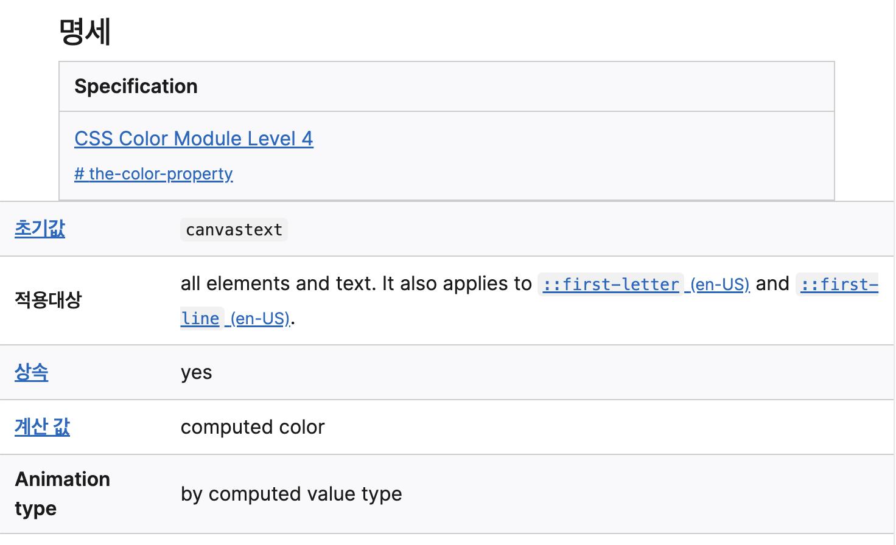
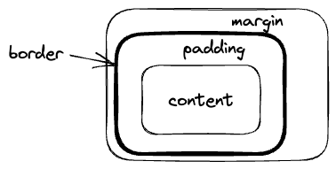

[MDN의 CSS 구성요소 파트](https://developer.mozilla.org/ko/docs/Learn/CSS/Building_blocks)를 읽고 정리하는 곳이다. CSS의 필수적인 이론들을 알아보는 파트이다.

# 1. 셀렉터

앞서 갖가지 셀렉터를 알아보았다. 이제 몇 가지 추가적인 지식을 알아보자. 셀렉터들의 기본 정의와 같은 것들은 이전 글에서 했으므로 넘어간다.

## 1.1. 범용 셀렉터

`*`를 사용하여 모든 요소를 선택할 수 있다. 이는 앞서 보았다시피 모든 요소를 선택한다. 하지만 모든 요소에 동시에 스타일링을 해야 할 일은 거의 없다. 그럼 어디 쓰일까?

가독성을 높이는 데에 쓰는 것이 하나의 예시가 될 수 있다. 만약 div의 후손 중 첫번째 자식인 요소에만 글씨를 굵게 하는 스타일링을 하고 싶다면 다음과 같이 쓸 수 있다.

```css
div :first-child {
  font-weight: bold;
}
```

하지만 이렇게 쓰면 `div:first-child` 즉 첫번째 자식인 div 태그를 선택하는 것과 혼동된다. 이때 범용 셀렉터를 사용하면 다음과 같이 쓸 수 있다.

```css
div *:first-child {
  font-weight: bold;
}
```

이렇게 하면 div의 후손 중 첫번째 자식인 요소를 선택하는 것을 더 가독성 높게 표현할 수 있다.

## 1.2. 클래스 셀렉터

특정 태그 중 특정 클래스를 가진 요소를 선택할 수 있다. 예를 들어 `div.box`와 같이 사용하면 div 태그 중 box 클래스인 요소들을 선택한다.

클래스 선택자를 붙여 씀으로써 여러 클래스를 동시에 가진 요소를 선택할 수도 있다. `.box.myclass`와 같이 쓰면 box 클래스와 myclass 클래스를 동시에 가진 요소를 선택한다. box나 myclass 둘 중 하나만 가진 요소는 선택되지 않는다.

## 1.3. 의사 클래스와 의사 요소

의사 클래스와 의사 요소 선택자를 함께 쓰는 것도 가능하다. 예를 들어서 다음 선택자를 보자.

```css
article p:first-child::first-line {
  font-size: 2em;
}
```

위 선택자는 article 태그의 첫번째 자식인 p 태그의 내용 중 첫번째 줄을 선택한다.

## 1.4. ::before와 ::after

content 속성과 함께 쓰여서, CSS를 이용해서 문서 내용을 삽입할 수 있는 유사 요소가 있다. 바로 `::before`와 `::after`이다. 이들은 각각 선택한 요소의 첫 자식, 마지막 자식으로 의사 요소를 하나씩 생성한다.

그리고 이렇게 요소를 선택한 후 content 속성을 이용해서 내용을 삽입할 수 있다. 예를 들어 다음과 같이 쓸 수 있다.

```css
.box::before {
  content: "before 텍스트";
}

.box::after {
  content: "after 텍스트";
}
```

이렇게 하면 box클래스를 가진 요소의 첫 자식, 마지막 자식으로 의사 요소가 삽입되고 그 내용으로 우리는 "before 텍스트", "after 텍스트"를 삽입했다.

기존 요소의 자식으로 삽입되는 것이므로 기존 요소의 스타일링을 따라간다. 예를 들어서 h1태그, p태그에 위를 적용하자.

```html
<p class="box">테스트 문단</p>
<h1 class="box">테스트 제목</h1>
```

그러면 같은 "before 텍스트", "after 텍스트"지만 부모의 스타일을 따라간다.


이를 이용해서 중요한 내용을 표시하는 것은 권장되지 않는다. 이렇게 삽입한 텍스트는 몇몇 스크린 리더에 의해 인식되지 못하며 유지보수도 힘들기 때문이다.

일반적으로는 링크의 끝에 화살표를 삽입하는 등, 스크린 리더에 읽힐 필요는 없지만 시각적인 표시를 할 때 쓰인다. 다음은 링크 끝에 화살표를 삽입하는 예시이다.

```css
a::after {
  content: "→";
}
```

그리고 이 유사 요소는 빈 문자열을 삽입하고 임의의 스타일링을 할 때도 쓰인다. 예를 들어서 문단 앞에 네모를 그리고 싶다면, before 유사 요소를 삽입하고 content 속성을 빈 문자열로 설정하고, 임의의 스타일링을 하면 된다.

```css
.box::before {
  display: block;
  width: 100px;
  height: 100px;
  background: teal;
  content: "";
}
```

꼭 빈 문자열을 content로 설정해야 하는 것을 주의하자. 그리고 width, height의 적용을 위해서는 display를 block으로 설정해야 한다.

# 2. 계단식 및 상속

## 2.1. 규칙 충돌

CSS에서 동일한 요소에 적용될 수 있는 규칙이 2가지 이상 있으면 어떻게 될까? 이런 상황을 제어하는 규칙은 계단식(cascade)과 우선순위이다.

계단식은 우선순위가 같은 규칙들이 하나의 요소에 적용될 때, CSS에서 마지막에 나오는 규칙이 적용됨을 뜻한다.

```css
// 이렇게 하면 h1 태그의 글자색은 나중에 선언된 purple이 적용된다.
h1 {
  color: red;
}

h1 {
  color: purple;
}
```

그럼 우선순위는? 기본적으로 선택자가 선택하는 요소가 얼마나 구체적인지에 따라 결정된다. 더 구체적인 선택자에 점수를 더 크게 매겨서, 큰 점수의 선택자를 적용한다. 예를 들어서 요소 선택자보다는 class 선택자가 구체적이다.

이렇게 CSS 적용 우선순위를 캐스캐이딩 순서(Cascading Order)라고 한다. 이 순서에는 3가지 규칙이 있다.

1. 중요도(Importance) 규칙 : CSS의 선언 위치에 따라 우선순위가 달라진다.
2. 명시도 : 대상을 더 구체적으로 선택하는 선택자가 우선순위가 높다.
3. 선언 순서 : 나중에 선언된 스타일이 우선적으로 적용된다.

### 2.1.1. 중요도 규칙

CSS의 선언 위치에 따른 우선순위는 다음 순서로 결정된다. 인라인 스타일이 최우선이다.

1. 인라인 스타일
2. head 요소 내의 style 요소에 정의된 스타일
3. head 요소 내의 style 요소에서 @import한 스타일
4. link 태그로 연결된 외부 스타일 시트
5. link 태그로 연결된 외부 스타일 시트에서 @import한 스타일
6. 브라우저 디폴트 스타일시트

### 2.1.2. 명시도

앞서 말했듯이 대상을 명확하게 특정한 선택자일수록 우선순위가 높다. 이를 명시도가 높다고 한다.

```
!important > 인라인 스타일 > 아이디 선택자 > 클래스/어트리뷰트/가상 선택자 > 태그 선택자 > 전체 선택자 > 상위 요소에 의해 상속된 속성
```

`!important`라는 게 있는 것을 볼 수 있다. 이는 모든 CSS 우선순위 계산을 무효화하며 특정 속성을 가장 구체적으로 만들어 일반적인 규칙을 무시한다. 하지만 정말 필요한 경우가 아니면 사용하지 않는 것이 좋디.

### 2.1.3. 선언 순서

상대적으로 나중에 선언된 스타일이 우선적으로 적용된다.

## 2.2. 상속

부모 요소에서 설정된 몇몇 CSS 속성은 자식 요소에도 상속된다. 예를 들어 color 속성을 설정한 요소가 있다면 그 자식 요소 역시 color 속성을 상속받는다. 만약 자식 요소에서 새로운 color 속성을 설정하지 않았다면 자식 요소에서도 부모 요소의 color가 나타난다.

이렇게 상속되는 속성의 여부는 CSS 속성 참조 페이지의 명세표에서 볼 수 있다. 예를 들어 [color 속성 페이지](https://developer.mozilla.org/ko/docs/Web/CSS/color#specifications)의 명세에는 다음과 같이 상속이 yes로 표시되어 있다. 



상속을 제어하기 위해 사용되는 특수한 속성 값도 있다.

- inherit : 해당 속성값을 부모 요소의 속성값과 동일하게 설정한다.
- initial : 해당 속성값을 기본값으로 설정한다.
- unset : 부모로부터 상속할 속성값이 있으면 상속받고, 없으면 기본값으로 설정한다.

```css
h1{
  color:inherit;
}
```

이렇게 하면 h1 태그의 글자색은 부모 요소의 글자색과 동일하게 설정된다.

그런데 color등의 개별 요소 말고, 요소의 모든 속성의 상속을 제어하고 싶을 수 있다. 이럴 때는 all 속성을 사용한다.

```css
h1{
  all:inherit;
}
```

h1 태그의 모든 속성을 부모 요소의 속성값과 동일하게 설정하였다.

# 3. cascade layer

CSS 캐스케이드와 명시도를 기반으로 하는 고급 기능, 캐스케이드 레이어를 소개한다.

요소에 적용된 각 CSS 속성에는 하나의 값만 있을 수 있다. 배경색이 빨간색이면서 파란색일 수는 없다. 개발자 도구의 '스타일'패널엔 검사 중인 요소에 적용된 모든 속성값이 적용된 셀렉터와 함께 표시된다. 이때 가장 우선순위가 높은 셀렉터의 속성값이 적용된다.

그리고 개발자 도구에선 요소에 적용되진 않았지만 선택한 요소와 일치하는 셀렉터의 속성값들도 취소선이 그어진 채 표시된다. 이는 캐스케이드 레이어에 의해 취소된 속성값들이다.

사이트가 더 복잡해지면 스타일시트의 소스 순서가 더 복잡해질 때가 많다. 이때 캐스케이드 레이어를 사용하면 CSS 선언을 더 쉽게 관리할 수 있다.

## 3.1. 캐스케이드란

캐스케이딩은 스타일들이 어떻게 적용되는지를 결정하는 방식이다. CSS를 렌더링하는 도구(ex. 브라우저)는 다음과 같은 방식을 통해 모든 요소의 모든 속성값을 어떻게 적용할지 결정한다.

1. 해당 요소를 선택하는 모든 선택자의 CSS 블록의 규칙들을 찾는다.
2. !important 속성을 가진 규칙과 아닌 규칙을 분리한다. !important가 붙은 속성이 우선이다.
3. 각각의 분리된 속성들에서 author, user, user-agent(브라우저 등) 규칙을 분리한다. author 규칙이 우선이다.
4. 지금까지 생긴 6개의 우선순위 버킷들을 캐스케이드 레이어 우선순위대로 정렬한다. 이 우선순위는 #5에서 설명한다.
5. 우선순위가 겹치는 선언들을 명시도로 정렬한다.
6. 지금까지의 모든 우선순위가 같은 스타일 선언들이 있다면 나중에 선언된 스타일을 우선적으로 적용한다.

이때 중간에 캐스케이드 레이어라는 것을 고려하는 걸 볼 수 있다. 이는 명시도를 통해서 CSS 우선순위를 구분하는 것보다 좀 더 협업에 좋은 방식을 제공한다. 이는 [블로그의 CSS 캐스케이드 레이어에 관한 글](https://www.witch.work/css-cascade-layer/)에 간략히 정리하였다.

# 4. 박스 모델

CSS의 모든 요소는 박스로 표현된다. 이 박스를 잘 이해하는 것은 레이아웃을 잘 구성하는 데에 도움이 된다.

## 4.1. 블록 박스와 인라인 박스

블록 박스는 다음과 같은 특성을 가진다.

- 기본적으로 가로폭 전체의 넓이를 가진다.
- width, height 속성이 적용된다.
- 블록 박스 다음에는 줄바꿈이 된다.
- 페이지 내에서 공간을 차지하여 다른 요소들을 밀어낸다.

인라인 박스 특성은 다음과 같다.

- 줄바꿈이 되지 않는다.
- width, height 속성이 적용되지 않는다.
- 패딩과 마진, border가 다른 인라인 박스들을 멀어지게 하지 않는다.

## 4.2. 디스플레이 유형

위의 블록 박스와 인라인 박스는 CSS의 display 속성으로 조절할 수 있다. 그런데 이 디스플레이 유형은 외부와 내부로 나누어진다. 내부 디스플레이 유형은 flex나 grid로, 박스 내부의 요소가 배치되는 방법을 나타낸다. 이러한 내부 디스플레이 유형은 이후에 레이아웃에 대해 배울 때 다룰 것이다.

지금은 외부 디스플레이 유형에 대해서만 다룰 것이다. 이는 앞서 말했듯 css display 속성을 사용해서 변경할 수 있다. 요소가 블럭인지 인라인인지를 정할 수 있다는 것이다.

```css
display: block;
display: inline;
```

## 4.3. CSS 박스 모델

CSS 박스 모델은 블록 박스에 완전히 적용되며 인라인 박스의 경우 박스 모델의 일부 동작만 사용한다.

블록 박스는 기본적으로 다음과 같이 구성된다.



margin은 border의 바깥쪽, padding은 border 안쪽의 여백을 나타낸다.

콘텐츠 박스는 width와 height로, 패딩 박스는 padding으로, 테두리 박스는 border로, 마진 박스는 margin으로 크기를 조절할 수 있다.

그리고 박스가 점유하는 전체 크기는 콘텐츠 박스 너비+패딩+테두리 로 계산된다. 즉, margin은 박스의 크기를 결정하지 않는다. 다음과 같은 CSS가 있다고 하자.

```css
.box{
  width: 100px;
  height: 100px;
  padding: 10px;
  border: 5px solid black;
  margin: 10px;
}
```

그러면 박스가 차지하는 너비는 130px이다. 그리고 이 중 실제 콘텐츠가 표시되는 너비는 100px(width)이다.

```
width 100px + padding 10*2px + border 5*2px = 130px
```

### 4.3.1. 대체 박스 모델

이는 표준 박스 모델의 경우이다. 대체 박스 모델도 존재한다. 이 모델에서는 우리가 설정한 width가 콘텐츠 박스 너비 + 패딩 박스 너비 + 테두리 박스 너비가 된다.

예를 들어 위의 CSS를 다시 보자.

```css
.box{
  width: 100px;
  height: 100px;
  padding: 10px;
  border: 5px solid black;
  margin: 10px;
}
```

이 경우 실제 콘텐츠 박스의 너비는 70px가 된다. 100px에서 패딩 박스 20px와 테두리 박스 10px를 뺀 값이다.

대체 박스 모델은 다음과 같이 설정할 수 있다.

```css
.box{
  box-sizing: border-box;
}
```

반대로 표준 박스 모델은 `box-sizing:content-box`로 설정한다.

만약 모든 요소가 대체 박스 모델을 사용하길 원한다면 다음과 같이 설정하자.

```css
html {
  box-sizing: border-box;
}
*, *::before, *::after {
  box-sizing: inherit;
}
```

### 4.3.2. 대체 박스 모델 선언에 대하여

위의 대체 박스 모델 선언에 의문이 들 수 있다. 왜 그냥 `*`를 쓰지 않을까? 다음과 같이 써도 되지 않은가?

```css
* {
  box-sizing: border-box;
}
```

그러나 이렇게 하면 의도치 않은 동작이 발생할 수 있다. 위와 같이 대체 박스 모델을 설정했는데 어떤 하나의 요소에 대해서 표준 박스 모델을 사용하고 싶다고 해보자. 그럼 우리는 다음과 같이 할 것이다.

```css
.my-box{
  box-sizing: content-box;
}
```

이 목적은 보통 my-box 클래스를 가진 요소 내에서는 표준 박스 모델을 사용하려는 것이다. 하지만 이렇게 하고 `my-box` 클래스를 가진 요소를 만들면 내부 요소는 여전히 대체 박스 모델을 사용한다.

```html
<div class="my-box">
  <header> <!-- 여전히 대체 박스 모델이 사용되고 있다. -->
    ...여러 요소들...
  </header>
</div>
```

따라서 최상단 요소인 html에 대체 박스 모델을 설정하고 `*`에 대해서는 box-sizing을 상속받도록 설정한다. 그것이 바로 다음 CSS이다.

```css
html {
  box-sizing: border-box;
}
*, *::before, *::after {
  box-sizing: inherit;
}
```

## 4.4. 마진/패딩

### 4.4.1. 마진

마진은 박스 주변에 여백을 만든다. 이때 margin은 양수뿐 아니라 음수가 될 수도 있다. 만약 마진이 음수이면 박스가 그쪽으로 밀려나게 된다.

마진 상쇄도 주의해야 한다. 마진이 서로 맞닿아 있는 2개의 요소가 있다면 그 여백들은 그 중 가장 큰 여백의 크기로 합쳐진다.

다음과 같이 2개의 박스를 만들고 css를 설정했다고 하자.

```html
<div class="box1">box 1</div>
<div class="box2">box 2</div>
```

```css
.box1 {
  margin-bottom: 20px;
}

.box2 {
  margin-top: 10px;
}
```

그러면 box1과 box2의 아래, 위 마진은 합쳐져서 둘 중에 큰 20px짜리 마진이 된다.

단 이런 마진 상쇄도 플로팅 요소, 절대 위치(`position:absolute`)를 지정한 요소에 대해서는 일어나지 않는다. 다음과 같은 3가지 상황에 일어난다.

- 두 개의 인접한 형제 요소의 맞닿은 margin 상쇄
- 부모 요소와 자식 요소를 분리하는 콘텐츠(테두리, 패딩, 콘텐츠, 자식의 height등)가 없을 경우 부모와 자손의 margin 상쇄
- 테두리, 패딩, 콘텐츠, height, min-height, max-height가 없는 빈 블록의 margin-top과 margin-bottom 상쇄

### 4.4.2. 패딩

패딩은 테두리와 콘텐츠 사이에 위치한다. 마진과 달리 음수 값을 가질 수 없다. 

## 4.5. 인라인 블록 디스플레이

display 항목 중 `inline-block`은 인라인 요소처럼 다른 요소와 같은 줄에 배치되지만(즉 줄바꿈 안 함), 블록 요소처럼 너비와 높이를 가질 수 있다. 공간을 차지하여 다른 요소가 박스에서 밀려나므로 겹침 현상도 피할 수 있다.

또한 이렇게 inline-block으로 설정된 요소는 크기를 갖춘 하나의 박스로서 기능하게 되므로 다른 블록의 패딩도 존중하게 된다.

어떤 문서에 링크 텍스트가 들어 있는데 이 텍스트를 줄바꿈 없이 배치하면서도 텍스트가 차지하는 영역을 확대하고 싶다면 이 `inline-block`을 사용하면 된다. a 태그는 원래는 인라인 요소이다.

# 참고

https://poiemaweb.com/css3-inheritance-cascading

https://stackoverflow.com/questions/6749569/css-which-takes-precedence-inline-or-the-class

https://css-tricks.com/inheriting-box-sizing-probably-slightly-better-best-practice/