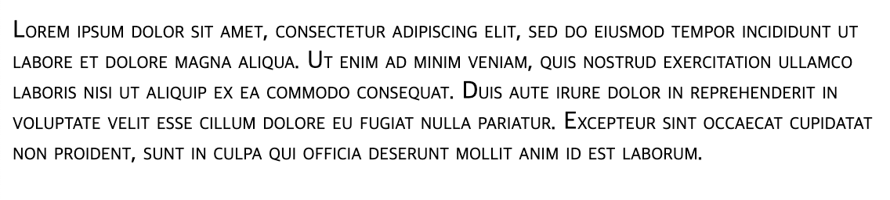
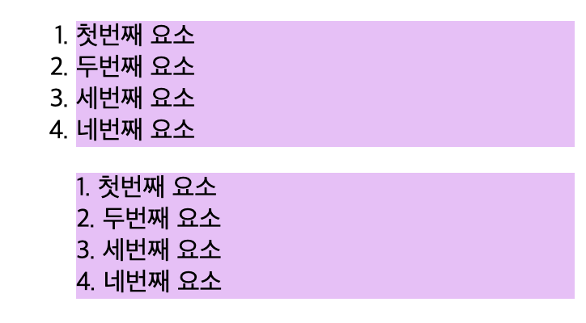

이제 텍스트를 스타일링하는 부분에 들어섰다. CSS삽질은 그래도 좀 해왔기 때문에 새로 알게 된 부분들만 간략히 정리하겠다.

# 1. 기본적인 텍스트 스타일링

요소 내의 텍스트는 마치 인라인 요소처럼 작동하고 CSS의 기본적인 스타일링 속성들을 적용할 수 있다. `::first-letter`등의 유사 요소를 사용해서 선택할 수도 있다. 이때 텍스트 스타일을 지정하는 CSS속성은 보통 2가지로 분류된다.

하나는 글꼴과 이탤릭체 등에 영향을 주는 글꼴 스타일이고 다른 하나는 텍스트의 위치와 간격, 정렬 등을 조절하는 텍스트 레이아웃 스타일이다.

## 1.1. 글꼴 스타일 기본

몰랐던 속성들만 간단히 정리한다.

text-decoration속성은 텍스트에 장식용 선을 추가한다. text-decoration-line, text-decoration-color, text-decoration-style, text-decoration-thickness속성의 단축 속성이다. underline, overline, line-through(취소선)등의 속성이 있다. 한번에 여러 스타일 적용도 가능하다.

```css
text-decoration: underline dotted blue 2px;
// 한번에 여러 스타일 적용
text-decoration: underline overline;
```

글꼴 크기는 px, em, rem 등으로 설정할 수 있는데 em은 부모 요소의 글꼴 크기를 기준으로 하고 rem은 루트 요소의 글꼴 크기를 기준으로 한다는 것을 기억하자. `rem은 루트 요소에서 속성을 가져온다`

따라서 rem을 쓸 수 있다면 rem을 쓰는 게 크기 계산을 더 간결하게 만든다. 그리고 기본 폰트 사이즈를 10px로 하는 것도 좋은 선택이다. 그렇게 하면 어떤 폰트 크기를 만들어야 할 때 rem 계산이 더 편해지기 때문이다.

font-style은 이탤릭체를 적용할 수 있게 한다. font-weight는 키워드나 숫자로 글꼴의 굵기를 지정할 수 있다.

text-transform은 텍스트를 대문자, 소문자, 대문자로 시작하는 형태로 바꿀 수 있다.

text-shadow는 그림자를 설정한다. 다음과 같이 설정한다

```css
// text-shadow: 텍스트와 그림자의 수평간격, 수직간격, 그림자의 흐린 반지름, 그림자의 색상
text-shadow: 2px 2px 2px #000;
```

텍스트와 그림자의 간격을 양수로 설정하면 그림자가 텍스트의 아래, 그리고 오른쪽에 위치하게 된다. 하지만 이 간격을 음수로 설정함으로써 그림자가 텍스트의 위 혹은 왼쪽에 위치하게 할 수도 있다.

또한 여러 그림자 값을 쉼표로 구분해서 전달하여 여러 그림자를 적용할 수도 있다.

```css
text-shadow: 2px 2px 2px #pink, -2px -2px 2px #purple;
```

## 1.3. 레이아웃 스타일 기본

text-align은 텍스트의 정렬을 설정한다. left, right, center, justify(양쪽 정렬)가 있다. justify는 자칫 이상한 디자인으로 연결될 수 있으므로 조심한다.

line-height는 말 그대로 한 줄의 높이를 설정한다. `line-height:20px`와 같이 단위를 사용해 설정할 수도 있지만 단위 없이 값만 줄 수도 있다. 이럴 경우 line-height는 font-size에 그 값을 곱한 값으로 적용된다. `line-height: 1.5`는 font-size가 10px일 때 `line-height: 15px`와 같다.

줄 높이가 적절히 높아서 줄 사이 간격이 있으면 가독성이 좋아진다. 따라서 줄 높이는 1.5~2.0 사이로 설정하는 것이 권장된다.

letter-spacing, word-spacing은 각각 글자 간의, 단어 간의 간격을 설정한다. 대부분의 길이 단위를 쓸 수 있다.

# 2. 다양한 텍스트 속성들

## 2.1. 텍스트 스타일 보충

### 2.1.1. font-variant

소문자를 작은 대문자로 바꿀 수 있는 속성이다. 이는 여러 가지 속성의 단축 속성이다. 몇 가지 눈에 들어오는 것을 살펴보았다. 이를 실험하기 위해서는 간단한 예제를 만들어야 한다. 로렘 입숨을 가져왔다.

```html
<p>
  Lorem ipsum dolor sit amet, consectetur adipiscing elit, sed do eiusmod tempor incididunt ut labore et dolore magna aliqua. Ut enim ad minim veniam, quis nostrud exercitation ullamco laboris nisi ut aliquip ex ea commodo consequat. Duis aute irure dolor in reprehenderit in voluptate velit esse cillum dolore eu fugiat nulla pariatur. Excepteur sint occaecat cupidatat non proident, sunt in culpa qui officia deserunt mollit anim id est laborum.
</p>
```

font-variant-caps는 대문자를 작은 대문자로 바꾼다. 이 속성을 적용하면 `Lorem`이 `lorem`으로 바뀐다.

```css
font-variant: small-caps;
```

이 결과물은 다음과 같다. 소문자들이 모두 작은 대문자로 표기되었다.



### 2.1.2. font-variant-ligatures

font-variant-ligatures는 두 글자를 하나의 모양으로 연결하는 것에 대한 속성이다. 예를 들어서 difficult와 같은 경우 몇몇 글꼴에서 ffi가 하나로 이어져서 표현된다. 이를 ligature라 한다.

다음과 같이 속성을 설정하면 그런 현상이 일어나지 않게 된다.

```css
font-variant-ligatures: none;
```

### 2.1.3. 기타

이외에도 동아시아 문자들의 표현을 위한 font-variant-east-asian, 숫자의 다른 표현(예를 들어 숫자 0의 내부에 사선을 긋는 등)font-variant-numeric 등이 있다.

## 2.2. font-kerning

글자 간의 간격을 조절하는 속성이다. 그런데 단순히 글자 간의 간격을 조절하는 것이 아니라 글자의 모양에 따라서 글자 간의 간격을 조절한다.

예를 들어서 `AV`와 같은 글자의 경우 A와 V 사이의 간격이 조금 좁아짐으로써 자연스러워 보일 수 있다. 이런 것을 kerning이라 한다.

```css
// 브라우저에 kerning을 맡긴다
font-kerning: auto;
// kerning을 적용하지 않는다
font-kerning: none;
// kerning을 적용한다
font-kerning: normal;
```

## 2.3. font-stretch

글자를 늘려서 좁게, 혹은 넓게 설정한다.

```css
// 글자를 늘린다
font-stretch: expanded;
// 글자를 좁힌다
font-stretch: condensed;
// 백분율로 글자를 늘린다. 50%~200%
font-stretch: 150%;
```

## 2.4. text-underline-position

밑줄의 위치를 설정한다. `text-underline-position: under;`와 같이 under를 설정하면 텍스트의 밑줄이 텍스트 아래첨자보다도 아래로 내려간다.

auto로 설정하면 브라우저가 알아서 밑줄 위치를 결정한다.

## 2.5. text-indent

텍스트의 들여쓰기를 설정한다. 음수 값도 사용할 수 있다. 음수 값을 적용하면 들여쓰기할 텍스트가 왼쪽으로 밀려진다.

## 2.6. text-overflow

텍스트가 너무 길어서 텍스트가 넘치는 경우에 대한 처리 방법을 설정한다. 

`text-overflow: ellipsis;`와 같이 ellipsis를 설정하면 텍스트가 넘치면 `...`으로 표시한다.

`text-overflow: clip;`와 같이 clip을 설정하면 넘치는 텍스트를 잘라낸다.

text-overflow 속성은 텍스트가 넘치도록 만들지는 않는다. 자동으로 줄바꿈이 일어나기 때문이다. 따라서 오버플로우를 의도적으로 일으키고 싶다면 `white-space: nowrap;`과 같이 설정해야 한다.

## 2.7. white-space

요소가 공백을 처리하는 방법을 설정한다. 이러한 공백은 띄어쓰기, 들여쓰기, 줄바꿈이 대표적이다. 그런데 이런 공백들이 연속해서 나오더라도, 브라우저는 보통 이를 하나의 공백으로 합쳐 버린다.

이는 `white-space: normal;`이 기본값이기 때문이다. 연속된 공백을 하나로 합치고 줄바꿈은 자동으로 일어난다. `&nbsp;`나 `<br/>`을 쓰지 않는 이상 연속 공백이나 수동 줄바꿈은 불가능하다.

`white-space:nowrap`으로 설정하면 텍스트가 요소의 너비를 넘어가더라도 자동 줄바꿈이 일어나지 않는다. `overflow:hidden; text-overflow: ellipsis;`와 같이 설정하여 넘치는 텍스트도 `...`으로 표시하는 패턴도 많이 쓴다.

pre로 설정하면 HTML 문서의 연속된 공백들을 그대로 유지한다. pre-wrap도 마찬가지로 연속 공백들을 보존하지만 텍스트 내의 긴 행이 있으면 자동 줄바꿈을 한다. pre-line은 줄바꿈은 그대로 유지하고 연속 공백은 병합한다.

## 2.8. word-break

텍스트가 박스 밖으로 넘쳐나올 때 어떻게 줄을 바꿀지에 대해 지정한다. break-all을 지정하면 텍스트 넘침을 방지하기 위해 단어를 쪼개서 줄을 바꾼다.

keep-all은 CJK 텍스트를 위한 속성인데 지금 볼 필요는 없을 듯 하다.

# 3. 목록 스타일링

`<ul>`과 `<ol>`태그는 각각 순서 없는 목록, 순서 있는 목록을 만드는 태그인데 페이지를 만들다 보면 매우 자주 사용하게 된다. 이에 연관된 CSS 속성들을 간단히 정리한다.

## 3.1. list-style-type

목록에 쓰이는 기호를 설정한다. 예를 들어서 `list-style-type: circle;`와 같이 설정하면 순서 없는 목록에 원형 기호가 쓰이게 된다. 또는 `list-style-type: upper-roman;`과 같이 설정하면 순서 있는 목록의 순서를 나타낼 때 대문자 로마 숫자가 쓰이게 된다.

```css
ol {
  list-style-type: upper-roman;
}
```

## 3.2. list-style-position

목록은 특별히 설정하지 않으면 각 요소의 시작에 기호가 붙게 된다. 이 기호를 각 목록 요소의 어떤 상대적 위치에 붙일 것인지를 설정한다. 

일반적으로는 outside을 사용하는데 이는 기호가 목록 요소와 상관없는 바깥에 위치하며 목록 요소의 내용과 분리되어 있다는 뜻이다. 이렇게 list-style-position이 outside로 설정된 목록을 만들어 보면, 목록 기호가 목록 박스의 패딩 안에 들어가 있어서 목록과는 실제로 분리되어 있는 것을 볼 수 있다.

inside를 사용하면 기호가 목록 요소의 내부에, 목록 요소 내용의 첫번째 글자로 등장한다는 뜻이다. 즉 목록 기호가 박스의 패딩에 들어가 있었던 outside와 달리 목록 기호가 목록 박스 안에 들어가 있게 된다.

실제로 확인해 보자. 다음과 같이 css를 작성해서 마진과 패딩을 제외한 오로지 내용에만 색을 입혀 보자.

```css
ol{
  background-clip: content-box;
  background-color:#eebefa;
}

.bullet-outside{
  list-style-position:outside;
}

.bullet-inside{
  list-style-position:inside;
}
```

그리고 다음과 같이 HTML을 작성하자.

```html
<ol class="bullet-outside">
  <li>첫번째 요소</li>
  <li>두번째 요소</li>
  <li>세번째 요소</li>
  <li>네번째 요소</li>
</ol>

<ol class="bullet-inside">
  <li>첫번째 요소</li>
  <li>두번째 요소</li>
  <li>세번째 요소</li>
  <li>네번째 요소</li>
</ol>
```

그러면 다음과 같이 outside과 inside의 차이를 확인할 수 있다.



## 3.3. list-style-image

목록 기호를 이미지로 직접 설정할 수 있다.

```css
ol{
  list-style-image: url(bullet.svg);
}
```

그러나 이렇게 하면 기호의 크기 조절 등 제한되는 부분들이 있다. 따라서 기호를 이미지로 사용하고 싶다면 background 속성을 이용하는 것이 낫다. 과정은 다음과 같다.

1. list-style-type을 none으로 설정하여 기호를 없앤다.
2. li 태그에 padding을 삽입하여 기호가 들어갈 공간을 만든다.
3. background-image로 기호 이미지를 삽입한다.
4. background-position으로 기호 이미지의 위치를 조정한다. 보통 요소의 시작에 위치하므로 0 0 이 좋다.
5. background-repeat:no-repeat로 기호 이미지가 한번만 나타나도록 한다.
6. background-size로 기호 이미지 크기를 적절히 조정한다.

## 3.4. shorthand

list-style 키워드로 위 3가지를 모두 지정할 수도 있다.

```css
ol{
  list-style: outside circle url(bullet.svg);
}
```

## 3.5. 목록 요소 속성

목록 요소에는 몇 가지 속성이 있다. 순서가 있는 목록에서 목록의 시작을 1 말고 다른 숫자로 하고 싶다든지 할 때 사용할 수 있다.

start 속성은 목록을 셀 때 시작하는 숫자를 달리한다. 

```html
<ol start="3">
  <li>첫번째 요소</li>
  <li>두번째 요소</li>
  <li>세번째 요소</li>
  <li>네번째 요소</li>
</ol>
```

reversed 속성을 지정하면 목록이 거꾸로 세어진다.

li 태그에 value 속성을 지정하여 특정 순서를 갖도록 강제할 수도 있다. 그러면 그 다음 순서도 자동으로 증가한다. 다음과 같이 작성하면 순서가 `1,2,7,8`로 표시된다.

```html
<ol>
  <li>첫번째 요소</li>
  <li>두번째 요소</li>
  <li value="7">세번째 요소</li>
  <li>네번째 요소</li>
</ol>
```

# 참고

https://www.daleseo.com/css-white-space/

https://www.daleseo.com/html-nbsp/