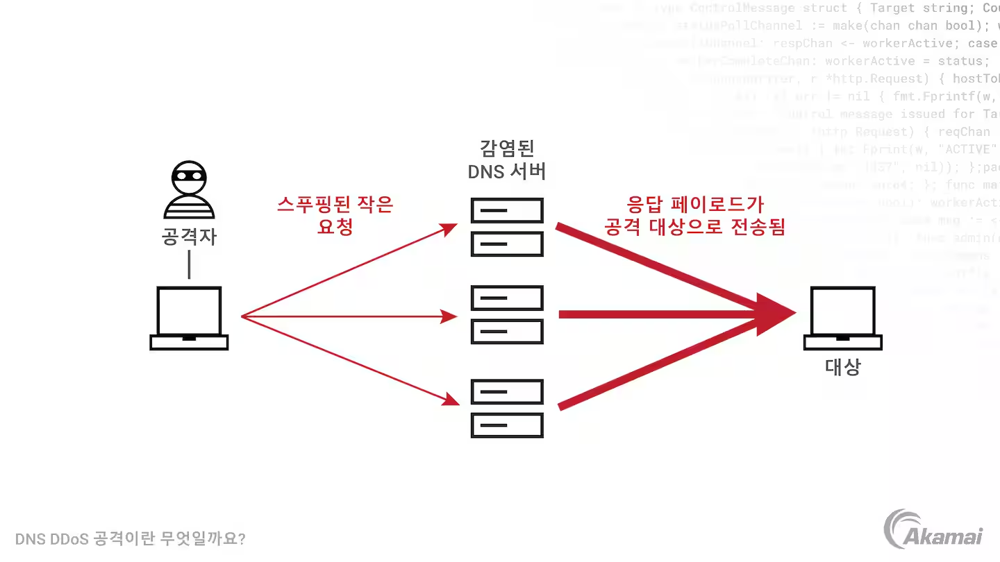

부족한 네트워크 지식, 그리고 찾아야 할 키워드를 알아냄에 있어서 홈 서버 관련 블로그를 운영하는 지인 [불칸](https://vulcan.site/)의 큰 도움을 받았다.

# 시작

이번 글에서는 DNS에 관해 조사하면서 알게 되었으나 이전 글들의 자연스러운 흐름을 위해 다루지 못했던 내용들을 넣었다. DNS의 역사와 보안 고려사항, 면접에서 받았던 질문들을 정리했다.

# DNS가 나오기까지

현재의 인터넷은 1981년에 나온 RFC 791 Internet Protocol에 기반하고 있다. 이 RFC는 오늘날 IPv4라고 불리는 32비트 주소 형식과 이를 이용한 통신을 정의하여 인터넷 프로토콜의 기본적인 동작을 구성했다.

이런 주소만 가지고는 대상을 찾기 어렵다는 게 문제였다. 예를 들어 `163.239.1.1`이라는 IPv4 주소는 서강대학교에 할당되어 있다. 하지만 이 주소를 보고 서강대학교를 떠올리기는 어렵다. 그래서 등장한 게 호스트 이름이다. `sogang.ac.kr` 같은 호스트 이름을 사용하면 훨씬 기억하기 쉽고, 사람도 이해하기 쉬운 주소가 된다. 그럼 이걸 어떻게 IP 주소와 매핑할까? 이에 대한 아이디어가 발전하면서 DNS가 등장한다.

## HOSTS.TXT

인터넷의 초기에는 이 호스트 주소와 IP 주소를 매핑하는 파일을 모두가 공유했다. 이 파일은 `HOSTS.TXT` 파일이라고 불렸는데 이건 인터넷의 전신인 ARPANET에서부터 사용된 이름이었다.

인터넷에서도 쓰이게 된 이 파일은 ARPANET부터 많은 영향을 미친 기관 중 하나인 SRI-NIC(Stanford Research Institute Network Information Center)에서 관리했다. `HOSTMASTER@SRI-NIC`에 메일을 보내는 방식으로 이 파일을 업데이트할 수 있었다고 한다.

이 파일의 구체적인 관리와 형식에 대해서는 [RFC 952](https://www.rfc-editor.org/rfc/rfc952.txt)에 설명되어 있다. 그리고 이때 쓰이던 [HOSTS.TXT 파일은 HOSTS.TXT archive](https://github.com/ttkzw/hosts.txt?tab=readme-ov-file)에서 볼 수 있다. `KOREA-EMH`처럼 한국의 호스트로 추정되는 이름도 찾아볼 수 있다.

이렇게 인터넷 초기에는 호스트 이름과 IP 주소의 매핑을 수동으로 관리했다. 이 방식을 `HOSTS.TXT` 방식이라고 부르며 지금도 많은 OS에 `/etc/hosts` 파일로 남아 있다.

```bash
# 터미널에서 /etc/hosts 확인하기
$ cat /etc/hosts
127.0.0.1	localhost
255.255.255.255	broadcasthost
::1             localhost
# ...
```

## DNS의 등장

인터넷이 커지면서 이 방식은 당연하게도 한계에 부딪친다. 중복 등을 막아야 했으므로 `HOSTS.TXT` 파일 관리에 필요한 비용은 점점 커졌지만 이런 관리에 많은 자원을 써야 한다는 개념이 없던 시대였다. 또 이렇게 중앙에서 관리하는 방식은 인터넷의 분산 구조와도 맞지 않았다.

인터넷의 역할도 변했다. 과거에 인터넷이라는 존재는 대형 시분할 시스템을 가진 기관들을 연결하는 하나의 네트워크였다. 하지만 컴퓨터는 기관에서 운영하는 시분할 시스템이 아니라 개인이 소유하는 물건이 되었다. 인터넷 또한 이런 개인용 컴퓨터들을 연결하는 로컬 네트워크들을 연결하는 네트워크로 발전했다. 이런 변화에 맞추기 위해서는 인터넷의 호스트 이름과 IP 주소를 관리하는 방식도 바뀌어야 했다.

그래서 인터넷의 선구자 그룹에 있던 존 포스텔(John Postel)과 폴 모카페트리스(Paul Mockapetris)가 DNS를 제안했다. DNS는 Domain Name System의 약자로, 호스트 이름과 IP 주소를 매핑하는 분산형 데이터베이스 시스템이다. DNS는 1983년에 RFC 882와 RFC 883로 처음 정의되었고, 이후 RFC 1034와 RFC 1035로 발전했다. DNS 시스템이 실용적으로 쓰이기 시작한 건 대략 1985년부터였다.

# DNS와 보안

DNS 또한 서버이고 네트워크이므로 공격의 대상이 될 수 있다. 이러한 공격 중 일부와 방어하기 위해 사용하는 기술을 간단히 알아보자.

## DNS 반사 공격

앞서 DNS 서버는 계층 구조에서의 위임을 NS 레코드를 통해 처리한다고 했다. 어떤 DNS 서버가 다른 DNS 서버에 질의를 넘길 때는 위임할 DNS 서버의 호스트 이름을 담은 NS 레코드와 질의를 위임받을 DNS 서버의 IP 주소를 담은 A 레코드를 함께 응답한다. 그런데 이 원리가 악용되어 공격에 쓰일 수 있다.

DNS는 UDP 프로토콜을 사용한다고 했다. 그런데 UDP의 문제는 IP 패킷의 주소를 속이는(IP Spoofing)데 취약하다는 것이다. 따라서 송신 IP 주소를 속이면 공격자의 DNS 서버에서 보낸 DNS 질의에 대한 응답이 다른 곳으로 향하도록 할 수 있다. 이때 DNS 서버가 질의보다 훨씬 큰 응답을 보내도록 해서 공격 패킷을 증폭시킨다.

예를 들어 질의의 호스트 이름은 `.`, 타입은 NS로 해서 질의를 보낸다면 공격당하는 쪽에서는 질의의 크기보다 훨씬 큰 응답을 받게 된다. 정량적으로는 약 60바이트의 질의로 512바이트 이상의 공격 패킷을 보낼 수 있다고 한다.[^1]



이런 공격을 막는 가장 기본적인 방법은 DNS 서버에서 접근할 수 있는 리졸버의 IP 주소를 제한하는 것이다. 가령 풀 리졸버를 직접 설정한다면 localhost에서 온 질의만 받아들이도록 설정하는 걸 생각해 볼 수 있다. 

하지만 제3자에게 받은 DNS 질의도 받아들이는 공용 DNS 리졸버 혹은 DNS 서버에서는 따로 DNS 반사 공격을 막는 다양한 장치를 둔다. IP Spoofing을 막는 장치를 둘 수도 있고, 가능한 최대 DNS 응답을 달라는 요청인 `ANY` 요청을 비활성화하는 방식도 있다. 혹은 부하 수집을 바탕으로 특정 리졸버나 클라이언트의 질의를 대기시키기도 한다. 더 자세한 방식은 [America's Cyber Defense Agency의 DNS 증폭 공격 문서](https://www.cisa.gov/news-events/alerts/2013/03/29/dns-amplification-attacks)에서 찾아볼 수 있다.

## DNSSEC(DNS Security Extensions)

DNS 서버에 DDoS 공격을 가하거나 클라이언트가 정상적이지 않은 DNS 서버에 질의를 보내도록 해서 사용자가 악의적인 IP 주소를 응답으로 받게 하는 등의 공격이 가능하다. [DNS 캐시 포이즈닝](https://www.cloudflare.com/ko-kr/learning/dns/dns-cache-poisoning/)과 같은 기법들이 있다.

이 공격이 성공할 시 사용자는 아무것도 알아채지 못한 채 악의적인 IP 주소에서 받은 웹사이트에 접속하게 된다. 이런 공격을 방지하기 위해 DNSSEC(DNS Security Extensions)이라는 확장 기능이 있다.

DNSSEC은 DNS 응답을 검증하는 확장 기능이다. 정상적인 출처에서 왔는지를 확인하기 위해서. DNSSEC은 암호화된 서명이 들어 있는 RRSIG 등의 새로운 DNS 레코드 유형을 추가하여 DNS 레코드 응답이 적절한 책임 DNS 서버에서 왔으며 전송 중에 변경되지 않았음을 검증 가능하게 한다. 공개키 암호화 방식을 사용한다.

이 과정은 다음과 같이 이루어진다. 같은 레이블과 유형의 레코드들을 자원 레코드 집합(resource record set, RRSet)으로 묶고 여기에 대한 디지털 서명을 생성하여 RRSIG 레코드로 저장한다. 이 서명을 검증하는 데에 필요한 공개키는 DNSKEY 레코드로 저장한다.

위에서 설명한 DNS 서버의 계층 구조에 접근할 때 각 단계의 상위 계층에서 하위 계층의 레코드가 변경되지 않았음을 검증하는 방식으로 신뢰를 구축한다. 여기에는 DNSKEY의 해시를 저장하는 DS 레코드가 사용된다.

이를 종합하면 DNSSEC이란 로컬 DNS 서버가 DNS 레코드 응답을 받았을 때 RRSIG 서명을 DNSKEY로 검증하며 상위 DNS 서버의 DS 레코드를 통해 하위 DNS 서버의 레코드가 변경되지 않았음을 검증하는 방식으로 DNS 응답의 출처와 무결성을 검증하는 것이다.

이런 식으로 상위 DNS 서버에서 하위 DNS 서버의 레코드를 검증하는 식으로 하면 문제 하나가 있다. 루트 DNS 서버의 정보를 검증할 상위 계층이 없다는 것이다. 따라서 루트 DNS 서버를 검증할 수 있는 서명은 전세계에서 선발된 14명의 사람이 모여서 루트 DNSKEY RRset에 서명하는 [루트 서명식](https://www.cloudflare.com/ko-kr/learning/dns/dnssec/root-signing-ceremony/)에서 결정된다.

이 암호화와 검증 과정은 상당히 복잡하고 내가 생각하던 기본적인 DNS의 동작 방식과는 연관이 적기 때문에 간단히만 설명했다. 더 자세한 내용은 [DNSSEC는 어떻게 작동하나요?](https://www.cloudflare.com/ko-kr/learning/dns/dnssec/how-dnssec-works/), [DNSSEC란 무엇이며 어떻게 작동하나요?](https://www.akamai.com/ko/blog/trends/dnssec-how-it-works-key-considerations) 등을 참고할 수 있다.


# 이외의 DNS 관련 정보

## DNS와 웹 서버 부하 분산

DNS 서버는 여러 개의 IP 주소를 응답으로 보내줄 수 있다. 여러 IP를 가진 웹 서버의 경우 이걸 이용해서 각 IP 주소 서버의 부하를 분산시키려는 시도를 할 수 있다.

"google.com"같이 많이 쓰이는 도메인의 경우 여러 다른 IP를 가지고 있다. 이걸 DNS 서버가 응답할 때 순환식으로 보내주는 것이다. 예를 들어 "google.com"의 IP 주소가 3개 있다고 가정하자. 이 경우 DNS 서버는 다음과 같이 첫번째에는 `IP 1, IP 2, IP 3` 순서로 응답하고 두번째에는 `IP 2, IP 3, IP 1`, 세번째에는 `IP 3, IP 1, IP 2` 순서로 응답하도록 한다.

```
첫번째 질의 응답           두번째 질의 응답        ....
+-----------------+    +-----------------+
| IP 주소 1        |    | IP 주소 2        |
+-----------------+    +-----------------+
| IP 주소 2        |    | IP 주소 3        |
+-----------------+    +-----------------+
| IP 주소 3        |    | IP 주소 1        |
+-----------------+    +-----------------+
```

클라이언트는 보통 이렇게 IP 주소 여러 개를 받으면 그 중 첫 번째 IP 주소로 HTTP 요청을 보낸다. 따라서 웹 서버를 운영하는 측에서는 이 방법으로 각 서버에 오는 요청 부하를 분산시킬 수 있다.

## DNS는 애플리케이션 계층

네트워크의 구성을 나타낼 때 흔히 OSI 7계층 모델을 사용한다. 그러면 DNS 프로토콜은 이 OSI 7계층 모델에서 어떤 계층에 속할까? 

개인적인 경험으로는 면접 때 이 질문을 받았는데 몰라서 쩔쩔맸던 기억이 있다. 이제 와서 알았지만 DNS는 7계층, 애플리케이션 계층의 프로토콜이다.

애플리케이션 계층은 사용자가 가장 가까이 접하는 계층이다. 우리가 보통 생각하는 네트워크의 기능이란 네트워크 상에 있는 서로 다른 종단(Edge)간에 데이터를 주고받는 것이며 애플리케이션 계층은 바로 그런 종단들 간에 데이터를 담은 메시지를 주고받는 프로토콜을 정의하기 때문이다. 대표적으로 다음과 같은 내용을 정의한다.

- 어떤 메시지를 주고받는지(요청 메시지, 응답 메시지 등)
- 여러 메시지 타입을 구성하는 문법
- 메시지에 들어 있는 각 필드의 의미
- 프로세스가 언제, 어떻게 메시지를 전송하고 응답할지

DNS 프로토콜의 특징은 이런 애플리케이션 계층의 정의에 딱 들어맞는다. 클라이언트와 DNS 서버라는 서로 다른 네트워크 종단 간에 어떤 메시지를 어떻게 주고받는지를 정의하기 때문이다.

또한 DNS 메시지는 포트 53을 사용하고 UDP 프로토콜을 통해 전송되는데 UDP는 전송 계층의 프로토콜이다. 이 또한 DNS가 추상화 레이어 상에서 전송 계층의 상위에 존재한다는 뜻이므로 DNS가 애플리케이션 계층 프로토콜임을 뒷받침한다. 물론 OSI 7계층에서는 전송 계층과 애플리케이션 계층 사이에 세션 계층과 표현 계층이 있지만 보통 5,6,7계층의 구분은 명확하지 않다. 이때 애플리케이션 계층과 전송 계층 사이에는 소켓이 인터페이스 역할을 한다.

DNS 프로토콜은 HTTP나 메일에 쓰이는 SMTP처럼 사용자가 쓰는 애플리케이션과 직접 관련이 있는 건 아니다. 대신 DNS는 인터넷 구조의 복잡성을 네트워크 사용자에게 숨기고, 사용자가 편리하게 호스트 이름을 사용할 수 있도록 해주는 역할을 한다. 하지만 그 동작을 보면 애플리케이션 계층 프로토콜의 특징을 잘 보여준다.

# 참고

[Paul V. Mockapetris, Kevin J. Dunlap, Development of the Domain Name System](https://www.cs.cornell.edu/people/egs/615/mockapetris.pdf)

James F. Kurose, Keith W. Ross 지음, 최종원, 강현국, 김기태 외 5명 옮김, 컴퓨터 네트워킹 하향식 접근, 8판

기술평론사 편집부 엮음, 진명조 옮김, 인프라 엔지니어의 교과서 시스템 구축과 관리편, 5장 '최신 DNS 교과서

cloudflare, DNSSEC는 어떻게 작동하나요?

https://www.cloudflare.com/ko-kr/learning/dns/dnssec/how-dnssec-works/

cloudflare, DNSSEC 루트 서명식

https://www.cloudflare.com/ko-kr/learning/dns/dnssec/root-signing-ceremony/

IBM Technology, "What is DNSSEC (Domain Name System Security Extensions)?"

https://www.youtube.com/watch?v=Fk2oejzgSVQ

DNS DDoS 공격이란 무엇일까요?

https://www.akamai.com/ko/glossary/what-is-a-dns-ddos-attack

[^1]: 기술평론사 편집부 엮음, 진명조 옮김, 인프라 엔지니어의 교과서 시스템 구축과 관리편, 271p