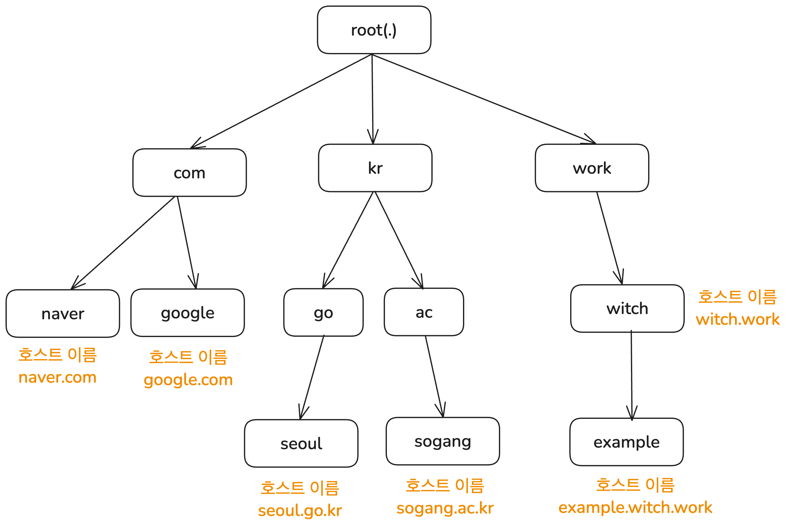
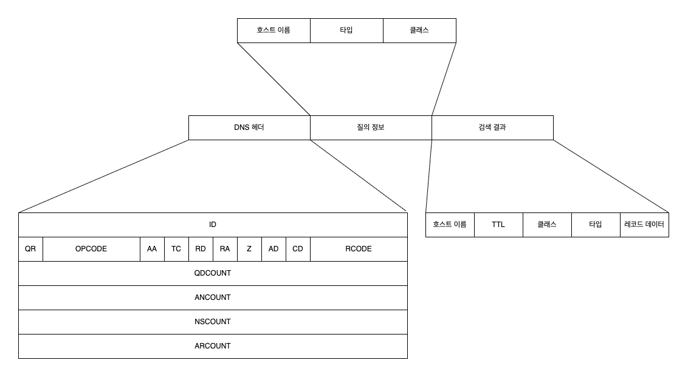
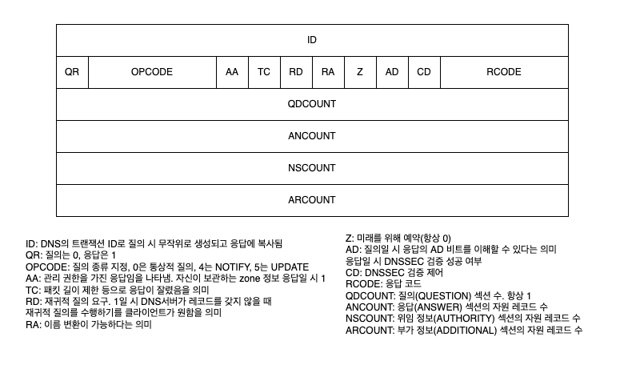

부족한 네트워크 지식, 그리고 찾아야 할 키워드를 알아냄에 있어서 홈 서버 관련 블로그를 운영하는 지인 [불칸](https://vulcan.site/)의 큰 도움을 받았다.

# DNS 탐구 시리즈

- [DNS 탐구 1편 - 도메인 이름이 IP 주소로 변환되는 DNS 요청의 흐름](/posts/network-how-dns-works)
- [DNS 탐구 2편 - DNS는 어떻게 구성되어 있을까?](/posts/network-how-dns-structured)
- [DNS 탐구 3편 - DNS에 관한 기타 정보들](/posts/network-dns-misc-info)

# 시작

[이전 글](/posts/network-how-dns-works)에서는 DNS가 어떻게 우리의 요청을 처리하는지, DNS 서버에 메시지를 보내는 리졸버와 DNS 서버의 처리 과정을 살펴보았다.

이번 글에서는 DNS가 정말로 어떤 구조로 되어 있는지 좀 더 자세히 알아보자. 어떻게 정보를 저장하고 어떤 형식으로 메시지를 주고받으며 어떻게 부하를 줄이는지 말이다.

# DNS 서버의 구성

DNS의 구성 요소는 DNS 서버와 리졸버 2개이다. DNS 서버는 정보를 저장하는 저장소 역할로 보유한 정보를 바탕으로 질의에 응답한다. 리졸버는 사용자 프로그램과의 인터페이스 역할을 하며 찾고자 하는 정보를 가진 서버를 탐색해 질의를 보내는 알고리즘을 구현한다.

그런데 리졸버가 어떻게 적절한 DNS 서버를 찾고 질의를 보내는지는 1편에서 자세히 설명했다. 그러니 이번 글에서는 DNS 서버의 구조와 정보 저장 방식에 대해 알아보자.

## DNS의 이름 계층 구조

모든 호스트 이름은 인터넷 전체에서 유일해야 한다. `witch.work`라는 도메인 이름을 갖는 사이트가 여러 개라면 곤란하다.

DNS 서버는 이 유일함을 보장하기 위해 내부 이름 공간(name space)을 가변 깊이의 트리 구조로 구성했다. 트리의 각 노드는 하나의 레이블(label)을 갖고 있도록 했다. 각 레이블은 63문자 이하라는 제한이 있다.

그리고 노드의 호스트 이름은 트리의 루트부터 해당 노드까지의 레이블을 점(`.`)으로 연결하여 구성한다. 예를 들어 `witch.work`는 `work` TLD(Top Level Domain) 아래에 있는 `witch` 노드의 호스트 이름이다. 이렇게 하면 각 노드의 호스트 이름이 인터넷 전체에서 유일함을 보장할 수 있다.



단 호스트 이름이 유일하다는 게 DNS 서버 상에 해당 호스트 이름을 갖는 레코드가 하나뿐이라는 건 아니다. 다음 섹션에서 자세히 살펴보겠지만 하나의 호스트 이름은 DNS 서버 내의 여러 개의 정보와 매핑될 수 있다.

## 관리의 위임

이전 글에서 DNS는 계층 구조로 되어 있다고 했다. 그럼 각 계층은 어디서 관리할까? 먼저 루트 DNS 서버는 ICANN(Internet Corporation for Assigned Names and Numbers) 소속의 IANA(Internet Assigned Numbers Authority)에서 관리한다.

분산형 데이터베이스인 DNS답게 루트 DNS 서버도 중앙에 하나만 존재하는 게 아니다. 루트 DNS 서버는 12개의 다른 기관에서 관리되는 13개의 서버로 구성되어 있으며 전세계에 1000개 이상의 인스턴스(복사본)가 퍼져 있다.

그 바로 하위의 TLD DNS 서버는 원래 SRI-NIC에서 관리했다. 하지만 이제는 각국의 여러 기관이 위임받아 관리하고 있다. 예를 들어 `.com` TLD는 미국의 VeriSign에서, `.kr` TLD는 한국인터넷진흥원 산하 KRNIC에서 관리한다.

이렇게 DNS는 하위 계층 관리를 다른 조직에 위임할 수 있다. 위임되는 단위를 존(Zone)이라고 부르는데, 위에서 본 계층 구조 트리의 서브트리라고 보면 된다. 존을 위임받은 조직은 각자의 정책을 세워서 해당 존을 관리할 수 있다. 예를 들어 `.gov` TLD를 관리하는 기관에서는 이 TLD를 사용하는 조직을 미국 정부 기관으로 한정한다.

# DNS 서버의 정보 저장

DNS 서버가 계층적으로 구성된다는 건 알았다. 그럼 DNS 서버는 어떤 정보를 어떻게 저장하고 있는 걸까?

## 자원 레코드

DNS 서버는 호스트 이름에 다양한 정보를 매핑한다. IP 주소일 때도 있고 해당 호스트 이름의 책임 DNS 서버의 호스트 이름이기도 하고 별칭 호스트 이름이기도 하다. 그럼 서버는 이를 어떻게 저장할까?

DNS 프로토콜은 호스트 이름에 연결될 수 있는 데이터 형식을 제한하지 않고 있다. 하지만 클라이언트와 서버 간의 질의와 응답이 제대로 이루어지려면 최소한의 데이터 형식은 필요하다. 이를 자원 레코드(Resource Record, RR)라고 부른다. 

DNS 서버는 호스트 이름, 타입, 클래스를 키로 하고 타입별로 정해진 형식의 값을 보관한다. DNS 서버는 이 정보를 저장하고 있다가 질의가 들어오면 해당 키에 대한 대한 정보를 찾아서 응답한다. 이때의 키-값 쌍이 바로 자원 레코드이다. 우리가 브라우저에서 다른 사이트에 접속할 때 늘 일어나는 동작인 호스트 이름과 IP 주소를 매핑하는 것도 자원 레코드를 통해서 한다.

자원 레코드는 다음과 같은 형식으로 정보를 담고 있다.

```
<Name> <TTL> <Class> <Type> <Value>
```

`<Name>`, `<Value>`의 의미는 `<Type>`에 따라 다르다. 주로 쓰이는 레코드 타입과 거기 대응되는 Name, Value의 의미는 다음과 같다. 더 많은 레코드 타입에 대해서는 [Cloudflare의 DNS 레코드 개요](https://www.cloudflare.com/ko-kr/learning/dns/dns-records/)에서 볼 수 있다.

- A: Name은 호스트 이름, Value는 IPv4 주소
- AAAA: Name은 호스트 이름, Value는 IPv6 주소
- NS: Name은 도메인, Value는 해당 도메인의 호스트에 대한 IP 주소를 가진 DNS 서버의 호스트 이름
- CNAME: Canonical Name의 약자. Name은 별칭 호스트 이름, Value는 원본 호스트 이름
- MX: Name은 도메인, Value는 `Name`을 별칭으로 갖는 메일서버의 원본 호스트 이름

`<TTL>`은 Time To Live의 약자로 이 레코드가 얼마나 오랫동안 유효한지를 나타낸다. 즉 캐시에서 제거되는 기간을 뜻한다.

만약 호스트 이름 X에 대해 어떤 DNS 서버가 책임 DNS 서버라면 이 DNS 서버는 X에 대한 A 혹은 AAAA 레코드를 포함한다. 호스트 이름의 책임 DNS 서버를 찾기 위해서는 NS 레코드를 사용한다.

그리고 새로운 레코드를 DNS에 삽입하는 건 ICANN의 승인을 받은 등록 기관에서 처리한다. 이 등록 기관의 목록은 [ICANN, List of Accredited Registrars](https://www.icann.org/en/contracted-parties/accredited-registrars/list-of-accredited-registrars)에서 볼 수 있다.

나는 저 목록에도 있는 Cloudflare를 이용해서 "witch.work" 도메인을 등록했다.

## 자원 레코드 확인해보기

DNS 서버에 저장된 자원 레코드를 확인하려면 `nslookup` 명령어를 이용할 수 있다. 이 명령어는 DNS 서버에 질의를 보내고 응답을 읽기 편한 형태로 출력해준다. 예를 들어 "witch.work"의 A 레코드를 확인하려면 다음과 같은 명령어를 입력한다.

```bash
nslookup -type=A witch.work

# 응답
Name:	witch.work
Address: 104.21.32.1 # Cloudflare의 IP 주소이다
# 다른 IP 주소가 있을 수도 있다
```

더 많은 정보를 원한다면 `dig` 명령어를 사용할 수 있다. 이건 Domain Information Groper의 약자로 DNS 서버에 질의를 보내고 응답을 자세히 출력해준다. MacOS에는 기본적으로 깔려 있고 이외의 OS에서는 다운받아 사용할 수 있다. 이런 단순한 조회 외에도 DNS 서버 지정, 경로 추적 등이 가능한데 이는 [dig 명령어로 DNS 조회 및 진단하기](https://www.daleseo.com/dig/)에 자세히 나와 있다.

이렇게 `dig`을 사용하면 다음과 같이 DNS 헤더, 질의 내용, 응답까지 자세히 출력해 주는 걸 볼 수 있다. 실제로는 쿼리에 소요된 시간이나 어떤 서버를 거쳤는지도 나오지만 너무 길어져서 여기서는 생략했다. 호스트 이름, 타입, 클래스로 이루어진 질의가 DNS 서버에 보내지고, DNS 서버는 해당 호스트 이름에 대한 자원 레코드를 찾아서 응답하는 걸 볼 수 있다.

```bash
$ dig witch.work

; <<>> DiG 9.10.6 <<>> witch.work
;; global options: +cmd
;; Got answer:
;; ->>HEADER<<- opcode: QUERY, status: NOERROR, id: 11209
;; flags: qr rd ra; QUERY: 1, ANSWER: 7, AUTHORITY: 0, ADDITIONAL: 1

;; OPT PSEUDOSECTION:
; EDNS: version: 0, flags:; udp: 4096
;; QUESTION SECTION:
;witch.work.			IN	A

;; ANSWER SECTION:
witch.work.		300	IN	A	104.21.80.1
# ...
```

## 클래스 필드

자원 레코드에서 언급하지 않은 필드가 하나 있다. 바로 `<Class>`다. 대부분의 경우에는 `IN` 클래스를 사용하고 이외의 클래스는 일반적인 경우 볼 일이 없다. 다만 기본적인 정보는 적어둔다.

이 필드는 자원 레코드가 어떤 종류의 네트워크 프로토콜이나 인스턴스를 사용하는지를 나타낸다. 우리가 보는 `IN` 클래스는 Internet을 의미한다. 그럼 이외의 클래스는? [RFC 1035](https://www.rfc-editor.org/rfc/rfc1035.txt)에서 찾아볼 수 있는 클래스는 다음과 같다.

> 3.2.4. CLASS values
> 
> CLASS fields appear in resource records. The following CLASS mnemonics and values are defined:
> 
> IN              1 the Internet
> 
> CS              2 the CSNET class (Obsolete - used only for examples in some obsolete RFCs)
> 
> CH              3 the CHAOS class
> 
> HS              4 Hesiod [Dyer 87]

우리에게 익숙한 `IN` 이외에도 다른 클래스들을 찾아볼 수 있다. 이들은 오늘날에는 거의 쓰이지 않지만 네트워크의 역사적인 이유로 남아 있다. 각각의 정보와 참고 자료는 다음과 같다.

- CS는 CSNET이라는 네트워크에서 사용되는 클래스였다. CSNET은 ARPANET에 직접 연결할 수 없었던 기관들을 위해 만들어진 네트워크였으며 이후 NSFNET에 이어 인터넷으로 이어졌다. [위키피디아 CSNET 문서](https://ko.wikipedia.org/wiki/CSNET) 참고.
- CH는 Lisp 언어를 더 효율적으로 사용하기 위해 만들어진 Lisp Machine들의 로컬 네트워크로 계획된 Chaosnet의 클래스다. [A Short History of Chaosnet](https://twobithistory.org/2018/09/30/chaosnet.html) 참고.
- HS는 MIT에서 개발하던 분산 컴퓨팅 프로젝트였던 프로젝트 아테나에서 사용한 네임 서비스였다. [위키피디아 Project Athena 문서](https://en.wikipedia.org/wiki/Project_Athena), [위키피디아 Hesiod 문서](https://en.wikipedia.org/wiki/Hesiod_(name_service)) 참고.

## NS 레코드와 위임

DNS 서버는 계층 구조와 위임을 통해 관리된다고 했다. 이 위임 또한 데이터베이스 내의 자원 레코드 중에서 NS 타입 레코드를 통해 이루어진다. NS 타입 레코드는 호스트 이름과 해당 호스트 이름의 권한 DNS 서버의 호스트 이름을 매핑한다. 즉 어떤 zone을 관리하는 DNS 서버를 찾는 데 사용된다.

예를 들어 루트 서버에는 TLD 서버로의 위임 정보가 있으므로 다음과 같은 NS 레코드를 저장한다.

```
work.			172800	IN	NS	a.nic.work.
work.			172800	IN	NS	b.nic.work.
work.			172800	IN	NS	c.nic.work.
work.			172800	IN	NS	x.nic.work.
work.			172800	IN	NS	y.nic.work.
work.			172800	IN	NS	z.nic.work.
```

이다음에는 TLD DNS 서버의 IP 주소를 조사해야 한다. 그런데 `work.` TLD DNS 서버의 IP 주소를 알기 위해 `a.nic.work.`(`b.nic.work.` 같은 다른 값도 상관없다)를 조사해야 하는데 이를 위해서도 `work.`의 TLD DNS 서버 주소를 알아야 하는 모순이 발생한다.

이를 해결하기 위해 DNS 서버가 응답할 때 `a.nic.work.`와 같은 주소들의 A 레코드도 함께 응답한다. 또한 NS 정보에서만큼은 이런 모순 발생을 막기 위해 CNAME 레코드를 이용한 이름 변환이 불가능하다. 즉 루트 서버로부터의 실제 응답은 원칙적으로는 다음과 같이 올 것이다.

```bash
work.			172800	IN	NS	a.nic.work.
# 기타 NS 레코드들...
a.nic.work.		172800	IN	A  37.209.192.10
# 기타 A 레코드들...
```

# DNS 메시지

[DNS 시리즈 1편](/ko/posts/network-how-dns-works)에서 DNS 요청 메시지는 UDP를 사용하며 포트 53을 통해 전송된다고 했다. 그리고 방금 DNS 서버가 어떤 형식으로 정보를 저장하는지 알아보았다. 그러면 이 정보들을 구체적으로 어떤 형식으로 주고받는 걸까?

## DNS 메시지 형식

먼저 DNS 서버와 클라이언트 간에 주고받는 데이터는 바이너리 형식이며 DNS 헤더, 질의 정보, 검색 결과로 구성된다. 각각은 여러 정보들을 담고 있는데 먼저 전체 구조를 보고 넘어가자.



익숙한 내용들도 있다. 질의 정보와 검색 결과는 앞서 설명한 내용 그대로이다. DNS 서버가 호스트 이름, 타입, 클래스를 키로 사용하므로 그걸 질의 정보로 사용하는 것이고 검색 결과는 자원 레코드 정보이다.

이제 남은 건 DNS 헤더이다.

## DNS 헤더 정보

DNS 헤더에는 위에서 본 것처럼 많은 정보가 담겨 있다. 이중 짚고 넘어갈 만한 건 RD, AA 레코드 정도이다.

RD 필드는 이 DNS 메시지가 재귀적 질의(Recursive query)인지를 나타낸다. 재귀적 질의는 필요한 정보를 얻기 위해 다른 서버에 요구하는 방식이다.

예를 들어 스텁 리졸버는 자신이 필요한 호스트 이름의 IP 주소 정보를 얻기 위해 직접 DNS 서버에 질의하는 대신 풀 리졸버로 질의한다. 이런 게 재귀적 질의이고 따라서 스텁 리졸버에서 풀 리졸버로의 DNS 메시지의 RD 비트는 1이다. 반면 풀 리졸버는 직접 DNS 서버에 질의하므로 반복적 질의(Iterative query)이고 이 경우 메시지의 RD 비트는 0이다.

AA 필드는 Authoritative Answer의 약자로 현재 응답하는 서버가 질의의 호스트 응답에 대한 관리 권한을 가진 책임 DNS 서버인지를 나타낸다. 만약 1이라면 이 DNS 서버가 해당 호스트 이름에 대한 권한이 있는 DNS 서버라는 뜻이다. 풀 리졸버는 DNS 서버에 재귀적 질의를 하는 중에 AA비트가 1인, 그러니까 관리 권한이 있는 서버의 응답 정보를 받으면 그 응답을 캐싱하고 스텁 리졸버에 넘겨주게 된다.

DNS 헤더에 담긴 그 외의 정보들은 필요할 경우 다음 그림에서 확인할 수 있다.



# DNS 서버가 부하를 줄이는 법

IP 주소를 직접 타이핑해서 웹 사이트에 접속하는 사람은 거의 없다. 대부분은 "google.com"같은 호스트 이름을 이용한다. DNS 조회는 이런 호스트 이름을 통해 사이트에 접속할 때마다 일어나므로 DNS 서버는 엄청난 양의 요청을 처리해야 한다. 따라서 DNS 서버는 좀 더 효율적으로 많은 요청을 처리하고 위에 설명한 긴 요청-응답 과정의 부하를 줄이기 위한 여러 가지 최적화 기법을 사용한다.

## 캐싱

먼저 여러 단계에서 캐싱을 사용한다. 일단 최신 웹 브라우저의 경우 정해진 시간 동안 DNS 레코드를 캐시한다. 그리고 사용자가 DNS 레코드를 질의할 시 브라우저 캐시에서 가장 먼저 확인한다. 크롬의 경우 `chrome://net-internals/#dns`에서 캐시된 DNS 레코드를 확인할 수 있다.

그리고 스텁 리졸버, 풀 리졸버도 캐싱을 한다. 자원 레코드의 TTL(Time To Live) 값이 바로 캐시가 유지되는 기한을 나타내는데 이 값이 만료되기 전까지는 같은 호스트 이름에 대한 질의가 들어오면 캐시된 응답을 바로 보내준다. 풀 리졸버가 로컬 캐싱을 구현해야 한다는 요구 사항이 아예 [RFC 1123](https://www.rfc-editor.org/rfc/rfc1123.html)에 정의되어 있다.

> (A) Full-Service Resolver
>
> -  The resolver MUST implement a local caching function to avoid repeated remote access for identical requests, and MUST time out information in the cache.
>
> RFC 1123, Section 6.1.3.1  Resolver Implementation

자원 레코드의 값을 직접 캐싱하는 방식으로만 DNS 서버의 부하를 줄일 수 있는 건 아니다. 다른 DNS 서버의 정보를 캐싱함으로써 계층 구조상 상위에 있는 DNS 서버로 질의를 보내는 걸 막고 상위 DNS 서버의 부하를 줄일 수도 있다.

예를 들어 특정 호스트 이름에 대한 DNS 질의를 받았을 때 A 레코드에 대한 캐싱이 없더라도 호스트 이름에 대한 NS 레코드를 캐싱하고 있을 수 있다. 이 경우 재귀적인 질의 단계를 거치지 않고 NS 레코드의 네임서버에 바로 질의한다. 혹은 TLD DNS 서버의 IP 주소를 캐싱하고 있다면 루트 DNS 서버에 질의하는 걸 피할 수 있다.

## DNS 서버 다중화

서버 하나당 가해지는 부하를 줄이는 가장 단순한 방법은 서버의 개수를 늘리는 것이다. 이런 방식은 만약 하나의 서버가 다운되어도 다른 서버가 계속 서비스를 제공할 수 있다는 장점도 있다. DNS 서버도 이런 방식을 사용하며 Primary/Secondary DNS라고 불린다.

Primary DNS 서버가 관리하는 zone의 레코드들을 Secondary DNS 서버에서도 복제해서 보관하고 있는 방식이다. 기본적으로는 [라운드 로빈 DNS](https://www.cloudflare.com/ko-kr/learning/dns/glossary/round-robin-dns/) 기술을 사용하여 각 DNS 서버가 순환식으로 질의에 응답한다. 만약 Primary DNS 서버가 중단되었을 경우 Secondary DNS 서버가 질의에 응답할 수 있다.

여기서 발생하는 문제는 이렇게 다중화한 DNS 서버 간의 데이터 동기화를 어떻게 처리하는지이다. 원래 쓰이던 방법은 Secondary DNS 서버가 Primary DNS 서버에 주기적으로 질의를 보내서 변경 사항이 있는지를 확인하는 방식이었다. AXFR 혹은 IXFR이라고 불리는 프로토콜과 SOA(Start of Authority) 레코드가 사용된다.

SOA 레코드는 서버에서 관리하는 DNS zone에 관한 정보를 저장하는데 여기에는 일종의 일련번호도 저장되어 있다. DNS zone에 변경사항이 있으면 이 일련번호가 변경된다. 그리고 Secondary DNS 서버가 Primary DNS 서버에 질의를 보냈을 때 이 일련번호가 두 DNS 서버 zone 간에 다르다면 Secondary DNS 서버는 Primary DNS 서버에 데이터 전송을 요청해 동기화한다.

이때 Primary DNS가 zone 정보를 보내는 걸 zone transfer라고 불리며 신뢰성을 위해 TCP 프로토콜을 사용한다.

그런데 이런 식으로 동기화를 하게 되면 Secondary DNS 서버가 질의를 보내는 주기에 따라 동기화에 걸리는 시간이 길어질 수 있다. 이를 줄이기 위해 Primary DNS 서버에 변경사항이 있을 때 Secondary DNS 서버에 알림을 보내는 메커니즘(NOTIFY)이 있다. Secondary DNS 서버는 NOTIFY 메시지를 받으면 Primary DNS 서버에 질의를 보낼지 결정할 수 있다.

# 참고

DNS에 관한 훨씬 자세한 정보는 [RFC 9499](https://www.rfc-editor.org/rfc/rfc9499)에 정리되어 있다.

[Paul V. Mockapetris, Kevin J. Dunlap, Development of the Domain Name System](https://www.cs.cornell.edu/people/egs/615/mockapetris.pdf)

James F. Kurose, Keith W. Ross 지음, 최종원, 강현국, 김기태 외 5명 옮김, 컴퓨터 네트워킹 하향식 접근, 8판

기술평론사 편집부 엮음, 진명조 옮김, 인프라 엔지니어의 교과서 시스템 구축과 관리편, 5장 '최신 DNS 교과서'

가비아 라이브러리, DNS 구성 요소 – ② 도메인 네임 서버(Domain Name Server)

https://library.gabia.com/contents/domain/4146/

dig 명령어로 DNS 조회 및 진단하기

https://www.daleseo.com/dig/

Akamai, 리커시브 DNS란 무엇일까요?

https://www.akamai.com/ko/glossary/what-is-recursive-dns

cloudflare, DNS란 무엇입니까? | DNS 작동 원리

https://www.cloudflare.com/ko-kr/learning/dns/what-is-dns/

IBM Technology, "What are DNS Zones And Records?"

https://www.youtube.com/watch?v=U-i_UDDYLxY

IBM Technology, "Primary and Secondary DNS: A Complete Guide"

https://www.youtube.com/watch?v=qhiyTH5B21A
