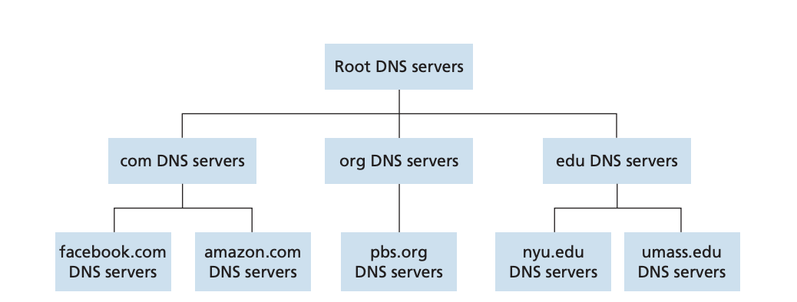
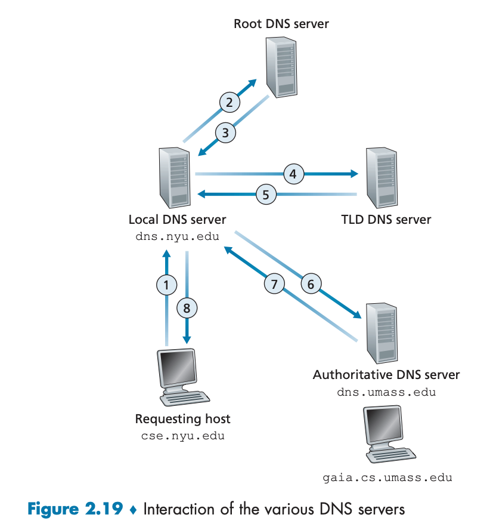

"google.com"에 접속하면 무슨 일이 일어나는지는 흔한 면접 질문이다. 나도 받아 본 적이 있고 여러 관점에서 다양한 답이 나올 수 있다. 이 질문의 답이 글의 핵심은 아니다. 하지만 이 질문을 대비했던 사람이라면 네트워크 연결 부분을 설명하면서 DNS를 마주친 적이 있을 것이다. "google.com을 입력하면 DNS 서버에 요청을 보내서 IP 주소를 알아내고~"식으로 말이다.

그래, DNS는 우리가 부르기 편한 google.com 같은 호스트 이름을 IP 주소로 변환해 주는 시스템이다. 하지만 우리는 대체 어떻게 DNS 서버에 요청을 보내고 또 DNS 서버는 어떻게 요청을 처리해서 IP 주소를 알아내는 걸까? 그냥 마법처럼 일어날 리 없다. 그래서 이 글에서는 우리가 DNS를 사용할 때 어떤 일이 일어나는지 자세히 알아보겠다.

본문에 쓰인 그림들은 주로 [컴퓨터 네트워킹 하향식 접근](https://product.kyobobook.co.kr/detail/S000061694627) 8판에서 가져왔다.

# DNS와 네트워크 계층

먼저 DNS는 네트워크의 어떤 부분을 담당하고 있을까? 그러니까 네트워크의 구성을 나타내는 대표적인 방식인 OSI 7계층 모델을 생각하면 거기서 어떤 부분에 있을까? 개인적인 경험으로는 면접 때 이 질문을 받았는데 몰라서 쩔쩔맸던 기억이 있다. 이제 와서 알았지만 DNS는 7계층, 애플리케이션 계층의 프로토콜이다.

애플리케이션 계층은 사용자가 가장 가까이 접하는 계층이다. 우리가 흔히 생각하는 네트워크의 기능이란 네트워크 상에 있는 서로 다른 종단(Edge)간에 데이터를 주고받는 것이며 애플리케이션 계층은 바로 그런 종단들 간에 데이터를 담은 메시지를 주고받는 프로토콜을 정의하기 때문이다. 대표적으로 다음과 같은 내용을 정의한다.

- 어떤 메시지를 주고받는지(요청 메시지, 응답 메시지 등)
- 여러 메시지 타입을 구성하는 문법
- 메시지에 들어 있는 각 필드의 의미
- 프로세스가 언제, 어떻게 메시지를 전송하고 응답할지

그리고 DNS는 클라이언트와 DNS 서버 간에 어떻게 메시지를 주고받는지 정의한다. 서로 다른 네트워크 종단 간에 메시지를 교환하는 방식을 정의한다는 애플리케이션 계층의 정의에 잘 부합한다. 또한 DNS는 메시지를 전달하기 위해 하위 계층인 전송 계층의 프로토콜에 의존한다. DNS 메시지는 포트 53을 사용하며 UDP를 통해 전송된다. 이 또한 DNS가 애플리케이션 계층 프로토콜임을 뒷받침한다. 이때 애플리케이션 계층과 전송 계층 사이에는 소켓이 인터페이스 역할을 한다.

DNS는 HTTP, 메일에 쓰이는 SMTP처럼 사용자가 직접 상호작용하는 애플리케이션은 아니다. DNS는 인터넷 구조의 복잡성을 네트워크 사용자에게 숨기고, 사용자가 편리하게 호스트 이름을 사용할 수 있도록 해주는 역할을 한다. 하지만 그 동작을 보면 애플리케이션 계층 프로토콜의 특징을 잘 보여준다.

# DNS 서버 찾기

DNS는 일반적으로 2가지 의미로 쓰인다. 하나는 호스트 이름을 IP주소로 변환할 수 있는 레코드들을 보관하는 분산형 데이터베이스 서버를 의미하고 다른 하나는 클라이언트가 그 서버랑 메시지를 주고받을 수 있게 해주는 프로토콜을 의미한다. 이 글에서는 "DNS 서버"와 "DNS 프로토콜"로 구분해서 사용하도록 하겠다.

클라이언트가 DNS 프로토콜로 DNS 서버와 메시지를 주고받으려면 먼저 DNS 서버로 메시지를 보낼 수 있어야 한다. 이건 어떻게 가능할까? 이건 기본적으로 ISP(Internet Service Provider)와 관련이 있다.

DNS를 사용하는 클라이언트는 아마도 컴퓨터일 테고 인터넷에 연결되어 있다. 그러면 ISP에 가입되어 있을 텐데 이 ISP가 로컬 DNS 서버(디폴트 네임 서버라고도 한다)의 IP 주소를 제공한다. 이건 정적으로 설정되어 있거나 DHCP를 통해 동적으로 할당될 수 있다. 로컬 DNS 서버가 없는 경우에는 ISP의 DNS 서버 IP를 제공한다. 아무튼 클라이언트는 ISP를 통해 DNS 서버의 IP 주소를 알고 있다는 게 중요하다.

이 DNS 서버에 정말로 메시지를 보내려면 이더넷 상에서 MAC 주소를 알아야 한다. 이건 IP 주소와 MAC 주소를 매핑해주는 ARP(Address Resolution Protocol)를 통해 알아낼 수 있다.

과정을 간략히 설명하면 클라이언트가 LAN 상에서 DNS 서버의 IP 주소를 가진 호스트를 찾는 메시지를 브로드캐스팅하면 DNS 서버가 자신의 MAC 주소를 응답하는 방식이다. 이 응답을 받은 클라이언트는 응답을 이용해 DNS 서버의 IP 주소와 MAC 주소를 매핑할 수 있다. 이건 ARP 테이블이라는 곳에 저장되고 클라이언트는 이 ARP 테이블에 기록된 DNS 서버의 MAC 주소를 이용해 DNS 서버에 메시지를 보낼 수 있다.

이때 URL로부터 "google.com"과 같은 호스트 이름을 추출하는 건 브라우저가 담당한다.

# DNS 처리 과정

긴 과정을 거쳐서 로컬 DNS 서버가 드디어 특정 도메인 이름의 IP 주소를 요청하는 메시지를 받게 되었다. 이제 DNS 서버는 이 요청을 처리해야 한다. 이건 어떻게 일어날까?

## 루트 DNS로 요청

이 블로그의 주소인 "witch.work"의 IP 주소를 요청하는 메시지를 로컬 DNS 서버에서 받았다고 가정하자.

DNS 요청에 대한 응답 또한 캐싱되므로 만약 로컬 DNS 서버가 이미 "witch.work"의 IP 주소를 알고 있다면, 그 IP 주소를 응답으로 보내고 끝난다. 이 캐시는 보통 이틀 정도 유지되므로 만약 이 블로그를 보고 있는 사람이 다음날 또 내 블로그에 접속해 준다면(감사한 일이다) 로컬 DNS 서버는 캐시된 IP 주소를 응답으로 보내게 된다.

하지만 "google.com"같은 유명한 도메인이라면 모를까 대부분의 DNS 서버에서는 내 블로그에 대한 DNS 레코드를 가지고 있지 않을 것이다. 이 경우 로컬 DNS 서버는 다음과 같은 과정을 거쳐서 IP 주소를 알아낸다.

DNS 서버는 계층 구조로 되어 있다. 루트 DNS 서버, TLD(Top-Level Domain) DNS 서버, 책임(authoritative) DNS 서버가 있다. 다음 그림처럼 루트 DNS 밑의 TLD DNS 서버는 `.com`, `.net`, `.org`와 같은 최상위 도메인(TLD)을 관리하고, TLD DNS 서버 밑의 책임 DNS 서버는 특정 도메인 이름에 대한 IP 주소를 관리한다.



이 계층 구조 데이터베이스는 DNS 요청을 받아서 그걸 처리하는 데 필요한 정보를 점점 더 구체적으로 좁혀가는 방식으로 동작한다. 따라서 로컬 DNS 서버는 먼저 루트 DNS 서버에 요청을 보낸다.[^1]

루트 DNS 서버는 일반적으로 외부 네트워크에 있기 때문에 게이트웨이 라우터를 통과해야 한다. 게이트웨이 라우터의 MAC 주소 또한 ARP를 통해 알아낼 수 있다. 게이트웨이 라우터에서는 DNS 요청 메시지에 들어 있는 루트 DNS 서버의 IP 주소를 이용해 DNS 요청 메시지를 전달한다. DNS 요청 메시지는 UDP를 사용하며 포트 53을 사용한다. 게이트웨이에서 DNS로 요청 메시지가 전달되는 구체적인 방식은 DNS와는 직접적인 관련이 없으므로 생략한다.

## DNS에서 IP주소를 알아내는 과정

루트 DNS 서버가 DNS 프로토콜을 따르는 메시지를 받으면 계층 구조로 된 분산형 데이터베이스를 통해 IP 주소를 찾는다. 이 방식을 설명한다.

계층 구조는 루트 DNS 서버, TLD DNS 서버, 책임 DNS 서버 순서로 되어 있다. 따라서 루트 DNS 서버는 요청 메시지에 들어 있는 최상위 도메인을 확인하고 거기 해당하는 TLD DNS 서버의 IP 주소를 응답 메시지로 보낸다.

예를 들어 "witch.work"의 경우 루트 DNS 서버는 ".work" TLD DNS 서버의 IP 주소를 응답으로 보낸다. 이제 로컬 DNS 서버는 같은 방식으로 TLD DNS 서버에 요청 메시지를 보내는데 그러면 TLD DNS서버는 해당 도메인을 관리하는 책임 DNS 서버의 IP를 응답으로 보낸다.

마지막으로 로컬 DNS 서버가 책임 DNS 서버에 메시지를 보내면 책임 DNS 서버는 요청 메시지에 들어 있는 도메인 이름에 대한 IP 주소를 응답 메시지로 보낸다. 책임 DNS 서버는 해당 도메인 이름에 대한 레코드를 관리하고 있다.

이제 로컬 DNS 서버는 클라이언트에서 요청한 도메인 이름에 대한 IP 주소를 알게 되었다. 이 IP 주소를 클라이언트에게 응답 메시지로 보내면 된다. 클라이언트는 이렇게 받은 IP 주소에 HTTP와 같은 요청을 보내서 웹 페이지를 받아오거나 다른 작업을 할 수 있다. 이렇게 설명한 전체 과정을 그림으로 나타내면 다음과 같다.



이때 TLD DNS 서버가 책임 DNS 서버의 IP를 알고 있는 게 자연스러운 것처럼 설명했지만 그렇지는 않다. TLD DNS 서버는 책임 DNS 서버의 IP를 알아낼 수 있게 해주는 중간 DNS 서버만 알고 있다. "witch.work"의 경우라면 "work" TLD DNS 서버가 중간 DNS 서버에 질의를 보내면 중간 DNS 서버가 "witch.work"의 책임 DNS 서버의 IP 주소를 응답으로 보내주는 식이다. 그러면 TLD DNS 서버는 이 IP 주소를 로컬 DNS 서버에 응답으로 보내준다. 따라서 로컬 DNS 서버는 중간 DNS 서버를 거쳐서 책임 DNS 서버의 IP 주소를 알게 된다.

## DNS가 부하를 줄이는 법

DNS는 아주 많은 요청을 처리해야 한다. 그리고 DNS를 이용하는 쪽에서도 최대한 자신들의 서버와 네트워크에 가해지는 부하를 줄이고 싶어한다. 때문에 좀 더 효율적으로 많은 요청을 처리하고 위에 설명한 긴 요청-응답 과정의 부하를 줄이기 위한 여러 가지 방법이 있다.

일단 캐싱을 사용한다. 앞서 설명한 요청과 응답의 과정에서 사용하는 DNS 서버들은 받은 요청에 대한 응답을 캐싱할 수 있다. 이후 캐싱이 유지되는 기간(흔히 이틀) 동안 같은 요청이 들어오면 캐시된 응답을 바로 보내준다. 또다른 방식으로는 로컬 DNS 서버가 TLD DNS 서버의 IP 주소를 캐싱하는 방식으로 루트 DNS 서버에 질의하는 것을 피할 수 있다.

여러 IP를 가진 웹 서버의 경우 DNS가 응답을 순환시키는 방법도 있다. "google.com"같이 많이 쓰이는 도메인의 경우 여러 다른 IP를 가지고 있다. DNS 데이터베이스는 이 IP 주소들을 클라이언트에 응답하지만 순환식으로 보내준다. 클라이언트는 보통 이렇게 IP 주소 여러 개를 받으면 그 중 첫 번째 IP 주소로 HTTP 요청을 보내므로 각 서버에 부하를 분산시킬 수 있다.

```
첫번째 요청 응답           두번째 요청 응답
+-----------------+    +-----------------+
| IP 주소 1        |    | IP 주소 2        |
+-----------------+    +-----------------+
| IP 주소 2        |    | IP 주소 3        |
+-----------------+    +-----------------+
| IP 주소 3        |    | IP 주소 1        |
+-----------------+    +-----------------+
```

또는 DNS 서버 자체를 여러 개 두고 순환시키는 방법도 있다. Primary/Secondary DNS라고 불린다. Primary DNS 서버가 책임 DNS 서버의 레코드를 관리하고 Secondary DNS 서버는 Primary DNS 서버의 레코드를 복제해서 사용한다. Secondary DNS 서버는 백업 역할을 하는데 여러 개 존재할 수도 있다. 이때 Primary/Secondary DNS 서버의 데이터는 거의 동기화되어 있으므로 이 서버들을 이용해서 부하를 분산시킬 수 있다. 여기에 [라운드 로빈 DNS](https://www.cloudflare.com/ko-kr/learning/dns/glossary/round-robin-dns/) 기술을 활용한다.

Secondary DNS 서버는 Primary DNS 서버에 저장된 정보와 동기화되어 있어야 한다. 따라서 Secondary DNS 서버는 Primary DNS 서버에 주기적으로 질의를 보낸다. 여기에 AXFR 혹은 IXFR이라고 불리는 프로토콜이 사용된다. 그러면 Primary DNS 서버에 변경 사항이 있는지를 확인하는데 이때 SOA(Start of Authority) 레코드가 사용된다.

SOA 레코드는 DNS 서버(정확히는 DNS zone인데 이 맥락에서 크게 중요하지 않다)에 대한 중요한 정보를 저장하는데 여기에 일종의 일련번호가 저장되어 있다. DNS 서버에 변경사항이 있으면 이 일련번호가 변경된다. 이 일련번호가 Primary/Secondary DNS 서버 간에 다르면 Secondary DNS 서버는 Primary DNS 서버에 데이터 전송을 요청해 동기화한다.

이후 Secondary DNS 서버와의 동기화까지 걸리는 시간을 줄이기 위해 Primary DNS 서버에 변경사항이 있을 시 알림을 보낼 수 있는 메커니즘(NOTIFY)도 나왔다. Secondary DNS는 NOTIFY 메시지를 받으면 Primary DNS 서버에 질의를 보낼지 결정할 수 있다.

# 이외의 DNS 관련 정보

## DNS 레코드

DNS는 그러면 어떤 정보를 가지고 있을까? 호스트 이름과 IP주소를 매핑하기 위해 DNS에서 저장하는 정보는 자원 레코드(resource record, RR)라고 불린다. 자원 레코드는 다음과 같은 형식을 하고 있다.[^2]

```
<Name> <Value> <Type> <TTL>
```

`<TTL>`은 Time To Live의 약자로 이 레코드가 얼마나 오랫동안 유효한지를 나타낸다. 캐시에서 제거되는 기간을 뜻한다. `<Name>`, `<Value>`의 의미는 `<Type>`에 따라 다르다. 주로 쓰이는 레코드 타입은 다음과 같다. 더 많은 레코드 종류는 [Cloudflare의 DNS 레코드 개요](https://www.cloudflare.com/ko-kr/learning/dns/dns-records/)에서 볼 수 있다.

- A: Name은 호스트 이름, Value는 IPv4 주소
- AAAA: Name은 호스트 이름, Value는 IPv6 주소
- NS: Name은 도메인, Value는 해당 도메인의 호스트에 대한 IP 주소를 가진 책임 DNS 서버의 호스트 이름
- CNAME: Canonical Name의 약자. Name은 별칭 호스트 이름, Value는 원본 호스트 이름
- MX: Name은 도메인, Value는 `Name`을 별칭으로 갖는 메일서버의 원본 호스트 이름

만약 호스트 이름 X에 대해 어떤 DNS 서버가 책임 DNS 서버라면 이 DNS 서버는 X에 대한 A 레코드를 포함한다. 호스트 이름의 책임 DNS 서버를 찾기 위해서는 NS 레코드를 사용한다.

이런 레코드를 볼 수 있는 질의 메시지를 보내보려면 `nslookup` 명령어를 이용한다. 예를 들어 "witch.work"의 A 레코드를 알고 싶다면 다음과 같이 입력한다.

```bash
nslookup -type=A witch.work

# 응답
Name:	witch.work
Address: 104.21.32.1 # Cloudflare의 IP 주소이다
```

새로운 레코드를 DNS에 삽입하는 건 ICANN의 승인을 받은 등록 기관에서 처리한다. 난 Cloudflare를 이용해 "witch.work" 도메인을 등록했었다.

## DNSSEC(DNS Security Extensions)

DNS는 훌륭한 기술이지만 DNS 서버도 서버인 만큼 공격받을 수 있다. DNS 서버에 DDoS 공격을 가하거나 클라이언트가 정상적이지 않은 DNS 서버에 요청을 보내도록 해서 악의적인 IP 주소를 응답으로 받게 하는 등의 공격이 가능하다. 이를 방지하기 위해 DNSSEC(DNS Security Extensions)이라는 확장 기능이 있다.

DNSSEC은 이런 위험에 대응하기 위해서 DNS 응답을 검증하는 확장 기능이다. 정상적인 출처에서 왔는지를 확인하기 위해서. DNSSEC은 암호화된 서명이 들어 있는 RRSIG 등의 새로운 DNS 레코드 유형을 추가하여 DNS 레코드 응답이 적절한 책임 DNS 서버에서 왔으며 전송 중에 변경되지 않았음을 검증 가능하게 한다. 공개키 암호화 방식을 사용한다.

이 과정은 다음과 같이 이루어진다. 같은 레이블과 유형의 레코드들을 자원 레코드 집합(resource record set, RRSet)으로 묶고 여기에 대한 디지털 서명을 생성하여 RRSIG 레코드로 저장한다. 이 서명을 검증하는 데에 필요한 공개키는 DNSKEY 레코드로 저장한다.

위에서 설명한 DNS 서버의 계층 구조에 접근할 때 각 단계의 상위 계층에서 하위 계층의 레코드가 변경되지 않았음을 검증하는 방식으로 신뢰를 구축한다. 여기에는 DNSKEY의 해시를 저장하는 DS 레코드가 사용된다.

이를 종합하면 DNSSEC이란 로컬 DNS 서버가 DNS 레코드 응답을 받았을 때 RRSIG 서명을 DNSKEY로 검증하며 상위 DNS 서버의 DS 레코드를 통해 하위 DNS 서버의 레코드가 변경되지 않았음을 검증하는 방식으로 DNS 응답의 출처와 무결성을 검증하는 것이다.

이런 식으로 상위 DNS 서버에서 하위 DNS 서버의 레코드를 검증하는 식으로 하면 문제 하나가 있다. 루트 DNS 서버의 정보를 검증할 상위 계층이 없다는 것이다. 따라서 루트 DNS 서버를 검증할 수 있는 서명은 전세계에서 선발된 14명의 사람이 모여서 루트 DNSKEY RRset에 서명하는 [루트 서명식](https://www.cloudflare.com/ko-kr/learning/dns/dnssec/root-signing-ceremony/)에서 결정된다.

이 암호화와 검증 과정은 상당히 복잡하고 내가 생각하던 기본적인 DNS의 동작 방식과는 연관이 적기 때문에 간단히만 설명했다. 더 자세한 내용은 [DNSSEC는 어떻게 작동하나요?](https://www.cloudflare.com/ko-kr/learning/dns/dnssec/how-dnssec-works/), [DNSSEC란 무엇이며 어떻게 작동하나요?](https://www.akamai.com/ko/blog/trends/dnssec-how-it-works-key-considerations) 등을 참고할 수 있다.

# 참고

인터넷이 동작하는 아주 구체적인 원리

https://parksb.github.io/article/36.html

cloudflare, DNS AAAA 레코드

https://www.cloudflare.com/ko-kr/learning/dns/dns-records/dns-aaaa-record/

cloudflare, DNS SOA 레코드란?

https://www.cloudflare.com/ko-kr/learning/dns/dns-records/dns-soa-record/

cloudflare, 기본 및 보조 DNS

https://www.cloudflare.com/ko-kr/learning/dns/glossary/primary-secondary-dns/

cloudflare, DNSSEC는 어떻게 작동하나요?

https://www.cloudflare.com/ko-kr/learning/dns/dnssec/how-dnssec-works/

cloudflare, DNSSEC 루트 서명식

https://www.cloudflare.com/ko-kr/learning/dns/dnssec/root-signing-ceremony/

IBM Technology, "Primary and Secondary DNS: A Complete Guide"

https://www.youtube.com/watch?v=qhiyTH5B21A

IBM Technology, "What is DNSSEC (Domain Name System Security Extensions)?"

https://www.youtube.com/watch?v=Fk2oejzgSVQ

James F. Kurose, Keith W. Ross 지음, 최종원, 강현국, 김기태 외 5명 옮김, 컴퓨터 네트워킹 하향식 접근, 8판

아미노 에이지 지음, 김현주 옮김, 하루 3분 네트워크 교실

[^1]: 이 루트 DNS 서버는 12개의 다른 기관에서 관리되는 13개의 서버로 구성되어 있으며 전세계에 1000개 이상의 인스턴스가 퍼져 있다. 이건 ICANN(Internet Corporation for Assigned Names and Numbers) 소속의 IANA(Internet Assigned Numbers Authority)에서 관리한다.

[^2]: 컴퓨터 네트워킹 하향식 접근 8판 120-121p