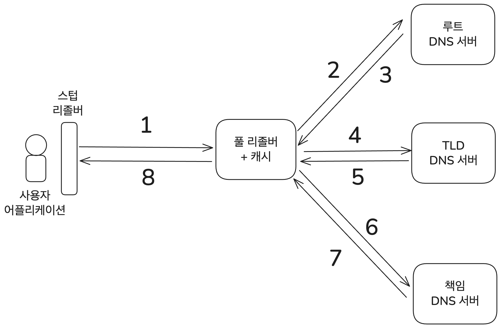

부족한 네트워크 지식, 그리고 찾아야 할 키워드를 알아냄에 있어서 홈 서버 관련 블로그를 운영하는 친구 [불칸](https://vulcan.site/)의 큰 도움을 받았다.

# 시작

브라우저에서 "google.com"에 접속하면 무슨 일이 일어나는지는 흔하게 찾아볼 수 있는 면접 질문이다. 나도 이 질문을 면접에서 받아 본 적이 있다. 나뿐 아니라 취업 준비를 하는 사람이라면 한번쯤 이 질문을 받아봤거나 최소한 찾아보았을 거라고 생각한다.

이 질문에 대비해 봤다면 아마 DNS를 마주쳤을 거라고 예상한다. 나도 면접에서 이 질문을 받았을 때 "google.com의 IP 주소를 알아내기 위해 DNS 서버에 요청을 보내고~"로 시작하는 답변을 했던 기억이 있다.

맞다. 나를 포함한 많은 개발자들이 면접에서 읊는 대로 DNS는 "google.com"같은 호스트 이름을 IP 주소로 변환해 주는 시스템이다. 그런데 생각해 보면 이런 과정이 그냥 마법처럼 일어날 리 없다. 그래서 이 DNS가 어떻게 동작하고 무엇인지에 관해 알아보았고 생각보다 많은 내용이 있어 시리즈로 나누어 글을 쓰기로 했다.

DNS 서버에는 어떻게 요청을 보낼 수 있는 것이고 또 DNS 서버는 어떻게 요청을 처리해서 도메인의 IP 주소를 알아낼까? DNS는 어쩌다 나왔고 어떻게 구성되어 있을까? 다른 데에 쓸 수는 없을까? 이런 여러 질문들에 대해 내가 할 수 있는 만큼 알아보았다.

첫번째인 이번 글에서는 먼저 DNS 서버에 어떻게 요청을 보내고 이게 어떻게 처리되어서 IP 주소가 나오는지 알아보겠다.

- 이 글의 본문에 쓰인 그림들은 직접 만들었거나 [컴퓨터 네트워킹 하향식 접근](https://product.kyobobook.co.kr/detail/S000061694627) 8판에서 가져왔다.
- DNS는 일반적으로 2가지 의미로 쓰인다. 하나는 호스트 이름을 IP주소로 변환할 때 쓰는 레코드들을 보관하는 분산형 데이터베이스 서버를 의미하고 다른 하나는 클라이언트가 그 서버랑 메시지를 주고받을 수 있게 해주는 프로토콜을 의미한다. 이 글에서는 필요한 경우 각각을 "DNS 서버"와 "DNS 프로토콜"로 구분해서 사용하도록 하겠다.

# 전체적인 과정 훑어보기

먼저 DNS에 요청을 보내고 받는 과정을 전체적으로 살펴보자. 그 다음에 이 구성 요소들을 하나씩 살펴보겠다.

사용자가 탐색하고 싶은 사이트 주소를 입력했다고 하자. 여기서는 내 블로그 주소라고 하겠다. 그럼 브라우저 혹은 애플리케이션에서 사용하는 라이브러리에서 이 주소를 파싱해서 호스트 이름을 추출한다. 입력한 주소가 `https://witch.work/ko/search?search=hi`라면 거기서 요청에 필요한 호스트 이름인 "witch.work"을 추출한다.

이 호스트 이름에 대한 요청을 가장 먼저 처리하는 건 사용자 애플리케이션에 내장된 스텁 리졸버(Stub Resolver)이다. 스텁 리졸버는 실제 DNS 서버에 요청을 보내는 역할을 하는 풀 리졸버(Full Resolver)의 IP 주소를 알고 있다. 장치가 네트워크에 연결될 때 해당 네트워크에서 풀 리졸버 주소를 받아오기 때문이다.

스텁 리졸버는 DNS 프로토콜에 따라 메시지를 작성해서 알고 있는 풀 리졸버의 IP 주소로 요청을 보낸다. IP 주소를 통해 요청을 보낼 때는 ARP(Address Resolution Protocol)를 통해 MAC 주소를 알아내서 연결한다.

풀 리졸버는 먼저 자신의 캐시 데이터를 확인해, 해당 호스트 이름에 대한 IP 주소 정보가 있는지 찾는다. 있다면 즉시 반환하고 없다면 DNS 서버의 계층 구조를 따라 질의를 시작한다. 풀 리졸버는 루트 DNS 서버 중 하나에게 질의를 보낸다. 루트 서버는 호스트 이름 "witch.work"의 TLD(Top Level Domain)인 "work"에 대한 정보를 관리하는 TLD 서버의 주소를 응답으로 돌려준다.

그럼 풀 리졸버는 응답받은 "work" TLD 서버에게 다시 질의를 보낸다. 응답으로는 "witch.work"이라는 호스트 이름을 관리하는 책임 DNS 서버(authoritative name server)의 주소를 받는다. 이 서버는 해당 도메인에 대한 최종 정보를 알고 있는 서버다. 이제 풀 리졸버는 책임 DNS 서버에게 질의를 보내고, "witch.work"이라는 호스트 이름에 대한 A 레코드 또는 AAAA 레코드를 포함한 응답을 받는다. 이 응답에는 해당 호스트 이름에 대응되는 IP 주소가 포함되어 있다.

이렇게 응답을 받은 풀 리졸버는 캐싱 기능이 있는 경우 이 정보를 캐시에 저장해 두고 다음 요청에서 재사용할 수 있도록 한다. 참고로 이 캐시는 보통 이틀 정도 유지된다. 그리고 응답받은 IP 주소를 사용자 장치의 스텁 리졸버에게 다시 전달하고 스텁 리졸버는 이걸 또 사용자 애플리케이션에 전달한다. 애플리케이션은 이 IP 주소로 HTTP 요청을 보낼 수 있다.



그럼 이제 이 과정을 구성하는 요소들과 세부적인 부분들을 하나씩 살펴보자.

# DNS 구성 요소 - DNS 리졸버

사용자 어플리케이션이 바로 DNS 서버에 질의하는 게 아니라는 건 앞서 보았다. DNS의 구성 요소에는 호스트 이름에 대한 정보를 제공하는 DNS 서버뿐 아니라 사용자의 애플리케이션과 DNS 서버 간에 메시지를 주고받는 걸 담당하는 구성 요소가 따로 있다. DNS 리졸버(DNS Resolver)라고 한다. 즉 DNS 서버 입장에서 클라이언트는 사용자의 애플리케이션이 아니라 DNS 리졸버이다.

이 DNS 리졸버는 또 2가지로 나뉜다. 사용자 애플리케이션에 내장된 스텁 리졸버(Stub Resolver)와 정말로 DNS 서버와 메시지를 주고받아서 이름 변환을 해주는 풀 리졸버(Full Resolver)이다. 

이 둘의 정의와 구체적인 요구 사항은 [RFC 1123 6.1.3.1 Resolver Implementation](https://datatracker.ietf.org/doc/html/rfc1123#page-74)에 정의되어 있다.

풀 리졸버를 재귀 DNS 서버, 재귀 리졸버 혹은 캐시 DNS 서버라고 부르는 경우도 있지만 이 글에서는 주로 참고한 문서들에 따라 풀 리졸버라고 부르겠다. 그럼 이 두 리졸버에 대해 좀 더 자세히 알아보자.

## 스텁 리졸버

스텁 리졸버는 사용자의 애플리케이션과 풀 리졸버 간의 인터페이스 역할을 하여 애플리케이션의 도메인 이름에 대한 요청을 적절한 DNS 요청 메시지로 변환한다. 또한 풀 리졸버에서 결과를 받아서 애플리케이션이 이해할 수 있는 형태로 돌려준다.

그럼 이 스텁 리졸버는 어떻게 풀 리졸버를 찾을까? 컴퓨터나 다른 장치가 네트워크에 연결될 때 해당 네트워크에서 풀 리졸버 주소를 받아온다. 다음 섹션에서 더 자세히 보겠지만 일반적으로 ISP나 통신사에서 제공하는 DNS 서버의 IP 주소이다.

이렇게 장치에서 받아온 풀 리졸버의 IP 주소를 보려면 `/etc/resolv.conf` 파일을 확인하면 된다. 이건 보통 시스템에서 동적으로 관리되는 파일에 대한 심볼릭 링크이다.

또는 MacOS의 경우 `scutil --dns` 명령어를 사용해도 된다. 이 명령어를 이용하면 다음과 같이 현재 사용 중인 DNS 서버의 IP 주소를 확인할 수 있다. 나는 학교의 와이파이를 사용하면서 이 글을 작성하고 있기 때문에 다음과 같은 결과가 나왔다.

```bash
$ scutil --dns
DNS configuration

resolver #1
  search domain[0] : sogang.ac.kr
  nameserver[0] : 163.239.1.1
  nameserver[1] : 168.126.63.1
  if_index : 11 (en0)
  flags    : Request A records
  reach    : 0x00000002 (Reachable)

resolver #2
# ...
```

이 설정을 변경하고 싶다면 OS의 시스템 설정에서 요청을 보낼 풀 리졸버 주소를 변경할 수 있다. 보통 "DNS 서버 주소"라고 불리는 설정인데 이 글에서의 풀 리졸버 IP 주소에 해당한다.

이때 구체적으로 풀 리졸버에 메시지를 전달하는 것은 MAC 주소를 알아내서 연결해야 한다. 이건 IP 주소와 MAC 주소를 매핑해주는 ARP(Address Resolution Protocol)를 통해 알아낼 수 있다.

ARP가 이 글의 핵심은 아니니 ARP 과정은 간략하게만 설명한다. 클라이언트는 LAN 상에서 풀 리졸버의 IP 주소를 가진 호스트를 찾는 메시지를 브로드캐스팅한다. LAN 상에 있을 풀 리졸버는 이 메시지를 받고 자신의 MAC 주소를 응답으로 보내준다. 

클라이언트는 이 응답을 이용해 풀 리졸버의 IP 주소와 MAC 주소를 매핑할 수 있다. 이건 ARP 테이블이라는 곳에 저장된다. 그럼 클라이언트는 이 ARP 테이블에 기록된 풀 리졸버의 MAC 주소를 이용해 풀 리졸버에 메시지를 보낸다.

## 풀 리졸버

풀 리졸버는 스텁 리졸버가 보낸 DNS 요청 메시지를 받아서 처리한다. 루트 DNS 서버의 정보를 보관하고 있으며 이후에 살펴볼 재귀 DNS 요청을 수행한다. DNS 서버에 보내는 요청을 줄이기 위해 캐시를 사용하는 경우도 많다.

그럼 풀 리졸버는 구체적으로 어디일까? 네트워크에 연결될 때 풀 리졸버의 IP 주소를 받아온다고 했는데 따져보면 다양한 경우가 있다.

- ISP에서 운영하는 DNS 서버의 IP 주소
- 네트워크 라우터나 공유기에서 DHCP를 통해 IP를 할당하면서 함께 제공하는 DNS 리졸버 주소. 주로 통신사나 기관의 DNS 서버 주소가 된다.
- [공용 DNS 리졸버](https://en.wikipedia.org/wiki/Public_recursive_name_server) 주소. Cloudflare의 `1.1.1.1` 등이 대표적이다.
- 사용자가 직접 설정한 풀 리졸버 주소

이 중 어떤 것을 사용하는지는 사용자의 네트워크 환경에 따라 달라지고 다른 네트워크에 연결될 때마다 업데이트된다. 예를 들어 위에서 나는 학교의 와이파이에 연결되어 있지만 집에 가서 DNS 서버 주소 확인을 위해 `scutil --dns` 명령어를 실행하면 다른 DNS 서버 주소가 나온다.

이때 꼭 스텁 리졸버가 풀 리졸버와 직접 연결되어 있는 건 아니다. 설정에 따라 중간 단계가 있을 수 있다. 예를 들어 내 집의 와이파이에 컴퓨터를 연결한다면 DNS 질의를 보낼 IP 주소는 `192.168.0.5`로 설정된다.

딱 봐도 private IP인데 이건 내 집의 공유기를 관리하고 있는 pfSense의 IP로 연결된다. pfSense는 이걸 받으면 내부적으로 설정된 DNS 서버 주소(나 같은 경우 유플러스의 서버 주소인 `61.41.153.2`)로 메시지를 전달한다. 즉 스텁 리졸버와 풀 리졸버 사이에 pfSense가 있는 것이다.

따라서 나의 경우 다른 풀 리졸버를 사용하고 싶으면 pfSense의 DNS 서버 설정을 변경해야 한다. 이 설정에 관해서는 [내가 홈 서버를 설정하며 쓴 글의 pfSense 설정 부분](https://witch.work/ko/posts/blog-home-server#6-pfsense)을 참고.

위에 명시한 풀 리졸버 목록에 "사용자가 설정한 주소"도 있는 걸 볼 수 있다. BIND와 같은 소프트웨어를 이용해 직접 풀 리졸버를 만들 수도 있기 때문이다. 이 구체적인 과정에 대해서는 참고문헌의 "인프라 엔지니어의 교과서: 시스템 구축과 관리편"을 참고할 수 있다.

# DNS 구성 요소 - DNS 서버

스텁 리졸버가 풀 리졸버의 IP 주소를 알아내고 DNS 질의를 보냈다고 하자. 그럼 질의에 담긴 호스트 이름에 대한 IP 주소가 풀 리졸버에 캐싱되어 있을 수도 있다. 그러면 DNS 리졸버는 캐시된 IP 주소를 응답 메시지로 보내고 끝난다.

하지만 캐시된 IP 주소가 없다면? 풀 리졸버는 DNS 서버로 요청을 보내서 호스트 이름에 대응되는 IP 주소를 알아내야 한다. 이 과정은 DNS 서버의 계층 구조를 따라 진행된다.

그게 어떻게 진행되는지는 맨 앞에서 간단히 살펴보았다. 그러므로 이번에는 DNS 서버의 계층 구조와 그 동작 방식에 대해 좀더 알아보자.

## DNS 서버의 계층 구조

다음 글에서 DNS의 역사적인 맥락과 구조에 대해 좀 더 살펴보겠지만 DNS는 처음부터 분산형 데이터베이스로 설계되었다. 인터넷 전체에 걸쳐 널리 쓰이는 이런 시스템을 통합 서버에서 관리하기는 어렵기도 하고 당시에는 이런 대규모 시스템을 관리하는 데에 자원을 써야 한다는 인식이 없었기 때문에 자금의 문제도 있었다.

그래서 DNS는 계층 구조로 되어 있다. 이 계층 구조는 루트 DNS 서버, TLD(Top-Level Domain) DNS 서버, 책임(authoritative) DNS 서버로 나뉜다. 다음 그림처럼 루트 DNS 밑의 TLD DNS 서버는 `.com`, `.net`, `.org`와 같은 최상위 도메인(TLD)을 관리하고, TLD DNS 서버 밑의 책임 DNS 서버는 특정 도메인 이름에 대한 IP 주소를 관리한다.


## 풀 리졸버가 IP 주소를 알아내는 과정

DNS의 계층 구조 데이터베이스를 이용해 IP 주소를 알아내려면 정보를 점점 좁혀 가면서 질의를 해야 한다. 계층 구조는 루트 DNS 서버, TLD DNS 서버, 책임 DNS 서버 순서로 되어 있으므로 풀 리졸버는 그 순서대로 질의를 보낸다. 앞서 본 과정이므로 좀 더 간단히 설명한다.

풀 리졸버는 먼저 가장 상위에 있는 루트 DNS 서버에 질의를 보낸다.[^1] 루트 DNS 서버는 질의의 TLD를 보고 해당하는 TLD DNS 서버의 IP 주소를 응답 메시지로 보낸다. 같은 방식으로 TLD DNS 서버에 질의를 보내고 해당 호스트를 관리하는 책임 DNS 서버의 IP 주소를 응답받는다.

마지막으로 풀 리졸버가 책임 DNS 서버에 질의를 보내면 해당 호스트 이름에 대한 IP 주소를 응답받는다. 이걸 받은 풀 리졸버는 사용자의 스텁 리졸버에게 IP 주소를 응답 메시지로 돌려준다. 이걸 갑자기 다시 언급한 이유는 덧붙일 만한 내용이 좀 있기 때문이다.

## 중간 DNS 서버

앞서 TLD DNS 서버가 책임 DNS 서버의 IP를 알고 있는 게 자연스러운 것처럼 설명했다. 하지만 꼭 그렇지는 않다. 중간 DNS 서버가 있을 수 있다. 가령 서브도메인을 사용하는 경우를 생각해 볼 수 있다.

예를 들어 서강대학교에는 메인 페이지인 `sogang.ac.kr`도 있지만 각 학과의 홈페이지도 있다. 컴퓨터공학과의 경우 `cs.sogang.ac.kr`이다. 이때 `sogang.ac.kr`의 TLD DNS 서버인 `.kr` DNS 서버는 `cs.sogang.ac.kr`의 책임 DNS 서버의 IP 주소를 알지 못할 수도 있다. 대신 서강대학교의 DNS 서버에 질의를 보내서 `cs.sogang.ac.kr`의 책임 DNS 서버의 IP 주소를 알아내는 방법을 쓴다.[^2]

이런 중간 DNS 서버가 끼어들어도 기본적인 흐름은 같다. 풀 리졸버가 TLD DNS 서버에 대한 질의와 책임 DNS 서버에 대한 질의 사이에 중간 DNS 서버에 질의를 보내는 과정이 추가될 뿐이다. 다만 루트 - TLD - 책임의 3계층 구조가 무조건 적용되는 건 아니라는 걸 언급하고자 했다.

## 외부 네트워크로 가는 과정

이런 질의를 보내는 DNS 서버들은 일반적으로 외부 네트워크에 있다. 따라서 질의를 보내기 위해서는 게이트웨이 라우터를 통과해야 한다. 이 게이트웨이 라우터에 메시지를 보낼 때도 앞서 언급한 ARP를 통해 MAC 주소를 알아낸다. 풀 리졸버는 게이트웨이 라우터의 MAC 주소를 알아내고, 이 MAC 주소를 이용해 게이트웨이 라우터에 DNS 요청 메시지를 보낸다.

게이트웨이 라우터에서는 DNS 요청 메시지에 들어 있는 루트 DNS 서버의 IP 주소를 이용해 DNS 요청 메시지를 전달한다. DNS 요청 메시지는 UDP를 사용하며 포트 53을 사용한다. 게이트웨이에서 DNS로 요청 메시지를 전달하는 이런 중간 과정은 보통 미들 마일(Middle Mile)을 거치게 되는데 여러 게이트웨이 경계를 지나는 이런 과정은 상당히 복잡하며 DNS와는 직접적 관련이 없으므로 생략하겠다.

# 마무리

이번 글에서는 DNS가 어떻게 호스트 이름을 IP 주소로 변환하는지의 흐름을 살펴보았다. 다음 글에서는 좀 더 구체적인 부분들을 알아볼 예정이다. DNS는 어떻게 나왔는지, 메시지는 어떻게 구성되는지, 그리고 어떻게 서버에 가해지는 부하를 줄이는지 등등.

# 참고

[Paul V. Mockapetris, Kevin J. Dunlap, Development of the Domain Name System](https://www.cs.cornell.edu/people/egs/615/mockapetris.pdf)

James F. Kurose, Keith W. Ross 지음, 최종원, 강현국, 김기태 외 5명 옮김, 컴퓨터 네트워킹 하향식 접근, 8판

기술평론사 편집부 엮음, 진명조 옮김, 인프라 엔지니어의 교과서 시스템 구축과 관리편, 5장 '최신 DNS 교과서'

아미노 에이지 지음, 김현주 옮김, 하루 3분 네트워크 교실

인터넷이 동작하는 아주 구체적인 원리

https://parksb.github.io/article/36.html

DNS 개념잡기 - (2) DNS 구성 요소 및 분류(DNS Resolver, DNS 서버)

https://anggeum.tistory.com/entry/DNS-%EA%B0%9C%EB%85%90%EC%9E%A1%EA%B8%B0-2-DNS-%EA%B5%AC%EC%84%B1-%EC%9A%94%EC%86%8C-%EB%B0%8F-%EB%B6%84%EB%A5%98DNS-Resolver-DNS-%EC%84%9C%EB%B2%84

macOS DNS Suffix 테스트(/etc/resolve.conf 관련)

https://k-security.tistory.com/155

NsLookup.io, What is a DNS stub resolver?

https://www.nslookup.io/learning/what-is-a-dns-resolver/

NsLookup.io, Recursive vs Authoritative DNS — What's the difference?

https://www.nslookup.io/learning/recursive-vs-authoritative-dns/

How DNS Works (Recursive Resolution and Stub Resolvers)

https://dev.to/lovestaco/how-dns-works-recursive-resolution-and-stub-resolvers-4k21

가비아 라이브러리, 도메인에도 ‘단계’가 있다!

https://library.gabia.com/contents/domain/716/

cloudflare, DNS란 무엇입니까? | DNS 작동 원리

https://www.cloudflare.com/ko-kr/learning/dns/what-is-dns/

cloudflare, DNS 서버 유형

https://www.cloudflare.com/ko-kr/learning/dns/dns-server-types/

cloudflare, DNS AAAA 레코드

https://www.cloudflare.com/ko-kr/learning/dns/dns-records/dns-aaaa-record/

cloudflare, DNS SOA 레코드란?

https://www.cloudflare.com/ko-kr/learning/dns/dns-records/dns-soa-record/

cloudflare, 기본 및 보조 DNS

https://www.cloudflare.com/ko-kr/learning/dns/glossary/primary-secondary-dns/

IBM Technology, "What are DNS Zones And Records?"

https://www.youtube.com/watch?v=U-i_UDDYLxY

IBM Technology, "Primary and Secondary DNS: A Complete Guide"

https://www.youtube.com/watch?v=qhiyTH5B21A

[^1]: 이 루트 DNS 서버는 12개의 다른 기관에서 관리되는 13개의 서버로 구성되어 있으며 전세계에 1000개 이상의 인스턴스가 퍼져 있다. 이건 ICANN(Internet Corporation for Assigned Names and Numbers) 소속의 IANA(Internet Assigned Numbers Authority)에서 관리한다.

[^2]: 엄밀히 말하면 `.ac.kr`이 TLD는 아니다. `.kr`이 TLD이고 앞의 `.ac`는 Second Level Domain, SLD라고 하여 주로 `.kr`이나 `.uk` 같은 국가 TLD(ccTLD)와 같이 쓰여서 도메인의 정체성을 나타내는 데 사용한다. `.ac`는 교육 기관에 쓰이는 SLD이다. [관련 가비아 문서](https://library.gabia.com/contents/domain/716/) 다만 이 글의 관점에서는 딱히 중요하지 않다.
