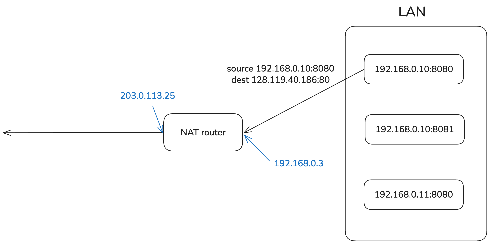
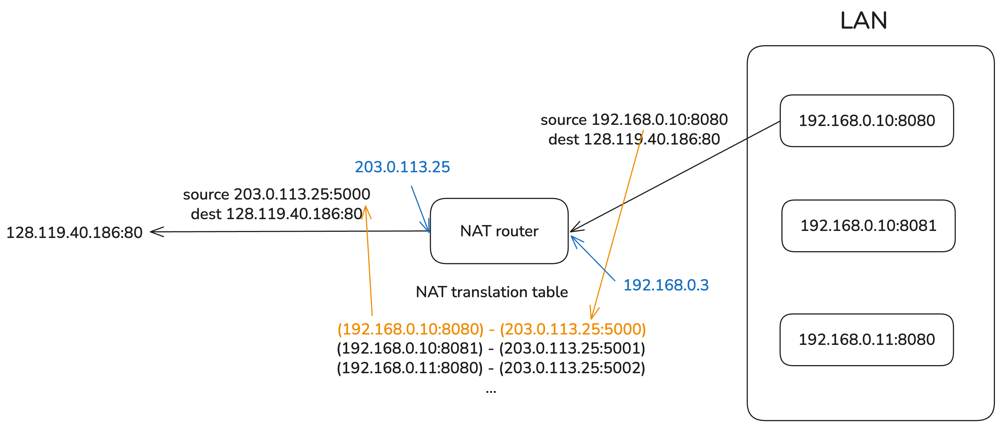
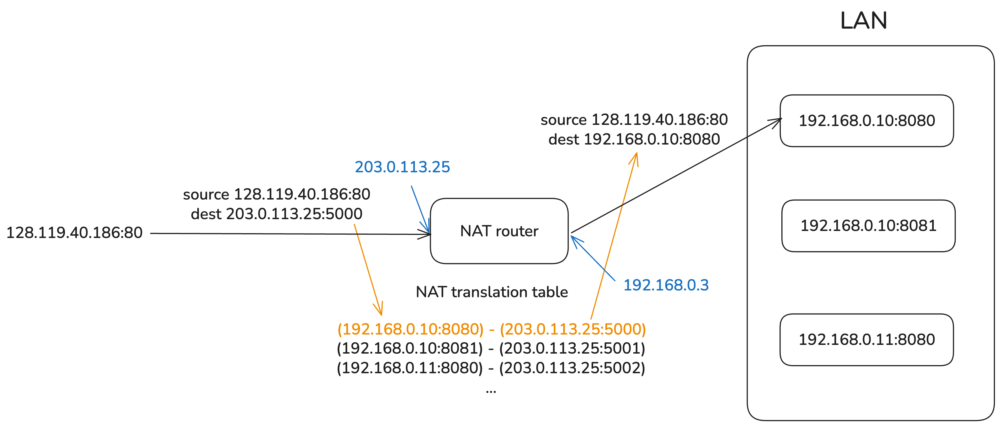
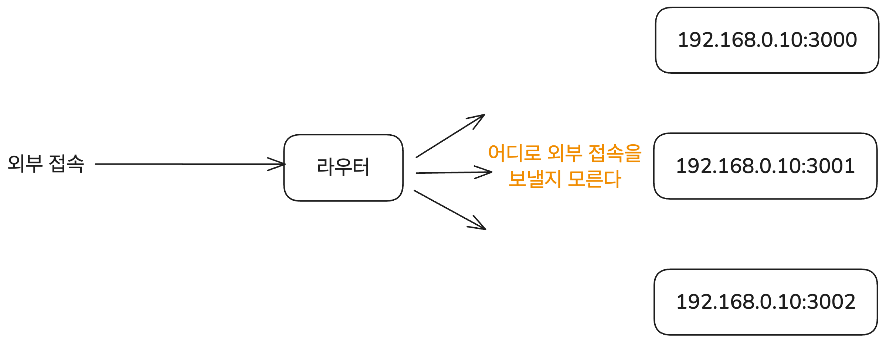
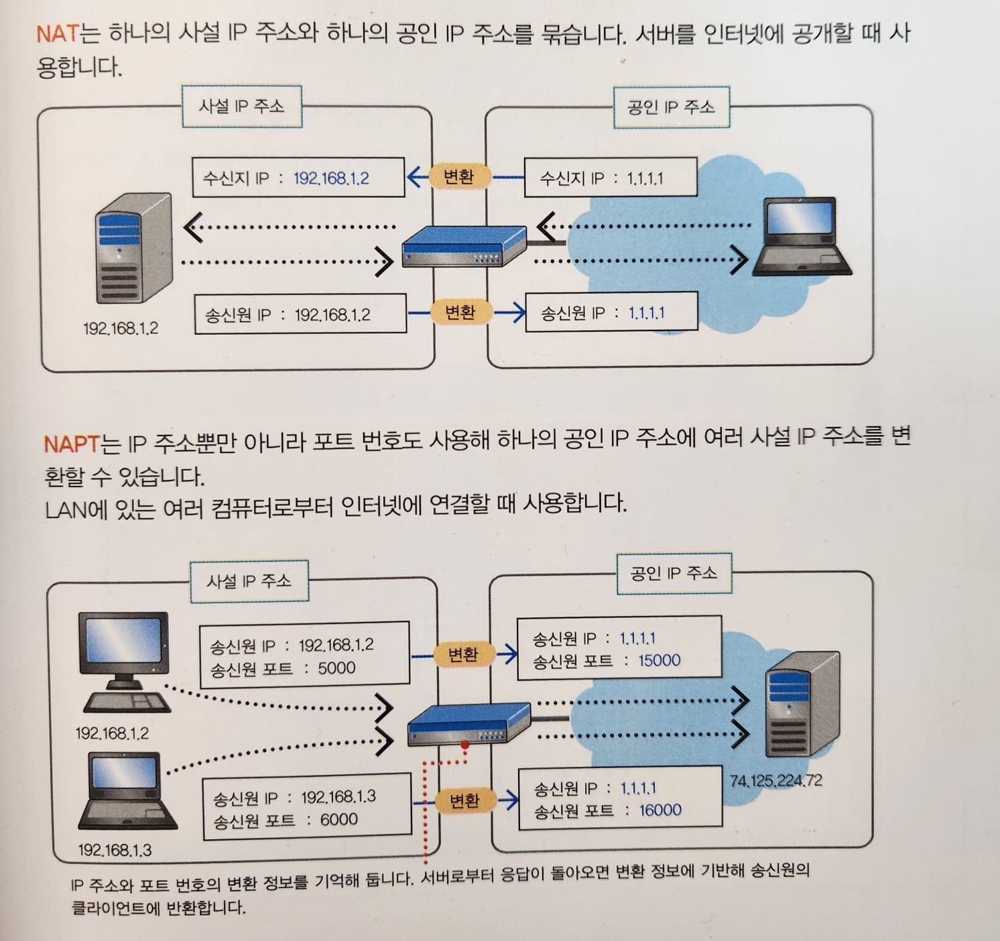

# 이 글은 작성 중입니다.

# NAT란

NAT(Network Address Translation)는 사설 네트워크에서 사용하는 사설 IP 주소를 공인 IP 주소로 변환하는 기술이다. 좀 더 넓은 의미로 IP 주소를 변환하는 기술 전반을 나타내는 데 쓰기도 한다. 보통 LAN과 인터넷을 연결하는 라우터 혹은 방화벽에서 NAT를 이용해 IP 주소 변환을 처리한다.

사설 IP와 공인 IP를 1:1로만 대응시키는 Basic NAT와 포트 번호까지 포함해서 IP 주소를 변환하는 NAPT(Network Address Port Translation)가 있는데 일반적인 NAT 장비는 모두 NAPT도 지원하므로 이 글에서 따로 구분을 두지는 않겠다.

## NAT의 동작

그럼 NAT는 구체적으로 어떻게 동작할까? 포트 번호까지 변환하는 NAPT(Network Address Port Translation)를 사용한다고 하자. 그럼 NAT 라우터는 이런 변환을 수행한다.

- 외부로 데이터 송신 시: (송신하는 기기의 사설 IP 주소, 포트 번호) -> (NAT 라우터의 공인 IP 주소, 포트 번호) 변환
- 외부에서 데이터 수신 시: (NAT 라우터의 공인 IP 주소, 포트 번호) -> (수신하는 기기의 사설 IP 주소, 포트 번호) 변환

데이터를 보내는 경우의 예시를 들어보자. 사설 IP `192.168.0.10:8080`를 가진 기기에서 `128.119.40.186:80`으로 데이터를 보내는 상황이다. 기기의 사설 IP 주소는 정적으로 지정되어 있을 수도 있고 DHCP로 동적 할당된 것일 수도 있는데 여기서는 크게 중요하지 않다. 중간에 거치는 NAT 라우터의 공인 IP 주소는 `203.0.113.25`이라고 하자. 이때 데이터를 보내는 과정은 다음과 같다.

먼저 사설 네트워크의 `192.168.0.10:8080` 기기에서 수신지 주소가 `128.119.40.186:80`으로 표기된 데이터그램을 전송한다. 이 데이터그램은 NAT를 사용하는 라우터에 먼저 도달하게 된다. 라우터 또한 공인 IP 주소뿐 아니라 사설 네트워크 내의 사설 IP 주소도 가지고 있다. 그림에서는 해당 IP들을 파란색으로 표시하였다.



라우터는 NAT를 이용해 사설 IP 주소 + 포트번호와 공인 IP 주소 + 포트번호를 매핑하는 테이블을 가지고 있다. 이를 이용해 데이터그램의 송신지 주소를 변환하고 데이터그램을 외부로 전송한다.

IP 주소 매핑에 쓰는 테이블은 내부에서 외부로 나가는 데이터가 감지될 때 필요하면 라우터가 업데이트한다. 데이터그램에 포함된 (사설 IP, 포트 번호)가 테이블에 없으면 새로운 외부 포트를 할당하고 매핑을 만들어서 일정 시간 유지되도록 테이블에 등록한다. 이 매핑은 양방향이라서 외부에서 데이터그램이 들어왔을 때도 사용할 수 있지만 업데이트는 내부에서 외부로 데이터가 나갈 때만 이루어진다.

여기서는 테이블에 이미 매핑이 있다고 가정하고 그림을 그렸다.



이렇게 변환된 데이터그램은 인터넷 상에 있는 라우터들을 거쳐서 네트워크 오류가 발생하지 않을 경우 최종 목적지인 `128.119.40.186:80`에 도달할 수 있다.

응답이 사설 네트워크 내의 목적지에 도착하는 과정은 위의 반대 순서로 이루어진다. 응답이 담긴 데이터그램을 라우터가 받으면 라우터는 매핑 테이블을 참조해서 수신지 주소를 사설 IP 주소 + 포트 번호로 변환하고 데이터그램을 사설 네트워크 내부의 목적지로 전송한다.



이때 사설 IP 주소는 `10.0.0.0/8`(class A), `172.16.0.0/12`(class B), `192.168.0.0/16`(class C) 대역에 속한다. 이 대역에 속한 IP 주소는 IANA에서 사설 IP 전용으로 정의하고 있으므로 인터넷에서 라우팅될 수 없다.

여기 쓰이는 포트 번호도 어느 정도 지정되어 있다. destination의 포트 번호는 0-1023(well-known port) 혹은 1024-49151(registered port)이다. source 그러니까 사설 네트워크 내부에서 사용하는 주소의 포트 번호는 라우터가 임의로 할당하는데 운영체제마다 다르지만 대략 30000-60000 사이의 포트 번호를 사용한다.

## 포트포워딩

NAT의 동작 과정을 살펴보았다. 그런데 중간에 이런 문장이 있었다.

> IP 주소 매핑에 쓰는 테이블은 내부에서 외부로 나가는 데이터가 감지될 때 필요하면 라우터가 업데이트한다.

이 말은 라우터에서 관리하는 NAT 테이블에 (송신하는 기기의 사설 IP 주소, 포트 번호) <-> (NAT 라우터의 공인 IP 주소, 포트 번호) 매핑이 생기기 위해서는 사설 네트워크에서 라우터를 통해 나가는 데이터가 있었어야 한다는 뜻이다.

하지만 사설 네트워크에서 먼저 나가는 데이터가 없는 상황도 많다. 가령 내가 내 컴퓨터를 서버로 해서 사이트를 배포하고 있는 경우를 들 수 있다. 그럼 외부에서 내 사이트에 접속하고자 하는 요청을 보냈을 때 이 요청을 도대체 어디로 보내주어야 할까?



물론 HTTP를 위한 80포트, HTTPS를 위한 443포트 등 기본적으로 알려진 포트들이 있다. 하지만 그런 포트로 요청을 받았다 해도 라우터는 사설 네트워크 상의 어떤 주소로 이를 보내야 할지 알 수 없다. 이때 외부의 특정 포트로 온 요청이 사설 네트워크 내의 어떤 주소로 가야 하는지 직접 지정해 주는 걸 포트포워딩이라고 한다.

이런 설정을 하는 방법은 여러 가지가 있지만 가장 간단한 방식 중 하나인 nginx를 이용한다면 다음과 같은 설정 구문을 쓸 수 있다. 예를 들어 외부의 8080 포트로 들어오는 모든 요청을 내부의 3000 포트로 보내고 싶다면 다음과 같이 쓴다.

nginx 등을 통해서 설정할 수 있다. 예를 들어 외부에서 8080 포트로 들어오는 모든 요청을 내부의 사설 네트워크의 `192.168.0.10:3000` 주소로 보내고 싶다면 다음과 같이 설정할 수 있다.

```bash
server {
    listen 8080;
    server_name _;

    location / {
        proxy_pass http://192.168.0.10:3000;
        # ...
    }
}
```

이외에도 HTTP 헤더 보존, 캐싱 등 다양한 옵션이 있다. 하지만 nginx 설정 파일이 이 글의 핵심은 아니므로 포트포워딩이 왜 필요한지 그리고 꽤 간단히 설정할 수 있다는 것만 알리고 넘어간다.

## NAT 사용의 이점

NAT를 사용하면 따라오는 좋은 점들도 있다. 이런 이득은 외부에서 보이는 IP 주소와 내부적인 IP 주소가 다르며 외부에서는 사설 네트워크 전체가 단 하나의 공인 IP를 가진 것처럼 보인다는 데에서 나온다.

- 사설 네트워크 내의 모든 장치가 하나의 공인 IP 주소를 사용하므로 IPv4 주소 절약
- 외부 통신에 대한 변경 없이 LAN 내의 기기 주소 변경 등 네트워크 설정 변경 가능
- 사설 네트워크 내부 장치들의 사설 IP 주소 변경 없이 공인 IP 주소 변경 가능
- NAT는 외부에서 직접 내부 IP에 접근할 수 없게 해주므로 보안성 향상


---

```
내 PC: 192.168.0.10 → NAT 라우터 → 인터넷(IP: 203.0.113.25)
```

내부에서 외부로 요청을 보낼 때는 내부 IP를 인터넷 상에 공개된 공인 IP 주소로 변환해주고 외부에서 내부로 요청을 보낼 때는 공인 IP 주소를 내부 IP 주소로 변환해준다. 이러한 변환을 하는 매핑은 테이블 형태로 저장된다.

또한 원래 NAT는 사설 IP와 공인 IP를 1:1로 변환한다. 하지만 이렇게 하면 LAN상에 있는 모든 기기가 각각 다른 공인 IP를 사용해야 한다. 안 그래도 IPv4 주소 공간이 부족하기에 이건 문제가 된다. 따라서 사설 IP와 공인 IP를 n:1로 변환하는 기술도 있다. NAPT(Network Address Port Translation)라고 부른다.




# 참고

키하시 마사히로 지음, 김모세 옮김, "그림과 작동 원리로 쉽게 이해하는 서버의 기초"

NAT (Network Address Translation) 소개 (RFC 3022/2663)

https://www.netmanias.com/ko/?m=view&id=blog&no=5826