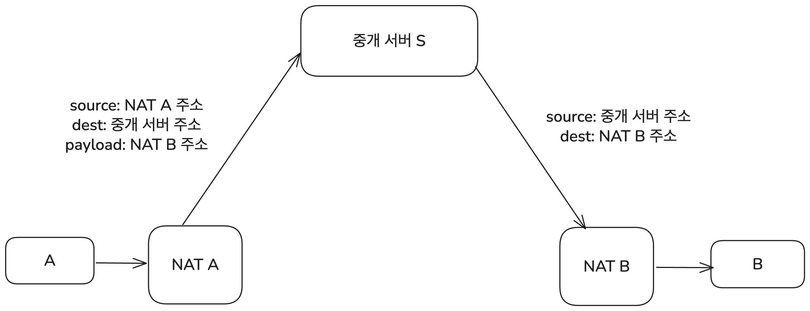
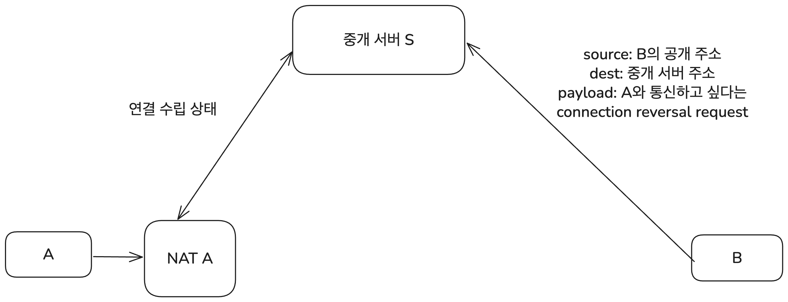
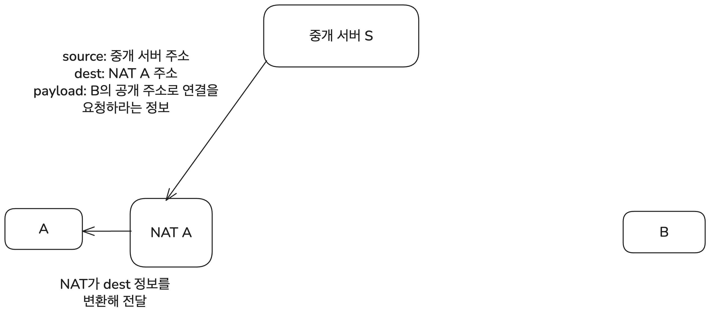
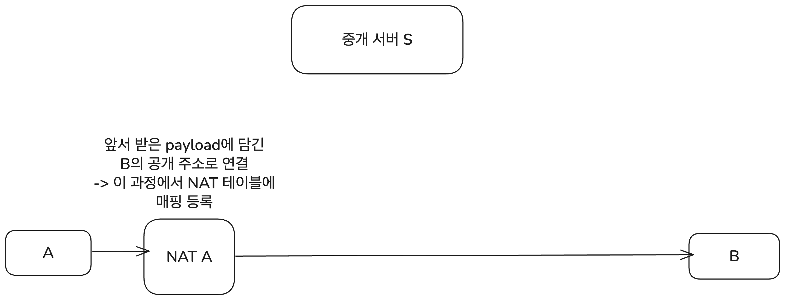
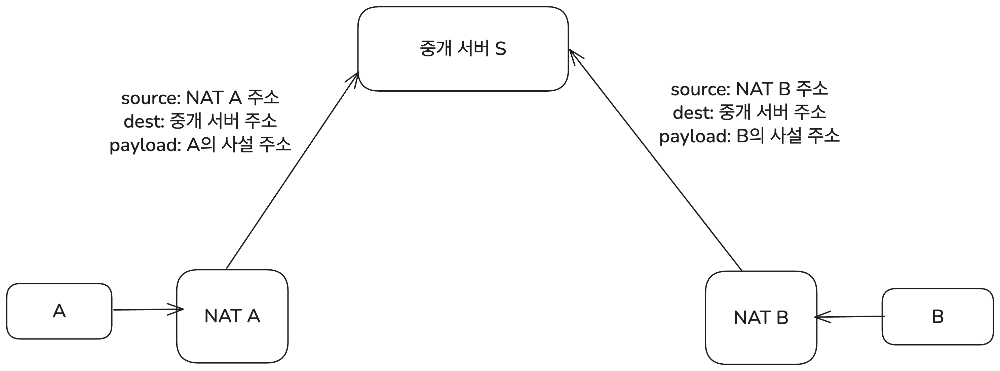
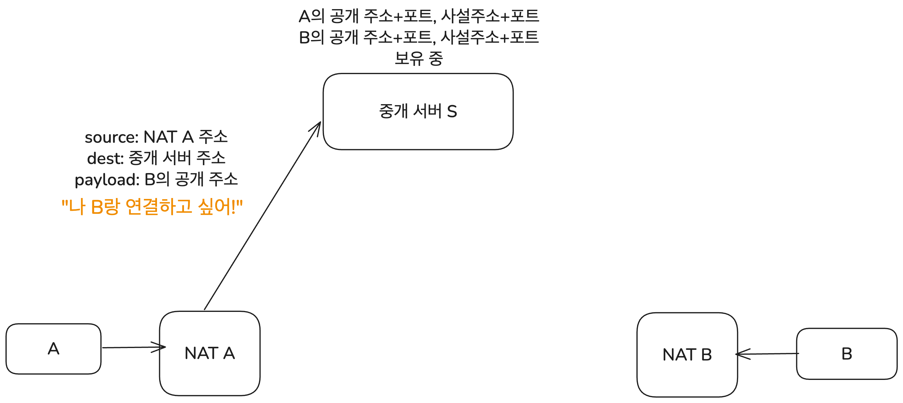
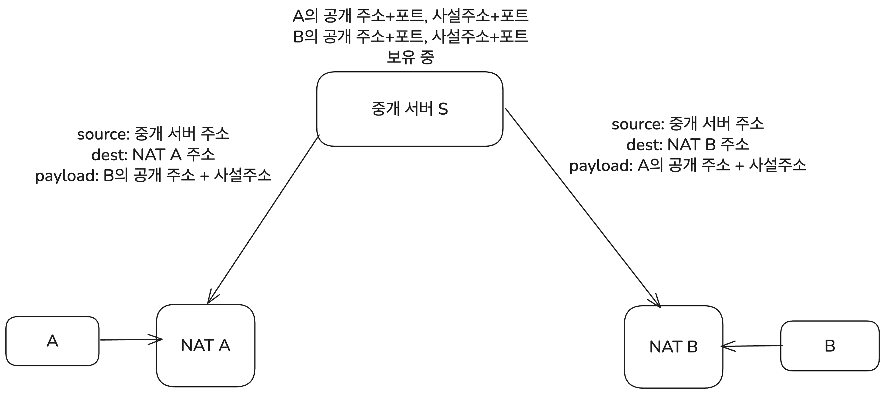

네트워크 스터디를 진행하면서 NAT에 관해서 조사하게 되었는데 해당 내용들과 조금 더 조사한 내용을 합쳐 글을 작성한다.

넷매니아즈의 "유창모"님이 작성하신 [NAT 관련 글들](https://www.netmanias.com/ko/?m=search&tag=248)을 많이 참고하였으며 개별 링크들은 참고 섹션에 밝힌다.

# NAT란 무엇인가?

## NAT의 정의

NAT(Network Address Translation)는 사설 네트워크의 호스트가 외부의 공개된 네트워크에 연결할 수 있도록 상호 간에 주소를 변환해 주는 기술이다. 보통 LAN과 인터넷을 연결하는 라우터 혹은 방화벽에서 NAT를 이용해 IP 주소 변환을 처리한다.

일반적으로 말하는 NAT는 사설 IP와 공인 IP를 1:1로만 대응시키는 Basic NAT와 포트 번호까지 포함해서 IP 주소를 변환하는 NAPT(Network Address Port Translation)를 모두 포함한다. 일반적으로 NAT 장비는 둘 다 지원하고 NAT에 관한 RFC 3022에서도 이 둘을 묶어서 Traditional NAT라고 부르고 있으므로 이 글에서도 따로 구분을 두지 않고 쓰겠다.

## NAT의 동작

그럼 NAT는 구체적으로 어떻게 동작할까? 포트 번호까지 변환하는 NAPT(Network Address Port Translation)를 사용한다고 하자. 그럼 NAT 라우터는 이런 변환을 수행한다.

- 외부로 데이터 송신 시: (송신하는 기기의 사설 IP 주소, 포트 번호) -> (NAT 라우터의 공인 IP 주소, 포트 번호) 변환
- 외부에서 데이터 수신 시: (NAT 라우터의 공인 IP 주소, 포트 번호) -> (수신하는 기기의 사설 IP 주소, 포트 번호) 변환

데이터를 보내는 경우의 예시를 들어보자. 사설 IP `192.168.0.10:8080`를 가진 기기에서 `128.119.40.186:80`으로 데이터를 보내는 상황이다. 기기의 사설 IP 주소는 정적으로 지정되어 있을 수도 있고 DHCP로 동적 할당된 것일 수도 있는데 여기서는 크게 중요하지 않다. 중간에 거치는 NAT 라우터의 공인 IP 주소는 `203.0.113.25`이라고 하자. 이때 데이터를 보내는 과정은 다음과 같다.

먼저 사설 네트워크의 `192.168.0.10:8080` 기기에서 수신지 주소가 `128.119.40.186:80`으로 표기된 데이터그램을 전송한다. 이 데이터그램은 NAT를 사용하는 라우터에 먼저 도달하게 된다. 라우터 또한 공인 IP 주소뿐 아니라 사설 네트워크 내의 사설 IP 주소도 가지고 있다. 그림에서는 해당 IP들을 파란색으로 표시하였다.

라우터는 NAT를 이용해 사설 IP 주소 + 포트번호와 공인 IP 주소 + 포트번호를 매핑하는 테이블을 가지고 있다. 이를 이용해 데이터그램의 송신지 주소를 변환하고 데이터그램을 외부로 전송한다.

IP 주소 매핑에 쓰는 테이블은 내부에서 외부로 나가는 데이터가 감지될 때 필요하면 라우터가 업데이트한다. 데이터그램에 포함된 (사설 IP, 포트 번호)가 테이블에 없으면 새로운 외부 포트를 할당하고 매핑을 만들어서 일정 시간 유지되도록 테이블에 등록한다. 이 매핑은 양방향이라서 외부에서 데이터그램이 들어왔을 때도 사용할 수 있지만 업데이트는 내부에서 외부로 데이터가 나갈 때만 이루어진다.

여기서는 테이블에 이미 매핑이 있다고 가정하고 그림을 그렸다.

이렇게 변환된 데이터그램은 인터넷 상에 있는 라우터들을 거쳐서 네트워크 오류가 발생하지 않을 경우 최종 목적지인 `128.119.40.186:80`에 도달할 수 있다.

응답이 사설 네트워크 내의 목적지에 도착하는 과정은 위의 반대 순서로 이루어진다. 응답이 담긴 데이터그램을 라우터가 받으면 라우터는 매핑 테이블을 참조해서 수신지 주소를 사설 IP 주소 + 포트 번호로 변환하고 데이터그램을 사설 네트워크 내부의 목적지로 전송한다.

이때 사설 IP 주소는 `10.0.0.0/8`(class A), `172.16.0.0/12`(class B), `192.168.0.0/16`(class C) 대역에 속한다. 이 대역에 속한 IP 주소는 IANA에서 사설 IP 전용으로 정의하고 있으므로 인터넷에서 라우팅될 수 없다.

여기 쓰이는 포트 번호도 어느 정도 지정되어 있다. destination의 포트 번호는 0-1023(well-known port) 혹은 1024-49151(registered port)이다. source 그러니까 사설 네트워크 내부에서 사용하는 주소의 포트 번호는 라우터가 임의로 할당하는데 운영체제마다 다르지만 대략 30000-60000 사이의 포트 번호를 사용한다.

## NAT 사용의 이점

NAT를 사용하면 좋은 점들도 있다. 이런 이득은 외부에서 보이는 IP 주소와 내부적인 IP 주소가 다르며 외부에서는 사설 네트워크 전체가 단 하나의 공인 IP를 가진 것처럼 보인다는 데에서 나온다.

- 사설 네트워크 내의 모든 장치가 하나의 공인 IP 주소를 사용하므로 IPv4 주소 절약
- 외부 통신에 대한 변경 없이 LAN 내의 기기 주소 변경 등 네트워크 설정 변경 가능
- 사설 네트워크 내부 장치들의 사설 IP 주소 변경 없이 공인 IP 주소 변경 가능
- NAT는 외부에서 직접 내부 IP에 접근할 수 없게 해주므로 보안성 향상

# 외부 접근과 포트포워딩

## NAT의 문제

NAT의 동작 과정을 위에서 살펴보았다. 그런데 중간에 이런 문장이 있었다.

> IP 주소 매핑에 쓰는 테이블은 내부에서 외부로 나가는 데이터가 감지될 때 필요하면 라우터가 업데이트한다.

(송신 기기의 사설 IP 주소, 포트 번호) <-> (NAT 라우터의 공인 IP 주소, 포트 번호) 간의 매핑이 NAT 테이블에 등록되기 위해서는 먼저 사설 네트워크 내의 기기에서 라우터를 통해 나가는 데이터가 있었어야 한다는 뜻이다. 물론 inbound 트래픽도 NAT 테이블을 업데이트하는 경우[^1]가 있지만 대부분의 경우 외부로 나가는 데이터가 있을 경우에만 NAT 테이블을 갱신한다.

이 상황에서 발생하는 문제가 있다. 외부에서 사설 네트워크의 특정 기기에 접속해서 데이터를 주고받아야 하는 경우를 NAT가 제대로 처리할 수 없다는 것이다. 이건 보안상에는 이점이 되기도 하지만 사설 네트워크를 통해 수많은 서비스를 운영해야 하는 경우에는 문제가 된다.

사설 네트워크 내의 배포 서버에서 사이트를 운영중인 경우를 예시로 생각할 수 있다. 배포 서버에서 사용자에게 먼저 데이터를 보내는 경우는 많지 않으므로 NAT 테이블 매핑이 없는 상황이 많다. 그럼 외부에서 어떻게 배포중인 사이트에 접근할 수 있도록 할 것인가?

이걸 해결하는 방법이 포트포워딩이다.

## 포트포워딩

외부에서 사설 네트워크 내의 적절한 호스트로 접속할 수 있도록 해주는 가장 간단한 방법은 포트포워딩이다. 외부의 특정 포트로 온 요청이 사설 네트워크 내의 어떤 주소로 가야 하는지 직접 지정해 주는 방법이다. "외부의 특정 포트로 들어온 요청은 사설 네트워크의 이 호스트로"라는 연결이 정적일 때 유용하다.

예를 들어 라우터 public IP의 8080 포트로 들어오는 모든 요청은 사설 네트워크 내의 `192.168.0.10:3000`으로 보내는 식이다. nginx, Apache 등의 도구를 이용해서 설정할 수 있다.

그림으로 나타내면 다음과 같다. 이때 이러한 매핑은 정적으로 설정된다. 즉 사설 네트워크 내의 특정 호스트에 대한 매핑이 필요할 때마다 라우터에 설정을 해주어야 한다.

## Universal Plug and Play(UPnP)

하지만 외부에 연결이 필요할 때마다 포트포워딩을 수동으로 설정해야 하는 건 번거롭다. 프린터, 게임 콘솔, IoT 기기 등 다양한 장치들이 사설 네트워크 내에 존재하는데 이들 모두가 외부와 연결이 필요할 때마다 포트포워딩을 수동으로 설정하는 건 비효율적이다.

그래서 이런 문제를 해결하기 위해 등장한 기술이 Universal Plug and Play(UPnP, [RFC 6970](https://datatracker.ietf.org/doc/html/rfc6970)에서 정의)이다. 네트워크 내의 장치들이 서로를 자동으로 검색하고 포트포워딩 요청을 통해 통신할 수 있게 해주는 기술이다.

이외에도 NAT-PMP, SOCKS 등 다양한 기술이 있지만 자동 포트 매핑이 글의 핵심은 아니므로 여기서는 UPnP만 설명한다. 필요하다면 해당 기술들의 RFC 문서를 참고하자.

UPnP를 지원하는 라우터는 사설 네트워크 내의 호스트가 요청을 보내면 자동으로 포트포워딩을 설정해 준다. 어떤 애플리케이션(예: 토렌트 클라이언트나 게임)이 "외부 포트 12345를 나한테 열어줘"라고 요청하면, 라우터는 그 요청에 따라 NAT 테이블을 갱신하고 외부의 12345번 포트에서 오는 요청을 해당 호스트로 전달하는 식이다.

이런 방식으로 UPnP는 같은 LAN 내에 있는 프린터, Xbox 등의 게임 콘솔과 같은 다양한 장치들이 서로를 자동으로 검색하고 연결할 수 있도록 해준다.

이렇게 하면 기기나 포트가 바뀌어도 자동으로 라우터가 대응한다. 따라서 라우터 설정에 사용자가 직접 개입할 필요가 없고 비전문가도 쉽게 포트포워딩이 필요한 앱을 사용할 수 있다는 장점이 있다.

하지만 UPnP는 보안상 취약점도 있어서 사용에 주의가 필요하다. UPnP는 LAN 내에서 쓰이도록 의도되었기 때문에 기본적으로 인증이나 접근 제어를 하지 않는다. 같은 네트워크에 있는 어떤 장치든 포트포워딩 요청을 자유롭게 보내고 포트를 열 수 있다는 뜻이다.

따라서 UPnP를 지원하는 라우터가 담당하는 네트워크에 악의적인 사용자가 침투하게 되면 같은 네트워크에 있는 어떤 장치에든 포트포워딩 요청을 하고 임의의 포트를 열어 외부와 통신해서 악의적인 요청을 받아들이는 통로를 만들 수 있다. 심지어 몇몇 라우터에서는 UPnP 요청을 외부에서 받아들일 수 있도록 되어 있어서 원격으로 라우터 설정을 바꿔버릴 수도 있다!

이런 약점 때문에 [UPnP를 비활성화하는 걸 권장하기도 한다.](https://nordvpn.com/ko/blog/what-is-upnp/) 실제로 기업 네트워크나 보안을 중시하는 공용 Wi-Fi 환경에서는 UPnP나 포트포워딩이 허용되지 않는 경우가 일반적이다.

그럼 이런 여러 제한 조건 하에서 서로 다른 기기들이(같은 사설 네트워크 내에 있을 수도 있고 아닐 수도 있다) 직접 연결을 맺어야 하는 경우는 어떻게 해결할까? 이런 상황에서 필요한 기술이 NAT Traversal이다.

# NAT Traversal

사실 NAT의 외부 접근에 대해서 생기는 진짜 문제는 P2P(peer-to-peer) 통신이다. 예를 들어 두 사용자가 화상 통화를 해야 하는 경우를 생각해 보자. 그러면 두 컴퓨터는 서로 직접 연결을 맺고 데이터를 주고받아야 한다.

하지만 일반적으로 개인이 사용하는 컴퓨터는 가정용 와이파이나 회사의 LAN과 같은 사설 네트워크에 속해 있다. 즉 둘 다 NAT를 통해 사설 네트워크 내의 주소를 사용하고 있으며 외부에서 직접 해당 호스트를 지정해서 연결할 수 있는 주소는 없다. 이런 상황에서 두 호스트가 서로 직접 연결을 맺으려면 NAT를 우회할 수 있는 방법이 필요하다. 이 문제 상황을 해결하고 두 호스트가 직접 연결을 맺을 수 있도록 해주는 기술이 NAT Traversal이다.

위에서 설명한 UPnP를 비롯한 여러 기술들이 애플리케이션과 NAT 장치 간의 통신으로 NAT Traversal을 구현한다. 또한 이런 NAT Traversal 기술들의 요구 사항과 구현 종류들도 많은데 필요하다면 [넷매니아즈의 유창모 님의 글들, 특히 이 글](https://www.netmanias.com/ko/?m=view&id=blog&no=5854)을 참고하자.

하지만 이 기술들은 종류도 너무 많고 구현 방식도 다양해서 여기서는 NAT 장치의 직접 변경 없이 애플리케이션이 NAT Traversal을 구현하는 알려진 방법에 대해서만 간단히 설명한다. 이 방법들에 대해서는 [RFC 5128](https://datatracker.ietf.org/doc/html/rfc5128)에서 자세히 설명하고 있다. 참고자료에도 여러 링크를 남겼으니 필요하다면 읽어보자.

## Relay

현재의 NAT 장치들이 갖는 문제는 결국 클라이언트-서버 패러다임, 한쪽은 데이터를 보내고 다른 한쪽은 공개되어 있는 주소로 데이터를 받는 패러다임을 기반으로 설계되었다는 데에 있다. 하지만 P2P 통신은 양쪽 모두가 데이터를 보내고 받을 수 있어야 이루어지기 때문에 NAT에서 문제가 발생하는 것이다.

그러면 공개된 다른 서버를 중간에 두고 양쪽이 그 서버를 통해 데이터를 주고받으면 어떨까? 그러면 두 기기 간에 데이터를 주고받는 P2P 통신이 마치 2번의 클라이언트-서버 통신처럼 동작할 수 있다.

A가 B로 데이터를 보낼 때면 A는 먼저 중개 서버로 데이터를 보내면서 해당 데이터의 payload에 B의 주소를 포함한다. 중개 서버는 이 데이터를 받아서 B에게 전달한다. B가 데이터를 보내는 경우도 방향만 반대이고 마찬가지다.

이 방법을 Relay라고 한다. 두 호스트가 모두 알고 있는 공개된 중개 서버(RFC 5128에서는 Rendezvous Server라고 부른다)를 두고, 양쪽 호스트가 그 서버를 통해 데이터를 주고받는 방식이다. 가장 신뢰할 수 있으며 NAT의 동작 방식에 전부 대응할 수 있는 방법이다.

단점은 구조를 생각해보면 상식적인 선에서 나온다. 중개 서버의 부하와 네트워크 대역폭이 증가하며 통신 지연이 발생할 수 있다는 게 단점이다. 따라서 효율적인 P2P 통신을 위해서는 다른 방법을 우선적으로 고려해야 한다. TURN 프로토콜(Traversal Using Relays around NAT)가 이 Relay를 구현하는 방법을 더 구체적으로 정의하고 있다.

## Connection Reversal

좀 더 나은 NAT Traversal 방법으로는 Connection Reversal이 있다. 이 방법은 P2P 통신을 하고자 하는 두 호스트 중 하나는 공개된 IP 주소를 가지고 있어야 사용할 수 있다.

A가 NAT 장치 뒤에 있는 호스트, B가 공개된 IP 주소를 가진 호스트라고 하자. 그럼 A가 B에게 데이터를 보내는 건 아무 문제가 없다. B의 공개된 주소로 보내면 된다. 그런데 B가 A에게 데이터를 보내려면 어떻게 해야 할까? 이때 쓰이는 게 Connection Reversal이다. 목적은 결국 A에서 B로 가는 Outbound 트래픽을 만들어서 A를 담당하는 라우터의 NAT 테이블에 매핑을 생성하는 것이다.

과정은 이렇다. 먼저 NAT 뒤에 있는 A가 중개 서버와 연결을 수립한다. 그럼 중개 서버는 A와 연결을 수립하기 위해 필요한 정보를 가지고 있게 된다. 그다음 B가 A와 연결을 수립하고자 하면 먼저 중개 서버에 자신의 정보와 "A에게 데이터를 보내고자 한다"는 정보를 payload로 보낸다.

그럼 중개 서버는 A에게 "B가 연결을 요청했다"는 정보를 전달한다. 이는 A가 속한 네트워크를 담당하는 NAT를 통해 A에게 전달된다. 여기의 payload에는 B의 공개된 IP 주소와 포트 번호가 포함되어 있다.

A는 이 정보를 받아서 B의 공개된 주소로 연결을 시도한다. 이 과정에서 NAT 장치가 A의 사설 IP 주소와 포트 번호를 매핑 테이블에 등록하게 된다.

이제부터는 B가 A의 공개된 주소와 적절한 포트로 데이터를 보내면 NAT 장치가 A의 사설 IP 주소로 데이터를 전달할 수 있다. 즉 A와 B가 서로 직접 연결을 맺을 수 있게 된다.

한 번만 연결을 맺고 나면 중개 서버를 거치지 않고도 A와 B가 서로 직접 데이터를 주고받을 수 있다. 당연히 Relay보다 효율적이다. 하지만 두 호스트 중 하나는 공개된 IP 주소를 가지고 있어야 한다는 제한 사항이 문제다.

## UDP Hole Punching

현실적으로는 P2P 통신을 하고자 하는 두 호스트가 모두 NAT 뒤에 있는 경우가 많다. Connection Reversal은 당연히 사용할 수 없어진다. Relay는 비효율적이다. 이런 상황에서도 P2P 연결을 가능하게 하는 기술이 UDP Hole Punching이다.

이건 EIM-NAT(Endpoint Independent Mapping NAT)의 특성을 이용한다. EIM-NAT는 같은 내부 주소+포트에서 나가는 트래픽이라면 목적지가 달라도 동일한 공개 주소+포트를 사용한다는 특성을 가진다. 그래서 엔드포인트에 독립적인 매핑이라고 부른다.

너무 자세한 부분이나 이슈들은 생략하고 기본적인 동작 원리는 다음과 같다. 두 호스트 A와 B가 P2P 통신을 하고자 하는 상황이다. 그럼 A, B는 각각 공개된 중개 서버 S와 연결을 맺는다. 당연히 NAT를 거치며 또한 이 연결 요청 메시지의 payload에는 자신의 사설 IP 주소와 포트 번호가 포함되어 있다.

이제 중개 서버는 A, B의 공개된 IP 주소와 포트 번호 그리고 사설 네트워크 내의 IP 주소와 포트 번호까지 알고 있다. 그럼 B와 통신을 하고자 하는 A는 먼저 중개 서버에 B와의 연결을 요청 메시지를 보낸다. 이때의 payload에는 B를 담당하는 NAT 라우터의 공개 IP 주소와 포트 번호가 포함되어 있다.

중개 서버는 이 요청을 받으면 자신이 알고 있는 B의 사설 네트워크 내의 IP 주소와 포트 번호를 A에게 전달한다. 동시에 B에게도 A의 공개 IP 주소+포트, 사설 IP 주소+포트 번호를 전달한다.

이때 사설 네트워크 내의 주소도 전달하는 이유는 A, B가 같은 NAT 장비에 연결된 네트워크에 있을 수도 있기 때문이다. 이때는 NAT에 의한 주소 변환 없이 사설 IP 주소로 연결하게 되며 이 과정을 헤어피닝(Hairpinning)이라고 하는데 이 과정은 모든 NAT가 지원하는 것도 아니고 핵심을 벗어난다고 생각하여 생략한다. 필요하면 RFC 5128을 참고할 수 있다.

이제 연결이 맺어지기 시작한다. A와 B는 동시에 서로의 공용 엔드포인트로 연결을 시도한다. 여기서는 A가 조금 먼저 연결을 시도했다고 가정하자. A가 B의 공용 엔드포인트로 패킷을 보내면, NAT A는 이를 위한 새로운 매핑을 생성한다. 처음에는 B가 A에서 오는 패킷을 차단할 수 있다. 아직 NAT B의 매핑 테이블에 A의 엔드포인트가 등록되지 않았기 때문이다.

하지만 B 또한 곧 A로 연결을 시도하므로 이때 B의 NAT 장치도 A의 엔드포인트를 매핑 테이블에 등록한다. B의 NAT 장치는 그때부터 A에서 오는 패킷을 허용하게 된다. EIM-NAT의 특성상 내부에서 외부로 연결하려는 시도가 있으면 해당 엔드포인트에는 구멍이 뚫린다고 할 수도 있기 때문에 이 과정을 Hole Punching이라고 부른다.

즉 양쪽에서 동시에 시도하면 금방 두 NAT 모두에 적절한 매핑이 생성된다. 따라서 A와 B는 서로 직접 통신할 수 있게 된다. 이것이 바로 UDP Hole Punching이다. 물론 EIM-NAT를 지원하는 NAT 장치에서만 동작한다는 제한이 있다.

일반적으로 친숙한 TCP에서도 비슷한 기술을 사용할 수는 있지만 UDP에서보다 복잡하다. TCP는 널리 알려진 3-way handshake를 사용하기 때문에 연결을 맺는 과정이 더 복잡하다. 또한 TCP Hole Punching을 지원하지 않는 NAT 장치도 많다. 따라서 UDP Hole Punching을 우선적으로 고려할 때가 많기에 TCP Hole Punching의 구체적인 과정은 이 글에서 생략한다.

# 추가 정보

실제 NAT에서는 여기서 다루지 못한 훨씬 더 많은 이슈들이 있다.

방화벽, 보안 등 NAT 자체에 대한 문제도 있고 외부 포트 개방에 대해서도 간략히 다룬 UPnP 이외에도 아주 많은 기술이 있다. 또 실제 P2P 통신에서는 다양한 네트워크 환경에서도 안정적 연결을 보장하기 위해 여러 NAT Traversal 기법을 조합해서 사용하는 게 일반적이다. UDP Hole Punching, Connection Reversal, Relay를 순서대로 시도하는 식이다. 

이렇게 두 호스트가 서로 직접 연결을 맺고 통신할 수 있도록 하는 최적의 경로를 찾을 수 있도록 하는 프로토콜도 나와 있다. [RFC 8445](https://datatracker.ietf.org/doc/html/rfc8445)에서 정의된 ICE(Interactive Connectivity Establishment)이다. 이건 현재 P2P 통신에서 가장 널리 쓰이는 NAT Traversal 관련 프로토콜 중 하나이다.

이 글에서는 NAT에 대하여 간략히 다루었다. 그래도 대부분의 웹 개발 면접에 필요한 만큼은 다루었다고 생각한다. 하지만 필요하다면 밑의 참고 링크들을 통하면 NAT의 동작 원리와 다양한 이슈들에 대해 더 깊이 있는 내용을 알 수 있다. 또한 NAT Traversal 기술에 대해서도 RFC 문서들을 통해 자세히 알아볼 수 있다.

# 참고

키하시 마사히로 지음, 김모세 옮김, "그림과 작동 원리로 쉽게 이해하는 서버의 기초"

Network NAT, NAPT, 포트포워딩

https://8iggy.tistory.com/249

NAT를 넘어 P2P 통신하기

https://velog.io/@sharlotte_04/P2P-NAT

NAT (Network Address Translation) 소개 (RFC 3022/2663)

https://www.netmanias.com/ko/?m=view&id=blog&no=5826

NAT 장비는 이렇게 만들어야 하는데... (RFC 4787) - 1편: Mapping Behavior

https://www.netmanias.com/ko/?m=view&id=blog&no=5833

What is UPnP and why you should disable it immediately

https://nordvpn.com/ko/blog/what-is-upnp/

What Is UPnP and Why Is It a Security Risk?

https://securityscorecard.com/blog/what-is-upnp-and-why-is-it-a-security-risk/

What is UPnP? Yes, It's Still Dangerous in 2025

https://www.upguard.com/blog/what-is-upnp

RFC 5128 - State of Peer-to-Peer (P2P) Communication across Network Address Translators (NATs)

https://datatracker.ietf.org/doc/html/rfc5128

P2P와 NAT: NAT 통과 기법 소개 (RFC 5128) - 1편: Relaying & Connection Reversal

https://www.netmanias.com/ko/?m=view&id=blog&no=6264

P2P와 NAT: NAT 통과 기법 소개 (RFC 5128) - 2편: UDP Hole Punching

https://www.netmanias.com/ko/?m=view&id=blog&no=6263

30장. ICE의 이해

https://brunch.co.kr/@linecard/156

How NAT traversal works — Figuring out firewalls

https://blog.apnic.net/2022/04/12/how-nat-traversal-works-figuring-out-firewalls/

How NAT traversal works — The nature of NATs

https://blog.apnic.net/2022/04/19/how-nat-traversal-works-the-nature-of-nats/

How NAT traversal works — NAT notes for nerds

https://blog.apnic.net/2022/04/26/how-nat-traversal-works-nat-notes-for-nerds/

[^1]: 정확히는 Mapping Refresh Behavior, 즉 매핑이 저장되는 시간을 지정하는 타이머를 어떤 경우에 갱신하는지에 대한 규칙이다. "NAT Inbound refresh behavior"가 True인 경우 외부에서 들어온 데이터그램이 있을 때마다 매핑을 갱신한다.