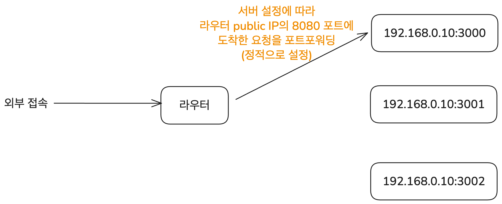

# 이 글은 작성 중입니다.

넷매니아즈의 "유창모"님이 작성하신 [NAT 관련 글들](https://www.netmanias.com/ko/?m=search&tag=248)을 많이 참고하였으며 개별 링크들은 참고 섹션에 밝힌다.

# NAT란 무엇인가?

## NAT의 정의

NAT(Network Address Translation)는 사설 네트워크의 호스트가 외부의 공개된 네트워크에 연결할 수 있도록 상호 간에 주소를 변환해 주는 기술이다. 보통 LAN과 인터넷을 연결하는 라우터 혹은 방화벽에서 NAT를 이용해 IP 주소 변환을 처리한다.

일반적으로 말하는 NAT는 사설 IP와 공인 IP를 1:1로만 대응시키는 Basic NAT와 포트 번호까지 포함해서 IP 주소를 변환하는 NAPT(Network Address Port Translation)를 모두 포함한다. 일반적으로 NAT 장비는 둘 다 지원하고 NAT에 관한 RFC 3022에서도 이 둘을 묶어서 Traditional NAT라고 부르고 있으므로 이 글에서도 따로 구분을 두지 않고 쓰겠다.

## NAT의 동작

그럼 NAT는 구체적으로 어떻게 동작할까? 포트 번호까지 변환하는 NAPT(Network Address Port Translation)를 사용한다고 하자. 그럼 NAT 라우터는 이런 변환을 수행한다.

- 외부로 데이터 송신 시: (송신하는 기기의 사설 IP 주소, 포트 번호) -> (NAT 라우터의 공인 IP 주소, 포트 번호) 변환
- 외부에서 데이터 수신 시: (NAT 라우터의 공인 IP 주소, 포트 번호) -> (수신하는 기기의 사설 IP 주소, 포트 번호) 변환

데이터를 보내는 경우의 예시를 들어보자. 사설 IP `192.168.0.10:8080`를 가진 기기에서 `128.119.40.186:80`으로 데이터를 보내는 상황이다. 기기의 사설 IP 주소는 정적으로 지정되어 있을 수도 있고 DHCP로 동적 할당된 것일 수도 있는데 여기서는 크게 중요하지 않다. 중간에 거치는 NAT 라우터의 공인 IP 주소는 `203.0.113.25`이라고 하자. 이때 데이터를 보내는 과정은 다음과 같다.

먼저 사설 네트워크의 `192.168.0.10:8080` 기기에서 수신지 주소가 `128.119.40.186:80`으로 표기된 데이터그램을 전송한다. 이 데이터그램은 NAT를 사용하는 라우터에 먼저 도달하게 된다. 라우터 또한 공인 IP 주소뿐 아니라 사설 네트워크 내의 사설 IP 주소도 가지고 있다. 그림에서는 해당 IP들을 파란색으로 표시하였다.

라우터는 NAT를 이용해 사설 IP 주소 + 포트번호와 공인 IP 주소 + 포트번호를 매핑하는 테이블을 가지고 있다. 이를 이용해 데이터그램의 송신지 주소를 변환하고 데이터그램을 외부로 전송한다.

IP 주소 매핑에 쓰는 테이블은 내부에서 외부로 나가는 데이터가 감지될 때 필요하면 라우터가 업데이트한다. 데이터그램에 포함된 (사설 IP, 포트 번호)가 테이블에 없으면 새로운 외부 포트를 할당하고 매핑을 만들어서 일정 시간 유지되도록 테이블에 등록한다. 이 매핑은 양방향이라서 외부에서 데이터그램이 들어왔을 때도 사용할 수 있지만 업데이트는 내부에서 외부로 데이터가 나갈 때만 이루어진다.

여기서는 테이블에 이미 매핑이 있다고 가정하고 그림을 그렸다.

이렇게 변환된 데이터그램은 인터넷 상에 있는 라우터들을 거쳐서 네트워크 오류가 발생하지 않을 경우 최종 목적지인 `128.119.40.186:80`에 도달할 수 있다.

응답이 사설 네트워크 내의 목적지에 도착하는 과정은 위의 반대 순서로 이루어진다. 응답이 담긴 데이터그램을 라우터가 받으면 라우터는 매핑 테이블을 참조해서 수신지 주소를 사설 IP 주소 + 포트 번호로 변환하고 데이터그램을 사설 네트워크 내부의 목적지로 전송한다.

이때 사설 IP 주소는 `10.0.0.0/8`(class A), `172.16.0.0/12`(class B), `192.168.0.0/16`(class C) 대역에 속한다. 이 대역에 속한 IP 주소는 IANA에서 사설 IP 전용으로 정의하고 있으므로 인터넷에서 라우팅될 수 없다.

여기 쓰이는 포트 번호도 어느 정도 지정되어 있다. destination의 포트 번호는 0-1023(well-known port) 혹은 1024-49151(registered port)이다. source 그러니까 사설 네트워크 내부에서 사용하는 주소의 포트 번호는 라우터가 임의로 할당하는데 운영체제마다 다르지만 대략 30000-60000 사이의 포트 번호를 사용한다.

## NAT 사용의 이점

NAT를 사용하면 좋은 점들도 있다. 이런 이득은 외부에서 보이는 IP 주소와 내부적인 IP 주소가 다르며 외부에서는 사설 네트워크 전체가 단 하나의 공인 IP를 가진 것처럼 보인다는 데에서 나온다.

- 사설 네트워크 내의 모든 장치가 하나의 공인 IP 주소를 사용하므로 IPv4 주소 절약
- 외부 통신에 대한 변경 없이 LAN 내의 기기 주소 변경 등 네트워크 설정 변경 가능
- 사설 네트워크 내부 장치들의 사설 IP 주소 변경 없이 공인 IP 주소 변경 가능
- NAT는 외부에서 직접 내부 IP에 접근할 수 없게 해주므로 보안성 향상

# 외부 접근과 포트포워딩

## NAT의 문제

NAT의 동작 과정을 위에서 살펴보았다. 그런데 중간에 이런 문장이 있었다.

> IP 주소 매핑에 쓰는 테이블은 내부에서 외부로 나가는 데이터가 감지될 때 필요하면 라우터가 업데이트한다.

(송신 기기의 사설 IP 주소, 포트 번호) <-> (NAT 라우터의 공인 IP 주소, 포트 번호) 간의 매핑이 NAT 테이블에 등록되기 위해서는 먼저 사설 네트워크 내의 기기에서 라우터를 통해 나가는 데이터가 있었어야 한다는 뜻이다. 물론 inbound 트래픽도 NAT 테이블을 업데이트하는 경우[^1]가 있지만 대부분의 경우 외부로 나가는 데이터가 있을 경우에만 NAT 테이블을 갱신한다.

이 상황에서 발생하는 문제가 있다. 외부에서 사설 네트워크의 특정 기기에 접속해서 데이터를 주고받아야 하는 경우를 NAT가 제대로 처리할 수 없다는 것이다. 이건 보안상에는 이점이 되기도 하지만 사설 네트워크를 통해 수많은 서비스를 운영해야 하는 경우에는 문제가 된다.

사설 네트워크 내의 배포 서버에서 사이트를 운영중인 경우를 예시로 생각할 수 있다. 배포 서버에서 사용자에게 먼저 데이터를 보내는 경우는 많지 않으므로 NAT 테이블 매핑이 없는 상황이 많다. 그럼 외부에서 어떻게 배포중인 사이트에 접근할 수 있도록 할 것인가?

이걸 해결하는 방법이 포트포워딩이다.

## 포트포워딩

외부에서 사설 네트워크 내의 적절한 호스트로 접속할 수 있도록 해주는 가장 간단한 방법은 포트포워딩이다. 외부의 특정 포트로 온 요청이 사설 네트워크 내의 어떤 주소로 가야 하는지 직접 지정해 주는 방법이다. "외부의 특정 포트로 들어온 요청은 사설 네트워크의 이 호스트로"라는 연결이 정적일 때 유용하다.

예를 들어 라우터 public IP의 8080 포트로 들어오는 모든 요청은 사설 네트워크 내의 `192.168.0.10:3000`으로 보내는 식이다. nginx, Apache 등의 도구를 이용해서 설정할 수 있다.

그림으로 나타내면 다음과 같다. 이때 이러한 매핑은 정적으로 설정되어야 한다. 즉 사설 네트워크 내의 특정 호스트에 대한 매핑이 필요할 때마다 라우터에 설정을 해주어야 한다.

이렇게 외부의 공개된 IP에서 요청이 도착해서 대응하는 응답을 보내기만 하는 경우 포트포워딩으로 해결할 수 있다. 하지만 모든 문제가 해결된 건 아니다. 서로 다른 기기들이(같은 사설 네트워크 내에 있을 수도 있고 아닐 수도 있다) 직접 연결을 맺어야 하는 경우 포트포워딩으로는 해결할 수 없다. 이를 해결하는 기술이 이제 설명할 NAT Traversal이다.

# NAT Traversal

사실 NAT의 외부 접근에 대해서 생기는 진짜 문제는 P2P(peer-to-peer) 통신이다. 예를 들어 두 사용자가 화상 통화를 해야 하는 경우를 생각해 보자. 그러면 두 컴퓨터는 서로 직접 연결을 맺고 데이터를 주고받아야 한다.

하지만 일반적으로 개인이 사용하는 컴퓨터는 가정용 와이파이나 회사의 LAN과 같은 사설 네트워크에 속해 있다. 즉 둘 다 NAT를 통해 사설 네트워크 내의 주소를 사용하고 있으며 외부에서 직접 해당 호스트를 지정해서 연결할 수 있는 주소는 없다. 이런 상황을 정적인 포트포워딩만으로 해결할 수는 없다. 포트포워딩을 하더라도 "상대의 어떤 외부 포트로 연결을 보내야 하는지"를 알아야 하는데 이 정보를 일단 상대에게 전달받아야 하기 때문이다.

이런 문제 상황에 두 호스트가 직접 연결을 맺을 수 있도록 해주는 기술이 NAT Traversal이다.

# 참고

키하시 마사히로 지음, 김모세 옮김, "그림과 작동 원리로 쉽게 이해하는 서버의 기초"

Network NAT, NAPT, 포트포워딩

https://8iggy.tistory.com/249

NAT를 넘어 P2P 통신하기

https://velog.io/@sharlotte_04/P2P-NAT

NAT (Network Address Translation) 소개 (RFC 3022/2663)

https://www.netmanias.com/ko/?m=view&id=blog&no=5826

NAT 장비는 이렇게 만들어야 하는데... (RFC 4787) - 1편: Mapping Behavior

https://www.netmanias.com/ko/?m=view&id=blog&no=5833

[^1]: 정확히는 Mapping Refresh Behavior, 즉 매핑이 저장되는 시간을 지정하는 타이머를 어떤 경우에 갱신하는지에 대한 규칙이다. "NAT Inbound refresh behavior"가 True인 경우 외부에서 들어온 데이터그램이 있을 때마다 매핑을 갱신한다.