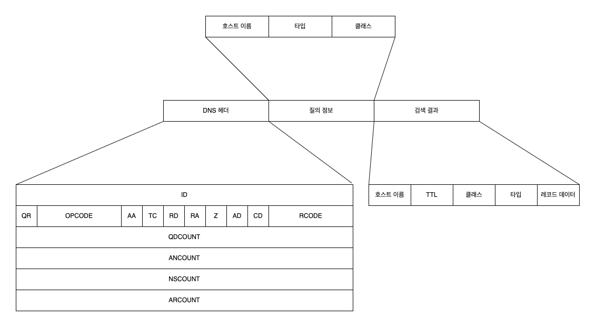
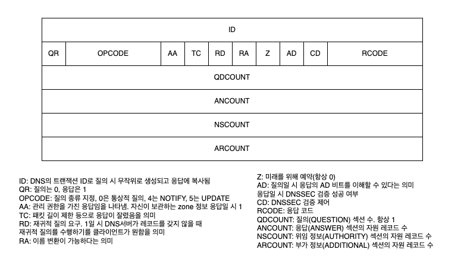
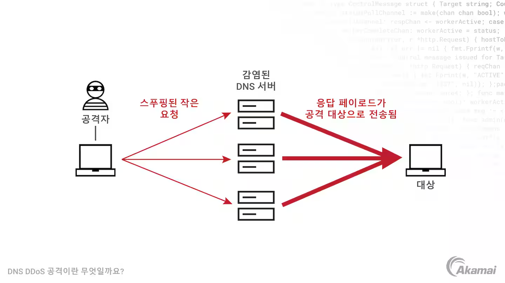

부족한 네트워크 지식, 그리고 찾아야 할 키워드를 알아냄에 있어서 홈 서버 관련 블로그를 운영하는 지인 [불칸](https://vulcan.site/)의 큰 도움을 받았다.

# 이 글은 작성 중입니다.

# 시작

[이전 글](/posts/network-how-dns-works)에서는 DNS가 어떻게 우리의 요청을 처리하는지, DNS 서버에 메시지를 보내는 리졸버와 DNS 서버의 처리 과정을 살펴보았다. 그럼 이번 글에서는 DNS 그 자체에 대해서 좀 더 알아보자.

# DNS가 나오기까지

현재의 인터넷은 1981년에 나온 RFC 791 Internet Protocol에 기반하고 있다. 이 RFC는 오늘날 IPv4라고 불리는 32비트 주소 형식과 이를 이용한 통신을 정의하여 인터넷 프로토콜의 기본적인 동작을 구성했다.

이런 주소만 가지고는 대상을 찾기 어렵다는 게 문제였다. 예를 들어 `163.239.1.1`이라는 IPv4 주소는 서강대학교에 할당되어 있다. 하지만 이 주소를 보고 서강대학교를 떠올리기는 어렵다. 그래서 등장한 게 호스트 이름이다. `sogang.ac.kr` 같은 호스트 이름을 사용하면 훨씬 기억하기 쉽고, 사람도 이해하기 쉬운 주소가 된다. 그럼 이걸 어떻게 IP 주소와 매핑할까? 이에 대한 아이디어가 발전하면서 DNS가 등장한다.

## HOSTS.TXT

인터넷의 초기에는 이 호스트 주소와 IP 주소를 매핑하는 파일을 모두가 공유했다. 이 파일은 `HOSTS.TXT` 파일이라고 불렸는데 이건 인터넷의 전신인 ARPANET에서부터 사용된 이름이었다.

인터넷에서도 쓰이게 된 이 파일은 ARPANET부터 많은 영향을 미친 기관 중 하나인 SRI-NIC(Stanford Research Institute Network Information Center)에서 관리했다. `HOSTMASTER@SRI-NIC`에 메일을 보내는 방식으로 이 파일을 업데이트할 수 있었다고 한다.

이 파일의 구체적인 관리와 형식에 대해서는 [RFC 952](https://www.rfc-editor.org/rfc/rfc952.txt)에 설명되어 있다. 그리고 이때 쓰이던 [HOSTS.TXT 파일은 HOSTS.TXT archive](https://github.com/ttkzw/hosts.txt?tab=readme-ov-file)에서 볼 수 있다. `KOREA-EMH`처럼 한국의 호스트로 추정되는 이름도 찾아볼 수 있다.

이렇게 인터넷 초기에는 호스트 이름과 IP 주소의 매핑을 수동으로 관리했다. 이 방식을 `HOSTS.TXT` 방식이라고 부르며 지금도 많은 OS에 `/etc/hosts` 파일로 남아 있다.

```bash
# 터미널에서 /etc/hosts 확인하기
$ cat /etc/hosts
127.0.0.1	localhost
255.255.255.255	broadcasthost
::1             localhost
# ...
```

## DNS의 등장

인터넷이 커지면서 이 방식은 당연하게도 한계에 부딪친다. 중복 등을 막아야 했으므로 `HOSTS.TXT` 파일 관리에 필요한 비용은 점점 커졌지만 이런 관리에 많은 자원을 써야 한다는 개념이 없던 시대였다. 또 이렇게 중앙에서 관리하는 방식은 인터넷의 분산 구조와도 맞지 않았다.

인터넷의 역할도 변했다. 과거에 인터넷이라는 존재는 대형 시분할 시스템을 가진 기관들을 연결하는 하나의 네트워크였다. 하지만 컴퓨터는 기관에서 운영하는 시분할 시스템이 아니라 개인이 소유하는 물건이 되었다. 인터넷 또한 이런 개인용 컴퓨터들을 연결하는 로컬 네트워크들을 연결하는 네트워크로 발전했다. 이런 변화에 맞추기 위해서는 인터넷의 호스트 이름과 IP 주소를 관리하는 방식도 바뀌어야 했다.

그래서 인터넷의 선구자 그룹에 있던 존 포스텔(John Postel)과 폴 모카페트리스(Paul Mockapetris)가 DNS를 제안했다. DNS는 Domain Name System의 약자로, 호스트 이름과 IP 주소를 매핑하는 분산형 데이터베이스 시스템이다. DNS는 1983년에 RFC 882와 RFC 883로 처음 정의되었고, 이후 RFC 1034와 RFC 1035로 발전했다. DNS 시스템이 실용적으로 쓰이기 시작한 건 대략 1985년부터였다.

# DNS 서버 계층 구조의 활용

## 도메인명

모든 호스트 이름은 인터넷 전체에서 유일해야 한다. `witch.work`라는 도메인 이름을 갖는 사이트가 여러 개라면 곤란하다. DNS는 이 유일함을 보장하기 위해 DNS 서버의 계층 구조를 활용한다. 각 계층의 조직들 각각에 계층 내에서 유일한 레이블을 할당하고 이를 `.`으로 연결해 호스트 이름을 구성하는 것이다. 각 레이블은 63문자 이하라는 제한이 있다.

예를 들어 TLD(Top Level Domain) 계층에 있는 `work`는 전체 TLD 중 유일하다. 또 `witch` 레이블은 `work` TLD 하에 있는 식별자 중 유일하다. 마지막으로 호스트 이름은 이 모든 식별자들을 점(`.`)으로 구분하여 연결한 것이다. 따라서 `witch.work`는 인터넷 전체에서 유일하다.

이렇게 호스트 이름의 구성 요소들은 인터넷의 각 계층에서 유일하므로 호스트 이름 전체도 인터넷 상에서 유일함이 보장된다. 여기서 설명한 계층 이외에도 서브도메인 등을 추가할 수 있지만 계층 구조 상에서 유일해야 한다는 건 똑같다.

호스트 이름이 유일하다는 게 DNS 상에 해당 호스트 이름을 갖는 레코드가 하나뿐이라는 건 아니다. 하나의 호스트 이름은 여러 개의 DNS 자원 레코드를 가질 수 있고 이를 나타나는 RRSet이라는 용어도 있다. 다만 호스트명이 나타내는 조직이 인터넷 상에서 유일해야 할 뿐이다.

## 관리의 위임

이전 글에서 DNS는 계층 구조로 되어 있다고 했다. 그럼 각 계층은 어디서 관리할까? 먼저 루트 DNS 서버는 ICANN(Internet Corporation for Assigned Names and Numbers) 소속의 IANA(Internet Assigned Numbers Authority)에서 관리한다.

분산형 데이터베이스인 DNS답게 루트 DNS 서버도 중앙에 하나만 존재하는 게 아니다. 루트 DNS 서버는 12개의 다른 기관에서 관리되는 13개의 서버로 구성되어 있으며 전세계에 1000개 이상의 인스턴스(복사본)가 퍼져 있다.

그 밑의 TLD DNS 서버는 원래 SRI-NIC에서 관리했지만 이제는 각 TLD를 관리하는 기관에서 위임받아 관리한다. `.com`은 미국의 VeriSign, `.kr`은 한국인터넷진흥원 산하 KRNIC에서 관리하는 식이다.

이렇게 DNS는 하위 계층 관리를 다른 조직에 위임할 수 있다. 위임되는 단위를 존(Zone)이라고 부른다. 존을 위임받은 조직은 각자의 정책을 세워서 해당 존을 관리할 수 있다. 예를 들어 `.gov` TLD를 관리하는 기관에서는 이 TLD를 사용하는 조직을 미국 정부 기관으로 한정한다.

# DNS 서버의 정보 저장

DNS 서버가 계층적으로 구성된다는 건 알았다. 그럼 DNS 서버는 호스트 이름과 IP 주소를 구체적으로 어떻게 매핑하고 있는 걸까? 또 다른 정보는 없을까?

## 자원 레코드

DNS 서버는 호스트 이름, 타입, 클래스를 키로 하고 타입별로 정해진 형식의 값을 보관하는 데이터베이스이다. DNS 서버는 이 정보를 저장하고 있다가 질의가 들어오면 해당 키에 대한 대한 정보를 찾아서 응답한다. 이때 키-값 쌍을 자원 레코드(Resource Record, RR)라고 부른다. DNS 서버는 자원 레코드를 이용해서 호스트 이름과 IP 주소를 매핑한다.

자원 레코드는 다음과 같은 형식으로 정보를 담고 있다.

```
<Name> <TTL> <Class> <Type> <Value>
```

`<Name>`, `<Value>`의 의미는 `<Type>`에 따라 다르다. 주로 쓰이는 레코드 타입과 거기 대응되는 Name, Value의 의미는 다음과 같다. 더 많은 레코드 타입에 대해서는 [Cloudflare의 DNS 레코드 개요](https://www.cloudflare.com/ko-kr/learning/dns/dns-records/)에서 볼 수 있다.

- A: Name은 호스트 이름, Value는 IPv4 주소
- AAAA: Name은 호스트 이름, Value는 IPv6 주소
- NS: Name은 도메인, Value는 해당 도메인의 호스트에 대한 IP 주소를 가진 DNS 서버의 호스트 이름
- CNAME: Canonical Name의 약자. Name은 별칭 호스트 이름, Value는 원본 호스트 이름
- MX: Name은 도메인, Value는 `Name`을 별칭으로 갖는 메일서버의 원본 호스트 이름

`<TTL>`은 Time To Live의 약자로 이 레코드가 얼마나 오랫동안 유효한지를 나타낸다. 즉 캐시에서 제거되는 기간을 뜻한다.

만약 호스트 이름 X에 대해 어떤 DNS 서버가 책임 DNS 서버라면 이 DNS 서버는 X에 대한 A 혹은 AAAA 레코드를 포함한다. 호스트 이름의 책임 DNS 서버를 찾기 위해서는 NS 레코드를 사용한다.

그리고 새로운 레코드를 DNS에 삽입하는 건 ICANN의 승인을 받은 등록 기관에서 처리한다. 이 등록 기관의 목록은 [ICANN, List of Accredited Registrars](https://www.icann.org/en/contracted-parties/accredited-registrars/list-of-accredited-registrars)에서 볼 수 있다.

나는 저 목록에도 있는 Cloudflare를 이용해서 "witch.work" 도메인을 등록했다.

## 자원 레코드 확인해보기

DNS 서버에 저장된 자원 레코드를 확인하려면 `nslookup` 명령어를 이용할 수 있다. 이 명령어는 DNS 서버에 질의를 보내고 응답을 읽기 편한 형태로 출력해준다. 예를 들어 "witch.work"의 A 레코드를 확인하려면 다음과 같은 명령어를 입력한다.

```bash
nslookup -type=A witch.work

# 응답
Name:	witch.work
Address: 104.21.32.1 # Cloudflare의 IP 주소이다
# 다른 IP 주소가 있을 수도 있다
```

더 많은 정보를 원한다면 `dig` 명령어를 사용할 수 있다. 이건 Domain Information Groper의 약자로 DNS 서버에 질의를 보내고 응답을 자세히 출력해준다. MacOS에는 기본적으로 깔려 있고 이외의 OS에서는 다운받아 사용할 수 있다. 이런 단순한 조회 외에도 DNS 서버 지정, 경로 추적 등이 가능한데 이는 [dig 명령어로 DNS 조회 및 진단하기](https://www.daleseo.com/dig/)에 자세히 나와 있다.

이렇게 `dig`을 사용하면 다음과 같이 DNS 헤더, 질의 내용, 응답까지 자세히 출력해 주는 걸 볼 수 있다. 실제로는 쿼리에 소요된 시간이나 어떤 서버를 거쳤는지도 나오지만 너무 길어져서 여기서는 생략했다. 호스트 이름, 타입, 클래스로 이루어진 질의가 DNS 서버에 보내지고, DNS 서버는 해당 호스트 이름에 대한 자원 레코드를 찾아서 응답하는 걸 볼 수 있다.

```bash
$ dig witch.work

; <<>> DiG 9.10.6 <<>> witch.work
;; global options: +cmd
;; Got answer:
;; ->>HEADER<<- opcode: QUERY, status: NOERROR, id: 11209
;; flags: qr rd ra; QUERY: 1, ANSWER: 7, AUTHORITY: 0, ADDITIONAL: 1

;; OPT PSEUDOSECTION:
; EDNS: version: 0, flags:; udp: 4096
;; QUESTION SECTION:
;witch.work.			IN	A

;; ANSWER SECTION:
witch.work.		300	IN	A	104.21.80.1
# ...
```

## 클래스 필드

자원 레코드에서 언급하지 않은 필드가 하나 있다. 바로 `<Class>`다. 대부분의 경우에는 `IN` 클래스를 사용하고 이외의 클래스는 일반적인 경우 볼 일이 없다. 다만 기본적인 정보는 적어둔다.

이 필드는 자원 레코드가 어떤 종류의 네트워크 프로토콜을 사용하는지를 나타낸다. 우리가 보는 `IN` 클래스는 Internet을 의미한다. 그럼 이외의 클래스는? [RFC 1035](https://www.rfc-editor.org/rfc/rfc1035.txt)에서 찾아볼 수 있는 클래스는 다음과 같다.

> 3.2.4. CLASS values
> 
> CLASS fields appear in resource records. The following CLASS mnemonics and values are defined:
> 
> IN              1 the Internet
> 
> CS              2 the CSNET class (Obsolete - used only for examples in some obsolete RFCs)
> 
> CH              3 the CHAOS class
> 
> HS              4 Hesiod [Dyer 87]

우리에게 익숙한 `IN` 이외에도 다른 클래스들을 찾아볼 수 있다. 이들은 오늘날에는 거의 쓰이지 않지만 네트워크의 역사적인 이유로 남아 있다. 각각의 정보와 참고 자료는 다음과 같다.

- CS는 CSNET이라는 네트워크에서 사용되는 클래스였다. CSNET은 ARPANET에 직접 연결할 수 없었던 기관들을 위해 만들어진 네트워크였으며 이후 NSFNET에 이어 인터넷으로 이어졌다. [위키피디아 CSNET 문서](https://ko.wikipedia.org/wiki/CSNET) 참고.
- CH는 Lisp 언어를 더 효율적으로 사용하기 위해 만들어진 Lisp Machine들의 로컬 네트워크로 계획된 Chaosnet의 클래스다. [A Short History of Chaosnet](https://twobithistory.org/2018/09/30/chaosnet.html) 참고.
- HS는 MIT에서 개발하던 분산 컴퓨팅 프로젝트였던 프로젝트 아테나에서 사용한 네임 서비스였다. [위키피디아 Project Athena 문서](https://en.wikipedia.org/wiki/Project_Athena), [위키피디아 Hesiod 문서](https://en.wikipedia.org/wiki/Hesiod_(name_service)) 참고.

## NS 레코드와 위임

DNS 서버는 계층 구조와 위임을 통해 관리된다고 했다. 이 위임 또한 데이터베이스 내의 자원 레코드 중에서 NS 타입 레코드를 통해 이루어진다. NS 타입 레코드는 호스트 이름과 해당 호스트 이름의 권한 DNS 서버의 호스트 이름을 매핑한다. 즉 어떤 zone을 관리하는 DNS 서버를 찾는 데 사용된다.

예를 들어 루트 서버에는 TLD 서버로의 위임 정보가 있으므로 다음과 같은 NS 레코드를 저장한다.

```
work.			172800	IN	NS	a.nic.work.
work.			172800	IN	NS	b.nic.work.
work.			172800	IN	NS	c.nic.work.
work.			172800	IN	NS	x.nic.work.
work.			172800	IN	NS	y.nic.work.
work.			172800	IN	NS	z.nic.work.
```

이다음에는 TLD DNS 서버의 IP 주소를 조사해야 한다. 그런데 `work.` TLD DNS 서버의 IP 주소를 알기 위해 `a.nic.work.`(`b.nic.work.` 같은 다른 값도 상관없다)를 조사해야 하는데 이를 위해서도 `work.`의 TLD DNS 서버 주소를 알아야 하는 모순이 발생한다.

이를 해결하기 위해 DNS 서버가 응답할 때 `a.nic.work.`와 같은 주소들의 A 레코드도 함께 응답한다. 또한 NS 정보에서만큼은 이런 모순 발생을 막기 위해 CNAME 레코드를 이용한 이름 변환이 불가능하다. 즉 루트 서버로부터의 실제 응답은 원칙적으로는 다음과 같이 올 것이다.

```bash
work.			172800	IN	NS	a.nic.work.
# 기타 NS 레코드들...
a.nic.work.		172800	IN	A  37.209.192.10
# 기타 A 레코드들...
```

# DNS 메시지

[DNS 시리즈 1편](/ko/posts/network-how-dns-works)에서 DNS 요청 메시지는 UDP를 사용하며 포트 53을 통해 전송된다고 했다. 그리고 방금 DNS 서버가 어떤 형식으로 정보를 저장하는지 알아보았다. 그러면 이 정보들을 구체적으로 어떤 형식으로 주고받는 걸까?

## DNS 메시지 형식

먼저 DNS 서버와 클라이언트 간에 주고받는 데이터는 바이너리 형식이며 DNS 헤더, 질의 정보, 검색 결과로 구성된다. 각각은 여러 정보들을 담고 있는데 먼저 전체 구조를 보고 넘어가자.



익숙한 내용들도 있다. 질의 정보와 검색 결과는 앞서 설명한 내용 그대로이다. DNS 서버가 호스트 이름, 타입, 클래스를 키로 사용하므로 그걸 질의 정보로 사용하는 것이고 검색 결과는 자원 레코드 정보이다.

이제 남은 건 DNS 헤더이다.

## DNS 헤더 정보

DNS 헤더에는 위에서 본 것처럼 많은 정보가 담겨 있다. 이중 짚고 넘어갈 만한 건 RD, AA 레코드 정도이다.

RD 필드는 이 DNS 메시지가 재귀적 질의(Recursive query)인지를 나타낸다. 재귀적 질의는 필요한 정보를 얻기 위해 다른 서버에 요구하는 방식이다.

예를 들어 스텁 리졸버는 자신이 필요한 호스트 이름의 IP 주소 정보를 얻기 위해 직접 DNS 서버에 질의하는 대신 풀 리졸버로 질의한다. 이런 게 재귀적 질의이고 따라서 스텁 리졸버에서 풀 리졸버로의 DNS 메시지의 RD 비트는 1이다. 반면 풀 리졸버는 직접 DNS 서버에 질의하므로 반복적 질의(Iterative query)이고 이 경우 메시지의 RD 비트는 0이다.

AA 필드는 Authoritative Answer의 약자로 현재 응답하는 서버가 질의의 호스트 응답에 대한 관리 권한을 가진 책임 DNS 서버인지를 나타낸다. 만약 1이라면 이 DNS 서버가 해당 호스트 이름에 대한 권한이 있는 DNS 서버라는 뜻이다. 풀 리졸버는 DNS 서버에 재귀적 질의를 하는 중에 AA비트가 1인, 그러니까 관리 권한이 있는 서버의 응답 정보를 받으면 그 응답을 캐싱하고 스텁 리졸버에 넘겨주게 된다.

DNS 헤더에 담긴 그 외의 정보들은 필요할 경우 다음 그림에서 확인할 수 있다.



# DNS 서버가 부하를 줄이는 법

IP 주소를 직접 타이핑해서 웹 사이트에 접속하는 사람은 거의 없다. 대부분은 "google.com"같은 호스트 이름을 이용한다. DNS 조회는 이런 호스트 이름을 통해 사이트에 접속할 때마다 일어나므로 DNS 서버는 엄청난 양의 요청을 처리해야 한다. 따라서 DNS 서버는 좀 더 효율적으로 많은 요청을 처리하고 위에 설명한 긴 요청-응답 과정의 부하를 줄이기 위한 여러 가지 최적화 기법을 사용한다.

## 캐싱

먼저 여러 단계에서 캐싱을 사용한다. 일단 최신 웹 브라우저의 경우 정해진 시간 동안 DNS 레코드를 캐시한다. 그리고 사용자가 DNS 레코드를 질의할 시 브라우저 캐시에서 가장 먼저 확인한다. 크롬의 경우 `chrome://net-internals/#dns`에서 캐시된 DNS 레코드를 확인할 수 있다.

그리고 스텁 리졸버, 풀 리졸버도 캐싱을 한다. 자원 레코드의 TTL(Time To Live) 값이 바로 캐시가 유지되는 기한을 나타내는데 이 값이 만료되기 전까지는 같은 호스트 이름에 대한 질의가 들어오면 캐시된 응답을 바로 보내준다. 풀 리졸버가 로컬 캐싱을 구현해야 한다는 요구 사항이 아예 RFC 1123에 정의되어 있다.

자원 레코드의 값을 캐싱하는 방식으로만 DNS 서버의 부하를 줄일 수 있는 건 아니다. 다른 DNS 서버의 정보를 캐싱함으로써 계층 구조상 상위에 있는 DNS 서버로 질의를 보내는 걸 막고 상위 DNS 서버의 부하를 줄일 수도 있다.

예를 들어 특정 호스트 이름에 대한 DNS 질의를 받았을 때 A 레코드에 대한 캐싱이 없더라도 호스트 이름에 대한 NS 레코드를 캐싱하고 있을 수 있다. 이 경우 재귀적인 질의 단계를 거치지 않고 NS 레코드의 네임서버에 바로 질의한다. 혹은 TLD DNS 서버의 IP 주소를 캐싱하고 있다면 루트 DNS 서버에 질의하는 걸 피할 수 있다.

## 응답 순환

DNS 서버 자체를 여러 개 두고 순환시키는 방법도 있다. Primary/Secondary DNS라고 불린다. Primary DNS 서버가 책임 DNS 서버의 레코드를 관리하고 Secondary DNS 서버는 Primary DNS 서버의 레코드를 복제해서 사용한다. Secondary DNS 서버는 백업 역할을 하는데 여러 개 존재할 수도 있다. 이때 Primary/Secondary DNS 서버의 데이터는 거의 동기화되어 있으므로 이 서버들을 이용해서 부하를 분산시킬 수 있다. 여기에 [라운드 로빈 DNS](https://www.cloudflare.com/ko-kr/learning/dns/glossary/round-robin-dns/) 기술을 활용한다.

Secondary DNS 서버는 Primary DNS 서버에 저장된 정보와 동기화되어 있어야 한다. 따라서 Secondary DNS 서버는 Primary DNS 서버에 주기적으로 질의를 보낸다. 여기에 AXFR 혹은 IXFR이라고 불리는 프로토콜이 사용된다. 그러면 Primary DNS 서버에 변경 사항이 있는지를 확인하는데 이때 SOA(Start of Authority) 레코드가 사용된다.

SOA 레코드는 DNS 서버(정확히는 DNS zone인데 이 맥락에서 크게 중요하지 않다)에 대한 중요한 정보를 저장하는데 여기에 일종의 일련번호가 저장되어 있다. DNS 서버에 변경사항이 있으면 이 일련번호가 변경된다. 이 일련번호가 Primary/Secondary DNS 서버 간에 다르면 Secondary DNS 서버는 Primary DNS 서버에 데이터 전송을 요청해 동기화한다.

이후 Secondary DNS 서버와의 동기화까지 걸리는 시간을 줄이기 위해 Primary DNS 서버에 변경사항이 있을 시 알림을 보낼 수 있는 메커니즘(NOTIFY)도 나왔다. Secondary DNS는 NOTIFY 메시지를 받으면 Primary DNS 서버에 질의를 보낼지 결정할 수 있다.

# DNS와 보안

DNS 또한 서버이고 네트워크이므로 공격의 대상이 될 수 있다. 이러한 공격 중 일부와 방어하기 위해 사용하는 기술을 간단히 알아보자.

## DNS 반사 공격

앞서 DNS 서버는 계층 구조에서의 위임을 NS 레코드를 통해 처리한다고 했다. 어떤 DNS 서버가 다른 DNS 서버에 질의를 넘길 때는 위임할 DNS 서버의 호스트 이름을 담은 NS 레코드와 질의를 위임받을 DNS 서버의 IP 주소를 담은 A 레코드를 함께 응답한다. 그런데 이 원리가 악용되어 공격에 쓰일 수 있다.

DNS는 UDP 프로토콜을 사용한다고 했다. 그런데 UDP의 문제는 IP 패킷의 주소를 속이는(IP Spoofing)데 취약하다는 것이다. 따라서 송신 IP 주소를 속이면 공격자의 DNS 서버에서 보낸 DNS 질의에 대한 응답이 다른 곳으로 향하도록 할 수 있다. 이때 DNS 서버가 질의보다 훨씬 큰 응답을 보내도록 해서 공격 패킷을 증폭시킨다.

예를 들어 질의의 호스트 이름은 `.`, 타입은 NS로 해서 질의를 보낸다면 공격당하는 쪽에서는 질의의 크기보다 훨씬 큰 응답을 받게 된다. 정량적으로는 약 60바이트의 질의로 512바이트 이상의 공격 패킷을 보낼 수 있다고 한다.[^1]



이런 공격을 막는 가장 기본적인 방법은 DNS 서버에서 접근할 수 있는 리졸버의 IP 주소를 제한하는 것이다. 가령 풀 리졸버를 직접 설정한다면 localhost에서 온 질의만 받아들이도록 설정하는 걸 생각해 볼 수 있다. 

하지만 제3자에게 받은 DNS 질의도 받아들이는 공용 DNS 리졸버 혹은 DNS 서버에서는 따로 DNS 반사 공격을 막는 다양한 장치를 둔다. IP Spoofing을 막는 장치를 둘 수도 있고, 가능한 최대 DNS 응답을 달라는 요청인 `ANY` 요청을 비활성화하는 방식도 있다. 혹은 부하 수집을 바탕으로 특정 리졸버나 클라이언트의 질의를 대기시키기도 한다. 더 자세한 방식은 [America's Cyber Defense Agency의 DNS 증폭 공격 문서](https://www.cisa.gov/news-events/alerts/2013/03/29/dns-amplification-attacks)에서 찾아볼 수 있다.

## DNSSEC(DNS Security Extensions)

DNS 서버에 DDoS 공격을 가하거나 클라이언트가 정상적이지 않은 DNS 서버에 질의를 보내도록 해서 사용자가 악의적인 IP 주소를 응답으로 받게 하는 등의 공격이 가능하다. [DNS 캐시 포이즈닝](https://www.cloudflare.com/ko-kr/learning/dns/dns-cache-poisoning/)과 같은 기법들이 있다.

이 공격이 성공할 시 사용자는 아무것도 알아채지 못한 채 악의적인 IP 주소에서 받은 웹사이트에 접속하게 된다. 이런 공격을 방지하기 위해 DNSSEC(DNS Security Extensions)이라는 확장 기능이 있다.

DNSSEC은 DNS 응답을 검증하는 확장 기능이다. 정상적인 출처에서 왔는지를 확인하기 위해서. DNSSEC은 암호화된 서명이 들어 있는 RRSIG 등의 새로운 DNS 레코드 유형을 추가하여 DNS 레코드 응답이 적절한 책임 DNS 서버에서 왔으며 전송 중에 변경되지 않았음을 검증 가능하게 한다. 공개키 암호화 방식을 사용한다.

이 과정은 다음과 같이 이루어진다. 같은 레이블과 유형의 레코드들을 자원 레코드 집합(resource record set, RRSet)으로 묶고 여기에 대한 디지털 서명을 생성하여 RRSIG 레코드로 저장한다. 이 서명을 검증하는 데에 필요한 공개키는 DNSKEY 레코드로 저장한다.

위에서 설명한 DNS 서버의 계층 구조에 접근할 때 각 단계의 상위 계층에서 하위 계층의 레코드가 변경되지 않았음을 검증하는 방식으로 신뢰를 구축한다. 여기에는 DNSKEY의 해시를 저장하는 DS 레코드가 사용된다.

이를 종합하면 DNSSEC이란 로컬 DNS 서버가 DNS 레코드 응답을 받았을 때 RRSIG 서명을 DNSKEY로 검증하며 상위 DNS 서버의 DS 레코드를 통해 하위 DNS 서버의 레코드가 변경되지 않았음을 검증하는 방식으로 DNS 응답의 출처와 무결성을 검증하는 것이다.

이런 식으로 상위 DNS 서버에서 하위 DNS 서버의 레코드를 검증하는 식으로 하면 문제 하나가 있다. 루트 DNS 서버의 정보를 검증할 상위 계층이 없다는 것이다. 따라서 루트 DNS 서버를 검증할 수 있는 서명은 전세계에서 선발된 14명의 사람이 모여서 루트 DNSKEY RRset에 서명하는 [루트 서명식](https://www.cloudflare.com/ko-kr/learning/dns/dnssec/root-signing-ceremony/)에서 결정된다.

이 암호화와 검증 과정은 상당히 복잡하고 내가 생각하던 기본적인 DNS의 동작 방식과는 연관이 적기 때문에 간단히만 설명했다. 더 자세한 내용은 [DNSSEC는 어떻게 작동하나요?](https://www.cloudflare.com/ko-kr/learning/dns/dnssec/how-dnssec-works/), [DNSSEC란 무엇이며 어떻게 작동하나요?](https://www.akamai.com/ko/blog/trends/dnssec-how-it-works-key-considerations) 등을 참고할 수 있다.


# 이외의 DNS 관련 정보

## DNS와 웹 서버 부하 분산

DNS 서버는 여러 개의 IP 주소를 응답으로 보내줄 수 있다. 여러 IP를 가진 웹 서버의 경우 이걸 이용해서 각 IP 주소 서버의 부하를 분산시키려는 시도를 할 수 있다.

"google.com"같이 많이 쓰이는 도메인의 경우 여러 다른 IP를 가지고 있다. 이걸 DNS 서버가 응답할 때 순환식으로 보내주는 것이다. 예를 들어 "google.com"의 IP 주소가 3개 있다고 가정하자. 이 경우 DNS 서버는 다음과 같이 첫번째에는 `IP 1, IP 2, IP 3` 순서로 응답하고 두번째에는 `IP 2, IP 3, IP 1`, 세번째에는 `IP 3, IP 1, IP 2` 순서로 응답하도록 한다.

```
첫번째 질의 응답           두번째 질의 응답        ....
+-----------------+    +-----------------+
| IP 주소 1        |    | IP 주소 2        |
+-----------------+    +-----------------+
| IP 주소 2        |    | IP 주소 3        |
+-----------------+    +-----------------+
| IP 주소 3        |    | IP 주소 1        |
+-----------------+    +-----------------+
```

클라이언트는 보통 이렇게 IP 주소 여러 개를 받으면 그 중 첫 번째 IP 주소로 HTTP 요청을 보낸다. 따라서 웹 서버를 운영하는 측에서는 이 방법으로 각 서버에 오는 요청 부하를 분산시킬 수 있다.

## DNS는 애플리케이션 계층

네트워크의 구성을 나타낼 때 흔히 OSI 7계층 모델을 사용한다. 그러면 DNS 프로토콜은 이 OSI 7계층 모델에서 어떤 계층에 속할까? 

개인적인 경험으로는 면접 때 이 질문을 받았는데 몰라서 쩔쩔맸던 기억이 있다. 이제 와서 알았지만 DNS는 7계층, 애플리케이션 계층의 프로토콜이다.

애플리케이션 계층은 사용자가 가장 가까이 접하는 계층이다. 우리가 보통 생각하는 네트워크의 기능이란 네트워크 상에 있는 서로 다른 종단(Edge)간에 데이터를 주고받는 것이며 애플리케이션 계층은 바로 그런 종단들 간에 데이터를 담은 메시지를 주고받는 프로토콜을 정의하기 때문이다. 대표적으로 다음과 같은 내용을 정의한다.

- 어떤 메시지를 주고받는지(요청 메시지, 응답 메시지 등)
- 여러 메시지 타입을 구성하는 문법
- 메시지에 들어 있는 각 필드의 의미
- 프로세스가 언제, 어떻게 메시지를 전송하고 응답할지

DNS 프로토콜의 특징은 이런 애플리케이션 계층의 정의에 딱 들어맞는다. 클라이언트와 DNS 서버라는 서로 다른 네트워크 종단 간에 어떤 메시지를 어떻게 주고받는지를 정의하기 때문이다.

또한 DNS 메시지는 포트 53을 사용하고 UDP 프로토콜을 통해 전송되는데 UDP는 전송 계층의 프로토콜이다. 이 또한 DNS가 추상화 레이어 상에서 전송 계층의 상위에 존재한다는 뜻이므로 DNS가 애플리케이션 계층 프로토콜임을 뒷받침한다. 물론 OSI 7계층에서는 전송 계층과 애플리케이션 계층 사이에 세션 계층과 표현 계층이 있지만 보통 5,6,7계층의 구분은 명확하지 않다. 이때 애플리케이션 계층과 전송 계층 사이에는 소켓이 인터페이스 역할을 한다.

DNS 프로토콜은 HTTP나 메일에 쓰이는 SMTP처럼 사용자가 쓰는 애플리케이션과 직접 관련이 있는 건 아니다. 대신 DNS는 인터넷 구조의 복잡성을 네트워크 사용자에게 숨기고, 사용자가 편리하게 호스트 이름을 사용할 수 있도록 해주는 역할을 한다. 하지만 그 동작을 보면 애플리케이션 계층 프로토콜의 특징을 잘 보여준다.

# 참고

[Paul V. Mockapetris, Kevin J. Dunlap, Development of the Domain Name System](https://www.cs.cornell.edu/people/egs/615/mockapetris.pdf)

James F. Kurose, Keith W. Ross 지음, 최종원, 강현국, 김기태 외 5명 옮김, 컴퓨터 네트워킹 하향식 접근, 8판

기술평론사 편집부 엮음, 진명조 옮김, 인프라 엔지니어의 교과서 시스템 구축과 관리편, 5장 '최신 DNS 교과서'

아미노 에이지 지음, 김현주 옮김, 하루 3분 네트워크 교실

가비아 라이브러리, DNS 구성 요소 – ② 도메인 네임 서버(Domain Name Server)

https://library.gabia.com/contents/domain/4146/

dig 명령어로 DNS 조회 및 진단하기

https://www.daleseo.com/dig/

Akamai, 리커시브 DNS란 무엇일까요?

https://www.akamai.com/ko/glossary/what-is-recursive-dns

cloudflare, DNS란 무엇입니까? | DNS 작동 원리

https://www.cloudflare.com/ko-kr/learning/dns/what-is-dns/

cloudflare, DNSSEC는 어떻게 작동하나요?

https://www.cloudflare.com/ko-kr/learning/dns/dnssec/how-dnssec-works/

cloudflare, DNSSEC 루트 서명식

https://www.cloudflare.com/ko-kr/learning/dns/dnssec/root-signing-ceremony/

IBM Technology, "What are DNS Zones And Records?"

https://www.youtube.com/watch?v=U-i_UDDYLxY

IBM Technology, "Primary and Secondary DNS: A Complete Guide"

https://www.youtube.com/watch?v=qhiyTH5B21A

IBM Technology, "What is DNSSEC (Domain Name System Security Extensions)?"

https://www.youtube.com/watch?v=Fk2oejzgSVQ

DNS DDoS 공격이란 무엇일까요?

https://www.akamai.com/ko/glossary/what-is-a-dns-ddos-attack

[^1]: 기술평론사 편집부 엮음, 진명조 옮김, 인프라 엔지니어의 교과서 시스템 구축과 관리편, 271p