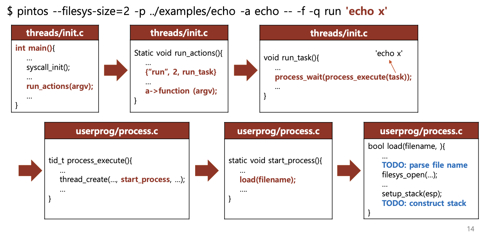
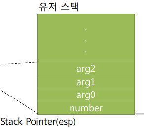
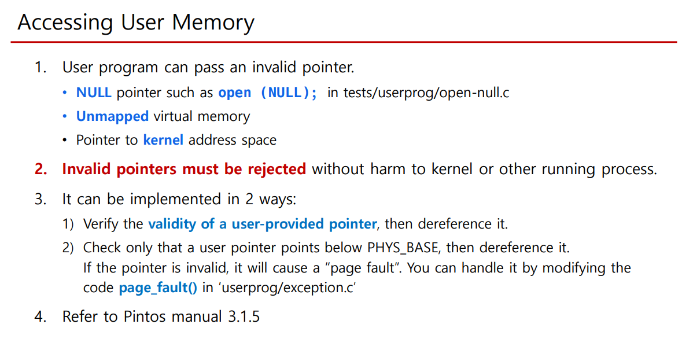
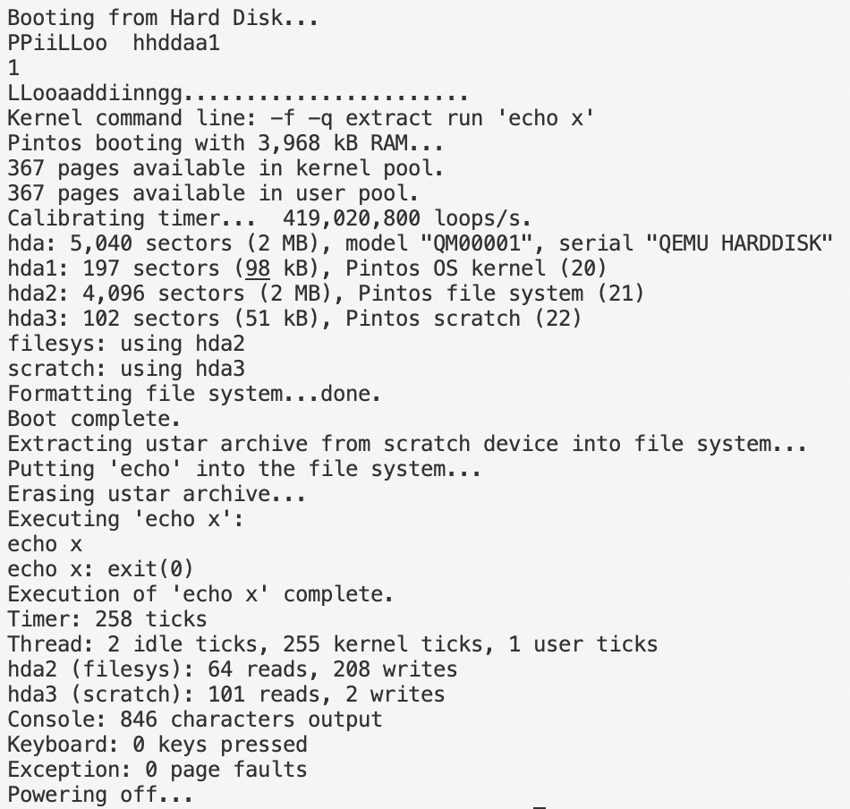
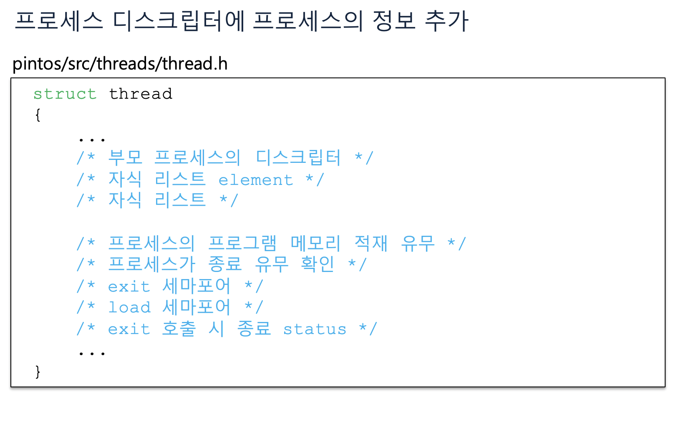

# 1. 본격적인 프로젝트 시작

이번 과제는 시스템 콜 핸들러와 시스템 콜 일부가 작동하도록 하는 것이다.

먼저 pintos 폴더의 src/userprog 와 src/examples 디렉토리에서 make를 실행한 후 src/userprog 디렉토리에서 다음 커맨드를 실행해 본다.

```
pintos --filesys-size=2 -p ../examples/echo -a echo -- -f -q run 'echo x'
```

원래는 `echo x`를 실행하면 `x`가 출력되어야 하지만, 현재는 아무것도 출력되지 않는다. 커맨드를 운영체제에 전달하는 부분이 모두 빠져 있기 때문이다.

핀토스에서 커맨드가 실행되는 방식은 다음과 같다. `echo x`라는 명령이 전달되면 `echo`, `x` 가 유저 스택에 쌓이고, 이 인자들이 커널에 전달되고 커널은 그 인자를 받아 시스템 콜 핸들러를 실행한다. 시스템 콜 핸들러는 적절한 시스템 콜을 실행해 준다.

하지만 아직 핀토스에는 유저 스택, 스택의 인자를 커널에 전달하는 로직, 시스템 콜 핸들러가 구현되어 있지 않기 때문에 `echo x`를 실행하면 아무것도 출력되지 않는다. 즉 유저와 커널이 연결되어 있지 않다.(커널에는 적절한 시스템 콜들이 이미 구현되어 있다) 이번 프로젝트1에서는 이 연결 부분 일부를 구현해야 한다.

# 2. argument passing

## 2.1 분석

유저 스택은 커널이 아닌 유저 프로그램이 사용하는 스택이다. 유저 프로그램이 커널에게 시스템 콜을 요청할 때, 인자를 유저 스택에 쌓아두고, 커널에게 전달한다. 커널은 유저 스택에 있는 인자를 꺼내서 시스템 콜을 실행한다. 이렇게 사용자가 전달한 인자를 커널에 전달하는 것을 argument passing이라 한다.

이 유저 스택에 인자를 쌓아서 커널에 전달하는 것을 80x86 호출 규약에 따라서 구현해야 한다. 그럼 이걸 어디서 구현해야 하는가?

먼저 핀토스에서 프로그램을 실행하는 과정을 파헤쳐 본다. `threads/init.c`의 메인 함수가 실행되면서 `run_actions` 함수를 호출한다. 이때 `run` 옵션이 주어져 있으면 `run_task`함수가 호출되고 `run_task`에서는 `process_execute`함수를 이용하여 유저 프로세스를 생성한다. 또한 이 생성된 프로세스는 `process_wait` 내에 들어가서 핀토스가 유저 프로세스 종료까지 기다리게 한다(`process_wait` 부분은 아직 구현되어 있지 않긴 하다. 원래는 그렇다는 것).

그러면 이 프로세스 생성은 어떻게 되는가? `process_execute`함수에서는 `thread_create` 함수를 이용해서 새로운 스레드를 생성한다. 그리고 이 스레드는 `thread_create`를 통해 만들어지면서 `start_process` 함수를 실행하고 run queue에 올라간다.

`start_process` 함수는 `load` 함수를 호출하여 유저 프로그램을 메모리에 올린다(만약 메모리에 로드가 실패할 시 스레드 종료). 그리고 `setup_stack` 함수를 호출하여 유저 스택을 초기화한다. 그럼 우리는 `load`함수에서 유저 스택에 인자를 쌓는 것을 구현하면 된다. 그러면 그 스택이 메모리에 로드되어 있는 유저 프로그램에 전달될 것이다.



## 2.2 실행 파일 이름 수정

하지만 그 전에 할 일이 있다. 앞에서 본 방법대로 echo x를 실행하면 load failed가 뜬다(아니라면 process_wait에 timer_msleep을 넣고 해보자. load failed가 뜰 것이다.). 에러 메시지를 읽어보면 'echo x'라는 이름의 파일을 열기를 실패했다고 한다...echo 명령어에 대한 동작이 담긴 파일 이름은 상식적으로 echo일 텐데 애초에 실행할 파일 이름을 잘못 전달하고 있다. 이것부터 고치자.

먼저 load 함수의 file_name이 무엇인지 체크하자. 이 file_name을 통해서 load에 `printf`로 file_name을 출력하는 코드를 추가한다. 단 아직 `process_wait`이 구현되어 있지 않으므로 `printf`의 결과가 출력되기 전에 핀토스가 종료될 수 있다. 그래서 `process_wait`을 일단 2초 정도 대기하는 것으로 대체했다. 여기는 `src/devices/timer.h`의 `timer_msleep`을 사용하였다.

```c
int process_wait (tid_t child_tid UNUSED) {
  // timer_msleep는 milisecond 단위로 대기한다.
  timer_msleep(2000);
  return -1;
}
```

그리고 아까의 커맨드인 `pintos --filesys-size=2 -p ../examples/echo -a echo -- -f -q run 'echo x'`를 실행하면 `echo x`가 출력되는 것을 확인할 수 있다. 이게 load의 인자로 주어진 file_name이다.

여기서는 file_name은 `filesys_open`함수에 인자로 넘어간다. 따라서 `file_name`의 내용을 제목으로 갖는 파일을 열게 되는 것이다. 하지만 현재 `file_name`은 명령줄 전체를 가리키고 있다. 명령이 `echo x`라면 echo만 파일 이름이 되어야 하는데 명령 전체가 파일명으로 인식되는 것이다. 따라서 `file_name`을 수정해야 한다.

이는 file_name을 공백을 통해 구분하여 첫 번째 단어를 파일명으로 인식되게 하면 된다. 따라서 `load` 함수의 첫 부분을 다음과 같이 수정한다. `file_name_first_word`에 file_name의 첫 단어를 넣고 이를 filesys_open에 넘겨주는 것이다. 또한 malloc을 했으면 free를 해주는 걸 잊으면 안 된다.

```c
/* Allocate and activate page directory. */
  t->pagedir = pagedir_create ();
  if (t->pagedir == NULL)
    goto done;
  process_activate ();

  /* parse the first word of file_name */
  file_name_copy=malloc(sizeof(char)*(strlen(file_name)+1));
  strlcpy(file_name_copy, file_name, (strlen(file_name)));
  file_name_copy[strlen(file_name)]='\0';
  file_name_first_word=strtok_r(file_name_copy, " ", &save_ptr);
  printf("\n\n%s\n\n", file_name_first_word);
  /* Open executable file. */
  file = filesys_open (file_name_first_word);
  if (file == NULL)
    {
      printf ("load: %s: open failed\n", file_name_first_word);
      free(file_name_copy);
      goto done;
    }
    free(file_name_copy);
```

다시 `src/userprog`에서 make를 하고 `pintos --filesys-size=2 -p ../examples/echo -a echo -- -f -q run 'echo x'`를 실행하면 `file_name_first_word`의 값으로 `echo`가 출력되는 것을 확인할 수 있다. 물론 페이지 폴트가 뜨지만 이건 유저 스택을 구성하면 해결된다.

## 2.3 유저 스택을 호출 규약에 맞게 구성

이제 80x86 호출 규약에 따라서 유저 스택을 구성해 주자. 이 내용은 [pintos 공식 매뉴얼](https://web.stanford.edu/class/cs140/projects/pintos/pintos.pdf)의 35-38쪽에 자세히 나와 있다.

만약 다음과 같은 커맨드가 들어왔다고 하자.

```bash
/bin/ls -l foo bar
```

호출 규약에 따르면 다음과 같이 스택에 쌓여야 한다. 이 작업을 시작하자.


### 2.3.1 스택에 인자 넣기

이 작업은 전달받은 커맨드 라인과 스택 포인터를 통해서 이루어진다. 커맨드 라인의 인자들과 주소 등을 유저 스택에 쌓으면서 스택 포인터(esp)를 이동시켜 주는 것이다. 따라서 그 둘을 받는 함수 `construct_stack`을 `src/userprog/process.c`에 추가하고 프로토타입도 `src/userprog/process.h`에 추가한다.

먼저 인자들을 문자열 형태로 스택에 쌓아 줘야 한다. 단 거꾸로 쌓아줘야 하므로 이 동작을 위해서는 전체 인자의 개수를 알아야 한다. 따라서 먼저 인자의 개수를 세어 주자. 먼저 문자열을 공백으로 구분하기 위해 <string.h>의 `strtok_r`함수를 사용할 것인데 이 함수는 인자로 들어오는 문자열을 훼손시키므로 먼저 복사본을 만들어 주자.

```c
void construct_stack(const char* file_name, void** esp){
  int argc, idx;
  char** argv;
  int total_arg_len, cur_arg_len;
  char file_name_copy[1000];
  char* file_name_token, *save_ptr;

  strlcpy(file_name_copy, file_name, strlen(file_name)+1);
}
```

그리고 하나하나 파싱해 가며 인자 개수를 센다. 중간중간 주석에 있는 출력 코드는 디버깅을 위한 것인데 저런 식으로 복사된 것이나 토크나이징된 결과를 출력하면서 코드를 짰다.

```c
  argc=0;
  // count arg
  // function name parse
  file_name_token=strtok_r(file_name_copy, " ", &save_ptr);
  //printf("tokenized file name : %s\n", file_name_token);
  // count argument number
  while(file_name_token!=NULL){
    file_name_token=strtok_r(NULL, " ", &save_ptr);
    //printf("tokenized file name : %s\n", file_name_token);
    argc++;
  }
  //printf("arg count : %d\n\n",argc);
```

그 다음으로는 인자들(문자열)을 넣어 줘야 한다. 하지만 호출 규약에 맞추려면 인자가 주어진 순서와 반대로 스택에 넣어야 한다. 따라서 먼저 인자들을 저장할 공간을 할당해 주자. 그리고 다시 토크나이징을 해서 인자들을 저장해 준다. 이때 추후를 위해서 인자들이 들어간 전체 공간의 길이도 `total_arg_len`으로 저장한다.

```c
  argv=malloc(sizeof(char)*(argc+1));
  strlcpy(file_name_copy, file_name, strlen(file_name)+1);
  idx=0;
  total_arg_len=0;
  for(file_name_token=strtok_r(file_name_copy, " ", &save_ptr);file_name_token!=NULL;file_name_token=strtok_r(NULL, " ", &save_ptr)){
    total_arg_len+=strlen(file_name_token)+1;
    argv[idx]=file_name_token;
    idx++;
  }
```

이제 드디어 인자들을 스택에 넣을 차례다. 인자들의 주소를 저장한 배열 argv를 역순으로 순회하면서 인자들을 문자열 형태로 스택에 담아 준다. 그러면서 이후 스택에 인자들의 주소도 담을 것을 대비해서 argv배열에는 각 인자들의 시작 주소를 저장해 둔다.

```c
  for(idx=argc-1;idx>=0;idx--){
    cur_arg_len=strlen(argv[idx]);
    *esp-=cur_arg_len+1; // include null character
    strlcpy(*esp, argv[idx], cur_arg_len+1);
    // 각 인자들의 시작 주소 저장
    argv[idx]=*esp;
    //printf("file name token %s\n", *esp);
  }
```

그 다음으로는 word alignment, NULL, 인자들의 시작 주소, argv주소, argc, return address를 차례로 넣어 준 후 동적 할당한 메모리를 해제해 준다. 이렇게 해서 구성된 `construct_stack` 함수는 다음과 같다.

```c
void construct_stack(const char* file_name, void** esp){
  int argc, idx;
  char** argv;
  int total_arg_len, cur_arg_len;
  char file_name_copy[1000];
  char* file_name_token, *save_ptr;

  strlcpy(file_name_copy, file_name, strlen(file_name)+1);
  argc=0;
  // count arg
  // function name parse
  file_name_token=strtok_r(file_name_copy, " ", &save_ptr);
  //printf("tokenized file name : %s\n", file_name_token);
  // count argument number
  while(file_name_token!=NULL){
    file_name_token=strtok_r(NULL, " ", &save_ptr);
    //printf("tokenized file name : %s\n", file_name_token);
    argc++;
  }
  //printf("arg count : %d\n\n",argc);

  argv=malloc(sizeof(char)*(argc+1));
  strlcpy(file_name_copy, file_name, strlen(file_name)+1);
  idx=0;
  total_arg_len=0;
  for(file_name_token=strtok_r(file_name_copy, " ", &save_ptr);file_name_token!=NULL;file_name_token=strtok_r(NULL, " ", &save_ptr)){
    total_arg_len+=strlen(file_name_token)+1;
    argv[idx]=file_name_token;
    idx++;
  }

  for(idx=argc-1;idx>=0;idx--){
    cur_arg_len=strlen(argv[idx]);
    *esp-=cur_arg_len+1; // include null character
    strlcpy(*esp, argv[idx], cur_arg_len+1);
    argv[idx]=*esp;
    //printf("file name token %s\n", *esp);
  }

  /* word alignment */
  if(total_arg_len%4){
    *esp-=4-(total_arg_len%4);
  }
  /* NULL pointer seltinel ensures that argv[argc] is NULL
  (required by C standard) */
  *esp-=4;
  **((uint32_t**)esp)=0;

  for(idx=argc-1;idx>=0;idx--){
    *esp-=4;
    **((uint32_t**)esp)=argv[idx];
  }

  //argv
  *esp-=4;
  **((uint32_t**)esp)=*esp+4;

  //argc
  *esp-=4;
  **((uint32_t**)esp)=argc;

  //return address
  *esp-=4;
  **((uint32_t**)esp)=0;

  free(argv);
}
```

이때 스택에 인자들이 잘 담겼는지 디버깅을 위해서는 `hex_dump`함수를 이용할 수 있다. `construct_stack`함수의 끝에 다음과 같은 코드를 추가해 보자.

```c
printf("hex dump in construct_stack start\n\n");
hex_dump(*esp, *esp, 100, true);
```

그 상태에서 `src/userprog`에서 make를 하고 이를 실행하면 다음과 같이 메모리가 hex형태로 출력되어 나온다. 이게 호출 규약에 맞게 잘 구성된 메모리인지를 직접 계산해서 확인할 수 있다.

```
pintos --filesys-size=2 -p ../examples/echo -a echo -- -f -q run 'echo x'
```


# 3. 시스템 콜 핸들러

이제 시스템 콜을 구현하러 가보자. 이 시스템 콜은 어디서 구현해야 할까? 위에 hex_dump를 캡처한 사진을 보면 hex_dump의 결과 출력 다음 `system call!` 이라는 문구가 있는 것을 확인할 수 있다. 이 문구가 어디서 출력되는지 찾아보자. 찾아보면 `src/userprog/syscall.c`에 있다. 거기의 `syscall_handler`함수가 호출되면서 system call! 이 출력되는 것이다. 그럼 이 함수는 무엇을 하는가?

글 맨 아래의 참고 사이트들을 참고하면 다음과 같다. init.c의 메인 함수에서 write를 호출한다. 그러면 src/lib/user/syscall.c에 있는 syscall 어셈블리 함수에서 유저 스택에 시스템 콜 넘버와 시스템 콜 인자들을 담아서 syscall_handler를 호출한다.

이때 유저 스택은 다음과 같은 구조로 쌓여 있다.



즉 syscall number가 esp 위치에 있고 시스템 콜 인자들이 그 위 즉 esp+4, esp+8, esp+12...의 위치에 들어가는 것이다. 이 스택 포인터 esp는 syscall_handler 함수가 인자로 받는 intr_frame 구조체의 esp에 있다. 이 intr_frame은 인터럽트의 각종 레지스터 정보를 담고 있다. 추후 시스템 콜의 리턴값을 담을 때 여기의 eax 레지스터에 담을 것이다.

따라서 우리는 이 esp의 시스템 콜 넘버를 이용해서 알맞은 시스템 콜을 호출하는 부분을 짜야 한다. 시스템 콜 넘버마다 어떤 함수를 호출해야 하는지는 src/lib/syscall-nr.h를 참고했다. 친절하게 `/* Projects 2 and later. */` 라고 주석도 달아서, 어떤 시스템 콜 넘버를 사용해야 하는지도 알려준다. 따라서 먼저 시스템 콜 핸들러에 시스템 콜 넘버를 추가해 주자. 이때 switch문을 사용하는데, 주의할 점은 intr_frame의 esp는 void\*타입으로 선언되어 있기 때문에 역참조할 때 포인터 변환을 해줘야 한다는 것이다.

```c
static void
syscall_handler (struct intr_frame *f UNUSED)
{
  switch(*(int32_t*)(f->esp)){
    case SYS_HALT:                   /* Halt the operating system. */
    break;
    case SYS_EXIT:                   /* Terminate this process. */
    break;
    case SYS_EXEC:                   /* Start another process. */
    break;
    case SYS_WAIT:                   /* Wait for a child process to die. */
    break;
    case SYS_CREATE:                 /* Create a file. */
    break;
    case SYS_REMOVE:                 /* Delete a file. */
    break;
    case SYS_OPEN:                   /* Open a file. */
    break;
    case SYS_FILESIZE:               /* Obtain a file's size. */
    break;
    case SYS_READ:                   /* Read from a file. */
    break;
    case SYS_WRITE:                  /* Write to a file. */
    break;
    case SYS_SEEK:                   /* Change position in a file. */
    break;
    case SYS_TELL:                   /* Report current position in a file. */
    break;
    case SYS_CLOSE:                  /* Close a file. */
    break;
  }
  printf ("system call! %d\n", *(int32_t*)(f->esp));
  thread_exit ();
}
```

이때 system call handler에서 f->esp를 출력해 보는 방식으로 `echo x`에서 호출하는 시스템 콜이 무엇인지 볼 수 있다. echo는 system call 9번, write system call을 호출한다. 우리는 이렇게 주어지는 시스템 콜 번호에 따라서 알맞은 시스템 콜을 호출하도록 구현해야 한다.

## 3.1 주소 유효성 검사

이때 시스템 콜을 구현하고 호출하기 전에 고려해야 할 게 있다. 시스템 콜 핸들러에 넘어온 주소가 문제가 있는 주소가 아닌지 확인하는 것이다. 그럼 문제가 있는 주소란 무엇인가? 학교에서 제공한 proj1 ppt에 보면 친절하게 설명되어 있다.



따라서 먼저 특정 주소가 유효한지 판별하는 `check_address` 함수를 구현하자. 여기에 어떤 함수를 써야 하는지도 다 나와 있다. userprog/pagedir.c의 pagedir_get_page 함수와 threads/vaddr.h의 is_user_vaddr 함수를 쓴다. 그런데 pagedir_get_page 함수에는 특정 pagedir도 함께 인수로 넘겨줘야 하는데, 이는 현재 실행중인 스레드의 pagedir로 한다.

종합해서 `check_address` 함수를 구현하면 다음과 같다.

```c
void check_address(void* vaddr){
  if(vaddr==NULL){exit(-1);}
  if(!is_user_vaddr(vaddr)){exit(-1);}
  if(!pagedir_get_page(thread_current()->pagedir, vaddr)==NULL){exit(-1);}
}
```

이 함수를 이용해서 시스템 콜 함수가 받는 인자의 주소, esp+4, esp+8..등에 대한 검증을 진행하면 된다.

## 3.2 시스템 콜 구현

이제 각 시스템 콜 함수들을 구현해 보자. 이는 핀토스 공식 매뉴얼과 프로젝트 ppt를 참고했다. 먼저 userprog/syscall.h에 시스템 콜들의 프로토타입을 선언해 주자. bool타입을 리턴해 주는 함수들이 있으므로 `stdbool.h`도 인클루드해 준다.

```c
// src/userprog/syscall.h
#ifndef USERPROG_SYSCALL_H
#define USERPROG_SYSCALL_H

#include <stdbool.h>

typedef int pid_t;

void syscall_init (void);
void check_address(void* vaddr);
void halt(void);
void exit(int status);
pid_t exec(const char *cmd_line);
int wait(pid_t pid);
bool create(const char* file, unsigned int initial_size);
bool remove(const char* file);
int open(const char* file);
int filesize(int fd);
int read(int fd, void *buffer, unsigned int size);
int write(int fd, const void* buffer, unsigned int size);
void seek(int fd, unsigned int position);
unsigned int tell(int fd);
void close(int fd);
int fibonacci(int n);
int max_of_four_int(int a, int b, int c, int d);

#endif /* userprog/syscall.h */
```

그리고 프로젝트 1에서는 이 중 halt, exit, exec, wait을 구현하고 read는 stdin에 대해, write는 stdout에 대해서 작동하도록 구현해야 한다. 추가적인 시스템 콜인 fibonacci와 max_of_four_int도 구현해야 하지만 일단 핀토스 공식 매뉴얼에 있는 건 저게 전부다.

나머지 시스템 콜은 프로젝트 2에서 구현하게 될 것이다. 그러므로 이 중에서 구현해야 할 함수들을 syscall.c에 구현해 주자. 구현 방법은 학교에서 제공한 ppt를 참고했다.

### 3.2.1 halt

halt는 `src/devices/shutdown.c`에 있는 `shutdown_power_off()` 함수를 호출하면 된다. 이 함수는 핀토스를 종료시키는 함수이다.

```c
// src/userprog/syscall.c
void halt(void){
  shutdown_power_off();
}
```

### 3.2.2 exit

exit는 현재 실행 중인 프로세스를 종료시키는 함수이다. 이 함수는 프로세스의 종료 상태를 인자로 받는다. 프로세스의 종료 상태는 부모 프로세스가 `wait()` 함수를 호출했을 때 리턴되는 값이다.

이렇게 exit함수가 인자로 받은 프로세스의 종료 상태는 `thread_current()->exit_status`에 저장해야 한다. 따라서 이 값을 인자로 받은 종료 상태로 바꿔주고, 종료 메시지를 출력하고 현재 프로세스를 종료시키면 된다. 이는 `thread_exit()` 함수를 호출하면 된다. 단 문제가 있다. 현재 스레드 구조체에는 스레드의 종료 상태를 나타내는 요소가 없다는 것이다.

따라서 src/threads/thread.h의 thread 구조체에 다음과 같이 exit_status라는 멤버 변수를 추가해 주어야 한다.

```c
// src/threads/thread.h 의 thread 구조체 내용의 일부
#ifdef USERPROG
    /* Owned by userprog/process.c. */
    uint32_t *pagedir;                  /* Page directory. */
    int exit_status;

#endif
```

이제 exit 함수를 구현해 주면 된다. 이것은 한양대 학교에서 제공한 ppt의 80쪽의 exit 구현 설명을 참고했다.

```c
// src/userprog/syscall.c
void exit(int status){
  struct thread *t=thread_current();
  printf("%s: exit(%d)\n", thread_name(), status);
  t->exit_status=status;
  thread_exit();
}
```

### 3.2.3 exec

exec는 `process_execute`함수만 호출해 주면 된다.

```c
// src/userprog/syscall.c
pid_t exec(const char *cmd_line){
  process_execute(cmd_line);
}
```

### 3.2.4 wait

wait는 `process_wait`함수만 호출해 주면 된다. 아직 `process_wait` 함수는 단순히 2초 대기하는 식으로 구현되어 있다. 추가적인 구현은 나중에 한다.

```c
// src/userprog/syscall.c
int wait(pid_t pid){
  process_wait(pid);
}
```

### 3.2.5 read

read 함수는 `src/devices/input.c`에 있는 `input_getc()` 함수를 이용하면 된다. 이 함수는 키보드에서 입력된 문자를 리턴한다. 그리고 아직은 stdin만 지원하므로 인자로 받은 fd가 0이 아니면 -1을 리턴하면 된다.

```c
// src/userprog/syscall.c
int read(int fd, void *buffer, unsigned int size){
  // not from STDIN
  unsigned int cnt;
  uint8_t temp;
  if(fd==0){
    cnt=0;
    for(cnt=0;(cnt<size) && (temp=input_getc());cnt++){
      *(uint8_t*)(buffer+cnt)=temp;
    }
    return cnt;
  }
  else{
    return -1;
  }
}
```

### 3.2.6 write

write 함수는 putbuf 함수를 이용하면 된다. 이는 <stdio.h>에 있다. 또한 아직은 stdout에 대해서만 구현하면 되므로 fd가 1이 아니면 -1을 리턴하면 된다.

```c
int write(int fd, const void* buffer, unsigned int size){
  if(fd==1){
    putbuf(buffer, size);
    return size;
  }
  return -1;
}
```

## 3.3 시험해 보기

시스템 콜 핸들러에 지금까지 구현한 함수들을 추가하고 아까의 echo x 명령을 실행해 보자. 먼저 syscall_handler에 다음과 같이 시스템 콜 함수들의 실행을 추가해 주자. 시스템 콜 실행 전 시스템 콜 함수의 인자들의 주소가 정상적인지 체크해 주는 걸 꼭 하자.

```c
// src/userprog/syscall.c
static void
syscall_handler (struct intr_frame *f UNUSED)
{
  switch(*(int32_t*)(f->esp)){
    case SYS_HALT:                   /* Halt the operating system. */
    halt();
    break;
    case SYS_EXIT:                   /* Terminate this process. */
    check_address(f->esp+4);
    exit(*(int*)(f->esp+4));
    break;
    case SYS_EXEC:                   /* Start another process. */
    check_address(f->esp+4);
    f->eax=exec((char*)*(uint32_t*)(f->esp+4));
    break;
    case SYS_WAIT:                   /* Wait for a child process to die. */
    check_address(f->esp+4);
    f->eax = wait(*(uint32_t*)(f->esp+4));
    break;
    case SYS_CREATE:                 /* Create a file. */
    break;
    case SYS_REMOVE:                 /* Delete a file. */
    break;
    case SYS_OPEN:                   /* Open a file. */
    break;
    case SYS_FILESIZE:               /* Obtain a file's size. */
    break;
    case SYS_READ:                   /* Read from a file. */
    check_address(f->esp+4);
    check_address(f->esp+8);
    check_address(f->esp+12);
    f->eax = read((int)*(uint32_t*)(f->esp+4), (void*)*(uint32_t*)(f->esp+8),
					(unsigned)*(uint32_t*)(f->esp+12));
    break;
    case SYS_WRITE:                  /* Write to a file. */
    //printf("write system call!\n");
    check_address(f->esp+4);
    check_address(f->esp+8);
    check_address(f->esp+12);
    f->eax = write((int)*(uint32_t*)(f->esp+4), (const void*)*(uint32_t*)(f->esp+8),
					(unsigned)*(uint32_t*)(f->esp+12));
    break;
    case SYS_SEEK:                   /* Change position in a file. */
    break;
    case SYS_TELL:                   /* Report current position in a file. */
    break;
    case SYS_CLOSE:                  /* Close a file. */
    break;
  }
  //printf ("system call! %d\n", *(int32_t*)(f->esp));
  thread_exit ();
}
```

이 상태에서 make를 하고 echo x 명령을 실행해 보자. 제대로 되지 않는다.. 문제는 syscall_handler 의 마지막 줄에서 thread_exit()를 해버린다는 것이다. 여기서 핸들러 함수가 다른 곳으로 넘어가지 않도록 해야 한다. 이를 위해 thread_exit()를 호출하는 부분을 주석처리하자.

그러면 echo x를 했을 때 제대로 실행되는 것처럼 보인다.



그러면 이제 make check을 한번 해보자. args-single부터 실패한다. `src/userprog/build/tests/userprog`에 가서 args-single에 관련된 파일들을 열어 보면 실패한 이유를 알 수 있다. 파일명 파싱에 관련된 문제였다.

예를 들어서 `args-many a b c`라는 명령이 전달되면 args-many 명령에 따르는 파일이 실행되어야 하는데 `args-many a b c` 전체가 파일명으로 인식된다.

이 오류는 '참고'에 있는 네이버 블로그에서 쉽게 해결 가능했다. userprog/process.c의 process-create 함수에서 thread-create함수를 호출할 때, 파일명을 넘겨주는 부분을 수정하면 된다. 주어진 파일명의 첫 번째 단어만 넘겨주도록 하자. process_execute 함수를 다음과 같이 수정한다.

```c
tid_t
process_execute (const char *file_name)
{
  char *fn_copy;
  tid_t tid;
  char file_name_copy[1000];
  char* parsed_file_name;
  char* save_ptr;

  /* Make a copy of FILE_NAME.
     Otherwise there's a race between the caller and load(). */
  fn_copy = palloc_get_page (0);
  if (fn_copy == NULL)
    return TID_ERROR;
  strlcpy (fn_copy, file_name, PGSIZE);

  // 첫 단어만 파싱
  strlcpy(file_name_copy, file_name, strlen(file_name)+1);
  parsed_file_name=strtok_r(file_name_copy, " ", &save_ptr);

  /* Create a new thread to execute FILE_NAME. */
  tid = thread_create (file_name, PRI_DEFAULT, start_process, fn_copy);
  if (tid == TID_ERROR)
    palloc_free_page (fn_copy);
  return tid;
}
```

이제 make check을 돌려보면 그럭저럭 통과한다. args-multiple은 실패하는데 이걸 한번 고쳐보자.

## 3.4 페이지 폴트 디버깅

가장 먼저 실패하는 것은 args-multiple. 페이지 폴트가 뜬다. 페이지 폴트는 src/userprog/exception.c를 수정해서 고칠 수 있다. page_fault 함수에서, 커널 모드일 땐 커널 주소만 읽게 하고 유저 모드일 땐 유저 주소만 읽게 하는 것이다.

```c
static void
page_fault (struct intr_frame *f)
{
  bool not_present;  /* True: not-present page, false: writing r/o page. */
  bool write;        /* True: access was write, false: access was read. */
  bool user;         /* True: access by user, false: access by kernel. */
  void *fault_addr;  /* Fault address. */

  /* Obtain faulting address, the virtual address that was
     accessed to cause the fault.  It may point to code or to
     data.  It is not necessarily the address of the instruction
     that caused the fault (that's f->eip).
     See [IA32-v2a] "MOV--Move to/from Control Registers" and
     [IA32-v3a] 5.15 "Interrupt 14--Page Fault Exception
     (#PF)". */
  asm ("movl %%cr2, %0" : "=r" (fault_addr));

  /* Turn interrupts back on (they were only off so that we could
     be assured of reading CR2 before it changed). */
  intr_enable ();

  /* Count page faults. */
  page_fault_cnt++;

  /* Determine cause. */
  not_present = (f->error_code & PF_P) == 0;
  write = (f->error_code & PF_W) != 0;
  user = (f->error_code & PF_U) != 0;

  /* new! 커널 모드일 땐 커널 주소만, 유저 모드일 땐 유저 주소만 읽도록.
  그렇지 않으면 exit 시스템 콜. 덤으로 not_present 도 처리 */
  if(not_present){exit(-1);}
  if(!user && !is_kernel_vaddr(fault_addr)){
    exit(-1);
  }
  if(user && !is_user_vaddr(fault_addr)){
    exit(-1);
  }

  /* To implement virtual memory, delete the rest of the function
     body, and replace it with code that brings in the page to
     which fault_addr refers. */
  printf ("Page fault at %p: %s error %s page in %s context.\n",
          fault_addr,
          not_present ? "not present" : "rights violation",
          write ? "writing" : "reading",
          user ? "user" : "kernel");
  kill (f);
}
```

이렇게 하면 args-multiple에서 페이지 폴트는 더 이상 뜨지 않는다. 하지만 인자가 제대로 출력되지 않는 문제가 발생한다. 뭔가 스택 구성에 문제가 있는 건가? 스택을 구성할 때를 아무리 살펴봐도 딱히 문제가 보이지 않는다. 또 꽤 많은 테스트가 통과하므로 일단 아직 구현하지 않은 어디선가 발생한 문제로 생각하고 다음 과정으로 넘어가 보자.

다음은 프로젝트 계층 구조를 구현하고 그것을 통해 process_wait을 구현하는 것이다.

# 4. Wait 구현하기

## 4.1 프로젝트 계층 구조 구현

wait은 부모 프로세스가 자식 프로세스 종료까지 기다리는 기능이다. 단 지금 스레드 구조체에는 어떤 프로세스가 부모이고 어떤 프로세스가 자식인지 나타내는 부분이 없다. 따라서 스레드 구조체에 이 부분을 추가하고 계층 구조를 편하게 사용하기 위한 함수들을 추가하자.

한양대학교 ppt를 참고하면 일단 다음과 같은 정보들을 스레드 구조체에 추가해야 한다고 한다.



따라서 스레드 구조체에 다음과 같은 부분을 추가한다. 아까 exit_status를 추가한 부분과 같은 곳이다.

```c
#ifdef USERPROG
    /* Owned by userprog/process.c. */
    uint32_t *pagedir;                  /* Page directory. */
    // parent process descriptor
    struct thread* parent_thread;

    /* each structure
   that is a potential list element must embed a struct list_elem
   member. */
    /* child list element */
    struct list_elem child_thread_elem;
    /* child list */
    struct list child_threads;
    /* 프로세스의 프로그램 메모리 적재 여부 */
    bool load_flag;
    /* 프로세스 종료 유무 확인 */
    bool exit_flag;
    /* exit semaphore, 자식 프로세스 종료 대기를 위한 세마포어 */
    struct semaphore exit_sema;
    /* load semaphore, 자식 프로세스 생성 대기 */
    struct semaphore load_sema;
    /* exit 호출 시 종료 상태 */
    int exit_status;

#endif
```

그리고 src/threads/thread.c의 `init_thread`함수에 새로 추가한 스레드 구조체의 원소들을 초기화하는 부분을 넣는다.

```c
  #ifdef USERPROG
  /* 자식 리스트 초기화 */
  list_init(&(t->child_threads));
  // push to the child list of the running thread
  list_push_back(&(running_thread()->child_threads), &(t->child_thread_elem));
  // 부모 프로세스 저장
  t->parent_thread=running_thread();
  sema_init(&(t->exit_sema), 0);
  sema_init(&(t->load_sema), 0);
  #endif
```

자식 리스트 중 특정 pid를 갖는 스레드를 검색하여 리턴하는 함수도 구현한다.

```c
struct thread* get_child_process(pid_t pid){
  struct thread* child_thread;
  struct list_elem* elem;

  for(elem=list_begin(&(thread_current()->child_threads)); elem!=list_end(&(thread_current()->child_threads)); elem=list_next(elem)){
    child_thread=list_entry(elem, struct thread, child_thread_elem);
    if(pid==child_thread->tid){
      return child_thread;
    }
  }
  // 리스트에 존재하지 않으면 NULL 리턴
  return NULL;
}
```

## 4.2 process_wait 구현

그럼 process_wait에서는 뭘 해야 하는가? 인자로 주어진 tid 프로세스가 끝날 때까지 기다리면 된다. 이는 세마포어를 사용해서 구현한다. 자식 프로세스가 실행될 때 sema_down을 이용해서 부모 프로세스를 대기시키고 자식 프로세스가 종료될 때 sema_up을 이용해서 부모 프로세스를 재개시킨다.

```c
// src/userprog/process.c
int
process_wait (tid_t child_tid UNUSED)
{
  struct thread* child_thread;
  struct list_elem* elem;
  int exit_status;

  child_thread=get_child_process(child_tid);
  // child thread not found
  if(child_thread==NULL){
    return -1;
  }
  // 자식 프로세스 종료까지 대기
  sema_down(&(child_thread->exit_sema));
  exit_status=child_thread->exit_status;
  list_remove(&(child_thread->child_thread_elem));
  return exit_status;
}
```

그리고 thread_exit 함수에서는 자식 스레드가 종료될 때 세마포어를 풀어준다.

```c
// src/threads/thread.c
void
thread_exit (void)
{
  ASSERT (!intr_context ());

#ifdef USERPROG
  process_exit ();
#endif

  /* Remove thread from all threads list, set our status to dying,
     and schedule another process.  That process will destroy us
     when it calls thread_schedule_tail(). */
  intr_disable ();
  list_remove (&thread_current()->allelem);
  // 부모 프로세스의 대기 상태를 이탈시킨다.
  sema_up(&(thread_current()->exit_sema));
  thread_current ()->status = THREAD_DYING;
  schedule ();
  NOT_REACHED ();
}
```

그런데 문제가 있다. 부모 프로세스는 자식 프로세스를 기다린다. 자식 프로세스는 종료되면서 sema_up을 하고 따라서 부모 프로세스는 재개된다. 부모 프로세스는 list_remove를 수행하고 자식 스레드의 종료 상태를 저장한다. 하지만 그때 자식 프로세스의 메모리가 남아 있을까? 없기에 문제가 생긴다. 프로세스가 끝나질 않는다.

자식 프로세스가 종료된 후 종료 상태를 저장해 주고 자식 리스트에서 삭제하는 동작을 수행해 줘야 한다. 하지만 자식 프로세스가 종료됨과 동시에 sema_up을 하면서 자식 프로세스의 프로세스 디스크립터 메모리가 사라져 버린다. 그래서 자식 프로세스를 삭제하면서 수행해야 하는 동작을 못하게 된다. 따라서 부모 프로세스도 종료되지 못해서 아예 프로세스 전체가 종료가 안되는 듯하다.

따라서 프로세스 디스크립터 메모리를 삭제하지 않도록 `src/userprog/thread.c`의 `thread_schedule_tail `함수를 수정한다.

```c
void
thread_schedule_tail (struct thread *prev)
{
  struct thread *cur = running_thread ();

  ASSERT (intr_get_level () == INTR_OFF);

  /* Mark us as running. */
  cur->status = THREAD_RUNNING;

  /* Start new time slice. */
  thread_ticks = 0;

#ifdef USERPROG
  /* Activate the new address space. */
  process_activate ();
#endif

  /* If the thread we switched from is dying, destroy its struct
     thread.  This must happen late so that thread_exit() doesn't
     pull out the rug under itself.  (We don't free
     initial_thread because its memory was not obtained via
     palloc().) */
  if (prev != NULL && prev->status == THREAD_DYING && prev != initial_thread)
    {
      ASSERT (prev != cur);
      /* 이 부분을 주석처리해서 프로세스 디스크립터 삭제를 막는다. */
      //palloc_free_page (prev);
    }
}
```

이러면 많은 것이 해결된다. 이제 `make check`을 해보면 80개 중 46개가 통과되고, 프로젝트 1에서 요구되는 21개의 테스트는 모두 통과된다.

```
pass tests/userprog/args-none
pass tests/userprog/args-single
pass tests/userprog/args-multiple
pass tests/userprog/args-many
pass tests/userprog/args-dbl-space
pass tests/userprog/sc-bad-sp
pass tests/userprog/sc-bad-arg
pass tests/userprog/sc-boundary
pass tests/userprog/sc-boundary-2
pass tests/userprog/sc-boundary-3
pass tests/userprog/halt
pass tests/userprog/exit
pass tests/userprog/create-normal
FAIL tests/userprog/create-empty
FAIL tests/userprog/create-null
FAIL tests/userprog/create-bad-ptr
FAIL tests/userprog/create-long
FAIL tests/userprog/create-exists
pass tests/userprog/create-bound
pass tests/userprog/open-normal
FAIL tests/userprog/open-missing
pass tests/userprog/open-boundary
FAIL tests/userprog/open-empty
pass tests/userprog/open-null
FAIL tests/userprog/open-bad-ptr
pass tests/userprog/open-twice
pass tests/userprog/close-normal
pass tests/userprog/close-twice
pass tests/userprog/close-stdin
pass tests/userprog/close-stdout
pass tests/userprog/close-bad-fd
FAIL tests/userprog/read-normal
FAIL tests/userprog/read-bad-ptr
FAIL tests/userprog/read-boundary
FAIL tests/userprog/read-zero
pass tests/userprog/read-stdout
pass tests/userprog/read-bad-fd
FAIL tests/userprog/write-normal
FAIL tests/userprog/write-bad-ptr
FAIL tests/userprog/write-boundary
FAIL tests/userprog/write-zero
pass tests/userprog/write-stdin
pass tests/userprog/write-bad-fd
pass tests/userprog/exec-once
pass tests/userprog/exec-arg
pass tests/userprog/exec-bound
pass tests/userprog/exec-bound-2
pass tests/userprog/exec-bound-3
pass tests/userprog/exec-multiple
pass tests/userprog/exec-missing
pass tests/userprog/exec-bad-ptr
pass tests/userprog/wait-simple
pass tests/userprog/wait-twice
pass tests/userprog/wait-killed
pass tests/userprog/wait-bad-pid
pass tests/userprog/multi-recurse
FAIL tests/userprog/multi-child-fd
FAIL tests/userprog/rox-simple
FAIL tests/userprog/rox-child
FAIL tests/userprog/rox-multichild
pass tests/userprog/bad-read
pass tests/userprog/bad-write
pass tests/userprog/bad-read2
pass tests/userprog/bad-write2
pass tests/userprog/bad-jump
pass tests/userprog/bad-jump2
FAIL tests/userprog/no-vm/multi-oom
FAIL tests/filesys/base/lg-create
FAIL tests/filesys/base/lg-full
FAIL tests/filesys/base/lg-random
FAIL tests/filesys/base/lg-seq-block
FAIL tests/filesys/base/lg-seq-random
FAIL tests/filesys/base/sm-create
FAIL tests/filesys/base/sm-full
FAIL tests/filesys/base/sm-random
FAIL tests/filesys/base/sm-seq-block
FAIL tests/filesys/base/sm-seq-random
FAIL tests/filesys/base/syn-read
FAIL tests/filesys/base/syn-remove
FAIL tests/filesys/base/syn-write
34 of 80 tests failed.
```

# 참고

핀토스 공식 매뉴얼 https://web.stanford.edu/class/cs140/projects/pintos/pintos.pdf

한양대학교 핀토스 ppt https://oslab.kaist.ac.kr/wp-content/uploads/esos_files/courseware/undergraduate/PINTOS/Pintos_all.pdf

어떤 선배님의 네이버 블로그
https://m.blog.naver.com/adobeillustrator/220843740425
