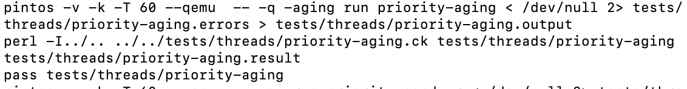

# 1. 프로젝트 시작

또 새로운 프로젝트가 나왔다. 그저 시작할 뿐이다..무엇을 해야 하는지부터 알아보자.

핀토스는 현재 라운드 로빈 스케줄러를 사용하고 있다. 그리고 각 프로세스, 스레드의 우선순위를 전혀 고려하지 않는다. 따라서 이번 프로젝트에서는 alarm, 우선순위 스케줄링, BSD스케줄러를 구현해야 한다.

주어진 것부터 검토하자.

## 1.1. 현재의 스케줄러

현재 라운드 로빈 방식으로 짜인 스케줄러는 어떻게 작동하는가?

```c
// src/threads/thread.c
void
thread_yield (void)
{
  struct thread *cur = thread_current ();
  enum intr_level old_level;

  ASSERT (!intr_context ());
  // 인터럽트를 비활성화하고 이전 인터럽트 상태 반환
  old_level = intr_disable ();
  if (cur != idle_thread)
    list_push_back (&ready_list, &cur->elem);
  // 스레드를 READY 상태로 변경
  cur->status = THREAD_READY;
  // 컨텍스트 스위칭
  schedule ();
  // 인자로 전달된 이전 인터럽트 상태로 인터럽트 활성화
  intr_set_level (old_level);
}
```

현재 작동하고 있는 스레드를 ready_list의 맨 뒤에 넣고 schedule()을 호출한다. schedule()은 ready_list의 맨 앞에 있는 스레드를 실행시킨다. 이때 쓰이는 함수가 next_thread_to_run, switch_threads이다. 이런 방식으로 ready_list에 있는 스레드를 순서대로 실행시키는 것을 반복한다.

## 1.2. 현재의 알람

timer_sleep은 현재 시간을 기준으로 ticks만큼 대기하도록 하는 함수이다.

```c
void
timer_sleep (int64_t ticks)
{
  int64_t start = timer_ticks ();

  ASSERT (intr_get_level () == INTR_ON);
  while (timer_elapsed (start) < ticks)
    thread_yield ();
}
```

timer_ticks는 운영체제가 켜진 이후의 틱 수를 반환하는 함수이다. 그리고 timer_elapsed 함수는 start 부터의 지난 틱 수를 반환한다. 즉 위 함수는 start로부터 ticks만큼의 시간이 지날 때까지 thread_yield를 실행한다. 스레드가 running 상태가 되면 다시 ready 상태로 되돌리는 것이다.

그리고 주어진 ticks만큼의 시간이 지나면 더 이상 thread_yield를 실행하지 않고 함수를 종료한다. 이 말은 스레드를 다시 실행 재개한다는 것이다.

위에서 본 thread_yield의 작동 방식을 볼 때, 이 함수는 ticks의 시간 동안 현재 스레드를 ready_list의 맨 뒤에 넣고 다른 스레드를 실행시키는 것을 반복한다. 따라서 스레드들은 RUNNING 상태와 READY 상태를 계속 왕복하게 된다. 이는 비효율적이다. 따라서 이번 프로젝트의 목표 중 하나는 이 비효율을 개선하는 것이다.

# 2. alarm clock 개선

이를 어떻게 개선할 수 있을까? 먼저 sleep 중인 스레드들을 관리하는 자료구조 sleep_list를 만든다. 이 sleep_list는 스레드가 timer_sleep을 호출할 때 그 스레드를 저장하고 또한 스레드가 다시 실행을 시작해야 하는 시점인 wakeup_tick을 저장한다. wakeup_tick으로 설정한 시점이 되면 그 스레드는 다시 실행되어야 한다.

이를 위해서는 매 틱마다 호출되는 timer_interrupt 함수를 이용한다. 현재 시간을 기준으로 sleep_list에 있는 스레드들 중 wakeup_tick이 된 스레드들을 다시 ready_list에 넣어준다. 그리고 sleep_list에서 그 스레드를 제거한다.

이를 구현하기 위해 먼저 스레드 자료구조에 `wakeup_tick`을 추가한다.

```c
struct thread
  {
    /* Owned by thread.c. */
    tid_t tid;                          /* Thread identifier. */
    enum thread_status status;          /* Thread state. */
    char name[16];                      /* Name (for debugging purposes). */
    uint8_t *stack;                     /* Saved stack pointer. */
    int priority;                       /* Priority. */
    struct list_elem allelem;           /* List element for all threads list. */

    /* Shared between thread.c and synch.c. */
    struct list_elem elem;              /* List element. */

#ifdef USERPROG
    /* Owned by userprog/process.c. */
    uint32_t *pagedir;                  /* Page directory. */
    // parent process descriptor
    struct thread* parent_thread;

    /* each structure
   that is a potential list element must embed a struct list_elem
   member. */
    /* child list element */
    struct list_elem child_thread_elem;
    /* child list */
    struct list child_threads;
    /* 프로세스의 프로그램 메모리 적재 여부 */
    bool load_flag;
    /* 프로세스 종료 유무 확인 */
    bool exit_flag;
    /* exit semaphore, 자식 프로세스 종료 대기를 위한 세마포어 */
    struct semaphore exit_sema;
    /* load semaphore, 자식 프로세스 생성 대기 */
    struct semaphore load_sema;
    /* 삭제될 때 부모의 자식 리스트에서 삭제하기 위해 메모리를 남겨두는 세마포어 */
    struct semaphore remove_sema;
    /* exit 호출 시 종료 상태 */
    int exit_status;
    /* file descriptor table */
    struct file* fd_table[FDTABLE_SIZE];
    /* 현재 실행중인 파일 */
    struct file* exec_file;
#endif
  // new!
    int64_t wakeup_tick;
    /* Owned by thread.c. */
    unsigned magic;                     /* Detects stack overflow. */
  };
```

그 다음 block된 스레드들을 저장하는 sleep_list를 만든다.

```c
//src/threads/thread.c
// THREAD_BLOCKED 상태의 스레드를 관리
static struct list sleep_list;
```

왜 static 변수로 선언하냐 하면 static 변수는 스레드의 데이터 영역에 저장되어 스레드 실행시 생성되고 스레드가 끝날 때 파괴되기 때문이다. 즉 스레드와 운명을 함께한다?는 것이다...

다음으로 thread_init 함수에서 sleep_list를 초기화한다.

```c
//src/threads/thread.c
void
thread_init (void)
{
  ASSERT (intr_get_level () == INTR_OFF);

  lock_init (&tid_lock);
  list_init (&ready_list);
  list_init (&all_list);
  // new!
  list_init(&(sleep_list));

  /* Set up a thread structure for the running thread. */
  initial_thread = running_thread ();
  init_thread (initial_thread, "main", PRI_DEFAULT);
  initial_thread->status = THREAD_RUNNING;
  initial_thread->tid = allocate_tid ();
}
```

그리고 다음과 같은 함수들을 `src/threads/thread.h`에 선언하자.

```c
/* for project 3 Threads, alarm clock */
void thread_sleep(int64_t ticks);
void thread_awake(int64_t ticks);
```

다 피가 되고 살이 되는 함수들일 테니 하나하나 구현해 보자.

## 2.1 thread_sleep

thread_sleep 함수는 실행 중인 스레드를 sleep 상태로 만들어 주는 함수이다. 그리고 몇 tick 이후에 깨어나야 할지를 인자로 받는다.

인터럽트 비활성화 -> 현재 스레드가 깨어나야 할 tick을 저장 -> sleep_list에 삽입 -> 현재 스레드 상태를 BLOCKED로 바꾸고 스케줄링 -> 인터럽트 활성화 순으로 진행된다. 이때 중간 과정은 현재 스레드가 idle 상태가 아닐 때 이루어진다.

```c
//src/threads/thread.c
// ticks 이후 깨어남
void thread_sleep(int64_t ticks){
  struct thread* cur=thread_current();
  enum intr_level old_level;
  // 인터럽트 비활성화
  old_level=intr_disable();
  if(cur!=idle_thread){
    cur->status=THREAD_BLOCKED;
    // 현재 이후 ticks 지나면 깨어나도록
    cur->wakeup_tick=ticks;
    list_push_back(&sleep_list, &(cur->elem));
    schedule();
  }
  // 인터럽트 활성화
  intr_set_level(old_level);
}
```

## 2.2 thread_awake

thread_awake 함수는 sleep_list에서 깨어나야 할 스레드들을 깨워주는 함수이다. wakeup_tick 값이 인자로 받은 ticks보다 작은 스레드들을 깨운다. 이때 sleep_list를 순회하면서 삭제하는 동작이 이루어지므로 여기 주의한다. 만약 삭제를 할 경우 리스트 요소들의 순서가 하나씩 당겨지므로 굳이 list_next로 넘어갈 필요가 없다.

```c
void thread_awake(int64_t ticks){
  struct list_elem* elem;
  struct thread* t;
  for(elem=list_begin(&(sleep_list));elem!=list_end(&(sleep_list));){
    t=list_entry(elem, struct thread, elem);
    if(t->wakeup_tick<=ticks){
      elem=list_remove(elem);
      thread_unblock(t);
    }
    else{
      elem=list_next(elem);
    }
  }
}
```

## 2.3 적용

timer_sleep에 기존 busy waiting 방식을 쓰던 코드를 지우고 thread_sleep 함수를 적용한다.

```c
void
timer_sleep (int64_t ticks)
{
  int64_t start = timer_ticks ();

  ASSERT (intr_get_level () == INTR_ON);
  thread_sleep(start+ticks);
}
```

그리고 wakeup_ticks에 도달한 스레드는 깨워 줘야 하므로 매 틱마다 실행되는 timer_interrupt 함수에 thread_awake 함수를 추가한다.

```c
/* Timer interrupt handler. */
static void
timer_interrupt (struct intr_frame *args UNUSED)
{
  ticks++;
  thread_awake(ticks);
  thread_tick ();
}
```

이 상태로 src/threads에서 make를 해보면? 에러가 뜬다. 뭐가 문제일까? user program에서 스레드에 추가했던 `exit_sema`, `remove_sema`를 사용하는 thread_exit 코드에서 에러가 뜬다. 이를 #ifdef USERPROG #endif로 감싸주면 된다.

```c
// src/threads/thread.c
void
thread_exit (void)
{
  ASSERT (!intr_context ());

#ifdef USERPROG
  process_exit ();
  sema_up(&(thread_current()->exit_sema));
  sema_down(&(thread_current()->remove_sema));
#endif

  /* Remove thread from all threads list, set our status to dying,
     and schedule another process.  That process will destroy us
     when it calls thread_schedule_tail(). */
  intr_disable ();
  list_remove (&thread_current()->allelem);

  thread_current ()->status = THREAD_DYING;
  schedule ();
  NOT_REACHED ();
}
```

이제 make check도 통과하고, `pintos -v -- -q run alarm-multiple`을 해보면 idle tick이 생긴 것을 볼 수 있다. 원래는 sleep 상태에서도 스레드가 cpu를 점유하므로 idle tick이 0이었다.

# 3. priority scheduling

현재의 라운드 로빈 스케줄러를 스레드의 우선순위를 고려하는 스케줄러로 바꿔야 한다. 만약 새로운 스레드가 현재 스레드보다 우선순위가 높다면 현재 스레드는 스레드를 바로 빼앗겨야 한다. 또한 여러 스레드가 락을 갖기 위해 경쟁하고 있을 경우 우선순위가 더 높은 스레드가 락을 가져가야 한다. 이는 세마포어에 대해서도 똑같이 적용된다.

이 우선순위는 0부터 63까지 있으며 숫자가 높을수록 더 높은 우선순위를 가진다. 우선순위가 높은 스레드가 먼저 실행된다. thread.h에는 다음과 같은 매크로도 정의되어 있다.

```c
/* Thread priorities. */
#define PRI_MIN 0                       /* Lowest priority. */
#define PRI_DEFAULT 31                  /* Default priority. */
#define PRI_MAX 63                      /* Highest priority. */
```

그리고 현재 스레드의 우선순위를 얻어오는 함수와 우선순위를 변경하는 함수도 이미 만들어져 있다.

```c
// src/threads/thread.c
/* Sets the current thread's priority to NEW_PRIORITY. */
void
thread_set_priority (int new_priority)
{
  thread_current ()->priority = new_priority;
}

/* Returns the current thread's priority. */
int
thread_get_priority (void)
{
  return thread_current ()->priority;
}
```

이것과 한양대에서 제공하는 갓-ppt를 기반으로 차근차근 우선순위 스케줄링을 구현해보자. 우리가 해야 할 것은 다음과 같다.


## 3.1 thread_create

현재 스레드의 우선순위와 thread_create에서 새로 만드는 스레드의 우선순위를 비교해서 만약 새로 만드는 스레드 우선순위가 더 높으면 현재 스레드를 yield시키는 코드를 추가한다.

```c
tid_t
thread_create (const char *name, int priority,
               thread_func *function, void *aux)
{
  struct thread *t;
  struct kernel_thread_frame *kf;
  struct switch_entry_frame *ef;
  struct switch_threads_frame *sf;
  tid_t tid;

  ASSERT (function != NULL);

  /* Allocate thread. */
  t = palloc_get_page (PAL_ZERO);
  if (t == NULL)
    return TID_ERROR;

  /* Initialize thread. */
  init_thread (t, name, priority);
  tid = t->tid = allocate_tid ();

  /* Stack frame for kernel_thread(). */
  kf = alloc_frame (t, sizeof *kf);
  kf->eip = NULL;
  kf->function = function;
  kf->aux = aux;

  /* Stack frame for switch_entry(). */
  ef = alloc_frame (t, sizeof *ef);
  ef->eip = (void (*) (void)) kernel_thread;

  /* Stack frame for switch_threads(). */
  sf = alloc_frame (t, sizeof *sf);
  sf->eip = switch_entry;
  sf->ebp = 0;

  /* Add to run queue. */
  thread_unblock (t);
  /* 실행중인 스레드와 우선순위 비교 */
  if(thread_get_priority() < priority){
    thread_yield();
  }

  return tid;
}
```

## 3.2 thread_unblock

스레드가 unblock될 때 우선순위 순으로 정렬되어 삽입되도록 한다. 이때 우선순위가 높은 스레드가 앞에 오도록 해야 하는데 이를 위해 list_insert_ordered를 사용한다. 그리고 거기 쓰이는 비교함수인 `cmp_priority`를 구현해야 한다.

```c
// 우선순위 기준으로 비교한다
bool cmp_priority(const struct list_elem *a, const struct list_elem *b, void *aux UNUSED){
  struct thread *at, *bt;
  at=list_entry(a, struct thread, elem);
  bt=list_entry(b, struct thread, elem);
  return (at->priority) > (bt->priority);
}
```

그리고 thread_unblock에서는 이 비교함수를 사용해서 삽입한다.

```c
void
thread_unblock (struct thread *t)
{
  enum intr_level old_level;

  ASSERT (is_thread (t));

  old_level = intr_disable ();
  ASSERT (t->status == THREAD_BLOCKED);
  // 수정
  list_insert_ordered(&ready_list, &(t->elem), cmp_priority, NULL);
  //list_push_back (&ready_list, &t->elem);
  t->status = THREAD_READY;
  intr_set_level (old_level);
}
```

## 3.3 thread_yield

thread_yield에서 현재 스레드가 cpu를 양보할 때 우선순위 순서로 삽입되도록 수정하자. 이 역시 list_insert_ordered를 사용하고, 비교함수는 `cmp_priority`를 사용한다.

```c
void
thread_yield (void)
{
  struct thread *cur = thread_current ();
  enum intr_level old_level;

  ASSERT (!intr_context ());

  old_level = intr_disable ();
  if (cur != idle_thread) {
    //list_push_back (&ready_list, &cur->elem);
    list_insert_ordered(&ready_list, &cur->elem, cmp_priority, NULL);
  }
  cur->status = THREAD_READY;
  schedule ();
  intr_set_level (old_level);
}
```

## 3.4 thread_set_priority

그리고 우선순위를 변경할 때도 선점이 발생하도록 해야 한다. 만약 새로 우선순위가 설정된 스레드가 현재 실행되고 있는 스레드보다 우선순위가 높다면 당장 지금 실행중인 스레드를 선점해야 한다.

이를 위해 thread_set_priority를 수정한다.

```c
void
thread_set_priority (int new_priority)
{
  int p=thread_current ()->priority;
  thread_current ()->priority = new_priority;
  // 현재 스레드의 우선순위가 작아졌다면 다시 스케줄링
  if(p > new_priority){
    thread_yield();
  }
}
```

이제 make check을 해보면 alarm-priority, priority-fifo, priority-preempt가 통과하는 것을 확인할 수 있다.

# 4. Priority Scheduling and Synchronization

아직 구현해야 할 게 있다. 앞서 #3 의 첫 시작에서 말했던 것 중 다음과 같은 이야기가 있었다.

```
여러 스레드가 락을 갖기 위해 경쟁하고 있을 경우 우선순위가 더 높은 스레드가 락을 가져가야 한다. 이는 세마포어에 대해서도 똑같이 적용된다.
```

현재 핀토스는 세마포어가 그 세마포어를 대기하고 있는 스레드들의 리스트 waiters를 가지도록 하고 있다. 하지만 현재 이 waiters 리스트 내부의 스레드는 우선순위에 상관없이 단순한 FIFO 방식으로 관리되고 있다. 이를 우선순위가 높은 스레드가 먼저 우선순위를 가져가도록 수정해 보자. thread.c, synch.c를 수정하면 된다.

## 4.1 sema_down

기존에는 sema_down 함수에서 waiters 리스트에 스레드를 삽입하고, 스레드를 block 시켰다. 이를 우선순위에 따라 삽입하도록 수정한다.

```c
void
sema_down (struct semaphore *sema)
{
  enum intr_level old_level;

  ASSERT (sema != NULL);
  ASSERT (!intr_context ());

  old_level = intr_disable ();
  while (sema->value == 0)
    {
      //list_push_back (&sema->waiters, &thread_current ()->elem);
      /* 우선순위에 따라 삽입하도록 수정 */
      list_insert_ordered(&sema->waiters, &thread_current ()->elem, cmp_priority, NULL);
      thread_block ();
    }
  sema->value--;
  intr_set_level (old_level);
}
```

## 4.2 sema_up

스레드가 waiters 리스트에 있는 동안 우선순위가 변경되었을 가능성에 대비하여 리스트를 정렬해 준다.

```c
void
sema_up (struct semaphore *sema)
{
  enum intr_level old_level;

  ASSERT (sema != NULL);

  old_level = intr_disable ();
  if (!list_empty (&sema->waiters)) {
    list_sort(&sema->waiters, cmp_priority, NULL);
    thread_unblock (list_entry (list_pop_front (&sema->waiters),
                                struct thread, elem));
  }

  sema->value++;
  intr_set_level (old_level);
}
```

그런데 한양대 ppt를 보면 priority preemption 코드를 넣어야 한다고 한다. 이게 뭐냐 하면 우선순위가 높은 스레드가 선점하는 로직을 짜라는 뜻이다. thread.c에 이를 위한 함수 test_max_priority를 작성하자. 이 함수의 원형을 thread.h에 추가하는 것도 잊지 말자.

```c
void test_max_priority (void)
{
  /* ready_list에서 우선순위가 가장 높은 스레드와 현재 스레드의
  우선순위를 비교하여 스케줄링 한다. 즉 preemption (ready_list 가 비어있지 않은지 확인) */
  if(list_empty(&ready_list)){return;}
  // ready_list에서 우선순위가 가장 높은 스레드
  struct list_elem* e=list_front(&ready_list);
  struct thread *t=list_entry(e, struct thread, elem);
  // ready list의 최고 우선순위 스레드가 더 우선순위 높다면 선점
  if(thread_get_priority() < t->priority){
    thread_yield();
  }
}
```

그리고 이를 sema_up에 추가한다.

```c
void
sema_up (struct semaphore *sema)
{
  enum intr_level old_level;

  ASSERT (sema != NULL);

  old_level = intr_disable ();
  if (!list_empty (&sema->waiters)) {
    list_sort(&sema->waiters, cmp_priority, NULL);
    thread_unblock (list_entry (list_pop_front (&sema->waiters),
                                struct thread, elem));
  }

  sema->value++;
  // new!
  test_max_priority();
  intr_set_level (old_level);
}
```

여기까지 하면 priority_sema가 pass되는 것을 볼 수 있다. 이제 priority_condvar을 진행해보자. priority_condvar는 서강대의 채점 기준에는 없다. 하지만 이걸 해야 추후에 all pass를 볼 수 있다. 따라서 한번 해보자.

## 4.3 cmp_sem_priority

특정 condition variable 을 기다리는 세마포어 리스트를 가장 높은 우선순위를 가지는 스레드의 우선순위 순으로 정렬해야 한다. 이때 쓰는 비교 함수를 정의한다. 먼저 함수 원형을 threads/synch.h에 추가한다.

```c
// src/threads/synch.h
bool cmp_sem_priority (const struct list_elem *a,
const struct list_elem *b,
void *aux);
```

구현은 다음과 같다.

```c
// src/threads/synch.c
/* 두 세마포어를 기다리는 대기자들 중 우선순위가 가장 높은 스레드를 기준으로
어떤 게 더 우선순위가 높은지를 반환한다 */
bool cmp_sem_priority (const struct list_elem *a, const struct list_elem *b, void *aux){
  struct semaphore_elem *sa = list_entry(a, struct semaphore_elem, elem);
  struct semaphore_elem *sb = list_entry(b, struct semaphore_elem, elem);
  struct list_elem *la=list_front(&(sa->semaphore.waiters));
  struct list_elem *lb=list_front(&(sb->semaphore.waiters));
  // 각 세마포어의 대기자들 중 우선순위가 가장 높은 스레드
  struct thread *ta=list_entry(la, struct thread, elem);
  struct thread *tb=list_entry(lb, struct thread, elem);
  return ta->priority > tb->priority;
}
```

## 4.4 cond_wait

한양대 ppt에서 시키는 대로 하자. condition variable의 waiters list에 우선순위 순서로 삽입되도록 수정한다.

list_push_back으로 구현된 부분을 list_insert_ordered로 바꾼다.

```c
void
cond_wait (struct condition *cond, struct lock *lock)
{
  struct semaphore_elem waiter;

  ASSERT (cond != NULL);
  ASSERT (lock != NULL);
  ASSERT (!intr_context ());
  ASSERT (lock_held_by_current_thread (lock));

  sema_init (&waiter.semaphore, 0);
  //list_push_back (&cond->waiters, &waiter.elem);
  list_insert_ordered(&cond->waiters, &waiter.elem, cmp_sem_priority, NULL);
  lock_release (lock);
  sema_down (&waiter.semaphore);
  lock_acquire (lock);
}
```

## 4.5 cond_signal

역시 갓-한양대가 시키는 대로 하자. 대기 중 우선순위가 변경되었을 가능성이 있으니 condition variable의 waiters list를 우선순위로 재 정렬한다.

```c
void
cond_signal (struct condition *cond, struct lock *lock UNUSED)
{
  ASSERT (cond != NULL);
  ASSERT (lock != NULL);
  ASSERT (!intr_context ());
  ASSERT (lock_held_by_current_thread (lock));

  if (!list_empty (&cond->waiters)) {
    // new!
    list_sort(&cond->waiters, cmp_sem_priority, NULL);
    sema_up (&list_entry (list_pop_front (&cond->waiters),
                          struct semaphore_elem, elem)->semaphore);
  }
}
```

## 4.6 디버깅

아..그런데 priority_condvar에서 커널 패닉이 뜬다. list_empty(list) 에 대한 assertion에서 무언가 실패했다고 한다. 이때 생각나는 것이 있는데..priority preemption에서 ready list가 비어 있을 때를 고려하지 않은 부분이 있다는 것. test_max_priority 함수를 이용한 preemption에서는 그런 경우가 없었는데, preemption 을 하는 코드를 싹 다 test_max_priority를 사용하도록 바꿔 버리자.

먼저 thread_created에서 test_max_priority를 사용하도록 바꾼다.

```c
tid_t
thread_create (const char *name, int priority,
               thread_func *function, void *aux)
{
  struct thread *t;
  struct kernel_thread_frame *kf;
  struct switch_entry_frame *ef;
  struct switch_threads_frame *sf;
  tid_t tid;

  ASSERT (function != NULL);

  /* Allocate thread. */
  t = palloc_get_page (PAL_ZERO);
  if (t == NULL)
    return TID_ERROR;

  /* Initialize thread. */
  init_thread (t, name, priority);
  tid = t->tid = allocate_tid ();

  /* Stack frame for kernel_thread(). */
  kf = alloc_frame (t, sizeof *kf);
  kf->eip = NULL;
  kf->function = function;
  kf->aux = aux;

  /* Stack frame for switch_entry(). */
  ef = alloc_frame (t, sizeof *ef);
  ef->eip = (void (*) (void)) kernel_thread;

  /* Stack frame for switch_threads(). */
  sf = alloc_frame (t, sizeof *sf);
  sf->eip = switch_entry;
  sf->ebp = 0;

  /* Add to run queue. */
  thread_unblock (t);
  /* 수정 */
  test_max_priority();

  return tid;
}
```

그리고 thread_set_priority에서도 test_max_priority를 사용하도록 바꾼다.

```c
void
thread_set_priority (int new_priority)
{
  thread_current ()->priority = new_priority;
  // 현재 스레드의 우선순위가 작아졌다면 다시 스케줄링
  test_max_priority();
}
```

그리고 cmp_sem_priority에서 list_front 대신 list_begin을 사용하도록 바꾼다. 이러면 리스트가 비어 있을 때에도 tail이 반환되어서 문제가 없다. 반면 list_front를 사용하면 리스트가 비어 있으면 에러를 발생시키기 때문에 priority_condvar를 통과하지 못한다.

```c
src/threads/synch.c
bool cmp_sem_priority (const struct list_elem *a, const struct list_elem *b, void *aux){
  struct semaphore_elem *sa = list_entry(a, struct semaphore_elem, elem);
  struct semaphore_elem *sb = list_entry(b, struct semaphore_elem, elem);
  // 수정
  struct list_elem *la=list_begin(&(sa->semaphore.waiters));
  struct list_elem *lb=list_begin(&(sb->semaphore.waiters));
  // 각 세마포어의 대기자들 중 우선순위가 가장 높은 스레드
  struct thread *ta=list_entry(la, struct thread, elem);
  struct thread *tb=list_entry(lb, struct thread, elem);
  return ta->priority > tb->priority;
}
```

이제 make check을 돌려보면 priority_condvar를 통과한다.

# 5. priority aging

기본적인 우선순위 스케줄링은 낮은 우선순위를 가진 프로세스들이 starvation에 걸릴 가능성이 있다. 이를 해결하기 위한 방법 중 하나는 aging이다. 자세한 설명은 운영체제 수업에서 듣고... 이번에는 aging을 구현해보자.

먼저 수정하라고 하는 코드들을 수정하자. src/threads/thread.h에 다음을 추가한다.

```c
/* Project #3. */
#ifndef USERPROG
extern bool thread_prior_aging;
#endif
```

그리고 src/threads/thread.c에 다음을 추가한다.

```c
/* Project #3. */
#ifndef USERPROG
bool thread_prior_aging;
#endif
```

thread_tick 함수는 다음과 같이 수정.

```c
void
thread_tick (void)
{
  struct thread *t = thread_current ();

  /* Update statistics. */
  if (t == idle_thread)
    idle_ticks++;
#ifdef USERPROG
  else if (t->pagedir != NULL)
    user_ticks++;
#endif
  else
    kernel_ticks++;

  /* Enforce preemption. */
  if (++thread_ticks >= TIME_SLICE)
    intr_yield_on_return ();

#ifndef USERPROG
  if(thread_prior_aging==true){
    thread_aging();
  }
#endif
}
```

src/threads/init.c 의 parse_options 함수의 중간엔 다음 내용을 추가한다.

```c
#ifndef USERPROG
  else if (!strcmp (name, "-aging"))
    thread_prior_aging=true;
#endif
```

그리고 과제와 함께 주어진 thread_tests.tar의 압축을 푼 후 src/tests/threads를 그 내용으로 교체한다. 파일질라로 간단히 해결했다.

우리는 thread_tick()함수에 thread_aging이라는 함수를 호출하도록 했다. 그럼 이 thread_tick함수는 어디서 쓰일까? 아까 수정했던 timer_interrupt() 함수에서 thread_tick이 호출되는 것을 알 수 있다. 즉 매 틱마다 thread_tick 함수가 호출되는 것이다.

그러면 thread_aging 함수를 구현해보자. 매 틱마다 모든 스레드의 우선순위를 1씩 높여 주면 되는 간단한 함수이다. 이 함수 원형을 src/threads/thread.h에 추가하는 것도 잊지 말자.

```c
// src/threads/thread.c
void thread_aging(void){
  struct thread *t;
  struct list_elem* elem;

  for(elem=list_begin(&all_list); elem!=list_end(&all_list);elem=list_next(elem)){
    t=list_entry(elem, struct thread, allelem);
    t->priority++;
  }
  if(t->priority > PRI_MAX){t->priority = PRI_MAX;}
  if(t->priority < PRI_MIN){t->priority = PRI_MIN;}
}
```

이 함수는 thread_tick()에 의해 매 틱마다 호출되므로 priority aging을 잘 구현한다고 할 수 있다. 이 함수를 구현하고 나서 make check을 실행하면 priority-aging 테스트를 통과할 수 있다.



# 6. BSD scheduler

BSD 스케줄러의 구현을 하면 이번 프로젝트에서 보너스 점수를 받을 수 있다. BSD 스케줄러를 구현하기 위해서는 멀티 레벨 피드백 큐를 사용할 수 있다. 각 우선순위가 각각의 레디 큐를 가지고 있고 스케줄링할 때마다 우선순위가 높은 큐부터 스케줄링을 하는 것이다. 각 우선순위의 레디 큐는 라운드 로빈 방식으로 스케줄링을 한다.

이때 우선순위는 스레드 생성시 초기화되고 매 4틱마다 다시 계산되도록 한다. 그 계산식은 다음과 같다.

$priority = PRI\_MAX - (recent\_cpu / 4) - (nice * 2)$

여기에 뭔가 익숙하지 않은 변수들이 꽤 있다. PRI_MAX는 우선순위의 최대값인데 나머지는?

먼저 nice은 스레드의 nice값이다. -20부터 20까지 있고 nice가 양수면 우선순위 감소, 음수면 우선순위 증가의 효과를 가진다. 실질적으로 무슨 의미인지는 핀토스 매뉴얼에도 딱히 나와 있지 않은데, 이런 말이 있긴 하다.

```
Pintos Appendix B.1 Niceness
A positive nice, to the maximum of 20, decreases the priority of a thread and causes it to give up some CPU time it would otherwise receive.
```

즉 nice 값이 높으면 다른 스레드에게 더 CPU를 양보하게 되니까 성격좋은 스레드라서 nice하다...? 정도로 이해하면 될 것 같다. 아무튼 우선순위에 영향을 미친다는 것이다. 스레드가 처음 생성되면 nice값은 0이다. 만약 스레드가 부모가 있다면 부모의 nice값을 물려받는다.

recent_cpu는 스레드의 최근 cpu사용량이다. 이 변수들은 스레드 구조체에 정의되어 있다. 최근에 CPU 사용량이 높은 스레드는 우선순위를 낮춰 주는 역할을 한다. 이 값은 처음 생기는 스레드에 대해 0이고 부모가 있는 스레드는 부모의 recent_cpu값을 물려받는다.

그리고 recent_cpu는 다음 계산식에 따라서 매 interrupt마다 다시 계산된다.

$recent\_cpu = (2 * load\_avg) / (2 * load\_avg + 1) * recent\_cpu + nice$

여기서 load_avg는 시스템에서 최근 1분 동안 수행 가능한 프로세스의 평균값이다. 매 1틱마다 다음과 같이 계산된다.

$load\_avg = (59/60) * load\_avg + (1/60) * ready\_threads$

여기서 ready_threads는 현재 ready 혹은 running 상태에 있는 스레드의 수이다. (즉 실행 중인 스레드 개수 + ready_list에 있는 스레드 개수)이다.

어..그런데 문제가 있다. priority, nice, ready_threads값은 정수, recent_cpu, load_avg값은 실수이다. 문제는 pintos가 커널에서 부동 소수점 연산을 지원하지 않는다는 것이다. 따라서 우리는 이 값을 정수로 표현해야 한다.

이를 위해 정수를 실수 연산을 위해 사용한다. 우리는 17.14 fixed point를 사용한다. 이는 32비트 정수형에서 1비트는 부호 비트, 17비트는 정수부, 14비트는 소수부를 나타내게 해서 실수를 표현하는 것이다.

## 6.1 실수 연산 구현

이를 위해 src/thread/fixed-point.h 파일을 만들고 다음과 같이 내용을 작성한다.

```c
#define F (1 << 14) //fixed point 1
#define INT_MAX ((1 << 31) - 1)
#define INT_MIN (-(1 << 31))
// x and y denote fixed_point numbers in 17.14 format
// n is an integer

int int_to_fp(int n); /* integer를 fixed point로 전환 */
int fp_to_int_round(int x); /* FP를 int로 전환(반올림) */
int fp_to_int(int x); /* FP를 int로 전환(버림) */
int add_fp(int x, int y); /* FP의 덧셈 */
int add_mixed(int x, int n); /* FP와 int의 덧셈 */
int sub_fp(int x, int y); /* FP의 뺄셈(x-y) */
int sub_mixed(int x, int n); /* FP와 int의 뺄셈(x-n) */
int mult_fp(int x, int y); /* FP의 곱셈 */
int mult_mixed(int x, int y); /* FP와 int의 곱셈 */
int div_fp(int x, int y); /* FP의 나눗셈(x/y) */
int div_mixed(int x, int n); /* FP와 int 나눗셈(x/n) */
```

이 함수들을 모두 구현하자. 다행히 한양대 ppt에서 모든 것을 알려주므로 그대로 하면 된다.

```c
int int_to_fp(int n){
  int temp= n * F;
  return temp;
}

/* FP를 int로 전환(반올림) */
int fp_to_int_round(int x){
  if(x>=0){
    return (x + F / 2 ) / F;
  }
  else{
    return (x - F / 2 ) / F;
  }
}

/* FP를 int로 전환(버림) */
int fp_to_int(int x){
  return x/F;
}

int add_fp(int x, int y){
  return x+y;
}

/* FP와 int의 덧셈 */
int add_mixed(int x, int n){
  return x+int_to_fp(n);
}

/* FP의 뺄셈(x-y) */
int sub_fp(int x, int y){
  return x-y;
}

/* FP와 int의 뺄셈(x-n) */
int sub_mixed(int x, int n){
  return x-int_to_fp(n);
}

int mult_fp(int x, int y){
  // F가 2번 곱해진 상태가 되어버려서 F로 한번 나눠줘야함
  return (((int64_t)x) * y / F);
}

int mult_mixed(int x, int n){
  return x*n;
}

int div_fp(int x, int y){
  return ((int64_t) x) * F / y;
}

/* FP와 int 나눗셈(x/n) */
int div_mixed(int x, int n){
  return x/n;
}
```

## 6.2 스케줄러 구현

먼저 스케줄러를 위한 정보를 thread 구조체에 추가한다. nice, recent_cpu를 추가한다.

```c
struct thread
  {
    /* Owned by thread.c. */
    tid_t tid;                          /* Thread identifier. */
    enum thread_status status;          /* Thread state. */
    char name[16];                      /* Name (for debugging purposes). */
    uint8_t *stack;                     /* Saved stack pointer. */
    int priority;                       /* Priority. */
    struct list_elem allelem;           /* List element for all threads list. */

    /* Shared between thread.c and synch.c. */
    struct list_elem elem;              /* List element. */

#ifdef USERPROG
    /* Owned by userprog/process.c. */
    uint32_t *pagedir;                  /* Page directory. */
    // parent process descriptor
    struct thread* parent_thread;

    /* each structure
   that is a potential list element must embed a struct list_elem
   member. */
    /* child list element */
    struct list_elem child_thread_elem;
    /* child list */
    struct list child_threads;
    /* 프로세스의 프로그램 메모리 적재 여부 */
    bool load_flag;
    /* 프로세스 종료 유무 확인 */
    bool exit_flag;
    /* exit semaphore, 자식 프로세스 종료 대기를 위한 세마포어 */
    struct semaphore exit_sema;
    /* load semaphore, 자식 프로세스 생성 대기 */
    struct semaphore load_sema;
    /* 삭제될 때 부모의 자식 리스트에서 삭제하기 위해 메모리를 남겨두는 세마포어 */
    struct semaphore remove_sema;
    /* exit 호출 시 종료 상태 */
    int exit_status;
    /* file descriptor table */
    struct file* fd_table[FDTABLE_SIZE];
    /* 현재 실행중인 파일 */
    struct file* exec_file;
#endif
    int64_t wakeup_tick;
    // new!
    int nice;
    int recent_cpu;
    /* Owned by thread.c. */
    unsigned magic;                     /* Detects stack overflow. */
  };
```

그리고 thread.c 파일에 다음과 같은 내용을 추가한다.

```c
#include "threads/fixed_point.h"

#define NICE_DEFAULT 0
#define RECENT_CPU_DEFAULT 0
#define LOAD_AVG_DEFAULT 0

int load_avg;
```

또한 이 매크로들을 이용해서 스레드의 초기화 시 값을 설정한다. nice, recent_cpu는 맨 처음 생기는 스레드에 대해서 0이고 나머지 스레드들은 부모의 값을 알아서 물려받는다. 따라서 맨 처음 생기는 스레드인 initial_thread에 대해서만 초기화를 진행해 주면 된다. 따라서 thread_init 함수에서 초기화를 진행한다.

```c
// src/threads/thread.c
void
thread_init (void)
{
  ASSERT (intr_get_level () == INTR_OFF);

  lock_init (&tid_lock);
  list_init (&ready_list);
  list_init (&all_list);

  list_init(&(sleep_list));

  /* Set up a thread structure for the running thread. */
  initial_thread = running_thread ();
  init_thread (initial_thread, "main", PRI_DEFAULT);
  initial_thread->status = THREAD_RUNNING;
  initial_thread->tid = allocate_tid ();
  // new!
  initial_thread->nice=NICE_DEFAULT;
  initial_thread->recent_cpu=RECENT_CPU_DEFAULT;
}
```

그리고 thread_start 함수에서 load_avg 값을 초기화한다.

```c
void
thread_start (void)
{
  /* Create the idle thread. */
  struct semaphore idle_started;
  sema_init (&idle_started, 0);
  thread_create ("idle", PRI_MIN, idle, &idle_started);

  // new! 초기화하는 부분 추가.
  load_avg=LOAD_AVG_DEFAULT;
  /* Start preemptive thread scheduling. */
  intr_enable ();

  /* Wait for the idle thread to initialize idle_thread. */
  sema_down (&idle_started);
}
```

## 6.2 BSD 스케줄링 구현

필요한 변수들을 다 정의했다. 우리가 BSD 스케줄링에서 해야 할 것은 다음과 같다.

이걸 정리하기까지 수많은 블로그와 ppt를 보고 지옥같은 디버깅을 했다. 예를 들어 각 블로그나 github 코드들에서는 getter나 setter에 접근할 때 인터럽트를 비활성화시켜 준다든가, priority를 변경할 때 mlfqs면 우선순위 변경을 막는다든가 하는 동작을 한다. 하지만 그런 건 굳이 할 필요가 없다. 중요한 것은 ppt에 나와 있는 것이 다이다. 그리고 스레드의 우선순위를 바꿀 때는 선점에 대해 고려해야 한다-정도만 생각하면 된다.

서강대학교 ppt는 무척 불친절한 것 같지만 의외로 도움되는 정보를 줄 때가 있다. 즉, 딱 다음과 같은 일만 하면 된다.

1. 매 초마다 load_avg를 업데이트해준다. 이때 1초는 TIMER_FREQ를 통해서 정의되어 있다.
2. 매 초마다 recent_cpu를 업데이트해준다.
3. 4틱(TIME_SLICE)마다 우선순위를 업데이트해준다.
4. 우선순위 업데이트에 따라서 스레드 선점을 발생시킨다.

이것들을 하나하나 구현해 보자. 각 업데이트의 구현을 할 때 어떤 게 실수이고 어떤 게 정수인지 주의한다. priority, nice, ready_threads는 정수이고 recent_cpu, load_avg는 실수이다.

<span style="color:red">어떤 게 정수이고, 어떤 게 실수인지 구분하는 건 정말 중요하다! 계산식을 구현할 때 이걸 디버깅하는 데 몇 시간을 썼는지 모르겠다. 나같은 경우 위 함수 선언에서 x, y는 실수, n은 정수형 인수로 구분하였으며 리턴형은 모두 실수인 것으로 생각했다.</span>

### 6.2.1 load_avg 업데이트

먼저 load_avg를 업데이트하는 함수를 구현하자. 정의되어 있는 load_avg를 업데이트하는 식은 다음과 같다.

$load\_avg = \frac{59}{60} \times load\_avg + \frac{1}{60} \times ready\_threads$

이를 그대로 구현해 주면 된다.

```c
void mlfqs_load_avg (void){
  int left, right;
  int ready_threads=list_size(&ready_list);
  if(thread_current() != idle_thread){ready_threads++;}
  left = div_fp(int_to_fp(59), int_to_fp(60));
  left= mult_fp(left, load_avg);
  right= div_fp(int_to_fp(1), int_to_fp(60));
  // ready_threads 는 정수
  right=mult_mixed(right, ready_threads);
  load_avg = add_fp(left, right);
}
```

### 6.2.2 recent_cpu 업데이트

다음으로 recent_cpu를 업데이트하는 함수를 구현하자. recent_cpu는 다음과 같은 동작을 해야 한다.

1. running thread에 대해서 recent_cpu가 1 증가한다.
2. 다음 식에 의해 업데이트된다.

$recent\_cpu = \frac{2 \times load\_avg}{2 \times load\_avg + 1} \times recent\_cpu + nice$

먼저 running thread에 대해서 recent_cpu가 1 증가하는 부분을 구현해보자. idle thread는 recent_cpu를 업데이트하지 않는다는 점만 반영한다.

```c
// 현재 스레드의 Recent_cpu 값 1 증가
void mlfqs_increment (void){
  struct thread* cur=thread_current();
  if(cur==idle_thread){return;}
  cur->recent_cpu=add_mixed(cur->recent_cpu, 1);
}
```

그리고 인자로 받은 스레드에 대해서 recent_cpu를 업데이트하는 함수를 구현해보자. 계산식을 그대로 구현하면 된다.

```c
// src/threads/thread.c
/* 해당 스레드 recent_cpu 값 계산 */
void mlfqs_recent_cpu (struct thread *t){
  if(t==idle_thread){return;}
  int temp_mult= mult_mixed(load_avg, 2);
  int temp=div_fp(temp_mult, add_mixed(temp_mult, 1));
  temp=mult_fp(temp, t->recent_cpu);
  // nice는 정수
  temp=add_mixed(temp, t->nice);
  t->recent_cpu=temp;
}
```

그리고 모든 스레드에 대해서 recent_cpu를 업데이트하는 함수를 구현한다.

```c
void mlfqs_recalc_recent_cpu(void){
  struct list_elem* e;
  struct thread* t;
  for(e=list_begin(&all_list); e!=list_end(&all_list); e=list_next(e)){
    t=list_entry(e, struct thread, allelem);
    mlfqs_recent_cpu(t);
  }
}
```

### 6.2.3 priority 업데이트

마지막으로 priority를 업데이트하는 함수를 구현하자. priority는 다음 식에 따라 업데이트하면 된다.

$priority = PRI\_MAX - \left( \frac{recent\_cpu}{4} \right) - \left( {nice} \times {2} \right)$

인자로 받은 스레드에 대해서 priority를 업데이트하는 함수를 다음과 같이 그대로 구현한다.

```c
// 해당 스레드 우선순위 재계산
void mlfqs_priority (struct thread *t){
  if(t==idle_thread){return;}
  int temp=add_fp(int_to_fp(PRI_MAX), div_mixed(t->recent_cpu, -4));
  temp=add_fp(temp, int_to_fp(-2 * t->nice));
  t->priority=fp_to_int(temp);
  if (t->priority > PRI_MAX) {
    t->priority = PRI_MAX;
  }
  if (t->priority < PRI_MIN) {
    t->priority = PRI_MIN;
  }
}
```

모든 스레드에 대해서 priority를 업데이트하는 함수를 구현한다.

여기서는 각 스레드의 우선순위가 업데이트되면서 선점해야 하는 상황이 생길 수 있으므로 선점이 필요할 경우 `intr_yield_on_return`을 호출한다.

인터럽트 도중에 yield하는 것이므로 thread_yield()를 호출하는 대신 `intr_yield_on_return`을 호출해야 하는 것에 주의한다. 이걸 알려준 #참고 의 네이버 블로그에 감사한다.

```c
void mlfqs_recalc_priority(void){
  struct list_elem* e;
  struct thread* t;
  for(e=list_begin(&all_list); e!=list_end(&all_list); e=list_next(e)){
    t=list_entry(e, struct thread, allelem);
    mlfqs_priority(t);
  }

  if(list_empty(&ready_list)){return;}
  // ready_list에서 우선순위가 가장 높은 스레드
  e=list_front(&ready_list);
  t=list_entry(e, struct thread, elem);
  // ready list의 최고 우선순위 스레드가 더 우선순위 높다면 선점
  if(thread_get_priority() < t->priority){
    //thread_yield();
    intr_yield_on_return();
  }
}
```

### 6.2.4 매 틱마다 업데이트

마지막으로 매 틱마다 업데이트하는 함수를 구현한다. 1초에 1번 load_avg와 recent_cpu를 업데이트하고 4번째 틱마다 priority를 업데이트한다. 그리고 매 틱마다 현재 running중인 스레드의 recent_cpu를 1 증가시킨다.

```c
// src/threads/thread.c
void thread_mlfqs_tick(void){
  int64_t ticks=timer_ticks();

  mlfqs_increment();
  if(ticks % TIMER_FREQ==0){
    mlfqs_load_avg();
    mlfqs_recalc_recent_cpu();
  }
  if(ticks%TIME_SLICE==0){
    mlfqs_recalc_priority();
  }
}
```

이를 thread_tick에서 호출하면 된다. mlfqs 모드일 때만 호출하도록 한다.

```c
// src/threads/thread.c
void
thread_tick (void)
{
  struct thread *t = thread_current ();

  /* Update statistics. */
  if (t == idle_thread)
    idle_ticks++;
#ifdef USERPROG
  else if (t->pagedir != NULL)
    user_ticks++;
#endif
  else
    kernel_ticks++;

  /* Enforce preemption. */
  if (++thread_ticks >= TIME_SLICE)
    intr_yield_on_return ();

  if(thread_prior_aging==true){
    thread_aging();
  }
  // new!
  if(thread_mlfqs==true){
    thread_mlfqs_tick();
  }
}
```

### 6.2.5 그 외 요구되는 함수들

그 외에 ppt에서는 다음과 같은 함수들을 요구하고 있다.

```c
int thread_get_nice (void);
void thread_set_nice (int);
int thread_get_recent_cpu (void);
int thread_get_load_avg (void);
```

이 함수들의 원형을 `src/threads/thread.h`에 추가하고, `src/threads/thread.c`에 구현하면 된다. 한양대 ppt에서는 이 함수들에서 인터럽트를 막아야 한다고 하는데 그런 거 안 해도 잘 통과한다.

thread_get_nice는 단순한 getter 함수이다.

```c
/* Returns the current thread's nice value. */
int
thread_get_nice (void)
{
  return thread_current()->nice;
}
```

thread_set_nice는 현재 스레드의 nice 값을 변경하고, 우선순위를 재계산한다.

```c
/* Sets the current thread's nice value to NICE. */
void
thread_set_nice (int nice UNUSED)
{
  /* 프로젝트 3에서 구현 */
  thread_current()->nice=nice;
  // 우선순위 재계산
  mlfqs_priority(thread_current());
  // 선점 처리
  test_max_priority();
}
```

thread_get_recent_cpu는 단순한 getter 함수이다. 주석에 써있는 대로 100을 곱해 반환하면 된다.

```c
/* Returns 100 times the current thread's recent_cpu value. */
int
thread_get_recent_cpu (void)
{
  int temp_recent_cpu = fp_to_int_round(mult_mixed(thread_current()->recent_cpu, 100));
  return temp_recent_cpu;
}
```

thread_get_load_avg도 주석에 써있는 대로 100을 곱해 반환하면 된다.

```c
/* Returns 100 times the system load average. */
int
thread_get_load_avg (void)
{
  int temp_load_avg;
  temp_load_avg = fp_to_int_round(mult_mixed(load_avg, 100));
  return temp_load_avg;
}
```

이제 끝난 것 같다..한번 make check을 해볼까? mlfqs가 붙은 테스트 시리즈는 테스트가 매우 오래 걸린다. 테스트를 돌려 놓고 커피 한잔 하고 오자. 커피를 한잔 하고 와도 안 끝날지도 모른다. 디버깅을 하다 보면, 이번 테스트의 관건은 인내심을 가지고 테스트를 기다리는 것이라는 걸 깨달을지도? 뭔가 비효율적으로 코드를 짜서 그런 것 같기도 한데, 잘은 모르겠다.

만약 여기까지 왔는데 mlfqs 테스트에서 일부는 pass고 일부는 fail인 분이 계시다면, 혹시 계산식을 구현하는 과정에서 정수와 실수를 헷갈리지 않았는지 꼼꼼히 체크해보자. 나같은 경우 예를 들어서 nice도 실수이고 -2도 실수인데 우선순위 계산을 구현하는 과정에서 `mult_mixed(t->nice, -2)`와 같이 실수와 정수를 곱하는 연산을 사용하는 실수를 저질렀다.

자, 아무튼 이렇게 해서 mlfqs 테스트도 모두 통과했다. 서강대에서 요구하는 모든 조건을 만족했다!


다음으로는 한양대학교 ppt를 보고 priority scheduling에서 통과하지 못한 테스트들, 이를테면 priority-donate 시리즈들을 통과시켜 볼 것이다. 또 그 다음에는 VM을 구현해 볼 예정이다.

# 참고

어떤 선배님의 네이버 블로그 https://m.blog.naver.com/adobeillustrator/220546339744

한양대학교 핀토스 ppt https://oslab.kaist.ac.kr/wp-content/uploads/esos_files/courseware/undergraduate/PINTOS/Pintos_all.pdf

cmp_sem_priority 함수 구현 https://renelemon.tistory.com/99

BSD scheduler 구현에 참고 https://for-development.tistory.com/21

핀토스 매뉴얼 https://web.stanford.edu/class/cs140/projects/pintos/pintos.pdf
