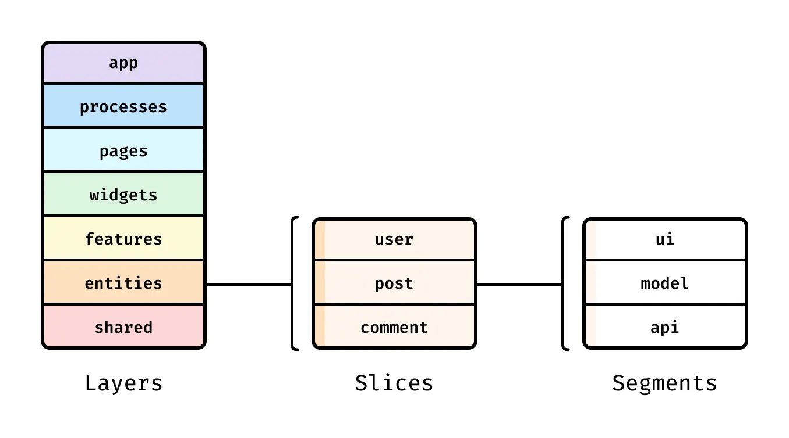
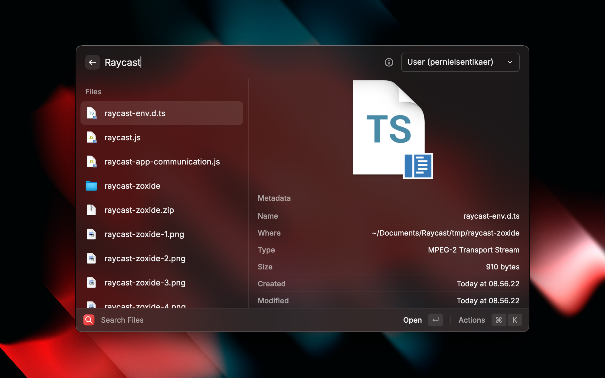
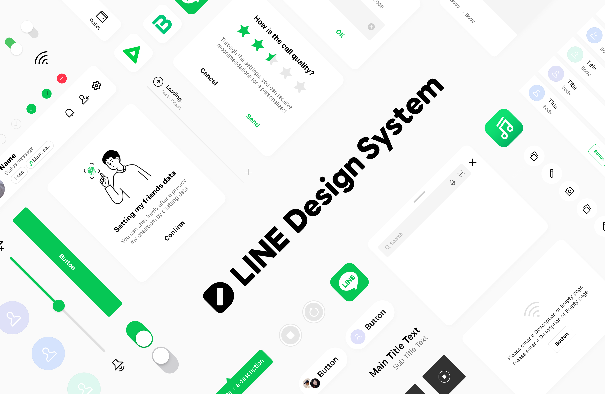

# 배경

> 일을 할 시간은 충분한가요? 단순히 충분한 시간이 있는지 묻는 것이 아닙니다. 물론 없을 테니까요. 주어진 시간보다 할 일이 더 많은지 묻는 것도 아닙니다. 물론 많을 테니까요. '시간이 충분하다면 어떻게 일할 것인가?'라고 스스로에게 물어보세요. 그 대답이 실제로 하고 있는 일과 크게 다르다면, 일할 시간이 충분하지 않다는 뜻입니다.
>
> 켄트 벡 지음, 안영회 옮김, "켄트 벡의 Tidy First?" 91p

나는 회사에 한 명 뿐인 프론트엔드 전담 인력이다. 그런데 회사에 전담으로 프론트를 하는 TO는 한 명 뿐임에도 불구하고 5명이 넘는 전임자들의 흔적이 남아 있었다. 1-2명의 TO에 여러 사람이 오가면서 남긴 코드들이다 보니 일관성이 깨진 폴더 구조, 역할이 중복되거나 모호한 채 남겨진 컴포넌트들을 마주했다.

이들을 틈틈이 고치고 정리했다. 또 주어지는 추가 기능들을 덧붙이고 여러 버그들을 고쳤다. 이는 여전히 현재 진행형이다.

그러면서 이런 규칙들을 지키고자 했다. 지금도 마찬가지다.

- 미래의 나를 포함하여 이 코드의 맥락을 잘 모르는 타인이 봤을 때를 생각하면서 코드를 작성하기
- 위에서 아래로 읽으며 순차적으로 정보를 받아들일 수 있는 직관적인 구조로 코드와 컴포넌트를 설계하기
- 각 컴포넌트가 책임을 하나씩만 지게 하고 역할에 따라 분류하기
- 변경사항을 받아들일 수 있도록 유연한 구조로 만들기
- 정한 규칙을 나 혼자라도 일관성 있게 지키기

그러다가 문득 이런 생각을 했다. 내가 지키려고 하는 이 규칙들은 사실 개발자라면 대부분 알고 있는 당연한 말들의 연속이지 않은가? 나도 개발을 시작한 지 얼마 되지 않았을 때부터 이런 말들을 다 들어 알고 있었다. 그럼 내 전임자들은 정말 이런 규칙들을 전혀 몰라서 내가 보고 있는 형태의 레거시 코드들을 남겼을까?


처음에는 그들이 코드 퀄리티 같은 건 전혀 생각하지 않는 개발자였어서 그렇다고 생각했다. 하지만 채 몇 달도 지나지 않아 나 스스로도, 부끄럽지만 컨벤션을 깨는 땜질식 코드를 짜거나 일관성있게 고치던 폴더 구조를 내던지고 난잡하게 만들어 버리고 있었다. "이걸 지금 다 완벽하게 하려면 공수가 너무 많이 든다"거나 "혼자서 할 수 있는 규모가 아니다"와 같은 이유 혹은 핑계를 대면서 말이다. 그런 나 자신을 발견하면서 대체 정말로 무엇을 일관성 있게 추구해야 하는 걸까 하는 생각을 하게 되었다.

모두가 알고 있지만 아무도 제대로 지키지 않는 원칙들 사이에서. 이론적으로 완벽하고 깨끗한 코드만 고집할 수 없는 시간과 환경 속에서. 진짜로 어떤 방향으로 나아가야 하고 뭘 기준으로 결정해야 할까? 나도 답을 아직 모르고 어쩌면 그런 건 존재하지 않을지도 모르지만 개인적으로 거기에 가까이 다가가 보고자 했던 생각과 사례들을 여기 적는다.

다들 알고만 있는 원칙이 아니라 구체적으로 손에 잡힐 만한 뭔가로 풀어내고 싶었다. 최대한 확실하게 생각을 잡은 척, 확신에 찬 것처럼 생각을 써내려가고자 했다. 자신있게 했던 생각이 합리적인 선에서 깨지는 경험 또한 내게 도움이 될 거라 믿기 때문이다.

절대 틀리지 않는 글을 쓰려고 시도할 수도 있겠다. 대부분의 것이 확실하지 않고 케이스 바이 케이스라는 말을 하면 된다. 그러면 많은 사람들이 떨떠름하게나마 동의해야 한다. 하지만 내가 그런 말을 함으로써 배울 수 있는 건 아무것도 없을 것이기 때문에 스스로라도 확신에 찬 척 떠벌려본다.

# 본질에 대한 생각

> 나무를 베는 데 딱 한 시간이 주어진다면, 난 도끼를 가는 데 45분을 쓰겠다.[^1]

왜 일관성 있는 코드를 짜야 할까? 왜 컨벤션을 정하고 리팩토링에 시간을 쏟을까? 왜 좋은 코드를 짜기 위한 규칙들이 있고 그걸 지키기 위해 생각하는 시간을 써야 할까?

[REST API처럼 많이들 잘못 이해되며 일반적인 웹 개발에서 완벽하게 적용하기는 어려운 개념들도 있는 게 사실이다.](https://witch.work/ko/translations/misappropriated-rest-dissertation) 하지만 좋은 원칙을 지키려고 노력할 시간에 페이지 하나, 혹은 함수 하나를 더 만드는 선택을 할 수도 있음에도 불구하고 이런 원칙이 존재하는 이유는 원래는 그게 더 빠르게 결과물을 낼 수 있는 방법이기 때문이라고 생각한다.

프로젝트가 개발자의 손에 닿았다면 대부분 어느 정도 기획은 주어진 기능을 구현하게 된다.[^2] 그럼 이 단계에서 더 빠른 개발을 위해 필요한 건 뭘까? 나는 집중해야 할 일에 집중할 수 있는 환경이 꽤 중요하다고 생각한다.

예를 들어 채팅 기능을 만들고 있다고 하자. 채팅은 일반적으로 단순 API 연동보다는 복잡한 경우가 많고 대부분의 경우 생각할 점도 더 많다. 그런데 채팅 입력창을 위해 다른 팀원이 구현해 둔 `Input` UI 컴포넌트를 가져다 쓰려고 하니까 거기에 댓글 다는 기능에 관련된 로직이 있다면? 이를테면 `showComment` 같은 props가 달려 있는 것이다.

어떻게 할까? 채팅 관련 개발을 잠시 멈추고 해당 컴포넌트부터 고쳐서 `Input`과 `CommentInput`을 분리한 후 돌아와야 할까? 아니면 `ChatInput`을 아예 새로 구현해야 할까? 다른 선택지가 있을 수도 있다. 하지만 어떤 걸 선택하더라도 채팅에 대한 집중을 벗어나 버렸다는 건 확실하다. 만약 `Input`을 그대로 가져다 쓸 수 있었다면 이런 주의 분산 없이 채팅 기능에 더 잘 집중할 수 있었을 것이다.

"집중해야 할 일에 집중"할 수 있는 환경, 더 높은 생산성으로 일할 수 있는 환경은 그렇다면 어떻게 만들 수 있을까? 결국 개발자라면 질리도록 봤을 뻔한 개발 원칙들이다.

직관적이고 금방 익힐 수 있고 일관된 규칙들을 만들기. 코드에서 최대한 많은 정보를 얻을 수 있도록 하기. 각 함수나 컴포넌트들이 각자의 역할과 맥락을 벗어나지 않는다는 걸 보장하고 역할을 직관적으로 알 수 있는 이름과 props들을 짓기. [Leaky abstraction](https://medium.com/@vagabond95/leaky-abstraction-77f798dcecd7) 피하기. 이런 규칙들을 프로젝트 전체에 걸쳐서 준수하여 규칙을 알면 예측 가능한 코드 만들기.

개발을 잘한다는 건 이런 규칙들을 알고 있는 걸 넘어서 결국 "더 잘하기" 위해서라는 원래 목적에 대한 이해 그리고 언제나 빠듯한 일정과 언제나 쉽지 않은 환경 속에서도 규칙을 지켜나갈 수 있는 힘에서 오지 않나 싶다.

그럼 좀더 구체적으로 접근해 보자. 이 좋은 말들을 지키고, 정말 집중해야 할 곳에 시간과 노력을 쏟을 수 있게 도와주는 도구들을 이야기해 보겠다. 그리고 코드를 짤 때 어떻게 생각해야 하는지도 예시를 통해서 알아보자.

# 필요한 부분에 집중하기 위한 수단

## 라이브러리

집중해야 할 부분에 집중할 수 있는 환경을 만들어 주는 훌륭한 도구로 당연하지만 라이브러리가 있다. 내가 신경써야 할 부분을 줄여 주고 코드를 통해 지금 구현하고자 하는 기능 외에 다른 처리에는 신경쓸 필요가 없도록 하는 것이다.

React에서 서버 데이터를 가져와서 사용하는 코드를 작성한다면 원래는 `isLoading` 같은 state를 만들고 `useEffect`에서 처리해야 했다. [경쟁 상태 해결, 에러 처리, 성공 콜백, 캐싱 등을 직접 구현하기는 쉬운 작업이 아니었다.](https://www.robinwieruch.de/react-hooks-fetch-data/)

하지만 [TanStack Query](https://tanstack.com/query/latest)를 사용한다면 서버 데이터 페칭에 대한 신경을 훨씬 덜 써도 된다. 에러 처리, 성공 콜백, 캐싱 같은 직접 구현하기 어려운 기능도 라이브러리에서 제공한다. 서버 데이터와 클라이언트 데이터의 관리도 거의 분리시켜서 역할 분리 또한 좋아진다.

[Radix primitive](https://www.radix-ui.com/primitives), [base-ui](https://base-ui.com/react/overview/quick-start) 같은 헤드리스 UI를 사용하면 접근성과 UI 컴포넌트를 구성하는 작은 요소들의 구성에 신경쓸 필요가 줄어든다. [shadcn/ui](https://ui.shadcn.com/)나 [daisyUI](https://daisyui.com/)처럼 스타일링까지 제공하는 UI 라이브러리를 쓴다면 커스텀이 힘들어진다는 대가가 있지만 어느 정도의 스타일링도 맡겨버릴 수 있다. 토스트를 위한 [sonner](https://sonner.emilkowal.ski/), 커맨드 메뉴를 위한 [cmdk](https://github.com/pacocoursey/cmdk)처럼 직접 구현하기 까다로운 UI들을 위한 라이브러리도 UX나 복잡한 접근성 고민을 덜어준다.

[TailwindCSS](https://tailwindcss.com/)가 개인적으로 취향은 아니지만 css className이나 스타일링 컴포넌트명을 짓는 데에서 오는 부담을 줄여주는 면이 분명히 있다. [lodash](https://lodash.com/), [es-toolkit](https://es-toolkit.dev/) 같은 유틸리티 라이브러리는 갖가지 편의 함수들을 직접 구현하는 수고를 덜어준다. 

이런 걸 이용해서 내가 진짜 구현해야 할 기능에만 집중할 수 있는 게 라이브러리를 쓰는 목적이고, 이걸 고려해서 라이브러리를 선택하면 좋을 것이다.

## 예측 가능한 폴더 구조

협업 상황에서 예측 가능한 규칙을 만들고 따르는 것의 가성비가 좋은 예시로 폴더 구조와 파일 배치, 파일명이 있다고 생각한다. 규칙을 위해 해야 할 일은 대부분 컨벤션에 맞게 파일을 이동시키거나 이름을 변경하고 몇몇 import문을 고치는 것(심지어 이조차도 대부분 IDE에서 해준다)뿐인데도 작업이 상당히 빨라지는 경험을 겪은 적이 나도 몇 번 있다.

이런 이유는 내가 짠 코드가 아니더라도 생각한 곳에 생각한 내용이 있고 어떤 역할을 할지 폴더 위치를 통해 대강 예측할 수 있기 때문이다. 그러면 있는 컴포넌트를 갖다 쓰기만 하면 된다.

그리고 내가 찾는 컴포넌트가 다른 뜬금없는 곳에 있을 거라는 생각을 할 필요가 없기 때문에 '혹시 다른 곳에 내가 지금 구현하려는 컴포넌트가 이미 있지 않을까?'하는 생각으로 이곳저곳을 찾아볼 필요가 없기 때문이다.

모든 것이 갖춰진 상황의 프로젝트는 흔치 않기 때문에, '있어야 할 곳에 있는 것'도 중요하지만 '이러저러한 역할의 컴포넌트는 이곳에 없으면 프로젝트에 아직 없는 것이다'라는 걸 빠르게 깨닫고 구현에 들어갈 수 있는지도 상당히 작업 속도에 영향을 미친다.

흔히 다음과 같은 구조로 묘사되는 FSD(Feature-Sliced Design) 폴더 구조 컨벤션도 어떤 혁신적인 분류 체계라서라기보다는 좀 더 팀에 빠르게 흡수될 수 있고 예측 가능한 하나의 공통 구조를 제시한다는 점에서 의미를 갖는다고 생각한다.



물론 구조에 정답은 없고 그저 역할에 따른 적절한 분류와 철저한 일관성 준수뿐이다. 꼭 지키면 좋겠는 부분이라고 한다면 "공통으로 쓰이는 컴포넌트"의 좋은 설계와 철저한 분류라고 생각한다. 일관성이 가장 중요하다.

개인적으로 처음에 봤을 때 직관적이지 않은 폴더 구조들도 몇 번 본 적 있다. [하지만 인간은 어차피 반복되는 구조에 금방 적응하고 새로운 곳에 적용할 수 있는 능력이 있다.](https://medium.com/weavedesign/the-law-of-repetition-designing-for-consistency-63ea3ff7920e) 나도 처음 보는 구조에 생각보다 금방 적응할 수 있었다. 오히려 체계적인 폴더 구조를 갖추었지만 군데군데 규칙을 벗어난 부분이 있는 프로젝트가 훨씬 더 이해하기 힘들었다.

## 생산성 도구로 인지 부하 줄이기

생산성을 위한 여러 도구를 쓰면 작업 속도가 올라간다. 이건 꼭 개발이나 협업 프로젝트뿐 아니라 개인적인 작업에서도 영향을 줄 수 있는 부분이라고 생각한다. 나는 개인적으로 자주 사용하는 프로그램의 단축키나 raycast 등의 도구를 익히고자 하고 있다. 그 결과물은 [개인 아카이브의 '효율적인 개발을 위한 메모'](https://archive.witch.work/study/raycast/)에 정리하고 있다.

하지만 여기서 말하고자 하는 건 도구의 사용 방법보다는 사용하는 목적이다. 생산성 툴 같은 걸 왜 쓰고 왜 단축키를 사용하면 좋을까? 물론 극단적으로 단축키를 단 하나도 쓰지 않는 조건과 비교한다면 쓰는 게 일반적으로 낫다. 저장(`command + s`)나 복사/붙여넣기(`command + c,v`), 새로고침(`command + r`)같은 단축키들은 엄청나게 많이 쓰는 기능이기 때문에 외워 놓는다면 마우스를 사용하는 것에 비해 작업시간을 많이 단축해 줄 거라 생각한다.

그런데 여기서 멈추지 않는 사람들도 있다. 마우스에 손을 가져가는 걸 최소화하고 작업한다고 하면서(그리고 약간의 간지를 목적으로) vim 사용법을 일부러 익히는 사람도 존재한다. 하루에 한번 5분 하는 작업 자동화를 위해서 해머스푼의 Lua 스크립트나 레이캐스트 스크립트를 짜는 수준의 매니아들도 있다. 이쯤 가면 단순히 "단축되는 작업 시간" vs "해당 기능을 익히거나 자동화하는 데 들어가는 시간"을 비교했을 때 배보다 배꼽이 더 클 수도 있다.

근데 정말 이런 자동화를 하는 목적이 같은 작업을 몇 초 더 빠르게 처리하는 게 전부였을까? 자동화 스크립트를 짜는 데 걸리는 시간이 더 길다면 그걸 하지 않는 게 반드시 합리적인 선택일까? 그 시간에 조그만 피쳐 하나라도 더 치는 게 나았을까? 나는 꼭 그렇지는 않을 거라 생각한다.

저런 원칙과 작업들이 단순히 10초 걸리던 걸 5초, 혹은 클릭 한 번으로 단축해 주기 위해서 존재하는 게 아니기 때문이다. 진짜 목적은 코드를 짜고 필요한 작업을 함에 있어서 다른 곁가지들이 주는 부하를 줄이고 진짜 집중이 필요한 작업에 집중할 수 있도록 하기 위해서라고 생각한다. 집중은 너무 쉽게 분산되기 때문이다.

예를 들어 코드를 짜다가 다른 무언가를 참고할 일이 생겼다고 하자. 깃헙이든 웹 검색이든 로컬 파일을 찾아보는 것이든 뭐든 상관없다. 중요한 건 코드를 작성하던 맥락에서 벗어나서 다른 무언가를 생각해야 한다는 사실이다.

거기까지 가는 과정에는 집중을 분산시키는 장애물이 너무 많다. 바탕 화면에서 브라우저를 클릭해 열거나, 웹 검색을 하거나 finder를 열어서 폴더들을 뒤지면서 원하는 프로젝트를 찾거나 또는 새로운 터미널을 열고 프로젝트 경로로 이동하는 등의 과정들 말이다.

만약 다음처럼 raycast의 파일 검색 등의 기능을 활용했다면 훨씬 더 적은 절차로 같은 일을 할 수 있다.


이미지 출처 : [File Explorer for Mac](https://www.raycast.com/core-features/file-search)

다른 일들도 더 적은 절차로 처리할 수 있는 게 많다.

- dock에서 브라우저를 클릭해서 열기 -> raycast의 hotkey 지정
- finder에서 원하는 프로젝트 찾기 -> raycast file search
- 웹 검색 -> raycast의 브라우저 익스텐션
- 터미널 열고 경로 탐색 -> raycast의 터미널 익스텐션 + zoxide 등 path 자동화 도구

실제로 절약한 시간은 10초 미만이라고 해도, 불필요하게 생각을 분산하는 걸 막고 최대한 필요한 단계만 거칠 수 있다는 게 핵심이다. 개인적으로는 finder를 열고 파일을 검색하다가 어떤 파일을 무엇을 위해 검색할지 까먹어 버리는 경험이 생각보다 흔했다. 파일 검색이 엄청나게 오래 걸리는 작업이라서가 아니라 생각이 흩어지는 속도가 때때로 너무 빠르기 때문이다.

이게 파일 검색이 엄청나게 오래 걸리는 작업이라서 그런 건 아니다. 생각이 그 짧은 사이 분산되어 버렸을 뿐이다. 단순히 속도를 향상시키고 마우스에 손을 덜 가져가기 위해서만이 아니라 이런 생각의 단계와 인지 부하를 줄이기 위해서 자동화나 도구들을 사용한다고 생각한다.

당연히 이런 도구의 사용에 있어서도 내가 생각을 전환하지 않고 무의식 속에서도 쓸 수 있도록 간단하게 동작을 설계해야 한다. 예를 들어 raycast를 통한 단축키 지정 시 웬만하면 한 손으로 누를 수 있도록 지정해야 하며 도구 이름을 통해 자동으로 연상할 수 있도록 지정하는 등이다. 예를 들어 터미널을 여는 단축키가 `command + command` 라면 누르기는 아주 쉽겠지만 `Hyperkey + t`로 지정하는 게 terminal의 머리글자를 사용하므로 훨씬 직관적이다.

이런 걸 다 고려해서 생산성을 위한 루틴을 만들면 훨씬 사고를 덜 분산하면서 작업할 수 있다. 이런 자동화나 도구 활용은 단순히 1초를 단축하는 게 아니라 생각이 분산될 수 있는 함정을 1번 막아주는 역할을 한다고 생각한다.

# 코드 작성

> 코드를 명확하게 작성하고, 지나친 재주를 부리지 말라.
>
> 브라이언 커니핸 지음, 하성창 옮김, "유닉스의 탄생" 51p

그럼 코드를 짤 때는 구체적으로 어떻게 해야 각자가 집중해야 할 일에 집중할 수 있을까? 결국 가독성이라는 말로 요약되겠지만 너무 막연하다. 그래서 나는 다음과 같은 기준을 생각한다.

- 한눈에 최대한 많은 정보가 읽히는 구조
- 최소한의 필요한 생각만으로 읽을 수 있다
- 역할을 믿고 갖다 쓸 수 있다
- 예측 가능하다

그럼 내 짧은 경험과 지식이지만 각 항목의 내용을 보여주는 예시들을 몇 가지 쓴다.

그럼 각 항목의 내용을 보여주는, 내 경험과 읽었던 내용에서 나오는 예시들을 몇 가지 옮긴다.

## 한눈에 최대한 많은 정보가 읽히는 구조

코드 가독성을 위한 기준에서 흔한 게, 코드 자체가 많은 정보를 담고 있도록 해야 한다는 것이다. 가장 단순한 예시로는 `a` 같은 변수명보다는 `xIsNext` 같이 의미를 드러내는 변수명을 지어야 한다는 걸 들 수 있겠다.


물론 직관적인 변수명 짓기도 개발자를 괴롭힌다. 하지만 잘 이해되는 프로젝트를 위해서 변수명보다 좀 더 큰 단위에서 신경써야 할 부분도 많다. 결국 핵심은, 같은 정보를 담고 있더라도 어떤 방식과 어떤 부분에서 개발자에게 그 정보를 전달할지이기 때문이다.

예를 들어 한국어 사용자와 영어 사용자를 위해 다른 제목을 보여주는 페이지가 있다고 하자. 한국어 사용자라면 '제 블로그에 오신 걸 환영합니다!'라는 메시지를, 영어 사용자라면 'Welcome to my blog!'를 보여주려고 한다. 그럼 어떻게 할까?

제목을 위한 컴포넌트를 만들 수도 있다. 예를 들어 이런 식으로. 

```tsx
type Language = "ko" | "en";

function Title({ language }: { language: Language }) {
  if (language === "ko") {
    return <h1>제 블로그에 오신 걸 환영합니다!</h1>;
  } else {
    return <h1>Welcome to my blog!</h1>;
  }
}

function App() {
  // i18n 관련 라이브러리 등을 통해 language 결정

  return (
    <Container>
      <Title language={language}>
      {/* 다른 페이지 구성 요소들 */}
    </Container>
  );
}
```

컴포넌트 이름을 `TitleByLanguage`를 쓴다던가, 언어를 결정하는 단일 커스텀 훅을 두고 `language` props 대신 각 컴포넌트에서 해당 훅을 쓰게 한다던가, `if` 대신 `switch`를 활용해 [Exhaustive matching](https://tkdodo.eu/blog/exhaustive-matching-in-type-script)으로 타입 안전성을 높인다던가 하는 여러 가지 보강책이나 대안을 생각해 볼 수도 있다. 그러나 이대로도 그렇게 나쁘지 않다.

하지만 그보다, 굳이 "언어에 따라 제목이 분기된다"는 정보를 따로 컴포넌트로 분리해야 할까부터 생각해 보자. 이건 어떤가?

```tsx
function App() {
  // i18n 관련 라이브러리 등을 통해 language 결정

  let title = "";

  if (language === "ko") {
    title = "제 블로그에 오신 걸 환영합니다!";
  } else {
    title = "Welcome to my blog!";
  }

  return (
    <Container>
      <h1>{title}</h1>
      {/* 다른 페이지 구성 요소들 */}
    </Container>
  );
}
```

굳이 `Title` 컴포넌트를 보지 않아도 페이지 코드만 보면서도 한번에 "언어에 따른 제목 분기"라는 정보를 얻을 수 있다.

부족한 게 많은 코드다. 지원하는 언어가 늘어나면 확장성이 떨어질 것이다. 객체 불변을 지향해서 `const` 선언이 대부분인 React에서 어색하기도 하다. 또 세련됨이라고는 찾아볼 수 없다. 나는 솔직히 이런 류의 코드를 처음 봤을 때 바보같다고 생각했다.

하지만 누가 보아도 명확하고 "아, 이 페이지는 언어에 따라 제목이 다르게 보이는구나"를 알 수 있다. [심지어 React 공식 문서에서도 패턴 중 하나로 소개한다.](https://react.dev/learn/conditional-rendering#conditionally-assigning-jsx-to-a-variable) 적어도 안티패턴은 아니라는 뜻이다.

코드 작성에서 신경써야 할 부분이 비단 많은 정보 제공만은 아니긴 하다. 하지만 '명확하고 한번에 많은 정보를 제공하는 코드'라는 관점에서 이런 코드도 충분히 가치있다고 생각한다. 한눈에 보기에도 바보같은 코드다. 하지만 '한눈에 보이지' 않았는가?

좀 더 괜찮고 흔히 마주칠 만하다고 생각하는 예시로 스타일링에 관한 코드를 든다. 어느 정도 감이 있거나 컨벤션을 알고 있다면 훨씬 더 빠르게 각 코드의 역할과 구조를 파악할 수 있도록 해주는 코드다.

styled-components와 같은 css-in-js를 사용하면 발생하는 문제로, 일반적인 컴포넌트와 스타일링 컴포넌트를 이름만 보고는 구분할 수 없다는 게 있다. 예를 들어 다음과 같이 페이지가 짜여 있다고 하자. 시맨틱 태그는 핵심이 아니므로 고려하지 않았다.

```ts
import Header from "@/components/Header";

function App() {
  return (
    <Container>
      <Header title="화면 제목" />

      <ContentWrapper>
        <CoverImage
          src={displayCoverImageUrl}
          alt="series cover"
          width={100}
          height={100}
        />
      </ContentWrapper>
    </Container>;
  )
}

const Container = styled.div`...`;

const ContentWrapper = styled.div`...`;

const CoverImage = styled.img`...`;
```

`Header`는 여러 로직이 내장되어 있는 컴포넌트이고 아래의 styled-components 정의를 보면 `Container`, `ContentWrapper`, `CoverImage`는 스타일링만 해주는 css-in-js 컴포넌트다. 하지만 위의 컴포넌트 구조만 보고서는 딱 보고 구분할 수 없고 아래의 컴포넌트 정의를 봐야만 알 수 있다.

만약 `Wrapper`로 끝나는 컴포넌트들은 모두 스타일링 컴포넌트로 간주한다든지 하는 규칙을 정한다면 훨씬 빠르게 코드를 파악할 수 있다. 다음과 같이 말이다.

```jsx
function App(){
  return (
    <PageWrapper>
      <Header title="화면 제목" />

      <ContentWrapper>
        <ImageWrapper>
          
        </ImageWrapper>
      </ContentWrapper>
    </PageWrapper>;
  )
}

// ...

const PageWrapper = styled.div`...`;

const ContentWrapper = styled.div`...`;

const ImageWrapper = styled.div`...`;
```

그런데 더 직관적으로 할 수는 없을까? 아예 스타일링 컴포넌트를 웬만해서는 따로 만들지 않을 수 있다. 스타일링을 위해서는 컴포넌트의 최상위에 `Container`와 같은 단 하나의 컴포넌트를 두고 후손 셀렉터를 사용해서 나머지를 스타일링하는 것이다. 다음과 같이 말이다.

```jsx
function App() {
  return (
    <Container>
      <Header title="화면 제목" />

      <div className="content-wrapper">
        <div className="image-wrapper">
          
        </div>
      </div>
    </Container>
  );
}

// 스타일링 컴포넌트들
const Container = styled.div`

  .content-wrapper {
    ...
  }

  .image-wrapper {
    ...
  }

  .image-wrapper img {
    ...
  }
`;
```

`Container` 내부의 className 셀렉터를 사용함으로써 스타일링만을 위한 컴포넌트는 `div`나 `p`와 같은 HTML 태그가 그대로 드러나게 했다. 스타일링을 위한 컴포넌트는 HTML 태그를 그대로 드러냄으로써 어떤 컴포넌트가 "오로지 스타일링만을 위해 쓰이는 요소"인지를 보여준 것이다. css className을 통해 전달할 수 있는 건 오직 스타일뿐이니까.

CSS Module, 혹은 vanilla-extract, panda같은 제로런타임 css를 써본 사람이라면 이렇게 스타일링 컴포넌트와 진짜 로직이 들어간 컴포넌트의 분리가 익숙할 거라 생각한다. 이렇게 하면 각 태그, 컴포넌트의 역할을 좀 더 한눈에 직관적으로 알아볼 수 있다. 그러면서도 css-in-js의 진짜 장점인 스타일과의 colocation도 가져갈 수 있다.

물론 이런 자손 셀렉터를 이용하면서 발생하는 성능 저하도 어느 정도 예상할 수 있다. 하지만 (애니메이션도 아니고 단순 스타일링을 위한) CSS까지 쥐어짤 정도의 성능 최적화가 필요한 페이지라면 애초에 css-in-js가 아니라 다른 라이브러리로 넘어가는 게 맞다고 생각한다.

이외에도 컴포넌트의 역할을 구분할 수 있는 여러 방식이 있을 것이다. 예를 들면 `Flex`, `Grid`(radix, mui 등 여러 메이저 UI 라이브러리에서 사용), `Stack`, `Group`(수평/수직 Flex 컨테이너로 Mantine에서 사용)등의 레이아웃 컴포넌트를 도입할 수도 있다. 대부분의 레이아웃이 `display: flex`를 통해 해결되며 프론트에서 상식과도 같은 부분이라는 걸 생각하면 직관적인 설계에도 좋다.

물론 정답은 없다. 하지만 중요한 건 어떻게 직관적으로, 한눈에 다른 사람이 알아볼 수 있도록 역할을 보여줄 수 있는지 계속 고민하고 정한 규칙을 "계속" 지켜나가는 것이다.

## 최소한의 필요한 생각만으로 읽을 수 있다

> 리스트 항목의 합계를 구하고 싶으면 '이 항목들을 루프로 반복하고 별도의 변수를 유지하고 일련의 덧셈을 수행하는 것처럼' 작성하기보다는 '리스트 항목의 합계를 구하는 것처럼' 보이도록 코드를 작성해야 한다. 우리가 의도를 상위 수준 언어로 표현하고 상위 수준 언어가 우리의 의도를 구현하기 위해 필요한 하위 수준의 연산을 찾아내지 않는다면, 상위 수준 언어가 있을 필요가 있을까?
>
> [Python mailing list, David Eppstein, 2003-04](https://mail.python.org/pipermail/python-list/2003-April/181482.html)

이 문단의 이야기는 ["전문가를 위한 파이썬"(루시아누 하말류 지음, 강권학 옮김)](https://product.kyobobook.co.kr/detail/S000214847242) 1판의 387-390쪽을 참고하였다. 원래는 Python을 이용한 예제지만 편의상 JavaScript로 변환하였다. 또한 예시이므로 실제 코드라면 있어야 할 null check나 타입, 에러 핸들링 등은 편의상 생략하였다.

처음에 말했듯이 핵심은 개발자가 집중해야 할 일에 집중할 수 있도록 하는 것이다. 그러면 코드에서 이를 어떻게 실현할 수 있을까? [코드 변경에 필요한 시간 중 대부분을 차지하는 코드 해석](https://www.samsungsds.com/kr/insights/cleancode-0823.html)에서, 곁가지 코드를 해석하는 데 쓰는 시간과 신경을 최대한 줄이는 데에 단서가 있다고 생각한다.

예를 들면 어떤 기능을 구현하던 중 배열의 2번째 요소를 모두 더하는 코드가 필요하다고 하자. 특정 분야 예산 총합을 구한다든지 실제로 이런 기능을 구현할 만한 일은 아주 많다. 그러면 이렇게 하면 어떨까? 가장 단순하고 배열의 2번째 요소를 전부 더하는 걸 개발자라면 쉽게 알 수 있다.

```js
let total = 0;
for (const sub of myList) {
  total += sub[1];
}
console.log(total);
```

그런데 좀 더 똑똑하게 할 수 있는 방법은 없을까? 아무리 위 코드가 쉽다고 해도 한 번 더 들여다봐야만 2번째 요소들의 합이라는 걸 알 수 있다. 한 줄 쓱 읽고 넘어갈 수 있는 수준으로 추상화해볼 수도 있다.

```js
const total = myList.reduce((a, b) => a + b[1], 0);
```

하지만 내가 알기로 `reduce` 연산에 대부분의 개발자가 그렇게 익숙하지는 않다. 어쩌면 한 줄로 줄었을 뿐 인식은 더 어려워졌을지도 모른다. 이건 아주 어려운 로직은 아니지만, 중요한 건 이게 어려운지 아닌지가 아니라 핵심 기능이 아닌 코드가 코드를 읽는 데 드는 비용을 조금이라도 늘린다는 사실이다.

그럼 이건 어떤가? 유틸리티 함수를 써보자. 예시에서는 라이브러리를 썼지만 직접 구현해도 상관없다. 중요한 건 코드를 읽음에 있어서 "아, 배열 각 원소의 2번째 요소들을 합하는 코드구나"하고 빠르게 읽고 이해하고 넘어갈 수 있다는 점이다.

```js
// lodash
_.sumBy(myList, sub => sub[1]);
// es-toolkit
sumBy(myList, sub => sub[1]);
```

앞선 문단에서 명확하고, 일견 바보같은 코드를 짜야 읽기 쉽다고 했다. 물론 모든 코드가 바보도 읽을 수 있는 수준일 수는 없다. React만 해도 내부는 굉장히 많은 코어 로직이 있어서 작은 기능도 상당히 머리를 써야 이해할 수 있다. 그러나 그런 코어 로직 이외에는 최대한 뇌를 쓰지 않고도 읽힐 수 있도록 짜야 한다는 뜻이다.

물론 협업 대상이 누구인지, 한눈에 알아보지 못할 수도 있는 코드를 짜는 걸로 얻는 이득이 있는지 고려는 해야 한다.

만약 내가 함수형 프로그래밍 구루들이나 수학 박사들과 일하고 있다면 `reduce`를 사용한 코드를 짜더라도 모두가 쉽게 받아들일 것이다. JavaScript의 `Intl` 객체나 `Promise` 메서드 같은 경우 잘 알려지지 않은 기능도 많지만 표준에서 지원하며 직접 구현이 어려운 걸 대신해준다는 장점이 있다.

하지만 일반적인 상황에서는 똑똑해야만, 혹은 언어 기능을 잘 알아야만 이해할 수 있도록 짜는 데 개발의 목적이 있지는 않다. 바보도 읽을 수 있는 코드가 좋은 코드다.

## 역할을 믿고 갖다 쓸 수 있다

프로젝트 전체에 걸쳐서 각 컴포넌트와 함수들이 각자의 역할과 맥락을 벗어나지 않는다는 걸 믿을 수 있도록 하자. 예를 들어 위의 `sumBy` 함수를 직접 구현했다면, 콜백이 반환하는 값을 기준으로 숫자 배열의 모든 요소를 더한 합계를 반환하는 역할만 한다는 걸 다들 믿을 수 있도록 짜는 것이다. 그리고 거기 필요한 에러 처리나 타입 같은 게 팀 컨벤션에 따른 처리 레이어를 벗어나지 않도록 짜인 걸 보장하는 것이다.

이런 건 컴포넌트 설계에서 더 명확하게 드러난다. 생각보다 역할을 제대로 정의하고 해당 역할을 벗어나지 않도록 설계하고 그걸 프로젝트 전반에 걸쳐 적용하는 게 쉽지 않다.

하지만 프로젝트가 그렇게 이상적이고 예측 가능한 구조로 짜여 있다면 기능을 만드는 건 거의 퍼즐 맞추기에 지나지 않게 된다. 다른 사람이 짠 코드들이라도 어디에 어떤 역할을 하는 함수가 있고 어떤 컴포넌트가 있으니 조합해서 이러저러하게 만들면 되겠다고 생각할 수 있게 되기 때문이다.

생각보다 어렵다는 걸 보이기 위한 예시로, 가장 흔한 버튼 컴포넌트를 만든다고 하자. 버튼의 요구사항이란 보통 버튼에 텍스트가 있고, 클릭하면 어떤 액션이 실행되도록 하는 데에서 시작한다. 그럼 `components` 폴더에 `Button`같은 컴포넌트를 이렇게 만들면 어떨까?

```tsx
// components/Button.tsx
type ButtonProps = {
  text: string;
  onClick: () => void;
};

function Button({ text, onClick }: ButtonProps) {
  return <button onClick={onClick}>{text}</button>;
}
```

이건 사실 좋지 않다. 프론트엔드 개발을 좀 해본 사람이라면 경험적으로 이해할 것이다. 버튼 내부에 들어가는 요소를 문자열 하나로 한정하고 있는데 "내부에 무엇을 넣는지"는 버튼 컴포넌트에서 담당할 부분이 아니기 때문이다. 그렇게 되면 요구사항 변경에 취약해짐을 알 수 있다. 예를 들어 텍스트 오른쪽에 아이콘을 넣는 요구사항이 생겼다면? 이렇게 고칠까?

```tsx
type ButtonProps = {
  text: string;
  onClick: () => void;
  rightIcon?: React.ReactNode;
};

function Button({ text, onClick, rightIcon }: ButtonProps) {
  return (
    <button onClick={onClick}>
      {text}
      {rightIcon && <span>{rightIcon}</span>}
    </button>
  );
}
```

텍스트 왼쪽에 아이콘을 추가해야 한다는 요구사항도 추가되었다면? `leftIcon` props를 추가할까? 그럴 수도 있다. 하지만 감이 있는 사람이라면 지나치게 복잡해지고 있다는 느낌이 들 거라 생각한다. 또 이런 요구사항들은 끊임없이 생길 수 있다는 게 문제다. 버튼 안에 이미지가 들어가야 하면? 혹은 어떤 상태에 따라서 바뀌는 검증 결과 문구 같은 걸 넣어야 하면 어떤가? 비동기로 가져오는 데이터가 버튼에 들어가야 하면 어쩌지?

일반적인 버튼 컴포넌트에 들어갈 수 있는 다른 기능이 없지는 않다. `disabled`나 `onTouch` 같은 걸 생각할 수 있겠다. 하지만 그런 것과 달리 아이콘 추가 같은 건 "클릭해서 뭔가 동작을 할 수 있는 요소"라는 버튼의 맥락을 벗어나는 거라는 건 aria role[^3]까지 들먹이지 않더라도 상식적이다.

물론 표준적인 버튼의 명세를 절대 벗어나면 안된다는 말은 아니다. 가령 디자인 시스템 상의 버튼이라면 `size="sm" | "md" | "lg"`와 같은 props를 가질 수도 있다. 하지만 이런 컨벤션은 팀에서 정하는 것이고, 본질적으로는 버튼이 버튼의 역할 선에서 상식적으로 동작하도록 코드를 짜야 한다고 생각한다.

그리고 이렇게 짤 경우 역할 분리 관점에서도 문제지만 코드를 한눈에 알아보고 신뢰하기 힘들어진다. 가령 나는 이런 식으로 짜인 버튼을 본 적이 있다.

```tsx
<Button
  text="Add Task"
  initialValue="..."
  leftIcon={/* 버튼 내부 왼쪽에 들어갈 아이콘 컴포넌트 */}
  rightIcon={/* 버튼 내부 오른쪽에 들어갈 아이콘 컴포넌트 */}
  iconAlign="..."
  imagePath={"./src/assets/example.png"}
  onClick={() =>
    // onClick 로직
  }
/>
```

이 정도로 많은 정보가 외부에서 주입되는 버튼이라면 무언가 다른 역할이 있을 수도 있다는 생각이 드는 게 오히려 정상이라고 생각한다. 특히 단순 스타일링에 쓰이는 것으로는 보이지 않는 `initialValue`가 이러한 사고 흐름에 큰 역할을 한다. 이럴 경우 버튼 같은 가벼운 컴포넌트까지 내부를 탐색해 보면서 페이지를 짜야 하게 되는데, 대체 얼마나 비효율적인 일인가!

그럼 어떻게 해야 버튼 컴포넌트가 버튼의 역할만 하도록 할 수 있을까? 여러 방법이 있겠지만 고차 컴포넌트를 사용해볼 수 있다. 대략 이런 식으로 말이다.

```tsx
type ButtonProps = {
  children: React.ReactNode;
  onClick: () => void;
};

function Button({ children, onClick }: ButtonProps) {
  return <button onClick={onClick}>{children}</button>;
}
```

이렇게 하면 해당 컴포넌트를 사용하는 위치에서 버튼 내부의 내용을 직접 주입하게 된다. 다음과 같이 말이다.

```jsx
<Button onClick={() => alert("프리미엄 업그레이드!")}>
  <div>프리미엄 업그레이드</div>
  <div>월 9,900원</div>
</Button>
```

이렇게 하면 버튼 내부의 내용은 외부에서 주입하는 걸 "버튼을 사용하는 위치의" 코드에서 볼 수 있기 때문에 버튼 컴포넌트는 그 내부 내용에는 관여하지 않고 버튼의 역할만 잘 하고 있다는 걸 직관적으로 알 수 있다.

따라서 다음과 같이 고차 컴포넌트로 가는 게 "클릭으로써 어떤 액션을 만들 수 있는 요소"라는 버튼의 역할을 제대로 수행할 수 있도록 해주는 거라고 생각한다. 버튼은 버튼의 역할만 잘 하고 있으니 외부에서 어떻게 다루든 해당 동작을 믿고 쓸 수 있게 하는 것.

radix UI, daisy UI등에서 이런 고차 컴포넌트 방식을 채택하고 있다. 특히 radix 같은 경우 컴포넌트 구성 요소들의 분할과 각 컴포넌트의 역할 설계를 아주 잘했다고 생각한다.



이 글 이상의 역할 분담 예시를 보고 싶다면 radix UI 혹은 유명한 디자인 시스템들을 참고하는 게 좋다. UI를 구성하는 각 요소의 역할에 따라 요소들이 잘게 쪼개져 있고 이들을 조립해 역할에 따라 새로운 컴포넌트들을 만들 수 있게 되어 있어서 컴포넌트 설계 면에서 배울 점이 많다.

그리고 본질은 버튼을 반드시 하나로 통일해야 한다거나 props를 줄여야 한다는 게 아니다. 가령 mui에서는 button에 `variant` props(`"text" | "contained" | "outlined"`)를 전달해서 버튼 스타일을 정하게 한다. 하지만 버튼이 버튼의 역할만 다하고 있다면 `OutlineButton`과 `SolidButton`이 따로 있다 해도 별 상관 없다.

중요한 건 각 버튼이 본질적인 역할을 제대로 해냄으로써 모든 프로젝트 참여자가 "아, 지금 내가 필요한 건 이 역할이니 이 버튼을 갖다 쓰면 되겠구나"하고 바로 결정할 수 있도록 하는 것이다. 채팅 기능을 개발하다가 버튼 컴포넌트 코드를 분석하는 그런 일이 없도록 하는 것이다. 또한 각 컴포넌트에 어떤 숨어 있는 로직 같은 게 없고 본질적인 역할만 다한다는 걸 믿고 쓰게 함으로써 다른 정말 중요한 작업에 집중할 수 있도록 하는 것이다.

## 예측 가능한 코드

> 사람은 추리 능력과 학습 능력이 뛰어나다. 반복되는 표현을 보면 그냥 안다.
>
> C.L Deux Artistes 지음, "개발자의 디자인 독해력", 281p

앞서 폴더 구조에 대한 이야기를 했다. 폴더 구조가 잘 잡혀 있다면 프로젝트의 무엇이 어떤 곳에 있는지 예측할 수 있다. 예를 들어서 `pages/profile/components`가 있어서 `/profile/[id]`라우트에서 쓰이는 컴포넌트들이 들어 있었다고 하자.[^4]

그러면 `/community`에서 쓰는 컴포넌트는 `pages/community/components`에 있을 거라고 쉽게 예상할 수 있다. 인간은 반복되는 구조에 빠르게 적응하므로 이런 예상이 늘 맞아떨어진다면 필요한 컴포넌트나 함수들을 빠르게 찾아서 사용하며 개발할 수 있다.

같은 원리를 코드를 작성할 때도 적용할 수 있다. 비슷한 역할이 비슷한 이름을 갖고 비슷한 동작과 비슷한 타입, 비슷한 정도의 영향만 갖도록 하면 된다. 프로젝트를 어느 정도 파악하고 있다면 이름만 보고도 동작을 예상할 수 있고, 한 곳에서 본 패턴이 다른 곳에도 적용되도록 코드를 짜는 것이다. 특별한 컴포넌트가 없는 건 아니지만 정형화된 형식 내의 UI가 대부분이므로 많은 경우 이렇게 할 수 있다.

예시를 들어 보자. 로그인 창을 만들면서 `Input` 컴포넌트를 만들었다. 그런데 다음과 같이 만들었다면 어떨까?

```tsx
type Props = {
  username: string;
  setUsername: (username: string) => void;
};

function Input({ username, setUsername }: Props) {
  // 기타 코드들...

  return (
    <input
      type="text"
      value={username}
      onChange={(e) => setUsername(e.target.value)}
    />
  );
}
```

동작은 하겠지만 재사용성이라고는 찾아볼 수 없다. 로그인 창이니 당장 비밀번호를 입력하는 창도 만들어야 한다. 그러면 `username={password}` 같은 식으로 props를 넘길 것인가? 이런 식으로 props를 설계한다면 결국 비밀번호를 위한 `PasswordInput` 같은 input 컴포넌트를 또 만들게 될 것이다.

이런 상황을 가장 간단히 개선할 수 있는 방법은 당연히 모든 폼 컴포넌트(`input`, `select`, `<input type="radio">` 등등)이 같은 형식의 props를 받도록 개발하는 것이다. HTML input과 같은 `value`, `onChange`, 거기에 더해 `defaultValue`와 같은 props를 생각해 볼 수 있다. 덧붙여 해당 UI들이 값의 검증(이런 건 커스텀 훅이나 zod같은 스키마 라이브러리로 처리) 등이 아니라 오로지 값의 입력과 콜백 실행만을 맡고 있다는 것도 공통으로 만들면 좋다. 

아무도 저런 식으로 state 이름을 props에 그대로 넣는 식으로 짜지 않는다고 할지도 모르겠다. 하지만 그렇게 말하기에는 꽤나 많이 보았고 주변 개발자들의 증언도 많이 들었다. 부끄럽지만 나 스스로도 한때 비슷하게 짰던 경우가 많았다. 혹은 어디서는 `onChange`, 어디서는 `onStateChange` 처럼 약간씩 다른 이름을 사용하는 경우도 흔하다. 몇 중으로 추상화된 컴포넌트를 작성할 때도 많고 생각이 다른 여러 사람(심지어 과거의 나 자신까지 포함해서)이 협업을 하기 때문이다.

아무튼 이런 규칙을 모든 입력 컴포넌트에 적용한다면 DX와 개발 속도를 개선할 수 있다. 개발자의 입장에서 `input`에 `value`, `onChange`, `defaultValue` props가 있는 걸 보았는데 `select`와 `textarea`도 같은 props를 쓴다면 훨씬 적은 맥락만 생각하면서 개발할 수 있기 때문이다. 단순한 입력 컴포넌트뿐 아니라 [Slider](https://www.w3.org/WAI/ARIA/apg/patterns/slider/), [Tabs](https://www.w3.org/WAI/ARIA/apg/patterns/tabs/) 같이 어떤 값이 있고 변화할 수 있는 UI의 경우 같은 패턴을 모두 적용할 수 있다.

Radix UI, React Aria 등 여러 UI 라이브러리에서 이런 식으로 비슷한 역할을 하는 props들을 같은 이름으로 묶는다.

또 비슷한 맥락에서 같은 역할의 함수들이 같은 prefix를 갖도록 통일하는 것도 생각해 볼 수 있다. `make`, `get`, `generate`같은 비슷비슷한 동사들이 떡칠된 유틸리티 함수들은 가져다 쓰기 힘들다.

이름을 바꾸고 형식을 조금 통일하는 것뿐이라고 생각할 수 있다. 하지만 이 부분이 통일되어 있지 않은 환경에서 개발하는 걸 경험해 보면 이것이 얼마나 큰 힘을 갖는지 직접 느끼게 된다.

이때 중요한 건 규칙에 예외를 두지 않는 것이다. 값을 가지며 그게 변화할 수 있는 UI의 경우 `value`, `onChange`, `defaultValue` props를 갖도록 했다면 입력 컴포넌트라면 전부 적용되어 있어야 한다. 예외가 있으면 이미 규칙이 아니므로.

결국 글에서 계속 이야기하고 있지만 일관성! 일관성! 일관성이 문제다. 저기서 `onChange`인지 `onValueChange`인지 같은 건 전혀 중요하지 않다. 값을 만드는 함수의 prefix가 `make`든 `generate`든 상식적인 작명이라면 아무 상관도 없다. 중요한 건 일부만 보고도 전체를 예측 가능하도록 하고 그런 예측이 빗나가지 않고 패턴이 반복되도록 코드를 짜는 것이다.

`lodash`나 `react-simplikit`같은 유틸 함수 라이브러리를 괜히 쓰는 게 아니다. 협업 규모가 큰 회사의 사내 라이브러리도 비슷한 맥락이다. 빠르고 효율적인 작업을 위해서는 프로젝트 전반의 코드가 예측 가능하고 직관적이어야 하고, 그런 코드를 위해서는 프로젝트에서 공통으로 쓰이는 부분에 있어 일관성 있는 규칙이 예외 없이 적용되어 있어야 하기 때문이다. 그걸 위한 도구로서 복잡한 eslint 규칙, 라이브러리, `components/base`와 같은 폴더 등이 존재하는 것이다.

# 정리

일을 잘하는 팀은 작업물이 쌓여가면서 작업 속도가 점점 빨라지고 반대로 일을 못하는 팀은 작업물이 쌓여갈수록 점점 느려진다는 말을 우연히 링크드인에서 보았다. 맞는 말이라고 생각한다. 그런데 이상한 일이다. 사람들에게 "작업이 점점 빨라지고 편해지기"와 "작업이 점점 느려지고 머리 아파지기" 둘 중에 고르라면 상식적으로 전자를 고를 것이다. 그런데 왜 다들 원하는 대로 가지 못할까?

나는 "일을 빠르게 처리하기"와 좋은 개발을 위한 규칙들을 멀리 떨어진 것처럼 생각하고, 속도와 좋은 코드가 트레이드오프인 것처럼 생각하는 데에서 많은 게 시작된다고 생각한다.

복잡해질 수밖에 없는 코드도 당연히 있다. 5개의 페이지에서 한번에 입력을 받고 수많은 분기 처리가 있는 보험 가입 페이지 같은 코드가 아주 깔끔하기는 힘들다. 아니 깔끔하게 할 수 있더라도, 그런 페이지를 100개 찍어야 하는데 그 하나를 깔끔하게 하기 위해 오래 붙잡고 있을 시간이 주어질 리 없다.

[Yorkie](https://yorkie.dev/) 같은 동시 편집 도구의 CRDT 핵심 구현 로직이 한눈에 이해할 수 있을 정도로 쉽게 짜여 있을 거라 기대하기는 힘들다. 기반 알고리즘 자체가 이미 충분한 난이도를 자랑하기 때문이다.

하지만 많은 경우 당장의 속도에 매몰되어 "그거 설정할 시간에 코드 한 줄 더 짜지"나 "그거 정리할 시간에 다른 거 하면..."같은 소리가 작업 속도를 더 느리게 한다고 생각한다. 물론 헥사고날 아키텍처, TDD나 compound component 구조, 렌더링 최적화 같은 걸 완벽하게 지키기 위해서 시간을 쏟는 건 낭비적인 부분이 있다는 걸 인정한다. 하지만 극단적인 예시이고 대부분의 기법들은 결국 개발자의 허영심을 위해서가 아니라 더 빠르게 무언가를 해내기 위해서 나왔다.

하루이틀 코드를 짜고 끝이라면 어떻게 하든 크게 상관없을 수 있다. 하지만 계속 들여다볼 코드를 짠다면 괜찮은 규칙을 정하고 미치도록 일관성있게 지키는 게 작업 속도를 올려줄 거라고 믿는다.

효율적인 개발이란 엄청나게 어려운 문제를 빨리 푸는 데서만 오는 게 아니라고 생각한다. 현실적으로 개발자들의 일 대부분은 [비트 레벨까지 내려가서 DB를 해킹하기](https://tech.devsisters.com/posts/bit-level-database-hacking/)같은 대단히 기술적인 게 아니기 때문이다. 비슷한 도구를 가지고 비슷한 페이지와 함수들을 찍는 일의 반복 속에서 효율을 만드는 것은 사소한 규칙들을 만들고 지킴으로써 프로젝트 전체의 코드를 예측할 수 있도록 만들고 사소한 시간 허비들을 없애버림으로써 정말 어려운 문제 혹은 비즈니스 로직에 집중하는 데에서 나온다고 생각한다.

# 참고

토스 Frontend Fundamentals - 변경하기 쉬운 프론트엔드 코드를 위한 지침서

https://frontend-fundamentals.com/code-quality/

인지 부하가 중요합니다

https://github.com/zakirullin/cognitive-load/blob/main/README.ko.md

게슈탈트 법칙으로 이해하는 클린코드: 가독성의 비밀

https://velog.io/@teo/cleancode

밀러의 법칙

https://designbase.co.kr/dictionary/millers-law/

[^1]: 흔히 에이브러햄 링컨이 한 말이라고 알려져 있는데 명확한 출처를 찾지는 못했다. 다만 대부분의 자료에서 링컨이 이 말을 실제로 했는지는 의심스럽다는 말을 찾을 수 있었기에 어디선가 와전되었을 거라 생각한다. 하지만 뜻은 명확하고 내가 이 글에서 말하고자 하는 바를 잘 나타내 준다 생각하여 인용한다.

[^2]: 개발자가 기획에도 함께 참여하는 애자일 프로세스나 목적 조직의 경우 꼭 그렇지는 않다. 프로젝트가 PoC 단계에 있을 경우 기획이 수없이 갈아엎어지기도 한다. 하지만 그럴 경우에도 나는 개발 원칙들이 도움이 되리라고 믿는다. 예를 들어 `<Button>`같은 공통 컴포넌트에 일종의 비즈니스 로직까지 담겨 있다면 프로젝트 기획 변화에 따라 해당 컴포넌트는 버려지거나 큰 변화를 맞이할 것이다. 하지만 이러한 base component에 비즈니스 로직이 전혀 들어가 있지 않다면 다음 프로젝트에서도 재사용이 가능할 수도 있다. 

[^3]: 사용자가 활성화했을 때 응답을 트리거하는 클릭 가능한 요소, [MDN, ARIA: button role](https://developer.mozilla.org/en-US/docs/Web/Accessibility/ARIA/Reference/Roles/button_role)

[^4]: Next.js의 경우 pages router가 있기 때문에 `pages/` 폴더가 있다면 하위 폴더명으로 라우트가 생성된다. 따라서 Next.js 프로젝트라면 `pages`를 각 라우트에 필요한 컴포넌트를 넣어두는 폴더명으로 쓰지는 않을 가능성이 높다. 하지만 이해를 돕기 위한 예시이므로 의미상 직관적인 `pages`를 예시로 사용했다.