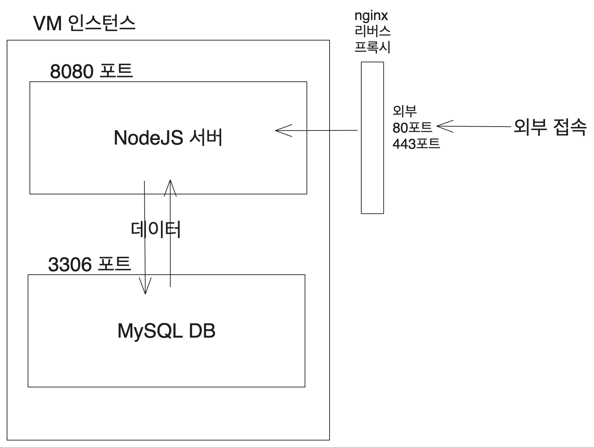
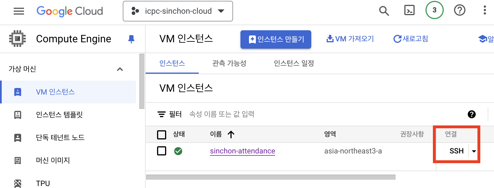
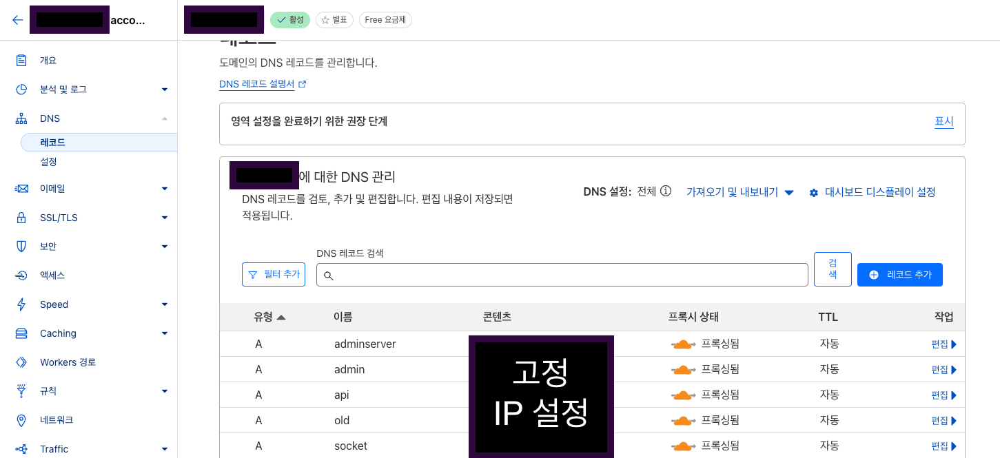
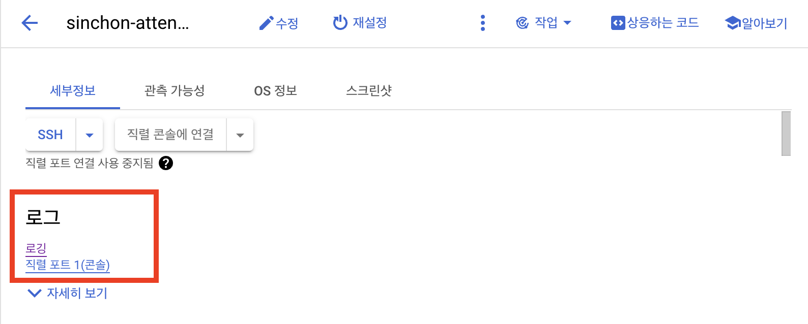

# 시작

[신촌연합 알고리즘 캠프 출석 페이지 만들기 - 개발 환경 세팅](https://witch.work/posts/sinchon-attendance-project)에서 이어지는 글이다. 신촌연합의 출석 관리용 DB를 만들고, 거기 연결된 서버를 만들어서 네트워크에 배포하는 과정을 정리한다. 도메인도 연결할 것이다.

Google Cloud SQL처럼 DB를 따로 만들어서 서버와 연결하는 방법도 있지만, 이번에는 DB와 서버를 같은 가상 머신에 두는 방법을 사용하겠다. 일단 돌아가게 만들고, 백업이나 DB 격리 방안 같은 것은 이후에 고민할 것이다.

# 1. 가상 머신 구성

[Docker+GCP로 Springboot 배포 총정리(AWS EC2,RDS 대신 GCP VM,cloud SQL을 써보아요)](https://choo.oopy.io/5c999170-dde5-4418-addc-00a0d263287c) 를 참고하였다.

## 1.1. 프로젝트와 가상 머신 생성

먼저 [Google Cloud Platform](https://cloud.google.com/)에 접속해서 프로젝트를 만든다. 프로젝트를 만들면 콘솔이 나오는데 이곳의 Compute Engine - VM 인스턴스 메뉴에서 가상 머신을 만들 수 있다.


부팅 디스크는 우분투 20.04 LTS x86_64로 설정했다. 이때 보안을 위해서는 네트워크 인터페이스의 default 항목을 클릭해서 별칭 IP 범위의 외부 IP 주소를 없음으로 설정해주는 것이 좋다. 그리고 제일 싼 e2-micro로 만들 수도 있겠지만 배포 시 그래도 메모리가 좀 있는 편이 좋으므로 지출을 감수하고 e2-medium로 만들었다.

## 1.2. 외부 IP 주소 설정

외부 IP 주소는 위의 링크에서 설명한대로 고정 IP 예약을 통해서 설정할 수 있다. 콘솔의 왼쪽 위 사이드바의 VPC 네트워크 - IP주소 메뉴에서 외부 IP 주소를 예약할 수 있다.

나는 당연히 서울 리전(asia-northeast3)의 IP 주소를 예약했다. 이후 이 IP 주소를 도메인에 연결할 것이다.

나머지는 기본 설정이다. 표준 서비스 계층, IP 버전은 IPv4로 한다. 그리고 IP 주소 설정 시 연결 대상을 가상 머신 인스턴스로 설정해주는 것을 잊지 말자. 리전 설정 아래에서 설정할 수 있다.

## 1.3. 방화벽 설정

VPC 네트워크 - 방화벽 메뉴에서 외부망에서 접속하는 포트를 열어줘야 한다. 나는 위의 참고 링크에 나온 대로 8080 포트를 열었다. 좀 더 자세한 스크린샷은 [구글 클라우드 플랫폼에 Docker로 웹서버 띄우기](https://kibbomi.tistory.com/241) 에서 찾을 수 있다.

이제 이후 서버에서 8080 포트를 listen한 후 `고정IP주소:8080` 으로 접속하면 서버에 접속할 수 있을 것이다.

# 2. 도커와 MySQL 구성

현재로서 목표로 하고 있는 서버는 다음과 같은 식으로 작동한다. 가상 머신의 3306 포트에는 MySQL이 설치되어 있고, 8080 포트에는 Node.js 서버가 설치되어 있다. 각각은 도커 컨테이너에 들어 있다. Node.js 서버는 MySQL에 접속해서 데이터를 읽고 쓰는 역할을 한다. 그리고 외부에서 nginx가 리버스 프록시를 이용해서 80포트로 들어온 요청을 8080 포트로 보내준다.



## 2.1. Docker 설치

[Ubuntu에 Docker 엔진 설치](https://docs.docker.com/engine/install/ubuntu/)를 참고하여 가상 머신에 도커를 설치할 수 있다.

Compute Engine 목록에서 SSH 버튼을 누르면 가상 머신에 접속할 수 있다.



그리고 위의 링크를 따라 커맨드를 입력하고 도커를 설치한다.

## 2.2. MySQL DB 도커 컨테이너 실행

MySQL DB가 실행되어 있어야 이후 NodeJS 서버에서 데이터를 불러와 보기 편하므로 MySQL 이미지를 받아서 실행해 보자. [poiemaweb의 Docker를 사용하여 MySQL 설치하고 접속하기](https://poiemaweb.com/docker-mysql)를 참고하였다.

나는 MySQL 8.0을 다운받을 것이므로 다음 커맨드를 입력하자.

```bash
docker pull mysql:8.0
```

이렇게 하면 MySQL 8.0 이미지를 다운받을 수 있다. 그리고 다음과 같이 실행하자. `-v`로 데이터를 저장할 볼륨을 지정해 주었다. 이렇게 하면 컨테이너가 종료되어도 데이터가 남아있게 된다.

```bash
docker run --name mysql-container -p 3306:3306 -v /tmp/mysql:/var/lib/mysql -e MYSQL_ROOT_PASSWORD={사용할 비밀번호} -d mysql
```

`docker ps`로 컨테이너가 잘 실행되었는지 확인하고 들어가 보자. 한글로 된 데이터가 있으므로 [로케일에서 UTF-8을 사용하도록 설정해야 한다. (아래의 `-e LC_ALL=C.UTF-8`)](https://songacoding.tistory.com/66)


```bash
docker exec -e LC_ALL=C.UTF-8 -it mysql-container bash
# bash가 뜨면 mysql 접속
mysql -u root -p
```

이제 MySQL에 접속해서 데이터베이스를 만들고 테이블을 만들어줘보자. 어차피 이후 prisma가 해줄 것이지만 잘 되는지 확인해보기 위해서다. 나중에 prisma로 테이블들을 초기화하면서 이 데이터는 다 날아갈 것이다.

`show databases`나 `show tables` 명령어로 데이터베이스와 현재 사용하고 있는 데이터베이스의 테이블들을 확인할 수 있다. "김철수"같은 이름을 보면 알겠지만 ChatGPT로 생성한 가짜 데이터이다.

```sql
CREATE DATABASE attendance_db;
USE attendance_db;

CREATE TABLE student (
    id INT AUTO_INCREMENT PRIMARY KEY,
    name VARCHAR(10),
    school VARCHAR(10),
    boj_handle VARCHAR(30),
    email VARCHAR(50),
    phone VARCHAR(20),
    money_type VARCHAR(5),
    is_invited BOOLEAN,
    is_canceled BOOLEAN
);

INSERT INTO student (name, school, boj_handle, email, phone, money_type, is_invited, is_canceled)
VALUES
    ('김철수', '연세대학교', 'chulsoo123', 'chulsoo@example.com', '010-1234-5678', '3', TRUE, FALSE),
    ('이영희', '서강대학교', 'younghi456', 'younghi@example.com', '010-2345-6789', '3', FALSE, FALSE),
    ('박지민', '홍익대학교', 'jimin789', 'jimin@example.com', '010-3456-7890', '6', TRUE, TRUE),
    ('최현우', '이화여자대학교', 'hyunwoo1011', 'hyunwoo@example.com', '010-4567-8901', '6', FALSE, FALSE),
    ('정소연', '숙명여자대학교', 'soyeon1213', 'soyeon@example.com', '010-5678-9012', '3', TRUE, FALSE);

SELECT * FROM student; -- 데이터가 잘 들어갔는지 확인
```

# 3. NodeJS 서버 구성

MySQL DB를 도커 컨테이너에 넣었으니 이걸 불러올 수 있는 서버를 구성하자. NodeJS는 깔려 있다고 가정하자.

## 3.1. 서버 코드 작성

실제로는 좀더 복잡한 DB를 만들었지만 배포 과정을 정리하는 글이므로 매우 단순화해서 작성하였다. 먼저 프로젝트를 설치하고 prisma를 설치하자. 서버 구성을 편하게 하기 위해 express를 사용하였다.

```bash
# 프로젝트 폴더로 이동
npm init -y
npm install express prisma @prisma/client
npx prisma init # prisma 초기화, 폴더 생성
```

생성된 `prisma/schema.prisma` 파일을 열고 다음과 같이 Student 모델을 추가하자.

```prisma
datasource db {
  provider = "mysql" // 또는 사용하는 데이터베이스 유형
  url      = env("DATABASE_URL")
}

generator client {
  provider = "prisma-client-js"
}

enum School {
  YONSEI
  SOGANG
  HONGIK
  EWHA
  SOOKMYUNG
}

model Student {
  id               Int                @id @default(autoincrement())
  name             String             @db.VarChar(50)
  bojHandle       String             @db.VarChar(50) @unique
  email            String
  phone            String             @db.VarChar(20)
  school           School             @default(SOGANG)
  studentNumber   String             @db.VarChar(20) // 학번
}
```

그리고 Prisma의 [Connection URLs 문서](https://www.prisma.io/docs/orm/reference/connection-urls)를 참고하여 `DATABASE_URL`환경 변수를 `.env`에 설정해주자.

그리고 prisma migrate와 클라이언트를 생성, 설치해주자.

```bash
npx prisma migrate dev --name init
npx prisma generate
npm install @prisma/client
```

이제 NodeJS 서버를 만들어보자. `index.js` 파일을 만들고 다음과 같이 작성하자.

```javascript
const express = require('express');
const { PrismaClient } = require('@prisma/client');

const prisma = new PrismaClient();

const app = express();

app.get('/', async (req, res) => {
  const students = await prisma.student.findMany();
  res.json(students);
});

app.listen(8080, () => {
  console.log('Server is running on http://localhost:8080');
});
```

packager.json의 `start`와 `dev` 스크립트를 다음과 같이 설정하자. dev는 자동으로 서버를 재시작해주는 nodemon을 사용하였다. 이걸 위해서는 또 `npm install --save-dev nodemon`을 해주어야 한다. 그냥 node를 써도 상관은 없다.

```json
"scripts": {
  "start": "node index.js",
  "dev": "nodemon index.js"
}
```

## 3.2. 서버 도커 컨테이너 빌드

[[Docker] Docker로 서버 구축](https://ebbnflow.tistory.com/m/206) 등을 참고하였다.

이제 NodeJS 서버를 도커 컨테이너에 넣어보자. 먼저 도커 빌드를 위해 Dockerfile을 만들어주자. `DATABASE_URL` 변수를 설정하는 이유는 prisma가 클라이언트를 생성할 때 이를 사용하기 때문이다. 이를 위해 `docker build`할 때 `--build-arg` 옵션을 사용해야 한다.

```dockerfile
# Node.js 공식 이미지를 기반으로 설정
FROM node:20

ARG DATABASE_URL
ENV DATABASE_URL=$DATABASE_URL

# 앱 디렉토리 생성
WORKDIR /usr/src/app

# 앱 소스 추가
COPY . .

# 애플리케이션 의존성 설치
# package.json 과 package-lock.json을 복사
COPY package*.json /usr/src/app

RUN npm install

# Prisma CLI 설치 및 prisma generate 실행
RUN npx prisma generate

# 앱이 사용할 포트를 노출
EXPOSE 8080

# 컨테이너 실행 시 실행하는 명령어
CMD ["npm", "start"]
```

이제 로컬에서 빌드를 해보자. 나는 어차피 나중엔 도커 컴포즈를 사용하려고 하므로 여기선 테스트만을 위해 단순히 nodeapp이라는 이름을 썼다.

```bash
docker build --build-arg DATABASE_URL=${DATABASE_URL} -t nodeapp .
# 도커 이미지가 잘 만들어졌는지 확인
docker images
```

이를 실행시켜 보려면 `docker run -p 8080:8080 nodeapp`을 실행하면 된다. 이제 `localhost:8080`으로 접속하면 서버가 실행되어 있는 것을 확인할 수 있다.

만약 안되면 prisma 파일이 없다는 에러가 뜰 수 있다. 그러면 Dockerfile에서 prisma 폴더를 복사하는 부분을 추가해주자.

```dockerfile
# Prisma 스키마 파일 복사
COPY prisma /usr/src/app/prisma
```

## 3.3. 서버 도커 컨테이너 올리기

그런데 이걸 나중에 가상 머신에서 받아와서 실행해야 하므로 도커 이미지를 어딘가에 올려 놓아야 한다. 이를 위해서는 도커허브나 깃헙 컨테이너 레지스트리를 사용할 수 있다. 나는 깃헙 컨테이너 레지스트리를 사용할 것이다. [깃허브로 도커 이미지 공유하기 | Packages Container Registry](https://mvje.tistory.com/172)를 참고하였다.

이 링크에서 Personal Access Token을 만들어야 깃헙에 이미지를 올릴 수 있다. [Working with the Container registry](https://docs.github.com/en/packages/working-with-a-github-packages-registry/working-with-the-container-registry)를 참고하여 Personal Access Token을 만들고 이를 복사해서 환경 변수로 설정해주자.

```bash
export CR_PAT=YOUR_TOKEN
```

그리고 빌드한 이미지를 다음과 같이 깃헙 컨테이너 레지스트리에 올려보자.

```bash
# 로그인
echo $CR_PAT | docker login ghcr.io -u witch-factory --password-stdin
# 이미지 푸시
docker tag nodeapp ghcr.io/icpc-sinchon/nodeapp
docker push ghcr.io/icpc-sinchon/nodeapp
```

깃헙 컨테이너 레지스트리에 이미지가 올라갔을 것이다. 이제 이 이미지를 가상 머신에 pull받아서 실행해볼 수 있다. 이렇게 하면 `내 VM 인스턴스의 고정 IP 주소:8080`으로 접속하면 서버에 접속할 수 있을 것이다.

```bash
docker pull ghcr.io/icpc-sinchon/nodeapp
```

# 4. Github Action과 docker compose를 이용해 자동화

그런데 내가 서버 관련 변경사항을 만들 때마다 매번 도커 이미지를 빌드하고, 가상 머신에 pull 받아서 실행하는 것은 귀찮은 일이다. 이를 자동화하기 위해 Github Action을 사용해보자.

## 4.1. Github Action

먼저 GitHub Action과 GCP를 연동하기 위해 서비스 계정을 만든다.

[Github Actions를 사용해서 CICD 구축해보기 실습 with GCP - 실행편](https://minkukjo.github.io/devops/2020/08/29/Infra-23/)의 'Github Actions를 사용하기 위한 서비스 계정 생성 및 등록'파트를 보면 아주 잘 나와 있다. 또한 [구글에서 만든 공식 레포지토리](https://github.com/google-github-actions/auth)를 봐도 서비스 계정 key를 만드는 방법이 나와 있다.

공식 레포지토리의 설명에 보면 워크로드 아이덴티티 제휴라는 걸 쓰는 방법도 있다고 한다. [Workload Identity Federation을 통해 안전하게 GCP 사용하는 방법 (feat. AWS)](https://medium.com/@derek10cloud/workload-identity-federation%EC%9D%84-%ED%86%B5%ED%95%B4-%EC%95%88%EC%A0%84%ED%95%98%EA%B2%8C-gcp-%EC%82%AC%EC%9A%A9%ED%95%98%EB%8A%94-%EB%B0%A9%EB%B2%95-feat-aws-545232ffb9d2)를 참고해 볼 수 있겠다. 하지만 그냥 서비스 계정 key가 유출되지만 않도록 관리만 잘 하면 될 것 같다. GitHub secrets에 등록하면 되니까.

어쨌든 이렇게 서비스 계정을 만들고 `GCE_PROJECT_ID`, `GCE_SERVICE_ACCOUNT_KEY`라는 이름으로 Github Repository의 Secrets에 등록해주자. `GCE_SERVICE_ACCOUNT_KEY`는 서비스 계정 key로 주어진 JSON을 그대로 붙여넣으면 된다.

그리고 `.github/workflows` 폴더에 `deploy.yml` 파일을 만들어 다음과 같이 작성하자. 배포하는 역할이라는 의미에서 이름을 이렇게 지었는데 `main.yml`이나 `ci.yml` 등으로 이름을 지어도 상관없다.

나머지는 github action에서 제공하는 라이브러리 같은 것들을 사용했고 크게 특별한 건 없다. 기존에 커맨드로 실행한 명령들을 자동화한 정도다. 그래도 github action 명령들을 구성하면서 고생한 부분이 좀 있었다.

먼저 앞서서는 깃헙 레지스트리에 접근하기 위해서 새로운 Personal Token을 발급받았다. 하지만 [Github Actions에서는 `GITHUB_TOKEN`이라는 환경 변수를 기본적으로 제공한다.](https://docs.github.com/en/actions/security-guides/automatic-token-authentication#using-the-github_token-in-a-workflow) 이를 통해서 깃헙 레지스트리에 접근한다.

그리고 `Deploy to Google Compute Engine` 파트에서 엄청나게 많은 명령을 한 줄로 전송한다. 대충 가상 머신에 접속해서 필요한 컨테이너들을 실행하는 명령이다. MySQL 8.0 이미지를 받아서 실행한다. 그리고 깃헙 레지스트리에서 내 서버의 이미지를 받아서 실행한다. 이때 만약 기존에 실행 중인 같은 이미지가 있을 경우 지워주었다.

또 Google Compute Engine에 접속하기 위해서는 `GCE_USERNAME`, `GCE_INSTANCE_NAME`, `GCE_INSTANCE_ZONE`이라는 이름으로 Github Repository의 Secrets에 등록해줘야 한다. Google Cloud Console에서 VM 인스턴스를 클릭하면 이 정보를 확인할 수 있다.

SSH로 브라우저에서 접속 시 USERNAME도 쉽게 확인할 수 있다. 애초에 명령 입력줄 앞에 `USERNAME@INSTANCE_NAME` 형식의 이름이 붙어있다. 이걸 복사해서 그대로 Repository의 Secrets에 등록하면 된다.

```yaml 
name: Deploy to Google Compute Engine

on:
  push:
    branches:
      - main

jobs:
  deploy:
    runs-on: ubuntu-20.04
    permissions:
      contents: read
      packages: write
      id-token: write

    steps:
      - name: Checkout code
        uses: actions/checkout@v4

      - name: Set up Docker Buildx
        uses: docker/setup-buildx-action@v3

      - name: Login to GitHub Container Registry
        uses: docker/login-action@v3
        with:
          registry: ghcr.io
          username: ${{ github.actor }}
          password: ${{ secrets.GITHUB_TOKEN }}

      - name: Set up environment variables
        run: |
          echo "DATABASE_URL=${{ secrets.DATABASE_URL }}" >> .env

      - name: Build and push Docker images
        env:
          DATABASE_URL: ${{ secrets.DATABASE_URL }}
        run: |
          docker build \
          --build-arg DATABASE_URL=${DATABASE_URL} \
          -t ghcr.io/${{ github.repository }}/node-app .
          docker push ghcr.io/${{ github.repository }}/node-app

      - name: google auth
        uses: google-github-actions/auth@v2
        with:
          credentials_json: ${{ secrets.GCE_SERVICE_ACCOUNT_KEY }}

      - name: Setup Google Cloud SDK
        uses: google-github-actions/setup-gcloud@v2
        with:
          version: ">= 363.0.0"
          project_id: ${{ secrets.GCE_PROJECT_ID }}

      - name: Deploy to Google Compute Engine
        run: |
          gcloud compute ssh ${{ secrets.GCE_USERNAME }}@${{ secrets.GCE_INSTANCE_NAME }} --zone ${{ secrets.GCE_INSTANCE_ZONE }} --command "\
          sudo docker ps -q | xargs --no-run-if-empty docker container stop && \
          sudo docker ps -a -q | xargs --no-run-if-empty docker container rm && \
          sudo docker images -q mysql:8.0 | xargs --no-run-if-empty sudo docker rmi && \
          sudo docker images -q ghcr.io/${{ github.repository }}/node-app | xargs --no-run-if-empty sudo docker rmi && \
          sudo docker pull mysql:8.0 && \
          sudo docker run --name mysql-container -p 3306:3306 -v /tmp/mysql:/var/lib/mysql -e MYSQL_ROOT_PASSWORD=${{ secrets.MYSQL_ROOT_PASSWORD }} -d mysql && \
          echo ${{ secrets.GITHUB_TOKEN }} | sudo docker login ghcr.io -u ${{ github.actor }} --password-stdin && \
          sudo docker pull ghcr.io/${{ github.repository }}/node-app && \
          sudo docker run -p 8080:8080 -d -e DB_HOST=${{ secrets.DB_HOST }} -e DB_USER=${{ secrets.DB_USER }} -e DB_PASS=${{ secrets.DB_PASS }} -e DB_NAME=${{ secrets.DB_NAME }} -e DB_PORT=3306 ghcr.io/${{ github.repository }}/node-app"
```

## 4.2. docker-compose

그런데 이렇게 하면 알아보기도 힘들고 나중에 고치기도 어렵다. 또한 로컬에서도 테스트하기 위해 컨테이너 여러 개를 띄우느라 명령줄을 길게 입력해야 한다. 이를 해결하기 위해 docker-compose를 사용해보자.

먼저 `docker-compose.yml` 파일을 만들어 다음과 같이 작성하자. 이 파일은 여러 컨테이너를 한 번에 띄우기 위한 설정 파일이다.

```yaml
version: "3.8"

services:
  db:
    image: mysql:8.0
    environment:
      MYSQL_ROOT_PASSWORD: ${MYSQL_ROOT_PASSWORD}
      MYSQL_DATABASE: attendance_db
    ports:
      - "3306:3306"
    volumes:
      - db_data:/var/lib/mysql

  app:
    image: ghcr.io/icpc-sinchon/admin-service-new-backend/node-app
    command: sh -c "npx prisma migrate deploy && npx prisma generate && npm run start"
    ports:
      - "8080:8080"
    environment:
      DB_HOST: db
      DB_USER: {유저 이름}
      DB_PASS: {사용할 비밀번호}
      DB_NAME: attendance_db
      DB_PORT: ${사용할 포트}
      JWT_SECRET: ${JWT_SECRET}
      DATABASE_URL: ${DATABASE_URL}
    depends_on:
      - db

volumes:
  db_data:
```

이렇게 하면 로컬에서 `docker-compose up -d`을 실행하면 MySQL 8.0과 도커 이미지가 된 NodeJS 서버가 동시에 띄워진다. 이를 이용해서 Github Action을 수정해보자. 나머지 부분은 크게 고칠 게 없고 `Deploy to Google Compute Engine` 부분만 고치면 된다.

이를 위해 `docker-compose`를 설치해야 한다. 가상 머신에 접속해서 [우분투에서 Docker compose로 모든 컨테이너 한방에 실행하기](https://velog.io/@tekies09/%EC%9A%B0%EB%B6%84%ED%88%AC%EC%97%90%EC%84%9C-Docker-compose%EB%A1%9C-%EB%AA%A8%EB%93%A0-%EC%BB%A8%ED%85%8C%EC%9D%B4%EB%84%88-%ED%95%9C%EB%B0%A9%EC%97%90-%EC%8B%A4%ED%96%89%ED%95%98%EA%B8%B0)를 따라하자.

그 다음에는 github action에서 `docker-compose.yml`과 `Dockerfile`, prisma 폴더를 scp 커맨드로 가상 머신에 전송한 후 가상 머신에 접속해서 docker-compose를 하는 스크립트를 입력한다.

길이 자체는 길어졌지만 각 부분의 역할이 나뉘었고 이해나 수정은 더 쉬워졌다. 이제는 `docker-compose.yml` 파일을 수정하면 자동으로 가상 머신에 적용된다. 기존에 있는 컨테이너를 내리고 올리는 부분도 `docker-compose down`과 `docker-compose up -d`로 간단히 해결할 수 있다.

또한 로컬에서 테스트할 때도 서버 이미지를 빌드했다면 `docker-compose up -d`만으로 서버를 띄울 수 있다. 환경 변수들을 담당하는 부분도 따로 분리되었고 `GCE_INSTANCE`가 그렇듯이 필요할 경우 묶어서 새로운 변수화할 수도 있다.

```yaml
  - name: Deploy to Google Compute Engine
    env:
      GCE_INSTANCE: ${{ secrets.GCE_USERNAME }}@${{ secrets.GCE_INSTANCE_NAME }}
      GCE_ZONE: ${{ secrets.GCE_INSTANCE_ZONE }}
      MYSQL_ROOT_PASSWORD: ${{ secrets.MYSQL_ROOT_PASSWORD }}
      DATABASE_URL: ${{ secrets.DATABASE_URL }}
      JWT_SECRET: ${{ secrets.JWT_SECRET }}
      DB_HOST: ${{ secrets.DB_HOST }}
      DB_PORT: ${{ secrets.DB_PORT }}
      DB_USER: ${{ secrets.DB_USER }}
      DB_PASS: ${{ secrets.DB_PASS }}
      DB_NAME: ${{ secrets.DB_NAME }}
    run: |
      gcloud compute scp docker-compose.prod.yml ${GCE_INSTANCE}:~/docker-compose.yml --zone ${GCE_ZONE}
      gcloud compute scp Dockerfile ${GCE_INSTANCE}:~/Dockerfile --zone ${GCE_ZONE}
      gcloud compute scp --recurse ./prisma ${GCE_INSTANCE}:~/prisma --zone ${GCE_ZONE}
      gcloud compute ssh ${GCE_INSTANCE} --zone ${GCE_ZONE} --command "
        echo \"MYSQL_ROOT_PASSWORD=${MYSQL_ROOT_PASSWORD}\" > .env
        echo \"DATABASE_URL=${DATABASE_URL}\" >> .env
        echo \"JWT_SECRET=${JWT_SECRET}\" >> .env
        echo \"DB_HOST=${DB_HOST}\" >> .env
        echo \"DB_PORT=${DB_PORT}\" >> .env
        echo \"DB_USER=${DB_USER}\" >> .env
        echo \"DB_PASS=${DB_PASS}\" >> .env
        echo \"DB_NAME=${DB_NAME}\" >> .env
        sudo docker-compose down
        sudo docker-compose pull
        sudo docker-compose --env-file .env up -d
      "
```

물론 docker-compose에도 `build` 옵션이 있고 따라서 docker build를 하는 부분도 `docker-compose.yml` 파일에 넣어서 `docker-compose up -d --build`로 실행하도록 할 수 있다. 하지만 그렇게 하면 Dockerfile에서 `prisma generate`를 하는 부분이 빌드할 때도 실행되고 가상 머신에서도 실행되기 때문에 불필요한 작업이 두 번 일어나게 되고 에러도 자꾸 발생했다.

그래서 도커 이미지를 빌드하는 부분은 기존 명령어로 그대로 두고 docker-compose는 가상 머신에서만 사용하게 하였다.

# 5. 기타 작업

## 5.1. Nginx 리버스 프록시로 도메인 연결

서버가 배포되어서 `가상 머신 고정 IP주소:8080`으로 접속할 수 있게 되었다. 가상 머신에서 서버가 돌아가면서 8080 포트를 listen 하고 있고, 방화벽을 통해서 8080 포트 접속을 허용했기 때문이다.

이 서버를 위해서 Cloudflare로 도메인을 하나 구해 놓았다. 여기에 연결해 보자. 이미 고정 IP 주소가 있으므로 이를 A 레코드로 연결하면 된다. Cloudflare 대시보드에 들어가서 연결할 도메인의 상세 페이지에 들어간 후 사이드바에서 DNS를 선택해 들어간다. 그리고 DNS 관리 탭에서 A 레코드를 추가한다.



나는 `api` 서브도메인을 사용할 거라서 해당 서브도메인으로 연결했지만 만약 어떤 도메인의 루트로 연결하고 싶다면 `@`로 설정하면 된다. 서브도메인과 네트워크 상 구조에 대해서는 [내 도메인에 서브도메인으로 페이지를 달기 위해 고생한 기록](https://witch.work/posts/cloudflare-make-subdomain)을 참고할 수 있겠다.

그런데 문제는 이렇게 A 레코드로 도메인에 연결하면, 해당 도메인에 접속 시 80이나 443포트로 연결되게 된다. 그런데 우리가 열어 놓은 포트는 8080포트다. 이를 해결하기 위해 Nginx 리버스 프록시를 사용해보자. Cloudflare의 엔터프라이즈 플랜을 사용 중이라면 페이지 규칙을 통해 포트 리디렉션이 가능하기는 하지만 당연히 엔터프라이즈 플랜 같은 건 없다.

가상 머신에 SSH로 접속해서(구글 클라우드 콘솔에서 가능) 먼저 nginx를 설치한다.

```bash
sudo apt update
sudo apt install nginx
```

nginx 설정 파일을 생성한다.

```bash
sudo nano /etc/nginx/sites-available/연결할 도메인
```

그리고 다음과 같이 작성한다. 여기서 `server_name`은 연결할 도메인이고 `proxy_pass`는 리버스 프록시로 연결할 서버의 주소다. 여기서는 가상 머신의 고정 IP 주소와 8080 포트로 연결하였다.

```nginx
server {
    listen 80;
    server_name api.suapc.kr;

    location / {
        proxy_pass http://localhost:8080;
        proxy_http_version 1.1;
        proxy_set_header Upgrade $http_upgrade;
        proxy_set_header Connection 'upgrade';
        proxy_set_header Host $host;
        proxy_set_header X-Real-IP $remote_addr;
        proxy_set_header X-Forwarded-For $proxy_add_x_forwarded_for;
        proxy_set_header X-Forwarded-Proto $scheme;
        proxy_cache_bypass $http_upgrade;
    }
}
```

파일을 저장 후 닫고 심볼릭 링크를 생성한다. 그리고 nginx를 재시작한다.

```bash
# 심볼릭 링크 생성
sudo ln -s /etc/nginx/sites-available/api.suapc.kr /etc/nginx/sites-enabled/
# nginx 테스트, 재시작
sudo nginx -t
sudo systemctl restart nginx
```

Cloudflare를 통해 SSL/TLS를 처리하는 경우 Cloudflare가 알아서 해주므로 서버 자체에 SSL 인증서를 설치할 필요가 없다. 알아서 HTTPS가 지원된다. 그리고 GCP의 방화벽 규칙에서는 기본적으로 80, 443 포트가 열려 있는 걸로 아는데, 만약 열려 있지 않을 경우 모든 IP(`0.0.0.0/0`)에 대해 80, 443 포트를 열어주도록 방화벽 설정을 해주면 된다.

## 5.2. 도커 이미지 정리

개발하고 배포하는 걸 반복하던 도중 어느 날 VM 인스턴스에 SSH 접속이 안 되는 문제가 발생했다. 이것저것 찾다가 구글 클라우드의 VM 인스턴스 페이지에서 로그를 확인해 보았다.



인스턴스 용량이 꽉 차서 SSH 접속이 안 되는 문제였다. 배포 과정에서 빌드한 도커 이미지를 계속 pull해서 쌓아놓은 게 문제였다. 이를 해결하기 위해 먼저 VM 인스턴스 용량을 늘려서 접속을 허용한 다음 도커 이미지를 정리해보자.

용량을 늘리는 건 [이상협 님의 GCP 구글 클라우드 부팅 디스크 용량 늘리기](https://velog.io/@723poil/GCP-%EA%B5%AC%EA%B8%80-%ED%81%B4%EB%9D%BC%EC%9A%B0%EB%93%9C-%EB%B6%80%ED%8C%85-%EB%94%94%EC%8A%A4%ED%81%AC-%EC%9A%A9%EB%9F%89-%EB%8A%98%EB%A6%AC%EA%B8%B0)를 참고하여 할 수 있었다. 혹은 [영구 디스크 크기 늘리기 google cloud 문서](https://cloud.google.com/compute/docs/disks/resize-persistent-disk?hl=ko)를 볼 수도 있다.

그다음 배포 시 사용하는 `deploy.yml` 파일에서 가상 머신에서 `docker system prune -af` 명령을 실행하도록 하자. 이 명령은 사용하지 않는 이미지, 컨테이너, 볼륨, 네트워크 등을 삭제해준다.

`gcloud compute ssh`로 실행하는 명령에서 `docker-compose down` 전에 `docker system prune -af` 명령을 추가하면 된다.

```yaml
      - name: Deploy to Google Compute Engine
        run: |
          gcloud compute ssh ${{ secrets.GCE_USERNAME }}@${{ secrets.GCE_INSTANCE_NAME }} --zone ${{ secrets.GCE_INSTANCE_ZONE }} --command "\
          ... 생략 ...
          sudo docker system prune -af && \
          sudo docker-compose down && \
          sudo docker-compose pull && \
          sudo docker-compose --env-file .env up -d"
```

## 5.3. 스냅샷으로 백업

그런데 지금 상태는 안전하지 않다. 만약 가상 머신이 통째로 날아가는 일이 생기거나 DB 볼륨 영역에 어떤 문제가 생기면 데이터가 전부 날아가게 될 것이다.

물론 대부분의 클라우드 서비스에서는 클라우드 데이터베이스를 만드는 기능도 지원하고 Google Cloud Platform에서도 Cloud SQL이라는 서비스를 제공한다. 이러한 서비스들은 보통 자동 백업 등 DB 데이터가 완전히 날아가지 않도록 기본적인 안전성을 제공한다.

하지만 이를 사용하면 비용이 발생하게 된다. 또한 만들고 있는 서버에 저장될 데이터 특성상 실시간 백업이 엄청나게 중요하지는 않다. 따라서 비용이 드는 새로운 DB 인스턴스를 만들기보다는 매일 가상 머신의 스냅샷을 저장하는 방식으로 최소한의 안전성을 확보하였다.

[디스크 스냅샷 일정 만들기](https://cloud.google.com/compute/docs/disks/scheduled-snapshots?hl=ko) 페이지를 참고하여 Google Compute Engine의 좌측 스토리지 메뉴에서 스냅샷 일정을 만들고 가상 머신이 사용하는 디스크를 연결하면 된다.

나는 간단히 `default-schedule-1`이라는 이름으로 매일 오전에 스냅샷을 만드는 일정을 생성하고 부팅 디스크에 연결했다. 이렇게 하면 VM 인스턴스의 부팅 디스크에서 스냅샷 일정을 확인할 수 있다. 혹은 스토리지 - 스냅샷 메뉴에서 확인할 수도 있다.


# 참고

Docker+GCP로 Springboot 배포 총정리(AWS EC2,RDS 대신 GCP VM,cloud SQL을 써보아요)

https://choo.oopy.io/5c999170-dde5-4418-addc-00a0d263287c

구글 클라우드 플랫폼에 Docker로 웹서버 띄우기

https://kibbomi.tistory.com/241

도커로 설정하는 서비스 개발/운영 환경

https://inhibitor1217.github.io/2019/10/25/devlog-docker.html

Google Cloud Platform, docker-compose로 배포하면서 겪은 이슈

https://choiblog.tistory.com/147

A GitHub Action for installing and configuring the gcloud CLI

https://github.com/google-github-actions/setup-gcloud

볼륨(volume) 의 개념에 대해 알아보고 활용해봅시다.

https://formulous.tistory.com/17

pull 받기전에 컨테이너 날리기

https://stackoverflow.com/questions/74800773/how-to-avoid-getting-an-error-message-when-there-is-no-docker-container-image-vo

15분만에 GitHub Actions 로 Google App Engine에 배포하기

https://medium.com/humanscape-tech/15%EB%B6%84%EB%A7%8C%EC%97%90-github-actions-%EB%A1%9C-google-app-engine%EC%97%90-%EB%B0%B0%ED%8F%AC%ED%95%98%EA%B8%B0-ae97e53ed096

Github Actions를 사용해서 CICD 구축해보기 실습 with GCP - 실행편

https://minkukjo.github.io/devops/2020/08/29/Infra-23/

깃허브로 도커 이미지 공유하기 | Packages Container Registry

https://mvje.tistory.com/172

Publishing and installing a package with GitHub Actions

https://docs.github.com/en/packages/managing-github-packages-using-github-actions-workflows/publishing-and-installing-a-package-with-github-actions

GitHub Actions (2)

https://velog.io/@greentea/GitHub-Actions-2

SSH 로 GCE(VM) 접속방법 좀 더 알아보기

https://medium.com/google-cloud-apac/gcp-ssh-%EB%A1%9C-gce-vm-%EC%A0%91%EC%86%8D%EB%B0%A9%EB%B2%95-%EC%A2%80-%EB%8D%94-%EC%95%8C%EC%95%84%EB%B3%B4%EA%B8%B0-cb37dce39f87

중간에 디스크 크기 기본 10GB가 부족해져서 이를 늘렸다. 여기 참고한 영구 디스크 크기 늘리기 문서

https://cloud.google.com/compute/docs/disks/resize-persistent-disk?hl=ko

구글 클라우드 부팅 디스크 용량 늘리기

https://velog.io/@723poil/GCP-%EA%B5%AC%EA%B8%80-%ED%81%B4%EB%9D%BC%EC%9A%B0%EB%93%9C-%EB%B6%80%ED%8C%85-%EB%94%94%EC%8A%A4%ED%81%AC-%EC%9A%A9%EB%9F%89-%EB%8A%98%EB%A6%AC%EA%B8%B0