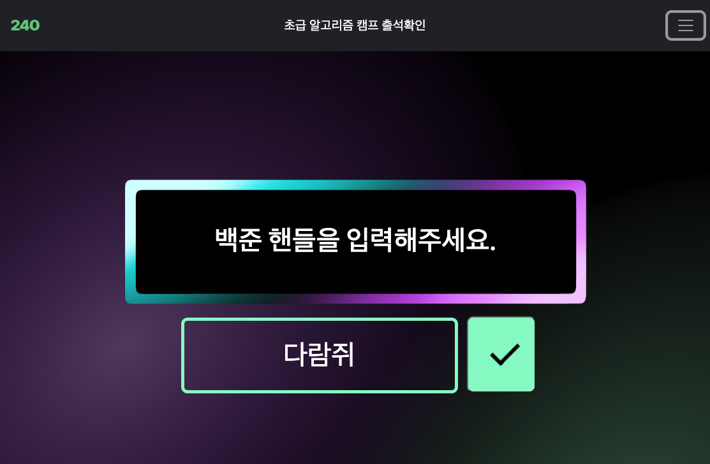

# 1. 시작

[ICPC Sinchon(이하 신촌연합)](https://icpc-sinchon.io/)에서 프로그램 관리팀을 맡게 되었다. 이왕 하게 된 프로젝트 잘 해보자 싶기도 하고, 새롭게 해보는 것도 많아서 이곳에 기록을 남기기 시작한다.

이 글에서는 출석 관련 페이지를 만들면서 하게 되었던 기본적인 웹팩 설정에 대해서 다룬다. 학생들이 출석 코드를 입력하면 이를 확인해서 출석을 처리하려고 했는데, 이는 결국 실패했지만 세팅을 해본 건 가치가 있었던 것 같아 기록으로 남긴다. 언젠가 다시 시작될 수도 있고.

## 1.1. 배경

나는 오래 전부터 [ICPC Sinchon(이하 신촌연합)](https://icpc-sinchon.io/)에서 활동해왔다. [그곳에서 강의를 듣기도 했고](https://witch.work/posts/sinchon-camp-2021-summer) 시간이 지나 실력이 조금 붙자 [거기서 강사 활동을 하기도 했다.](https://github.com/witch-factory/2022-winter-sinchon-lecture)

그리고 [신촌연합의 캠프장을 맡은 분](https://github.com/Goldchae)과 식사를 하다가 그곳의 갖가지 일을 돕게 되었다. 그 중 첫번째가 바로 알고리즘 강의의 출석을 위한 페이지를 만드는 거였다. [다른 운영진](https://noguen.tistory.com/)분께서 디자인도 간단히 해주셨다.

그곳의 개발을 시작하면서 했던 설정들을 정리하는 글이다.

## 1.2. 기존 구성

기존의 페이지에도 필요한 요소들은 있었고 디자인도 괜찮았다. 애초에 여러 컴포넌트들이 그냥 피그마로 만든 이미지를 삽입한 거라서 깔끔한 편이었다.



하지만 개발 환경이나 로직 설계에 있어서는 그렇게 잘 되어 있지 못했다. HTML, CSS, 바닐라 JS로만 짜여 있었고 CSS로 해결할 수 있는 부분도 이미지를 삽입해서 만들고 있었다. 라이브러리는 `<script>`태그의 CDN을 통해서 사용하고 있었고 번들 용량에서 낭비되는 부분도 많았다. 내비게이션 바 하나를 위해서 `bootstrap` 전체를 사용하고 있는 등이었다.

개발 서버 세팅 등도 되어 있지 않았다. 또한 사용자를 위한 페이지는 firebase로, 관리자를 위한 페이지는 repl.it에서 호스팅되고 있는 등 배포도 흩어져 있었다.

이를 좀더 나은 구조로 리팩토링하고, React와 TypeScript를 도입하고, 패키지 매니저를 사용하고, 빌드를 통해서 배포할 수 있게 만들어보는 작업을 진행하고자 한다. 이후에는 테스트도 도입하고자 한다.

다만 모든 지식을 완벽히 알고 있는 상태에서 시작하는 것이 아니라서 미흡할 수 있다. 그래도 해나가는 과정을 여기 기록한다.

`create-vite`와 같은 프로젝트 템플릿을 사용해서 아예 갈아엎을 수도 있다. 하지만 기존에 이 코드를 작성하던 사람이 있고 이미 배포되어서 사용되고 있기 때문에, 최대한 원래의 선택과 기존의 구조를 보존하면서 시작하고자 한다.

따라서 웹팩 등 프로젝트 설정을 거의 밑바닥부터 진행하고 리팩토링을 하겠다. 이 글에서는 프로젝트 설정에 관해서 다룬다.

## 1.3. 구상

이 글에서 해야 할 일은 다음과 같다.

- 개발 환경 세팅
- 국민 스택(?) React, TypeScript 도입

# 2. 기본적인 세팅

먼저 각 프로젝트에는 다음과 같은 설정을 해주었다.

## 2.1. 패키지 매니저 설정

프로젝트 폴더에서 `npm init`으로 프로젝트 설정을 시작하자. 기본적인 `package.json`이 생성된다.

```json
{
  "name": "sinchonattendance",
  "version": "1.0.0",
  "description": "### ...",
  "main": "index.js",
  "scripts": {
    "test": "echo \"Error: no test specified\" && exit 1"
  },
  "author": "",
  "license": "ISC"
}
```

## 2.2. eslint 설치

그리고 코드를 정적 분석해 문제를 찾아주는 툴인 `eslint`를 설치하자. `npm init @eslint/config`을 이용해서 빠르게 시작할 수 있다. 해당 커맨드를 입력하면 몇 가지 질문을 하고, 그에 따라 `.eslintrc.json` 파일이 생성된다. 나는 Typescript를 쓸 것이고 브라우저에서 코드를 돌릴 거라서 다음과 같이 선택했다.

```bash
npm init @eslint/config
✔ How would you like to use ESLint? · problems
✔ What type of modules does your project use? · esm
✔ Which framework does your project use? · none
✔ Does your project use TypeScript? · No / Yes
✔ Where does your code run? · browser
✔ What format do you want your config file to be in? · JSON
```

또한 이후 나오는 패키지 매니저 질문에는 `yarn`을 쓰는 걸로 했다. 

코드 정적 분석을 위해서는 Biome라는 다른 좀 더 최신의 툴을 쓸 수도 있다. 이 과정은 [기본적인 React 프로젝트 세팅](https://witch.work/posts/react-my-basic-setting#3-%EB%8B%A4%EB%A5%B8-%EC%BD%94%EB%93%9C-%ED%8F%AC%EB%A7%A4%ED%84%B0---biome)에 정리했었다. 다만 여기서는 가장 기본적인 설정을 하기 위해 `eslint`를 사용한다.

# 3. 웹팩 기본 설정

## 3.1. 웹팩 설치와 기본 설정

이제 번들러를 설치하자. 나는 고전인 웹팩을 쓸 것이다. 2024년 현재 기준 최신 프레임워크인 nextjs에서조차도 아직 웹팩을 쓰고 있으니 아주 한물간 기술은 아니라고 생각한다.

`webpack`은 `webpack-cli`와 함께 설치해야 한다.

```bash
yarn add webpack webpack-cli --dev
```

그리고 소스 파일을 만들자. 먼저 시험적으로 프로젝트 루트 경로에 `dist/index.html`을 만들고 `src/index.js`를 생성한다.

`dist/index.html`은 이후 빌드 결과물에 포함될 것이다.

그리고 `package.json`에서 엔트리 포인트를 삭제하고 private를 true로 설정하자. 실수로 publish해버리는 것을 방지하는 옵션이라고 한다.

```json
{
  "name": "sinchonattendance",
  "version": "1.0.0",
  "description": "### ...",
  "main": "index.js", // 삭제
  "private": true, // 추가
  "scripts": {
    "test": "echo \"Error: no test specified\" && exit 1"
  },
  // ...
}
```

그리고 기본적으로는 웹팩 번들링 결과물은 `main.js`이다. `dist/index.html`에서 이를 불러오도록 하자.

```html
<!DOCTYPE html>
<html>
  <head>
    <meta charset="utf-8" />
    <title>Getting Started</title>
  </head>
  <body>
    <script src="main.js"></script>
  </body>
</html>
```

`npx webpack`을 실행하면 `dist/main.js`가 생성된다. 이를 `dist/index.html`에서 불러오는 것이다.

## 3.2. 설정 파일 만들기

이제 설정 파일을 만들어보자 `npx webpack`을 실행할 때 이 설정 파일을 읽어서 빌드를 진행하도록 한다. 프로젝트 루트 경로에 `webpack.config.js`를 생성하자.

물론 파일명이 `webpack.config.js`가 아니어도 된다. 웹팩 커맨드에서 `webpack --config 파일이름`과 같이 `--config` 옵션을 통해서 사용할 설정 파일의 이름을 지정할 수도 있다. 하지만 `webpack.config.js`가 기본 설정 파일명으로 지정되어 있고 굳이 바꿀 것도 없으니 이걸 사용하자.

웹팩 공식 문서의 예시에 `mode`만 추가해서 다음과 같이 설정했다.

```js
// webpack.config.js
const path = require("path");

module.exports = {
  mode: "development",
  entry: "./src/index.js",
  output: {
    filename: "main.js",
    path: path.resolve(__dirname, "dist"),
  },
};
```

`entry`는 웹팩이 파일을 번들링할 때 진입하는 지점이고 `output`은 번들링 결과물에 대한 설정이다. 즉 이는 개발 모드로 빌드하고, `src/index.js`를 번들링해서 `dist/main.js`에 저장하라는 의미이다.

`package.json`에 빌드 명령어도 추가하자.

```json
{
  // ...
  "scripts": {
    "test": "echo \"Error: no test specified\" && exit 1",
    "build": "webpack"
  },
  // ...
}
```

이렇게 하면 `yarn build`를 실행하면 `dist/main.js`가 생성된다.

# 4. 타입스크립트 설정

그다음엔 ts를 설치하자. 그리고 `tsx --init`으로 `tsconfig.json`을 생성했다.

```bash
yarn add typescript --dev
npx tsc --init
```

그 다음 생성된 `tsconfig.json`을 다음과 같이 설정한다. [vite의 react-ts 설정을 따와서 약간 수정했다.](https://stackblitz.com/edit/vitejs-vite-6uynas?file=tsconfig.json&terminal=dev)

```json
{
  "compilerOptions": {
    "target": "ES2020",
    "useDefineForClassFields": true,
    "lib": ["ES2020", "DOM", "DOM.Iterable"],
    "module": "ES6",
    "skipLibCheck": true,

    /* Bundler mode */
    "moduleResolution": "Node",
    "allowImportingTsExtensions": true,
    "resolveJsonModule": true,
    "isolatedModules": true,
    "noEmit": true,
    "jsx": "react-jsx",

    "esModuleInterop": true,
    "forceConsistentCasingInFileNames": true /* Ensure that casing is correct in imports. */,
    /* Linting */
    "strict": true,
    "noUnusedLocals": true,
    "noUnusedParameters": true,
    "noFallthroughCasesInSwitch": true,

    "typeRoots": ["src/types"],
    "outDir": "./dist/"
  },
  "include": ["src"]
}
```

# 5. 리액트 설정

## 5.1. 라이브러리 설치

리액트 사용을 위해 다음과 같이 라이브러리를 설치하자.

```bash
yarn add react react-dom
yarn add -D webpack-dev-server html-webpack-plugin
yarn add -D @types/react @types/react-dom
yarn add -D ts-loader
```

## 5.2. 웹팩 설정 수정

그리고 `webpack.config.js`를 다음과 같이 수정하자. 기본적인 로더들과 플러그인을 추가했다.

ts를 처리하도록 웹팩 설정을 바꾸자. `module.rules`에 `.ts`와 `.tsx`를 `ts-loader`로 처리하도록 추가하자. 그리고 `resolve.extensions`에 `.ts`와 `.tsx`를 추가하자. `./src/index.ts`를 통해 진입하고 빌드된 파일은 `./dist/bundle.js`에 저장하도록 설정했다.

```js
const path = require("path");
const HtmlWebpackPlugin = require("html-webpack-plugin");

module.exports = {
  mode: "development",
  entry: "./src/index.tsx",
  output: {
    filename: "bundle.js",
    path: path.resolve(__dirname, "dist"),
    clean: true,
  },
  resolve: {
    modules: [path.resolve(__dirname, "src"), "node_modules"],
    extensions: [".tsx", ".ts", ".js", ".jsx", ".json", ".css"],
  },
  module: {
    rules: [
      {
        test: /\.(ts|tsx)$/,
        use: "ts-loader",
        exclude: /node_modules/,
      },
    ],
  },
  plugins: [
    new HtmlWebpackPlugin({
      title: "Sinchon Attendance Development",
      template: "./src/index.html",
    }),
  ]
};
```

## 5.3. 애셋 가져오기

웹팩에서 css, 이미지도 가져오도록 설정하자. `style-loader`와 `css-loader`를 설치하자.

```bash
yarn add style-loader css-loader --dev
```

그리고 [Asset Management 공식 문서](https://webpack.kr/guides/asset-management/)를 참고하여 `webpack.config.js`의 `module`속성의 rules를 다음과 같이 수정하자.

```js
const path = require("path");

module.exports = {
  // ...
  module: {
    rules: [
      {
        test: /\.tsx?$/,
        use: "ts-loader",
        exclude: /node_modules/,
      },
      {
        test: /\.css$/i,
        use: ["style-loader", "css-loader"],
      },
      {
        test: /\.(png|svg|jpg|jpeg|gif)$/i,
        type: "asset/resource",
      },
    ],
  },
  // ...
};
```

## 5.4. 개발 서버 설정

잘 되는지 확인하기 위해 기본적인 리액트 코드를 작성해보자.

```tsx
// index.tsx
import "./style.css";
import App from "./App";

import React from "react";
import ReactDOM from "react-dom/client";

// App은 따로 정의해준다

ReactDOM.createRoot(document.getElementById("root")!).render(
  <React.StrictMode>
    <App />
  </React.StrictMode>
);
```

그리고 index.html은 이렇게.

```html
<!DOCTYPE html>
<html>
  <head>
    <meta charset="UTF-8" />
    <meta http-equiv="X-UA-Compatible" content="IE=edge" />
    <meta
      name="viewport"
      content="width=device-width, initial-scale=1.0, user-scalable=no"
    />
    <meta property="og:image" content="./image/240.png" />
    <title>알고리즘캠프 출석체크</title>
  </head>
  <body>
    <div id="root"></div>
  </body>
</html>
```

이다음 개발 서버를 실행시켜서 화면이 잘 뜨는지 확인해 보자. 아까 `webpack-dev-server`를 설치했으니 이를 이용하면 된다. `package.json`에 다음 커맨드를 추가한다.

```json
{
  // ...
  "scripts": {
    "test": "echo \"Error: no test specified\" && exit 1",
    "dev": "webpack serve --mode development --open --hot",
    "build": "webpack --mode production"
  },
  // ...
}
```

그리고 `webpack.config.js`에 다음과 같이 `devServer` 속성을 추가한다.

```js
{
  // ...
  devServer: {
    static: {
      directory: path.join(__dirname, "dist"),
    },
    compress: true,
    port: 9000,
  },
}
```

이제 `yarn dev` 명령어로 개발 서버를 실행하면 `localhost:9000`에서 개발 서버가 실행된다.

만약 엔트리 포인트가 하나 이상이라면 `optimization`의 `runtimeChunk`를 `single`로 설정하자.

```js
module.exports = {
  // ...
  optimization: {
    runtimeChunk: "single",
  },
  // ...
};
```

다만 여기서는 하나의 엔트리 포인트만 있기 때문에 이 옵션을 설정하지 않아도 된다.

참고로 `webpack-dev-server`는 `output.path`에 정의된 디렉토리의 번들된 파일을 제공한다. 예를 들어 특정 파일은 다음 주소로 접근 가능하다.

```
http://[devServer.host]:[devServer.port]/[output.publicPath]/[output.filename]
```

# 6. 개발 서버의 hot module replacement 설정

개발 서버 환경에 Hot Module Replacement (HMR)를 추가하는 것은 개발 과정을 더욱 효율적으로 만들어준다. HMR을 사용하면 애플리케이션을 개발 중에 변경사항을 저장할 때마다 전체 페이지를 새로고침하지 않고도 해당 변경사항을 반영할 수 있기 때문이다.

## 6.1. HMR 기본 설정

이를 위해서는 원래 `react-hot-loader`가 주로 쓰였다. 하지만 React의 fast refresh가 더 범용적이고 좋다고 한다. 따라서 `react-refresh`를 사용하자.

```bash
yarn add -D @pmmmwh/react-refresh-webpack-plugin react-refresh
```

나는 `ts-loader`를 사용중이다. 그러니 [react-refresh 공식 문서](https://github.com/pmmmwh/react-refresh-webpack-plugin)를 참고하여 `react-refresh-typescript`를 설치해준다.

```bash
yarn add -D react-refresh-typescript
```

그리고 `webpack.config.js`를 다음과 같이 수정하자. 공식 문서의 예시를 약간 변경한 정도이다.

```js
const ReactRefreshWebpackPlugin = require('@pmmmwh/react-refresh-webpack-plugin');
const ReactRefreshTypeScript = require('react-refresh-typescript');

const isDevelopment = process.env.NODE_ENV !== 'production';

module.exports = {
  mode: isDevelopment ? 'development' : 'production',
  module: {
  rules: [
    {
        test: /\.(ts|tsx)$/,
        use: [
          {
            loader: require.resolve("ts-loader"),
            options: {
              getCustomTransformers: () => ({
                before: [isDevelopment && ReactRefreshTypeScript()].filter(
                  Boolean
                ),
              }),
              transpileOnly: isDevelopment,
            },
          },
        ],
        exclude: /node_modules/,
      },
      // 기타 플러그인 설정들...
    ],
  },
  plugins: [isDevelopment && new ReactRefreshWebpackPlugin()].filter(Boolean),
};
```

그런데 이렇게 하면 `ts-loader`가 개발 모드에서는 `transpileOnly`를 사용하게 되어서 타입 체크가 이루어지지 않는다. 타입 체크를 병렬로 진행해 주는 플러그인 `fork-ts-checker-webpack-plugin`을 사용하자.

```bash
yarn add --dev fork-ts-checker-webpack-plugin
```

그다음 웹팩 설정 파일에 다음과 같이 플러그인을 추가한다.

```js
module.exports = {
  plugins: [
    new HtmlWebpackPlugin({
      title: "Sinchon Attendance Development",
      template: "./src/index.html",
    }),
    isDevelopment && new ReactRefreshWebpackPlugin(),
    new ForkTsCheckerWebpackPlugin(),
  ].filter(Boolean),
  watchOptions: {
    ignored: /node_modules/,
  },
};
```

이렇게 한 후 `yarn dev`를 실행하면 HMR이 적용된 개발 서버가 실행된다. minification 등 더 할 수 있는 설정들도 있지만 이후 적용할 수도 있기 때문에 개발을 좀 진행한 후 최적화는 다음에 진행하기로 한다.

# 7. 기타 설정

## 7.1. 이미지 로딩

현재 설정에서는 웹팩에서 이미지 경로를 제대로 찾지 못할 수 있다. 이를 해결하기 위해 타입을 설정해 주자. `src/types`에 `custom.d.ts`를 만들고 다음과 같이 작성하자.

```ts
declare module "*.png";
declare module "*.jpg";
declare module "*.jpeg";
```

그리고 `tsconfig.json`에 다음과 같이 `typeRoots`를 설정하자.

```json
{
  "compilerOptions": {
    "typeRoots": ["src/types"],
    // ...
  },
  // ...
}
```

## 7.2. CSS 플러그인 설정

CSS 압축과 모듈화를 위한 플러그인을 설정해주자.

```bash
yarn add -D mini-css-extract-plugin css-minimizer-webpack-plugin
```

그리고 다음과 같이 웹팩 설정 파일을 수정하자. `mini-css-extract-plugin`는 `style-loader`와 같이 쓸 수 없으므로 개발 모드에서는 `style-loader`를, 프로덕션 모드에서는 `mini-css-extract-plugin`을 사용하도록 설정했다.

webpack 설정을 다음과 같이 설정한다.

```js
const MiniCssExtractPlugin = require("mini-css-extract-plugin");
const CssMinimizerPlugin = require("css-minimizer-webpack-plugin");

module.exports = {
  module: {
    rules: [
      {
        test: /\.css$/,
        use: [
          isDevelopment ? "style-loader" : MiniCssExtractPlugin.loader,
          "css-loader",
        ],
      },
    ],
  },
  optimization: {
    minimizer: [
      new CssMinimizerPlugin(),
    ],
  },
  plugins: [
    new HtmlWebpackPlugin({
      title: "Sinchon Attendance Development",
      template: "./src/index.html",
    }),
    isDevelopment && new ReactRefreshWebpackPlugin(),
    new ForkTsCheckerWebpackPlugin(),
    !isDevelopment && new MiniCssExtractPlugin(),
  ].filter(Boolean),
};
```

이 정도 하면 기본적인 개발을 진행할 만큼은 된다. 빌드 결과물을 보면 minify도 꽤 되어 있다.

# 참고

바닐라 TypeScript 시작하기 - 프로젝트 환경설정

https://velog.io/@hopsprings2/TypeScript-%EC%8B%9C%EC%9E%91%ED%95%98%EA%B8%B0-%ED%94%84%EB%A1%9C%EC%A0%9D%ED%8A%B8-%ED%99%98%EA%B2%BD%EC%84%A4%EC%A0%95

ESLint 설치하기, 설정 방법

https://lakelouise.tistory.com/199

웹팩 getting started

https://webpack.kr/guides/getting-started

웹팩 typescript

https://webpack.kr/guides/typescript/

웹팩 Asset Management

https://webpack.kr/guides/asset-management/

웹팩 Output Management

https://webpack.kr/guides/output-management/

웹팩 html-loader

https://webpack.js.org/loaders/html-loader/

웹팩 DevServer

https://webpack.kr/configuration/dev-server/

제로초 웹팩5(Webpack) 설정하기 

https://www.zerocho.com/category/Webpack/post/58aa916d745ca90018e5301d

모두 알지만 모두 모르는 package.json(package.json scripts)

https://programmingsummaries.tistory.com/385

TypeScript 사용할 때 'Cannot find module ...' 에러

https://chiabi.github.io/2018/08/30/typescript/

웹팩 입문: 1. HTML, CSS 사용하기

https://medium.com/@shlee1353/%EC%9B%B9%ED%8C%A9-%EC%9E%85%EB%AC%B8-%EA%B0%80%EC%9D%B4%EB%93%9C%ED%8E%B8-html-css-%EC%82%AC%EC%9A%A9%EA%B8%B0-75d9fb6062e6

React Typescript에서 firebase 연동하기

https://velog.io/@parkyw1206/React-Typescript%EC%97%90%EC%84%9C-firebase-%EC%97%B0%EB%8F%99%ED%95%98%EA%B8%B0

React Refresh Webpack Plugin

https://github.com/pmmmwh/react-refresh-webpack-plugin/

Typescript TS2307: Cannot find module '.png' or its corresponding type declarations

https://egas.tistory.com/125

플러그인 공식 문서들

https://www.npmjs.com/package/css-minimizer-webpack-plugin

https://www.npmjs.com/package/mini-css-extract-plugin

웹팩 (Webpack + TypeScript + React)

https://1-blue.github.io/posts/Webpack/