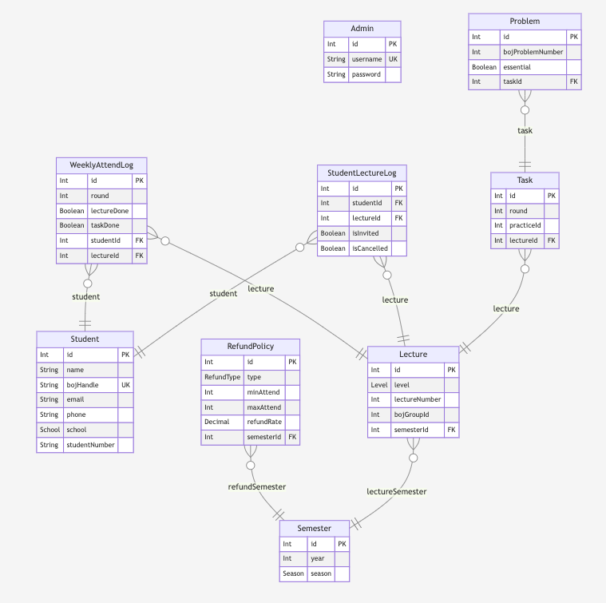
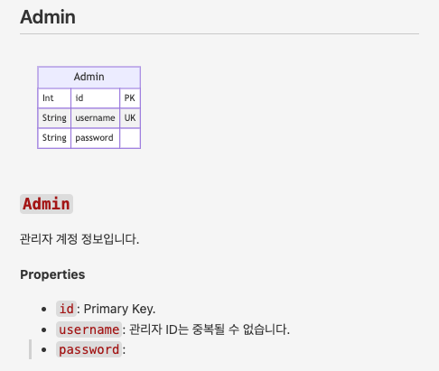
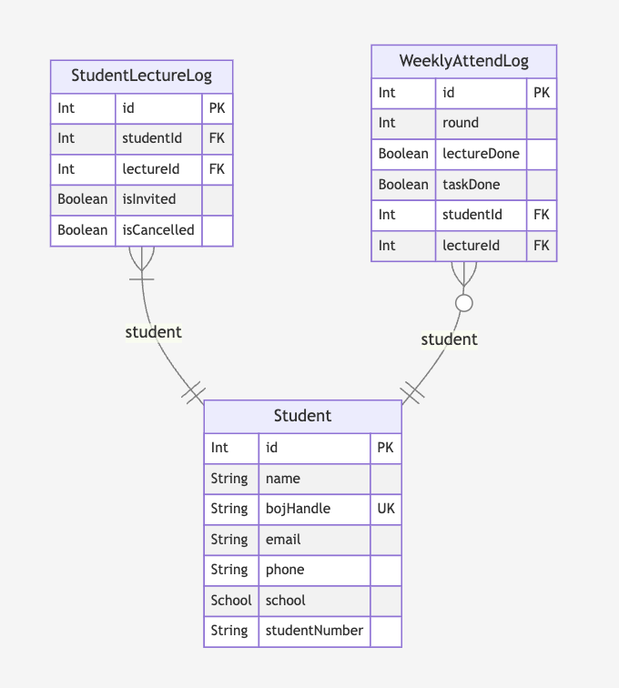

prisma-markdown을 프로젝트에 도입하게 된 배경을 설명하고 사용법을 간단히 정리하는 글이다.

# 1. prisma-markdown 소개

[라이브러리 제작자이신 samchon님이 직접 작성하신 글 "I made ERD and documents genertor of Prisma ORM"](https://dev.to/samchon/i-made-erd-and-documents-genertor-of-prisma-orm-4mgl?utm_source=oneoneone)

## 1.1. 도입 배경

[ICPC Sinchon](https://icpc-sinchon.io/)에서 진행하는 알고리즘 캠프의 출석 관리 시스템을 만들고 있다. 백엔드는 Prisma ORM과 NodeJS, express로 구축했다. DB 구조는 먼저 ERDCloud로 설계하고 Prisma Schema로 구현하였다. 많은 부분을 혼자 하고 있었기에 각각의 싱크가 조금 안 맞는 일이 생겨도 내가 거의 모든 맥락을 알고 있기에 큰 문제가 되지 않았다.

그런데 DB 설계가 많이 바뀌고 또 팀원들이 내가 하는 일과 완전히 분리되지 않은 코드를 건드리게 되면서 문제가 조금씩 생겼다. ERDCloud에서 변경된 부분이 아직 Prisma Schema에 반영되지 않은 경우도 많았고 문제가 있어서 급하게 Prisma Schema를 수정했는데 ERDCloud에 반영하는 걸 깜빡했다든가 하는 일도 생겼다.

또한 설계가 바뀌었다 해도 이 의도나 변경 사항을 모두에게 전달하기가 쉽지 않았다. 문서를 만들 수도 있었지만 Prisma Schema와 ERDCloud로 이미 정보가 나뉘어 있고 지금도 동기화가 힘든 상태에서 문서가 하나 더 생긴다고 해서 뭔가 좋아질 거 같지 않았다.

그런데 [samchon](https://github.com/samchon)님이 만드신 라이브러리 중에 Prisma의 자동 마크다운 문서 생성기 [prisma-markdown](https://github.com/samchon/prisma-markdown)이 있다는 걸 오픈채팅방에서 다른 분들의 대화를 듣던 중 마침 알게 되었다. 깃헙 스타 수 등을 보았을 때 아주 많이 알려져 있는 라이브러리 같지는 않았다. 하지만 제작자가 워낙 유명한 분이시고 지금 하고 있는 프로젝트가 문서에서 뭔가 약간 잘못된다 한들 크게 문제가 될 만한 프로젝트도 아니기에 써보기로 했다.

## 1.2. 사용 소감

글의 이후 부분에서는 꽤 길게 사용법을 정리했다. 하지만 소개글을 쓰기 위해 걸린 시간이 훨씬 더 길 정도로 prisma-markdown은 배우기도 쉽고 적용도 빠르다.

물론 어떤 라이브러리나 그렇듯이 기능을 제대로 이해하고 문서를 작성하기 위해서는 예시들도 뜯어보고 시간을 좀 들여야 할 것이다. 하지만 그렇게 큰 모델이 아닌 상황에서 간단한 시각화만 필요하다면 설치하고 적용하는 데에 정말 1분이면 충분하다. 라이브러리를 npm으로 깔고, 스키마 파일에 제너레이터를 복붙하고, `npx prisma generate` 명령을 실행하면 끝이기 때문이다. 사용자 커스텀 기능이 많은 라이브러리는 아니지만 섹션을 나누는 등 약간의 커스텀이 필요하다고 해도 공식 문서를 보면서 하면 금방 끝날 것이다.

그에 비해서 장점은 크다고 생각한다. 필요한 문서 형식이 있거나, 도메인에 관한 아주 자세한 설명이 필요하거나 혹은 실제 제품 출시를 위한 아주 큰 모델이라면 커스텀 기능은 상대적으로 적고 생성되는 문서 형식도 정해져 있기 때문에 다른 라이브러리를 찾아보는 게 좋을 수도 있겠다. 하지만 DB 규모가 그렇게 크지 않은 많은 프로젝트에서 prisma-markdown은 정말 유용하다.

먼저 문서 형식을 따로 만들 필요 없이 그냥 `///` 으로 시작하는 주석만 적당히 달아주면 된다. 그리고 이후 prisma 스키마 파일을 수정할 때도 문서를 따로 열어서 수정할 필요가 없어진다. 주석만 수정한 후, 스키마 변경사항을 반영하기 위해서 어차피 실행해야 할 `npx prisma generate` 명령을 실행하면 문서가 자동으로 업데이트된다. devDependency로 들어가기 때문에 번들 크기를 늘리는 것도 아니고 실행 속도도 아주 빠르다.

나는 프론트 개발자이긴 하지만 작은 프로젝트를 하다 보면 백엔드나 DB 테이블 구조를 조금은 보게 될 때가 많다. 하지만 문서와 실제 테이블 구조의 싱크를 잘 맞추기가 생각보다 어렵다. 그러니 만약 프로젝트에서 prisma를 쓴다면 prisma-markdown을 쓰는 게 좋을 것 같다.

# 2. 설치와 세팅

이 글은 prisma와 prisma/client 등은 깔려 있고 스키마도 세팅되어 있다고 가정한다. [나는 이전 글에서 서버를 구성하면서 prisma를 설치하고 스키마를 작성하는 작업까지 해놓았다.](https://witch.work/posts/project-backend-gcp-deploy#3-nodejs-%EC%84%9C%EB%B2%84-%EA%B5%AC%EC%84%B1) 다만 저 글에는 달랑 학생 스키마 하나뿐이지만 실제 스키마는 좀더 복잡했다. 이후 글에서는 실제 스키마를 사용할 것이다. 중요한 것은 prisma-markdown이므로 스키마 구조를 하나하나 설명하지는 않을 예정이다.

[prisma-markdown 공식 README의 설명](https://github.com/samchon/prisma-markdown)이 워낙 친절해서 어려울 게 없었다. 먼저 prisma-markdown을 설치한다.

```bash
npm i -D prisma-markdown
```

그리고 schema.prisma 파일에 다음과 같이 제너레이터를 추가한다. 이 제너레이터는 `prisma generate` 명령을 실행했을 때 생성되는 애셋을 결정해 주는데, 이 경우에는 markdown 파일을 생성해 주는 제너레이터이다.

```prisma
generator markdown {
  provider = "prisma-markdown"
  output   = "./ERD.md"
  title    = "Sinchon ICPC Camp ERD"
}
```

이렇게 하고 나서 `npx prisma generate` 명령을 실행하면 `prisma/ERD.md` 파일이 생성된다. 이 파일을 열어보면 다음과 같이 테이블 구조를 적당히 만들어서 보여주는 mermaid 코드와 그 밑에 각 테이블의 속성을 나열한 것을 볼 수 있다.

그런데 이를 vscode로 열어보면 mermaid 다이어그램이 제대로 보이지 않는다. 이를 보기 위해서는 [Markdown Preview Mermaid Support](https://marketplace.visualstudio.com/items?itemName=bierner.markdown-mermaid) 익스텐션을 깔아야 한다. 아마 다른 에디터에서도 플러그인이 존재할 것이다.

이렇게 플러그인을 깔고 `prisma/ERD.md`를 미리보기로 열면 mermaid 다이어그램을 볼 수 있다.



# 3. 설명 작성

이렇게 테이블 구조를 보여주는 기능만 있어도 ERDCloud의 필요성이 훨씬 줄어든다고 생각한다. 하지만 더 나아가서 각 테이블을 분류하고 체계화할 수 있는 기능이 있으면 더 좋을 것이다. 만약 몇백 개의 모델이 있는 큰 DB구조라면 시각화를 위해서는 나누는 게 당연히 좋기 때문이다.

따라서 prisma-markdown은 `@namespace`, `@erd` 등을 이용해서 문서 상에서 테이블들을 여러 섹션으로 분류할 수 있는 기능을 제공한다.

## 3.1. @namespace

`/// @namespace {이름}`으로 주석을 달면 넣어준 이름으로 섹션을 만들어 준다. 그리고 그 주석을 단 모델들이 그 섹션 하에 들어가게 된다. 물론 하나의 모델이 namespace 하나에만 속할 수 있는 건 아니고 여러 섹션에 속할 수도 있다. 그냥 여러 이름으로 `@namespace` 주석을 달아주면 된다. 반대로 `@namespace` 주석이 없는 모델은 "default" 섹션에 들어가게 된다.

예를 들어 다음과 같이 섹션을 만들 수 있다. 관리자 계정의 고유ID와 유저네임, 비밀번호를 가진 매우 간단한 모델이다.

```prisma
/// 관리자 계정 정보입니다.
///
/// @namespace Admin
model Admin {
  /// Primary Key.
  id       Int    @id @default(autoincrement())
  /// 관리자 ID는 중복될 수 없습니다.
  username String @db.VarChar(255) @unique
  password String @db.VarChar(255)
}
```

이렇게 하면 prisma 문서 상에서 `Admin` 섹션에 `Admin` 모델이 들어가게 된다.



## 3.2. @erd

어떤 테이블은 다른 테이블과의 연결 관계를 보여주기 위해 해당 섹션에 속해야 하지만 자세한 설명은 필요 없을 수도 있다. 예를 들어 과제를 보여주는 Task 섹션을 두는 걸 생각해볼 수 있는데, 이 모델들을 시각화할 때는 해당 과제가 어떤 강의에 속해 있는지 강의 테이블과의 연관성을 보여주는 게 좋다고 생각한다. 하지만 Task 섹션에서 이를 설명할 필요는 없다.

그러면 다음과 같이 `/// @erd {네임스페이스 이름}` 주석을 달아주면 된다. 주의할 점은 `@erd` 뒤에 쓰인 네임스페이스는 다른 모델에서 `@namespace`로 선언된 네임스페이스로 존재해야 한다. 만약 사용한 네임스페이스 이름이 `@erd`에만 쓰였다면 해당 네임스페이스는 ERD 다이어그램만 그려지는 게 아니라 아예 제대로 만들어지지 않는다.

```prisma
/// 강의 정보
///
/// 각 강의는 특정 연도의 특정 학기 소속
///
/// 한 학기에 다양한 난이도의 강의가 있을 수 있음
///
/// @namespace Lectures
/// @erd Task
model Lecture {
  id               Int                @id @default(autoincrement())
  level            Level             @default(Novice)
  // 강의의 총 회차수
  lectureNumber      Int                @default(10)
  bojGroupId     Int
  lectureSemester Semester @relation(fields: [semesterId], references: [id], onDelete: Cascade)
  semesterId      Int
  studentLectureLog StudentLectureLog[]
  weeklyAttendLog WeeklyAttendLog[]
  task             Task[]

  @@index([semesterId], map: "semesterId")
}

/// 강의의 과제 정보
/// 각 강의마다 여러 개의 과제가 존재할 수 있음
/// 연결된 강의의 BOJ 그룹의 특정 연습 ID를 가지고 있음
/// @namespace Task
model Task {
  id               Int                @id @default(autoincrement())
  round            Int
  practiceId      Int
  lecture          Lecture @relation(fields: [lectureId], references: [id], onDelete: Cascade)
  lectureId       Int
  problems Problem[]

  @@index([lectureId], map: "lectureId")
}

/// 강의의 과제에 포함된 문제 정보
///
/// 각 과제마다 여러 개의 문제가 존재할 수 있음
///
/// BOJ 문제 번호와 필수 여부를 가지고 있음
///
/// @namespace Task
model Problem {
  id               Int                @id @default(autoincrement())
  bojProblemNumber       Int
  essential       Boolean @default(true)
  task             Task @relation(fields: [taskId], references: [id], onDelete: Cascade)
  taskId          Int

  @@index([taskId], map: "taskId")
}
```

## 3.3 @describe

`@describe`는 `@erd`와는 반대로 ERD 다이어그램에는 나타나지 않지만 문서에만 나타나는 설명을 달아줄 수 있다. 이는 단순히 설명뿐이라 그런지 `@namespace`로 만들어 주지 않은 네임스페이스 이름을 사용해도 변환이 된다. 물론 `@namespace`로 만들어 주지 않은 네임스페이스에 설명만 달아놓는 게 좋지는 않을 걸로 보인다.

## 3.4. @hidden

`@hidden`은 해당 모델을 아예 문서에 나타나지 않게 할 수 있다. ERD 다이어그램에도 나타나지 않고 설명도 없는 것이다. 이후 확장을 위해 미리 만들어 놓았지만 현재는 쓰이지 않고 있는 테이블이라던가, 테스트를 위해 만들어 놓은 테이블이라던가 할 때 쓸 수 있을 듯 하다.

## 3.5. @minItems 1

1:N 관계를 만들 때 N이 반드시 1 이상이어야 하는 경우가 있을 수 있다. 예를 들어서 DB에 들어 있는 학생은 반드시 하나 이상의 수강신청 내역을 가지고 있어야 한다든지 하는 식이다. 수강신청 내역이 없는 학생은 DB에서 관리할 필요가 없을 수 있으므로 이런 경우는 충분히 있을 수 있다.

그런 것을 다이어그램에서 나타낼 수 있도록 해주는 게 바로 `@minItems 1`이다. Prisma에서는 1:N 관계를 만들 때 1이 되는 모델 쪽에 N 쪽 모델이 배열 비슷하게 들어가 있게 되는데, 이 배열 속성에 `/// @minItems 1` 주석을 달아주면 prisma-markdown이 생성하는 다이어그램에 표시된다.

예를 들어 다음과 같이 `Student` 모델과 학생의 수강신청 내역을 나타내는 `StudentLectureLog` 모델이 1:N 관계라고 하자. 학생은 반드시 수강신청 내역을 가지고 있어야 하는 상황이다. 그러면 `Student` 모델에 `studentLectureLog` 속성에 `@minItems 1` 주석을 달아주면 된다.

```prisma
model Student {
  id               Int                @id @default(autoincrement())
  name             String             @db.VarChar(50)
  bojHandle       String             @db.VarChar(50) @unique
  email            String
  phone            String             @db.VarChar(20)
  school           School             @default(SOGANG)
  studentNumber   String             @db.VarChar(20) // 학번
  /// @minItems 1
  studentLectureLog StudentLectureLog[]
  weeklyAttendLog WeeklyAttendLog[]
}
```

그럼 다이어그램에 `Student` 모델과 `StudentLectureLog` 모델 사이의 관계 표현에서 학생은 반드시 하나의 수강신청 내역을 가지고 있어야 한다는 게 표시된다.



## 3.6. @link

모델이나 키에 직접적으로 관련된 건 아니지만 문서 중간중간 `{@link <링크할 모델명> (<링크 텍스트>)>}`(링크 텍스트를 생략할 시 테이블명으로 링크가 걸린다)으로 다른 모델로의 링크를 걸 수 있다. 아마 GitHub에서 마크다운을 처리할 때 제목들 근처에 자동으로 id가 들어간 `<a>`태그를 걸어 주는데([GitHub Flavored Markdown](https://github.github.com/gfm/)이라고 하며 remark-gfm 등의 도구로 로컬에서 변환도 가능하다) 추측이지만 이걸 이용하는 듯 하다. 

예를 들어 `StudentLectureLog` 모델이 `Student` 모델과 `Lecture` 모델을 연결해 주는 역할이라고 하자. 이때 각 모델의 문서로 링크를 걸고 싶다면 다음과 같이 하면 된다. 모델의 속성명도 명시할 수 있는데 그렇게 할 경우 모델 쪽으로 링크가 연결된다.

```prisma
/// 각 학생의 수강 신청 내역을 저장한다
///
/// {@link Student}와 {@link Lecture}를 연결하는 중간 테이블
/// {@link Student.studentLectureLog} 속성으로 연결된다.
model StudentLectureLog {
  id         Int     @id @default(autoincrement())
  studentId Int
  lectureId Int
  student    Student @relation(fields: [studentId], references: [id], onDelete: Cascade)
  lecture    Lecture @relation(fields: [lectureId], references: [id], onDelete: Cascade)
  isInvited Boolean @default(false)
  isCancelled Boolean @default(false)

  @@index([lectureId], map: "lectureId")
  @@index([studentId], map: "studentId")
}
```

모델명을 그대로 쓰지 않고 링크에 표시될 텍스트를 따로 쓰고 싶다면 모델명 다음에 바로 쓰면 된다. 다음은 `StudentLectureLog` 모델로 향하는 링크에 "수강신청 내역 모델"이라는 텍스트를 붙인 것이다.

```prisma
/// {@link StudentLectureLog 수강신청 내역 모델}로 수강신청을 관리한다
model Student {
  // ...
}
```

공식 README에는 없고 예시 문서를 보다가 발견한 내용이기에 사라질 수도 있지만, 예시에 상당히 많이 등장하는 걸로 봐서는 공식에 가까운 기능으로 생각된다.

# 4. 마크다운 문법 사용

table이나 list같은 마크다운 문법도 사용 가능하다. [공식 예시](https://github.com/samchon/prisma-markdown/blob/master/schema.prisma)를 보면 다음과 같이 표나 리스트를 사용하는 예시가 있고 [변환 결과](https://github.com/samchon/prisma-markdown/blob/master/ERD.md)에도 예쁘게 변환된 것을 볼 수 있다.

```prisma
/// 
/// Product | Section (corner) | Categories
/// --------|------------------|--------------------------------------
/// Beef  | Butcher corner   | Frozen food, Meat, **Favorite food**
/// Grape   | Fruit corner   | Fresh food, **Favorite food**
/// 
/// In addition, as `shopping_channel_categories` has 1:N self recursive 
/// relationship, it is possible to express below hierarchical structures. 
/// Thus, each channel can set their own category classification as they want.
///
///   - Food > Meat > Frozen
///   - Electronics > Notebook > 15 inches
///   - Miscellaneous > Wallet
/// 
```

# 참고

prisma Generators 문서

https://www.prisma.io/docs/orm/prisma-schema/overview/generators

221006_Mermaid를 이용한 Markdown 작성

https://velog.io/@brown_eyed87/221006Mermaid%EB%A5%BC-%EC%9D%B4%EC%9A%A9%ED%95%9C-Markdown-%EC%9E%91%EC%84%B1

Prisma ORM의 ERD 및 문서 생성기를 만들었습니다.

https://oneoneone.kr/content/940dc121

prisma-markdown의 공식 README와 연결된 링크들

https://github.com/samchon/prisma-markdown