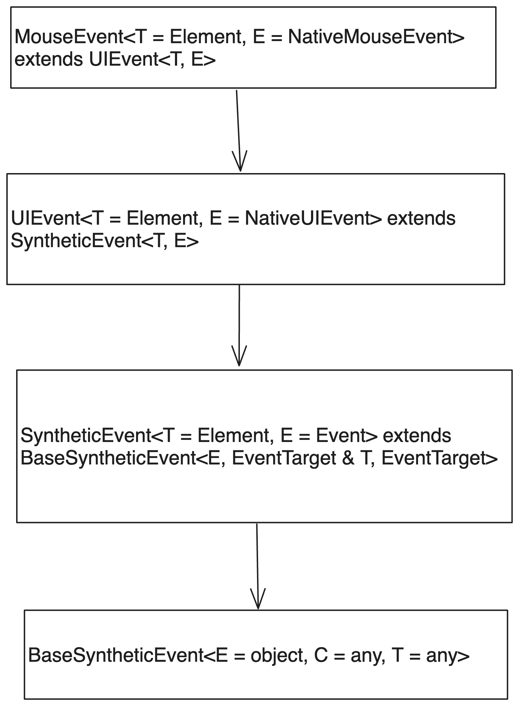

# 1. event.target vs event.currentTarget

## 1.1. event.target

리액트에서 이벤트의 `target` 속성을 사용하는 일은 매우 흔하다. 이벤트가 발생한 객체에 대한 참조가 `event.target`에 담겨 있기 때문이다. 다음 코드의 경우 화면의 `hi`를 클릭 시 클릭이 발생한 객체의 `innerText` 즉 `hi`를 가져와서 로그를 찍는다.

```jsx
export function App(props) {
  const handleClick=(e)=>{console.log(e.target.innerText)}

  return (
    <div className='App'>
      <div onClick={handleClick}>hi</div>
    </div>
  );
}
```

## 1.2. vs event.currentTarget

여기서 위의 `handleClick` 함수를 다음과 같이 바꾸면 어떨까?

```jsx
const handleClick=(e)=>{console.log(e.currentTarget.innerText)}
```

여전히 똑같은 동작을 한다. hi를 클릭하면 hi가 콘솔에 찍힌다. 그럼 이 둘의 차이는 무엇일까?

`event.target`은 이벤트가 발생한 객체를 가리킨다. 그리고 `event.currentTarget`은 이벤트 핸들러가 부착된 객체를 가리킨다. 이 둘은 다를 수도 있고 같을 수도 있다. 위의 예제에서는 같았지만 다음과 같은 예제를 보면 다르다는 것을 알 수 있다.

```jsx
export function App(props) {
  const handleClick=(e)=>{
    console.log("target 텍스트", e.target.innerText);
    console.log("currentTarget 텍스트", e.currentTarget.innerText);
  }
  return (
    <div onClick={handleClick}>
      부모 요소
      <div>자식 요소</div>
    </div>
  );
}
```

위 예제를 실행하고 조작해 보면 다음과 같은 결과가 나온다.

```
자식 요소 클릭 시
> target 텍스트 자식 요소
> currentTarget 텍스트 부모 요소 자식 요소

부모 요소 클릭 시
> target 텍스트 부모 요소 자식 요소
> currentTarget 텍스트 부모 요소 자식 요소
```

`target`은 정확히 클릭한 요소를 가리킨다. 자식 요소를 클릭 시 딱 자식 요소를 가리켜 거기의 `innerText`를 가져왔고 부모 요소를 클릭시 부모 요소를 가리켜서 부모 요소의 `innerText`를 가져왔다.

반면 `currentTarget`은 이벤트 핸들러가 부착된 요소를 가리켰다. 자식 요소를 클릭하든 부모 요소를 클릭하든 해당 이벤트를 제어하는 이벤트 핸들러가 부착된 바로 그 요소, 여기서는 부모 요소를 가리켰고 해당 요소의 `innerText`를 가져왔다.

# 2. 타입스크립트와 함께

그런데 여기에 타입스크립트가 끼면 문제가 더 복잡해진다. 예를 들어 맨 앞에서 보았던 간단한 예제를 타입스크립트로 재현해 보자. 다음과 같이 해볼 수 있다. `handleClick`을 `MouseEventHandler`로 타이핑할 수도 있지만 결과는 똑같다.

```tsx
export function App(props) {
  const handleClick = (e: React.MouseEvent<HTMLDivElement>) => {
    // 에러 : Property 'innerText' does not exist on type 'EventTarget'.
    console.log(e.target.innerText); 
  };

  return (
    <div className='App'>
      <div onClick={handleClick}>hi</div>
    </div>
  );
}
```

하지만 이렇게 하면 위의 주석에도 적어놓았듯이 에러가 발생한다! `EventTarget`에는 `innerText`같은 프로퍼티가 없다고 한다. 이는 결론부터 이야기하면 여기서는 `e.target`이 `EventTarget` 타입으로 정의되어 있기 때문이다. 왜 이런 문제가 발생할까? 그리고 어떻게 해야 할까?

## 2.1. 문제의 원인

`React.MouseEvent<T>`의 정의를 따라가 보면 타입이 다음과 같은 위계를 가지고 있다.



그리고 제일 기본 타입인 `BaseSyntheticEvent`를 보면 이렇게 정의되어 있다.

```ts
interface BaseSyntheticEvent<E = object, C = any, T = any> {
    nativeEvent: E;
    currentTarget: C;
    target: T;
    bubbles: boolean;
    cancelable: boolean;
    defaultPrevented: boolean;
    eventPhase: number;
    isTrusted: boolean;
    preventDefault(): void;
    isDefaultPrevented(): boolean;
    stopPropagation(): void;
    isPropagationStopped(): boolean;
    persist(): void;
    timeStamp: number;
    type: string;
}
```

많은 이벤트의 기본 타입인 `BaseSyntheticEvent`의 target은 `T` 제네릭 타입으로 정의되어 있다. 그리고 이를 래핑하는 `SyntheticEvent`타입에서는 `BaseSyntheticEvent`의 `T`를 `EventTarget`으로 제한한다. 리액트에서 모든 이벤트 타입은 `SyntheticEvent`를 상속하고 있으므로 리액트의 이벤트 타입들은 `target`이 `EventTarget` 타입으로 제한되어 있다.

```ts
interface SyntheticEvent<T = Element, E = Event> extends BaseSyntheticEvent<E, EventTarget & T, EventTarget> {}
```

반면 `currentTarget`은 `C` 제네릭 타입으로 정의되어 있는데 이는 `SyntheticEvent`를 보면 `EventTarget & T`로 정의되어 있어서 참조하고 있는 요소의 프로퍼티도 사용할 수 있게 되어 있다. 

## 2.2. 왜 이렇게 되었을까?

원인은 `SyntheticEvent`타입 정의의 주석에 있는 링크를 보면 알 수 있다. 주석과 타입 정의를 옮기면 다음과 같다.

```ts
/**
 * currentTarget - a reference to the element on which the event listener is registered.
 *
 * target - a reference to the element from which the event was originally dispatched.
 * This might be a child element to the element on which the event listener is registered.
 * If you thought this should be `EventTarget & T`, see https://github.com/DefinitelyTyped/DefinitelyTyped/issues/11508#issuecomment-256045682
 */
interface SyntheticEvent<T = Element, E = Event> extends BaseSyntheticEvent<E, EventTarget & T, EventTarget> {}
```

그리고 주석에 링크를 타고 들어가면 다음과 같은 설명이 있다.

```
You cannot always tell target's type at compile time. Making it generic is of little value.
target is the origin of the event (which no one really cares about, it might be a span inside a link, for example)
currentTarget is the element that has the event handler attached to, which you should very much care about and type accordingly if you attached a dataset or other attributes to it, and intend to access at runtime.

Relying on target instead of currentTarget is a beginner's mistake that will bite them sooner than latter.
```

요약하면 `target`은 우리가 위에서 본 것과 같이 이벤트가 일어난 바로 그 요소에 대한 참조인데 해당 요소에 대한 타입은 컴파일 타임에 정확히 확정할 수 없다는 얘기다.

이벤트 핸들러는 부모 요소에 부착되어 있는데 이벤트가 일어난 정확한 요소는 자식 요소일 수도 있지 않은가? 이런 상황에서 이벤트 핸들러 입장에서는 `target`의 타입을 확정할 수 없다.

예시를 들어 보자. 약간은 억지스런 코드일 수도 있지만 폼을 클릭하면 유효성 검사를 진행하도록 하고 싶다고 하자. 그러면 다음과 같은 코드를 작성할 수 있다.

```tsx
function App() {
  const handleClick = (e: React.MouseEvent<HTMLFormElement>) => {
    if (e.currentTarget.checkValidity()) {
      console.log("유효성 검사 통과");
    } else {
      console.log("유효성 검사 실패");
    }
  };

  return (
    <div className='App'>
      <form onClick={handleClick}>
        <h1>간단한 설문조사</h1>
        <input type='text' required />
        <button type='submit'>제출</button>
      </form>
    </div>
  );
}
```

이벤트 핸들러가 부착된 요소는 form 요소이므로 언제나 `e.currentTarget`은 form 요소이다. 그렇기 때문에 `currentTarget` 타입에 `checkValidity` 메서드를 사용해 클릭 시마다 유효성 검사를 할 수 있다.

하지만 `e.target`의 경우에는 어떨까? 런타임에 유저가 어디를 클릭해서 이벤트를 발생시킬지는 TS 컴파일러 입장에서 알 수 없다. 제목인 `<h1>`태그를 클릭할 수도 있고 제출 버튼을 클릭할 수도 있다. 그러면 `e.target`은 `HTMLHeadingElement`나 `HTMLButtonElement`가 된다. 이런 여러 가능성들이 있기 때문에 `e.target`의 타입은 컴파일 타임에 확정할 수 없다.

따라서 TS에서는 컴파일 타임에 타입을 확정할 수 있는 '이벤트 핸들러가 부착된 요소에 대한 참조'인 `currentTarget`을 통해서만 요소를 제어할 수 있도록 타입을 정의한 것이다.

## 2.3. 해결 방법

사실 해결 방법은 간단하다. 일단 당연히 위에서 말했듯이 컴파일 타임에 타입을 확정할 수 있는, 이벤트 핸들러가 부착된 바로 그 요소인 `currentTarget`을 사용하면 된다. 해당 PR 코멘트에서도 이를 권장하고 있고 타입 정의를 볼 때 이게 더 안전하기도 하다.

하지만 만약 어떤 이유로 이벤트가 발생한 바로 그 요소에 접근하고 싶어서 `target`을 사용하고 싶다면 `as`를 사용해서 타입을 강제로 지정해 주면 된다. 물론 `EventTarget`에 정의되어 있는 `addEventListener` 등을 사용하고 싶은 거라면 `as`를 안 써도 된다.

```tsx
export function App(props) {
  const handleClick = (e: React.MouseEvent<HTMLDivElement>) => {
    console.log((e.target as HTMLDivElement).innerText);
  };

  return (
    <div className='App'>
      <div onClick={handleClick}>hi</div>
    </div>
  );
}
```

# 3. 예외와 이유

`e.target`은 `EventTarget`타입으로 정의되어 이벤트가 발생한 요소의 속성을 제대로 사용할 수 없다고 했었다. 그런데 다음과 같은 코드는 잘 동작한다. `target`에 접근해서 분명 `EventTarget`타입에는 존재하지 않는 `value`라는 속성을 사용하고 있다!

```tsx
function App() {
  const [value, setValue] = useState("");

  const handleChange = (e: React.ChangeEvent<HTMLInputElement>) => {
    setValue(e.target.value);
  };

  return (
    <div className='App'>
      <input value={value} onChange={handleChange} />
    </div>
  );
}
```

이는 몇몇 이벤트 타입에서 `target`의 타입을 재정의해주고 있기 때문이다. 예를 들어 `ChangeEvent`의 경우 이렇게 정의되어 있다.

```ts
interface ChangeEvent<T = Element> extends SyntheticEvent<T> {
    target: EventTarget & T;
}
```

그리고 해당 이벤트를 받는 이벤트 핸들러가 `ChangeEventHandler`로 따로 정의되어 있으며 이는 `<input>`, `<select>`, `<textarea>`의 onChange 속성의 타입에 사용된다.

따라서 `event`가 `ChangeEvent` 타입이라고 할 때 `event.target`은 이벤트가 발생한 바로 그 요소의 타입을 포함하게 된다. 그래서 위의 예제에서는 `event.target`이 `EventTarget & HTMLInputElement` 타입이 되어 `value` 속성을 사용할 수 있게 된 것이다.

이외에도 `FocusEvent`이벤트 등이 `e.target`의 타입을 재정의해주고 있고 이런 이벤트 타입들에서는 `e.target`을 사용해서 이벤트 타깃에 접근해도 타입 에러가 발생하지 않는다. 이벤트가 발생한 정확한 그 객체 타입을 확정할 수 있는 객체를 어떤 기준으로든 분류해서 이렇게 해놓은 듯 하다.

# 4. 결론

특별한 이유가 없다면 이벤트 핸들러는 해당 이벤트에 대해 대응하고 싶은 바로 그 요소에 부착하게 된다. A 요소의 클릭 이벤트에 대응하고 싶은데 굳이 A 요소의 부모 요소에 이벤트 핸들러를 붙일 이유는 없기 때문이다.

따라서 이왕이면 `currentTarget`을 사용하자.

# 참고

https://developer.mozilla.org/en-US/docs/Web/API/Event/target

https://developer.mozilla.org/en-US/docs/Web/API/Event/currentTarget

https://velog.io/@edie_ko/JavaScript-event-target%EA%B3%BC-currentTarget%EC%9D%98-%EC%B0%A8%EC%9D%B4%EC%A0%90

https://handhand.tistory.com/287

https://github.com/DefinitelyTyped/DefinitelyTyped/issues/11508