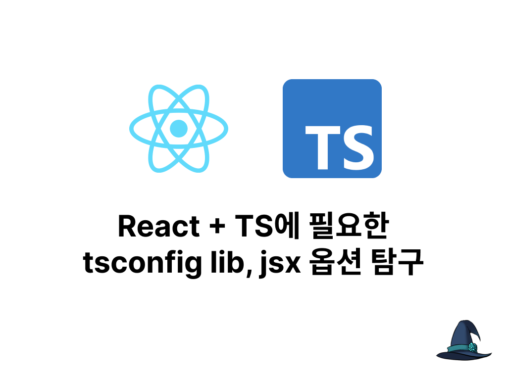

React 문서를 보다가 tsconfig.json의 `lib`과 `jsx` 설정에 관한 내용이 있었다. 두 가지 속성에 관해 파헤쳐 보았다.

# 1. React에 필요한 tsconfig 설정

React와 TypeScript를 함께 사용하는 건 아주 흔한 일이다. React 공식 문서에도 ["TypeScript 사용하기"](https://react.dev/learn/typescript)라는 문서가 있다.

이중 ["기존 React 프로젝트에 TypeScript 추가하기"](https://react.dev/learn/typescript#adding-typescript-to-an-existing-react-project)에 따르면 기존 프로젝트에 TypeScript를 추가하는 과정은 다음과 같다.

먼저 `@types/react`와 `@types/react-dom`을 설치하라고 한다. 리액트는 공식 타입이 없고 `DefinitelyTyped`라는 타입 정의 저장소를 통해 타입을 제공한다는 점을 알고 있었기에 이해가 갔다.

문제는 다음에 나오는 `tsconfig.json` 설정이었다. 필요한 설정은 다음과 같다.

> 1. dom은 lib에 포함되어야 합니다(주의: lib 옵션이 지정되지 않으면, 기본적으로 dom이 포함됩니다).
> 2. jsx를 유효한 옵션 중 하나로 설정해야 합니다. 대부분의 애플리케이션에서는 preserve로 충분합니다. 라이브러리를 게시하는 경우 어떤 값을 선택해야 하는지 jsx 설명서를 참조하세요.

처음 보는 옵션들이라 무슨 뜻인지 몰라서 조사해보았다. 요약하면 다음과 같다.

- `lib` 옵션은 타입스크립트 컴파일러가 사용할 타입 정의 파일을 지정하는 옵션이다. `"dom"`을 추가하면 브라우저 DOM의 타입 정의 파일을 포함한다.
- `jsx` 옵션은 JSX 구조가 어떻게 JS 파일로 변환되는지를 설정하는 옵션이다. 대부분의 애플리케이션에서는 `preserve`로 충분하다.

이제 각 옵션에 대해 자세히 알아본다.

# 2. tsconfig - lib 옵션

tsconfig.json의 lib 옵션은 타입스크립트 컴파일러가 사용할 타입 정의 파일을 지정하는 옵션이다.

예를 들어 `create-next-app`으로 생성한 프로젝트의 `tsconfig.json`을 가보면 다음과 같이 `lib`이 정의되어 있다.

```json
{
  "compilerOptions": {
    "lib": [
      "dom",
      "dom.iterable",
      "esnext"
    ],
    // ...
  }
}
```

이게 무슨 뜻인지 좀 더 자세히 알아보자.

## 2.1. lib.d.ts

타입스크립트는 기본적으로 `Array` 같은 JS 내장 객체나 브라우저 환경에 있는 `document`와 같은 것들의 타입 정의를 포함한다.

그럼 그 타입 정의들은 어디에 있을까? 타입스크립트를 설치하면 따라오는 `node_modules/typescript/lib` 폴더의 `lib.d.ts`라는 파일에 있다. 이는 타입스크립트가 컴파일될 때 자동으로 추가되는 파일이다.

해당 파일에 들어가 보면 [트리플 슬래시 지시자](https://www.typescriptlang.org/ko/docs/handbook/triple-slash-directives.html)를 통해서 내장 라이브러리 파일들을 포함하고 있는 걸 볼 수 있다. 이러한 `///`는 파일 맨 위에 위치할 때 컴파일러에게 컴파일에 도움이 될 만한 정보를 제공하는 데 사용된다.

```ts
// lib.d.ts
/// <reference no-default-lib="true"/>

/// <reference lib="es5" />
/// <reference lib="dom" />
/// <reference lib="webworker.importscripts" />
/// <reference lib="scripthost" />
```

위 파일에서는 `node_modules/typescript/lib` 폴더에 있는 다른 타입 정의 파일들 중 사용할 파일들을 명시하고 있다. 이때 다른 타입 정의 파일들은 JavaScript의 특정 버전의 기능에 대한 타입 정의를 포함하고 있다. ES2015의 심볼과 관련된 타입들은 `es2015.symbol.d.ts`에 정의되어 있는 식이다.

이때 추가되는 파일들은 타입스크립트 컴파일 과정에서 (`--noLib` 옵션을 사용하지 않는다면) 자동으로 추가된다. `lib`은 여기에 영향을 주는 옵션 중 하나이다. tsc가 파일을 로드하는 과정은 [tsconfig.json의 lib](https://norux.me/59)에서 더 자세히 볼 수 있다.

## 2.2. lib.d.ts 설정하기

`lib.d.ts`에 포함될 타입 정의 파일에 영향을 미치는 옵션들은 `lib` 말고도 몇 가지 있다. 이를 모두 알아보자.

### 2.2.1. target 옵션

앞서 `lib` 옵션에 의해 `lib.d.ts`에 포함될 타입 정의 파일을 지정할 수 있다고 했지만 사실 `target`이 더 우선적이다. `target`은 타입스크립트 컴파일 시 어떤 버전의 JavaScript로 컴파일될지를 결정하며, 따라서 사용할 수 있는 타입에 영향을 준다.

예를 들어 `target`이 `"es6"`보다 낮은 버전일 경우 es6의 기능인 `Map`과 `Set` 같은 타입 정의 파일은 포함되지 않는다. 애초에 컴파일 시에 `Map`과 `Set`을 사용할 수 없기 때문이다.

즉 기본적으로는 `lib.d.ts`에 어떤 내장 타입 정의 파일이 포함될지는 기본적으로 `tsconfig.json`의 `target` 옵션에 따라 달라진다.

Node 등 특정 플랫폼이나 프레임워크에서는 `target` 옵션에 지정해야 하는 최소 버전이 있을 수 있다. 해당 플랫폼이 사용하는 버전과 타입이 있기 때문이다. 예를 들어 Next.js에서는 `"esnext"`를 사용하는 것이 권장된다. 다른 곳에서 요구하는 타입들은 [tsconfig/bases](https://github.com/tsconfig/bases?tab=readme-ov-file#centralized-recommendations-for-tsconfig-bases) 레포지토리에서 확인할 수 있다.

### 2.2.2. lib 옵션

그런데 `target`옵션에 의해 정해진 내장 타입 정의 파일을 변경하고 싶을 수 있다. 예를 들어 내가 사용하고 있는 런타임은 ES5 버전이지만 `Promise`의 폴리필을 사용하고 있다면 ES6의 `Promise` 타입 정의를 사용할 수 있다면 편할 것이다. 이 경우 직접 `lib` 옵션을 사용해 타입 정의 파일에 포함시킬 타입 정의들을 결정할 수 있다.

[타입스크립트 문서의 lib 항목](https://www.typescriptlang.org/tsconfig/#lib)에 따르면 다음과 같은 경우에 `lib` 옵션 사용을 고려할 수 있다.

- 프로그램이 브라우저 환경에서 실행되지 않기 때문에 "dom" 타입 정의가 필요없는 경우
- 런타임 플랫폼이 폴리필을 통해 특정 JavaScript 객체를 제공하지만 해당 ECMAScript 버전의 전체 문법을 지원하지 않는 경우
- 더 높은 ECMAScript 버전의 폴리필이나 네이티브 구현이 있는 경우

앞서 언급한, `Promise`의 폴리필을 사용하고 있다면 `lib` 옵션을 이렇게 설정해 볼 수 있을 것이다.

```json
{
  "compilerOptions": {
    "lib": [
      "es5",
      "dom",
      "dom.iterable",
      "ES2015.Promise"
    ]
  }
}
```

제공되는 타입 정의 파일의 목록은 [타입스크립트 문서의 lib 항목](https://www.typescriptlang.org/tsconfig/#lib)에서 확인할 수 있다.

### 2.2.3. node_modules의 패키지

`target`과 `lib`은 tsconfig.json에 있는 옵션이니 당연히 타입 정의 파일에 영향을 미칠 수 있다. 그런데 node_modules의 패키지가 영향을 미치다니? 이건 타입 정의 파일을 따로 관리할 때를 위한 것이다.

지금까지의 흐름을 보면 다음과 같다. 어떤 버전의 JavaScript로 코드를 컴파일할지를 결정하는 `target`에 의해 기본적인 `lib.d.ts` 파일이 생성된다. 여기 포함할 타입 정의 파일을 직접 제어하려면 `lib` 옵션을 사용할 수 있다.

그런데 경우에 따라 이건 단점이 되거나 사용자에게 타입에 대한 충분한 제어를 제공하지 못할 수 있다. 타입스크립트의 내장 타입 정의 파일을 사용해야 하기 때문이다.

만약 타입스크립트 버전을 꾸준히 업그레이드해야 하는 상황에서 DOM API 변경 등으로 인해 타입스크립트의 내장 타입 정의 파일이 breaking change를 일으키면 어떻게 할까? 혹은 프로젝트에 필요한 어떤 새로운 타입 정의를 개발자가 직접 내장 타입 정의 파일에 더해서, 혹은 따로 하고 있는 상태라면?

이 경우 tsconfig.json의 `lib` 옵션을 사용하는 것만으로는 충분하지 않다. 따라서 TypeScript 4.5부터는 npm 패키지를 통해서 타입 정의를 가져오는 기능이 추가되었다.

더 정확히는 타입스크립트 컴파일러가 `lib.d.ts`에 포함시킬 타입 정의 파일을 탐색할 때 `node_modules/@typescript/lib-*` 패키지를 먼저 찾아보게 된다. 여기에 사용할 타입 정의 파일을 넣으면 된다.

예를 들어 앞서 언급된 `dom` 타입 정의 파일을 찾는다면 먼저 `node_modules/@typescript/lib-dom`를 찾아보고 나서야 `lib.dom.d.ts`를 찾는 식이다.

특정 버전의 DOM API 타입 정의 파일을 사용하고 싶다면 이런 식으로 package.json의 의존성을 정의한다. `@typescript/lib-dom` 패키지를 설치하면 타입스크립트 컴파일러가 해당 패키지의 타입 정의 파일을 사용한다.

```json
{
 "dependencies": {
    "@typescript/lib-dom": "npm:@types/web"
  }
}
```

### 2.2.4. noLib 옵션

tsconfig.json에 `"noLib"` 옵션을 true로 설정하거나 커맨드라인에 `--noLib` 플래그를 명시하면 타입스크립트 컴파일 시 `lib.d.ts`가 추가되고 사용되는 걸 막을 수 있다. 이렇게 하면 `Array`를 비롯한 JS 내장 객체의 타입 정의들을 사용할 수 없다.

표준 브라우저 환경과 상당히 다른 어떤 커스텀 환경에서 작업하거나 하는 등의 이유로 `Array`, `Date`, `Map` 등의 내장 객체 그리고 객체 메서드들의 타입 정의를 직접 작성하고 싶을 경우 사용할 수 있다.

일반적으로는 `lib.d.ts`를 사용하므로 이 옵션을 사용할 경우 다른 사람들과 프로젝트 공유가 어려워지고 또한 다른 사람이 짠 코드를 사용하기도 어려워지기 때문에 권장되지 않는다.

## 2.3. lib 옵션과 react

지금까지 알아낸 걸 기억하면서 다시 돌아가면, 기존 프로젝트의 `tsconfig.json`에 `lib` 배열에 `"dom"`을 추가해야 하는 이유는 당연하다. react에서 브라우저 DOM을 사용하는데, 이 DOM API의 타입 정의를 `lib.d.ts`에 포함시켜야 하기 때문이다.

당장 [@types/react-dom의 타입 정의 파일 index.d.ts](https://github.com/DefinitelyTyped/DefinitelyTyped/blob/master/types/react-dom/index.d.ts)만 들어가봐도 `lib.dom.d.ts`에 정의된 타입들(예를 들면 `Element`)이 엄청나게 많이 쓰이고 있다.

# 3. tsconfig - jsx 옵션

> jsx를 유효한 옵션 중 하나로 설정해야 합니다. 대부분의 애플리케이션에서는 preserve로 충분합니다. 라이브러리를 게시하는 경우 어떤 값을 선택해야 하는지 jsx 설명서를 참조하세요. - React 공식 문서

이 설정은 JSX 구조가 어떻게 JS 파일로 변환되는지를 설정한다.

## 3.1. JSX

JSX는 JavaScript의 확장 문법으로, 렌더링 로직과 마크업이 함께 있는 코드를 작성할 수 있게 해준다. HTML과 비슷한 문법을 사용하면서도 JavaScript의 기능을 그대로 사용할 수 있어서 리액트에서 많이 사용된다.

하지만 JavaScript 엔진이 JSX를 바로 이해할 수는 없으므로, 실제로 코드가 실행될 때는 JavaScript로 변환되어야 한다. 이때 JSX를 변환하는 걸 어떤 방식으로 진행할지를 설정하는 게 `jsx` 옵션이다.

이때 어떤 형식으로 JSX -> JavaScript로 변환할지를 설정하는 것이 `jsx` 옵션이다.

## 3.2. 가능한 jsx 옵션들

[typescript 사이트의 tsconfig jsx 옵션](https://www.typescriptlang.org/tsconfig/#jsx)에 의하면 다음과 같은 옵션이 있다. 해당 링크에서 예시도 확인할 수 있다.

- react-jsx: JSX가 프로덕션에 최적화된 `_jsx` 호출로 변환된 형태의 `.js`파일을 생성한다.
- react-jsxdev: JSX가 개발을 위한 `_jsxDEV` 호출로 변환된 형태의 `.js`파일을 생성한다.
- preserve: JSX를 변환하지 않고 그대로 둔다. `.jsx` 파일을 생성한다.
- react-native: JSX를 그대로 둔 채로 `.js` 파일을 생성한다.
- react: JSX가 같은 의미의 `React.createElement` 호출로 변환된 형태의 `.js` 파일을 생성한다.

React 공식 문서에서 쓰는 `preserve` 옵션을 사용할 경우 JSX를 변환하지 않고 그대로 둔다. 이럴 경우 Babel에서 JSX를 변환하는 작업을 하게 된다. JSX 변환 자체는 Babel에서도 할 수 있다. 여담이지만 이렇게 Babel을 이용하면 React와 상관없이 JSX를 사용하는 것도 가능하다.

## 3.3. jsx 옵션과 React

`tsconfig.json`의 `jsx` 옵션을 잘 설정해 줘야 하는 이유도 지금까지 알아본 걸 토대로 생각하면 당연하다. React에서는 JSX를 사용하고, 이를 브라우저에 이해시키기 위해서는 JavaScript 변환이 필요하기 때문이다.

그리고 `"jsx": "preserve"` 옵션을 사용하는 게 일반적으로 충분한 이유는 React에서 내부적으로 Babel을 사용하기 때문이다. 다만 라이브러리를 게시하는 경우에는 다른 값을 선택해야 할 수도 있다. 어느 경우든 JSX를 사용하기 위한 유효한 옵션을 설정해야 한다.

# 4. 결론

React 프로젝트에서 tsconfig.json에 `lib`과 `jsx` 옵션을 설정하는 이유를 알아보았다.

`lib` 옵션은 타입스크립트 컴파일러가 사용할 타입 정의 파일을 지정하는 옵션이다. 브라우저 DOM의 타입을 사용하기 위해 `lib` 옵션에 `"dom"`을 추가한다.

`jsx` 옵션은 React에서 사용하는 JSX 구조가 어떻게 JS 파일로 변환되는지를 설정하는 옵션이다. 유효한 옵션 중 하나로 설정해야 React의 JSX가 올바르게 변환된다.

# 참고

React docs, Using TypeScript

https://react.dev/learn/typescript

TSConfig Reference의 lib/noLib 옵션, jsx 옵션

https://www.typescriptlang.org/ko/tsconfig

tsconfig.json의 lib

https://norux.me/59

TypeScript Deep Dive - lib.d.ts

https://radlohead.gitbook.io/typescript-deep-dive/type-system/lib.d.ts

TypeScript 트리플 슬래시 지시어 (Triple-Slash Directives)

https://it-eldorado.com/posts/efa883af-7dd4-4680-a5bb-c09184883ae1

https://www.typescriptlang.org/ko/docs/handbook/triple-slash-directives.html

Supporting lib from node_modules

https://devblogs.microsoft.com/typescript/announcing-typescript-4-5-beta/#supporting-lib-from-node_modules

TypeScript 레포 이슈, Support resolving `@typescript/[lib]` in node modules #45771

https://github.com/microsoft/TypeScript/pull/45771

타입스크립트 핸드북, JSX

https://www.typescriptlang.org/ko/docs/handbook/jsx.html

JSX로 마크업 작성하기

https://ko.react.dev/learn/writing-markup-with-jsx

Introducing the New JSX Transform

https://legacy.reactjs.org/blog/2020/09/22/introducing-the-new-jsx-transform.html

7.9.0 Released: Smaller preset-env output, Typescript 3.8 support and a new JSX transform

https://babeljs.io/blog/2020/03/16/7.9.0#a-new-jsx-transform-11154httpsgithubcombabelbabelpull11154