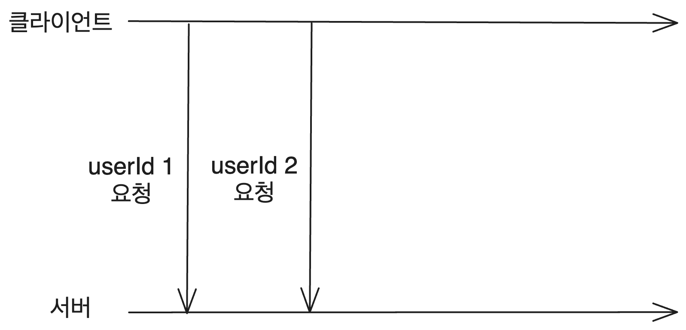
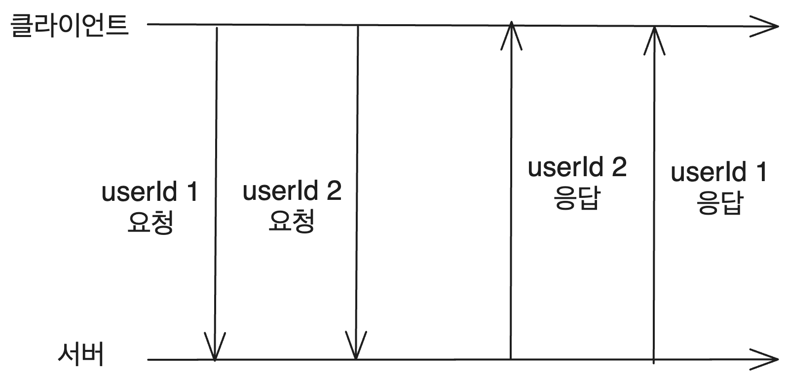

리액트 공식 문서의 리액트 배우기 항목의 고급 부분인 escape hatch 부분에서는 useEffect에 꽤 많은 부분을 할당하고 있고 관련 링크도 많다. useEffect를 꽤 사용해 왔지만 제대로 보는 것은 또 처음이라 useEffect 관련 공식 문서를 보며 내용을 여기 정리한다.

# 1. useEffect의 목적

리액트에서 렌더링하는 리액트 컴포넌트는 기본적으로 순수해야 한다. 이는 컴포넌트 외부를 변경시키지 않으며 같은 입력에 대해 늘 같은 출력을 보장해야 한다는 뜻이다. 그런데 프론트는 기본적으로 사이드 이펙트 덩어리다.

이는 이벤트 핸들러 등에서 처리할 수 있고 이게 정석이다. 하지만 렌더링 자체에 의해 사이드 이펙트를 발생시켜야 할 때도 있다.

쇼핑몰을 만들고 있다면, 사용자가 보는 화면이 렌더링되면 서버에 요청을 보내서 상품 목록을 가져오고 그걸 통해서 화면을 변경시켜야 한다. 이를 처리할 수 있는 이벤트 핸들러는 딱히 없다. 이런 경우에 useEffect를 사용한다.

useEffect의 Effect부터가 렌더링으로 인해 발생하는 사이드 이펙트를 뜻한다.

# 2. useEffect의 사용법

useEffect는 두 개의 인자를 받는다. 첫 번째 인자는 렌더링될 때 그리고 의존성 배열의 멤버가 변할 때마다 실행될 콜백 함수이며 두번째 인자는 의존성 배열이다.

콜백 함수는 컴포넌트가 처음 렌더링될 때 그리고 deps 배열이 변할 때마다 실행된다. 해당 콜백 함수가 리턴하는 함수는 다음 렌더링이 일어나기 직전 그리고 컴포넌트가 언마운트될 때 실행된다. 이렇게 리턴하는 함수는 cleanup 함수라고 한다.

이런 클린업 함수는 연결을 해제하거나 리소스를 해제하는 등 useEffect 콜백에서 뭔가 벌려놓은 작업들을 정리하는 역할을 한다. useEffect가 어떤 요소의 애니메이션을 표시하는 경우 클린업 함수에서 애니메이션을 초기값으로 되돌려야 한다.

의존성 배열을 전달하지 않는 경우 콜백 함수는 컴포넌트가 렌더링될 때마다 실행된다. 빈 배열일 경우 컴포넌트가 처음으로 렌더링될 때만 콜백이 실행된다.

```tsx
import { useEffect } from 'react';

function App(){
  useEffect(() => {
    console.log('dep 배열 원소가 변할 때마다 실행됩니다');
    return () => {
      console.log('cleanup 함수입니다.');
    };
  }, [dep1, dep2]);
  return <div>안녕하세요</div>;
}
```

## 2.1. 주의점

의존성 배열을 전달하지 않는 경우 useEffect 콜백은 렌더링 시마다 실행되게 된다. 그런데 이렇게 했을 때 useEffect 콜백 내부에서 state를 변경하면 무한루프가 발생한다.

```tsx
// 렌더링 -> count 변경 -> state 변경에 따른 렌더링 -> count 변경 -> ...무한루프
function App(){
  const [count, setCount] = useState(0);
  useEffect(() => {
    setCount(count + 1);
  });
  return <div>안녕하세요</div>;
}
```

## 2.2. 의존성 배열의 비교

리액트는 useEffect 의존성 배열의 원소들 중 하나라도 이전 렌더링 시의 그것과 다른 값을 가질 경우 콜백을 실행한다.

useEffect 의존성 배열 원소들의 비교는 Object.is를 사용한다. 이는 일반적인 비교와 같고 객체의 경우 참조가 같아야 같은 객체로 판단한다. 자세한 비교 방식은 [MDN 문서](https://developer.mozilla.org/en-US/docs/Web/JavaScript/Reference/Global_Objects/Object/is)를 참고하자.

그런데 이런 의존성 배열은 사실 리액트에서 어느 정도 제한을 한다. 의존성을 완전히 선택할 수는 없다. 만약 의존성 배열 내부의 종속성이 리액트에서 useEffect 콜백 기반으로 기대하는 것과 다르면 린트 에러가 발생한다.

그럼 어떤 경우 의존성 배열에 포함시켜야 할까? 다시 렌더링되었을 때 값이 동일한지를 알 수 없다면 의존성 배열에 포함시켜야 한다.

예를 들어서 컴포넌트 내에서 `useRef`로 만들어진 객체는 의존성 배열에 포함시키지 않아도 된다. 이는 `useRef`로 만들어진 객체는 컴포넌트 내에서 항상 동일한 객체임이 보장되기 때문이다. `useState`로 만들어진 setter 함수들도 마찬가지다.

단 부모 컴포넌트에서 전달받은 props나 state의 경우 의존성 배열에 명시해야 한다. 이는 state나 부모 컴포넌트에서 전달된 props가 렌더링 시마다 변경될 수 있기 때문이다.

# 3. useEffect로 데이터 페칭

useEffect를 이용해서 데이터를 페칭하는 건 꽤 흔한 패턴이다. 예를 들어 이런 식이다.

```tsx
function App(){
  const [data, setData] = useState(null);

  useEffect(() => {
    fetch('https://api.com/data')
      .then((response) => response.json())
      .then((data) => setData(data));
  }, []);

  return <div>{data}</div>;
}
```

하지만 이런 패턴은 문제가 많다. 따라서 개선할 수 있는 방법들을 좀 알아보자.

## 3.1. 문제

먼저 useEffect는 서버에서 실행되지 않기 때문에 초기에 클라이언트가 받은 HTML은 데이터가 없다. 따라서 클라이언트는 모든 JS를 받은 다음 앱을 렌더링하는 시점에 useEffect를 통해 데이터를 페칭해야 한다는 것을 의미한다. 따라서 비효율적이다.

그리고 네트워크 waterfall을 발생시킬 수 있다. 부모 컴포넌트 렌더링 이후 자식 컴포넌트가 렌더링되기 때문에 부모 컴포넌트의 useEffect -> 자식 컴포넌트의 useEffect...식으로 실행되어 데이터를 병렬로 가져오는 것보다 훨씬 느려질 수 있다.

또 캐싱도 되지 않고 선언형으로 코드를 짤 수 없어서 코드가 복잡해진다. 경쟁 상태 같은 버그가 발생하기도 쉽다.

대안으로는 NextJS같은 프레임워크의 내장 페칭 방법을 사용하는 게 있고 Tanstack Query, SWR 같은 클라이언트 캐싱 라이브러리를 사용하는 것이 있다.

## 3.2. 해결 - 경쟁 상태

useEffect 페칭의 문제 중 하나는 경쟁 상태가 발생하기 쉽다는 것이다. 다음 코드를 보자.

```tsx
function App(){
  const [data, setData] = useState(null);
  const [userId, setUserId] = useState(1);

  useEffect(() => {
    fetch('https://api.com/data/' + userId)
      .then((response) => response.json())
      .then((data) => setData(data));
  }, [userId]);

  return <div>{data}</div>;
}
```

이런 식으로 하면 userId가 변경될 때마다 페칭이 다시 일어나기 때문에 경쟁 상태가 발생할 수 있다. 가령 userId가 1일 때 먼저 페칭이 일어나고 그 다음 userId가 2로 변경되었다고 해보자. 그럼 요청은 다음과 같이 간다.



그럼 더 최신 상태인 userId 2에 대한 요청이 data가 되어서 화면에 표시되는 게 맞다. 하지만 응답이 다음과 같이 순서가 바뀌어 도착할 수도 있다. 이러면 userId 1에 대한 응답이 data가 되어서 화면에 표시된다!



이를 막기 위해서는 클린업 함수에서 이전의 결과들을 무시하도록 해야 한다. 이렇게 하면 각 렌더링의 effect는 자체적인 ignore 변수를 스코프에 가지고 있게 된다. 그런데 클린업 함수에서 ignore 변수가 true가 되기 때문에 마지막 응답의 ignore만 false가 되고 나머지는 true가 되어 무시된다.

왜냐 하면 userId가 2가 되어 useEffect에서 페칭이 일어나기 바로 전에 userId 1 시점의 클린업 함수가 실행되어 userId 1 시점의 ignore가 true가 되기 때문이다.

```tsx
function App(){
  const [data, setData] = useState(null);
  const [userId, setUserId] = useState(1);

  useEffect(() => {
    let ignore = false;
    fetch('https://api.com/data/' + userId)
      .then((response) => response.json())
      .then((data) => {
        if (!ignore) {
          setData(data);
        }
      });
    return () => {
      ignore = true;
    };
  }, [userId]);

  return <div>{data}</div>;
}
```

이런 경쟁 상태 외에도 캐싱, 네트워크 워터폴 해결 등 많은 문제가 있다. 이런 문제들은 해결하기가 쉽지 않고 따라서 nextjs 같은 프레임워크들은 내장 페칭 방법을 제공한다. 또는 Tanstack Query, SWR 같은 클라이언트 캐싱 라이브러리를 사용하는 것도 좋은 방법이다. 물론 `useData`같은 커스텀 훅을 직접 만들어도 된다.

결국 핵심은 useEffect 호출을 컴포넌트에서 하는 경우를 줄이는 것이다.

# 4. useEffect가 필요없는 경우

useEffect는 리액트 컴포넌트를 리액트 외부, 즉 네트워크나 브라우저 DOM 같은 외부 시스템과 동기화할 수 있게 해준다. 따라서 외부 시스템과의 동기화를 위해서는 반드시 useEffect를 사용해야 한다.

그런데 이를 반대로 이야기하면 외부 시스템이 관여하지 않는 경우에는 useEffect를 사용할 필요가 없다는 뜻이다. useEffect를 제거해서 더 최적화할 수 있는 경우를 알아보자. 이런 부분을 요약하면, 결국 렌더링 시점에 계산할 수 있는 건 그때 하고, 이벤트 핸들러에서 할 수 있는 건 거기서 하여 useEffect를 사용하지 않거나 줄이자는 것이다.

## 4.1. 앱 초기화

컴포넌트 렌더링 시에만 실행되는 게 아니라, 아예 앱 전체에서 앱 시작 시 한번만 실행되어야 하는 코드가 있을 수 있다. 이런 건 useEffect를 쓰기보다는 컴포넌트 외부에 배치하면 된다.

이런 식으로 짜면 페이지 로드 후 한번만 해당 초기화 코드가 실행됨이 보장된다.

```tsx
if (typeof window !== 'undefined') {
  // 앱 초기화 코드
}
```

모듈의 최상위 레벨에서도 이런 초기화 코드를 실행할 수 있다. 이렇게 최상위 레벨의 코드들은 컴포넌트를 import할 때 렌더링되지 않더라도 1번 실행된다. 따라서 import시의 속도 저하를 막으려면 이런 패턴은 자제해야 한다. 앱 전체의 초기화 로직은 app.js와 같은 루트 컴포넌트 모듈에 두는 게 좋다.

## 4.2. 렌더링 시점에 데이터 만들기

만약에 어떤 변경사항이 있을 때 거기에 따라서 데이터를 변경해야 한다고 하자. 그러면 useEffect를 사용해서 이를 처리하려 할 수 있다. 가령 검색어 변화에 따라서 검색 결과를 가져와야 한다고 하면 이렇게 짤 수 있다.

```tsx
function Search({ query }) {
  const [data, setData] = useState(null);

  useEffect(() => {
    setData(filteredData(query));
  }, [query]);

  return <div>{data}</div>;
}
```

하지만 이렇게 되면 렌더링이 2번 일어난다. 먼저 오래된 `query`로 렌더링이 한 번 일어나고 그 다음에 `query`가 변경된 것을 `useEffect`에서 감지하고 data를 변경함으로써 렌더링이 다시 일어난다.

이런 불필요한 렌더링을 피하기 위해서는 컴포넌트 최상위 스코프에서 모든 데이터를 변환하는 게 좋다. 기존 props나 state에서 계산할 수 있는 게 있다면 최상위 스코프에서 계산시켜서 렌더링 중에 계산되도록 하자. 예를 들어 위의 코드를 다음과 같이 바꿀 수 있다.

filteredData 함수를 useEffect가 아니라 최상단에서 호출하고 이를 useMemo를 통해 캐싱한 코드이다. 이때 useMemo로 감싼 함수는 렌더링 중에 실행되므로 순수한 함수여야 한다.

```tsx
function Search({ query }) {
  const resultData = useMemo(() => {
    return filteredData(query);
  }, [query]);

  return <div>{resultData}</div>;
}
```

이렇게 하면 렌더링이 한번만 일어나며 렌더링 시마다 해당 데이터도 같이 계산된다.

### 4.2.1. 메모이제이션 기준

어느 정도로 비싼 연산인지는 `console.time`, `console.timeEnd`로 측정할 수 있다. 리액트 공식 문서에서는 해당 연산이 1ms 이상 걸린다면 메모이제이션을 고려해보라고 한다. 또한 메모이제이션 이후 로깅되는 시간이 줄어드는지를 검증하라고 한다.

그리고 메모이제이션은, 당연하지만 메모를 해서 불필요한 데이터 변경을 줄이는 것이지 데이터 변경의 속도 자체를 빠르게 만들어 주지 않으니 조심해서 써야 한다.

### 4.2.2. key로 state 초기화

어떤 props가 변경되었을 때 완전히 새롭게 컴포넌트를 구성하고 state를 초기화해야 하는 경우가 있다. 이를 useEffect의 deps에 props를 넣어 해결하는 것보다 나은 방법이 있다.

외부 컴포넌트에서 해당 컴포넌트에 key props를 제공하여 key가 다른 컴포넌트끼리 개념적으로 다른 프로필임을 리액트에 알려줄 수 있다. 리액트는 기본적으로 같은 위치의 같은 컴포넌트에 대해 state를 보존하지만 따로 key를 전달할 시 key가 다른 컴포넌트에 대해서 완전히 다른 state를 갖게 해야 한다는 것을 리액트에 알려주는 것이다. 따라서 key가 변경되면 리액트는 DOM을 다시 생성하고 모든 자식 state를 재설정한다.

props를 useEffect에 제공하는 것보다 key를 전달하는 쪽이 더 효율적이고 리액트에서 초기화를 알아서 진행해 주므로 버그 발생 가능성도 적다.

```tsx
function ProfilePage({ userId }) {
  return (
    <>
      <ProfileDetails userId={userId} key={userId} />
      <ProfileSidebar userId={userId} key={userId} />
    </>
  );
}
```

이렇게 하면 userId가 변경될 때마다 userId가 key로 전달된 컴포넌트들이 완전히 새롭게 구성된다.

### 4.2.3. 일부 state 조정

보통은 이벤트 핸들러에서 state를 조정하는 게 일반적이다. 만약 컴포넌트가 화면에 나타났기 때문에 state를 조정해야 하는 일이 있다고 해도 그러면 보통 초기화이기 때문에 컴포넌트에 다른 key를 전달하면 된다. 하지만 희귀한 경우 이 모든 방법이 불가능할 수도 있다.

그럴 때는 컴포넌트가 렌더링되는 동안 set함수를 호출해 이전 값을 바탕으로 state를 업데이트해볼 수 있다. 이전 값을 추적하고 있다가 그 값을 바탕으로 state를 업데이트하는 것이다. 이는 리액트가 렌더링 중에는 렌더링 중인 바로 그 컴포넌트의 state만 업데이트할 수 있기 때문에 가능한 방법이다.

공식 문서의 예시는 카운터가 마지막 변경 이후 증가했는지 감소했는지를 표시하는 라벨 컴포넌트를 해당 패턴이 필요한 경우로 제시한다. 이런 경우에는 다음과 같이 카운터의 이전 상태를 저장해 놓고 비교를 통해 업데이트하도록 할 수 있다. useEffect를 써서 count의 변경에 따른 로직을 처리할 수도 있지만 이런 방식이 더 효율적이다.

```tsx
export default function CountLabel({ count }) {
  const [prevCount, setPrevCount] = useState(count);
  const [trend, setTrend] = useState(null);

  if (prevCount !== count) {
    setPrevCount(count);
    setTrend(count > prevCount ? 'increasing' : 'decreasing');
  }

  return (
    <>
      <h1>{count}</h1>
      {trend && <p>The count is {trend}</p>}
    </>
  );
}
```

이 방식은 현재 렌더링 중인 컴포넌트의 state만을 업데이트할 수 있고 컴포넌트의 이전 상태를 저장해야 하기 때문에 난해하다. 하지만 useEffect에서 state를 업데이트하는 것보다는 훨씬 효율적이다.

단 대부분의 컴포넌트에는 이런 방식이 필요하지 않다. 다른 props나 state에 따라 state를 업데이트하는 건 코드를 더 복잡하게 만들기 때문에 언제나 이 패턴이 꼭 필요한지 생각하고 쓰자. key를 사용해 모든 state를 초기화하거나 렌더링 중에 모든 state를 계산하도록 바꿀 수는 없는지 검토하자.

## 4.3. 이벤트 핸들러

'컴포넌트가 화면에 나타났기 때문에' 사이드 이펙트를 발생시켜야 하는 게 아니라면 useEffect를 쓸 필요가 없다. 해당 코드가 어떤 원인으로 인해 실행되어야 하는지를 늘 생각하자!

가령 클릭 시 발생하는 어떤 동작에 의해 state를 업데이트하고 또 거기에 대한 어떤 동작을 해야 한다면 이를 이벤트 핸들러에서 처리하는 게 좋다.

```tsx
function App(){
  const [data, setData] = useState(null);

  const handleClick = () => {
    fetch('https://api.com/data')
      .then((response) => response.json())
      .then((data) => {
        setData(data);
        // 알람 표시
        alert('데이터를 가져왔습니다!');
      });
  };

  return <button onClick={handleClick}>데이터 가져오기</button>;
}
```

## 4.4. props나 state 간의 동기화

state 여러 개 간의 변경이 연쇄적으로 일어나야 할 때가 있다. 하지만 이것이 렌더링 시점에 전부 함께 계산될 수 있는 경우 그렇게 처리하는 것이 좋다. 컴포넌트 내에서 `const nextData=...`처럼 따로 변수를 선언해서 계산에 사용하도록 하는 것도 괜찮다. useEffect를 써서 렌더링 패스를 늘리는 것은 최대한 피하자.

단 이전 값에 따라서 네트워크에서 다른 값을 연쇄적으로 가져와야 하는 경우 등은 useEffect를 사용해야 한다. 이벤트 핸들러에서 직접 다음 state를 계산할 수 없기 때문이다.

state의 변경에 따라 어떤 동작이 일어나야 할 때도 마찬가지다. 먼저 useEffect로 처리하는 경우를 생각해보자.

```tsx
function Toggle({onChange}){
  const [on, setOn] = useState(false);

  useEffect(() => {
    onChange(on);
  }, [on]);

  const handleClick = () => {
    setOn(!on);
  };

  return <button onClick={handleClick}>{on ? 'ON' : 'OFF'}</button>;
}
```

이렇게 하면 먼저 자식 컴포넌트에서 `on` state를 업데이트한 후 화면 업데이트가 끝나고 Effect가 실행되어 또 부모 컴포넌트의 onChange가 호출된다. 만약 여기서 부모 컴포넌트의 state가 업데이트된다면 또 렌더링이 시작되는 것이다.

이런 경우에는 이벤트 핸들러에서 직접 다음 state를 계산하는 게 좋다. 이렇게 하면 렌더링이 한 번만 일어난다.

```tsx
function Toggle({onChange}){
  const [on, setOn] = useState(false);

  const handleClick = () => {
    const nextOn = !on;
    setOn(nextOn);
    onChange(nextOn);
  };

  return <button onClick={handleClick}>{on ? 'ON' : 'OFF'}</button>;
}
```

또는 아예 `on` state를 부모 컴포넌트로 옮겨서 `Toggle`을 완전한 제어 컴포넌트로 만들어도 된다.

## 4.5. 외부 저장소 구독

컴포넌트에서 리액트 외부의 일부 데이터를 구독해야 할 경우 이를 위해 특별히 제작된 `useSyncExternalStore`훅을 사용할 수 있다.

```tsx
const snapshot = useSyncExternalStore(subscribe, getSnapshot, getServerSnapshot?)
```

# 참고

react 공식 문서의 Escape Hatch 부분을 주로 참고했다.

https://react.dev/learn/synchronizing-with-effects

https://react.dev/learn/you-might-not-need-an-effect