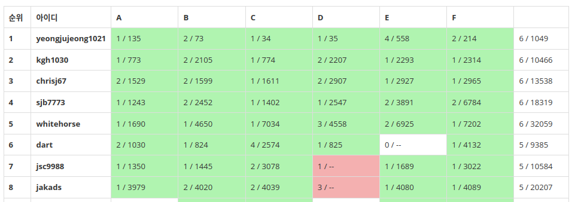

# 신촌연합 알고리즘 캠프 후기

# 1. 캠프 콘테스트 3등


신촌연합 알고리즘 캠프 초급반 콘테스트에서 3등을 했다. 꽤 괜찮은 성적이라고 생각한다. 사실 내가 내 스스로의 힘으로, 내가 그럭저럭 만족할 만한 어떤 결과를 낸 것이 처음이기에 조금은 홀가분한 마음으로 TMI 투성이인 후기를 쓴다. 게다가 후기를 쓰면 추첨을 통해 경품을 주는 이벤트도 진행 중이라 안 쓸 수가 없었다.

# 2. 나에 대하여


방학 시작할 때의 프로필이 없어서 올리는 현재의 내 프로필

---

나는 꽤 알고리즘을 오래 해왔다. 이번 방학이 시작할 때 내 티어는 이미 https://solved.ac/ 기준 플래티넘 4였고, 푼 문제는 800문제를 넘어갔던 것 같다. 단순히 시작한 날짜로 따지면 2년 정도가 되었으니 이상한 일은 아니다.

그러면서 YunGoon, dlstj0923, snowflake, gs11008 등 많은 알고리즘 고수들을 만났고 같은 학교의 고수들인 raararaara, shiftpsh, wbcho0504, djs100201, seastar105 등과도 알게 되었다. 직접 알게 된 사람들 외에도 한두 번 이야기를 나눠본 고수들은 셀 수도 없다. 그리고 그런 사람들처럼 빛나는 사람이 되고 싶어 컴퓨터공학 복수전공을 시작하기도 했다. 또 나보다 훨씬 잘하는 그런 사람들을 모아서 스터디를 이끌어보는 영광을 안기도 했다. 그러면서 내 실력이 꽤 괜찮다고 사람들이 인식하게 된 듯 하다. 나는 내가 어울리는 사람들보다 실력은 많이 못한 게 사실인데 말이다.

그래서 나는 늘 내 실력이 거품이라고 생각해왔다. 지금도 그렇게 생각한다. 내가 완전히 뉴비급으로 못하는 건 아니라는 걸 알지만 그렇다고 플래티넘이라는 티어에 걸맞는 사람이라고 생각하지도 않는다. 이 플래티넘 티어는 한때 쓸데없이 마음만 급해져서 고급 알고리즘에 손끝만 대어 본 덕분일 뿐이다. 가령 내가 푼 문제에는 네트워크 플로우라든지 무슨 고급 테크닉 문제들이 몇 개 있지만 지금에 와서 그런 것들은 하나도 기억나지 않는다. 원리는 전혀 이해하지 못한 채로 거의 코드만 베껴와서 적어넣는 수준이었으니 말이다.

그래서 늘 처음부터 다시 시작하는 것을 생각해 왔다. 그러나 계속 시간이 없어서, 또는 내 쓸데없는 자만심이 그걸 막아서 못해왔었다. 이번 방학에서야 신촌연합 알고리즘 캠프 초급반을 듣는 것으로 겨우 그것을 실현하게 되었다.

# 3. 신촌연합 알고리즘 캠프

```
안녕하세요 신촌지역 대학교 프로그래밍 동아리 연합입니다. 서강대학교, 숙명여자대학교, 연세대학교, 이화여자대학교, 홍익대학교 프로그래밍 동아리의 연합 동아리로, 각 학교 컴퓨터공학과 전공생 180명으로 구성되어 있습니다. 2020년 겨울부터 활동을 시작하여 매 시즌 정기적인 활동을 이어 나가고 있습니다.
```

https://icpc-sinchon.io/ 에서 발췌

---

알고리즘 학회에 들어가서 가만히 있었는데 갑자기 신촌지역 대학들이 모여서 연합이란 걸 만들고 양질의 강의를 제공하기 시작했다. 원래 서강대 학회에서도 고수 분들이 좋은 강의를 해주었지만 아무래도 멘토라든지, 시험 등의 시스템이 부족했다. 그런 것들을 할 수 있을 만큼 서강대 학회의 인원이 충분하지도 않았을 것이다.

하지만 신촌연합이 만들어지고 인원이 충분해지면서 여러가지 시스템이 만들어졌고 열심히 할 마음만 있다면 훨씬 더 괜찮은 환경에서 알고리즘을 배울 수 있게 되었다. 강의 보증금 시스템이라든지 멘토라든지 하는, 알고리즘을 배우고 싶어하는 사람들을 도울 수 있는 여러가지 시스템들이 갖춰졌다.

그 와중에 나는 거의 연합이 생길 때부터 있었지만 제대로 참여해 본 적은 별로 없는 것 같다. 늘 강의는 듣는둥 마는둥 연습문제도 푸는둥 마는둥 했다. 다른 할 게 있다는 핑계로 딱히 제대로 참여하지 않았다. 게다가 중급반을 참여했기에, 실력의 기반이 부족한 내가 이해하기에는 어려운 알고리즘들이 많아서 잘 머리에 들어오지도 않았다.(신촌연합 중급반에서는 중급이라고 하기 힘들 정도로 어려운 알고리즘을 다뤘었다)

하지만 이번에는 마음을 잡고 초급반을 신청했다. 커리큘럼의 대부분이 한번쯤 들어 보고 문제도 몇 개는 풀어 보았던 알고리즘들이라 다시 복습하면서 기반을 탄탄하게 잡는다는 마음이었다. 그리고 제대로 된 지식 기반 없이 어려운 알고리즘을 배우는 것이 재미가 있긴 하지만 기본적인 실력 향상에는 그렇게 도움이 되지 않는다는 것을 1년 반이나 지나서 이제야 깨달아 버렸기 때문이다.

참고 : [어려운 알고리즘 권하는 사회 - Green55님](https://blog.naver.com/pasdfq/222217957003)



아쉽게도 모든 출석문제를 풀지는 못했다.

---

그래서 이번에는 최대한 모든 문제를 내 손으로 풀어 보고자 했다. 정 안 되면 풀이를 볼 수도 있지만, 무턱대고 남의 코드를 보고 대충 이해한 후에 거의 비슷한 코드를 제출하는 일은 없게 하기로 했다.(그렇게 남의 코드를 따라 치기만 하는 게 실력 향상에 전혀 도움이 안 된다는 걸 나도 안다. 하지만 부끄럽게도 나는 그런 짓을 꽤 많이 해왔다) 풀이를 보더라도 이해한 후의 구현은 내가 직접 내 손으로 하기로 결심했다.

캠프가 끝나고 돌아보건대, 모든 문제를 다 오로지 나만의 발상으로 푼 것은 아니지만 적어도 내 손으로 푼 것은 맞다고 생각한다. 티어만 따진다면 내가 지금까지 고급 알고리즘을 조금씩만 배우면서 풀어온 문제보다 훨씬 낮은 티어의 문제들을 풀었다. 하지만 내가 푼 어떤 고급 문제들보다 자랑스럽다고 감히 생각한다.

## 3.1 캠프의 진행


신촌연합 알고리즘 캠프 초급반에서 다루는 자료구조와 알고리즘은 매우 기본적인, 그러나 잘 다루기는 굉장히 어려운 주제들을 다룬다. (가령 유니언 파인드와 BFS는 각각 solved.ad기준 골드 하위, 실버 상위 티어의 알고리즘이지만 그걸 섞으면 [BOJ 14868 문명](https://www.acmicpc.net/problem/14868) 과 같은 흉악한 문제가 나온다. 그 외에도 스택을 이용한 라인 스위핑이라든지 하는 수많은 고급 알고리즘들이 이 기본적인 알고리즘들에서 파생된다)

따라서 이런 기본적인 알고리즘들은 사람들이 대충 이해하고 훌쩍 넘어가는 데에 반해서 매우 중요하고 잘 이끌어 줄 사람도 필요하다고 본다. 신촌연합에서는 이런 부분들을 잘 제공해 주었다고 생각한다. 강사는 최소 코드포스 오렌지급이었고 멘토들도 꽤 짱짱했으니 말이다. 

아무튼 이런 주제들로 초급반은 진행되었고, 각 주제들에 관한 강사들의 강의 이후 일정 개수 이상의 출석 문제(+연습 문제)를 풀면 출석이 되는 방식으로 캠프가 진행되었다. 또한 동기부여를 위해서인지 캠프가 처음 시작할 때 일정 금액의 보증금을 걷고 나서 캠프 진행 동안 특정 기준을 만족한 사람에게만 보증금을 환급해 주는 제도를 도입하였다. 

누가 생각한지 몰라도 정말 좋은 생각이었다고 생각한다. 몇만원의 보증금이 걸려 있다고 생각하니 열심히 참여하게 되더라.

## 3.2 캠프 이야기 - 출석 문제


그리디 주제의 출석 문제들. 4문제 이상 풀면 되긴 하지만 대부분이 골드 이상의 그리디 문제이다.

---

그래도 참가자로서 조금 평을 하자면, 일단 캠프의 참여자들을 볼 때, 몇몇 주제에 대한 출석 문제 선택은 그렇게 좋지 않았다고 생각한다. 이런 기본적인 알고리즘들만으로도 충분히 엿볼 수 있는 신비한 알고리즘의 세계를 맛보게 해 주려는 운영진들의 노력인지는 잘 모르겠으나 완전히 처음 시작하는 사람들에게 골드 상위의 문제들을 출석 문제로 던져주는 것은 글쎄, 나한테는 매우 좋았지만 조금은 무리한 선택이 아니었나 싶다.

(물론 최소 스패닝 트리와 같이 최소 골드 4 이상의 티어가 책정되는 주제에 대해서는 크게 할 말 없다. 다만 알고리즘 난이도로 골드 4를 받은 MST기본 문제보다는 백트래킹 골드4 티어 문제가 훨씬 까다롭다고 생각한다. MST 출석 문제에 골드 3이 있는 것과 백트래킹 출석 문제에 골드 3이 있는 것은 다르게 평가해야 한다고 나는 본다)

알고리즘 대회 판에 한번 몸을 던져 보고 싶은 사람이라면 이 정도도 안 푸는 것은 말도 안 된다-라는 견해에도 나름 동의한다. 솔직히 나 같아도, 어려운-하지만 상당히 도전해 볼 만한-문제를 던지고 싶은 욕심이 마구 들 것 같다. 그러나 초급반 수강생은 150명을 넘어간다. 그런 사람들이 모두 알고리즘을 끝까지 한 번 해 보겠다는 마음을 먹었다는 것은 말이 안 된다. 개인적으로는 많아야 10%인 15명 정도가 그런 알고리즘 전사들이 아닐까 생각한다. 

그런 사람들만을 위해서 캠프가 운영되는 것은 아니니까, 다음에는 좀 더 쉬운 문제들을 필수문제로 하고 나머지는 연습문제로 던지는 게 좋지 않을까 생각하지만...뭐, 내가 캠프의 운영진도 아니고 나에게는(또 내가 아는 몇몇 알고리즘 전사들에게도) 매우 마음에 들었던 문제 선정이었으니 딱히 더 할 말은 없다. 그리고 다음에도 이런 멋진 문제 선정이라면 나 개인적으로는 아마 다음에도 초급반에 참여하지 않을까? 적어도 멘토로 참여해서라도 문제는 받아서 풀어보지 않을까 싶다.

## 3.3 캠프 이야기 - 강의와 연습문제

나는 내용을 거의 다 아는 상태인데도 강의는 꽤 괜찮았다. 어떤 고급 테크닉을 더 가르쳐 주는 건 아니었지만 내용이 제법 탄탄해서 정리한다는 마음으로 들으니 왠지 머릿속의 지식 기반이 더 튼튼해지는 느낌이었다. 역시 코드포스 오렌지 강사들은 다르구나 싶었다.

출석 문제들 또한, 처음 하는 사람들에게는 그다지 적절하지 못하다고 생각하긴 하지만 말했듯이 내게는 정말 좋은 문제 선정이었다. 스택이 뭔지, 다이나믹 프로그래밍이 뭔지는 알지만 제대로 활용하지 못하는 나같은 사람에게 강제로 응용을 시켜주는 문제들이었다고 생각한다. 또한 알고리즘을 거의 처음 시작하는 사람이라도 배우고자 하는 욕심만 있다면 도전해 볼 만한 문제였다고 본다. 실제로 이번 캠프로 인해 실력이 엄청나게 상승한 사람을 몇 명 보았기도 하고 말이다.

물론 내게는 여전히 백트래킹은 어렵고 DP는 발상이 너무나 힘들며 완전탐색 구현은 빡세다. 그래도 그런 주제들의 응용 문제를 스스로의 힘으로 풀어 보면서 조금은 더 익숙해졌다고 생각한다. 예전에는 거들떠보지도 않거나 조금 끄적거리다가 답을 찾아보고 있었을 텐데 말이다.

## 3.4 캠프 이야기 - 캠프의 효용에 대하여

알고리즘 실력을 기르고 싶다면 캠프를 듣는 게 좋은가? 무조건 맞다고 할 수는 없을 것이다. 하지만 알고리즘을 시작하면서 보통 겪게 되는 많은 관문들을 조금 낮춰 주는 것은 사실이다.

사실 캠프에서 배우게 되는 내용에 대해서는 큰 효과가 없다고 생각한다. 물론 캠프에서 양질의 강의를 제공한다고 했던 말은 사실이다. 그러나 그런 정보쯤은 마음만 있다면 인터넷에서 쉽게 찾아볼 수 있다. kks227님의 블로그나 바킹독님의 블로그 등에 이미 잘 정리된 자료들이 있고, 유튜브에 가보면 IOI Korea 등의 채널에서 알고리즘 판의 네임드들이 나와서 강의하는 자료도 있다. 캠프에서만 배울 수 있는 내용 같은 건 아무것도 없다.

그러나 이곳에선 확실한 커리큘럼을 제공한다. 이 기간 안에 이 주제를 습득하고 이 문제를 스스로의 힘으로 풀면 일정 수준에 올라설 수 있다는 어떤 보장 같은 것. 그리고 이해가 안 되는 무언가나 내 힘으로 풀 수 없는 문제가 나오면 편하게 질문할 수 있는 멘토진의 존재. 이런 것들 또한 온라인에서 찾을 수 있는 것은 맞지만 알고리즘을 처음 시작하는 입장에서는 정말 쉽지 않다.


출석 문제 스코어보드. 경쟁심리를 자극한다.

---

또한 얼굴 한 번 본 적 없더라도 내 조금 앞에서 달려가는 어떤 사람들의 존재. 알고리즘을 조금이라도 제대로 해볼 마음이 있는 사람이라면 저렇게, 나보다 스코어보드상의 순위가 높은 사람을 보면 문제를 풀고 싶은 마음이 들게 된다. 

오픈채팅방이나 알고리즘 커뮤니티에 있는 사람들은 보통 너무 잘하기 때문에 좋은 조언자는 될 수 있어도 좋은 경쟁자가 될 수는 없다. 알고리즘을 이제야 처음 시작했다면 어떻게 코드포스 퍼플, 오렌지급들이랑 경쟁하겠는가? 어느 정도의 승부욕을 자극하는 그런 경쟁자들의 존재를 신촌연합 캠프에서는 제공해 준다. 나 또한 저런 스코어보드를 보면 한 문제를 더 풀지 않고는 못 배기곤 했다.

다만 대면 스터디나 세미나의 경우 우연한 만남을 통해 얻을 수 있는 인연이 상당히 많다고 생각하는데(나의 우상 `raararaara` 님도 이런 기회를 통해 만났었다) 코로나 때문에 대면으로 만날 수 있는 기회가 없었어서 아쉬운 부분이었다. 먼 훗날(이날이 오긴 올까?) 소규모라도 모임을 할 수 있게 된다면 캠프에서 대면으로 진행되는 무언가도 진행해 봐도 좋지 않을까 하는 생각을 한다. 아니면 대면이 아니라도 따로 스터디를 만든다든가. 그러고 보니 스터디는 지금도 만들 수 있었는데 아무도 하지 않은 것이구나.

요약하자면, 오직 이 캠프에서만 얻을 수 있는 것은 없다. 그러나 혼자 얻기가 쉽지만은 않은 것들을 이 캠프에서는 꽤나 많이 제공해 줬다고 생각한다.

# 4. 캠프 콘테스트

그래도 3등씩이나 했는데 콘테스트에 대한 후기를 아예 안 쓸 수는 없다. 간단하게나마 서술하도록 하겠다.


잘 알지 못하는 사람들에게 :god: 이모지를 받는 경험은 신선하다

---

캠프 콘테스트 날 학교 랩실을 사용하지 못한다고 하여 스터디룸을 빌리려고 했다. 그런데 14400원으로 꽤 가격이 나가기에 조금이라도 분담할 사람을 찾고자 했다. 바로 연락을 준 `p_jun` 과 함께 가기로 했다.

`p_jun` 과 함께 간 스터디룸은 의자가 조금 기울어져 있긴 했지만 꽤 괜찮았다. 14400원이 적은 돈은 아니지만 스터디룸 대여비치고는 싼 편인데, 그 가격에 빌릴 수 있는 스터디룸치고는 괜찮았다. 커피를 맘대로 뽑아 마실 수 있는 게 특별히 맘에 들었다.

아무튼 그렇게 스터디룸에서 아무 말 없이 각자 문제를 풀었다. 문제별 후기는 다음과 같다. 문제 순서는 내가 푼 순서대로이다.

## [A. 이진수 나눗셈](https://www.acmicpc.net/problem/22950)

이진수의 특성을 잘 생각해서 풀면 되는 문제다. 브론즈1 티어의 문제치고는 삐끗해서 틀리기 좋은 문제라고 생각한다. 이진수의 뒷자리부터 0의 개수를 센 후 그게 K보다 크거나 같으면 M이 $ 2^{k} $ 로 나누어떨어진다고 할 수 있다. 이때 조심할 점은 주어진 M의 자릿수가 모두 0이면 무엇으로 나눠도 나누어떨어진다는 점이다. 이 부분을 생각하지 못해서 나도 1번 틀렸다.

```cpp
#include <iostream>
#include <vector>
#include <list>
#include <cstring>
#include <algorithm>
#include <string>
#include <map>
#include <set>
#include <cmath>
#include <queue>
#include <iomanip>

using namespace std;
typedef long long ll;

int main() {
    ios::sync_with_stdio(false);
    cin.tie(nullptr);
    cout.tie(nullptr);

    int n, k, len, cnt = 0;
    string bin;
    cin >> n;
    cin >> bin;
    cin >> k;
    len = bin.length();
    for (int idx = len - 1; idx >= 0; idx--) {
        if (bin[idx] == '1') {
            break;
        }
        else {
            cnt++;
        }
    }
    if (cnt >= k || cnt == len) {
        cout << "YES\n";
    }
    else {
        cout << "NO\n";
    }

    return 0;
}
```

## [C. permutation making](https://www.acmicpc.net/problem/22952)

1~N으로 순열을 만들 때, 1부터 i인덱스까지의 구간합을 N으로 나눈 나머지 중 서로 다른 값이 $ \frac {N}{2} +1 $ 개가 되게 하는 순열을 아무거나 구해서 출력하는 문제이다.

나는 N이 홀수일 경우`1, N-1, 2, N-2, ... (N/2-1), (N/2+1)` 을 출력하면 문제의 조건을 만족하고, 짝수일 경우 `1, N-1, 2, N-2, ... (N/2-1), N/2` 를 출력하면 문제의 조건을 만족한다는 것을 몇 개의 경우를 직접 해보고 나서 깨달았다. 그대로 구현하니까 맞았다.

```cpp
#include <iostream>
#include <vector>
#include <list>
#include <cstring>
#include <algorithm>
#include <string>
#include <map>
#include <set>
#include <cmath>
#include <queue>
#include <iomanip>
using namespace std;
typedef long long ll;

int main() {
    ios::sync_with_stdio(false);
    cin.tie(nullptr);
    cout.tie(nullptr);

    int n;
    cin >> n;
    if (n % 2 == 1) {
        for (int i = 1; i <= n / 2; i++) {
            cout << i << " " << n - i << " ";
        }
        cout << n << "\n";
    }
    else {
        for (int i = 1; i < n / 2; i++) {
            cout << i << " " << n - i << " ";
        }
        cout << n / 2 << " " << n << "\n";
    }


    return 0;
}
```

## [B. 송이의 카드 게임](https://www.acmicpc.net/problem/22951)

[요세푸스 문제](https://www.acmicpc.net/problem/1158)의 변형이다. 처음 봤을 때는 감을 못 잡고 C번으로 가서 C번을 먼저 풀었으나, C번을 풀고 돌아와서 다시 보니까 요세푸스 문제의 변형인 것을 쉽게 알 수 있었다. 그 문제에 내가 제출했던 코드를 좀 찾아보고 나서 이 문제를 풀었다. 다만 인덱스가 좀 헷갈려서 1번 틀렸다.

```cpp
#include <iostream>
#include <vector>
#include <list>
#include <cstring>
#include <algorithm>
#include <string>
#include <map>
#include <set>
#include <cmath>
#include <queue>
#include <iomanip>
using namespace std;
typedef long long ll;

typedef struct card {
    int person, num;
    //누가 가지고 있는지와 카드에 적힌 숫자
} card;

int main() {
    ios::sync_with_stdio(false);
    cin.tie(nullptr);
    cout.tie(nullptr);

    int n, k;
    cin >> n >> k;
    vector<card> people;
    for (int i = 1; i <= n; i++) {
        for (int j = 0; j < k; j++) {
            int t;
            cin >> t;
            people.push_back({i, t});
        }
    }
    int pos = 0;
    while (people.size() > 1) {
        int prev = people[pos].num;
        people.erase(people.begin() + pos);
        pos = (pos + prev - 1) % people.size();
    }
    cout << people[0].person << " " << people[0].num << "\n";
    return 0;
}
```

## [E. 그래프 트리 분할](https://www.acmicpc.net/problem/22954) 

주어진 그래프가 만약 연결 요소라면 그냥 최소 스패닝 트리를 적당히 구축해 준 후 마지막에 트리에 합류한 정점 하나만 뚝 떼어서 2번째 트리로 만들어 주면 된다. 정점 하나뿐인 그래프 또한 트리의 조건을 만족하므로 말이다.

그러나 문제는 주어진 그래프가 연결 요소라는 보장이 없다는 것이다. 따라서 먼저 BFS나 DFS를 통해서 연결 요소의 개수를 세어 준다. 그리고 연결 요소가 2개보다 많으면 주어진 그래프를 2개의 트리로 분할할 수 없으므로 `-1`을 출력해 준다. 또한 주어진 정점 개수가 1개이거나 2개일 때도, 어떻게 하더라도 그래프가 서로 다른 크기의 트리 2개로 분할될 수 없으므로 역시 `-1` 을 출력해 준다.

그 다음에는 연결 요소가 2개일 때를 처리해 준다. 이때 크루스칼로 처리하면 2개의 연결 요소에 들어가 있는 간선들을 분류하는 처리를 해줘야 하므로 나는 프림을 사용했다. 2개의 연결 요소에서 아무 정점이나 하나씩 잡고 프림 알고리즘을 돌리면서 트리를 구성하게 되는 정점과 간선들을 벡터에 각각 담아 주었다.

그런데 만약 이렇게 만든 2개의 트리의 크기가 같다면 문제의 조건을 만족하지 못한다. 그런데 연결 요소는 처음부터 2개가 주어졌으므로 달리 어떻게 분할해도 2개의 트리의 크기는 같을 수밖에 없다. 따라서 이 경우 `-1`을 출력해 준다. 그게 아닌 경우에는 아까 만든 벡터의 원소들을 형식에 맞게 출력해 주면 된다.

그리고 마지막으로 연결 요소가 1개일 때이다. 이때도 아무 정점이나 하나 잡고(나는 1 정점을 잡아 주었다)거기서 프림을 돌리면서 붙는 정점과 간선들을 모두 벡터에 담아 주었다. 그리고 트리의 정점들을 담는 벡터 사이즈가 `n-1` 이 되는 순간 프림 알고리즘을 종료한다. n번째 붙는 정점은 혼자서 2번째 트리가 되어야 하기 때문이다.

그렇게 만든 벡터와 마지막 정점을 형식에 맞게 출력해 주면 된다. 이 경우 2번째 트리에 속하는 간선은 없다. 트리를 이루는 정점은 1개뿐이기 때문이다.

이 문제를 3번 틀렸는데 딱히 구현 실수 같은 게 있었던 것이 아니라, 처음에 두 트리의 크기를 출력해 줘야 하는데 이 부분을 출력해 주지 않아서였다. 이 부분만 잘 처리해 줬어도 3번 틀리지 않았을 테고 내가 콘테스트 2등이었을지도 모르는데 아쉽다. 2등과 나의 차이는 페널티 10분뿐이었기 때문이다...

아무튼 내 개인적으로는 상당히 구현이 까다로운 문제였다.

```cpp
#include <iostream>
#include <vector>
#include <list>
#include <cstring>
#include <algorithm>
#include <string>
#include <map>
#include <set>
#include <cmath>
#include <queue>
#include <iomanip>

using namespace std;
typedef long long ll;

int n, m;
vector<pair<int, int>> adj[200005];

int main() {
    ios::sync_with_stdio(false);
    cin.tie(nullptr);
    cout.tie(nullptr);

    cin >> n >> m;
    for (int i = 1; i <= m; i++) {
        int s, e;
        cin >> s >> e;
        adj[s].push_back({e, i});
        adj[e].push_back({s, i});
    }
    int visited[200005] = {0};
    vector<int> com_start;
    //연결 요소를 대표하는 하나의 정점들
    int component = 0;
    //연결 요소 개수부터 세자
    for (int i = 1; i <= n; i++) {
        if (visited[i] == 0) {
            component++;
            com_start.push_back(i);
            list<int> q;
            q.push_front(i);
            visited[i] = 1;
            while (!q.empty()) {
                int cur = q.back();
                q.pop_back();
                for (pair<int, int> u:adj[cur]) {
                    int next = u.first;
                    if (visited[next]) { continue; }
                    visited[next] = 1;
                    q.push_front(next);
                }
            }
        }
    }
    if (component > 2 || n == 1 || n == 2) {
        //연결 요소 2개 이상이면 애초에 안됨
        cout << -1 << "\n";
    } else if (component == 2) {
        fill(visited, visited + 200005, 0);
        int start1 = com_start[0], start2 = com_start[1];
        //시작 정점들
        vector<int> tree_v1, tree_v2;
        vector<int> tree_e1, tree_e2;
        //두 트리의 정점과 간선들 저장
        priority_queue<pair<int, int>> pq;
        for (pair<int, int> p:adj[start1]) {
            pq.push(p);
        }
        visited[start1] = 1;
        tree_v1.push_back(start1);
        while (!pq.empty()) {
            pair<int, int> cur = pq.top();
            pq.pop();
            //cur.first는 정점 번호, cur.second는 간선 번호
            if (visited[cur.first]) { continue; }
            visited[cur.first] = 1;
            tree_v1.push_back(cur.first);
            tree_e1.push_back(cur.second);
            for (pair<int, int> p:adj[cur.first]) {
                pq.push(p);
            }
        }

        fill(visited, visited + 200005, 0);
        for (pair<int, int> p:adj[start2]) {
            pq.push(p);
        }
        visited[start2] = 1;
        tree_v2.push_back(start2);
        while (!pq.empty()) {
            pair<int, int> cur = pq.top();
            pq.pop();
            //cur.first는 정점 번호, cur.second는 간선 번호
            if (visited[cur.first]) { continue; }
            visited[cur.first] = 1;
            tree_v2.push_back(cur.first);
            tree_e2.push_back(cur.second);
            for (pair<int, int> p:adj[cur.first]) {
                pq.push(p);
            }
        }
        if (tree_v1.size() == tree_v2.size()) {
            cout << -1 << "\n";
        } else {
            cout << tree_v1.size() << " " << tree_v2.size() << "\n";
            for (int v:tree_v1) {
                cout << v << " ";
            }
            cout << "\n";
            for (int e:tree_e1) {
                cout << e << " ";
            }
            cout << "\n";
            for (int v:tree_v2) {
                cout << v << " ";
            }
            cout << "\n";
            for (int e:tree_e2) {
                cout << e << " ";
            }
            cout << "\n";
        }
    } else {
        //컴포넌트는 1개뿐. 이때는 미니멈 스패닝 트리 만든후 마지막 하나의 정점이
        //나머지 하나의 트리이다
        fill(visited, visited + 200005, 0);
        int start = 1;
        vector<int> tree_v, tree_e;

        priority_queue<pair<int, int>> pq;
        for (pair<int, int> p:adj[start]) {
            pq.push(p);
        }
        visited[start] = 1;
        tree_v.push_back(start);
        while (!pq.empty() && tree_v.size() < n - 1) {
            pair<int, int> cur = pq.top();
            pq.pop();
            //cur.first는 정점 번호, cur.second는 간선 번호
            if (visited[cur.first]) { continue; }
            visited[cur.first] = 1;
            tree_v.push_back(cur.first);
            tree_e.push_back(cur.second);
            for (pair<int, int> p:adj[cur.first]) {
                pq.push(p);
            }
        }
        cout << tree_v.size() << " " << 1 << "\n";
        for (int v:tree_v) {
            cout << v << " ";
        }
        cout << "\n";
        for (int e:tree_e) {
            cout << e << " ";
        }
        cout << "\n";
        for (int i = 1; i <= n; i++) {
            if (visited[i] == 0) {
                cout << i << "\n";
            }
        }
    }


    return 0;
}
```

이외에 D번도, 처음에 이분탐색까지는 잘 생각했는데 백트래킹을 생각하지 못했다. 그래서 그리디+이분탐색으로 짜다가 틀리고는 바로 E번으로 넘어가 구현에 힘을 쏟았다. 내가 백트래킹을 잘 못하는 편이긴 하지만 D번을 조금만 더 잘 봤으면 정말로 2등을 할 수 있었을지도 모르는데 아쉬운 점이다.

하지만 실전은 실전이고 아쉬워만 하면 아무것도 할 수 없다. 3등에 매우 만족한다.

# 5. 마지막

실적만 본다면, 나는 점점 퇴보해왔다. 그 증거로, 신촌연합 명예의 전당에는 내 이름이 이미 2개나 박혀 있다.


SUAPC 2020 summer 수상내역. 5등 팀에 내 이름이 있다. 그리고 팀명을 저렇게 지은 것은 아직도 후회하고 있다. 이 후회는 당시의 팀원 모두가 공유하고 있는 듯 하다.

---


2021 겨울 신촌연합 알고리즘 캠프 멘토 목록. 내가 들어가 있다.

---

처음에는 SUAPC 수상자, 그 다음에는 초급반 멘토, 그리고는 초급반 수강생이 되었다. 만약 이러한 실적이, 또 어떤 위치에 있는지가 실력을 증명하는 것이라고 한다면 나는 점점 실력이 떨어졌다고 할 수 있을 것이다. 그러나  실제로 그렇지는 않다. 아무런 직위나 위치가 없는데도 말도 안 되는 실력을 가진 사람들을 나는 많이 보았다.

게다가 나는 계속 알고리즘을 조금씩이나마 해왔는데 실력이 퇴보했다는 것은 말이 안 되는 일이다. 아주 성실하지는 않았지만 퇴보가 당연할 정도로 살지도 않았다. 나는 그래서, 내 자리를 찾아온 것 뿐이라고 생각한다. 원래부터 기초 기반을 쌓아올려야 하는 사람이었는데 잠시 거품이 꼈다가 이제야 기초를 쌓아나가는 내 자리로 돌아왔다는 생각이다. 그리고 초급반 콘테스트에서 3등을 함으로써, 기초를 조금은 닦았다는 증명을 했다고 생각한다. 

물론 아직 나는 한참 멀었다. 나는 알고리즘을 조금씩이라도 계속할 것이고 어떤 확고한 목표를 향해 달려가는 건 아니더라도 이 알고리즘 판에서 얻을 수 있는 게 있다면 더 얻고 싶다. solved 다이아 티어도 찍고 싶고 코드포스 블루도 찍고 싶으며 골드 문제 랜덤 디펜스가 가능할 정도의 탄탄한 실력을 쌓고 싶다. 고급 알고리즘 따위로 거품 낀 실력이 아니라 제대로 된 어떤 실력 기반을 쌓아 나가고 싶다. 또한 기존 팀원들이 ICPC도 나가볼 생각이 있다고 하여 한번쯤은 넘봐볼까 생각하고 있다. 

졸업까지 약 1년 반 정도가 남았는데, 그동안 그런 목표들을 이룰 수 있었으면 좋겠다. 그리고 그런 다음 목표들에 가까이 다가갈 수 있는 기반을, 이번 캠프를 통해서 조금 더 빠르게 쌓을 수 있었다고 생각한다. 이런 기회를 제공해준 신촌연합에 감사하며, 나중에 멘토 같은 자리에서 캠프를 도울 수 있는 기회가 있다면 한번쯤은 내가 도움이 되었으면 싶다.

