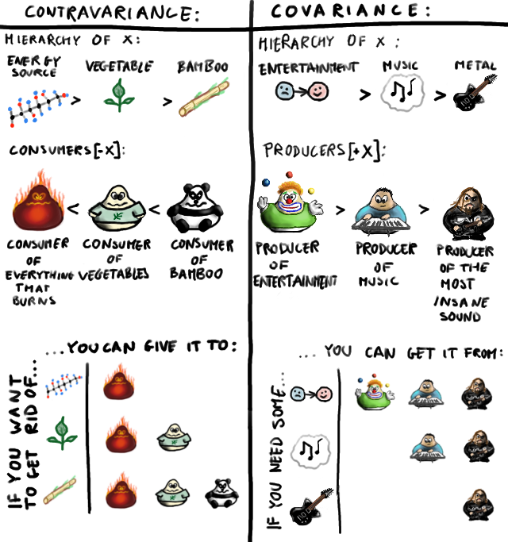

# 이 글은 현재 작성 중입니다.

---

- 이 글은 읽는 사람이 슈퍼타입, 서브타입, 제네릭 등 기본적인 타입 시스템의 개념은 알고 있다는 가정하에 쓰여지는 글이다.

TS를 더 잘 이해하기 위해 타입 시스템을 공부하다가 가변성(variance)이라는 개념을 만났다. 그래서 이와 관련해서 2개의 글을 썼다. [첫번째 글에서는 가변성이라는 게 무엇인지 알아보았다.](https://witch.work/posts/typescript-covariance-theory) 그리고 두 번째 글(이 글)에서는 가변성이라는 개념이 TS에 녹아 있는 부분 몇 가지를 알아볼 것이다.

이 글에서는 전체적으로 TS에서 가변성을 어떻게 다루고 있는지를 알아보고, TS에서 가변성을 다루는 방식에 대해서 흥미로운 사실들을 알아본다.

이 글에서 쓰인 언어는 따로 언급이 없을 경우 TS 문법을 따른다. 

그리고 객체가 변경 가능하지 않다는 immutable의 경우 보통 불변으로 번역되는데, 불변(invariance)와의 혼동을 막기 위해 그냥 `immutable`로 그대로 쓴다. 반대되는 개념인 mutable도 마찬가지로 `mutable`그대로 쓴다.

가변성에 관련된 다른 용어인 공변(covariance), 반변(contravariance), 불변(invariance), 양변(bivariance)의 번역은 홍재민 님의 [타입으로 견고하게 다형성으로 유연하게](https://product.kyobobook.co.kr/detail/S000210397750)의 번역을 따랐다.



# 1. TS에서 가변성 다루기

[TS 탐구생활 - 가변성(Variance)이란 무엇인가](https://witch.work/posts/typescript-covariance-theory)에서는 가변성에 어떤 종류가 있는지 그리고 그걸 정하는 방식에는 어떤 방식이 있는지를 알아보았다. 그럼 TS에서는 어떻게 가변성을 다루고 있을까?

## 1.1. 가변성 기본설정

TS의 타입 시스템이 가변성을 다루는 방식은 기본적으로 다음과 같다.

- 기본적으로 공변(covariant)이다.
- tsconfig.json의 `strictFunctionTypes`옵션이 true이면 함수 매개변수는 반변(contravariant), false이면 양변(bivariant)이다.

따라서 `Array<T>`와 같은 타입들은 공변이다. `number`가 `string | number`의 서브타입이니 `Array<number>`가 `Array<string | number>`의 서브타입인 식이다.

```ts
const numberArray: Array<number> = [1, 2, 3];
// stringNumberArray은 numberArray와 같은 배열 객체를 참조하고 있다
const stringNumberArray: Array<string | number> = numberArray;
```

또한 TS는 구조를 통해서 서브타입을 판단하기 때문에 타입 검사기가 알아서 타입들 간의 서브타입 관계를 결정하고 위의 기본적인 가변성 설정을 적용한다.

다음 예시 코드를 보면 `Person`과 `Student`사이에 아무 서브타입 관계를 지정하지 않았다. 그런데 타입 검사기가 알아서 `Student`가 `Person`의 서브타입이라고 판단하고 `ReadOnlyList<T>`를 공변으로 판단하는 걸 볼 수 있다.

```ts
interface Person{
    age:number;
}

interface Student{
    age:number;
    grade:number;
}

class ReadOnlyList<T>{
    arr:Array<T>;
    get:(idx:number)=>T=(idx:number)=>{return this.arr[idx];};

    constructor(arr:Array<T>){
        this.arr=arr;
    }
}

let list:ReadOnlyList<Person>=new ReadOnlyList<Student>([]);
// list2 할당은 에러 - ReadOnlyList<Person> 타입을 ReadOnlyList<Student>에 할당할 수는 없다
let list2:ReadOnlyList<Student>=new ReadOnlyList<Person>([]);
```

함수 매개변수 타입의 반변에 대해서도 비슷하게 해보면 서브타입 관계가 자동으로 판단되고 잘 작동하는 것을 볼 수 있다.

물론 `extends` 키워드를 이용해서 직접 서브타입 관계를 정의하더라도 잘 작동한다.

## 1.2. 직접 가변성 설정하기

그럼 우리가 [앞선 글](https://witch.work/posts/typescript-covariance-theory)에서 보았던, `in`, `out`키워드로 직접 가변성을 설정하는 방식은 TS에서 사용할 수 없을까?

TS는 TypeScript 4.7에서 제네릭 타입 인자의 가변성을 설정할 수 있는 Variance Annotation을 도입했다. `in`, `out`키워드를 이용해서 설정하며, 제네릭을 사용하는 시점이 아니라 처음 정의하는 시점에 명시해야 한다.

[TS 탐구생활 - 가변성(Variance)이란 무엇인가](https://witch.work/posts/typescript-covariance-theory)에서 다루었듯이 `in`을 사용하면 반변, `out`을 사용하면 공변으로 제네릭 타입 인자의 가변성을 설정할 수 있다. `in out`처럼 둘 다 쓰면 제네릭 타입 인자는 불변이 된다.

```ts
// T는 공변
interface ReadOnlyList<out T>{
    // T가 메서드 리턴 타입으로만 쓰인다
    get:(idx:number)=>T=(idx:number)=>{return this.arr[idx];};

    // ...
}

// T는 반변
interface Store<in T>{
    // T가 메서드 매개변수 타입으로만 쓰인다
    set:(idx:number, value:T)=>void=(idx:number, value:T)=>{this.arr[idx]=value;};

    // ...
}
```

해당 PR을 보면 이런 Variance Annotation은 매개변수의 용도를 알기 쉽게 하고 타입 검사 속도를 높인다고 한다. 그리고 업데이트 문서에서는 이렇게 말하고 있다.

> Variance에 대해 생각할 필요 없이 Type argument가 output으로 사용될 때 `out`, input으로 사용될 때 `in`을 사용하는 것으로 이해하면 된다.

TS에는 원래 이런 키워드가 없었지만 앞서 말했듯이 4.7부터 in, out을 도입하였다. 이는 코드의 가독성과 컴파일러 속도, 정확성을 높이기 위해서였다. 단 여전히 TS 진영에서는 이 키워드를 사용할 때 신중히 고려한 후 사용할 것을 권한다.

여기에 대해서는 [Dogdriip님이 쓰신, TS Variance Annotation에 대한 글](https://driip.me/644e7f06-8591-443e-9fca-44b0ab424fda)을 참고할 수 있다.

# 2. TS의 제네릭이 이렇게 되기까지

왜 TS에서는 함수 매개변수를 제외한 제네릭을 기본적으로 공변으로 하는 걸까?

## 2.1. 다른 언어에서의 제네릭

C#이나 Kotlin, 스칼라와 같은 언어들에서는 제네릭이 기본적으로 불변이다. 그리고 가변성이 필요한 제네릭의 경우 `in`, `out`키워드를 이용해서 직접 가변성을 지정하도록 했다.

예를 들어 Kotlin에서는 `in`, `out`키워드를 사용해서 제네릭 타입 인자의 가변성을 지정할 수 있다. `in`을 사용하면 반변, `out`을 사용하면 공변이다. 아무것도 쓰지 않으면 불변이다.

```kotlin
// Animal은 불변
fun foo(arg: Generic<Animal>){
    arg.walk()
}

// Animal은 공변
fun foo(arg: Generic<out Animal>){
    arg.walk()
}

// Animal은 반변
fun foo(arg: Generic<in Animal>){
    arg.walk()
}
```

`List<T>`, `Comparator<T>`등 언어에서 정의한 제네릭들은 따로 가변성이 지정되어 있다.

## 2.2. TS에 가변성을 직접 지정할 수 없었던 이유

사실 TS에 가변성 지정 기능을 도입하자는 제안은 아주 오래전부터 있어 왔다. [수정해야 할 부분들이 있긴 했지만 가변성에 관한 in, out키워드를 도입하자는 제안이 무려 2014년 12월부터 있었다.](https://github.com/microsoft/TypeScript/issues/1394)

이후에 [`Array<T>`의 공변성 문제 등을 해결할 수 있는 방식으로 개선된 제안(양변 지정자 포함)](https://github.com/microsoft/TypeScript/issues/10717)과 [제네릭을 기본적으로 불변으로 하고 제네릭 타입을 사용하는 위치에서 가변성을 지정하자는 제안](https://github.com/microsoft/TypeScript/issues/10717#issuecomment-523156331)등도 있었다.

하지만 TS 진영에서는 해당 제안을 여러 이유로 오랜 시간 동안 받아들이지 않았다. 2022년이 되어서야 [제네릭 타입 인자의 가변성을 지정할 수 있는 Optional variance annotation을 도입했다.](https://github.com/microsoft/TypeScript/pull/48240)

그럼 TS는 왜 이런 가변성 지정 방식을 받아들이지 않았을까? 다른 언어들처럼 할 수도 있었다. 제네릭을 기본적으로 불변으로 하고 `Array<T>` 같이 특정 가변성을 가지는 것이 자연스러운 제네릭은 `in`, `out`키워드를 이용해서 직접 가변성을 지정하도록 하는 것이다. 사실 가변성을 다루는 데에 있어서는 TS같은 방식보다 이쪽이 더 일반적이다.


TBD


## 2.3. TS의 결정

이렇게 가변성을 따로 지정할 수 있는 방식이 없는 동안 TS에서는 선택을 해야 했다. `Array<T>`와 같은 흔한 제네릭 타입조차 불변으로 만들지, 아니면 제네릭 타입 가변성 기본값을 공변으로 함으로써 타입 시스템에 구멍을 만들더라도 직관적인 제네릭 서브타입 관계를 만들지 사이에서 말이다.

이런 고민들이 담긴 PR 코멘트들이 있는데 예를 들어서 [TS 이슈#6102의 댓글](https://github.com/microsoft/TypeScript/issues/6102#issuecomment-164629334)이 있겠다. 만약 모든 제네릭 타입이 불변이 되면 모든 파생 타입들에 대해서 구조적 타입 검사를 수행해야 하게 되고 이는 컴파일러 성능을 크게 떨어뜨린다. 그리고 `Array<Derived>`가 `Array<Base>`에 할당 불가능하게 되는 등 매우 비직관적인 동작들을 만들게 된다.

여담이지만 'We chatted about this for a while in the team room.'이나 팀의 다른 누군가를 멘션하며 '이 사람과 이 이슈에 대해서 이야기를 해보았는데~'와 같은 문장들을 TS 이슈에서 자주 볼 수 있는데, github에 보이는 코멘트 외에 회의 등을 통해서 결정되는 사항들도 많은 모양이다.

아무튼 TS 진영에서는 타입 시스템에 구멍을 만들더라도 제네릭을 기본적으로 공변 취급하여 직관적인 서브타입 관계를 만드는 것을 택했다. 이후 보겠지만 TS팀은 이런 기본적인 가변성 설정을 그래도 최대한 합리적으로 동작하도록 하는 조치를 취했고, 당시 다른 언어들과 달리 제네릭을 불변에서 벗어나도록 할 수 있는 장치들도 없는 상황에서 이런 선택을 한 것은 합리적이었다고 생각한다.

그리하여 `Array<T>`를 포함한 제네릭(함수 매개변수 제외)은 기본적으로 공변으로 동작하게 되었다.

[또한 TS는 완전히 견고한 타입 시스템을 만드는 것이 목표가 아니고 JS의 동작 방식을 생각하면 그럴 수도 없다](https://github.com/microsoft/TypeScript/issues/9825#issuecomment-306272034)는 것을 생각하면 JS를 타입으로 모델링하는 입장에서 합리적인 선택이었다고 할 수도 있겠다.

다음 섹션들에서는 TS에서 가변성 처리에 있어서 다른 점들을 알아보자.

# 3. TS의 메서드 매개변수 타입의 양변

TS는 기본적으로 공변이며 함수 매개변수에 대해서는 반변이라고 하였다. 그런데 `strictFunctionTypes`옵션이 false일 때는 함수 매개변수가 양변이 된다.

> 양변은 제네릭 타입이 타입 인자의 서브타입 관계를 양쪽으로 모두 사용하는 것이다. `T`가 `U`의 서브타입이면 `Array<T>`는 `Array<U>`의 서브타입이면서 슈퍼타입인 셈이다.

그리고 `strictFunctionTypes`옵션이 true이더라도 매개변수가 양변으로 작동하는 때가 있다. 단축 메서드 선언을 할 경우에 그렇다.

```ts
// strictFunctionTypes가 true일 때
// T는 반변
interface Store<T> {
  set: (item: T) => void;
}

// T는 양변
interface Store<T> {
  set(item: T): void;
}
```

이건 왜 이렇게 되었을까? 당연히 이유가 있고, 심지어 활용되는 부분들도 있다.

## 3.1. 이렇게 된 이유

앞서 본 것과 같은 이유이다. 이는 기본적으로 TS에 가변성을 직접 지정할 수 있는 방법이 없으며 그런 상황에서 타입을 직관적으로 동작하도록 해야 하기 때문에 생기는 문제이다. 

만약 `Dog`이 `Animal`의 서브타입이라고 하자. 그러면 `Array<Dog>`은 `Array<Animal>`의 서브타입인가? 개 객체들이 들어 있는 배열은 동물 객체들이 들어 있는 배열이라고 할 수도 있으므로 당연해 보인다.

그러면 서브타입 관계에 따라, `Array<Dog>`의 모든 멤버가 `Array<Animal>`에 할당 가능해야 한다. 그런데 만약 그렇다면 `(item:Dog)=>number` 타입은 `(item:Animal)=>number` 타입에 할당 가능해야 한다.

`Array.prototype.push`가 바로 `(item:T)=>number`타입이기 때문이다. (`Array.prototype.push`는 사실 새로 만들어진 배열의 크기를 리턴하기 때문에 리턴타입이 `number`이다)

그런데 우리가 지금까지 본 것처럼 함수 매개변수 타입이 반변이라고 하자. 그러면 `(item:Dog)=>number` 타입이 `(item:Animal)=>number` 타입에 할당 가능하다는 것은 `Animal`이 `Dog`에 할당 가능하다는 것이다. 이는 서브타입 관계에 따라 `Array<Dog>`이 `Array<Animal>`에 할당될 수 없다는 모순을 낳는다.

즉 기존처럼 함수 매개변수가 반변으로 강제되는 경우, `Array<subtype>`이 `Array<supertype>`의 서브타입이기 위해서는 `(item:subtype)=>void`가 `(item:supertype)=>void`의 서브타입이어야 한다.

그리고 이는 `supertype`이 `subtype`의 서브타입이어야 한다는 것과 같고 이는 또 `Array<supertype>`이 `Array<subtype>`의 서브타입이어야 한다는 것과 같다. 이는 일반적으로 허용 가능하지 않다.

따라서 이런 함수 매개변수 타입의 특수한 경우를 처리하기 위해서 정확성을 약간 희생하여 함수 매개변수 타입이 양변으로 동작하도록 하였다고 한다.

C#같은 언어에서는 `in`, `out`같은 키워드로 가변성을 지정할 수 있어서 이런 부분을 해결하지만 TS에서는 그런 키워드가 없었다. 또한 그런 키워드가 도입된 지금도, 해당 개념이 그렇게 쉬운 개념이 아니라는 이유로 이를 많이 쓰는 것은 피하고 있다고 생각한다. 따라서 이런 매개변수에 대한 양변 처리가 되었다.

하지만 TS의 설계자의 관점에서는 이런 부분들까지 고려하여 설계해야 하겠지만, 사용자의 입장에서는 함수 매개변수 타입이 양변으로 동작하도록 하는 게 별로 좋은 점은 없다. 그래서 `--strictFunctionTypes`옵션을 true로 설정하면 함수 매개변수 타입이 반변으로 동작하도록 하였다.

물론 그렇게 한다고 해도 단축 메서드 형식으로 선언된 메서드 매개변수 타입은 양변으로 동작한다. `push`같은 메서드들이 이렇게 메서드 형식으로 선언되어 있다. 이렇게 양변으로 동작하는 부분을 남겨둔 이유는 `Array<T>`등이 공변인 게 직관적이기 때문에, 그 동작을 보장하기 위해서라고 한다.

```ts
interface Array<T> {
	// ...
	push(...items: T[]): number;
	// ...
}
```

## 3.2. bivarianceHack

그런데 `strictFunctionTypes`옵션이 true일 때도 함수 매개변수 타입이 양변으로 동작하도록 만드는 방법이 있다.

바로 `bivarianceHack`이다. 대표적으로 리액트의 useRef 콜백이나 이벤트 핸들러 타입 등에서 이를 볼 수 있다.

```ts
// @types/react/index.d.ts
// Bivariance hack for consistent unsoundness with RefObject
type RefCallback<T> = { bivarianceHack(instance: T | null): void }["bivarianceHack"];

type EventHandler<E extends SyntheticEvent<any>> = { bivarianceHack(event: E): void }["bivarianceHack"];
```

이외에 [backbone등의 타입 정의 파일에서도 이를 볼 수 있다.](https://github.com/DefinitelyTyped/DefinitelyTyped/blob/master/types/backbone/index.d.ts)

활용 TODO

## 3.3. UnionToIntersection


## 3.4. 모든 함수의 타입

다음과 같은 코드를 보자. 인수가 never 타입인 함수에 number 타입 함수를 할당하고 있는데 에러가 나지 않는다.

```ts
type funcType=(a:never)=>number;
const foo:funcType=(a:number)=>a+1;
```

우리가 알고 있는 일반적인 타입스크립트의 동작에서는 말이 안되는 일이다. 예를 들어 `never` 배열에 `number` 배열을 할당하려고 하면 에러가 난다.

```ts
type neverArray=never[];
// 에러 발생
// Type 'number' is not assignable to type 'never'.
const arr:neverArray=[1,2,3];
```


# 4. TS에서 immutable을 다루는 방식

위 섹션에서, TS에서 매개변수 타입이 양변이라는 사실과 그렇게 된 이유를 보았다. 결국 타입스크립트에서 명시적으로 제네릭 타입 인자의 가변성을 지정할 수 없다는 사실이 이런 타협을 만들었다. 그런데 애초에 이런 타협을 왜 해야 했는가? 문제를 근본적으로 해결하는 방법은 없는가?

## 4.1. 발상

이외에도 자잘한 이유들이 있겠지만 매개변수 타입을 양변으로 만들어야 했던 근본적인 이유는 JS에 배열과 같은 mutable한 객체가 있었기 때문이다. JS에서는 참조하고 있는 객체를 변경하는 것이 너무 쉽다!

이런 mutable한 객체로 인한 문제는 제네릭 타입 인자의 가변성을 지정할 수 있는 다른 언어에서도 발생한다. 예를 들어 코틀린을 보면 `MutableList<T>`와 `List<T>`가 따로 존재한다. `MutableList<T>`는 `List<T>`를 상속받는데 `MutableList<T>`는 불변이고 `List<T>`는 공변이다. 그리고 사실 mutable한 객체는 가변성으로 인한 문제보다도 더 큰 문제들인 사이드 이펙트나 멀티스레드 환경에서의 문제를 야기한다.

그럼 이런 문제를 완전히 해결할 수는 없을까? 변수는 언제나 immutable이고, mutable한 객체는 아예 안 다루거나 따로 다루는 방식으로 말이다. 이런 방식은 실제로 여러 곳에서 사용되고 있다. 작게는 React에서 객체를 immutable하게 다루는 방식을 생각해 볼 수 있고 더 크게는 함수형 패러다임이 있다. 이 글의 주제는 아니라서 깊게 다루지는 않겠지만 모든 객체를 immutable하게 다루고 순수 함수로 프로그램을 구성하는 것이다.

리액트에서 객체를 immutable하게 다루는 것이 주는 이득이 무엇인지, 함수형으로 프로그래밍하는 것이 뭐가 좋은지 등의 주제들은 이 글의 주제를 벗어난다. 하지만 객체를 immutable하게 다루는 것은 제네릭의 가변성과 관련된 몇몇 흥미로운 논의들을 만든다. 따라서 이 부분에 대해서 다루어보자.

## 4.2. concat

JS에서는 immutable하게 배열을 다루는 메서드들이 몇 개 있다. React에서도 흔히 쓰이는 `concat`, `filter`, `map`등이 그렇다. 이런 배열 메서드들은 새로운 배열을 만들어서 리턴한다. 그럼 이들의 타입은 어떻게 정의되어 있을까? 가장 흥미로운 concat부터 한번 보자. 2가지로 오버로딩되어 있다.

```ts
interface Array<T> {
    concat(...items: ConcatArray<T>[]): T[];
    concat(...items: (T | ConcatArray<T>)[]): T[];
}
```

그리고 `ConcatArray<T>`는 다음과 같이 정의되어 있다.

```ts
interface ConcatArray<T> {
    readonly length: number;
    readonly [n: number]: T;
    join(separator?: string): string;
    slice(start?: number, end?: number): T[];
}
```

`ConcatArray<T>`는 배열에 필요한 속성들과 `join`, `slice`메서드를 가지고 있다. 그리고 완전히 공변이다.

https://witch.work/posts/typescript-concat-type-history


# 참고

홍재민, 타입으로 견고하게 다형성으로 유연하게 https://product.kyobobook.co.kr/detail/S000210397750

공변성과 반공변성은 무엇인가? https://edykim.com/ko/post/what-are-covariance-and-contravariance/

TypeScript 타입 변성(Variance) https://saramkim.github.io/Variance/

타입 시스템에서의 변성(Variance) — 공변성(Covariance)과 반공변성(Contravariance) https://driip.me/d875a384-3fb9-471b-a53b-b3ca52f8238e

TypeScript 4.7에 추가된 Type Parameters의 Variance Annotations https://driip.me/644e7f06-8591-443e-9fca-44b0ab424fda

TypeScript에서의 변성(Variance): 도대체 왜 이렇게 된 거야?
https://driip.me/d230be64-df1d-4e9a-a8c2-cba6bbc0ae15

공변성이란 무엇인가 https://seob.dev/posts/%EA%B3%B5%EB%B3%80%EC%84%B1%EC%9D%B4%EB%9E%80-%EB%AC%B4%EC%97%87%EC%9D%B8%EA%B0%80/

Variant 제네릭 인터페이스 만들기(C#) https://learn.microsoft.com/ko-kr/dotnet/csharp/programming-guide/concepts/covariance-contravariance/creating-variant-generic-interfaces

TS 4.7 Release Notes, Optional Variance Annotations for Type Parameters https://devblogs.microsoft.com/typescript/announcing-typescript-4-7/#optional-variance-annotations-for-type-parameters

TS FAQ, "Why are function parameters bivariant?" https://github.com/Microsoft/TypeScript/wiki/FAQ#why-are-function-parameters-bivariant

Covariance / Contravariance Annotations를 추가해 달라는 이슈 요청과 거절사유 https://github.com/microsoft/TypeScript/issues/1394

Proposal: covariance and contravariance generic type arguments annotations https://github.com/microsoft/TypeScript/issues/10717

Strict function types PR https://github.com/microsoft/TypeScript/pull/18654

allow a flag that turns off covariant parameters when checking function assignability https://github.com/microsoft/TypeScript/issues/6102


  

What is the purpose of bivarianceHack in TypeScript types? https://stackoverflow.com/questions/52667959/what-is-the-purpose-of-bivariancehack-in-typescript-types

Bivariance hack for consistent unsoundness with RefObject https://www.pumpkiinbell.com/blog/react/ref-callback-bivariance-hack

Variance in programming languages https://rubber-duck-typing.com/posts/2018-05-01-variance-in-programming-languages.html

Why are TypeScript arrays covariant? https://stackoverflow.com/questions/60905518/why-are-typescript-arrays-covariant

A fully-sound type system built on top of existing JS syntax is simply a fool's errand. https://github.com/microsoft/TypeScript/issues/9825#issuecomment-306272034

Docs: function parameter bivariance https://github.com/microsoft/TypeScript/issues/14973

Overloads in Array.concat now handle ReadonlyArray - ConcatArray가 등장한 PR https://github.com/microsoft/TypeScript/pull/21462