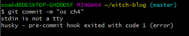
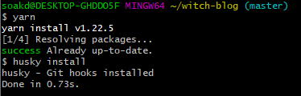

# 1. 문제의 발생

보통 자취방의 노트북에서 작업을 하다가 본가에 와서 잠깐 블로그에 글을 쓰게 되었다. 현재 내 블로그는 gatsby를 사용했고 [이창희](https://xo.dev/)님이 제작한 gatsby-starter-lavendar 테마를 사용하고 있다.

그런데 글을 쓰고 git commit을 하려고 하니 다음과 같은 에러가 발생했다.

# 2. 에러 메시지 탐구

이게 무슨 소리지? 하나하나 해석해 보자. stdin은 당연히 표준 입출력일 것이다. tty는 알아보니 전신을 위한 장치를 뜻하는 Teletype 을 줄인 말이라고 하며 이게 이어져 현재 리눅스의 /dev 디렉토리에서 입출력에 관련된 파일들을 담는 폴더의 이름이 되었다고 한다.

tty에 관한 더 자세한 설명은 밑의 참고 페이지에 있지만 지금 중요한 건 tty가 입출력을 담당한다는 것이다. 따라서 stdin의 상위 개념일 것이다. stdin is not a tty는 뭔가 꼬였다는 걸 알려준다. 하지만 에러 해결엔 별 도움이 되지 않는다..

그러면 밑의 에러 메시지는? husky 또한 찾아보았다. git hook이라고 하여 git과 관련된 어떤 이벤트 발생 시 특정 스크립트를 실행할 수 있는 기능이 있다. 이 중 커밋, 머지, 푸시가 발생하기 전 클라이언트(즉 내 컴퓨터)에서 실행하는 클라이언트 훅을 공유하게 해 주는 npm 라이브러리가 husky이다.

에러 메시지도 딱 그에 어울리는 내용이다. 커밋 전에 실행되는 git hook이 어떤 오류로 인해 종료되었다는 것이다.

추측은 다음과 같다. husky의 pre-commit hook이 실행하는 쉘스크립트 파일에 echo를 이용하는 내용이 있었고 이는 tty를 이용한다. 그런데 내 노트북(맥os)에서 사용하는 tty와 본가의 윈도우 데스크탑에서 사용하는 tty가 달라서 일어나는 문제로 추측한다.

`tty` 명령어를 이용해서 각 컴퓨터에서 어떤 tty 폴더를 사용하나 봤더니 맥에서는 `dev/ttys001`이 뜨고 윈도우의 git bash에서는 `dev/pty0`이 떴다. 그 차이로 인해 husky의 pre-commit hook 실행에서 뭔가 에러가 발생한 게 아닐까 한다.

# 3. 해결

방법은 간단하다. 그냥 husky를 지우고 다시 깔면 된다. `.husky` 폴더를 지운 후 `yarn` 명령으로 husky를 재설치했다.

husky의 pre-commit hook이 조금 변경되었다. 하지만 어차피 husky는 git에서 코드를 커밋하거나 푸시할 때마다 lint checking 등을 위해서 많이 사용된다. 나는 블로그에 새로운 글만 쓸 뿐 딱히 코드를 수정하지 않으므로 아무래도 좋다.

게다가 블로그 코드를 고치게 된다면 아마 노트북으로 작업할 텐데 본가 데스크탑의 husky폴더는 `.gitignore`가 설정되어 있어서, 내 노트북에는 기존의 `.husky`폴더가 잘 남아 있다. 따라서 괜찮다...

아무튼 이렇게 한 결과 git commit, push가 잘 이루어졌다.

# 참고

tty는 무엇인가? [TTY | Introduction](https://mug896.github.io/bash-shell/tty.html)

husky가 뭘까? [husky 로 git hook 하자 | 가비아 라이브러리](https://library.gabia.com/contents/8492/)
