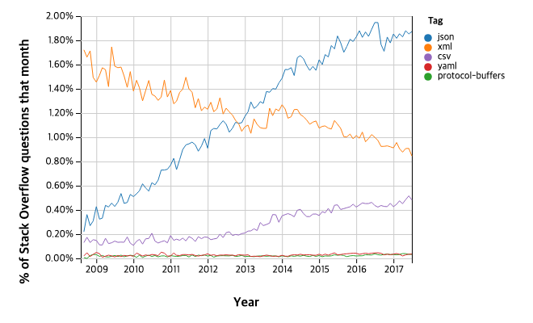

이 글은 Two-Bit History의 "The Rise and Rise of JSON"을 원작자의 허락 하에 번역한 것입니다. 원문은 [여기](https://twobithistory.org/2017/09/21/the-rise-and-rise-of-json.html)에서 읽을 수 있습니다.

# The Rise and Rise of JSON

JSON은 세계를 장악했다. 오늘날 인터넷을 통해 통신하는 애플리케이션들은 대부분 JSON을 사용한다. 가장 널리 쓰이고 있는 API(주로 구글, 페이스북, 트위터 같은 주요 기업들이 제공하는 API로 구성되어 있다) 10개 중 1개만이 JSON이 아닌 XML로 데이터를 제공한다.[^1] 트위터는 2013년 API의 새 버전을 발표하면서 XML을 폐기하고 JSON만을 사용하도록 전환했다. 프로그래머들을 위한 질의응답 사이트인 Stack Overflow에 따르면 JSON에 관한 질문이 다른 어떤 데이터 교환 형식에 대한 질문보다도 많다.[^2]



XML도 여전히 많은 곳에서 사용되고 있다. 웹에서는 SVG, RSS와 Atom 피드에 XML이 사용된다. 안드로이드 개발자들은 앱이 사용자 승인이 필요한 권한을 요구함을 선언할 때 XML로 작성된 앱 매니페스트를 사용한다. JSON 대신 사용할 수 있는 게 XML만 있는 건 아니다. 일부 개발자들은 YAML이나 구글의 Protocol Buffers 같은 기술을 사용하기도 한다. 그러나 이들은 JSON만큼 대중적이지 않다. 현재로서는 JSON이 인터넷 상에서 프로그램 간 통신을 위한 표준 포맷으로 자리 잡은 상황이다.

불과 2005년만 해도 웹 생태계는 "비동기 JavaScript와 XML(Ajax)"의 가능성에 열광하고 있었다. "비동기 JavaScript와 JSON"이 *아니었다.* 이런 것을 고려할 때 JSON의 지배적인 위치는 놀랍다. 물론 이러한 차이가 두 포맷의 상대적인 인기 때문이 아니라 "AJAX"라는 약어가 "AJAJ"보다는 더 매력적으로 보였다는 단순한 이유 때문일 수도 있다. 하지만 2005년에도 몇몇 사람들이 XML 대신 JSON을 사용하기 시작했더라도 당시에는 그 수가 아직 많지 않았다. 왜 XML이 그렇게 가파르게 추락했고 불과 10여년 후에 "비동기 JavaScript와 XML"이라는 용어가 시대착오적이 되었는지 궁금해진다. 이 10년 동안 무슨 일이 있었을까? 어떻게 해서 JSON이 그렇게 많은 애플리케이션에서 XML을 대체하게 된 걸까? 그리고 전 세계의 엔지니어와 시스템이 사용하는 이 데이터 형식은 도대체 누가 만든 것일까?

# JSON의 탄생

2001년 4월 최초의 JSON 메시지가 전송되었다. 이건 컴퓨팅의 역사에서 중요한 순간이었다. 이 메시지는 베이 에어리어(Bay-Area)의 한 차고에서 전송되었다. State Software라는 기술 컨설팅 회사의 공동 창립자인 더글라스 크락포드(Douglas Crockford)와 칩 모닝스타(Chip Morningstar)는 모닝스타의 차고에서 모여 그들의 아이디어를 테스트했다.

크락포드와 모닝스타는 "AJAX"라는 용어가 탄생하기도 훨씬 전부터 AJAX 애플리케이션을 구축하려고 시도하고 있었다. 그들이 시도하고 있던 기술에 필요한 브라우저 지원은 좋지 않았다. 그들은 초기 페이지 로드 이후에도 애플리케이션에 데이터를 전달하고 싶었지만, 이런 동작을 그들이 지원하고자 했던 모든 브라우저에서 다 작동하도록 구현할 수 있는 방법을 찾지 못했다.

오늘날에는 믿기 어려울 수 있지만 2001년 당시에는 인터넷 익스플로러가 웹 브라우저의 최첨단 기술을 대표했다. 이미 1999년부터 인터넷 익스플로러 5는 XMLHttpRequest의 원시적인 형태를 지원했으며 프로그래머들은 이를 ActiveX라는 프레임워크를 통해 사용할 수 있었다. 크락포드와 모닝스타는 이 기술을 사용해 애플리케이션의 데이터를 초기 페이지 로드 이후에도 가져올 수 있었다. 하지만 그들이 지원하고자 했던 또다른 브라우저인 넷스케이프 4에서는 같은 방법을 사용할 수 없었다. 그래서 그들은 두 브라우저에서 모두 작동하는 별도의 시스템을 사용해야 했다.

최초의 JSON 메시지는 다음과 같은 모습이었다.

```html
<html><head><script>
    document.domain = 'fudco';
    parent.session.receive(
        { to: "session", do: "test",
          text: "Hello world" }
    )
</script></head></html>
```

이 메시지에서 우리가 알고 있는 JSON과 유사한 부분은 일부에 불과하다. 사실 메시지 자체는 HTML 문서에 일부 JavaScript 코드가 포함된 형태였다. JSON과 닮은 부분은 `receive()` 함수에 전달되는 JavaScript 객체 리터럴뿐이었다.

크락포드와 모닝스타는 HTML 프레임을 이용한 트릭으로 데이터를 전송할 수 있다는 아이디어를 떠올렸다. 그들은 프레임이 위와 같은 HTML 문서를 반환하는 페이지의 URL을 가리키도록 지정했다. 이 HTML 문서를 수신하면 JavaScript 코드가 실행되고 따라서 객체 리터럴을 애플리케이션에 다시 전달할 수 있었다. 이 방식은 하위 창이 상위 창에 접근하는 것을 제한하는 브라우저의 보안 정책을 우회할 수 있는 방법이었다. 크락포드와 모닝스타는 문서의 도메인을 명시적으로 설정하여 이를 구현했다. (프레임 기반의 이 테크닉은 hidden frame 기법이라고도 불리는데 XMLHttpRequest가 널리 구현되기 전인 1990년대 후반에 자주 사용되었다.[^3])

최초의 JSON 메시지에서 놀라운 점은 이게 새로운 데이터 형식의 첫 사용 사례라는 것이 명백히 드러나지 않는다는 것이다. 이건 그냥 JavaScript 코드일 뿐이었다! 사실 JavaScript를 이런 방식으로 사용하는 건 너무나 직관적이었고, 크락포드 자신도 이 방법을 사용한 게 자신이 최초가 아니라고 말했던 바 있다. 크락포드는 1996년에 이미 넷스케이프의 누군가가 정보의 교환을 위해 JavaScript 배열 리터럴을 사용하고 있었다고 말했다. 이 메시지는 그저 JavaScript였기 때문에 이를 해석하기 위해 어떤 추가적인 파싱 과정도 필요하지 않다. JavaScript 인터프리터가 모든 작업을 처리할 수 있다.

사실 최초의 JSON 메시지는 JavaScript 인터프리터에서 오류를 일으켰다. JavaScript는 예약어를 매우 많이 가지고 있었고(ECMAScript 6 기준으로는 64개의 예약어가 있다) 크락포드와 모닝스타는 자신들도 모르게 메시지에 이 예약어 중 하나를 사용해 버렸다. 그들은 `do`를 객체의 키로 사용했는데 `do`는 JavaScript의 예약어였다. JavaScript의 예약어가 너무 많았기 때문에 크락포드는 이 모든 예약어들을 사용하는 걸 피하기보다는 모든 JSON 키를 따옴표로 감싸는 규칙을 강제하기로 결정했다. JavaScript 인터프리터는 객체의 키를 따옴표로 감쌀 경우 이를 단순한 문자열로 인식하게 된다. 이렇게 하면 예약어를 키로 사용하는 것도 가능하다. 이것이 오늘날 JSON의 키를 반드시 따옴표로 감싸야 하는 이유이다.

크락포드와 모닝스타는 자신들이 개발한 포맷이 모든 종류의 애플리케이션에 사용할 수 있는 범용 포맷이라는 것을 깨달았다. 그들은 이 포맷에 JavaScript Markup Language이라는 뜻인 JSML이라는 이름을 붙이라고 했으나 이미 Java Speech Markup Language이라는 기술이 같은 약어(JSML)를 사용하고 있었다. 그들은 결국 JavaScript Object Notation, 즉 JSON이라는 이름으로 변경했다. 그들은 클라이언트들에게 이 포맷을 제안했지만 당시의 클라이언트들은 공식적인 사양이 없는 새로운 기술을 사용하는 데 주저했다. 이를 해결하기 위해 크락포드는 직접 사양을 작성하기로 결심했다.

2002년 크락포드는 JSON.org라는 도메인을 구매하고 JSON의 문법과 파서의 예시 구현을 올렸다. 이 웹사이트는 여전히 운영 중이고 이제는 2013년에 승인된 JSON의 ECMA 표준에 대한 링크도 눈에 잘 띄게 추가되어 있다. 크락포드는 이 웹사이트의 공개 이후 JSON을 적극적으로 홍보하지는 않았다. 그런데 곧 많은 사람들이 다양한 프로그래밍 언어로 구현한 JSON 파서를 제출하기 시작했다. JSON의 기원이 JavaScript와 연결되어 있다는 것은 분명했지만 이 포맷이 어떤 프로그래밍 언어 사이에서도 데이터를 교환하는 데 적절하다는 게 명백해졌다.

# Doing AJAX Wrong

2005년 JSON은 폭발적인 인기를 누렸다. 그 해 웹 디자이너이자 개발자인 제시 제임스 가렛(Jesse James Garrett)은 그의 블로그 게시글에서 "AJAX"라는 용어를 만들어냈다. 가렛은 AJAX가 단일한 새로운 기술이 아니라 "각각 독립적으로 발전해 온 여러 기술들이 강력하고 새로운 방식으로 결합된 개념"[^5]이라고 조심스럽게 강조했다. 가렛은 웹 애플리케이션 개발에서 인기를 얻고 있던 새로운 접근 방식을 관찰하고 AJAX라는 이름을 붙인 것이다. 그의 블로그 게시글에서는 이어서 JavaScript와 XMLHttpRequest를 활용하여 기존 웹 페이지보다 더 반응성이 높고 상태를 유지할 수 있는 새로운 형태의 애플리케이션을 구축하는 방법이 설명되었다. 개럿은 이미 AJAX 기법을 사용하고 있었던 웹사이트의 예시로 Gmail과 Flickr를 언급했다.

"AJAX"에서 "X"는 XML을 의미한다. 하지만 가렛은 후속 Q&A 게시글에서 JSON을 XML의 완전한 대체재로 사용할 수 있다고 언급했다. 그는 이렇게 썼다.

> "XML은 AJAX 클라이언트에서 데이터를 주고받는 가장 발전된 수단이다. 하지만 JavaScript Object Notation 같은 기술이나 그와 유사한 데이터 구조화 방식을 사용해도 같은 효과를 얻을 수 있다."[^6]

개발자들은 AJAX 애플리케이션을 구축할 때 JSON을 사용하는 게 쉽다는 것을 알게 되었고 많은 개발자들이 XML보다 JSON을 선호하게 되었다. 그래서 아이러니하게도 AJAX에 대한 관심이 JSON의 인기를 폭발적으로 증가시켰다. JSON이 블로그 생태계에서 주목받기 시작한 것도 이 무렵이다.

2006년 다작하는 블로거이자 RSS와 XML-RPC와 같은 XML 기반 기술의 창시자인 데이브 위너(Dave Winer)는 JSON이 아무런 타당한 이유도 없이 XML을 재발명하고 있다고 비판했다. 데이터 교환 포맷 간의 경쟁이 살해 위협까지 불러일으킬 것이라고는 상상하기 어렵지만, 위너는 이렇게 썼다.

> 물론 [JSON]을 파싱하는 코드를 저도 작성할 수 있습니다. 하지만 대체 XML이 뭐가 부족했길래 XML을 이렇게 다시 만들어야 했을까요?(그 이유를 한번 듣고 싶네요) 대체 누가 이런 어처구니없는 모조품을 만들었을까요? 지금 당장 나무에 그들을 매달아야겠습니다.

위너의 좌절감은 쉽게 이해할 수 있다. XML은 널리 사랑받는 기술이 아니었다. 심지어 위너 본인조차도 XML을 사랑하지 않는다고 말한 바 있다.[^8] 하지만 XML은 누구나, 상상 가능한 거의 모든 목적으로 사용할 수 있는 시스템으로 설계되었다. 그런 의도를 가진 XML은 특정 애플리케이션에 맞는 도메인 특화 언어를 정의할 수 있도록 하는 메타 언어였다. 웹 피드 기술인 RSS와 Simple Object Access Protocol(SOAP)가 그 예시이다. 위너는 공통의 데이터 교환 형식을 사용하는 것이 가져올 수 있는 다양한 이점을 고려할 때, 모두가 합의할 수 있는 표준을 마련하는 것이 중요하다고 생각했다. 그는 XML이 모든 사람의 요구를 충족시킬 수 있도록 유연성을 갖춰야 한다고 생각했다. 그런데 JSON이 등장했다. 위너가 보기에 JSON은 XML을 유연하게 만들어 주었던 복잡한 요소들을 버린 데에 비해 특별한 이점을 제공하지는 않았다.

크락포드는 위너의 블로그 게시글을 보고 댓글을 남겼다. JSON이 XML을 재발명한 것이라는 비판에 대해 크록포드는 이렇게 응수했다. "바퀴를 다시 발명하는 것의 좋은 점은, 이번엔 둥근 바퀴를 발명할 수 있다는 거죠."

# JSON vs XML

2014년 JSON은 ECMA 표준과 RFC 문서를 통해 공식적인 명세로 자리잡았다. JSON은 고유한 MIME 타입도 갖추게 되었다. JSON은 이제 명실상부한 '빅 리그'에 진입한 것이었다.

왜 JSON이 XML보다 훨씬 더 큰 인기를 얻었을까?

크락포드는 JSON.org에 JSON이 XML보다 더 우수한 이유를 요약해 놓았다. 그는 JSON의 구문이 간결하고 구조가 예측 가능하기 때문에, 사람과 기계 모두가 더 쉽게 이해할 수 있다고 설명했다.[^10] 다른 블로거들은 XML의 장황함과 "꺾쇠괄호 세금(the angle bracket tax)"에 주목했다.[^11] XML의 각 여는 태그(opening tag)들은 반드시 닫는 태그(closing tag)와 짝을 이루어야 한다. 이로 인해 XML 문서는 많은 중복 정보를 포함하게 된다. 따라서 압축되지 않은 경우 XML 문서는 동일한 데이터를 담고 있는 JSON 문서보다 훨씬 더 큰 크기를 가진다. 게다가 이러한 중복 정보는 XML 문서를 읽기 어렵게 만든다.

크락포드는 JSON의 또 다른 큰 장점으로, JSON이 데이터 교환 형식으로 설계되었다는 점을 들었다.[^12] JSON은 처음부터 프로그램 간에 구조화된 정보를 전달하는 것을 목표로 탄생했다. 반면 XML은 똑같이 구조화된 정보 전달을 위해 사용되기는 했지만 원래는 문서 마크업 언어로 설계되었다. XML은 SGML(Standard Generalized Markup Language)에서 발전한 것이며 또 SGML은 LaTeX와 유사한 문서 처리 시스템으로 설계되었던 Scribe라는 마크업 언어에서 진화한 것이다. XML에서도 태그는 "혼합 콘텐츠"를 포함할 수 있었는데 이 혼합 콘텐츠란 단어 또는 한 구절을 감싸는 인라인 태그가 들어 있는 텍스트였다. 이런 방식은 편집자가 원고에 빨간 펜이나 파란 펜으로 수정 사항을 표시하는 과정과 비슷하다. 이건 마크업 언어에 대한 중요한 비유라고 할 수 있다. 반면 JSON은 혼합 콘텐츠를 지원하지 않았지만 그 대신 훨씬 더 단순한 구조를 갖게 되었다. 트리 구조를 통해서 문서를 훌륭하게 모델링할 수 있지만 바로 그 문서 개념을 포기함으로써 크락포드는 JSON을 딕셔너리와 배열만으로 제한할 수 있었다. 딕셔너리와 배열은 모든 프로그래머가 프로그램을 만들 때 사용하는 기본적이고 익숙한 데이터 구조이다.

마지막으로, 사람들이 XML을 싫어한 이유는 XML이 혼란스러웠기 때문이라고 개인적으로 생각한다. XML이 혼란스러웠던 이유는 너무 다양한 변형이 존재했기 때문으로 보인다. 처음 XML을 접하는 사람이 XML 그 자체와 RSS, ATOM, SOAP, SVG와 같은 서브 언어들을 명확히 구분하는 건 쉽지 않다. 일반적인 XML 문서의 첫 줄에는 XML 버전이 명시되고 해당 XML 문서가 준수해야 할 특정 서브 언어가 이어진다. 여기서부터 이미 복잡성이 시작된다. 반면 JSON은 새로운 JSON 명세가 작성될 필요가 없을 정도로 직관적이다. XML의 설계자들은 모든 필요를 만족시킬 수 있는 하나의 데이터 교환 형식을 만들고자 했다. 하지만 그 과정에서 그들은 오버엔지니어링이라는 유명한 함정에 빠지고 말았다. XML은 너무 범용적이었기에 간단한 작업에 쓰기 힘들었다.

2000년 HTML을 XML 표준에 맞추려는 캠페인이 시작되었다. XML 표준을 준수하는 HTML 명세가 발표되었고 이는 이후 XHTML로 불리게 되었다. 일부 브라우저 벤더들은 즉시 이 새로운 표준을 지원하기 시작했으나, 곧 명확해진 사실이 하나 있었다. 대다수의 HTML 사용자들은 기존 방식을 바꾸려 하지 않았다. XHTML 표준은 기존의 HTML보다 더 엄격한 유효성 검사를 요구했다. 하지만 HTML의 느슨한 규칙에 의존하는 웹사이트가 너무 많았다. 결국 XHTML의 두 번째 버전을 작성하려는 시도는 2009년 중단되었고 HTML의 미래는 HTML5로 확정되었다. HTML5는 XML 호환성을 강요하지 않는 표준이었다.

XHTML이 성공했다면 XML은 그 설계자들이 꿈꾸던 대로 범용 데이터 포맷이 되었을지도 모른다. HTML 문서와 API 응답이 정확히 같은 구조를 갖는 걸 상상해보라. 그런 세상에서는 JSON이 지금처럼 만능 데이터 교환 형식으로 자리잡지 못했을지도 모른다. 하지만 나는 XHTML의 실패를 XML 진영의 일종의 사상적 패배로 해석한다. XML이 HTML에 가장 적합한 도구가 아니었다면 다른 애플리케이션에 대해서도 XML보다 더 나은 도구가 있었을 것이다. 우리가 살고 있는 세계에서는 JSON과 같이 단순하고 명확한 목적을 갖고 설계된 포맷이 성공을 거두는 게 어쩌면 당연한 일이다.

*만약 이 글이 재미있었다면, 비슷한 글이 4주마다 올라옵니다! 트위터에서 @TwoBitHistory를 팔로우하거나, RSS 피드를 구독하여 새로운 글이 올라올 때 놓치지 않도록 하세요.*

[^1]: http://www.cs.tufts.edu/comp/150IDS/final_papers/tstras01.1/FinalReport/FinalReport.html#software (링크 깨짐)

[^2]: https://trends.stackoverflow.co/?tags=json,xml,protocol-buffers,yaml,csv

[^3]: Zakas, Nicholas C., et al. "What Is Ajax?" Professional Ajax, 2nd ed., Wiley, 2007

[^4]: https://youtu.be/-C-JoyNuQJs?t=32s

[^5]: (원문의 링크가 깨져서 아카이브로 대체) [Ajax: A New Approach to Web Applications](https://designftw.mit.edu/lectures/apis/ajax_adaptive_path.pdf)

[^6]: ibid.

[^7]: http://scripting.com/2006/12/20.html

[^8]: https://blogoscoped.com/archive/2009-03-05-n15.html

[^9]: https://scripting.wordpress.com/2006/12/20/scripting-news-for-12202006/#comment-26383

[^10]: https://www.json.org/xml.html

[^11]: https://blog.codinghorror.com/xml-the-angle-bracket-tax/

[^12]: https://www.youtube.com/watch?v=-C-JoyNuQJs&t=2030s