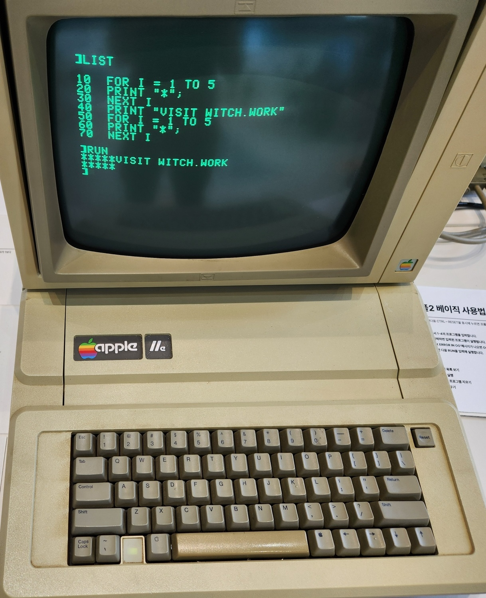

이 글은 Two-Bit History의 "Codecademy vs. The BBC Micro"을 원작자의 허락 하에 번역한 것입니다. 원문은 [여기](https://twobithistory.org/2019/03/31/bbc-micro.html)에서 읽을 수 있습니다. 원문의 깨진 링크는 동작하는 것으로 교체하였습니다.

# Codecademy vs. The BBC Micro

컴퓨터는 처음 나온 이래 수십 년간 큰 기업에서나 다룰 수 있었던 신비롭고 거대한 기계였다. 그런데 1970년대 후반, 컴퓨터는 갑자기 보통 사람도 사서 집에 가져갈 수 있는 물건이 되었다. 소수의 열정 있는 사람들은 이게 얼마나 대단한 일인지 깨닫고 부리나케 자신의 컴퓨터를 구입했다. 하지만 훨씬 더 많은 사람들에게 마이크로컴퓨터의 등장은 미래에 대한 무력한 불안감을 불러일으켰다.

당시 한 잡지의 광고는 가정용 컴퓨터가 "당신의 아이에게 학교에서 불공정한 이득을 줄 것"이라고 장담했다. 광고에는 멋진 블레이저를 입고 넥타이를 맨 소년이 질문에 답하기 위해 열심히 손을 들고 있고 그 뒤에서 우둔한 급우들이 시무룩하게 쳐다보는 모습이 담겨있었다. 이런 광고들은 세상이 빠르게 변하고 있고 이 위압적인 신제품을 사용하는 법을 즉시 배우지 않으면 당신과 당신 가족이 뒤처질 거라고 암시했다.

영국에서는 이러한 불안이 국가 경쟁력에 대한 정부 최고위층의 우려로까지 전이되었다. 1970년대는 전반적으로 영국에게 실망스러운 10년이었다. 인플레이션과 실업률이 둘 다 높았다. 연속되는 파업으로 런던은 계속해서 정전을 겪었다. 1979년의 영국 정부 보고서는 컴퓨팅 기술 트렌드를 따라잡지 못하면 "우리의 산업적 능력을 형편없게 하는 요인을 하나 더 추가하게 될 것"이라고 우려했다.[^1] 영국은 이미 컴퓨팅 분야에서 뒤처진 것처럼 보였다. 위대한 컴퓨터 기업들은 전부 미국 기업이었고 집적 회로는 일본과 대만에서 조립되고 있었다.

정부 지원을 받는 공영 방송사 BBC는 영국인들이 컴퓨터에 대해 갖는 거부감을 극복하도록 도와서 영국의 국가 경쟁력 문제를 해결하겠다고 결정했다. 대담한 결정이었다. BBC는 *컴퓨터 리터러시 프로젝트(Computer Literacy Project)*를 시작했다. 이건 여러 TV 시리즈, 몇 권의 책, 지원 그룹들의 네트워크, BBC Micro라고 알려진 특별히 제작된 마이크로컴퓨터를 포함하는 여러 갈래의 교육 활동이었다. 프로젝트는 아주 성공적이었다. 1983년 BYTE Magazine(역주: 1970년대 후반부터 1980년대를 풍미한 마이크로컴퓨터 잡지. 마이크로소프트의 첫 광고, Smalltalk의 최초 공개 등 초기 컴퓨팅 역사의 많은 걸 함께했다)에서는 "마이크로컴퓨터에 관심을 가지고 있는 사람들의 비율이 미국보다 영국에서 더 높다"고 쓸 정도였다.[^2]

편집자는 영국의 제5회 개인 컴퓨터 박람회(Personal Computer World Show)에 참여한 사람이 그해 미국의 서부 해안 컴퓨터 박람회(West Coast Computer Faire)에 참여한 사람보다 더 많았다는 것에 놀라워했다. 영국 인구의 6분의 1 이상이 *컴퓨터 리터러시 프로젝트*를 위해 제작된 첫 번째 시리즈의 에피소드를 시청했다. 궁극적으로 150만 대의 BBC Micro가 판매되었습니다.[^3]

*컴퓨터 리터러시 프로젝트*를 위해 제작된 모든 TV 시리즈에 출판된 모든 자료까지 담은 [아카이브](https://clp.bbcrewind.co.uk/)가 2018년 웹에 공개되었다. 나는 그 TV 시리즈를 보면서 1980년대 초반 컴퓨팅에 대해 배우는 게 어땠을지를 상상하며 굉장한 즐거움을 느꼈다. 하지만 더 흥미로웠던 것은 컴퓨팅이 어떻게 *가르쳐졌는가* 하는 점이다. 오늘날에도 우리는 기술이 사람들을 뒤처지게 만드는 것에 대해 여전히 걱정한다. 부유한 기술 기업가들과 정부는 아이들에게 "코딩하는 법"을 가르치기 위해 많은 돈을 쓴다. 웹사이트와 상호작용하는 방식으로 코딩을 배울 수 있는 Codecademy같은 사이트도 생겼다. 새로운 기술을 활용한 방식이다. 당연히 이러한 최첨단의 접근방식이 촌스러운 1980년대 TV 시리즈보다 더 효과적일 거라고 생각할 수 있다. 하지만 정말 그럴까?

# The Computer Literacy Project

마이크로컴퓨터 혁명은 1975년 [Altair 8800](https://witch.work/ko/translations/dawn-of-the-microcomputer-altair-8800)의 출시와 함께 시작되었다. 불과 2년 후, Apple II, TRS-80, 그리고 Commodore PET(역주: 1970년대 후반의 마이크로컴퓨터 시장을 휩쓸었던 대표적인 기종들)가 모두 출시되었다. 새로운 컴퓨터의 판매량이 폭발적으로 증가했다. 1978년 BBC는 이 새로운 기계들이 가져올 극적인 사회 변화를 "Now the Chips Are Down"이라는 다큐멘터리에서 탐구했다.

당시의 마이크로컴퓨터 중 하나인 Apple II

이 다큐멘터리는 경각심을 불러일으켰다. 첫 5분 동안 내레이터는 소형 전자기기가 "우리의 생활 방식을 혁명적으로 바꿀 것"이라고 설명합니다. 으스스한 신시사이저 음악이 흐르고 화면에 확대된 마이크로프로세서 주위를 초록색 전기 펄스가 춤추는 가운데, 내레이터는 새로운 칩에 대해 이야기한다. "일본이 조선업을 보기하는 이유, 그리고 우리 아이들이 일자리 없이 성장하게 될 이유"라고 말이다. 다큐멘터리는 계속해서 자동차 조립 자동화에 로봇이 어떻게 사용되고 있는지, 유럽 시계 산업이 미국의 디지털 시계 제조업체들에게 어떻게 밀려났는지를 탐구한다. 그리고 대량 실업의 미래를 대비하기 위해 더 많은 조치를 취하지 않는 영국 정부를 질책한다.

이 다큐멘터리는 영국 내각[^4]에서도 상영되었다고 전해진다. 산업부(Department of Industry)와 인력 서비스 위원회(Manpower Services Commission)를 포함한 여러 정부 기관이 영국 대중 사이에서 컴퓨터에 대한 인식을 높이는 데 관심을 갖게 되었다. 인력 서비스 위원회는 BBC 교육부 팀이 일본, 미국 및 기타 국가로 실태 조사 여행을 떠날 수 있도록 자금을 제공했다. 그 연구팀은 소형 전자기기가 실제로 제조업, 노사 관계, 사무 업무에 가져다줄 중대한 변화를 목록화한 보고서를 작성했다. 1979년 말 BBC는 영국인들이 "컴퓨터를 사용하고 제어하는 방법을 배우고 컴퓨터에 지배당한다고 느끼지 않도록"[^5] 돕는 10부작 TV 시리즈를 제작하기로 결정한다. 이 프로젝트는 결국 *Adult Literacy Project*와 유사한 멀티미디어 활동이 되었다. *Adult Literacy Project*는 200만 명의 사람들이 읽기 능력을 향상시키는 데에 도움을 준 이전의 BBC 프로젝트였다. TV 시리즈와 그걸 보충하는 과정들이 포함되어 있었다.

*컴퓨터 리터러시 프로젝트*의 프로듀서들은 집에 마이크로컴퓨터가 있는 시청자들이 직접 시도해볼 수 있는 "실습" 예제를 TV 시리즈에 포함시키고 싶어했다. 이런 예제는 BASIC으로 작성되어야 했다. BASIC은 거의 모든 마이크로컴퓨터에서 사용하는 언어(실제로는 전체 쉘)였기 때문이다. 하지만 프로듀서들은 까다로운 문제를 마주했다. 마이크로컴퓨터 제조업체들은 각자의 고유한 BASIC 방언들을 갖고 있었다. 기존의 어떤 방언을 선택해도 시청자 중 상당 부분을 소외시키는 게 불가피했다. 유일한 진짜 해결책은 새로운 BASIC, 즉 BBC BASIC을 만들고 그에 맞는 마이크로컴퓨터를 함께 만드는 거였다. 그렇게 하면 영국 시청자들은 새로운 마이크로컴퓨터를 구입해서 소프트웨어나 하드웨어의 차이를 걱정하지 않고 따라 할 수 있을 거였다.

BBC의 TV 프로듀서와 진행자들은 직접 마이크로컴퓨터를 만들 수는 없었다. 그래서 그들은 생각한 컴퓨터의 사양을 정리하고 영국 마이크로컴퓨터 회사들을 초청하여 요구사항을 충족하는 새로운 기계를 제안하도록 했다. 그 사양은 상당히 강력한 성능의 컴퓨터를 요구했다. BBC 프로듀서들은 해당 기기가 실질적이고 유용한 애플리케이션들을 실행할 수 있어야 한다고 생각했기 때문이다. 또한 *컴퓨터 리터러시 프로젝트*의 기술 자문들은 국가 전체에 가르칠 BASIC 방언이라면 좋은 걸로 해야 한다고 제안했다(정확히 그렇게 표현하지는 않았을 수도 있지만, 그들이 생각했던 바는 그랬을 것이다). BBC BASIC은 재귀와 지역 변수를 허용함으로써 BASIC의 일반적인 단점 중 일부를 보완했다.[^6]

BBC는 결국 케임브리지에 본사를 둔 Acorn Computers라는 회사가 BBC Micro를 만들도록 결정했다. Acorn을 선택하면서 BBC는 Sinclair Research라는 회사를 운영하던 Clive Sinclair의 제안을 거절했다. Sinclair Research는 1980년 Sinclair ZX80으로 일반 대중을 상대로 하는 마이크로컴퓨터 시장을 영국에 가져왔다. Sinclair의 새 컴퓨터인 ZX81은 저렴했지만 BBC의 목적에 부합하기에는 부족했다. Acorn의 새로운 프로토타입 컴퓨터는 내부에서는 Proton이라고 불렸는데 더 비쌌지만 더 강력하고 확장 가능했다. BBC는 감명받았다. Proton은 Proton이라는 이름으로 마케팅되거나 판매되지 않았다. 대신 1981년 12월에 BBC Micro로 출시되었고, 애칭으로 "The Beeb"라고도 불렸습니다. 16k 버전은 235파운드(역주: 오늘날 기준으로 원화 약 220만원 상당), 32k버전은 335파운드에 구매할 수 있었다.

1980년 Acorn은 영국 컴퓨팅 산업계에서 비주류였다. 하지만 BBC Micro가 회사의 기반을 확립하는 데 도움을 줬다. 오늘날 세계에서 가장 인기 있는 마이크로프로세서 명령어 셋은 ARM 아키텍처다. "ARM"은 현재 "Advanced RISC Machine"을 의미하지만, 원래는 "Acorn RISC Machine"을 의미했다. 이 아키텍처를 만든 회사 ARM Holdings는 1990년 Acorn에서 분사했다.

캘리포니아 마운틴뷰의 컴퓨터 역사 박물관에서 찍은 BBC Micro. 원문 작성자가 직접 찍었다고 한다.

# 컴퓨터 프로그램

*컴퓨터 리터러시 프로젝트*의 일환으로 여러 TV 시리즈가 제작되었다. 그중 첫번째는 The Computer Programme이라는 10부작 시리즈였다. 이 시리즈는 1982년 초에 10주에 걸쳐 방송되었다. 매주 평일 저녁 방송을 100만 명이 시청했고, 일요일과 월요일 오후 재방송을 25만 명이 시청했다.

이 쇼는 Chris Serle과 Ian McNaught-Davis라는 2명의 진행자가 맡았다. Serle은 초보자 역할을 했고 McNaught-Davis가 전문가 역할을 했다. McNaught-Davis는 메인프레임 컴퓨터 프로그래밍에 대한 전문적인 경험이 있었다. 이건 탁월한 구성이었다. [어색한 부분](https://x.com/TwoBitHistory/status/1112372000742404098)이 있긴 했다. Serle은 종종 McNaught-Davis과의 대화를 하다가 카메라를 보면서 시청자를 향한 내레이션을 하기도 한다. 이렇게 되면 McNaught-Davis가 여전히 화면 밖에 서 있는 것인지 시청자는 알 수 없다. 하지만 이건 Serle이 시청자들이 분명히 가질 우려를 목소리로 낼 수 있다는 의미이기도 했다. Serle은 BASIC으로 가득 찬 화면을 보고 겁먹은 표정을 짓고는 "이 달러 기호들은 다 무슨 의미인가요?"와 같은 질문을 할 수 있었다. 쇼 중간중간에 Serle과 McNaught-Davis는 컴퓨터 앞에 앉아 함께 프로그래밍을 한다. McNaught-Davis가 여기저기서 힌트를 제공하는 동안 Serle이 알아내려고 노력하는 식이다. 본질적으로 페어 프로그래밍이라고 할 수 있다. 만약 쇼가 모든 걸 설명해 주는 한 명의 내레이터에 의해 진행되었다면 공감대 형성이 훨씬 더 힘들었을 것이다.

또 이 쇼는 보통 사람들의 삶에 들어와 있는 많은 실용적인 컴퓨터 애플리케이션을 보여주기 위해 노력한다. 1980년대 초까지 가정용 컴퓨터는 이미 어린 남자아이들과 비디오 게임과 연관되기 시작했다. The Computer Programme의 프로듀서들은 "인상적으로 유능한 젊은이들"을 인터뷰하는 것을 피하려고 했다. 쇼의 목적은 나이든 사람들을 컴퓨팅으로 끌어들이는 거였는데 유능한 젊은이들을 인터뷰하게 되면 "나이든 시청자들의 불안을 증가시킬" 가능성이 있었기 때문이다.[^7] 시리즈 첫번째 에피소드에서 쇼의 "현장" 리포터인 Gill Nevill은 자신의 과자 가게를 관리하기 위해 Commodore PET를 구입한 여성을 인터뷰한다.

그 여성(이름은 Phyllis)은 60대로 보이지만 회계 작업을 위해 컴퓨터를 사용하는 데 아무 문제가 없다. 심지어 PET를 사용해 다른 사업체들을 위한 컴퓨터 작업을 해주기 시작한다. 유망한 프리랜서 경력의 시작처럼 들린다. Phyllis는 컴퓨터 작업을 더 즐기기 때문에 컴퓨터 사업이 번창해서 과자 가게를 대체해도 상관없다고 말한다. 어쩌면 이 인터뷰 대신 10대 소년이 Breakout(역주: 일명 '벽돌깨기'로 유명한 게임)을 더 빠르고 어려운 게임으로 수정한 방법에 대한 인터뷰를 실을 수도 있었다. 하지만 그건 거의 누구에게도 격려가 되지 않았을 것이다. 반면 다른 사람도 아닌 60대의 Phyllis가 컴퓨터를 사용할 수 있다면 당신도 할 수 있다.

이 쇼는 많은 BASIC 프로그래밍을 다룬다. 그렇지만 정말로 쇼가 시청자에게 가르치고 싶어하는 건 일반적으로 컴퓨팅 자체가 어떻게 작동하는지이다. 쇼는 비유를 통해 일반 원칙들을 설명한다. 쇼의 2번째 에피소드에서는 자카드 직기에 대한 확장된 논의를 하면서 2가지를 달성한다. 첫째로 컴퓨터가 어제 막 발명된 마법 같은 기술에 의존하는 게 아니라는 걸 보여준다. 컴퓨팅의 몇몇 기반 원칙은 200년 전으로 거슬러 올라가며, 직조기를 제어하기 위해서 카드에 구멍을 뚫을 수 있다는 아이디어만큼이나 간단하다. 둘째로 씨실이 날실 위로 가는가 아래로 가는가라는 2가지 선택지를 선택하는 것의 반복만으로 결과의 엄청난 변화를 만들어내는 걸 보여줌으로써 이진 선택으로도 결과를 만들기 충분하다는 걸 보여준다. 이건 물론 이진수를 사용해서 정보를 저장하는 방법에 대한 논의로 이어진다.

쇼의 후반부에는 길고 분할된 펀치 카드에 음악이 인코딩되어 있고, 이걸 연주하는 증기 오르간에 대한 내용을 보여준다. 이번에는 비유가 BASIC의 서브루틴을 설명하는 데에 사용된다. Serle과 McNaught-Davis는 스튜디오 바닥에 펀치 카드의 전체 롤을 펼친 다음 반복되는 후렴구로 보이는 부분을 가리킨다. McNaught-Davis의 설명은 이렇다. 반복되는 카드 세그먼트를 잘라낸 후 해당 후렴구를 처음으로 연주한 원래 세그먼트로 돌아가는 명령을 어떻게든 추가하면 만들어지는 게 서브루틴이라고 설명한다.(역주: 프로그램 카운터가 함수의 시작 부분으로 점프한 후 함수 종료시 스택 프레임에 담긴 return address로 다시 점프하는 것에 대한 비유) 이건 훌륭한 설명이고 아마 오랫동안 그걸 본 사람들의 마음에 남아 있었을 것이다.

몇 가지 예시만 골랐다. 하지만 이 쇼는 컴퓨터가 작동하기 위해 의존하는 원칙을 설명함으로써 컴퓨터를 이해하기 쉽게 만드는 데 전반적으로 탁월하다고 생각한다. 쇼는 BASIC을 가르치는 데 집중할 수도 있었겠지만 그렇게 하지 않았다. 이건 아주 의도적인 선택이었던 걸로 밝혀졌다. *컴퓨터 리터러시 프로젝트*의 총괄 프로듀서인 John Radcliffe가 1983년에 쓴 회고록에는 다음과 같은 내용이 있었다.

> 만약 컴퓨터가 우리가 믿는 만큼 중요해질 거라면 이 새로운 주제에 대한 진정한 이해가 모든 사람에게 중요할 것이다. 읽고 쓰는 능력에 버금갈 정도로 중요할 수도 있다. 영국과 미국 모두에서, 원래는 컴퓨터 활용 능력을 갖추기 위한 주요 경로로써 프로그래밍에 집중했다. 하지만 우리의 생각이 발전하면서, 개인용 마이크로컴퓨터에서의 "실습"의 가치를 인정함에도 불구하고 우리는 프로그래밍에 대한 강조를 줄이고 광범위한 이해에 더 많은 강조를 두기 시작했다. 마이크로컴퓨터를 더 큰 기계와 연관시키고, 사람들이 다양한 애플리케이션 프로그램과 고수준 언어로 경험을 쌓도록 장려하며 이를 산업과 상업의 실세계 경험과 연관시키는 것이다...우리의 믿음은 사람들이 이런 원칙을 가장 단순한 형태로 이해하게 되면 더 멀리 나아갈 수 있다는 거였다.

나중에 Radcliffe는 비슷한 맥락에서 다음과 같이 썼다.

> 시리즈의 주요 설명 방향에 대한 많은 논의가 있었다. 한쪽에서는 마이크로컴퓨터를 사용하는 방법과 실질적인 세부 사항들에 대한 조언을 제공하는 게 특히 중요하다고 주장했따. 하지만 우리는 시리즈가 지속적인 교육적 가치를 가지려면 컴퓨팅 원칙에 대한 설명을 통해 실제 컴퓨팅 세계로 접근해야 한다고 결론지었다. 이건 스튜디오에서의 마이크로컴퓨터 시연, 비유를 통한 원칙의 설명, 실용적인 애플리케이션들의 실제 사례를 영상으로 보여주는 것의 조합을 통해 달성되어야 했다. 마이크로컴퓨터뿐만 아니라 미니컴퓨터와 메인프레임도 보여주어야 했다.

나는 이게 정말 좋은데 특히 미니컴퓨터와 메인프레임에 대한 부분이 그렇다. *The Computer Programme*의 프로듀서들은 영국인들이 컴퓨팅 세계에서 자리잡는 걸 돕고자 했다. 컴퓨팅은 어디에 있었고 어디로 가고 있는지, 컴퓨터는 지금 무엇을 할 수 있고 미래에 무엇을 할 수 있을지에 대해 영국인들이 파악하는 걸 돕는 게 그들의 목표였다. BASIC을 배우는 것도 이러한 질문에 답하는 하나의 방식이지만 BASIC을 아는 것만으로 컴퓨터 리터러시를 갖추었다고 보기에는 충분하지 않다고 여겨졌다.

# 오늘날의 컴퓨터 리터러시

구글에 "코딩 배우기(learn to code)"를 검색하면 가장 먼저 보이는 건 Codecademy 웹사이트 링크이다. *컴퓨터 리터러시 프로젝트*와 동일한 범위와 비슷한 목표를 가진 오늘날의 무언가가 있다면 그게 Codecademy라고 할 수 있다.

"Learn to code"는 Codecademy의 슬로건이다. "program" 대신 "code"라는 단어를 사용한 건 뭔가 의미하는 바가 있다. 내가 이걸 지적한 첫 번째 사람이라고 생각하지는 않는다. 어쩌면 내가 이걸 어딘가에서 읽고 나도 모르게 베끼고 있는 걸지도 모른다. 어쨌든 "program" 대신 "code"라는 단어를 쓴다는 건 당신이 Codecademy에서 배우는 게 코드를 읽는 방법, 화면 가득한 Python을 보고 멍해지지 않는 방법이라는 걸 시사한다.

일반인에게 있어 이게 전문 프로그래머가 되기 위한 주요한 장애물처럼 보이는 이유는 이해할 수 있다. 전문 프로그래머는 하루 종일 알아들을 수 없는 말로 뒤덮인 컴퓨너 모니터를 보며 시간을 보내니까, 전문 프로그래머가 되고 싶다면 그 알아들을 수 없는 말을 해독할 수 있는 게 좋다. 하지만 문법(syntax)을 다루는 건 프로그래머가 되기 위한 가장 큰 장애물이 아니다. 훨씬 더 큰 장애물 앞에서 그건 거의 무의미해진다. 또한 프로그래밍 언어 문법에 대한 지식만으로는 코드를 *읽을* 수는 있어도 새로운 문제를 풀기 위해 코드를 *작성할* 수는 없다.

나는 최근 Codecademy의 "Code Foundations" 코스를 수강했다. 프로그래밍(웹 개발이나 데이터 사이언스가 아니라)에 관심이 있고 이전에 프로그래밍을 해본 경험이 없는 사람에게 사이트에서 추천하는 코스이다. 컴퓨터 과학의 역사에 관한 몇 가지 강의도 있지만 형식적이고 조사가 부실하다. (심각한 오류를 지적한 [고귀한 인터넷 자경단원](https://x.com/TwoBitHistory/status/1112372000742404098)에게 감사를) 코스의 초점은 프로그래밍 언어의 공통된 구조와 요소들에 대해 가르치는 것에 맞춰져 있다. 변수, 함수, 제어 흐름, 루프 말이다. 다시 말해 코스는 프로그래머들이 다루는 알아들을 수 없는 말에서 패턴을 보기 위해 알아야 하는 지식들에 초점을 맞춘다.

Codecademy에게 공정하기 위해 말하자면 Codecademy는 내용이 더 충실해 보이는 다른 코스들도 제공한다. 하지만 "Computer Science Path"와 같은 코스들조차도 프로그래밍과 프로그램을 통해 표현될 수 있는 개념들에만 거의 전적으로 초점을 맞춘다. 이것이 요점이라고 주장할 수도 있다. Codecademy의 주요 기능은 자동화된 피드백과 함께 작은 인터렉티브 프로그래밍 수업을 제공하는 것이다. 또한 작은 수업에서 사람들의 뇌에 집어넣을 수 있는 것은 한정되어 있기 때문에 더 많은 걸 다룰 공간이 충분치 않기도 하다.

하지만 *컴퓨터 리터러시 프로젝트*를 시작하는 BBC의 프로듀서들도 같은 문제를 겪었다. 그들은 TV라는 매체에 제한되어 있었고 "텔레비전 프로그램의 결과로 사람들이 학습할 수 있는 결과에는 한계가 있다"는 점을 인식했다.[^8] 전달할 수 있는 정보의 양에 대한 비슷한 제약 속에서 BBC의 프로듀서들은 BASIC을 배우는 것보다 일반적인 원칙을 강조하기로 선택했다. Codecademy가 한두 개의 레슨을 자카드 직기가 씨실과 날실을 직조하는 인터렉티브한 시각화로 대체할 수는 없었을까? 

나는 지금 "일반 원칙"의 중요성을 크게 주장하고 있으니, 내가 생각하는 일반 원칙이 무엇이며 그게 왜 중요한지 설명하도록 하겠다. J. Clark Scott이 컴퓨터에 관해 쓴 책으로 *"But How Do It Know?"*라는 책이 있다. 이 제목은 책의 첫머리에 나오는 일화에서 유래했다. 한 판매원이 사람들에게 보온병에 대해 설명하며, 보온병은 뜨거운 음식을 뜨겁게 유지하고 차가운 음식을 차갑게 유지할 수 있다고 이야기한다. 청중 중 한 명이 이 새로운 발명품에 놀라며 묻는다. "그런데 보온병이 그걸 어떻게 아나요?"(역주: 보온병이 어떻게 음식이 뜨거운지 차가운지 알고 그 온도를 유지하냐는 이야기) 이 농담의 요점은 보온병이 음식의 온도를 감지하고 스스로 결정을 내리는 게 아니라는 점이다. 보온병은 차가운 음식은 반드시 차갑게 유지되고 뜨거운 음식이 반드시 뜨겁게 유지되도록 구성되어 있을 뿐이다.

사람들은 앞서의 농담과 같은 방식으로 컴퓨터를 의인화하여, 컴퓨터가 입력받은 코드에 기반해서 뭔가를 "선택"하는 디지털 두뇌라고 믿는다. 하지만 컴퓨터가 어떻게 작동하는지에 대해 초보적인 수준에서라도 몇 가지를 배우고 나면 컴퓨터에서 호문쿨루스를 몰아낼 수 있다. 자카드 직기가 좋은 예시인 이유이다. 자카드 직기는 언뜻 보기에 놀라운 장치처럼 보일 수 있다. 펀치 카드를 읽고 정확한 패턴을 짜야 한다는 걸 어떤 방식으로 "안다"! 현실은 평범하다. 구멍의 각 행은 실에 해당하고 그 행에 구멍이 있는 곳에서는 대응되는 실이 들어올려진다. 이걸 이해한다고 해서 컴퓨터로 뭔가 새로운 걸 할 수 있게 되는 건 아니다. 하지만 마법 같은 무언가를 다루는 게 아니라는 확신을 줄 것이다. 우리는 초보자에게 가능한 한 빨리 이런 자신감을 심어 주어야 한다.

진짜 문제는 아무도 자카드 직기에 대해 배우고 싶어하지 않는다는 걸지도 모른다. Codecademy가 그들이 가르치는 것의 전문적인 응용을 얼마나 강조하고 있는지로 미루어 볼 때 사람들은 Codecademy가 그들의 경력을 "레벨업"하는 데에 도움이 될 거라고 믿고 Codecademy를 사용허기 시작할 것이다. 그들은 프로그래머들이 다루는 알아들을 수 없는 말을 이해하는 게 주요 도전 과제라고 믿기 때문에 "코딩을 배우고" 싶어한다. 비이성적인 생각은 아니다. 그리고 그들은 최대한 빨리 그걸 해고 싶어한다. 저녁 식사를 하고 침대에 쓰러지기 전까지의 한두 시간 사이에 말이다. 어쨌든 사업체인 Codecademy는 이런 사람들에게 그들이 원하는 걸 제공한다. 18세기에 발명된 기계에 대한 우회적인 설명이 아니라.

반면 *컴퓨터 리터러시 프로젝트*는 BBC의 프로듀서와 공무원들이 국민들에게 컴퓨팅을 교육하기 위한 최선의 방법을 생각한 결과물이다. 이들은 대중이 스스로 찾을 수 없는 것을 가르쳤다. 이걸 칭찬해야 한다는 내 주장이 약간 엘리트주의적이라는 걸 인정한다. 하지만 나는 그들이 옳았다고 생각하지 않을 수 없다. 많은 사람들이 BBC Micro를 통해 처음으로 컴퓨팅에 대해 배웠다. 이들 중 많은 사람들이 성공적인 소프트웨어 개발자나 게임 디자이너가 되었다. [내가 이전에 썼듯이](https://twobithistory.org/2018/09/02/learning-basic.html) 컴퓨터가 상대적으로 단순했던 시기에 컴퓨팅에 대해 배운 건 엄청난 이점이었다고 생각한다.(역주: 링크된 글은 8비트 컴퓨터 시절에 코모도어 컴퓨터에서 BASIC을 배우는 가상의 경험에 대한 글이다. 현재보다 훨씬 추상화가 덜 되고 노출되어 있는 API들을 활용하는 경험을 엿볼 수 있다)

하지만 프로그래밍뿐 아니라 컴퓨터가 어떻게 그리고 왜 프로그램을 실행할 수 있는지를 가르치려고 노력한 *The Computer Programme* 같은 쇼 또한 이 시절의 사람들이 가졌던 또다른 이점이었다고 생각한다. *The Computer Programme*을 보고 난 이후라고 해도 컴퓨터 화면의 알아들을 수 없는 프로그램을 이해하지 못할지도 모른다. 하지만 "코드"가 어떻게 보이든 컴퓨터는 항상 같은 기본적인 일을 수행하고 있다는 걸 알기 때문에 굳이 이해할 필요가 없다. Codecademy의 수업 한두 개를 듣고 나면 당신은 모니터를 채운 알아들을 수 없는 말들 중 일부를 이해할 수 있게 된다. 하지만 당신에게 컴퓨터는 알아들을 수 없는 말을 실행중인 소프트웨어로 바꾸는 마법같은 기계일 뿐이다. 그건 컴퓨터 리터러시가 아니다.

*만약 이 글이 재미있었다면, 비슷한 글이 4주마다 올라옵니다! 트위터에서 [@TwoBitHistory](https://x.com/TwoBitHistory)를 팔로우하거나, RSS 피드를 구독하여 새로운 글이 올라올 때 놓치지 않도록 하세요.*

[^1]: Robert Albury and David Allen, Microelectronics, report (1979)

[^2]: Gregg Williams, "Microcomputing, British Style", Byte Magazine, 40, January 1983, accessed on March 31, 2019, https://archive.org/stream/byte-magazine-1983-01/1983_01_BYTE_08-01_Looking_Ahead#page/n41/mode/2up

[^3]: John Radcliffe, "Toward Computer Literacy", Computer Literacy Project Achive, 42, accessed March 31, 2019, https://clp.bbcrewind.co.uk/media/Towards%20Computer%20Literacy.pdf

[^4]: David Allen, "About the Computer Literacy Project", Computer Literacy Project Archive, accessed March 31, 2019, https://clp.bbcrewind.co.uk/history

[^5]: ibid.

[^6]: Williams, 51.

[^7]: Radcliffe, 11.

[^8]: Radcliffe, 5.