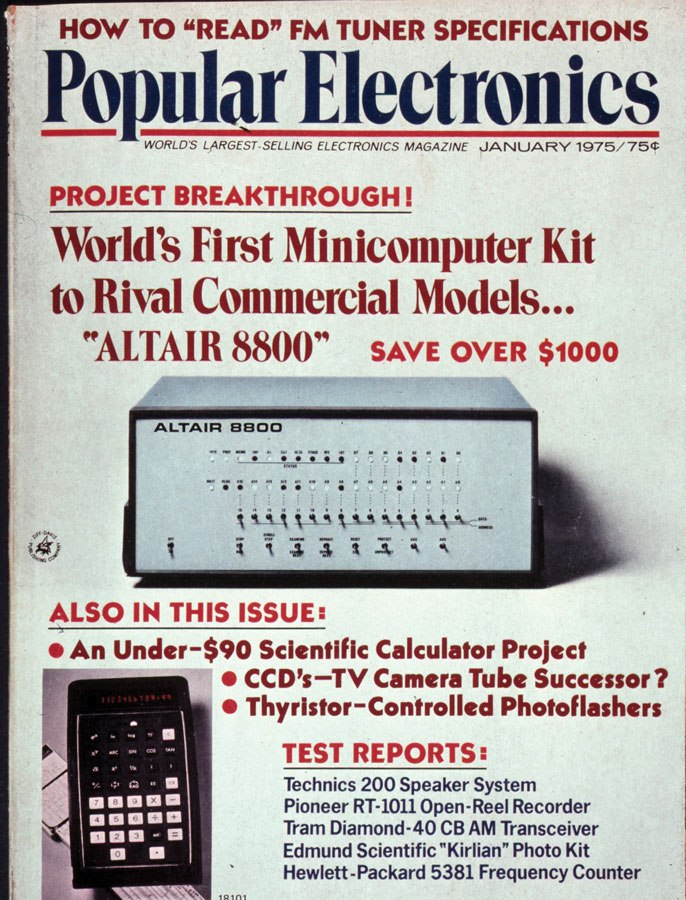
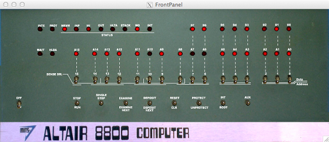

이 글은 Two-Bit History의 "Dawn of the Microcomputer: The Altair 8800"을 원작자의 허락 하에 번역한 것입니다. 원문은 [여기](https://twobithistory.org/2018/07/22/dawn-of-the-microcomputer.html)에서 읽을 수 있습니다.

# Dawn of the Microcomputer: The Altair 8800

*Popular Electronics*의 구독자들은 수준 높은 집단이었다. 잡지의 편집자인 아서 솔스버그(Arthur Salsberg)는 [1974년 12월호](https://www.worldradiohistory.com/Archive-Poptronics/70s/1974/Poptronics-1974-12.pdf)에서 이를 편집자 칼럼에서 강조해야 한다고 느꼈다. Popular Electronic는 "홈 TV 수리점을 차리는 법"이라는 기사를 실었는데 이에 대해 항의하는 편지를 받은 것이다. 해당 기사가 자칫 아마추어 TV 기술자들을 부추겨서 전문 수리기사들의 일자리를 빼앗고 그 과정에서 모두의 TV를 망가뜨릴 수 있다는 우려를 담은 내용이었다.

하지만 솔스버그는 이 걱정이 *Popular Electronics*의 독자층을 잘못 이해한 데서 비롯된 것이라 생각했다. 잡지 자체적인 조사에 따르면 *Popular Electronics* 구독자의 52%는 어떤 형태로든 전자공학 분야의 전문가였으며 최근 60일 내에 TV를 수리한 적 있는 사람만 15만 명이라고 솔스버그는 설명했다. 더구나 평균적인 *Popular Electronics* 구독자는 전자공학 기기에 평균 470달러(2018년 기준으로 약 3578달러)를 투자했으며 VOM, VTVM(옮긴이: VOM은 Volt-Ohm-Milliammeter로 전압/저항/전류 측정기, VTVM은 Vacuum Tube Voltmeter로 진공관을 사용한 전압계), 진공관 테스터, 트랜지스터 테스터, r-f 신호 발생기, 오실로스코프 등의 장비들을 갖추고 있었다. 솔스버그는 "*Popular Electronics* 독자 대부분은 초보자가 아닙니다."라고 결론지었다.

사실 나는 *Popular Electronics*를 조금이라도 아는 사람이 그 구독자들에 대해 의심했다는 게 놀랍다. 나는 당연히 최근 60일 동안 TV를 수리한 적이 없다. 내 컴퓨터는 나한테 있어서 한 번도 내부를 들여다본 적 없는 알루미늄 덩어리다. 그런데 *Popular Electronics* 1974년 12월호에는 "정재파비(Standing Wave Ratio): 이게 무엇이고 어떻게 다루는가", "테스트 씬: 멀티미터의 활용법" 같은 기사가 실려 있다.

광고조차도 위압적이다. 그 중 하나인 어떤 스테레오 시스템 광고에서는 이렇게 대담하게 선언한다. "세상은 '모든 기능을 갖춘 단일 4채널 유닛'을 세상은 다른 그 어떤 오디오 장비보다도 열렬하게 기다려 왔습니다-SQ, RM, CD-4 레코드 디코딩 회로가 내장된 바로 그 리시버." *Popular Electronics*를 구독하던, 취미로 하는 사람들도 이 정도였으니 하물며 전문가들은 얼마나 지식이 풍부했겠는가.

하지만 *Popular Electronics* 독자들은 [1975년 1월호](https://www.americanradiohistory.com/Archive-Poptronics/70s/1975/Poptronics-1975-01.pdf)에서 이전까지 한 번도 본 적 없는 무언가를 마주하게 된다. 잡지 표지에는 "PROJECT BREAKTHROUGH"라는 제목 아래 복잡한 불빛들과 토글 스위치들이 복잡하게 패널에 배열된, 회색과 검정색으로 이루어진 박스가 큼지막하게 실려 있었다. 이것이 바로 알테어 8800(Altair 8800)이었다. "상용 모델에 필적하는 세계 최초의 미니컴퓨터 키트"라는 수식어가 붙었고 400달러 미만으로 구입할 수 있었다.

"미니컴퓨터"로 광고되긴 했지만 알테어는 이후 "마이크로컴퓨터"로 불리게 될 새로운 컴퓨터 범주의 첫 번째 상업적 성공작이었다. 나중에는 이 범주를 아예 PC라고 부르게 된다. 알테어는 크기도 작고 가격도 충분히 저렴해서 일반 가정에서도 하나쯤 살 수 있었다. 이 제품이 *Popular Electronics*에 등장했다는 건, 솔스버그가 그 호에서 쓴 말처럼 "가정용 컴퓨터 시대가 드디어 왔다"는 것을 의미했다.



예전에 [알테어에 대해서 간략하게 언급한 적](https://twobithistory.org/2017/12/02/simulating-the-altair.html)은 있다. 하지만 알테어는 다시 한 번 짚고 넘어갈 가치가 있다고 생각한다. 알테어는 당시의 다른 컴퓨터들과 비교해서 특별히 강력한 성능을 지닌 건 아니었다(가격은 훨씬 저렴했지만). 또 세계 최초로 마이크로프로세서 칩을 내장한 범용 컴퓨터도 아니었다. 알테어보다 앞서서 나온 마이크로프로세서 기반 컴퓨터가 적어도 3종류 있었다. 그럼에도 불구하고 알테어는 우리 모두에게 "컴퓨터의 원형"같은 존재다.

알테어는 우리가 지금 쓰고 있는 컴퓨터의 계보에서 최초로 대중적인 성공을 거둔 모델이었다. 알테어 이전의 메인프레임이나 덩치 큰 미니컴퓨터들은 펀치 카드로 프로그래밍되었거나, 사용자와 직접적으로 상호작용할 일이 거의 없었다. 우리가 오늘날 컴퓨터를 사용하는 방식과는 완전히 다른 종류의 기계들이었다.

알테어는 극단적으로 단순한 컴퓨터였다. 운영체제는 물론이고 부트로더조차 없었다. 별도의 주변기기를 사지 않으면 알테어는 앞면에 스위치와 불빛이 들어오는 RAM 저장소에 불과했다. 이런 알테어의 단순함 덕분에 알테어를 배우는 일은 컴퓨팅의 기초 개념을 되짚기에 아주 좋다. 이 기계는 오래된 아날로그 세계의 살던 사람들이 처음으로 디지털 세계에 발을 들였을 때 마주한 컴퓨터의 모습 그대로였기 때문이다.

## 로버트 상회(Roberts and Co.)

알테어는 마이크로 계측 및 텔레메트리 시스템(Micro Instrumentation and Telemetry Systems, MITS)이라는 회사에서 설계하고 제작한 컴퓨터였다. 이 회사는 뉴멕시코주 앨버커키에 있었다. MITS는 H. 에드워드 로버트(H. Edward Roberts)라는 인물이 운영하고 있었고, 원래는 모형 로켓 키트에 사용되는 텔레메트리 장치를 만드는 걸로 시작했다가 1970년대 초반 급성장하던 계산기 시장에 눈을 돌렸다.

집적 회로(Integrated circuits, IC)의 등장 덕분에 계산기의 가격이 엄청나게 떨어졌고 미국의 직장인이라면 누구나 계산기를 갖춰야 하는 시대가 열린 것이다. 하지만 계산기 시장은 경쟁이 무자비하게 치열했고 1974년 초가 되었을 무렵 MITS는 이미 막대한 빚을 지고 있었다.

1974년은 컴퓨팅의 역사에서 "기적의 해(annus mirabilis)"로 불릴 만큼 중요한 해였다. 1974년 1월에는 휴렛팩커드(Hewlett-Packard)가 세계 최초의 프로그래밍 가능한 휴대용 계산기인 HP-65를 출시했다. 4월에는 인텔이 자신들의 두 번째 8비트 마이크로프로세서이자 처음으로 대중적 성공을 거둔 마이크로프로세서인 인텔 8080을 발표했다.

또 7월에는 *Radio Electronics*라는 잡지에서 Mark-8이라는 DIY 미니컴퓨터를 소개했다. Mark-8은 인텔이 1972년 출시한 8008 마이크로프로세서를 사용했다. Mark-8은 마이크로프로세서를 사용한 컴퓨터 중에 세 번째였고 잡지 표지에 실린 최초의 컴퓨터였다.[^2] *Radio Electronics*에 Mark-8이 등장하자, *Popular Electronics*도 그에 맞설 만한 미니컴퓨터 프로젝트를 찾기 시작했다.

*Popular Electronics* 1975년 1월호는 실제로는 1974년 12월에 구독자들에게 배송되었다. 따라서 알테어의 등장은 1974년 "기적의 해"를 장식한 마지막 사건이었다. 알테어의 등장이 아주 중요한 이유는 이전까지 이런 제대로 된 컴퓨터가 일반 대중에게 합리적인 가격으로 제공된 적이 없었기 때문이다. 당시 가장 인기 있었던 미니컴퓨터 중 하나인 PDP-8은 수천 달러쯤 있어야 살 수 있었다. 반면 알테어에 탑재된 인텔 8080 칩은 PDP-8에 필적하는 성능을 지녔고 그보다 나은 점도 있었다. 8080은 더 광범위한 명령어 셋을 지원했고 알테어는 메모리를 64kb까지 확장할 수 있었던 반면 PDP-8은 일반적으로 4kb 메모리에 불과했다.

Mark-8과 비교해도 알테어는 훨씬 강력했다. Mark-8은 인텔 8008 기반이라 최대 16kb까지만 주소 지정이 가능했고 사용자가 설명서 소책자와 회로 기판으 인쇄본만 가지고 일일이 조립해야 했다. 반면 알테어는 완제품으로도 구매 가능했다. 곧 MITS에 주문이 폭주하면서 현실적으로 알테어를 손에 넣으려면 조립 키트로 주문하는 수밖에 없게 되긴 했지만 말이다. 

많은 *Popular Electronics* 독자들에게 알테어는 디지털 컴퓨팅이라는 새로운 세계를 보여준 최초의 창이었다. 알테어를 소개한 1975년 1월의 기사는 로버트와 알테어의 공동 설계자인 윌리엄 예이츠(William Yates)가 썼다. 로버트와 예이츠는 디지털 하드웨어와 컴퓨터 프로그래밍의 기본 개념을 전자기기와 라디오를 좋아하는 독자들에게 친숙한 용어로 풀어서 설명하려고 애썼다. 그들은 "컴퓨터란 본질적으로 변경 가능한 하드웨어입니다. 메모리에 저장된 비트 패턴을 바꿈으로써 하드웨어의 성격을 완전히 다른 장치처럼 바꿀 수 있죠"라고 썼다. 한편 프로그래밍에 대해서는 "기초 개념은 비교적 짧은 시간 안에 익힐 수 있지만 유능한 프로그래머가 되려면 많은 경험과 상당한 창의력이 요구됩니다"라고 설명했다. 나로서도 공감하게 되는 말이다. 

이 기사에는 인텔 8080 CPU를 구성하는 회로를 자세히 설명하는 다이어그램이 실려 있었다. 알테어 키트에서 이 부품은 완제품 상태로 제공되었지만 말이다. 기사에서는 CPU와 메모리 유닛의 차이점, 스택 포인터의 역할, 그리고 기계어를 수동으로 입력하는 방식에 비해 어셈블리 언어나 포트란(FORTRAN), 베이직(BASIC) 같은 고급 언어가 제공하는 엄청난 장점까지도 함께 소개되었다.

사실 *Popular Electronics*는 1975년 1월호 이전부터 이미 로버트가 쓴 연재물을 여러 차례 실어오고 있었다. 이 연재물은 "디지털 논리(Digital Logic)"에 대한 짧은 강좌로 소개되었다. 1974년 12월호에서 로버트는 "아주 저렴한 컴퓨터 단말기"를 만드는 과정을 독자들에게 설명했다. 이 단말기는 기본적으로 8비트 컴퓨터에 값을 입력할 수 있는 8진수 키패드였다. 이 키패드를 설명하는 과정에서 로버트는 트랜지스터-트랜지스터 로직(TTL)이 어떻게 작동하는지, 디지털 값을 "기억"할 수 있는 회로인 플립플롭(flip-flop)을 어떻게 만드는지도 설명했다. 로버트는 이 키패드를 다음 달에 공개될 알테어 컴퓨터와 함께 사용할 수 있다고 예고했다.

얼마나 많은 *Popular Electronics* 독자들이 실제로 그 키패드를 만들었는지는 불확실하다. 하지만 그 키패드가 있다면 상당히 유용했을 것이다. 키패드 같은 입력 장치가 따로 없다면 알테어에 값을 입력할 수 있는 유일한 방법은 전면 패널의 스위치뿐이었기 때문이다.

알테어의 전면 패널에는 16개의 스위치로 이루어진 줄이 있었는데 주소를 지정하는 데에 사용되었다. 그리고 그 줄 밑에는 8개의 스위치가 있었는데 이것들은 컴퓨터의 동작을 제어하는 데 사용되었다. 그리고 주소를 지정하는 16개 스위치 중 오른쪽 8개는 메모리에 저장할 값을 지정하는 데에도 사용할 수 있었다. 인텔 8080이 8비트 워드(옮긴이: CPU에서 처리하는 데이터의 단위)와 16비트 주소를 사용했기 때문에 자연스러운 설계였다. 전면 패널의 16개 스위치는 각각 한 비트를 의미했다. 위로 올리면 1, 아래로 내리면 0을 표현했다. 이런 식으로 컴퓨터와 상호작용하는 건 그 자체로 일종의 계시와 같은 체험이었다(이 부분은 곧 더 자세히 이야기하겠다). 알테어의 전면 패널은 말 그대로 이진 인터페이스(binary interface)였고 이건 우리가 컴퓨터의 '원본 그대로의 모습(bare metal)'에 가장 가까이 다가갈 수 있는 방식이기 때문이다.

오늘날 우리에게는 알테어의 인터페이스가 아주 낯설게 느껴지지만 당시 기준으로는 특이한 편이 아니었다. 예를 들어 PDP-8도 전면 패널에 비슷한 형태의 이진 입력 메커니즘을 갖추고 있었다. PDP-8쪽이 좀 더 세련된 외관을 지니고 있기는 했다. PDP-8의 스위치들은 매력적인 주황색과 노란색 색상 조합으로 칠해져 있었고 언젠가 다시 유행이 돌아올 것 같은 디자인이었다.

PDP-8은 종종 종이 테이프 리더기나 텔레타이프(옮긴이: 전신을 보내는 타자기)와 함께 쓰이고는 했고 이런 장비들은 프로그램 입력을 훨씬 수월하게 해주었다. 문제는 이러한 입출력 장치들이 비쌌다는 것이다. 그래서 초기의 알테어 사용자들 대부분은 울며 겨자먹기로 전면 패널의 스위치만을 사용해야 했다. 쉽게 상상할 수 있듯이 긴 프로그램을 스위치로 입력하는 건 고역이었다.

시간이 지나면서 알테어를 카세트 녹음기에 연결해서 거기를 통해 프로그램을 로딩할 수 있게 되었다. 빌 게이츠(Bill Gates)와 폴 앨런(Paul Allen)은 알테어 버전의 BASIC을 만들었다. MITS가 이 라이센스를 받아서 1975년 중반에 이를 출시했다. 이건 마이크로소프트의 첫 상업적 프로젝트가 되었다.

텔레타이프 같은 장비를 갖춘 사용자들은 이제 [종이 테이프를 통해 알테어에 BASIC을 불러올 수](https://www.youtube.com/watch?v=qv5b1Xowxdk) 있었고 텍스트를 통해 알테어와 상호작용할 수 있게 되었다. BASIC은 그 무렵 이미 학교에서 가장 널리 사용되던 입문용 프로그래밍 언어였고 이후 한동안 초기 마이크로컴퓨터 시대의 표준 인터페이스로 자리잡게 된다.

## z80pack

인터넷에 있는 여러 사람들, 특히 우도 뭉크(Udo Munk)라는 사람 덕분에 우리는 오늘날 알테어를 내 컴퓨터에서 시뮬레이션해볼 수 있다. 이 시뮬레이션은 Zilog Z80 CPU를 에뮬레이션하는 소프트웨어 위에서 만들어졌는데 이때 Z80은 인텔 8080과 소프트웨어적으로 호환되도록 설계된 CPU다. 이 알테어 시뮬레이터는 초창기 알테어 사용자들이 그랬던 것처럼 전면 패널 스위치를 통해서 프로그램을 입력할 수 있게 해준다. 물론 마우스로 스위치를 클릭하는 것과 진짜 스위치를 딸깍 넘기는 건 손맛부터가 다르기는 하지만 이 알테어 시뮬레이터를 만져보는 경험은 인간과 컴퓨터 사이의 이진 인터페이스가 얼마나 끔찍하게 비효율적이면서도 동시에-적어도 내 생각에는-놀랍도록 직관적이었는지를 체감하게 해준다.

우도 뭉크가 만든 Z80 에뮬레이션 패키지 z80pack은 z80pack 웹사이트에서 다운로드할 수 있다. 내가 이전에 [알테어에 관해 썼던 글(옮긴이: 글의 말미에 번역할 예정)](https://twobithistory.org/2017/12/02/simulating-the-altair.html)을 보면 어떻게 Mac OS에서 이 시뮬레이터를 설치하는지에 대한 설명이 있다. 만약 FrontPanel 라이브러리와 `altairsim` 실행 파일을 컴파일할 수 있다면, `altairsim`을 실행해 다음과 같은 화면을 볼 수 있을 것이다.



기본 설정상, 적어도 내가 사용하고 있는 z80pack 버전(1.36)에서는 알테어에 Tarbell 부트 ROM이라는 것이 탑재되어 있다. 디스크 이미지를 불러올 때 사용되는 듯 하다. 그런데 이건 RAM의 처음 몇 워드에는 값을 쓸 수 없게 하는 제약을 발생시킨다. `/altairsim/conf/system.conf` 파일을 수정하면 ROM이나 부트로더 소프트웨어 없이 오직 16페이지짜리 RAM만 있는 단순한 알테어 구성으로 시뮬레이터를 설정할 수 있다. 이 설정 파일로 시뮬레이터가 동작하는 창의 크기를 조절할 수도 있어서 편리하다.

알테어의 전면 패널은 위압적으로 보이지만 실제로는 그렇게 복잡하지 않다. [알테어 설명서](http://dunfield.classiccmp.org//altair/d/88opman.pdf)는 여러 스위치와 상태를 나타내는 전구에 대해 아주 잘 설명해주고 있고 [이 유튜브 영상](https://www.youtube.com/watch?v=suyiMfzmZKs)도 도움이 된다. 간단한 프로그램을 입력하고 실행하기 위해서는 몇 가지만 알면 된다.

오른쪽 위에 있는 D0부터 D7까지의 전구는 현재 선택된 주소 워드에 들어 있는 값을 이진수 형태로 보여준다. A0부터 A15까지의 전구는 현재 보고 있는 주소를 나타낸다. 주소 전구의 아래에 있는 16개의 스위치는 새로운 주소를 설정하는 데 사용한다. "EXAMINE" 스위치를 위로 올리면 D0-D7 전구가 새로운 주소 워드의 값을 보여주도록 갱신된다.

이런 방식으로 메모리에 있는 모든 워드 값을 볼 수 있다. 또 "EXAMINE" 스위치를 아래로 내려서 "EXAMINE NEXT" 위치에 두면 다음 메모리 주소를 자동으로 보여준다. 이 기능은 메모리 값을 순차적으로 살펴보는 걸 아주 쉽게 만들어 준다.

메모리 워드에 비트 패턴을 저장하려면 먼저 오른쪽에 있는 8개의 스위치(0번부터 7번까지 라벨링되어 있음)을 이용해 원하는 비트 패턴을 설정해야 한다. 그런 다음 DEPOSIT 스위치를 위로 올리면 그 값이 현재 지정된 메모리 주소에 저장된다.

*Popular Electronics* [1975년 2월호](https://www.americanradiohistory.com/Archive-Poptronics/70s/1975/Poptronics-1975-02.pdf)에서 로버트와 예이츠는 알테어 사용자들에게, 알테어가 동작하는지 확인하기 위한 간단한 샘플 프로그램을 입력해보는 과정을 안내했다. 이 프로그램은 메모리에서 2개의 정수를 읽어 오고 더한 다음 그 합을 다시 메모리에 저장한다. 이 프로그램은 6개의 명령어로 이루어졌지만 실제로 이 6개의 명령어는 14개의 메모리 워드를 차지한다. 그만큼 정확하게 입력하는 데에는 시간이 좀 걸린다. 이 샘플 프로그램은 알테어 설명서에도 표 형태로 실려 있는데, 그 내용을 내가 여기 옮겼다.

| 주소 | 니모닉 | 비트 패턴 | 8진수 형태 |
|------|--------|-----------|------------|
| 0    | LDA    | 00 111 010 | 0 7 2 |
| 1    | (address) | 10 000 000 | 2 0 0 |
| 2    | (address) | 00 000 000 | 0 0 0 |
| 3    | MOV B, A | 01 000 111 | 1 0 7 |
| 4    | LDA    | 00 111 010 | 0 7 2 |
| 5    | (address) | 10 000 001 | 2 0 1 |
| 6    | (address) | 00 000 000 | 0 0 0 |
| 7    | ADD B | 10 000 000 | 2 0 0 |
| 8    | STA    | 00 110 010 | 0 6 2 |
| 9    | (address) | 10 000 010 | 2 0 2 |
| 10   | (address) | 00 000 000 | 0 0 0 |
| 11   | JMP    | 11 000 011 | 3 0 3 |
| 12   | (address) | 00 000 000 | 0 0 0 |
| 13   | (address) | 00 000 000 | 0 0 0 |

위 표의 각 워드를 스위치를 이용해서 알테어에 하나하나 입력하면 다음과 같은 동작을 하는 프로그램이 완성된다. 128번 메모리 주소에 저장된 값을 불러와서 129번 주소의 값과 더한 다음 130번 주소에 저장한다. 각 명령어에서 사용하는 주소는 하위 바이트(least-significant byte)를 먼저 입력하도록 되어 있어서 두 번째 바이트는 항상 0으로 설정되어 있다. 255보다 큰 주소는 없기 때문이다.(옮긴이: 주소 지정을 위해 8개의 스위치를 활용했는데 8비트로는 0~255까지의 주소를 지정할 수 있다)

프로그램을 모두 입력하고 나서 128번, 129번 메모리에 값을 넣고 나서는 "RUN" 스위치를 잠깐 아래로 내려서 프로그램을 실행하고 "STOP" 위치로 되돌리면 된다. 프로그램이 루프를 돌기 때문에 값을 더해서 저장하는 동작을 초당 수천 번 반복한다. 물론 값은 항상 같기 때문에 결과는 변하지 않고 따라서 프로그램을 멈춘 뒤 130번 주소를 살펴보면 정확한 합 값이 저장되어 있을 것이다.

알테어를 사용하던 일반 사용자들이 실제로 어셈블러를 쓸 수 있었는지는 모르겠지만 z80pack에는 어셈블러가 포함되어 있다. z80pack에 들어 있는 어셈블러 `z80asm`은 Z80 어셈블리를 위한 것이라서 인텔 8080과는 다른 어셈블리 명령어 셋을 사용한다. 하지만 Z80은 인텔 8080 소프트웨어와 호환되도록 설계되었기 때문에 명령어 셋이 달라도 실제로 생성되는 바이트코드(opcode)는 동일하다. 그래서 만약 이 샘플 프로그램을 어셈블리로 작성한다면 어떤 모습일지 보여주기 위해 `z80asm` 어셈블러가 실행해서 알테어에 로드할 수 있는 버전의 코드를 아래에 실어본다.

```asm
        ORG  0000H
START:  LD   A,(80H)   ;Load from address 128.
        LD   B,A       ;Move loaded value from accumulator (A) to reg B.
        LD   A,(81H)   ;Load from address 129.
        ADD  A,B       ;Add A and B.
        LD   (82H),A   ;Store A at address 130.
        JP   START     ;Jump to start.
```

이제 이 프로그램을 다음과 같이 어셈블러를 이용해 Intel HEX 파일로 변환할 수 있다.

```bash
$ ./z80asm -fh -oadd.hex add.asm
```

위에서처럼 `-f` 옵션에 `h`를 인자로 제공하면 어셈블된 결과를 HEX 파일 형식으로 출력하라는 뜻이다. 이렇게 만들어진 프로그램을 알테어에 로딩하려면 `-x` 옵션을 사용해서 HEX 파일을 지정하면 된다.

```bash
$ ./altairsim -x add.hex
```

이렇게 하면 메모리의 첫 14개 워드가, 마치 스위치를 통해 값들을 수동으로 입력한 것처럼 자동으로 설정된다. 스위치로 하나하나 입력하는 대신 이렇게 프로그램을 실행하고 아까처럼 "RUN" 스위치를 사용해 프로그램을 실행하면 된다. 훨씬 간단하다!

앞서 이야기한 것처럼 많은 알테어 사용자들 대부분은 이런 식으로 소프트웨어를 작성하지 않았을 것이다. 알테어 BASIC이 등장한 이후에는 BASIC으로 프로그램을 작성하는 것이 훨씬 쉬웠을 테니까. z80pack에는 다양한 버전의 알테어 BASIC이 담긴 HEX 파일도 함께 제공된다. 그중 내가 실행할 수 있었던 것은 4K BASIC의 버전 4.0이다. 다음 명령어로 시뮬레이터에 로딩할 수 있다.

```bash
$ ./altairsim -x basic4k40.hex
```

시뮬레이터의 기계를 켜고 "RUN" 스위치를 누르면 터미널 창에 BASIC이 나타나서 당신에게 질문을 던지는 걸 볼 수 있다. 가장 먼저 현재 사용 가능한 메모리 크기를 입력하라고 요청한다. 4000바이트를 입력하면 된다. 이후 몇 가지 질문이 더 이어지고 마지막에는 "OK"라는 프롬프트가 뜬다. 이것은 게이츠와 앨런이 표준 "READY" 대신 선택한 표현으로, 메모리를 조금이라도 더 아끼기 위해 그렇게 했다고 한다. 이렇게 한 후에는 BASIC을 자유롭게 사용할 수 있다.

```basic
OK
PRINT 3 + 4
7
```

4kb의 메모리로 BASIC을 실행하면 큰 프로그램을 돌리기는 힘들지만, 전면 패널의 스위치를 하나하나 조작하던 것에 비하면 엄청난 도약이다.

당연히 알테어는 오늘날 우리가 사용하는 데스크탑이나 노트북과는 비교도 할 수 없을 정도로 낮은 성능을 가졌다. 심지어 알테어 이후 10년ㄷ 채 지나지 않아서 출시된 매킨토시조차도 초라한 알테어에 비하면 완전히 다른 차원의 기계처럼 보인다. 하지만 알테어 키트를 사서 하나하나 조립했던 *Popular Electronics*의 독자들에게 알테어는 그들이 직접 소유할 수 있는 완전한 컴퓨터였다. 400달러라는 저렴한 가격을 낼 수 있고 책상 한 켠의 공간만 있다면 말이다. 

이건 정말 놀라운 일이었다. 그전까지만 해도 컴퓨터를 사용하려면 [펀치카드 뭉치](https://twobithistory.org/2018/06/23/ibm-029-card-punch.html)나 테이프 롤을 컴퓨터를 실제 운영하는 담당자에게 맡기고 결과를 기다릴 수밖에 없었기 때문이다. 이후에 나온 마이크로컴퓨터들은 알테어보다 훨씬 쓰기 쉽고 기능도 개선되었지만 그것들 모두는 결국, 어떤 관점에서 본다면 좀 더 복잡해진 알테어일 뿐이었다. 극단적으로 미니멀리즘을 추구했다고 할 수 있는 알테어는 이후 등장할 모든 마이크로컴퓨터들의 본질적인 청사진이었던 셈이다.

# 부록: Altair 실행해보기(Simulating the Altair)

역시 Two-Bit History에 올라와 있는 관련 글인 "Simulating the Altair"의 번역입니다. 원문은 [여기](https://twobithistory.org/2017/12/02/simulating-the-altair.html)에서 확인하실 수 있습니다.

---

[알테어 8800](https://en.wikipedia.org/wiki/Altair_8800)은 1975년에 출시된 DIY 방식의 가정용 컴퓨터 키트였다. 알테어는 사실상 최초의 개인용 컴퓨터라고 할 수 있지만 "개인용 컴퓨터"라는 용어가 등장하기 몇 년 전에 출시되었다. 오늘날 우리가 알고 있는 델(Dell), HP, 맥북(MacBook) 같은 모든 컴퓨터들의 아담(혹은 이브)과도 같은 존재다.

어떤 사람들이 Z80—알테어에 쓰인 인텔 8080과 매우 가까운 관계의 프로세서—의 에뮬레이터를 만들면 재밌겠다고 생각했다. 그리고는 여기에 알테어의 전면 패널 시뮬레이션까지 얹으면 완벽하겠다고 생각했다. 그래서 만약 당신이 1975년에 컴퓨터를 쓴다는 게 어떤 느낌이었는지 궁금하다면 당신의 맥북에서 알테어를 직접 돌려볼 수 있다.


## 설치하기

[여기](https://www.icl1900.co.uk/unix4fun/z80pack/ftp/)에서 접속할 수 있는 FTP 서버에서 z80pack을 다운로드할 수 있다. 최신의 z80pack을 찾으면 된다. `z80pack-1.26.tgz`같은 이름이다.

먼저 압축을 풀자.

```bash
$ tar -xvzf z80pack-1.26.tgz
```

압축이 해제된 디렉토리로 이동한다.

```bash
$ cd z80pack-1.26
```

전면 패널 시뮬레이션은 `frontpanel`이라는 라이브러리를 기반으로 한다. 그러니 먼저 이 라이브러리를 컴파일해야 한다. `frontpanel` 디렉토리로 이동하면 `README` 파일이 있고, 거기에는 필요한 의존성 목록이 적혀 있다. 당신이 사용하는 시스템에 따라서 이 과정은 다를 수 있지만 내가 했던 시행착오가 참고가 될 수 있을지도 모른다. 나는 의존성들을 [Homebrew](https://brew.sh/)로 설치했다. 그리고 라이브러리 컴파일을 위해서 `Makefile.osx`의 Clang include 경로에 `/usr/local/include`를 추가했다.

의존성이 잘 갖춰졌다면 `z80pack-1.26/frontpanel`에서 다음 명령어로 라이브러리를 컴파일할 수 있을 것이다.

```bash
$ make -f Makefile.osx ...
$ make -f Makefile.osx clean
```

컴파일이 끝나면 `libfrontpanel.so` 파일이 생성된다. 나는 이 파일을 `/usr/local/lib`로 복사해 두었다.

알테어 시뮬레이터는 `z80pack-1.26/altairsim` 디렉토리에 있다. 이제 시뮬레이터를 컴파일하기 위해 `z80pack-1.26/altairsim/srcsim` 디렉토리로 이동해 `make`를 또 한번 진행하자.

```bash
$ make -f Makefile.osx ...
$ make -f Makefile.osx clean
```

그러면 상위 디렉토리인 `z80pack-1.26/altairsim`에 `altairsim`이라는 실행 파일이 생성된다. 이 파일을 실행하면 우리가 알고 있는 바로 그 전설적인 알테어의 전면 패널이 뜨는 걸 볼 수 있다!

그리고 진짜 제대로 너드처럼 해보고 싶다면, 원본 [알테어 매뉴얼](http://dunfield.classiccmp.org//altair/d/88opman.pdf)을 정독해보는 것도 추천이다.

*만약 이 글이 재미있었다면, 비슷한 글이 4주마다 올라옵니다! 트위터에서 [@TwoBitHistory](https://x.com/TwoBitHistory)를 팔로우하거나, [RSS 피드](https://twobithistory.org/feed.xml)를 구독하여 새로운 글이 올라올 때 놓치지 않도록 하세요.*

## 옮긴이의 삽질

이런 유물들의 시뮬레이팅이 흔히 그렇듯이 이런 설명서를 보고 그대로 따라하면 잘 안 되는 경우가 많다. 그래서 나도 여러 시행착오를 겪었다. 혹시나 이 글을 보고 따라하실 분들이 있을까 싶어 내가 겪었던 과정도 정리한다. 나 또한 원본 글쓴이와 마찬가지로 맥북(M1)을 사용 중이다.

나도 위에서 소개된 [FTP 서버](https://www.icl1900.co.uk/unix4fun/z80pack/ftp/)에서 `z80pack-1.36.tgz`(버전에 주의)를 다운받고 위처럼 압축을 풀었다.

`z80pack-1.36/frontpanel`의 README를 읽어보니 의존성은 libjpeg, X11, OpenGL, g++, libpthread가 있었다. OpenGL, libpthread는 MacOS에 기본으로 설치되어 있고 나는 g++을 이전에 설치해 놓았다. 따라서 Homebrew로 나머지를 설치한다.

```bash
brew install libjpeg
brew install xquartz # Mac용 X11 서버
```

X11 환경을 위해 XQuartz를 설치한 후 실행한다.

```bash
open -a XQuartz
```

그리고 `frontpanel` 라이브러리 컴파일을 위해 `z80pack-1.36/frontpanel` 디렉토리에서 다음 명령어를 실행했다.

```bash
make -f Makefile.osx
```

다음과 같은 에러가 발생한다. libjpeg에 있는 헤더 파일 중 하나인 `jconfig.h`를 찾을 수 없다는 에러다.

```c
./jinclude.h:20:10: fatal error: 'jconfig.h' file not found
#include "jconfig.h"            /* auto configuration options */
```

헤더 파일을 INCLUDE 경로에 추가해줘야 한다. 따라서 `jconfig.h`가 있는 경로를 확인하자.

```bash
$ find /opt -name "jconfig.h"
# 결과들
/opt/homebrew/include/jconfig.h
/opt/homebrew/Cellar/jpeg/9f/include/jconfig.h
/opt/homebrew/Cellar/jpeg-turbo/3.0.3/include/jconfig.h
```

`/opt/homebrew/include`에 있는 `jconfig.h`를 사용하기로 했다. 그러면 `frontpanel/Makefile.osx`의 10번째 줄을 다음과 같이 수정한다.

```makefile
INCLUDE = -I/opt/X11/include -I/usr/local/include -I/opt/homebrew/include
```

이제 다시 `make -f Makefile.osx`를 실행하면 이렇게 `jpeg` 라이브러리를 찾을 수 없다는 오류가 발생한다.

```c
g++ -shared -L/usr/X11/lib -L/usr/local/lib -ljpeg -lGL -lGLU -lX11 jpeg.o lpanel.o lp_gfx.o lp_main.o lp_utils.o lp_window.o lp_switch.o lp_font.o lp_materials.o -o libfrontpanel.dylib
ld: library 'jpeg' not found
```

실제 라이브러리를 링크하는 단계에서 링커가 라이브러리를 찾지 못하는 것 같다. 따라서 `Makefile.osx`의 `LDFLAGS`에 jpeg 라이브러리 경로를 추가해주자. 먼저 jpeg 라이브러리의 경로를 확인한다.

```bash
find /opt/homebrew -name "libjpeg*.dylib"
# 결과
/opt/homebrew/lib/libjpeg.8.3.2.dylib
/opt/homebrew/lib/libjpeg.8.dylib
/opt/homebrew/lib/libjpeg.dylib
# ...
```

대략 `/opt/homebrew/lib`에 있는 것 같다. `Makefile.osx`의 19번째 줄의 `LDFLAGS`에 `/opt/homebrew/lib`를 추가해준다.

```makefile
LDFLAGS = -shared -L/usr/X11/lib -L/usr/local/lib -L/opt/homebrew/lib -ljpeg -lGL -lGLU -lX11
```

이제 다시 `make -f Makefile.osx`를 실행하면 컴파일이 잘 된다. 그러면 `libfrontpanel.dylib`가 생성된다.

이제 `z80pack-1.36/altairsim/srcsim` 디렉토리로 이동해서 make를 실행해본다.

```bash
cd ../srcsim
make -f Makefile.osx
```

역시 `ld: library 'jpeg' not found`에러가 발생한다. 아까와 똑같이 `srcsim/Makefile.osx` 21번째 줄의 `LFLAGS`에 `/opt/homebrew/lib`를 추가해준다.

```makefile 
LFLAGS = -L../../frontpanel -L/usr/local/lib -L/opt/X11/lib -L/opt/homebrew/lib \
	-lfrontpanel -ljpeg -lGL -lGLU -lX11
```

`make -f Makefile.osx`를 다시 실행하면 원문 글에서 설명한 것처럼 `z80pack-1.36/altairsim` 디렉토리에 `altairsim`이라는 실행 파일이 생성된다. 이 파일을 실행해보자. 나는 터미널에서 `./altairsim`을 실행했다. 당연히 에러 발생.

```bash
$ ./altairsim
dyld[]: Library not loaded: libfrontpanel.dylib
# 어쩌고저쩌고...
```

대충 앞에서 만들었던 `libfrontpanel.dylib`를 찾지 못한다는 에러다. 원 글에서는 `/usr/local/lib`에 복사하라고 했지만 에러 메시지를 꼼꼼히 읽어보니 실행 파일과 같은 경로에 있는 라이브러리에 대해서도 링킹을 하는 것 같았다. 그래서 그냥 `z80pack-1.36/altairsim` 디렉토리에 `libfrontpanel.dylib`를 복사해주었다.

그리고 다시 `./altairsim`을 실행해보니 터미널에 "8080-SIM"이라는 메시지가 뜨고 알테어의 전면 패널이 나타날 듯 하다가 "Can't connect to display (null)"라는 에러가 발생했다. 보니까 frontpanel 관련 코드에서 발생한 것 같아서 코드를 뜯어보았다.

`frontpanel/lp_window.cpp`의 696번째 줄쯤의 이런 코드가 에러를 발생시키고 있었다.

```cpp
dpy = XOpenDisplay(0);
if (dpy == NULL)
  {
  fprintf(stderr, "Can't connect to display \"%s\"\n", getenv("DISPLAY"));
  return 0;
  }
```

해결은 간단하다. `DISPLAY` 환경 변수를 설정해주면 된다. 그냥 터미널에서 다음과 같이 입력해주면 된다.

```bash
export DISPLAY=:0.0
```

이제 다시 `./altairsim`을 실행하면 알테어의 전면 패널이 나타나는 걸 볼 수 있다. 이제 간단한 프로그램을 실행시켜 볼 수 있을 것이다. 생각대로 잘 되지 않는 게 많기는 하지만 일단 프로그램 실행 자체는 된다.

다만 기계어 혹은 어셈블리 디버깅은 내가 다루던 분야도 아니거니와 이렇게 명령어 셋조차 명확하지 않은 상태에서는 너무나 고통스럽고 오래 걸리는 작업이 될 수 있다는 것을 알고 있다(물론 알테어 매뉴얼에는 각 op code들의 목록이 친절하게 나와 있지만 내가 사용한 시뮬레이터에서 이를 완전히 그대로 구현했을지 아무도 모른다). 따라서 이 글에서는 여기까지 다루고 마무리하겠다.

---

흥미가 있을 수 있는 독자들을 위해 *Popular Electronics*의 1975년 1월호와 2월호를 링크해둔다.

파퓰러 일렉트로닉스 1975.1월호

https://www.historybit.it/wp-content/uploads/2020/04/197501-Popular-Electronics.pdf

2월호

https://archive.org/details/197502PopularElectronics/page/26/mode/2up

Altair 8800 관련 기사만 모아둔 페이지

https://vintagecomputer.net/altair-poptronics.cfm

[^1]: Paul E. Ceruzzi, A History of Modern Computing (Cambridge, Mass: MIT Press, 2003), 226

[^2]: "Mark-8 Minicomputer", Byran’s Old Computers, accessed July 21, 2018, http://bytecollector.com/mark_8.htm

[^3]: Paul E. Ceruzzi, A History of Modern Computing (Cambridge, Mass: MIT Press, 2003), 226