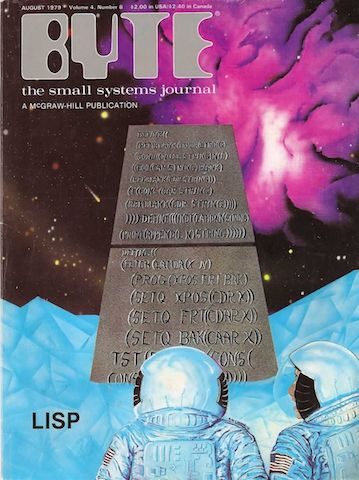

이 글은 Two-Bit History의 "How Lisp Became God's Own Programming Language"을 원작자의 허락 하에 번역한 것입니다. 원문은 [여기](https://twobithistory.org/2018/10/14/lisp.html)에서 읽을 수 있습니다.

# How Lisp Became God's Own Programming Language

프로그래머들이 서로 다른 프로그래밍 언어들의 장단점에 대해 이야기할 때면 실용적인 관점에서 비교하고는 한다. 많은 도구들이 꽂힌 허리띠에서 필요한 작업에 가장 적절한 걸 고르는 것처럼 말이다. 어떤 언어는 시스템 프로그래밍에 더 적합하고, 또 어떤 언어는 여러 프로그램을 잇는 ‘접착제’ 역할에 더 적합하다는 식이다. 그리고 이렇게 비교하는 게 맞다. 각각의 언어들은 다른 강점을 가지고 있고, 구체적인 사용 맥락 없이 어떤 언어가 다른 언어보다 더 낫다고 주장하는 건 결국 소모적이고 감정적인 논쟁으로 이어질 수밖에 없다.

그러나 기이할 정도로 보편적인 존경을 받는 언어가 하나 있다. 리스프(Lisp)다. 평소 같았으면 특정 프로그래밍 언어가 더 우월하다는 말이 즉각 덤벼들었을 키보드 전사들도 리스프에 대해서만큼은 다른 차원에 있다면서 수긍하는 경우가 많다. 리스프는 다른 언어들을 평가할 때 흔히 사용되는 실용적인 기준을 초월한 언어다. 대부분의 프로그래머는 리스프로 실용적인 무언가를 만들어본 적이 없고 앞으로도 그럴 일이 없을 가능성이 크기 때문이다. 그럼에도 리스프에 대한 존경은 너무나도 뿌리깊어서 리스프가 어떤 신비주의적인 속성을 지닌 언어처럼 여겨지기도 한다.

모두가 좋아하는 웹툰 *xkcd*도 이러한 점에 대해 다룬 적이 적어도 두 번 있다. [xkcd 한 편](https://xkcd.com/224/)에서 큐볼(옮긴이: xkcd의 캐릭터 이름)은 리스프에 대한 일종의 깨달음을 얻고 이를 통해 우주의 근본적인 구조를 이해할 수 있게 되는 장면이 나온다. [다른 편](https://xkcd.com/297/)에서는 로브를 입은 늙은 프로그래머가 그의 제자에게 괄호 뭉치들(옮긴이: 리스프는 괄호가 많이 쓰이는 걸로 유명하다)을 건네면서 "이건 더 문명화된 시대의 우아한 무기다"라고 말하는 장면이 나온다. 마치 리스프가 스타워즈의 포스처럼 신비한 힘을 지닌 것처럼 말이다.

다른 훌륭한 예시로는 밥 카네프스키(Bob Kanefsky)가 1990년대 중반에 "God Lives on Terra"라는 노래를 패러디해서 만든 음악인 "Eternal Flame"이 있다. 이 곡은 리스프가 신의 언어라는 주제를 다루고 있다. 이 음악은 신이 세상을 만들 때 리스프를 사용했다는 내용이다. 일부 가사는 다음과 같으며 전체 가사는 [GNU 유머 모음집](https://www.gnu.org/fun/jokes/eternal-flame.en.html)에서 찾아볼 수 있다.

> 신은 리스프 코드로 세상을 쓰셨다. 나뭇잎마다 푸르름을 채우실 때.
> 
> 프랙탈 꽃과 재귀적인 뿌리는 내가 본 해킹 중 가장 아름다웠다.
>
> 같은 모양의 눈송이는 하나도 없다는 걸 떠올릴 때마다 나는 신이 리스프를 사랑했다는 걸 알게 된다.

내 주장일 뿐이지만 나는 이런 "리스프는 신비한 마법"이라고 하는 문화적인 밈이 정말 기묘하면서도 매혹적인 현상이라고 생가한다. 리스프는 원래 인공지능 연구를 위한 도구로써 상아탑에서 만들어진 언어였고 일반적인 프로그래머들에게는 낯설고 어쩌면 신비롭게 느껴질 수도 있다.

그런데 요즘은 프로그래머들끼리 ["죽기 전에 리스프를 한번 써보라"](https://www.reddit.com/r/ProgrammerHumor/comments/5c14o6/xkcd_lisp/)고 권한다. 리스프가 마치 의식이 확장되는 환각제라도 되는 것처럼 말이다. 웃긴 건 리스프는 지금 널리 쓰이고 있는 언어 중 두 번째로 오래된 언어라는 점이다. 첫 번째로 오래된 건 포트란인데 리스프보다 고작 1년 빨리 나왔을 뿐이다.[^1]

당신이 어떤 새 프로그래밍 언어를 만든 팀을 대표해서 그 언어를 홍보해야 하는 임무를 맡았다고 해보자. 사람들이 그 언어에 신성한 힘이라도 깃들어 있다고 믿게 만들 수 있다면 멋지지 않겠는가? 그런데 도대체 그걸 어떻게 할 수 있을까? 어떻게 고작 프로그래밍 언어가 마치 숨겨진 지식의 원천이라도 되는 것처럼 여겨지게 할 수 있을까?

리스프는 어쩌다 그렇게 되었을까?

리스프 특집호가 실렸던 *바이트 매거진*의 표지.

# 가설 A: 공리적인 언어(The Axiomatic Language)

리스프 창시자인 존 매카시(John McCarthy)가 처음부터 계산의 원리를 우아하게 정제한 언어를 만들고자 한 건 아니다. 하지만 한두 번의 운 좋은 통찰과 여러 차례의 개선 끝에 리스프는 그런 언어가 되었다.

폴 그레이엄-그에 대해서는 나중에 더 이야기하겠지만-은 이렇게 쓴 적이 있다. 매카시는 리스프를 통해 "유클리드가 기하학에서 했던 일과 비슷한 일을 프로그래밍에 해냈다"고 말이다.[^2] 사람들이 리스프에서 어떤 깊은 의미를 느끼는 건 당연한 일일지도 모른다. 매카시는 리스프를 너무나 근본적인 요소들만으로 만들어냈고 그가 이것을 창조한 것인지 발견한 것인지조차 구분하기 어려울 정도이기 때문이다.

매카시는 1956년 다트머스 여름 인공지능 연구 프로젝트(Dartmouth Summer Research Project on Artificial Intelligence)에서 새로운 언어를 만드는 일에 대해 생각하기 시작했다. 이 프로젝트는 사실상 인공지능 분야 최초로 여러 주 동안 진행되는 학술 회의였다. 매카시는 그 당시 다트머스 대학교 수학과의 조교수였다. 그는 이 행사를 제안하면서 "인공지능(Artificial Intelligence)"이라는 말을 처음 만들어냈다.[^3]

이 회의의 전체 기간에 전부 참석한 사람은 열 명 남짓이었다.[^4] 그중에는 앨런 뉴얼(Allen Newell)과 허버트 사이먼(Herbert Simon)도 있었다. 그들은 얼마 전 랜드 연구소(RAND Corporation)와 카네기 멜런(Carnegie Mellon)과 제휴를 맺고 IPL이라는 언어를 설계한 상태였다.

뉴얼과 사이먼은 명제 논리에서의 증명들을 자동으로 생성할 수 있는 시스템을 만들고자 했다. 그런데 컴퓨터의 명령어 셋(옮긴이: CPU의 어셈블리 명령어 세트를 의미) 수준에서 이런 작업을 하는 건 어렵다는 걸 깨달았다. 그래서 그들은 자신들이 만든 "논리 이론 기계(Logic Theory Machine)"의 작동 방식을 좀 더 자연스럽게 표현할 수 있는 언어-그들은 "의사 코드"(pseudo-code)라고 불렀다-를 만들기로 했다.[^5]

그들이 만든 언어는 "정보 처리 언어(Information Processing Language)", 줄여서 IPL이라고 불렸다. 오늘날 우리가 생각하는 프로그래밍 언어라기보다는 고수준의 어셈블리 방언에 가까운 형태였다. 

뉴얼과 사이먼은 당시 다른 "의사 코드"들이 표준 수학 기호로 수식을 나타내는 데에만 몰두하고 있다고 지적했다[^6]. 아마 포트란을 염두에 두고 한 말로 추정된다. 이와 달리 IPL은 명제 논리의 문장들을 기호 표현들(symbolic expressions)로 이뤄진 리스트로 나타내는 데 초점을 맞췄다. IPL로 작성한 프로그램은 기본적으로 여러 개의 리스트 안에서 표현식을 조작하고 평가하기 위해 어셈블리 매크로들을 활용하는 방식이었다.

매카시는 포트란처럼 대수적인 표현을 언어에 집어넣는 것이 유용하다고 생각했다. 그래서 매카시는 IPL을 별로 좋아하지 않았다.[^7] 하지만 기호 표현들을 담은 리스트는 인공지능의 문제들을 모델링하기에 좋은 방식이라고 보았다. 특히 연역 추론(deduction) 같은 문제를 다룰 때는 더욱 그랬다. 이게 매카시가 대수적인 리스트 처리 언어(algebraic list processing language)를 만들고자 한 동기의 시작이었다. 포트란처럼 수식을 쓸 수 있으면서도, IPL처럼 리스트를 다룰 수 있는 언어 말이다.

물론 오늘날의 리스프는 포트란과 많이 다르다. 이상적인 리스트 처리 언어에 대한 매카시의 비전은 이후 몇 년간 계속 발전한다. 그 변화의 시작은 1957년 매카시가 포트란으로 체스 프로그램을 만들면서 시작되었다. 매카시는 오랜 시간 포트란을 다루면서 포트란의 설계에 여러 부적절한 부분이 있다는 걸 확신하게 되었다. 그 중 가장 마음에 들지 않았던 건 포트란의 `IF` 문이었다.[^8]

매카시는 그 대안으로 "진짜" 조건 표현식을 만들어냈다. 만약 조건이 참이면 표현식 A를, 거짓이면 표현식 B를 반환하며 실제로 반환되는 표현식만 평가되는 방식이었다.(옮긴이: `XIF(cond, A, B)`와 같은 형식이었다)매카시는 이후 이 "진짜" 조건 표현식이 재귀 함수 작성을 훨씬 더 간단하고 자연스럽게 만들어준다는 걸 깨닫게 된다. 1958년 미분을 수행하는 프로그램을 설계하던 도중이었다.[^9] 

이 미분 문제에 대한 경험은 또한 매카시가 `maplist`라는 함수를 고안해 내도록 했다. 이 함수는 다른 함수를 인자로 받아서 리스트의 모든 요소에 적용하는 방식이었다.[^10] 이 함수는 임의 갯수 항들의 합을 미분하는 데에 유용했다.

이러한 기능들은 포트란으로 표현할 수 없었다. 그래서 1958년 가을 매카시는 몇몇 학생들과 리스프 구현 작업을 했다. 당시 그는 MIT의 조교수였기에 이 학생들은 모두 MIT 학생들이었다. 매카시의 아이디어를 실제 코드로 구현하는 과정에서 그들은 언어를 더 단순하게 만드는 방향으로 나아갔다.

가장 큰 변화는 리스프의 문법에서 일어났다. 원래 매카시는 리스프에 ‘M-표현식(M-expressions)’이라는 문법을 넣을 계획이었다. 이건 리스프 문법을 포트란과 비슷하게 보이게 만드는 일종의 문법적 설탕이었다. M-표현식은 S-표현식으로 변환될 수 있었다. 이때 S-표현식이란 우리가 리스프 하면 떠올리는, 괄호로 감싼 기본적인 리스트 형태를 의미한다. S-표현식이 정말 기계가 받아들이는 저수준의 표현이었다.

그런데 문제가 생겼다. 매카시는 M-표현식을 대괄호(square brackets)로 표기했는데 매카시의 팀이 MIT에서 사용하던 IBM 026 천공 카드 입력기에는 대괄호 키가 없었던 것이다.[^11] 결국 리스프 팀은 S-표현식만 쓰기로 한다. 그리고 S-표현식을 데이터 리스트뿐만 아니라 함수의 적용(function application)까지 표현하는 데도 사용하기로 했다. 매카시와 학생들은 몇 가지 추가적인 단순화도 진행했다. 전위 표기법(prefix notation)으로의 전환 그리고 언어가 사실상 하나의 타입만 가지도록 하는 메모리 모델의 변경 등이었다.[^12]

1960년 매카시는 리스프에 대한 그의 유명한 논문을 발표한다. "기호 표현의 재귀 함수와 그것의 기계적 계산(Recursive Functions of Symbolic Expressions and Their Computation by Machine)"이라는 제목이었다. 이 무렵 리스프는 아주 간결하게 다듬어져 있었고 매카시는 그가 단순히 또 하나의 프로그래밍 언어를 만든 게 아니라 "우아한 수학적 체계"를 만들었음을 깨닫는다.[^13] 매카시는 훗날 리스프에 가해진 여러 단순화 작업들이 "계산 가능한 함수(computable functions)를 튜링 머신이나 재귀 함수 이론에서 사용하는 일반 재귀의 정의보다 깔끔하게 기술할 수 있는 수단"으로 만들었다고 회고했다.[^14] 따라서 그는 논문에서 리스프를 작동하는 프로그래밍 언어인 동시에 재귀 함수의 동작을 연구할 수 있는 형식 체계(formalism)로 설명했다.

매카시는 독자들에게 리스프를 설명할 때, 아주 적은 수의 규칙들만으로 언어를 구성해 나갔다. 이후 폴 그레이엄(Paul Graham)은 자신의 에세이 ["The Roots of Lisp"](https://languagelog.ldc.upenn.edu/myl/llog/jmc.pdf)에서 매카시가 했던 작업을 좀 더 읽기 쉬운 언어로 되짚는다. 그레이엄은 단 7개의 원시적인 연산자, 두 가지 함수 표기 방식, 이 원시 연산자들로 구성된 몇 가지 고차 함수들만으로 리스프를 설명해낸다.

리스프가 이렇게 단 몇 개의 기본 규칙만으로 설명될 수 있다는 사실은 리스프가 신비롭게 느껴지는 이유 중 하나임이 분명하다. 그레이엄은 매카시의 논문을 "계산을 공리화하려는"[^15] 시도라고 불렀다. 리스프의 매력을 이해하는 데에 아주 적절한 관점이라고 생각한다. 

대부분의 언어들이 `while`, `typedef`, `public static void`같은 예약어들로 구성된 명백히 인공적인 구성을 갖는 것과 달리 리스프의 구조는 계산의 논리 그 자체로부터 도출된 것처럼 보인다. 이런 성질과 더불어서 리스프가 처음부터 "재귀 함수 이론"이라는 난해한 분야와 연결되어 있었다는 사실을 생각하면 오늘날 이 언어가 이토록 높은 위상을 가진 것은 전혀 놀라운 일이 아니다.

# 가설 B: 미래의 기계(Machine of the Future)

리스프가 만들어진지 20년쯤 지났을 때 컴퓨터 프로그래머들의 속어 모음집으로 유명한 [*해커 사전(Hacker’s Dictionary)*](https://en.wikipedia.org/wiki/Jargon_File)은 리스프를 "인공지능 연구의 모국어"라고 불렀다. 리스프는 초기에 빠르게 퍼져나갔는데 아마도 새로운 기계에서 그 문법을 구현하기가 상대적으로 쉬웠기 때문일 것이다. 이후에는 기호 표현을 다루는 데에 특출났다는 이유로 계속 사용되었다. 당시의 인공지능 연구는 대부분 기호를 다루는 것에 기반을 두고 있었기 때문이다. 리스프는 [SHRDLU 자연어 프로그램](https://hci.stanford.edu/winograd/shrdlu/), [Macsyma 대수 시스템](https://en.wikipedia.org/wiki/Macsyma), [ACL2 논리 시스템](https://en.wikipedia.org/wiki/ACL2) 같은 인공지능의 기념비적인 프로젝트들에 사용되었다.

그러나 1970년대 중반 인공지능 연구자들은 점점 컴퓨터 성능 한계에 부딪치기 시작했다. 특히 인공지능 연구자들이 가장 사랑하던 컴퓨터인 PDP-10은 18비트 주소 공간을 가지고 있었는데, 이 정도로는 더 이상 리스프 기반 AI 프로그램을 충분히 감당할 수 없었다.[^16] 또 많은 AI 프로그램은 대화형(interactive)으로 만들어졌는데 이런 무거운 대화형 프로그램을 시분할 시스템 위에서 잘 작동하도록 하는 건 어려웠다.

MIT의 피터 도이치(Peter Deutsch)가 처음으로 제안한 해결책은 리스프 프로그램을 전용으로 실행할 수 있도록 설계된 컴퓨터를 만드는 거였다. 내가 [Chaosnet에 관해 지난번에 쓴 글](https://twobithistory.org/2018/09/30/chaosnet.html)(옮긴이: 리스프 머신에서 사용되던 네트워크 프로토콜인 Chaosnet에 대해 다룬 글인데 리스프 머신에 관한 설명도 있음)에서 다루었듯이 리스프 머신은 리스프에 최적화된 전용 프로세서를 사용자 각각에 대해 제공했다. 거기에는 전부 리스프로 작성된, 리스프 해커를 위한 개발 환경도 딸려 있었다. 미니컴퓨터 시대의 끝자락과 마이크로컴퓨터 혁명이 완전히 꽃피기 전이라는 애매한 시기에 탄생한, 프로그래밍 엘리트를 위한 고성능 개인용 컴퓨터였다.

리스프 머신은 한동안 미래를 이끌 것처럼 보였다. 많은 회사들이 생겨나서 이 기술을 상업화하기 위해 치열한 경쟁을 벌였다. 그중 가장 성공한 회사는 심볼릭스(Symbolics)였다. 심볼릭스는 MIT 인공지능 연구소의 베테랑들이 창립한 회사였다.

1980년대 동안 심볼릭스는 3600시리즈로 알려진 컴퓨터 라인업을 제작했고 이 라인업은 인공지능 분야와 고성능 연산이 필요한 산업에서 인기를 끌었다. 3600 시리즈 컴퓨터는 대형 디스플레이, 비트맵 그래픽, 마우스 인터페이스, 그리고 [강력한 그래픽 및 애니메이션 소프트웨어](https://www.youtube.com/watch?v=gV5obrYaogU&t=201s)를 갖추고 있었다. 정말 인상적인 기계였고 이 기계 덕분에 인상적인 프로그램들이 만들어졌다.

예를 들어 로보틱스 연구를 했던 밥 컬리(Bob Culley)와 트위터를 통해 연락할 수 있었는데, 그는 1985년 심볼릭스 3650에서 경로 탐색 알고리즘을 구현하고 시각화하는 데 성공했다. 그리고 그는 비트맵 그래픽이나 객체 지향 프로그래밍([Flavors 확장](https://en.wikipedia.org/wiki/Flavors_(programming_language))을 통해 리스프 머신에서 쓸 수 있었음)은 1980년대 당시 매우 새로운 기술이었다고 설명해 주었다. 그 시절의 심볼릭스는 그야말로 기술의 최전선에 있었다.

다음 사진이 밥 컬리가 만들었던 경로 탐색 프로그램이다.

그 결과로 심볼릭스 머신은 터무니없이 비쌌다. 1983년 심볼릭스 3600은 11만 달러였다.[^16] 그래서 대부분의 사람들은 리스프 머신의 놀라운 성능과 거기서 리스프를 다루는 프로그래머들의 마법같은 솜씨를 멀리서 경외하는 수밖에 없었다. 사람들은 정말로 경외했다.

*바이트 매거진(Byte Magazine)*은 1979년부터 1980년대 말까지 리스프와 리스프 머신에 대해 여러 번 다루었다. 1979년 8월호의 리스프 특집에서 잡지 편집자는 MIT에서 개발 중인 새로운 머신에 대해서 이렇게 극찬했다. "엄청난 양의 메모리"와 "고급 운영체제"를 탑재했다고 말이다.[^17] 그에게는 그것들이 너무 유망해 보여서 지난 2년-그 2년 동안 애플 II, 코모도어 PET, TRS-80(옮긴이: 전부 상업용 컴퓨터의 역사에 한 획을 그은 기종들이다)이 등장했었다-조차 새 기계에 비하면 지루하게 느껴질 정도라고 썼다.

5년 뒤인 1985년, *바이트 매거진* 기고자는 "정교하고 엄청나게 강력한 심볼릭스 3670" 위에서 리스프 프로그램을 작성한 경험을 소개하면서 독자들에게 리스프를 배워야 한다고 권했다. 그는 리스프가 "당시 인공지능 분야에서 가장 널리 쓰이는 언어"일 뿐만 아니라 곧 범용 프로그래밍 언어로 자리 잡을 것이라고 주장했다.[^18]

나는 마운틴뷰에 있는 컴퓨터 역사 박물관에서 [리스프 보존 작업](https://www.softwarepreservation.org/projects/LISP/)을 많이 해온 폴 맥존스(Paul McJones)에게 물어봤다. 도대체 사람들이 리스프를 무슨 고차원적인 존재가 내려준 선물이라도 되는 것처럼 말하기 시작한 게 언제부터였는지 말이다. 그는 리스프 언어 자체의 특성도 분명 한몫했을 것이며 1960~70년대의 강력한 인공지능 애플리케이션들과 리스프가 긴밀하게 엮여 있었던 것도 큰 이유라고 말했다.

1980년대 들어 리스프 머신이 실제로 판매되기 시작하면서 MIT나 스탠포드 같은 곳에 있지 않은 사람들도 리스프의 힘을 체험할 기회를 조금씩 가지게 되었고 그렇게 리스프에 대한 전설은 점점 자라났다. 오늘날 리스프 머신과 심볼릭스를 기억하는 사람은 많지 않지만, 이 기계들은 1980년대 후반까지 리스프의 신비로움을 지켜낸 핵심적인 존재였다.

# 가설 C: 프로그래밍을 배우는 법(Learn to Program)

1985년 MIT 교수인 해럴드 아벨슨(Harold Abelson)과 제럴드 서스먼(Gerald Sussman), 그리고 서스먼의 아내인 줄리 서스먼(Julie Sussman)은 *컴퓨터 프로그램의 구조와 해석(Structure and Interpretation of Computer Programs)*이라는 교과서를 출간했다. 이 책은 리스프의 방언인 스킴(Scheme)을 통해 독자들에게 프로그래밍을 소개했다. 이 책은 이후 20년 동안 MIT의 프로그래밍 입문 수업에서 사용되었다.

내 추측이지만 이 SICP(앞서 소개한 책의 제목을 보통 이렇게 줄여 부른다)가 리스프의 "신비로움 지수"를 거의 2배로 끌어올렸다. SICP는 리스프를 도구삼아서 컴퓨터 프로그래밍의 예술 속에 담긴 깊고 철학적이기까지 한 개념들을 풀어냈다. 책에서 소개하는 개념들 자체는 어떤 언어를 사용해서든 풀어낼 수 있을 정도로 일반적이었지만 SICP의 저자들은 리스프를 선택했다.

그렇게 이 기묘하고 찬란한 책의 악명으로 인해 리스프의 명성은 더 높아졌다. SICP는 세대를 뛰어넘어 많은 프로그래머들을 사로잡았고(그리고 [이상한 밈](https://knowyourmeme.com/forums/meme-research/topics/47038-structure-and-interpretation-of-computer-programs-hugeass-image-dump-for-evidence)이 되기도 했다, 옮긴이: 일본 애니메이션의 여자 등장인물이 SICP를 들고 있는 합성 짤에 관한 얘기다) 리스프도 "매카시의 우아한 형식 체계"를 넘어 "프로그래밍의 숨겨진 진실을 알려주는 언어"라고 여겨지게 되었다.

SICP가 얼마나 기묘한 책인지도 곱씹어볼 만 하다. 나는 이 책의 기묘함과 리스프의 기묘함이 오늘날 종종 혼동된다고 생각하기 때문이다. SICP의 기묘함은 책 표지부터 시작된다. 표지에는 마법사 혹은 연금술사처럼 보이는 인물이 탁자 앞에 서서 무언가 마법을 시전하려는 듯한 모습이 그려져 있다. 그는 한 손에는 캘리퍼스나 컴퍼스를, 다른 손에는 "eval"과 "apply"라는 단어가 새겨진 둥그런 구체를 들고 있다. 맞은편에 서 있는 여자는 탁자를 가리키고 있다. 그리고 배경에는 그리스 문자 람다(λ)가 공중에 떠서 빛을 발하고 있다.

진짜 이게 무슨 상황이란 말인가? 탁자에는 왜 동물 발이 달려 있는 거지? 왜 여자는 그 탁자를 가리키고 있는 거고? 탁자에 있는 잉크병은 무슨 의미인가? 이 표지를 본 우리는 결국 이렇게 결론내려야 하는 걸까? 저 마법사가 우주의 숨겨진 비밀을 풀었고 그 비밀이란 "eval/apply" 루프와 람다 계산법으로 이뤄져 있다고? 아무래도 그런 것 같다. 이 이미지 하나가 오늘날 사람들이 리스프를 이야기하는 방식에 엄청난 영향을 끼쳤음이 분명하다.

하지만 책 본문도 그 못지않게 이상하다. SICP는 당신이 지금까지 봐왔던 대부분의 컴퓨터 과학 교과서와는 다르다. 저자들은 책 머리말에서 이 책이 단순히 리스프 프로그래밍을 가르치는 책이 아니라고 설명한다. 대신 "세 가지 현상의 초점: 인간의 정신, 컴퓨터 프로그램의 집합, 그리고 컴퓨터"를 다룬다고 한다.[^19] 그들은 더 나아가서 프로그래밍은 컴퓨터 과학의 하위 분야로 다뤄져선 안 되며 "절차적 인식론(procedural epistemology)"을 위한 새로운 기호 체계로 봐야 한다고 주장한다.[^20] 프로그램은 사고를 구성하는 새로운 방식이며 그게 컴퓨터에 전달되는 명령으로도 기능할 뿐이라는 것이다.

책의 1장은 리스프 언어를 간단히 소개하지만 그 이후 대부분의 분량은 훨씬 추상적인 개념들에 대한 논의로 채워져 있다. 서로 다른 프로그래밍 패러다임에 대한 논의, 객체 지향 시스템에서 "시간"과 "정체성"이란 개념의 동작에 대한 논의, 심지어는 상대성 이론에서 빛의 고정된 속도가 모든 속도의 제한이 되듯이 동기화 문제 역시 통신의 본질적 한계에서 비롯된다는 식의 논의까지 등장한다.[^21] 흥미진진한 이야기다.

지금까지 말한 것들이 이 책이 나쁘다는 이야기는 아니다. SICP는 훌륭한 책이다. 이 책은 내가 읽었던 그 어떤 것보다 더 중요한 프로그래밍 개념들을 다루고 내가 오랫동안 궁금해했지만 어떻게 기술해야 할지 몰랐떤 개념들에 대해 다룬다. 프로그래밍 입문 교과서가 객체지향 프로그래밍의 근본적인 한계와 변경 가능한 상태(mutable state)를 최소화하는 함수형 언어의 장점을 이렇게 빠르게 다루는 것도 놀라운 일이다.

이 논의는 곧 스트림 패러다임(stream paradigm)-오늘날의 [RxJS](https://rxjs-dev.firebaseapp.com/)와 같은-으로까지 확장된다. 그리고 SICP는 이 스트림 패러다임이 어떻게 두 가지 패러다임의 장점을 가져올 수 있는지 논의한다.

SICP는 고수준 프로그램 설계의 본질을 매카시의 원본 리스프 논문을 떠올리게 하는 형태로 정제해낸다. 이 책을 다 읽고 나면 가장 먼저, 주변 프로그래머 친구들에게 이 책을 꼭 읽어보라고 권하고 싶어진다. 그 친구들이 검색을 해보고 표지를 보고는 결국 책을 펼치지 않는다면 그들은 SICP에 대해 어떤 신비하고 근본적인 "eval/apply"라는 마법이 동물 발 달린 탁자 위에 놓여서 마법사에게 특별한 힘을 선사하는 그런 느낌만 받고 끝날 것이다. 그 입장이라면 나도 깊은 인상을 받았을 것 같다.

그러나 어쩌면 SICP가 남긴 가장 중요한 유산은 리스프를 단순한 괴짜 언어에서 교육적으로 반드시 다루어야 할 언어로 격상시켰다는 점이다. 물론 SICP가 나오기 전에도 사람들은 서로에게 프로그래밍 실력을 늘리는 방법으로써 리스프를 배워보라고 권하고는 했다. 1979년 *바이트 매거진*의 리스프 특집호는 그 사실을 잘 보여준다. 같은 호에서 MIT의 새로운 리스프 머신을 극찬했던 편집자는 이 언어를 배워야 할 이유를 이렇게 설명했다. "리스프는 문제를 바라보는 전혀 다른 관점을 제공하기 때문이다."[^22]

하지만 SICP는 리스프를 다른 언어들에 비해 돋보이는 것 그 이상으로 소개한다. SICP는 리스프를 *입문용* 언어로 제시하면서 컴퓨터 프로그래밍의 근본을 이해하는 데 가장 적합한 언어가 리스프라는 주장을 암묵적으로 펼쳤다. 오늘날의 프로그래머들이 서로에게 죽기 전에 리스프 한 번은 써보라고 말하는 건 어쩌면 대부분은 SICP 때문일지도 모른다.

사실 [Brainfuck](https://en.wikipedia.org/wiki/Brainfuck) 언어도 "문제를 분석하는 전혀 다른 관점"을 제공하기는 한다. 하지만 사람들은 Brainfuck 대신 리스프를 선택한다. MIT가 약 20년 동안이나 학부생들에게 리스프를 가장 먼저 가르칠 만큼 리스프의 관점이 매우 유용하다고 여겨진다는 사실을 알기 때문이다.

# 리스프가 돌아오다(Lisp Comes Back)

SICP가 출간된 바로 그해, 비야네 스트롭스트룹(Bjarne Stroustrup)은 *The C++ Programming Language*의 초판을 출간했다. 이 책은 객체지향 프로그래밍을 대중에게 본격적으로 소개했다. 몇 년 뒤 리스프 머신 시장은 붕괴했고 AI 겨울(AI winter)로 접어들었다. 그 후 몇십 년 동안 C++과 Java가 미래의 언어로 자리잡았고 리스프는 찬밥 신세가 되었다.

사람들이 리스프에 다시 흥미를 느끼기 시작한 시점을 정확히 집어내기는 당연히 불가능하다. 하지만 그 부활의 불씨는 아마 폴 그레이엄에서 시작되었을 가능성이 크다. Y-Combinator의 공동 창립자이자 해커 뉴스(Hacker News)의 제작자인 그는 일련의 영향력 있는 에세이들을 통해 리스프를 스타트업에 가장 적합한 언어로 강력하게 밀어붙였다. 예를 들어 ["Beating the Averages"](https://www.paulgraham.com/avg.html)라는 글에서 그레이엄은 리스프의 매크로가 리스프를 다른 어떤 언어보다도 더 강력하게 만들어 준다고 주장한다. 그는 자신이 만든 스타트업 Viaweb에서 리스프를 사용한 덕분에 경쟁사보다 빠르게 기능을 개발할 수 있었다고 말한다. [적어도 몇몇 프로그래머](https://web.archive.org/web/20061004035628/http://wiki.alu.org/Chris-Perkins)들은 설득당했다. 하지만 대다수 프로그래머들이 리스프를 선택하지는 않았다.

그 대신 점점 더 많은 대중적인 언어들이 리스프스러운(Lisp-y) 기능들을 도입하기 시작했다. Python은 리스트 컴프리헨션(list comprehension)을 도입했고, C#은 Linq를 도입했다. Ruby는...뭐, Ruby는 [애초에 리스프와 다름없다.](https://www.randomhacks.net/2005/12/03/why-ruby-is-an-acceptable-lisp/) 폴 그레이엄은 이미 2001년에 이렇게 말한 바 있다. "인기 있는 언어들의 발전이 담고 있는 기본 언어라는 개념은 점차 리스프의 방향으로 진화하고 있다."[^23]

다른 언어들이 점점 리스프를 닮아가는 동안에도 리스프는 묘하게도 그 신비로운 언어라는 특별한 명성을 유지하고 있다. 이해하는 사람은 거의 없지만, 모두가 한 번쯤은 배워야 하는 언어. 1980년 리스프 20주년을 맞아 매카시는 이렇게 썼다. 리스프가 이렇게 오래도록 살아남은 이유는 아마 "프로그래밍 언어의 공간 속에서 어떤 근사적인 국소 최적점(approximate local optimum)"에 위치하고 있었기 때문일 거라고 말이다.[^24]

하지만 사실 그건 리스프의 진짜 영향력을 과소평가한 말이다. 리스프가 50년 넘게 살아남은 건 리스프가 가장 실용적인 도구라고 프로그래머들이 마지못해 인정했기 때문이 아니다. 사실 리스프는 대부분의 프로그래머들이 아예 쓰지도 않았는데도 살아남은 언어다.

리스프가 이렇게 꾸준히 사람들의 마음을 사로잡는 이유는 그 기원과 인공지능 연구에의 사용 그리고 SICP의 유산 덕분이다. 신이 리스프 외의 다른 언어로 세상을 창조했을 거라고 상상할 수 있기 전까지 리스프는 사라지지 않을 것이다.

*만약 이 글이 재미있었다면, 비슷한 글이 4주마다 올라옵니다! 트위터에서 [@TwoBitHistory](https://x.com/TwoBitHistory)를 팔로우하거나, [RSS 피드](https://twobithistory.org/feed.xml)를 구독하여 새로운 글이 올라올 때 놓치지 않도록 하세요.*

[^1]: John McCarthy, "History of Lisp", 14, Stanford University, February 12, 1979, accessed October 14, 2018, http://jmc.stanford.edu/articles/lisp/lisp.pdf

[^2]: Paul Graham, "The Roots of Lisp", 1, January 18, 2002, accessed October 14, 2018, https://languagelog.ldc.upenn.edu/myl/llog/jmc.pdf

[^3]: Martin Childs, "John McCarthy: Computer scientist known as the father of AI", The Independent, November 1, 2011, accessed on October 14, 2018, https://www.independent.co.uk/news/obituaries/john-mccarthy-computer-scientist-known-as-the-father-of-ai-6255307.html

[^4]: Lisp Bulletin History, https://www.artinfo-musinfo.org/scans/lb/lb3f.pdf

[^5]: Allen Newell and Herbert Simon, "Current Developments in Complex Information Processing," 19, May 1, 1956, accessed on October 14, 2018, https://bitsavers.org/pdf/rand/ipl/P-850_Current_Developments_In_Complex_Information_Processing_May56.pdf

[^6]: ibid.

[^7]: Herbert Stoyan, "Lisp History", 43, Lisp Bulletin #3, December 1979, accessed on October 14, 2018, https://www.artinfo-musinfo.org/scans/lb/lb3f.pdf

[^8]: McCarthy, "History of Lisp", 5.

[^9]: ibid.

[^10]: McCarthy, "History of Lisp", 6.

[^11]: Stoyan, "Lisp History", 45.

[^12]: McCarthy, "History of Lisp", 8.

[^13]: McCarthy, "History of Lisp", 2.

[^14]: McCarthy, "History of Lisp", 8.

[^15]: Graham, "The Roots of Lisp", 11.

[^16]: Guy Steele and Richard Gabriel, "The Evolution of Lisp", 22, History of Programming Languages 2, 1993, accessed on October 14, 2018, http://www.dreamsongs.com/Files/HOPL2-Uncut.pdf

[^17]: Carl Helmers, "Editorial", Byte Magazine, 154, August 1979, accessed on October 14, 2018, https://archive.org/details/byte-magazine-1979-08/page/n153

[^18]: Patrick Winston, "The Lisp Revolution", 209, April 1985, accessed on October 14, 2018 https://archive.org/details/byte-magazine-1985-04/page/n207

[^19]: Harold Abelson, Gerald Jay. Sussman, and Julie Sussman, Structure and Interpretation of Computer Programs (Cambridge, Mass: MIT Press, 2010), xiii.

[^20]: Abelson, xxiii.

[^21]: Abelson, 248.

[^22]: Helmers, 7.

[^23]: Paul Graham, "What Made Lisp Different", December 2001, accessed on October 14, 2018, http://www.paulgraham.com/diff.html

[^24]: John McCarthy, "Lisp—Notes on its past and future", 3, Stanford University, 1980, accessed on October 14, 2018, http://jmc.stanford.edu/articles/lisp20th/lisp20th.pdf