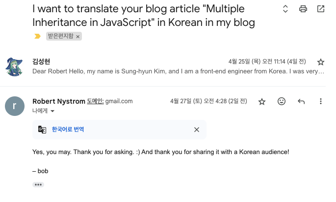

이 글은 Robert Nystrom의 글 ["Multiple Inheritance in JavaScript"](https://journal.stuffwithstuff.com/2011/02/21/multiple-inheritance-in-javascript/)를 원작자의 허락 하에 번역한 글입니다.



---

뜨거운 가스레인지를 바라보다 보면 거기에 손을 대보고 싶은 이상한 충동을 느낄 때가 있나요? 거기 손을 대면 분명히 화상을 입겠지만, 가스레인지를 바라볼수록 그 충동은 강해집니다. 며칠 전 나도 비슷한 충동을 느꼈습니다: *JavaScript에서 다중 상속을 구현할 수 있을 것 같다는 생각이 들었습니다.*

비유적인 의미지만 저는 가스레인지에 손을 대보았습니다. 적어도 Firefox 4 베타에서는 다중 상속이 가능했습니다. 저는 좋은 해킹 기법을 피하지 않기에 이것이 어떻게 작동하는지 하나하나 분해해서 이 글을 통해 하나하나 보이려고 합니다(전체 내용은 [여기](https://github.com/munificent/multipleinheritance.js)에 있습니다.). 이에 더해서 이 글을 읽으면 JavaScript에서 곧 나올 멋지고 매우 잠재력이 큰 기능에 대해 알게 될 것이고, 아마도 다중 상속에 대한 생각을 바꿀 수도 있을 겁니다.

# 문제가 무엇인가?

본격적으로 작업을 시작하기 전에 왜 다중 상속에 대해 생각하게 되었는지 설명하도록 하겠습니다. 으레 그렇듯이 좌절이 이런 발명을 만들어냈습니다. 제가 겪은 문제는 이런 것이었습니다.

위젯 라이브러리가 있다고 합시다. 이 라이브러리의 위젯 클래스 계층을 상속해서 직접 컨트롤을 만들 수 있습니다. 모든 훌륭한 21세기 클래스 라이브러리와 마찬가지로 이 라이브러리도 엄격하게 단일 상속만을 사용합니다. 왜냐하면 다중 상속은 악마이기 때문입니다. 여기 그 계층의 일부가 있습니다(모두 아스키 아트로 되어 있습니다):

```
       ┌────────┐
       │ Widget │
       └────┬───┘
            │
     ┌──────┴──────┐
┌────┴─────┐ ┌─────┴─────┐
│ Hideable │ │ Container │
└──────────┘ └───────────┘
```

Widget은 모든 위젯이 기본적으로 상속받는 루트 클래스입니다. 이 클래스에는 이름과 같은, 모든 위젯이 필요로 하는 핵심 요소들이 있습니다. Hideable은 보이는지 여부를 토글할 수 있어야 하는 위젯들을 위한 `show()`와 `hide()` 메서드를 추가합니다. Container는 다른 자식 위젯들을 포함할 수 있는 부모 위젯을 위한 클래스입니다. `addChild()`, `listChildren()` 등의 메서드를 정의합니다.

이제 저는 제 작은 위젯을 만들기 위해 왔습니다. 제가 만들 위젯은 DropDownMenu입니다. 짐작할 수 있겠지만, 이 위젯은 자식 위젯들(메뉴 아이템들)의 모음을 가지고 있습니다. 그리고 드롭다운이기 때문에 보이거나 숨길 수 있어야 합니다. 이때의 문제는 Hideable과 Container 둘 다에서 상속받을 수 없다는 것입니다.

하나의 해결책은 기본 클래스(base class)들을 이렇게 재구성하는 것입니다:

```
┌────────┐
│ Widget │
└────┬───┘
┌─────┴─────┐
│ Container │
└─────┬─────┘
┌─────┴────┐
│ Hideable │
└──────────┘
```

이제 저는 Hideable에서 상속받기만 하면 됩니다. 하지만 바로 다음날 저는 또 새로운 위젯인 Tooltip을 만들어야 합니다. 이 위젯은 숨겨지고 보여질 수 있어야 하지만 자식 위젯은 필요하지 않습니다. 즉 Tooltip은 Hideable을 상속받아야 하지만 그렇게 되면 Container에 관련된 것들까지 모두 상속받게 되어 메모리를 낭비하게 됩니다.

또한 그렇게 하면 구조를 이해하기가 복잡해진다는 더 큰 단점도 있습니다. 나중에 누군가가 제 Tooltip 클래스를 보고 Container에서 필요한 것들이 있었을 거라 생각할 수 있고, Container의 무엇이 필요했고 왜 필요했는지 파악하느라 시간을 쓸 수 있습니다. Container를 변경하는 것은 Tooltip을 망가뜨릴 수 있고 그에 반해 얻는 이득도 없습니다. 별로네요!

이걸 고치기 위해 다시 구조를 정리합니다. 만약 Hideable이 필요하지만 Container는 필요하지 않은 경우가 있다면 계층 상에서 Hideable이 Container 위에 있어야 합니다. 이렇게 말입니다.

```
┌────────┐
│ Widget │
└────┬───┘
┌─────┴────┐
│ Hideable │
└─────┬────┘
┌─────┴─────┐
│ Container │
└───────────┘
```

아주 좋고 멋집니다. 그 다음날에 저는 새로운 위젯인 ListBox를 만들게 되었습니다. 이 위젯은 숨길 필요가 없지만 자식 위젯을 가지고 있습니다. 다시 처음 시작한 곳으로 돌아왔습니다. 이 문제에는 해결책이 없습니다.

**단일 상속만 사용할 수 있는 상태에서는 임의의 클래스들을 결합할 수 있도록 하는 클래스 계층 구조를 만들 수 없습니다.**

저는 제가 만드는 위젯이 상속할 "올바른" 클래스를 찾기 위해 많은 시간을 들였습니다. 그리고 위의 사실을 깨닫기 전까지는 제가 왜 그렇게 좌절했는지 이해하지 못했습니다. 문제는 저에게 있는 것이 아니었습니다. 사용하고 있는 라이브러리의 클래스 계층에 있는 것도 아니었습니다. 단일 상속이 충분하다는 가정이 문제였습니다.

# 선행 기술

텍스트 에디터로 달려가기 전에, 다른 JS 클래스 시스템은 어떻게 하고 있을까요? 저는 JavaScript 라이브러리 전문가는 아닙니다. 하지만 클래스와 상속을 모방하는 것으로 보이는 라이브러리들은 프로토타입 체인을 조작하는 방식으로 이를 수행했습니다. 그리고 그런 라이브러리들은 거의 모두가 프로토타입 체인이 가지고 있는 제한인 단일 상속을 똑같이 가지고 있습니다. 이것은 단순성과 성능 측면에서 훌륭한 선택이지만, 제가 원하는 것은 아닙니다.

Tom Van Cutsem의 [Traits.js](https://traitsjs.github.io/traits.js-website/)는 주목할만한 반례입니다. 이 라이브러리에서는 여러 trait들을 구성할 수 있습니다. 저는 이것이 구성 시점에 모든 trait들을 펼치는 방식으로 이루어진다고 생각합니다. 만약 두 trait A, B를 함께 구성해서 새로운 trait C를 만든 후 A에 새로운 멤버를 추가한다면, C는 그 새로운 멤버를 가지지 않습니다. 이것은 더 나아졌지만, 여전히 제가 원하는 것은 아닙니다.

저는 완전히 런타임에 결합되는 방식의 다중 상속을 구현하고 싶었습니다. JavaScript의 멋진 점 하나는 기존 프로토타입을 확장할 수 있다는 것입니다. 저는 이것이 다중 상속에서도 작동하기를 원했습니다. 만약 제가 기존의 기본 클래스에 메소드를 추가한다면, 그 기본 클래스를 상속하는 모든 클래스는 그 메소드를 가져야 하는 겁니다. 심지어 제가 새로운 메서드를 정의하기 전에 해당 클래스들이 정의되었더라도 말입니다.

# 프로토타입 언어의 원형

제 목표를 감안할 때 제가 어떤 *종류*의 다중 상속 시스템을 원하는지는 여전히 명확하지 않습니다. [C++처럼](https://www.parashift.com/c++-faq-lite/basics-of-inheritance.html) 작동해야 할까요? 아니면 [Ruby의 믹스인처럼](https://ruby-doc.com/docs/ProgrammingRuby/html/tut_modules.html)? [Scala의 trait처럼](https://docs.scala-lang.org/tour/traits.html)? 물론 생각해보면 답은 하나뿐입니다...

프로토타입 기반 언어의 조상이자 Eich가 JavaScript를 만드는 데 직접적인 영감을 준 언어이며, "trait"이라는 용어를 처음으로 사용한 언어, 이는 [Self](https://en.wikipedia.org/wiki/Self_(programming_language))입니다. Self는 놀랍도록 간단하고도 강력한 방식으로 언어의 여러 부분들을 설계하였고, 이는 다중 상속을 다루는 방식에서도 마찬가지입니다.

이것은 다음과 같이 작동합니다. 모든 객체는 JavaScript에서처럼 속성의 집합을 가집니다. 속성 이름이 별표(`*`)로 끝나면, 그것은 "부모 속성"으로 간주됩니다. 객체의 속성을 찾는 과정은 다음과 같습니다.

1. 객체가 해당 속성을 가지고 있다면, 그것을 반환합니다.
2. 그렇지 않다면, 부모 속성에서 속성을 찾습니다. 알파벳 순으로 찾아보며, 속성을 찾는 즉시 중단합니다.

부모 속성을 확인할 때 그 부모는 다시 그들의 부모를 확인할 수 있습니다. 따라서 속성 조회는 부모 속성 그래프를 통한 깊이 우선 탐색이라 할 수 있습니다.

이는 매우 단순하지만 여기서 엄청나게 많은 멋진 것들이 마법처럼 나옵니다.

## 단일 상속

물론 단일 상속은 쉽습니다. 단 하나의 부모 속성만 가진 객체를 만들면 됩니다. JavaScript는 기본적으로 Self 디스패치의 퇴화된 경우라고 할 수 있습니다. 부모 속성의 이름이 '`__proto__`이어야 한다'는 규칙을 따르는 겁니다.

## 다중 상속

다중 상속도 쉽습니다. 둘 이상의 부모 속성을 가지기만 하면 됩니다. 객체는 완전히 열려 있는 속성의 묶음이라고 할 수 있으므로 원하는 만큼 많은 속성을 추가할 수 있습니다.

## 동적 상속

흥미로운 부분은 여기부터입니다. 부모를 따라가면서 속성을 찾을 때, 해당 부모 속성에 저장된 *값*을 찾습니다. 다른 속성처럼 부모 속성에도 새로운 값을 할당할 수 있습니다. 이 말은 객체의 부모를 *런타임에* 변경할 수 있다는 것입니다. 실제로 살아 있는 객체는 스스로의 클래스를 자발적으로 변경할 수 있습니다.

Java에서 대규모 코드를 구현하는 데에 필요한 [전체 상태 설계 패턴](https://en.wikipedia.org/wiki/State_pattern)을 알고 계신가요? 이것은 단순히 `object.someParent = newState`입니다.

## 제어된 결정 순서

다중 상속의 문제 중 하나는 이름 충돌이 있을 때 실제로 어떤 메서드가 호출되는지를 파악하는 것입니다. MyClass가 2개의 다른 클래스를 상속받고 그 두 클래스 모두 `foo()` 메서드를 가지고 있는 경우 `myObject.foo()`를 호출했을 때 어느 클래스의 `foo()`가 호출될까요?

Self에서는 이를 쉽게 제어할 수 있습니다. 우선순위를 갖도록 하고 싶은 부모 속성이 알파벳 순서상에서 먼저 오도록 이름짓기만 하면 됩니다.

## 단순 생성자

다중 상속의 다른 성가신 부분은 객체 생성입니다. 각각의 기본 클래스들은 자신의 생성자를 가지고 있을 것이며 이들을 상속받은 클래스가 생성될 때 호출되어야 합니다. 각 언어들은 이를 위해 복잡하고 특별한 지원을 가지고 있을 때가 많습니다. C++의 생성자 초기화 리스트, Java의 `super()` 키워드, C#의 `base()`, 멤버 초기화를 확인하기 위한 확실한 할당 정적 분석 등등.

"기본 클래스"가 객체의 속성에 불과하다면 생성은 단순히 몇몇 속성을 할당하는 것으로 간소화됩니다.

# 다시 우리의 예시로

만약 우리가 다중 상속을 마법적으로 어떻게든 작동하게 만들었다면 JavaScript에서 어떻게 보일까요?

제 목표는 이렇습니다. 저는 다음과 같은 바닐라 JavaScript 코드로 몇 가지 위젯 "기본 클래스"들을 정의할 수 있기를 원합니다:

```javascript
function Widget(name) {
  this.name = name;
}

Widget.prototype.getName = function() {
  return this.name;
}

function Hideable() {}

Hideable.prototype.hide = function() {
  log('hide ' + this.getName());
}

Hideable.prototype.show = function() {
  log('show ' + this.getName());
}

function Container() {
  this.children = [];
}

Container.prototype.addChild = function(widget) {
  log('addChild ' + widget.getName() + ' to ' + this.getName());
  this.children.push(widget);
}

Container.prototype.listChildren = function() {
  log('children for ' + this.getName());
  for (var i = 0; i &lt; this.children.length; i++) {
    log('- ' + this.children[i].getName());
  }
}
```

저는 위젯 클래스를 만들 때, 클래스마다 부모 속성의 집합을 하나씩 갖도록 하고 이 집합에 있는 모든 부모 속성들을 해당 클래스가 상속받도록 하고 싶습니다. JavaScript의 속성명에 `*`을 사용할 수 없으므로 저는 `_p`를 사용할 것입니다. 그래서 제 위젯의 생성자는 다음과 같아야 합니다:

```javascript
var MyWidget = magic(function(name) {
  this.widget_p    = new Widget(name);
  this.hider_p     = new Hideable();
  this.container_p = new Container();
})
```

`magic` 이라는 약간의 부분을 제외하면 이것은 다른 JavaScript의 생성자처럼 보입니다. 그러나 이 객체를 *사용할* 때 이 객체는 부모 객체들이 제공하는 모든 메서드를 지원해야 합니다. 다시 말해서, 이것은 다음과 같이 동작해야 합니다:

```javascript
var widget = new MyWidget('Abe');

// From Widget:
log(widget.getName());

// From Hideable:
widget.hide();
widget.show();

// From Container:
widget.addChild(new MyWidget('Ben'));
widget.addChild(new MyWidget('Cid'));
widget.addChild(new MyWidget('Dan'));
widget.listChildren();
```

불가능하다고요? 계속 읽어 보세요.

# 프록시의 힘을 보아라

ECMAScript의 다음 버전의 코드네임인 [Harmony](https://en.wikipedia.org/wiki/ECMAScript_version_history#ES2015)에서 계획된 기능 중 하나는 [프록시](https://tvcutsem.github.io/proxies_tutorial) 지원입니다. 프록시는 그 이름이 암시하는 것처럼, 다른 객체를 대신하는 객체입니다. 예를 들어, 프록시 객체 `jamesBrown`이 있고 그것을 이용해 `jamesBrown.getOnUp()`을 실행하면, 런타임은 그 호출을 숨겨진 프록시 객체에 위임합니다.

프록시는 그 자체로는 단순한 간접 참조 수준의 무언가일 수 있습니다. 하지만 중요한 것은 프록시가 *어떻게* 위임하는지입니다. 프록시는 *명령적으로* 위임합니다. 프록시에서 속성을 찾을 때 JavaScript는 자동으로 핸들러 객체에서 같은 이름의 속성을 찾는 게 아닙니다. 대신 요청된 속성의 이름을 가지고 그 핸들러의 특별한 `get` 메서드를 호출합니다.

그 간접 참조를 통해 우리는 디스패치에 대해 완전히 *프로그래밍적인* 제어가 가능하게 되었습니다. 우리는 우리가 꿈꾸는 *어떤* 종류의 상속 체계라도 구현할 수 있습니다. 우리가 해야 할 일은 일반 객체를 우리의 상속 체계를 구현하는 핸들러를 갖는 프록시로 교체하는 것뿐입니다.

Self 스타일의 부모 속성을 구현하기 위한 매우 원시적으로 조립된 핸들러는 다음과 같습니다:

```javascript
function createSelfHandler(obj) {
  return {
    get: function(receiver, name) {
      // Look in the main object.
      var value = obj[name];
      if (value !== undefined) return value;

      // Look in the parents.
      // BUG: Should look in field alphabetical order.
      for (var field in obj) {
        if (field.endsWith('_p')) {
          value = obj[field][name];
          if (value !== undefined) return value;
        }
      }

      // Not found.
      return undefined;
    }
  };
}
```

우리가 MyWidget 클래스의 인스턴스를 생성할 때, 우리는 사실 그 프록시의 인스턴스를 얻고자 합니다. 우리는 생성자도 프록시화함으로써 이를 달성합니다.

```javascript
function magic(ctor) {
  var callTrap = function(args) {}
  var constructTrap = function(args) {
    return Proxy.create(createSelfHandler(
        new ctor(args)), Object.prototype);
  };
  return Proxy.createFunction(ctor, callTrap, constructTrap);
}
```

짜잔! 이제 우리가 `new MyWidget()`을 실행하면 프록시 객체를 돌려받습니다. 이후 프록시 객체를 통해 어떤 속성을 조회하면 프록시는 우리의 디스패치 함수로 전환되고 이 함수는 부모 속성을 어떻게 다룰지 알고 있습니다. 당신의 브라우저에서 편하게 동작하는 Self 스타일의 다중 프로토타입입니다.

# 이게 좋은 아이디어인가요?

짧게 말해서 "아니요." 당연히 그렇습니다. 이 작은 해킹은 실제 코드에 도입되어서는 절대 안 됩니다. 나는 그저 그것을 동작시킬 수 있는지 확인하고 싶었습니다. 프록시는 너무나도 강력하고, 이 글에서 한 일은 그저 프록시를 통해 할 수 있는 것들의 표면을 약간 긁은 것에 불과합니다. ("JavaScript의 Active Record"를 들어 본 적이 있나요? 아니면 "remote object"는?) 하지만 이 글에서 한 것은 정말 부끄러운 해킹이고, 이를 기반으로 한 애플리케이션의 성능이 어떨지 생각하고 싶지도 않습니다.

그보다 더 중요한 질문은 "다중 상속이 좋은 아이디어인가?"입니다. 저는 여러 해 동안 "단일 상속 + 인터페이스" 주의자였지만, 이제 다중 상속이 좋은 아이디어라고 느끼기 시작했습니다.

프로그래머의 도구 상자에서 가장 강력한 도구 중 하나는 *합성*입니다. 기존의 부품들을 조합해서 새로운 것을 만드는 겁니다. *여러* 부분들을 조합할 수 있다는 것은 `n`개의 고유한 부품들만 가지고도 `2^n`가지의 다른 조합을 만들 수 있는 능력을 우리에게 줍니다. 특별한 이유 없이 그 힘을 포기해서는 안 됩니다.

# 하지만 다중 상속은 사용하기 너무 힘들어요!

(역주: 원문은 "But multiple inheritance killed my dog!"으로, [kill my dog은 화나거나 좌절스럽거나 인생에 회의를 느낄 때 쓰는 관용어구다.](https://www.urbandictionary.com/define.php?term=kill%20my%20dog))

[고전적인 인용](http://regex.info/blog/2006-09-15/247)을 변형하자면,

> 몇몇 사람들은 문제 하나를 마주했을 때 "음, 다중 상속을 사용하겠어"라고 생각합니다. 이제 그들은 여러 개의 문제를 가지고 있습니다.

맞습니다. 실제로 다중 상속에는 진짜로 문제가 있습니다. 하지만 내 추측으로, 그 문제들은 실제보다 과장되어 있습니다. 다중 상속에 의해 직접 상처를 받아본 백발의 C++ 프로그래머들의 수는 시간이 지남에 따라 줄어들고 있으며, 다중 상속에 관한 이야기들은 캠프파이어 자리에서 전해지는 귀신 이야기처럼 입에서 입으로 전해질수록 점점 더 끔찍함을 더해갑니다.

본론으로 들어가면, 다중 상속을 사용할 때 발생하는 두 가지 주요 문제는 내가 아는 한 다음과 같습니다.

- 같은 기본 클래스로 도달하는 여러 경로가 있음으로 인해서 중복 상태를 가지는 것
- 여러 클래스가 같은 메서드를 오버라이드할 때 모호하거나 혼란스러운 디스패치를 얻는 것

두 가지 간단한 해결책이 있습니다. *상태 최소화*와 *충돌 최소화*입니다.

상태 최소화는 일반적으로 좋은 생각입니다. 우리가 마침내 함수형 프로그래밍 집단에서 배우고 있는 것처럼 말입니다. 상태가 적을수록 당신의 코드는 이해하기 쉬워집니다. 그러므로 만약 많이 상속할 것으로 예상되는 클래스를 만들고 있다면 클래스에서 정의하는 필드의 수를 최소한으로 하려고 노력하세요. 이상적인 경우라면 그 클래스는 상태를 전혀 가지지 않는 메서드의 묶음일 것입니다.

충돌 최소화는 계층을 가능한 한 평평하게 유지하려고 시도함으로써 이루어질 수 있습니다. 다중 상속을 허용하는 것은 여기서 사실 *도움이* 됩니다. 다중 상속을 허용하면 리프 클래스가 여러 가지를 상속받기 위해서 단일 상속의 깊은 체인을 사용할 필요가 없기 때문입니다. 리프 클래스는 상속받아야 할 모든 것을 하나의 1차원 리스트에서 직접 상속받을 수 있습니다.

응집도와 일관성을 갖춘 좋은 클래스 설계를 하는 것도 도움이 됩니다. 각각의 클래스가 하나의 작은 일을 하며 또한 오직 그것만을 수행한다면 메서드 충돌의 확률은 낮아질 것입니다. 이름 충돌이 있다면 그건 아마 좋지 않은 코드일 것입니다. 같은 이름을 갖는 개념이 왜 여러 클래스에 퍼져 있는 겁니까?

# 그러니 그냥 합성을 사용하세요

제가 설명하는 것은 상속보다는 합성에 훨씬 더 가깝습니다. MyWidget이 구성된 방식을 보면, 우리는 말 그대로 그것을 *합성하고* 있습니다. 기본 클래스들은 MyWidget의 속성으로 직접 들어가 있습니다. 그러니 그냥 그것을 사용하는 건 어떨까요? 위의 예제가 단순히 다음과 같아지면 안되는 이유가 있나요?

```javascript
var widget = new MyWidget('Abe');

// Widget에서:
log(widget.getWidget().getName());

// Hideable에서:
widget.getHideable().hide();

// Container에서:
widget.getContainer().addChild(new MyWidget('Ben'));
```

이것이 보기 싫은 코드인 것을 제쳐놓더라도, 여기에는 제게 나빠 보이는 것 한 가지가 있습니다. MyWidget이 Hideable로부터 `hide()`를 받는 것은 구현 세부사항이어야 합니다. 호출하는 사람의 관점에서 `hide()`는 MyWidget이 수행할 수 있는 것으로 보여야 하고 `hide()`의 코드가 어디에 그리고 *어떤 방식으로* 정의되어 있는지는 신경쓰지 않아야 하고 신경써서는 안됩니다.

# 다음 단계

이 모든 것은 제가 어떻게 코드를 작성할 때 무엇이 가능했으면 좋겠는지에 관한 이야기입니다. 저는 재사용 가능한 trait의 1차원 집합을 합성하는 방식으로 클래스를 구성할 수 있기를 원합니다. 저는 프레임워크 설계자들이 일부 사용자를 외면하는 방식의 취약한 계층 구조에 대해 고민하면서 몇 주를 소모하기를 원하지 않습니다. 그 대신 저는 그들이 이렇게 말할 수 있으면 좋겠습니다. "여기 31가지 서로 다른 토핑들이 있습니다. 원하는 대로 섞어보세요."

동시에 저는 그런 trait과 믹스인 같은 것들이 자체적으로 확장 가능하게 하고 싶습니다. 예를 들어 모든 순회 가능한 컬렉션 클래스가 상속받는 "enumerable" trait가 있다고 해봅시다. 저는 그 클래스에 `map()`이나 `fold()` 같은 메서드를 곧바로 추가할 수 있으면 좋겠습니다. `Collections.max(someEnumerable)` 같은 [못생기고 쓸모없는 헬퍼 클래스](https://docs.oracle.com/javase/7/docs/api/java/util/Collections.html)로 넘어가지 않고도 제 코드베이스의 모든 *enumerable* 클래스에서 그 메서드들을 사용할 수 있도록 말입니다.

더 적은 보일러플레이트, 더 적은 복사/붙여넣기, 더 평탄한 계층 구조, 더 나은 합성 가능성. 그것이 제가 목표로 하는 것입니다.

# 참고

https://journal.stuffwithstuff.com/2011/02/21/multiple-inheritance-in-javascript/