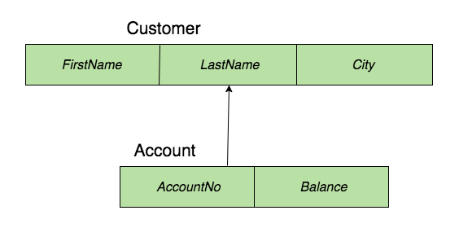
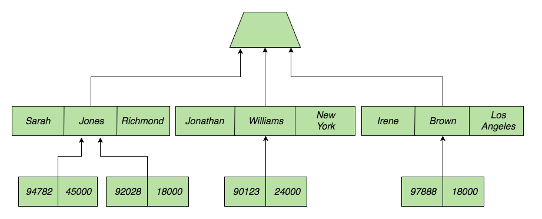

이 글은 Two-Bit History의 "The Most Important Database You've Never Heard of"을 원작자의 허락 하에 번역한 것입니다. 원문은 [여기](https://twobithistory.org/2017/10/07/the-most-important-database.html)에서 읽을 수 있습니다.

# The Most Important Database You've Never Heard of

1962년 존 F. 케네디는 미국인들에게 10년 안에 인간을 달에 보내자는 연설을 했다. 이 연설은 영웅적인 공학적 노력에 불을 붙였고 그 노력은 닐 암스트롱이 달 표면에 첫발을 내딛는 성과로 이어졌다. 이 공학적 노력의 결실 가운데 상당수는 눈에 잘 띄고 매력적이었다. 새로운 우주선과 우주복, 월면차 같은 것들이었다. 하지만 아폴로 계획은 믿기 어려울 정도로 복잡했기 때문에 일상적인 작업을 처리하기 위해서조차 새로운 기술을 발명해야 했다. 그중 하나가 IBM의 정보 관리 시스템(Information Management System, IMS)이었다.

IMS는 데이터베이스 관리 시스템이다. NASA는 새턴 5호 로켓 제작에 들어가는 모든 부품을 추적하기 위해 이런 시스템이 필요했다. 부품 수가 200만개에 달했기 때문에 이는 도전적인 과제로 예상되었다. 1960년대에 데이터베이스란 새로운 개념이었고 NASA가 가져다 쓸 만한 기존 제품도 없었다. 그래서 1965년 NASA는 IBM에 North American Aviation, Caterpillar Tractor와 협력해 데이터베이스 시스템을 만들어 달라고 요청했다. 1968년에는 IBM이 NASA에 동작 가능한 IMS 버전을 설치했다. 당시 명칭은 ICS/DL/I, "Informational Control System and Data Language/Interface"의 준물이었다. (IBM은 한동안 슬래시 기호에 짧고도 불행한 심취를 보인 듯 하다. [PL/I](https://en.wikipedia.org/wiki/PL/I)을 보라.) 2년 후 IBM은 ICS/DL/I의 이름을 "IMS"로 바꾸고 다른 고객들에게 판매하기 시작했다. IMS는 상업적으로 이용할 수 있었던 최초의 데이터베이스 관리 시스템 중 하나였다.

IMS는 놀랍게도 오늘날에도 사용되고 있다. 소규모로만 쓰이는 것도 아니다. 은행, 보험사, 병원, 정부기관에서 온갖 핵심 업무에 IMS를 쓴다. 포춘 1000대 기업의 95% 이상이 어떤 형태로든 IMS를 사용하며 미국의 5대 은행도 모두 IMS를 사용한다.[^1] 당신이 ATM에서 현금을 인출할 때면 당신의 거래 처리 과정 어딘가에서 IMS와 상호작용하고 있을 가능성이 매우 높다. 관계형 데이터베이스가 이제 오래된 취급을 받고 최신의 NoSQL DB와 점점 더 경쟁하고 있는 세상에서 IMS는 화석이나 다를 바 없다. IMS는 관계형 데이터베이스가 발명되기도 전 시대의 유물이다. 관계형 데이터베이스는 1970년이 되어서야 등장했다. 그런데 중요한 일들은 모두 IMS가 맡고 있는 것이다.

바로 이 점이 IMS를 매우 흥미로운 존재로 만든다. 관계형 데이터베이스를 어떻게 바라보는지에 따라 IMS는 관계형 데이터베이스가 이전 모델들을 어떻게 개선했는지를 보여주는 구식 모델의 예시가 될 수도 있고 특정 문제에 대해서는 더 적합한 대안적 모델의 예시가 될 수도 있다.

IMS는 계층형 모델에 따라 동작한다. 데이터를 JOIN으로 결합할 수 있는 테이블로서 바라보는 대신 IMS는 데이터를 트리 구조로 바라본다. 데이터베이스에 정의된 각 세그먼트 유형은 다른 세그먼트 유형을 자식으로 가질 수 있다. 자식 세그먼트 유형은 부모 유형에 속한 세그먼트 하나를 조회할 때 함께 알고 싶을 만한 추가 정보를 나타낸다.

(역주: 여기서 말한 "세그먼트 유형"의 원문은 record type이다. 아마 관계형 DB에서 DB의 각 row를 레코드라고 부르기 때문에 이해를 돕기 위해 record라는 용어를 사용한 듯 하다. [계층형 데이터베이스의 record가 관계형 DB의 row에 대응되는 건 사실](https://www.ibm.com/docs/en/ims/15.6.0?topic=ims-data-structures-sql)이라 틀린 표현은 아니다. 그러나 IMS에는 하나의 루트 세그먼트와 그 자식들을 전부 포함하는 의미의 "database record"라는 것도 있다. 따라서 여기서는 혼동을 막기 위해 좀더 정확한 표현인 "세그먼트"를 사용하겠다. [세그먼트는 IMS 계층 구조상에서 하나의 노드를 이루는 데이터 단위로 필드들로 구성되었다.](https://www.ibm.com/docs/en/ims/15.6.0?topic=database-hierarchy-examples))

예를 들어 은행 고객에 관한 정보를 저장한다고 해보자. 그럼 고객을 나타내는 종류의 세그먼트 하나와 계좌를 나타내는 종류의 세그먼트 하나를 둘 수 있다. 관계형 데이터베이스의 각 테이블에 컬럼들이 있듯이 이 세그먼트들도 서로 다른 필드들을 가진다. 가령 고객 세그먼트에 이름 필드, 성씨 필드, 거주지 필드를 두고 싶을 수 있다.

그다음에는 구조에 대한 결정을 해야 한다. 이는 고객을 먼저 조회하고 나서 해당 고객의 계좌 정보를 찾을 가능성이 높을지 계좌를 먼저 조회한 뒤 해당 계좌 소유자의 정보를 찾을 가능성이 높은지를 결정하는 걸 통해 이루어진다. 고객을 먼저 조회하기로 했다고 해보자. 그러면 계좌 세그먼트 유형을 고객 세그먼트 유형의 자식으로 만든다. 이걸 다이어그램으로 나타내면 데이터베이스 모델은 다음과 같은 모습이 된다.[^2]

실제 데이터베이스는 이런 모습이 될 것이다.

데이터를 이런 방식으로 모델링하면 데이터가 실제로 저장되는 방식에 가까운 구조를 갖게 된다. 각 부모 세그먼트는 자식 세그먼트를 가리키는 포인터를 갖고 있다. 따라서 루트 노드에서 시작해 트리 아래쪽으로 내려가는 작업은 효율적이다. (사실 각 부모들은 첫 번째 자식을 가리키는 포인터 하나만 저장하고 있다. 자식 세그먼트들은 다시 자신의 형제 세그먼트를 가리키는 포인터를 가진다. 이렇게 하면 하나의 세그먼트가 갖는 자식 수에 따라 세그먼트가 차지하는 메모리 크기가 변하지 않는다는 걸 보장할 수 있다)

이 효율적인 방식은 데이터 접근을 매우 빠르게 만들어줄 수 있다. 단 처음 데이터베이스의 구조를 설계할 때 예성했던 방식으로 데이터를 조회한다는 전제하에 그렇다. IBM에 따르면 IMS 인스턴스 하나는 초당 10만건이 넘는 트랜잭션을 처리할 수 있다. 이게 아마 IMS가 오늘날에도, 특히 은행에서 계속 사용되는 큰 이유일 것이다.[^3] 하지만 이런 장점의 대가로 상당한 유연성을 잃게 된다. 데이터베이스 설계 시 예상하지 못했던 방식으로 데이터에 접근하려고 할 시 어려움을 겪는 것이다.

설명을 위해, 고객 조회보다 먼저 계좌 데이터에 접근하고 싶을 때 어떤 일이 벌어지는지 생각해 보자. 예를 들어 고객이 주소를 변경하기 위해 전화를 걸었고, 우리는 그들의 계좌번호를 이용해 그가 누군지 고유하게 식별하고자 하는 상황이다. 그럼 우리는 계좌번호를 이용해 계좌를 찾은 다음 그 계좌의 소유자를 찾아야 한다. 하지만 모든 데이터 접근은 트리의 루트에서 시작한다. 때문에 고객을 먼저 특정하지 않은 상태에서 계좌에 효율적으로 도달할 수 있는 방법이 없다.

이 문제를 해결하기 위해 우리는 계좌 세그먼트에서 시작하는 두 번째 트리 혹은 계층 구조를 도입할 수 있다. 이 트리에서는 계좌 세그먼트가 고객 세그먼트를 자식으로 갖는다. 그러면 계좌를 먼저 조회한 후 고객 데이터에 효율적으로 접근할 수 있다.

그러나 이 방식은 데이터베이스에 이미 저장한 정보를 중복해서 또 저장해야 한다는 문제가 있다. 우리는 같은 정보를 다른 순서로 담은 트리 두 개를 유지하게 된다. 또다른 방법은 계좌 정보를 입력받아 적절한 계좌 세그먼트를 우리에게 알려줄 수 있는 계좌 인덱스를 설정하는 것이다. 이 방법도 동작하지만 이후 삽입과 수정 작업을 진행할 때 추가적인 처리가 필요해진다.

바로 이런 유연성 부족과 정보 중복 문제 때문에 E. F. Codd가 관계형 모델을 제안했다. Codd는 그의 1970년 논문, "대규모 공유 데이터 뱅크를 위한 관계형 데이터 모델"(A Relational Model of Data for Large Shared Data Banks)의 서두에서, 데이터가 실제로 어떻게 저장되는지에 대해 사용자가 전혀 알 필요가 없도록 해주는 데이터 저장 모델을 제시하고자 한다고 말한다.

한 관점에서 보면 계층형 모델은 완전히 IMS의 설계자들이 선택한 데이터 저장 방식의 결과물이다. 물리적인 저장 방식이 만든 결과라는 점에서 상향식(bottom-up) 모델이라고 할 수 있다. 반면 관계형 모들은 관계 대수(relational algebra)를 기반으로 한 추상적 모델이다. 데이터 저장 방식이 관계형 모델을 수용할 수만 있다면 구체적으로 어떻게 구현되는지는 상관없다는 점에서 하향식(top-down) 모델이라고 할 수 있다. 

관계형 모델의 가장 큰 장점은 데이터베이스가 데이터를 특정 방식으로 저장하도록 만드는 결정을 내렸더라도, 그 결정 때문에 어떤 쿼리를 실질적으로 수행할 수 없는 상황에 빠질 일이 없다는 것이다.

이 모든 걸 고려하더라도 관계형 모델은 추상화이다. 그리고 우리 모두 알다시피 추상화에는 대가가 따른다. 은행과 대형 기관들이 부분적으로 IMS를 계속 사용해온 이유는 성능상의 이점이다. 핵심 업무를 담당하는 레거시 코드를 다시 작성하는 부담이 없었더라도 현대적인 데이터베이스로의 전환을 포기했을 거라고 단언하기는 어렵지만 말이다.

하지만 오늘날 널리 쓰이는 NoSQL 데이터베이스를 보면 관계형 모델의 편리함을 포기하는 대신 더 나은 성능을 얻고자 하는 사람들이 존재한다는 걸 알 수 있다. 사용자에게 데이터를 비정규화된 형태로 저장하기를 권장하는 MongoDB같은 시스템은 IMS와 크게 다르지 않다. 어떤 엔티티를 다른 JSON 레코드 안에 저장하기로 했다면 사실상 IMS의 계층형 구조 같은 걸 만든 셈이다. 또한 이후에 해당 데이터를 조회할 수 있는 방식에도 제약을 가한 것이다. 하지만 그게 당신이 감수하기로 한 트레이드오프일 수도 있다. 따라서 IMS가 E. F. Codd의 관계형 모델보다 몇 년 먼저 등장하지 않았다고 하더라도 IMS의 개발자들이 관계형 모델을 전면 채택하지 않았 만한 이유는 여전히 존재한다.

안타깝게도 IMS는 개인용 컴퓨터에서 다운로드받아서 사용해 볼 수 있는 소프트웨어가 아니다. 우선 IMS는 무료가 아니기에 IBM에서 구매해야 한다. 더 큰 문제는 IMS가 IBM z13과 같은 IBM 메인프레임에서만 실행된다는 점이다. 아쉬운 일이다. IMS를 직접 다뤄보면서 MySQL같은 시스템과 정확히 어떻게 다른지 알아보는 일은 분명 즐거웠을 것이다.

하지만 그런 기회가 없더라도 우리가 예상하지 못하거나 익숙치 않은 방식으로 동작하는 소프트웨어 시스템에 대해 생각해보는 건 흥미롭다. 그리고 아무리 낯선 시스템이라고 해도 그게 지역 병원, 금융 부문 전체 그리고 연방 정부까지 뒷받침하고 있다면 더욱 흥미롭기 마련이다.

*만약 이 글이 재미있었다면, 비슷한 글이 4주마다 올라옵니다! 트위터에서 [@TwoBitHistory](https://x.com/TwoBitHistory)를 팔로우하거나, [RSS 피드](https://twobithistory.org/feed.xml)를 구독하여 새로운 글이 올라올 때 놓치지 않도록 하세요.*

## 번역 중 참고한 문서

IBM docs, The segment

https://www.ibm.com/docs/en/ims/15.6.0?topic=terminology-segment

IBM docs, IMS data structures for SQL

https://www.ibm.com/docs/en/ims/15.6.0?topic=ims-data-structures-sql

IBM docs, Database hierarchy examples

https://www.ibm.com/docs/en/ims/15.6.0?topic=database-hierarchy-examples

[^1]: https://youtu.be/DhlpnSbSuJE?t=3m13s

[^2]: Klein, Barbara. An Introduction to IMS: Your Complete Guide to IBM Information Management System. IBM Press, 2012

[^3]: www.slideshare.net/roberthain/ims05-ims-100-k-benchmark