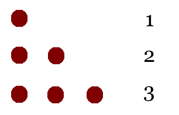
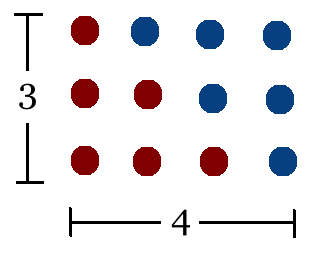
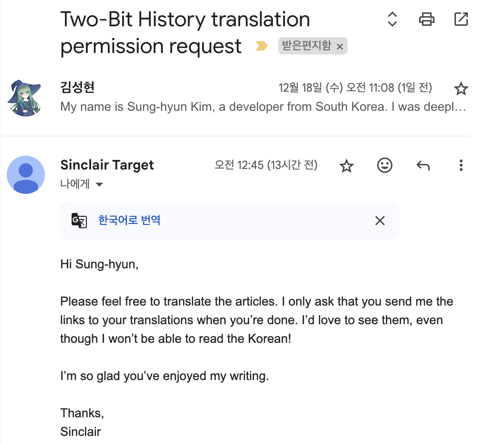

이 글은 Two-Bit History의 What Did Ada Lovelace's Program Actually Do? 글을 원작자의 허락 하에 번역한 것입니다. 원문은 [여기](https://twobithistory.org/2018/08/18/ada-lovelace-note-g.html)에서 읽을 수 있습니다.

---

마이크로소프트의 창업 이야기는 컴퓨팅의 역사에서 가장 유명한 에피소드 중 하나다. 1975년 폴 앨런은 앨버커키로 날아갔다. 그와 빌 게이츠가 함께 개발한, 알테어(Altair) 마이크로컴퓨터에서 동작하는 BASIC 인터프리터를 시연하기 위해서였다. 앨런과 게이츠는 알테어를 보유하고 있지 않았기 때문에, 하버드의 컴퓨터 시스템에서 작동하는 에뮬레이터를 개발해 인터프리터를 테스트했다. 이 에뮬레이터는 인텔 8080 프로세서의 공개된 사양만을 기반으로 만들어졌다. 앨런이 실제 알테어 컴퓨터에서는 처음으로 그들의 인터프리터를 실행했을 때 그것이 제대로 작동할지 전혀 확신하지 못했다. 그와 게이츠가 개발한 프로그램을 구매해주길 바랐던 사람들 앞에서의 시연이었다. 그 인터프리터는 잘 작동했다. 바로 다음 달, 앨런과 게이츠는 그들의 회사를 공식적으로 설립했다.

폴 앨런과 빌 게이츠가 BASIC 인터프리터를 개발하기 100년도 더 전에, 에이다 러브레이스는 컴퓨터 프로그램을 작성하고 이를 출판했다. 그녀 역시 실제 컴퓨터가 없이 설명만 들은 상태에서 프로그램을 작성했다. 하지만 그녀의 프로그램은 마이크로소프트의 BASIC 인터프리터와는 다르게, 실행되지 못했다. 그녀가 프로그램을 실행할 대상으로 삼았던 컴퓨터는 결국 제작되지 않았기 때문이다.

러브레이스가 작성한 프로그램은 흔히 세계 최초의 컴퓨터 프로그램으로 불린다. 하지만 모든 이들이 이 명칭에 동의하는 것은 아니다. 사실 러브레이스의 유산은 컴퓨팅의 역사에서 가장 논쟁이 치열한 주제 중 하나다. 월터 아이작슨은 그녀의 공헌의 범위와 가치를 둘러싼 논쟁이 "소규모 학문 분야의 특화된 연구"에 해당한다고 언급한 바 있다[^1]. 이러한 논쟁은 러브레이스가 여성이라는 사실로 인해 더욱 민감한 문제로 다루어져 왔다. 역사학자들은 러브레이스가 정당한 평가를 받았는지 혹은 과대평가되었는지를 주장하기 위해 다양한 1차 사료들을 인용해 왔다. 하지만, 정작 그녀의 출판물에 담긴 기술적 세부 사항을 설명하는 데에는 상대적으로 적은 시간을 할애하는 듯 하다. 그 기술적인 세부 사항이 가장 흥미로운 부분이기 때문에 이러한 경향은 아쉬운 일이다. 1843년에 작성된 프로그램이 어떻게 쓰였는지 누구나 알고 싶지 않겠는가?

객관적으로 봤을 때, 러브레이스의 프로그램을 어떤 단순화도 없이 비전문가에게 설명하는 건 쉽지 않다. 하지만 그 복잡함이 바로 그녀의 프로그램을 더 놀랍게 만든다. 러브레이스가 "최초의 프로그래머"로 불릴 수 있는지와 상관없이, 러브레이스의 프로그램이 지닌 엄밀함은 이전의 어떤 작업보다도 훨씬 뛰어났다. 러브레이스는 연산을 반복할 수 있는 그룹으로 만들어서 체계적으로 구성하는 방법을 고심했고, 반복문(loop) 개념을 고안했다. 그녀는 변수가 변화하는 상태를 추적하는 것이 얼마나 중요한지를 인식하고, 이러한 변화를 시각적으로 나타낼 수 있는 표기법을 도입했다. 프로그래머인 나로서는 러브레이스가 했던 작업이 오늘날 소프트웨어를 작성하는 경험과 얼마나 닮아 있는지를 보고 깜짝 놀랐다.

이제 러브레이스의 프로그램을 좀 더 자세히 살펴보자. 그녀는 이 프로그램을 베르누이 수(Bernoulli numbers)를 계산하기 위해 설계했다. 베르누이 수가 무엇인지 이해하려면, 수천 년 전으로 거슬러 올라가야 한다. 이는 수학의 가장 오래된 문제 중 하나와 맞닿아 있기 때문이다.

# 제곱수들의 합

피타고라스 학파는 지중해 연안에 살면서 숫자를 숭배했다. 그들의 취미 중 하나는 조약돌을 사용해 삼각형을 만드는 것이었다.

조약돌 하나에 두 개의 조약돌로 이루어진 줄을 추가하면, 총 세 개의 조약돌로 이루어진 삼각형이 된다. 여기에 조약돌 세 개로 이루어진 줄을 추가하면, 총 여섯 개의 조약돌로 이루어진 삼각형이 만들어진다. 이런 방식으로 이전 줄보다 하나 많은 조약돌로 이루어진 줄을 추가해 가면서 계속할 수 있다. 여섯 줄로 이루어진 삼각형에는 총 21개의 조약돌이 들어간다. 그렇다면, 423줄로 이루어진 삼각형에는 몇 개의 조약돌이 필요할까?

피타고라스 학파가 찾고자 했던 것은, 모든 숫자를 하나하나 더하지 않고도 아래의 합계를 계산할 수 있는 방법이었다.

$$ 1 + 2 + 3 + \ldots + n $$

결국 그들은 같은 크기의 삼각형 두 개를 서로 맞붙여 직사각형을 만들고 직사각형의 면적을 구한 후 이를 2로 나누는 방식으로 삼각형에 들어가는 조약돌의 개수를 구할 수 있다는 사실을 깨달았다.

$$ 1 + 2 + 3 + \ldots + n = \frac{n(n+1)}{2} $$

아르키메데스는 이후 비슷한 문제를 탐구했다. 그는 다음과 같은 급수(series)를 계산하고자 했다.

$$ 1^2 + 2^2 + 3^2 + \ldots + n^2 $$

이 급수를 시각화하려면 점점 더 큰 정사각형(작은 정육면체로 이루어진)들이 차곡차곡 쌓여 피라미드 모양을 이루는 모습을 떠올리면 된다. 아르키메데스는 이런 피라미드를 만들기 위해 필요한 정육면체의 개수를 간단히 계산할 수 있는 방법이 있는지 궁금해했다. 예를 들어 423층으로 된 피라미드에 필요한 정육면체의 개수 말이다. 그는 기하학적인 해석도 가능하게 하는 해법을 기록했다[^2].

세 개의 피라미드를 결합해서 하나의 직각 각기둥(rectangular prism)을 구성할 수 있다. 이 각기둥의 한쪽 면에는 정육면체 하나의 높이와 같은 작은 돌출부가 생기는데 이 돌출부는 피타고라스 학파가 조약돌로 만든 삼각형과 동일한 규칙을 따른다([이 영상](https://www.youtube.com/watch?v=aXbT37IlyZQ)을 참고하면 무슨 말인지 이해하는 데 도움이 될 수 있다). 따라서 전체 도형의 부피를 다음 수식으로 표현할 수 있다.

$$ 3(1^2 + 2^2 + 3^2 + \ldots + n^2) = (n + 1)n^2 + (1 + 2 + 3 + \ldots + n) $$

1부터 n까지의 정수 합에 대한 피타고라스 학파의 공식을 대입하고 약간의 연산을 하면 다음과 같은 식을 얻을 수 있다.

$$ 1^2 + 2^2 + 3^2 + \ldots + n^2 = \frac{n(n+1)(2n+1)}{6} $$

499년 인도의 수학자이자 천문학자인 아리아바타(Aryabhata)는 그의 저서 아리아바티야(Aryabhatiya)에 1부터 n까지의 정수의 세제곱의 합을 구하는 공식을 포함시켰다.

$$ 1^3 + 2^3 + 3^3 + \ldots + n^3 = (1 + 2 + 3 + \ldots + n)^2 $$

그 후로도 1부터 n까지의 정수의 네제곱 합에 대한 공식이 출판되기까지는 500년이 더 걸렸다[^3].

이 시점에서, 1부터 n까지의 정수의 k제곱수들의 합을 구하는 일반적인 방법이 있는지에 대한 의문이 들 수 있다. 당시의 수학자들도 같은 상각을 하고 있었다. 독일의 수학자이자 약간 괴짜 수비학자였던 요한 파울하버는 1부터 n까지의 정수들의 17제곱에 이르는 합을 구하는 공식을 1631년에 발표했다. 그러나 그는 이 과정에 몇 년을 소요했을 가능성이 높으며, 일반적인 해법을 밝히지 않았다[^4]. 마침내 블레즈 파스칼이 1665년에 일반적인 방법을 제시했다. 하지만 이 방법은 k 제곱수들의 합을 구하기 위해 먼저 그보다 작은 모든 제곱수들의 합을 먼저 알아야 했다[^5]. 예를 들어, 1부터 n까지의 정수의 6제곱 합을 구하려면, 먼저 1부터 n까지의 정수의 5제곱까지의 합을 계산하는 방법을 알고 있어야 했다.

보다 실용적인 일반 해법은 1705년 사망한 스위스 수학자 야콥 베르누이의 사후 출판된 저서에 등장했다. 그는 1부터 n까지의 양의 정수들의 1제곱, 2제곱, 3제곱수들의 합을 계산하는 공식을 유도하는 데에서 시작했다[^6]. 베르누이는 이 공식을 다항식의 형태로 표현했으며, 그 형태는 다음과 같았다.

$$ 1 + 2 + 3 + \ldots + n = \frac{1}{2}n^2 + \frac{1}{2}n $$

$$ 1^2 + 2^2 + 3^2 + \ldots + n^2 = \frac{1}{3}n^3 + \frac{1}{2}n^2 + \frac{1}{6}n $$

$$ 1^3 + 2^3 + 3^3 + \ldots + n^3 = \left(\frac{1}{4}n^4 + \frac{1}{2}n^3 + \frac{1}{4}n^2\right) $$

파스칼의 삼각형을 활용하면서, 야콥 베르누이는 이 다항식들이 예측 가능한 패턴을 따른다는 사실을 깨달았다. 구체적으로 이야기하면, 베르누이는 각 항의 계수를 두 개의 요소로 나누었다. 하나는 파스칼의 삼각형을 이용해서 결정할 수 있었고 다른 하나는 다항식의 모든 계수를 더하면 항상 1이 되는 듯한 흥미로운 특성을 이용해서 유도할 수 있었다. 각 항에 붙어야 할 지수를 결정하는 것도 어렵지 않았다. 이 역시 예측 가능한 패턴을 따랐기 때문이다. 모든 계수의 합이 1이 된다는 규칙을 사용해 계산해야 했던 수들은 하나의 수열을 이루었고 이 수열은 이후 베르누이 수(Bernoulli numbers)로 불리게 되었다.

베르누이의 발견이 1부터 n까지의 정수들의 어떤 제곱의 합도 쉽게 구할 수 있게 되었다는 의미는 아니었다. 1부터 n까지의 정수의 k제곱의 합을 구하기 위해서는 k번째 베르누이 수까지의 모든 베르누이 수를 알고 있어야 했다. 각 베르누이 수는 그 이전까지의 베르누이 수들을 알아야만 계산할 수 있었다. 하지만 베르누이 수열을 길게 계산하는 것은 각 제곱의 합의 공식을 하나씩 유도하는 것보다 훨씬 더 효율적이었다. 따라서 베르누이의 발견은 수학 발전에 있어 중대한 도약이 되었다. 

# 배비지

찰스 배비지(Charles Babbage)는 1791년에 태어났다. 베르누이가 사망한 지 약 한 세기가 지난 후였다. 나는 늘 배비지가 기계식 컴퓨터를 설계했으나 실제로 제작하지는 않았다는 어렴풋한 인식을 가지고 있었다. 하지만 그 컴퓨터가 어떻게 작동하도록 설계되었는지에 대해 제대로 이해한 적은 없었다. 다행히 그 기본 아이디어는 그렇게 어렵지 않다. 또한 러브레이스의 프로그램은 배비지가 설계한 기계 중 하나에서 실행되도록 만들어졌기 때문에 배비지의 기계가 어떻게 작동했는지 살펴볼 필요가 있다.

배비지는 두 개의 서로 다른 기계적인 계산 장치를 설계했다. 첫 번째 기계는 차분 기관(Difference Engine)이라고 불렸다. 휴대용 계산기가 발명되기 전까지 사람들은 큰 수의 곱셈을 계산하기 위해 대수표(logarithmic table)를 사용했다. (이 과정에 대해 설명한 [Numberphile의 좋은 영상](https://www.youtube.com/watch?v=VRzH4xB0GdM)이 있다.) 대수표를 큰 규모로 제작하는 것은 적어도 개념적으로는 어렵지 않았다. 하지만 이를 실제로 작성하기 위해서 필요한 계산의 양은 엄청나게 많았기에 배비지가 살던 시대의 대수표에는 오류가 포함되어 있을 때가 많았다. 배비지는 이런 오류에 불만을 품고, 기계적으로 대수표를 작성하여 오류 없는 표를 만들 수 있는 기계를 만들고자 했다[^7].

차분 기관은 덧셈과 뺄셈만 수행할 수 있었기 때문에 컴퓨터와는 다르다. 이 기계는 프랑스의 수학자 가스파르 드 프로니(Gaspard de Prony)가 개발한 방법을 활용했다. 대수표를 작성하는 과정을 작은 단계들로 분할하는 방식이었다[^8]. 이 작은 단계들은 덧셈과 뺄셈만으로 구성되었기 때문에 특별한 수학적 적성이 없거나 훈련을 받지 않은 사람들도 대수표를 작성하는 작업에 참여할 수 있었다. 차분법(Method of Divided Differences)으로 알려진 이 방법을 사용하면 어떤 다항식도 표로 정리할 수 있었다. 더 나아가, 다항식은 로그 함수나 삼각 함수와 같은 복잡한 함수를 근사하는 데 사용할 수 있었다.

이 과정이 어떻게 작동했는지 이해하기 위해서 다음과 같은 간단한 다항식 함수를 예로 들어보자.

$$ y = x^2 + 1 $$

차분법은 서로 다른 $x$값에 따라 나오는 $y$값들 사이의 차분(차이)을 구하는 방식이다. 그 다음 그 차이들의 차이를 구하고 경우에 따라서 그 차이들의 차이를 구하는 과정을 반복한다. 이 과정을 반복하다 보면 차이가 상수가 되는 지점이 나타난다. 이렇게 구한 차분들을 이용하면 단순히 덧셈을 통해서 다항식의 다음 값을 구할 수 있다.

위에서 언급한 다항식이 2차 다항식이기 때문에 우리는 두 개의 차분 열(1차 차분, 2차 차분)만 계산해도 일정한 상수 차이를 얻을 수 있다.

| x | y | 1차 차분 | 2차 차분 |
|---|---|---|---|
| 1 | 2 |        |       |
| 2 | 5 | 3      |       |
| 3 | 10 | 5      | 2     |
| 4 | 17 | 7      | 2     |
| 5 | ? | ?      | 2     |
| ... | ... | ... | ... |

이제 우리는 상수 차분이 2라는 사실을 알았다. 이를 이용해 x가 5일 때 y의 값을 덧셈만을 이용해 구할 수 있다. "1차 차분" 열의 마지막 항목인 7에 2를 더하면 9가 된다. 이어서, y 열의 마지막 항목인 17에 9를 더하면 26이 된다. 이것이 바로 우리가 구하던 답이다.

배비지의 차분 기관에는 위와 같은 차분 표에 대응하는 물리적인 기어 열(column)이 있었다. 각 기어는 십진수의 한 자리를 나타냈고 하나의 열은 십진수 전체 숫자를 나타냈다. 차분 기관에는 8개의 기어 열이 있었으므로, 최대 7차 다항식까지의 표를 작성할 수 있었다. 기어 열의 초기 값들은 사전에 계산된 차분 표의 초기 행과 같은 값으로 설정되었다. 그다음 작업자가 크랭크 축을 돌리면 상수 차분이 기계 전체에 전파되면서 각 기어 열에 저장된 값이 다음 열의 값에 더해졌다.

배비지는 차분 기관의 일부분을 실제로 제작할 수 있었고 파티에서 자신의 아이디어를 시연하기도 했다.[^9] 그러나 대형 전함 두 척을 건조할 수 있을 정도의 공공 자금을 투입했음에도 불구하고, 배비지는 완전한 차분 기관을 끝내 제작하지 못했다.[^10] 충분한 정밀도를 가진 기어를 만들 수 있는 사람을 1800년대 초반에는 찾을 수 없었기 때문이다. 실제로 작동 가능한 차분 기관은 정밀 절삭 기술이 발전한 1990년대에 들어서야 제작되었다. 현재 마운틴뷰에 있는 컴퓨터 역사 박물관에 대여 중인 작동 가능한 차분기관을 시연하는 [훌륭한 유튜브 영상](https://www.youtube.com/watch?v=BlbQsKpq3Ak)이 있다. 기계가 작동할 때 나는 웅장한 소리를 듣기 위해서라도 볼 가치가 충분하다.

배비지는 결국 차분 기관에 대한 흥미를 잃게 된다. 훨씬 더 강력하고 유연한 기계를 설계할 수 있다는 사실을 깨달았기 때문이다. 그가 새로 구상한 해석 기관(Analytical Engine)이 우리가 오늘날 배비지의 기계식 컴퓨터로 알고 있는 그것이다. 해석 기관은 차분 기관의 기어 열을 기반으로 했다. 하지만 차분 기관이 8개의 열만을 사용하는 것과 달리, 해석 기관은 수백 개의 열을 가질 예정이었다. 해석 기관은 자카르 방직기(Jacquard Loom, 역자: 천공 카드를 이용해서 어떤 패턴으로 직물을 짤지 정할 수 있었다)처럼 천공 카드(punched card)를 이용해서 프로그램을 작성할 수 있었다. 또한 덧셈과 뺄셈뿐 아니라 곱셈과 나눗셈도 수행할 수 있었다. 연산을 수행하기 위해서는 해석 기관에서 "공장(mill)"이라고 불리는 부분이 적절한 구성으로 스스로 재배열되었다. 그런 다음, 데이터 저장용으로 사용되는 다른 기어 열로부터 피연산자(operand)를 읽어들여, 연산을 수행한 후 결과를 다시 다른 열에 기록했다.

배비지는 이 새로운 기계를 해석 기관이라고 불렀다. 이 기계가 수학적인 해석(mathematical analysis)과 같은 걸 수행할 수 있을 정도로 강력했기 때문이다. 차분 기관은 다항식의 표를 작성하는 것밖에 할 수 없었지만 해석 기관은 다른 표현식의 다항식 전개의 계수를 계산하는 등의 작업도 수행할 수 있었다. 이 기계는 경이로운 발명품이었지만 영국 정부는 해석 기관에 대한 자금 지원을 거절했다. 배비지는 자신의 아이디어를 지원받아 보려고 이탈리아로 갔다.

# 에이다 러브레이스가 번역하며 남긴 주석

토리노에서 배비지는 이탈리아 공학자이자 미래의 총리인 루이지 메나브레아(Luigi Menabrea)를 만났다. 배비지는 메나브레아를 설득해 해석 기관이 할 수 있는 일의 개요를 작성하게 했다. 1842년, 메나브레아는 이 주제를 다룬 논문을 프랑스어로 출판했다. 이듬해, 에이다 러브레이스(Ada Lovelace)는 메나브레아의 논문을 영어로 번역해 출판했다.

당시에는 에이다 바이런으로 알려져 있던 러브레이스는 1833년 파티에서 배비지를 처음 만났다. 당시 러브레이스는 17살이었고 배비지는 41살이었다.[^11] 러브레이스는 배비지의 차분 기관에 매료되었다. 그녀는 어린 시절부터 철저한 수학 교육을 받아 왔기 때문에 그 기계가 어떻게 작동하는지 이해할 수 있었다. 러브레이스의 어머니 애나벨라 밀뱅크(Annabella Milbanke)는 철저한 수학 교육이 러브레이스의 아버지였던 유명한 시인 바이런 경의 낭만적인 감수성을 물리칠 수 있을 거라고 생각했다. 1833년의 첫 만남 이후 러브레이스와 배비지는 동일한 사교계의 일원으로 지냈으며 서로 자주 서신을 주고받았다.

1835년 에이다 바이런은 윌리엄 킹(William King)과 결혼했다. 킹은 이후에 러브레이스 백작 작위를 얻었고 에아다는 러브레이스 백작부인이 되었다. 러브레이스는 3명의 자녀를 낳은 뒤에도 수학 공부를 계속했다. 드 모르간의 법칙으로 유명한 오거스터스 드 모르간(Augustus de Morgan)을 개인 교사로 고용하기도 했다.[^12] 러브레이스는 배비지의 해석 기관이 가진 잠재력을 바로 알아보았으며 그 개념을 발전시키기 위해 배비지와 함께 일하고 싶어했다. 한 친구가 그녀에게 메나브레아의 논문을 영어로 번역하는 걸 제안했다.[^13]

메나브레아의 논문은 차분 기관의 작동 방식에 대한 간략한 개요를 제시하고 해석 기관이 훨씬 더 우수한 기계임을 보였다. 논문에 의하면 해석 기관은 "20자리 숫자 두 개의 곱을 *3분*만에 구할 수 있"을 만큼 강력했다.[^14](원문에도 강조 표시가 있음) 메나브레아는 해석 기관의 더 다양한 기능도 설명했다. 단순한 선형 연립 방정식을 해결하는 것과 두 이항식의 곱을 전개하는 등이었다. 두 경우 모두에 대해서 메나브레아는 정확한 답을 계산하기 위해 수행해야 하는 연산의 순서를 나열한 목록을 제공했다. 러브레이스는 이를 "과정 도표(diagrams of development)"라고 불렀다.[^15] 이 도표들은 러브레이스가 작성한 프로그램과 같은 차원에서 프로그램이라고 할 수 있으며 이는 러브레이스의 프로그램보다 몇 년 앞서 나왔다. 하지만 앞으로 살펴보겠지만 메나브레아의 프로그램들은 가능성을 보여주는 단순한 예시에 불과했다. 이 프로그램들은 분기나 반복이 필요하지 않다는 점에서 사소한 수준의 예시로 간주된다.

러브레이스는 메나브레아의 논문을 영어로 번역하면서 원문보다 훨씬 더 긴 주석들을 추가했다. 바로 이 주석이 러브레이스가 컴퓨터 과학에 미친 주요 공헌이다. A번 주석은 해석 기관에 대한 메나브레아의 초기 설명에 대해 러브레이스가 추가한 것이다. 여기서 러브레이스는 기계가 임의의 수학적 연산을 수행할 수 있는 가능성에 대해 상당히 자세하고 시적으로 설명한다. 그녀는 해석 기관이 단순히 숫자에 국한되지 않고 "추상적인 연산으로 그 관계가 표현될 수 있는 모든 객체에 작용"할 수 있으며 "해석 기관의 연산 표기법과 작동 방식에도 적용할 수 있을 것"이라고 예견했다.[^16] 그녀는 이 기계가 언젠가 작곡도 할 수 있을 거라고 덧붙였다. 이 통찰은 더욱 놀라웠다. 메나브레아는 해석 기관을 주로 "길고 지루한 계산을 자동화"하여 훌륭한 과학자들의 지적 능력을 해방시켜 더 심화된 사고를 할 수 있도록 해주는 도구로 보았기 때문이다.[^17] 러브레이스가 A번 주석에서 보여준 놀라운 선견지명은 오늘날 그녀가 유명해진 주요 이유 중 하나이다.

G번 주석도 유명하다. 러브레이스는 G번 주석의 서두에서 해석 기관이 매우 강력하기는 하지만 진정한 의미에서 "생각"하는 것은 아니라고 주장한다. G번 주석의 이 부분은 훗날 앨런 튜링이 "레이디 러브레이스의 반박(Lady Lovelace’s Objection)"이라고 언급하는 바로 그 부분이다. 그럼에도 불구하고 러브레이스는 이 기계가 특별한 능력을 발휘할 수 있다고 말을 이었다. 해석 기관이 더 복잡한 프로그램도 다룰 수 있다는 것을 보이기 위해 러브레이스는 베르누이 수를 계산하는 자신의 프로그램을 제공한다.

러브레이스가 D번 주석에서 설명한 확장된 "과정 도표" 형식으로 작성된 전체 프로그램은 [여기](https://upload.wikimedia.org/wikipedia/commons/c/cf/Diagram_for_the_computation_of_Bernoulli_numbers.jpg)에서 확인할 수 있다. 이 프로그램은 기본적으로 수학 기호를 사용해서 서술된 연산 목록이다. 배비지나 러브레이스가 해석 기관을 위해서 오늘날의 명령어(op code)와 같은 것을 개발했는지는 명확하지 않다.

러브레이스는 일정 한계까지의 모든 베르누이 수들을 계산하는 방법을 설명했지만 그녀가 제시한 프로그램은 그 과정 중 하나의 단계만을 예시하고 있다. 그녀의 프로그램은 그녀가 B7이라고 부른 수를 계산했다. 이 수는 현대 수학자들이 8번째 베르누이 수라고 부르는 것이다. 즉 그녀의 프로그램은 다음의 방정식을 풀고자 했다.

$$ B_7 = -1(A_0 + B_{1}A_{1} + B_{3}A_{3} + B_{5}A_{5}) $$

위 식에서 각 항은 특정 거듭제곱에 대한 정수의 합을 나타내는 다항식에서 각 계수를 나타낸다. 여기서 거듭제곱은 8이다. 8번째 베르누이 수가 8제곱을 한 정수들의 합(역자: $1^8 + 2^8 + \ldots + n^8$ 형태)을 나타내는 식에서 처음으로 등장하기 때문이다. 위 식에서의 B와 A의 값은 베르누이가 발견한 두 가지 종류의 계수 요소를 나타낸다. B1부터 B7까지는 러브레이스의 인덱싱 방식에 따라 번호가 매겨진 각각 다른 베르누이 수를 나타낸다. A0부터 A5까지는 베르누이가 파스칼의 삼각형을 이용해서 계산할 수 있었던 계수의 요소들을 나타낸다. A0, A1, A3, A5의 값은 아래에 적는다. 여기서 $n$은 홀수 번째 베르누이 수의 수열에서의 인덱스를 나타내며 인덱스는 1부터 시작한다. 러브레이스의 프로그램은 $n = 4$를 사용했다.

$$ A_0 = -\frac{1}{2} \cdot \frac{2n-1}{2n+1} $$

$$ A_1 = \frac{2n}{2} $$

$$ A_3 = \frac{2n(2n-1)(2n-2)}{2 \cdot 3 \cdot 4} $$

$$ A_5 = \frac{2n(2n-1)(2n-2)(2n-3)(2n-4)}{2 \cdot 3 \cdot 4 \cdot 5 \cdot 6} $$

나는 러브레이스의 프로그램을 [C언어로 변환한 버전](https://gist.github.com/sinclairtarget/ad18ac65d277e453da5f479d6ccfc20e)을 만들었으며 이게 이해하기 더 쉬울 수 있다. 러브레이스의 프로그램은 먼저 A0와 B1A1의 곱을 계산한다. 그 다음 B3A3과 B5A5를 계산하기 위해 두 번 반복되는 루프에 진입한다. 이들이 동일한 패턴을 따르기 때문이다. 각 곱셈 연산의 값이 계산될 때마다 이전의 모든 곱과 더해지고, 따라서 프로그램이 종료될 때 최종 합계가 완성된다.

내가 C언어로 변환한 프로그램이 러브레이스의 프로그램과 정확히 일치하지는 않는다. 예를 들어 C 프로그램에서 변수는 스택에 선언되지만 러브레이스의 프로그램에서의 변수는 레지스터에 더 가깝다. 하지만 이 변환은 러브레이스의 프로그램이 얼마나 선구적이었는지 명확히 보여준다. C 프로그램은 2개의 `while` 반복문이 있으며 하나는 다른 하나에 중첩(nested)되어 있다. 러브레이스의 프로그램에 `while` 루프가 명시적으로 존재했던 건 아니지만 그녀는 연산을 그룹화하고 해당 연산 그룹이 반복되어야 하는 시점을 문장으로 명확하게 지정했다. 러브레이스의 프로그램과 그 C 변환에서 변수 `v10`은 각 반복마다 감소하는 카운터 변수로 사용된다. 이 방식은 모든 프로그래머에게 친숙한 구조일 것이다. 기능 파악에 도움이 되지 않는 이름을 가진 변수들이 많다는 것을 제외하면 러브레이스의 프로그램을 C로 번역한 코드는 오늘날에도 그렇게 낯설지 않다.

또한 러브레이스의 프로그램을 C로 변환하는 작업이 그렇게 어렵지 않았다는 사실도 간략히 언급할 가치가 있다. 러브레이스의 도표에 담긴 세부적인 설명들 덕분이었다. 메나브레아의 표와 달리 러브레이스가 만든 표에는 "어떤 변수의 값이 변경되는 것에 대한 표시"라는 레이블이 붙은 열이 포함되어 있었고 이 정보 덕분에 프로그램의 상태 변화를 추적하는 것이 훨씬 쉬웠다. 러브레이스는 해당 변수가 프로그램의 시작 이후 몇 번째로 할당된 값을 사용하고 있는지를 나타내기 위해서 윗첨자 인덱스를 추가했다. 예를 들어 윗첨자 2는 이 변수가 프로그램이 시작된 이후 두 번째로 할당된 값을 사용하고 있음을 의미한다.

# 최초의 프로그래머?

러브레이스의 프로그램을 C로 변환한 후 나는 내 컴퓨터에서 이를 실행해 보았다. 좌절스럽게도 결과가 계속 잘못 나왔다. 디버깅을 거친 끝에 문제는 내가 작성한 코드에 있지 않다는 것을 깨달았다. 버그는 원본 프로그램 자체에 있었던 것이다!

러브레이스의 "과정 도표"를 보면 러브레이스는 4번째 연산을 `v5 / v4`라고 썼다. 하지만 `v4 / v5`로 쓰는 것이 맞다. 이 오류는 러브레이스가 작성한 프로그램의 오류라기보다는 조판(typesetting) 오류일 수도 있다. 어느 쪽이든 이는 컴퓨팅 역사상 가장 오래된 버그일 수 있다. 나는 역사상 최초일 수도 있는 버그와 나도 모르는 사이에 약 10분 동안이나 씨름하고 있었다는 사실에 경이로움을 느꼈다.

[러브레이스의 프로그램을 파이썬으로 변환](https://enigmaticcode.wordpress.com/tag/bernoulli-numbers/)한 다른 블로거인 짐 란델(Jim Randall) 역시 이 나눗셈 오류와 두 가지의 추가적인 문제를 지적한 바 있다. 그런데 에이다 러브레이스의 프로그램에 작은 버그들이 포함되어 있다는 사실이 오히려 러브레이스가 단순한 시험용이 아니라 실제 프로그램을 작성하려고 했다는 증거일지도 모른다. 장난감 프로그램 이상의 무언가를 작성하고 있다면 많은 버그들 또한 같이 만들고 있는 게 당연하지 않겠는가?

위키백과의 한 기사는 "복잡한 프로그램"[^18]을 최초로 출판한 사람으로 러브레이스를 묘사한다. 어쩌면 이것이 러브레이스의 업적을 이해하는 올바른 방식일지도 모른다. 메나브레아는 러브레이스가 그녀의 번역본을 출판하기 1년 전에, 그의 논문에 있는 "과정 도표"를 출판했다. 배비지 역시 출판되지 않은 20개 이상의 프로그램을 작성했다.[^19] 따라서 러브레이스가 처음으로 프로그램을 작성했거나 출판했다고 말하는 것은 엄밀히 말해 정확하지 않다. 물론 "프로그램"이라는 게 정확히 무엇을 의미하는지에 대한 논쟁의 여지는 항상 남아 있지만 말이다. 그럼에도 불구하고 러브레이스의 프로그램은 그 이전에 출판된 모든 것보다 훨씬 앞서 있었다. 메나브레아가 제시한 가장 긴 프로그램은 11단계의 연산으로 이루어져 있었고 반복문이나 분기도 포함되지 않았다. 러브레이스의 프로그램은 25개의 연산이 포함되어 있고 중첩된 반복문(따라서 분기도)이 포함되어 있다. 메나브레아는 그의 논문 말미에 다음과 같이 썼다.

> 해석 기관이 만들어지게 되면 남은 과제는 카드를 만드는 작업으로 간단해질 것이다. 이 작업은 단순히 수학적인 공식의 변환에 불과하기 때문에 몇 가지 간단한 표기법만 사용하면 작업자에게 그 실행을 맡기는 것은 쉬울 것이다.[^20]

배비지와 메나브레아는 눈앞에 닥친 수학적인 문제 이상의 무언가를 위해서 해석 기관을 사용하는 것에 특별한 관심이 없었다. 배비지가 처음 계산기를 만들게 된 동기도 수학적인 계산이었다. 반면 러브레이스는 해석 기관이 배비지와 메나브레아가 상상한 것 이상으로 많은 것을 할 수 있다는 가능성을 보았다. 러브레이스는 또한 "카드를 만드는 작업"이 단순한 사후 작업이 아니며 잘할 수도 있고 형편없이 할 수도 있는 작업임을 인지했다. 이 점은 G번 주석에 있는 그녀의 프로그램을 직접 분석하고 그녀가 프로그램을 설계할 때 얼마나 신중하게 접근했는지를 확인하지 않으면 인식하기 어렵다. 하지만 그녀의 프로그램을 정말로 이해하고 나면 러브레이스가 "최초의 프로그래머"라는 명칭에 정말 걸맞은 사람이라는 데에 동의하게 될 것이다. 그녀가 정말 처음으로 프로그램을 작성한 사람이 아님에도 불구하고 말이다.

*만약 이 글이 재미있었다면, 비슷한 글이 4주마다 올라옵니다! 트위터에서 @TwoBitHistory를 팔로우하거나, RSS 피드를 구독하여 새로운 글이 올라올 때 놓치지 않도록 하세요.*

원작자의 번역 허가 메일

[^1]: Walter Isaacson, The Innovators (New York: Simon & Schuster Paperbacks, 2015), 25(번역서는 월터 아이작슨 저, 정영목 역, 『이노베이터 - 창의적인 삶으로 나아간 천재들의 비밀』, 오픈하우스, 2015).

[^2]: [Janet Beery, "Sums of Powers of Positive Integers: Archimedes", Mathematical Association of America, accessed August 18, 2018](https://old.maa.org/press/periodicals/convergence/sums-of-powers-of-positive-integers-archimedes-287-212-bce-greece-italy)

[^3]: [Janet Beery, "Sums of Powers of Positive Integers: Abu Ali Al-Hasan Ibn Al-Hasan Ibn Al-Haytham", Mathematical Association of America, accessed August 18, 2018](https://old.maa.org/press/periodicals/convergence/sums-of-powers-of-positive-integers-abu-ali-al-hasan-ibn-al-hasan-ibn-al-haytham-965-1039-egypt)

[^4]: [Janet Beery, "Sums of Powers of Positive Integers: Conclusion", Mathematical Association of America, accessed August 18, 2018](https://old.maa.org/press/periodicals/convergence/sums-of-powers-of-positive-integers-conclusion)

[^5]: [Janet Beery, "Sums of Powers of Positive Integers: Blaise Pascal", Mathematical Association of America, accessed August 18, 2018](https://old.maa.org/press/periodicals/convergence/sums-of-powers-of-positive-integers-blaise-pascal-1623-1662-france)

[^6]: [Janet Beery, "Sums of Powers of Positive Integers: Jakob Bernoulli", Mathematical Association of America, accessed August 18, 2018](https://old.maa.org/press/periodicals/convergence/sums-of-powers-of-positive-integers-jakob-bernoulli-1654-1705-switzerland)

[^7]: Isaacson, 19

[^8]: Isaacson, 20

[^9]: [Robert Scoble, "A Demo of Charles Babbage’s Difference Engine," YouTube, June 17, 2010, accessed August 18, 2018](https://www.youtube.com/watch?v=BlbQsKpq3Ak&t=457s)

[^10]: Isaacson, 22

[^11]: Isaacson, 8

[^12]: Isaacson, 17

[^13]: Isaacson, 25

[^14]: [Luigi Menabrea, "Sketch of the Analytical Engine", Scientific Memoirs 3 (1843): 686, accessed August 18, 2018](https://books.google.co.kr/books/about/Scientific_Memoirs_Selected_from_the_Tra.html?id=qsY-AAAAYAAJ&redir_esc=y)

[^15]: [Ada Lovelace, "Translator’s Notes to M. Menabrea’s Memoir", Scientific Memoirs 3 (1843): 712, accessed August 18, 2018](https://books.google.co.kr/books/about/Scientific_Memoirs_Selected_from_the_Tra.html?id=qsY-AAAAYAAJ&redir_esc=y)

[^16]: Lovelace, 694

[^17]: Menabrea, 690

[^18]: ["Bernoulli number", Wikipedia, accessed August 18, 2018](https://en.wikipedia.org/wiki/Bernoulli_number)

[^19]: Isaacson, 29

[^20]: Menabrea, 689