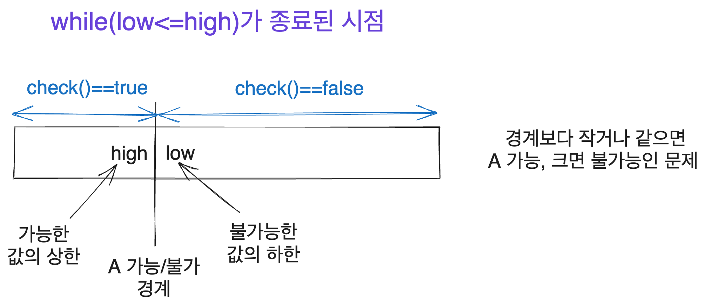
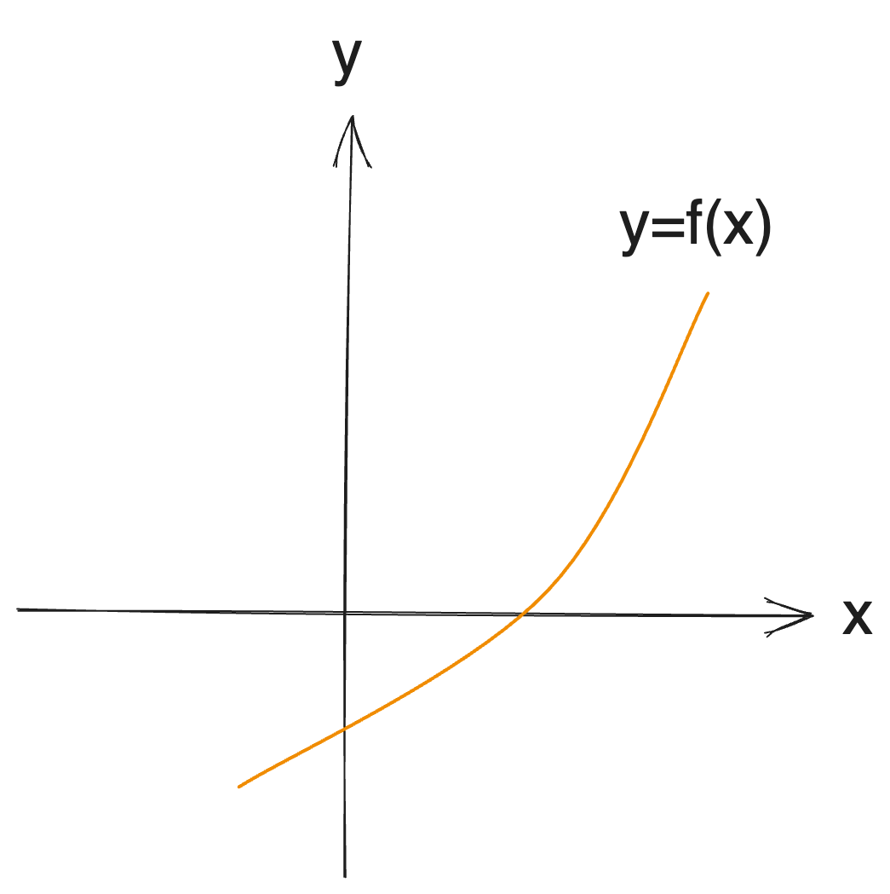
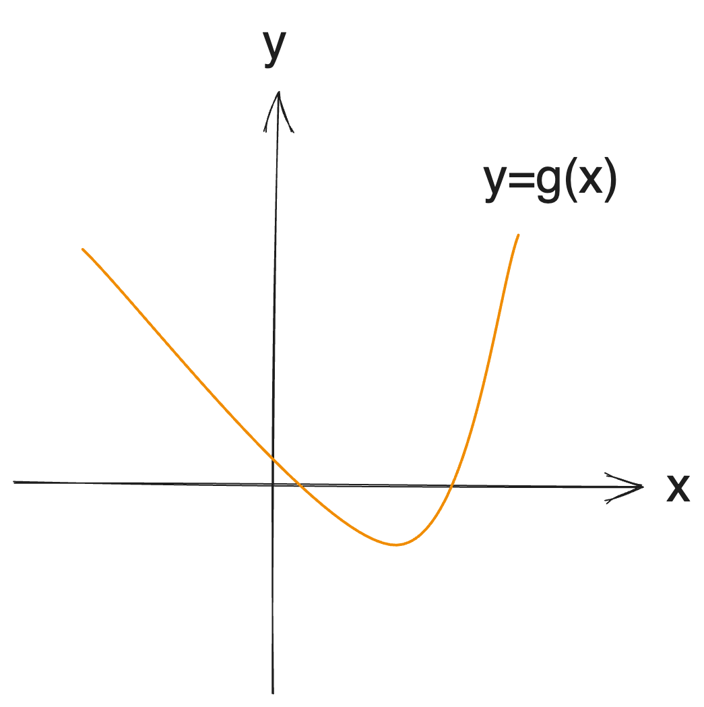

# 이 글은 작성 중에 있습니다.

> 뻘글을 쓰고 싶은 기분이다. 이 글을 너무 진지하게 받지는 말기를 바란다.
>
> 내가 들어 보았지만 알지 못하는 알고리즘들(내가 들어보지도 못한 것들은 또 얼마나 많을지)
>
> - 리-차오 세그먼트 트리
> - 세그먼트 트리 비츠
> - `O(n)/O(1)` range max query
> - treap을 제외한 자가 균형 트리
> - 링크 컷 트리
> - 웨이블릿 트리
> - 머지 소트 트리
> - 바이노미얼 힙
> - 피보나치 힙
> - (그 외에 웬만한 건 비교도 안 될 수많은 고인물 알고리즘들 이하생략)
>
> 만약 당신이 이 중 적어도 3개 이상을 알고 있는데 codeforces 레이팅이 red가 아니라면 당신은 뭔가 잘못하고 있는 것이다. 쓸모없는 알고리즘 배우기를 멈추고 가서 문제를 좀 풀고, 이분 탐색을 어떻게 하는지 배워라.
>
> 출처 : 2021년의 [Um_nik이 쓴 글](https://codeforces.com/blog/entry/92248)(Um_nik은 2017년부터 안정적인 Legendary Grandmaster였다)

# 시작

[city](https://solved.ac/profile/city)입니다. 알고리즘을 그럭저럭 오래 해왔는데, 이분 탐색의 원리를 어떻게 이해하는지에 그리고 활용 문제를 접근하는 방식에 대해서 누군가가 물어봐서 써본 [이분 탐색 알고리즘의 활용](https://witch.work/posts/binary-search)의 후속작입니다.

이 글에서는 이분 탐색의 구현 방식과 파고들 수 있는 부분들에 대해서 좀 더 많이 알아보고 그것을 통해서 이분 탐색의 작동 방식을 더 잘 이해하는 것을 목표로 합니다.

글에 사용한 그림들은 [excalidraw](https://excalidraw.com/)를 사용하여 직접 그렸습니다.

# 0. 배경

내가 이분탐색을 처음 제대로 이해할 수 있게 된 건 `while(low<=high)`로 구현했을 때 `low`와 `high`가 어떤 값을 가리키는지를 이해하고 나서였다. 이 그림과 비슷한 그림을 [Yun](https://blog.yuni.dev/)님이 보여주셨을 때였다. 이분 탐색 짬을 좀 먹은 사람이라면 이 그림만 봐도 뭔가 감이 올 거라 생각한다.



하지만 이후 `while(low<high)`혹은 `while(low!=high)` 등 여러 다른 방식으로 이분 탐색을 구현하시는 분들도 많다는 걸 알게 되었다. 이외에도 몇 가지 다른 구현 방식들이 더 있으며 또한 이러한 접근 방식 자체를 다르게 응용할 수 있다는 것도 배웠다.

나도 다른 많은 사람들이 그렇듯이 알고리즘을 시작한 지 몇 달 안되어 이분탐색을 배웠고 개념 자체는 어려울 게 없으니 금방 배웠다. 하지만 이런 것들을 알고 더 깊은 이해를 얻기까지는 시간이 꽤 걸렸고 이건 지금도 현재진행형이다. 아직 한참 부족한 사람이지만 그 흔적을 여기 적는다.

# 1. 문제 정의

앞선 글에서 사용했던 문제 정의를 다시 사용하겠다. 이분 탐색의 기본을 다루는 글이 아니므로 적당히 적는다. [BOJ 1654번 랜선 자르기](https://www.acmicpc.net/problem/1654)와 같은 상황이다.

우리는 구간 `[low, high]`에 대해서 생각한다. 그리고 `check(number)` 함수로 나타내어질 수 있는 문제가 있어서 어떤 특정 자연수 `x`($low \le x \le high$)에 대해서 `x`보다 작거나 같은 자연수 `k`에 대해서는 `check(k)`가 true이고, `x`보다 큰 자연수들에서는 false이다. 우리는 이때 `check`의 결과가 나누어지는 경계 `x`를 구하고자 합니다.

앞선 글에서는 다음과 같은 코드로 이 문제를 해결하였다. 이 경우 `check`의 결과가 true가 되는 최댓값을 구하는 코드이다.

```cpp
while (low <= high) {
  int mid = (low + high) / 2;
  // mid에서 check 함수가 true면 더 큰 값에서 탐색
  if (check(mid)) {
    low = mid + 1;
  } else {
    high = mid - 1;
  }
}
return high;
```

# 2. 여러가지 구현 - 구간의 차이

이분 탐색은 결국 정해진 구간 내에서 어떤 조건의 값을 찾을 때 구간을 반씩 줄여 나가면서 찾는 것이 핵심이다. 이때 탐색 구간을 어떤 식으로 경계짓느냐에 따라서 구현에 차이가 난다. 이는 언제 탐색을 종료할지, 그리고 다음 탐색구간을 정할 때 어떤 값을 사용할지에 영향을 미친다.

현재 통용되는 구간 정의 방식은 탐색구간의 하한이 `low`이고 상한이 `high`라고 할 때 닫힌 구간 `[low, high]`, 반열린 구간 `[low, high)`, 열린 구간 `(low, high)`정도로 알고 있는데 이들을 설명하도록 하겠다. 이들은 모두 다른 탐색 종료 조건과 다른 `low`, `high`업데이트를 요구한다.

## 2.1. 닫힌 구간 탐색

앞에서 본 코드의 구현이다.

```cpp
while (low <= high) {
  int mid = (low + high) / 2;
  // mid에서 check 함수가 true면 더 큰 값에서 탐색
  if (check(mid)) {
    low = mid + 1;
  } else {
    high = mid - 1;
  }
}
return high;
```

위 코드에서 처음 시작할 때의 `low`, `high`를 각각 `start_low`, `start_high`라고 한다면 우리는 `[start_low, high]`를 `check`이 true인 구간으로, `[low, start_high]`를 `check`가 false인 구간으로 만들고자 하는 것을 알 수 있다.(이렇게 탐색이 종료된 시점에서 `low==high+1`)

`check(mid)`가 true라면 `low`가 `check`결과가 `false`인 구간의 하한이 되기 위해서는 적어도 `mid`보다는 커야 한다는 것이고 따라서 `mid+1`로 업데이트해준다. `check(mid)`가 false인 경우도 마찬가지다.

즉 모든 것이 닫힌 구간으로 돌아간다고 볼 수 있다.

## 2.2. 반열린 구간 탐색

다른 구현방식은 다음과 같다. 이는 탐색 구간을 반열린 구간 `[low, high)`로 따진다.

```cpp
while (low < high) {
  int mid = (low + high) / 2;
  // A가 mid에서 가능하다
  if (check(mid)) {
    low = mid + 1;
  } else {
    high = mid;
  }
}
```

이 코드는 어떤 구간을 탐색하고, 어떤 구간으로 향할까?

이 코드가 목표로 하는 최종 상태는 다음과 같다. 처음 탐색을 시작한 자연수 범위가 `[start_low, start_high)`라고 할 때 탐색 종료시 `[start_low, high)`가 `check`가 true인 구간이 되고 `[low, start_high)`는 `check`가 false인 구간이 된다. 여기서 `low==high`이다.

이 상태를 달성하기 위해서 `[low, high)`에 우리가 찾는 경계값이 있다고 했을 때 `mid`에서 `check`이 true이면 `[mid+1, high)`로, 불가능하면 `[low, mid)`로 탐색 구간을 줄여나간다.

위와 달리 반열린 구간으로 따지기에 `low`는 `mid+1`로, `high`는 `mid`로 업데이트해준다.

이 값을 생각하는 논리는 위에서와 같다. 위에서와 다른 `high`업데이트를 봐보자. `check(mid)`가 false일 경우 `high`는 `check`가 true인 구간의 상한이 되기 위해 적어도 `mid`를 구간에 포함하지 않아야 한다. 따라서 `[start_low, mid)`로 업데이트해주기 위해 `high=mid`로 만들어 주는 것이다.

구간의 목표를 달성하기 위해 어떤 행동을 취해야 하는지가 핵심이다.

아무튼 탐색 종료 시 `low`, `high`가 모두 `check`의 참/거짓을 가르는 경계에 위치하게 된다. `high`는 `check`가 true인 반열린 구간의 상한을, `low`는 `check`가 false인 반열린 구간의 하한을 가리킨다.

즉 닫힌 구간으로 탐색할 시에는 `low`혹은 `high` 둘 중 하나가 정답이 되었다면, 이렇게 반열린 구간으로 탐색할 시 탐색 종료 시점에서 `low==high`이므로 문제 조건에 따라 `low` 혹은 `low-1`(물론 `high`나 `high-1`도 상관없다)를 출력해 줘야 한다. 이렇게 `low`인지 `high`인지를 신경쓰지 않아도 된다는 사실이 이 구현 방식의 장점이라고 생각한다.

이런 반열린 구간 방식을 `while(low!=high)`와 같이 구현하는 분들도 있는데, 너무 작은 바리에이션이라서 설명할 필요는 없다고 본다.

## 2.3. 열린 구간 탐색

이 역시 내가 쓰는 방식은 아니지만 다음과 같이 할 수도 있다. [jinhan814님](https://www.acmicpc.net/user/jinhan814)이 쓰시는 구현으로 알고 있다. 이것도 상당히 유명한 편인 구현인데 기억하지 못하고 있다가 어떤 분이 피드백을 주셔서 추가하였다.

이 역시 지금까지 계속 보았던, 어떤 경계값 이하 구간에서는 `check`이 true이고 초과에서는 false일 때 `check`이 true인 상한을 구해야 하는 문제라고 할 때 그 답은 `low`혹은 `high-1`(두 값은 같다)로 나타난다.

```cpp
// 열린 구간으로 원래 탐색구간을 전부 포괄하기 위한 처리
low--;
high++;
while (low + 1 < high) {
  int mid = (low + high) / 2;
  if (check(mid)) {
    low = mid;
  } else {
    high = mid;
  }
}
```

이 구현의 목표도 위에서와 구간의 경계 표시만 바뀌었을 뿐 같다. 처음 탐색을 시작한 자연수 범위가 `(start_low, start_high)`라고 할 때 탐색 종료시 `(start_low, high)`가 `check`가 true인 구간이 되고 `(low, start_high)`는 `check`가 false인 구간이 되도록 하는 것이 목표이다. 여기서 `low+1==high`이다.

그러면 만약 `check(mid)`가 true라고 했을 때, `(low, start_high)`가 `check`이 false인 구간이 되기 위해서는 최소한 `low`가 `mid`이상이어야 한다. 그러니 `low=mid`로 업데이트.

반대로 `check(mid)`가 false라면 `high`는 `check`가 true인 열린 구간의 상한이 되어야 하는데 그러려면 적어도 `mid`이하여야 한다. 그러니 `high=mid`로 업데이트.

그리고 이렇게 탐색이 끝나고 나면 우리는 `check`이 true인 구간의 상한을 구하고자 했으므로 `high-1`을 구하면 된다. 그런데 탐색의 종료 조건을 보았을 때 `low==high-1`이므로 `low`를 출력해도 된다.

이 구현의 장점은 좀더 직관적으로 `low`와 `high`중 출력할 값을 정할 수 있다는 부분이다. 물론 우리는 

이 구현의 장점은 `low`보다 `high`가 늘 크다는 조건이 만족되고 따라서 좀더 직관적으로 `low`와 `high`중 출력할 값을 정할 수 있다는 부분이다.

우리는 `(start_low, high)`와 `(low, start_high)`로 `check`이 true, false인 구간을 정의하기는 했지만 구간이 자연수로 이루어졌다는 점을 생각할 때 이는 `check`이 true인 구간이 `(start_low, low]`이고 false인 구간은 `[high, start_high)`라고 할 수도 있다.

즉 `check`이 true인, 상대적으로 작은 수로 이뤄진 구간의 상한은 `low`, `check`이 false인, 상대적으로 큰 수로 이뤄진 구간의 하한은 `high`가 된다. 그러니 생각하기에 따라 좀더 직관적으로 우리가 구해야 할 값이 무엇인지를 알 수 있다.

### 2.3.1. 주의할 부분

이 구현을 개인적으로 쓰지는 않기 때문에 체감해 보지는 못했지만, `low`와 `high`가 항상 정답 범위를 나타낼 수 있도록 하는 것에 주의해야 한다고 한다. 열린 구간으로 구현하기에 처음 탐색 범위도 `(low, high)`인데 따라서 진짜 탐색하게 되는 범위는 `[low + 1, high - 1]`이기 때문이다.

이런 부분을 커버하기 위해 위의 구현에서 `low--`와 `high++`를 해주는 것이다.

```cpp
// 구현 다시보기
// 열린 구간으로 원래 탐색구간을 전부 포괄하기 위한 처리
low--;
high++;
while (low + 1 < high) {
  int mid = (low + high) / 2;
  if (check(mid)) {
    low = mid;
  } else {
    high = mid;
  }
}
```

## 2.4. 우열?

어떤 방식을 쓰는 게 더 좋을까? 딱히 정해진 건 없다. 일반적으로 각자가 처음 이해한 방식대로 쭉 간다. 통계적으로 따졌을 때 어느 방식이 좀 더 많이 쓰이고 있을 수는 있겠지만, 두 구현 모두 많은 고인물들이 각각 애용하고 있다.

위에서 본 다른 구현들, 그리고 또다른 마이너한 구현들 또한 애용하고 있는 고수들이 다 있다. 고인물들이니까 다른 방식의 구현을 이해하지 못할 리는 없다. 하지만뉴비 때부터 손과 머리에 익은 방식을 두고 굳이 바꿀 건 없으니 그냥 계속 쓰고 있는 것이다. 이 글을 보시는 분들도 그렇게 한번 이해한 구현으로 쭉 가면 된다.

나는 개인적으로 닫힌 구간으로 뭔가를 따지는 게 대부분의 경우 더 직관적이라고 생각하지만, 가령 n 길이의 배열에서 뭔가를 찾는다면 탐색 구간의 인덱스를 `[0, n-1]`로 표현하는 것보다는 `[0, n)`으로 표현하는 게 더 직관적이라고 생각한다. 어떤 구간을 쓰는지에 장단이 있는 것이다.

결국 이런 걸로 아무도 싸우지 않기 때문에 그냥 스스로가 더 편한 방식으로 쓰면 된다. 가령 세그먼트 트리 같은 자료구조는 닫힌 구간으로 구현하는 사람이 더 많은 게 명백하다고 보이는데, 아무도 반열린 구간으로 구현하는 사람에게 뭐라 하는 것을 보지 못했다.

따라서 이 글을 읽어 보고, 많은 참고자료도 보고 많은 문제를 풀어 보면서 스스로가 가장 잘 이해할 수 있는 방식대로 짜면 된다.

# 3. 여러가지 구현 - 방식의 차이

## 3.1. binary jumping

[jinhan814님이 BOJ에 쓰신 글에 달린 dohoon님의 댓글](https://www.acmicpc.net/blog/view/109#comment-588)에 적힌 구현이다. 지인들에 의하면 앳코더에 있는 의문의 인도인들(최강의 프로그래머)의 코드에서 가끔 볼 수 있는 방식이라고 한다.

```cpp
int cur = low - 1;
for (int step = high - low + 1; step >= 1; step /= 2) {
  while (cur + step <= high && check(cur + step)) {
    cur += step;
  }
}
```

이 코드는 `cur`가 우리가 찾는, `check`이 true가 되는 구간의 상한이 되도록 한다. 이는 탐색 구간을 줄여 나가는 게 아니라 `cur`가 `check`이 true라는 조건을 만족할 때까지 늘려 나가는 방식이다.

이 접근 방식은 다음과 같다. `cur`의 초기값 `low-1`이 우리가 찾는 정답이 되도록 하려면 더해져야 할 수 `x`가 있을 것이다. 우리가 찾는 수는 `[low, high]`에 존재함이 보장되므로 이는 당연하다. 그 `x`는 당연히 이진수로 나타날 수 있다.

그러면 우리는 `cur`를 가장 크게 늘릴 수 있을 만큼씩 늘려 보고, 그렇게 늘릴 때마다 `check`이 true인지 확인하면서 늘려 보면 된다. 만약 `check`이 true이면 더 늘려 보면 되고 false이면 더 늘리지 않고 증가하는 step을 좀 낮춰보면 되니까.

이를 반복하다 보면 `cur`은 `check`이 true인 최대 상한에 도달할 것이다.

그러면 우리가 탐색하고 있는 구간의 `check`결과가 `[F, F, ..., F, T, ..., T]`와 같이 이루어져 있고 여기서 `F`로 이루어진 구간의 인덱스 상한을 찾는 문제라면 어떻게 할까? 그러면 위 코드의 `if`문만 `check`이 false인지 확인하는 것으로 바꾸면 된다.

간단하죠?

```cpp
int cur = low - 1;
for (int step = high - low + 1; step >= 1; step /= 2) {
  // !check(cur + step)으로 바꿨다.
  while (cur + step <= high && !check(cur + step)) {
    cur += step;
  }
}
```

처음에 `step` 한 번을 가면 `high`가 되도록 만들기 위해 `step`의 초기값을 `high-low+1`로 잡았지만 어차피 `step`이 줄어들고 그때마다 가능한 만큼 나아가는 방식이기 때문에 `step`초기값은 `high`로 잡아도 상관없다. 다음과 같이 말이다.

```cpp
int cur = low - 1;
for (int step = high; step >= 1; step /= 2) {
  while (cur + step <= high && check(cur + step)) {
    cur += step;
  }
}
```

이렇게 하면 `for`문은 계속 `step`만 변화시켜 가면서 같은 일을 반복하게 되고 이는 컴파일러가 loop unrolling 최적화를 할 수 있도록 하여 성능이 더 높아지는 경우도 있다고 한다. [캐싱 같은 걸 더 잘할 수 있도록 아예 `step`을 2의 제곱수 형태로 고정한 다음과 같은 코드의 경우 벤치마크 결과 시간이 약 3/4로 줄었다.](https://codeforces.com/blog/entry/96699)

```cpp
if (low > high) {
  return high + 1;
}
high++;
int step = (1) << log(high - low);
low--;
if (check(low + step)) {
  low = high - step;
}
for (step >>= 1; step >= 1; step >>= 1) {
  if (check(low + step)) {
    low += step;
  }
}
return low + 1;
```

## 3.2. 재귀

이분 탐색을 재귀로 구현하는 방식도 있다. 자료구조 수업 같은 데에서 한번쯤 다들 보았을 거라 생각한다.

```cpp
int binary_search(int arr[], int n, int target) {
  int mid = n / 2;
  if (arr[mid] == target) {
    return mid;
  } else if (arr[mid] > target) {
    return binary_search(arr, mid, target);
  } else {
    return binary_search(arr + mid + 1, n - mid - 1, target);
  }
}
```

재귀를 잘 쓰는 사람이라면 이를 파라메트릭 서치로 쉽게 변형할 수 있을 것이다. 다음은 반열린 구간 탐색으로 구현한 코드이다. 다만 실제로 이렇게 파라메트릭 서치를 구현하는 사람은 난 지금까지 보지 못하기는 했다. 재귀가 일반적으로 반복문 구현에 비해 느리기도 하고 반복문 코드도 그렇게 비직관적인 코드가 아니라서 그렇다고 생각한다.

```cpp
int binary_search(int low, int high) {
  if (low == high) {
    return low;
  }
  int mid = (low + high) / 2;
  if (check(mid)) {
    return binary_search(mid + 1, high);
  } else {
    return binary_search(low, mid);
  }
}
```

# 4. 알아도 좋고 몰라도 좋은 팁?

## 4.1. `mid=low+(high-low)/2`로 정의하기

많은 구현에서 대부분 `mid`는 다음과 같은 식으로 정의된다.

```c
int mid = (low+high)/2;
```

하지만 이렇게 `mid`를 정의할 수도 있다. [Topcoder의 이분 탐색 튜토리얼](https://www.topcoder.com/thrive/articles/Binary+Search)등에서 이렇게 쓰고 있다.

```c
int mid = low + (high - low) / 2;
```

이는 `low+high`가 음수일 경우를 대비한 것이다. 이분 탐색에서 우리가 `/2`를 취할 때는 보통 round down되기를 원한다. `5 / 2`는 2가 되는 식으로 말이다. 이는 정수 나눗셈이 있는 일반적인 언어들이라면 양수에 대해서는 보통 이렇게 동작한다.

하지만 음수에 대해서는 어떨까? `-5 / 2`는 round down되면 `-3`이 되어야 한다. 하지만 `-5 / 2`는 C++등 많은 언어들에서 `-2`가 된다.

따라서 `mid`의 정의를 `low + (high - low) / 2` 로 바꿔서 `/2`가 늘 round down되도록 만들어 준 것이 바로 위의 변경점이다.

[C++에서는 `std::midpoint`라는 라이브러리 함수를 제공하기도 한다. 여기의 구현이 바로 위에서 본 `low + (high - low) / 2`와 사실상 같다.](https://en.cppreference.com/w/cpp/numeric/midpoint)


# 5. 추가 정보

이분 탐색과 관련된 몇 가지 추가적인 알고리즘들을 소개한다. 나도 아주 기본적인 이해 정도만 하고 있는 부분이기도 하고 이분 탐색 자체를 깊이 이해하는 목적과는 멀리 떨어져 있다고 생각되어 직관에 도움될 만하다고 생각하는 정말 간단한 컨셉의 소개만 한다.

## 5.1. 삼분 탐색(Ternary Search)

볼록 함수에서 극값 혹은 최대, 최솟값을 찾을 때 사용할 수 있는 알고리즘이다.

이분 탐색 같은 경우 결정 문제의 결과가 `[T, T, T,..., T, F, ..., F]`로 결정되는 구간에서 T로 결정되는 구간의 최댓값을 결정하는 느낌이었다. 이를 다음과 같은 단조 증가(단조 감소도 상관없습니다)함수와 x축의 교점 좌표를 찾는 문제로 생각해 볼 수 있다.



그러면 `f(low)`와 `f(high)`의 부호가 다르다면 `[low, high]`내에 근이 있다는 것이 보장될 것이고 이분 탐색으로 해당 근을 찾을 수 있다. `f(x) < 0`인가? 라는 결정 문제로 환원하면 파라메트릭 서치로 생각할 수도 있다.

비슷한 일을 볼록 함수(유니모달 함수)에 적용한 것이 삼분 탐색이다. 다음과 같은 볼록 함수에서 극값을 찾는 것이다.



극값이 있는 특정 구간을 알고 있다고 하면 해당 구간의 양 끝점과 삼분점 2개의 대소비교를 통해서 극값이 있을 가능성이 있는 구간을 2/3으로 줄일 수 있다는 아이디어다. 구간을 2개로만 나누지 않아도 쓸모가 있다는 예시 정도로 생각하면 좋을 것 같다.

삼분 탐색이 더 궁금하신 분들은 kks227님의 글을 참고하면 좋다.
https://blog.naver.com/kks227/221432986308

## 5.1.1. 다르게 구간 나누기

삼분 탐색은 결국 이러한 탐색 방법의 핵심이, 무언가를 찾기 위해 구간을 줄여 나가는데 이때 구간을 일정 비율씩 줄여서 시간복잡도를 $logN$단위로 나오도록 하는 데에 있다는 것을 보여준다.

만약 이런 바리에이션에 관심이 있는 고인물이 있다면 [An alternative and very interesting approach on binary search](https://codeforces.com/blog/entry/76182)를 참고해도 좋겠다. 기존의 1:1이나 1:2 비율이 아니라 1:D 비율로 나누어서 시간복잡도를 조절한다. 해당 글에서 예시로 든 문제의 시간복잡도가 $\mathcal{O}(n \cdot m \log_{D+1}(10^{18}) + n \cdot \log_{\frac{D+1}{D}}(10^{18}))$이기 때문라고 한다.


## 5.2. 병렬 이분 탐색

일반적인 이분 탐색을 확장하여, 이분 탐색으로 풀 수 있는 쿼리를 한번에 여러 개 진행하는 병렬 이분 탐색이라는 기법도 있다.

우리가 위에서 본 결정 문제는 그냥 `check`함수라고 하고 넘어갔지만 사실 이를 판단하는 데 꽤 큰 시간복잡도가 드는 경우가 많다. [BOJ 1300번 K번째 수 문제 같은 경우 mid보다 작거나 같은 수가 K개를 넘는지 결정하는 것이 check함수고 이는 꽤 연산량이 많다.](https://www.acmicpc.net/problem/1300) 따라서 이를 결정하는 데 드는 시간을 `f(N)`이라고 하자.

그러면 한 번의 이분탐색을 진행해서 어떤 값을 찾는 데 걸리는 시간은 `f(N)logN`이 될 것이다. 그러면 이런 쿼리가 `Q`개 주어진다면 어떨까? 그러면 일반적인 이분 탐색으로는 `Qf(N)logN`이 걸릴 것이다.

하지만 만약 어떤 처리를 통해서, 우리가 거치게 될 모든 결정 문제 스텝들에 대한 결과를 `f(N)logN`시간복잡도로 계산해 놓는다면 어떨까? 그러면 이후에는 그냥 이분 탐색을 진행하는 것만으로도 `QlogN`만에 모든 쿼리를 처리할 수 있을 것이다.

즉 `f(N)`이 걸리는 작업을 `logN`단위 번 하고, 이분탐색을 `Q`번 진행하여 총 `(f(N) + Q)logN`시간복잡도로 문제를 해결하게 된다.

하지만 그냥 이분 탐색과는 상당한 간극이 있고 내게도 익숙한 기법이 아니기 때문에 관심이 있으신 분들은 [kks227님의 글](https://blog.naver.com/kks227/221410398513)이나 [나정휘 님의 글](https://justicehui.github.io/hard-algorithm/2020/02/24/pbs/)을 참고하시면 더 많은 정보를 얻을 수 있다.


# 참고

이분탐색 실수없이 짜기
https://blog.fiene.dev/2023/01/16/binary-search.html

jinhan814님의 이분 탐색(Binary Search) 헷갈리지 않게 구현하기 https://www.acmicpc.net/blog/view/109

jinhan814님의 이분탐색 블로그 글 https://blog.naver.com/jinhan814/222607789392

`[Tutorial]` Binary search and other "halving" methods https://codeforces.com/blog/entry/96699

topcoder의 binary search 글 https://www.topcoder.com/thrive/articles/Binary+Search