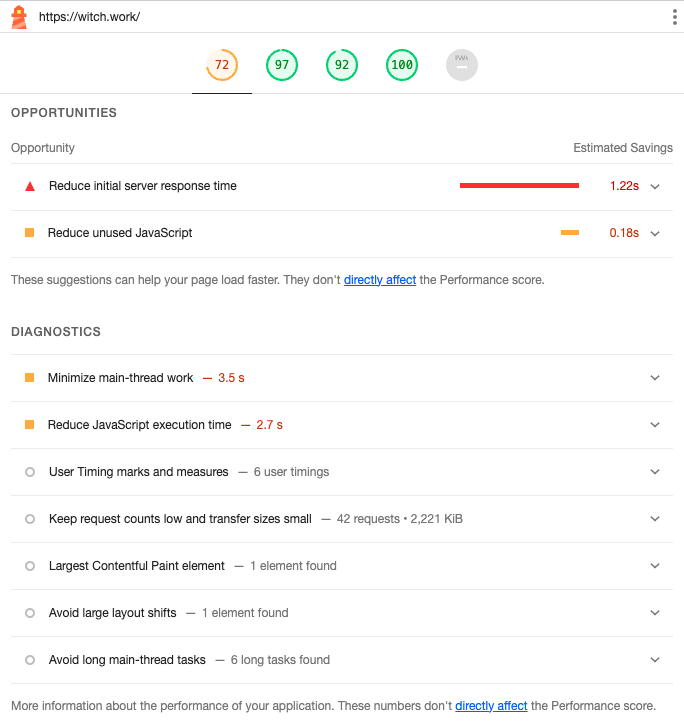

# 1. 문제 발생

블로그를 보다가 조회수 부분을 유심히 보니 뭔가 이상했다. 현재 DB에 저장되고 있는 조회수가 하나로 묶여서 저장되고 있는 것 같았다. 그래서 supabase에 가서 테이블을 보니 웬 `undefined`값에 조회수가 모두 수신되고 있었다.

그리고 썸네일을 CDN에 업로드하는 데에도 오류가 발생하고 있었다. 하지만 현재 CDN으로 사용하고 있는 cloudinary의 무료 플랜은 업로드에 대해 상당히 빡빡하므로 한번한번 고치기가 쉽지 않았다. 그래서 일단 로컬에 모든 썸네일을 저장해 놓는 걸로 대체한 후 다른 작업들을 먼저 진행하였다. 이 글에서 이 부분도 한번 고쳐 보도록 하겠다.

# 2. 조회수 카운터 오류

확인 결과 `ViewCounter`에서는 문제가 없었다. 이 조회수를 쓰는 곳은 글 상세 페이지였는데 여기서는 slug를 만들어서 `ViewCounter`컴포넌트에 props로 넘겨주었고 해당 컴포넌트에서는 그 props로 받은 slug를 기반으로 DB 키를 만들었다.

문제는 slug를 만드는 코드가 다음과 같았다는 것이다.

```tsx
const slug=post._raw.flattenedPath.split('/')[1];
```

이는 `post._raw.flattenedPath`가 `[category]/[slug]`형식이었을 때의 잔재이다. 현재는 post의 `flattenedPath`가 slug만 가리키도록 수정되었다. 따라서 이를 수정해 주기만 하면 된다.

```tsx
const slug=post._raw.flattenedPath;
```

# 3. 썸네일 업로드 오류

이상한 것은 Vercel에서는 이 cloudinary 업로드가 잘 진행되는데 로컬에서는 이게 잘 안되는 것이다. 대략 이런 오류 메시지가 발생했다.

```bash
"binary-search/index.md": UnexpectedMarkdownError: Must supply api_key
```

그래서 환경변수를 한번 출력해 보았더니 역시나, 로컬에서는 환경변수를 제대로 인식하지 못하고 있었다. 분명 `.env.local`에 잘 넣어 줬는데 말이다.

# 4. 최적화

그런데 이제 보니 블로그가 상당히 느려졌다. Lighthouse로 점수를 측정해 보니 70점대로 떨어졌다. 


분명 한때는 점수가 90점대 후반이었는데...물론 Lighthouse점수가 전부는 아니지만 실제로 체감상 느려지기도 했다.

이미지가 문제일 수도 있겠지만 모바일에서의 글 목록 페이지와 같은 경우는 이미지가 없는데도 불구하고 느려졌다. 나머지는 여전히 괜찮은 편인데, 사용자가 컨텐츠를 보기까지 걸리는 시간인 Total blocking time이 너무 길어진 게 문제다. 원인을 분석해보자.

## 4.1. 원인 분석

Vercel에서는 내가 지금까지 배포했던 사이트들을 모두 보존해 놓고 있다. 이게 영원히 보존되는 건지는 모르겠지만 블로그 성능이 떨어진지는 얼마 되지 않았으므로 추적에는 충분하다. 이런 수많은 로그 중 어딘가에 성능을 떨어뜨린 변화가 숨어 있을 것이다.


며칠 전 태그 기반으로 블로그 페이지들을 개편하기 전의 페이지를 적당히 찍어서 메인페이지의 Lighthouse 점수를 찍어 보니 여기서는 100점이 나왔다. 그리고 최근 페이지는 당연히 낮은 점수다. 

이제 [로그들을 이분탐색해서 어디서부터 성능이 떨어졌는지 찾겠다.](https://witch.work/posts/binary-search) 알고리즘은 부끄럽지만 도움이 된다. 어느 시점부터 total blocking time이 높아지는지 찾아보자.

추적해본 결과 뭔가 `tagFilter` 컴포넌트가 들어가면서 문제가 생긴 것 같다. 그럼 어떤 게 문제가 된 걸까? 처음에는 이 컴포넌트에 쓰이는 `tagList`배열을 만드는 과정이 문제인 줄 알았다. 이 배열이 매번 새로 만들어지면서 글 목록을 훑게 되고 거기서 성능 저하가 발생하는 거라고 생각한 것이다.

```ts
// 문제로 추정했던 코드
export const tagList: string[]=['All', ...getAllPostTags(),];
```

하지만 아니었다. 이를 빌드 시에 `getStaticProps`에서 생성하는 걸로 바꿔도 문제는 똑같았다.

그럼 `tagFilter`가 문제인 것은 맞을까? 내 사이트이기에 마음대로 해볼 수 있는 것은 이럴 때 해당 컴포넌트를 아예 없애 볼 수도 있다는 것이다. 한번 모든 페이지에서 `tagFilter`를 삭제해 보고 다시 Lighthouse 점수를 찍어보자.


`tagFilter` 네 이놈! 하지만 이 컴포넌트는 말이 태그필터지 사실 각 태그별 분류 페이지로 가는 링크를 모아 놓은 컴포넌트일 뿐이다. 내부 요소들도 빌드 시에 완벽하게 생성할 수 있기 때문에 `tagFilter` 컴포넌트의 존재 자체가 성능을 저하시킬 리는 없다.

## 4.2. 개발자 도구

그럼 정말로 문제는 무엇일까? 디버깅 방법이 컴포넌트 뺐다꼈다만 있는 건 아니니까 여러 시도를 해보자. 먼저 태그 필터를 다시 사이트에 장착하고 lighthouse 측정을 해보자.

Lighthouse 점수 탭에 들어가 보면 친절하게 진단을 알려준다.



여기서 Reduce initial server response time은 lighthouse 점수가 잘 뜰 때에도 가끔씩은 길게 나오던 부분이다. 게다가 지금 서버는 Vercel에서 돌아가고 있지 않은가? 홈서버라도 돌리지 않는 이상 이 속도를 올릴 방법은 없다. 또한 태그 필터와도 전혀 관련없다.

그리고 Reduce unused JavaScript에서 지적하고 있는 코드는 구글 태그 매니저의 코드이다. 따라서 이 opportunities 부분에서는 문제될 만한 게 없다.

lighthouse의 진단에서는 Minimize main-thread work 그리고 Reduce JavaScript execution time 이라는 진단을 내리고 있는데 main-thread work에 대한 분석을 보면 스크립트 분석, 파싱, 컴파일이 차지하는 시간이 대부분이다. 따라서 Javascript 실행 시간이 핵심 문제다.

그래서 실행되고 있는 청크 파일을 봤더니 어디선가 문제가 생겼는지 `allDocument`에 들어가 있을 내용이 JS 파일에 관여하고 있었다. 이게 어떻게 된 일이지? `tagFilter`관련 함수들을 싹 훑어보자.

