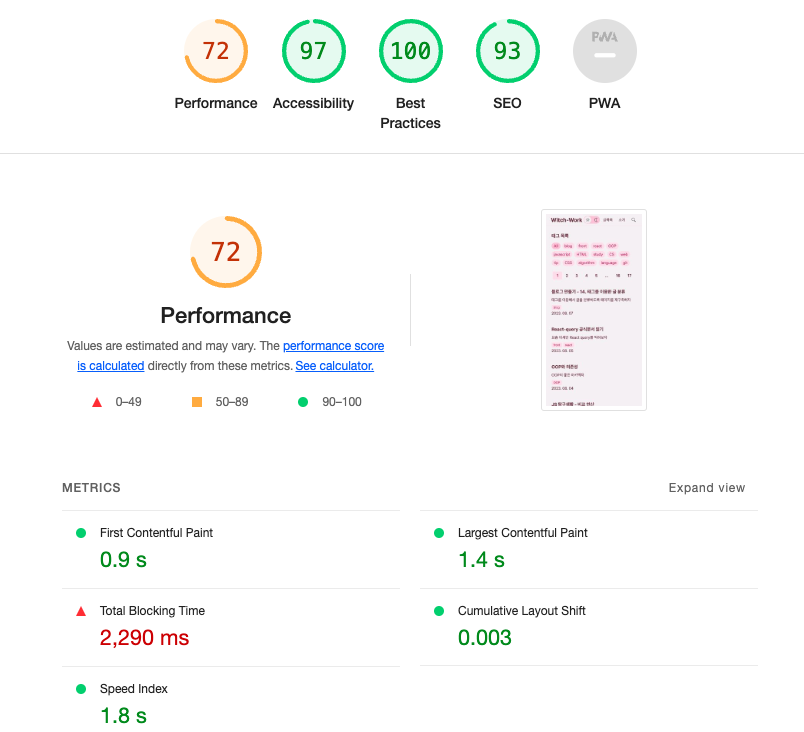
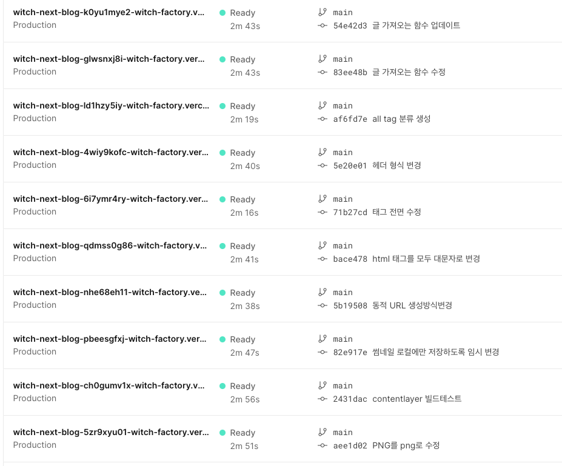

# 1. 문제 발생

블로그를 보다가 조회수 부분을 유심히 보니 뭔가 이상했다. 현재 DB에 저장되고 있는 조회수가 하나로 묶여서 저장되고 있는 것 같았다. 테이블을 보니 웬 `undefined`값에 조회수가 모두 수신되고 있었다.

그리고 썸네일을 CDN에 업로드하는 데에도 오류가 발생하고 있었다. 하지만 현재 CDN으로 사용하고 있는 cloudinary의 무료 플랜은 업로드에 대해 상당히 빡빡하므로 한번한번 고치기가 쉽지 않았다. 그래서 일단 로컬에 모든 썸네일을 저장해 놓는 걸로 대체한 후 다른 작업들을 먼저 진행하였다. 하지만 이제는 미룰 수 없다. CDN으로 업로드하는 코드를 고쳐야 한다. 

더 이상한 것은 Vercel에서는 이 cloudinary 업로드가 잘 진행되는데 로컬에서는 이게 잘 안되는 것이다. 대략 이런 오류 메시지가 발생했다.

```bash
"binary-search/index.md": UnexpectedMarkdownError: Must supply api_key
```

그래서 환경변수를 한번 출력해 보았더니 역시나, 로컬에서는 환경변수를 제대로 인식하지 못하고 있었다. 분명 `.env.local`에 잘 넣어 줬는데 말이다. 이를 수정해 보자.

# 2. 조회수 카운터 오류

확인 결과 `ViewCounter`에서는 문제가 없었다. 이 조회수를 쓰는 곳은 글 상세 페이지였는데 여기서는 slug를 만들어서 `ViewCounter`컴포넌트에 props로 넘겨주었고 해당 컴포넌트에서는 그 props로 받은 slug를 기반으로 DB 키를 만들었다.

문제는 slug를 만드는 코드가 다음과 같았다는 것이다.

```tsx
const slug=post._raw.flattenedPath.split('/')[1];
```

이는 `post._raw.flattenedPath`가 `[category]/[slug]`형식이었을 때의 잔재이다. 현재는 post의 `flattenedPath`가 slug만 가리키도록 수정되었다. 따라서 이를 수정해 주기만 하면 된다.

```tsx
const slug=post._raw.flattenedPath;
```

# 3. 최적화

그런데 이제 보니 블로그가 상당히 느려졌다. Lighthouse로 점수를 측정해 보니 70점대로 떨어졌다. 



분명 한때는 90점대 후반이었는데...물론 Lighthouse점수가 전부는 아니지만 실제로 체감상 느려지기도 했다.

이미지가 문제일 수도 있겠지만 모바일에서의 글 목록 페이지와 같은 경우는 이미지가 없는데도 불구하고 느려졌다. 이유를 분석해보자.

Vercel에서는 내가 지금까지 배포했던 사이트들을 모두 보존해 놓고 있다. 이게 영원히 보존되는 건지는 모르겠지만 블로그 성능이 떨어진지는 얼마 되지 않았으므로 추적에는 충분하다. 이런 수많은 로그 중 어딘가에 성능을 떨어뜨린 변화가 숨어 있을 것이다.



며칠 전 태그 기반으로 블로그 페이지들을 개편하기 전의 페이지를 적당히 찍어서 메인페이지의 Lighthouse 점수를 찍어 보니 여기서는 100점이 나왔다. 그리고 최근 페이지는 당연히 낮은 점수다. 

이제 [로그들을 이분탐색해서 어디서부터 성능이 떨어졌는지 찾겠다.](https://witch.work/posts/binary-search) 알고리즘은 부끄럽지만 도움이 된다. 어느 시점부터 total blocking time이 높아지는지 찾아보자.

