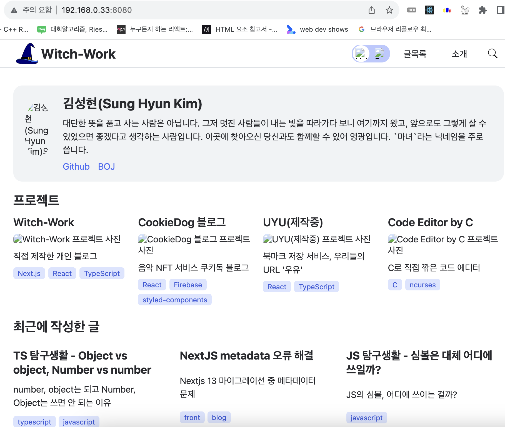
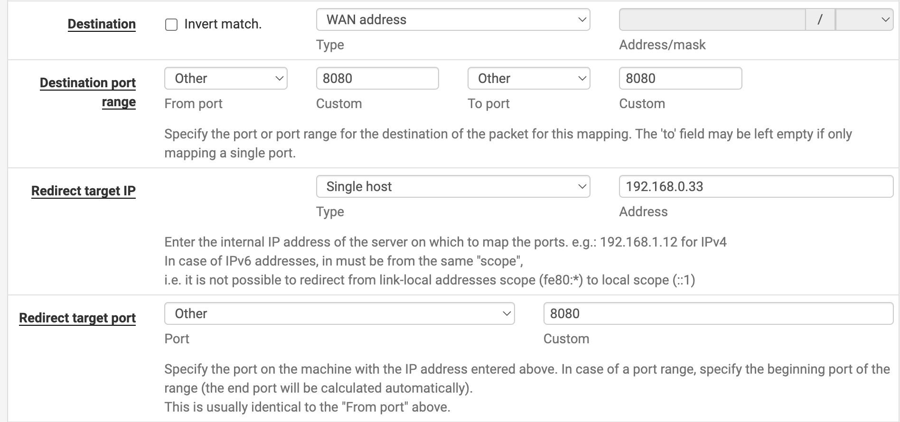

# 이 글은 현재 작성 중입니다.

> 서버 구축은 처음이고 저보다 조금 먼저 서버를 구축한 [불칸](https://vulcan.site/)님의 많은 도움을 받아가며 만들어진 글이라 많이 부족할 수 있습니다. 틀린 부분이 있다면 댓글로 알려주시면 감사하겠습니다.

> 이 글을 보고 홈서버를 세팅하려는 분이 계실지도 모르겠습니다. 제가 알고 있는 부분의 지식은 많은 생략이 있었기 때문에 네트워크에 대한 기본적인 지식은 가지고 있어야 어느 정도 이해하며 글을 읽으실 수 있을 것이라고 알려드립니다. 

[홈 서버 만들기 - 초기 세팅, proxmox, pfsense](https://witch.work/posts/blog-home-server)에서 이어지는 글입니다.

# 1. 블로그 배포

## 1.1. 컨테이너 만들기

LXC 컨테이너를 만드는 작업은 [나만의 홈서버 구축하기 - 1](https://velog.io/@kisuk623/Proxmox-%EC%84%A4%EC%B9%98%ED%95%98%EA%B8%B0)글을 참고하였습니다.

나는 이 홈서버를 산 목적이 애초에 블로그를 배포하기 위한 것이었으므로 컨테이너를 만들어주자. 위의 링크를 참고하면 된다.

ID는 적당히 1001로 하고 이름은 `blog`로 지었다. 템플릿 OS는 Ubuntu 20.04로 선택했다. 참고로 CT를 만들 때 `General`항목에서 `unprivileged container`라는 체크박스가 있는데 이는 절대 해제하면 안된다. 커널과 컨테이너를 분리해서 보안성을 높여주는 기능이다.

나머지는 디폴트로 놓고 진행해도 된다. 다만 나는 컨테이너에 좀 더 많은 성능을 할당해주고 싶어서 코어 4개, 메모리 4GB로 설정했다. 이는 나중에 수정할 수 있으므로 크게 신경쓰지 않아도 된다. 단, 이를 늘릴 수는 있어도 줄이는 건 절대 쉽지 않다고 하니 주의하자.

## 1.2. 컨테이너 설정

해당 컨테이너에 접속해서 Console 메뉴에서 start 후 아까 입력한 아이디와 비밀번호를 입력하면 콘솔이 띄워진다. 이제 이 컨테이너에 필요한 패키지들을 설치해주자.

```bash
sudo apt-get update
sudo apt-get install git
sudo apt install nginx
```

블로그는 nextjs로 되어 있으므로 clone해와서 빌드하면 된다.

```bash
git clone MY_BLOG_URL
cd MY_BLOG_DIR
yarn
sudo n lts # nodejs 버전을 lts로 설정
sudo n prune  
yarn run build
```

그리고 아까 빌드한 파일을 nginx에 연결해주자. 설정 파일을 만져주면 된다.

```bash
sudo nano /etc/nginx/sites-available/static.site
```

그리고 다음과 같이 작성해주자. 

```bash
server {
  listen PORT_NUMBER;
  server_name 0.0.0.0;
  charset utf-8;

  location / {
    root 빌드파일_경로;
    index index.html index.htm;
    try_files $uri $uri.html $uri/ =404;
  }
}
```

그리고 심볼릭 링크를 연결해 준 후 nginx 테스트, 성공시 리로드한다.

```bash
sudo ln -s /etc/nginx/sites-available/static.site /etc/nginx/sites-enabled/
sudo nginx -t
sudo service nginx reload
```

이제 `ip a`로 입력하면 나오는 내부망 ip + 포트번호로 접속하면 블로그가 뜬다. 이미지가 나오지 않는 문제는 해결해야 하고 외부망 접속도 해야 하지만 일단은 블로그를 띄우는 데 성공한 것이다.



## 1.3. 외부 포트포워딩

[pfsense에서 포트포워딩하는 방법에 대한 서버포럼 글이 있어 이를 참고하였다.](https://svrforum.com/svr/27343)

먼저 pfsense에 접속해서 상단 메뉴의 `Interfaces` -> `WAN` 를 클릭한다. 그리고 제일 하단으로 내려가서 `Block private networks and loopback addresses`를 체크 해제한다.

그다음에는 `Firewall` -> `NAT` -> `Port Forward`를 클릭한다. `Add(위쪽 방향 화살표)`를 눌러서 다음과 같이 입력한다.

이 포트포워딩의 목적이 WAN 주소의 특정 포트로 들어오는 접속을 내부 IP의 특정 포트로 연결해 주기 위한 것이므로 이 부분만 설정해 주면 된다.



이를 설정하고 적용 후 WAN IP의 8080포트로 접속하면 아까 만들어진 블로그 페이지(이미지는 아직 안 뜨지만)가 뜨는 것을 확인할 수 있다.


# 참고

gatsby로 블로그 만들기 (https://vulcan.site/blog-gatsby/)

나만의 홈서버 구축하기 - 1 https://velog.io/@kisuk623/Proxmox-%EC%84%A4%EC%B9%98%ED%95%98%EA%B8%B0

Pfsense에서 포트포워딩(NAT)하기 https://svrforum.com/svr/27343