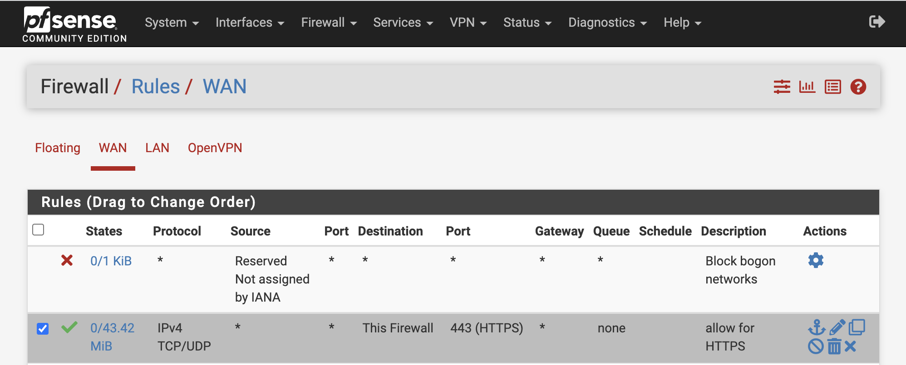
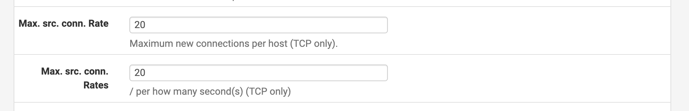
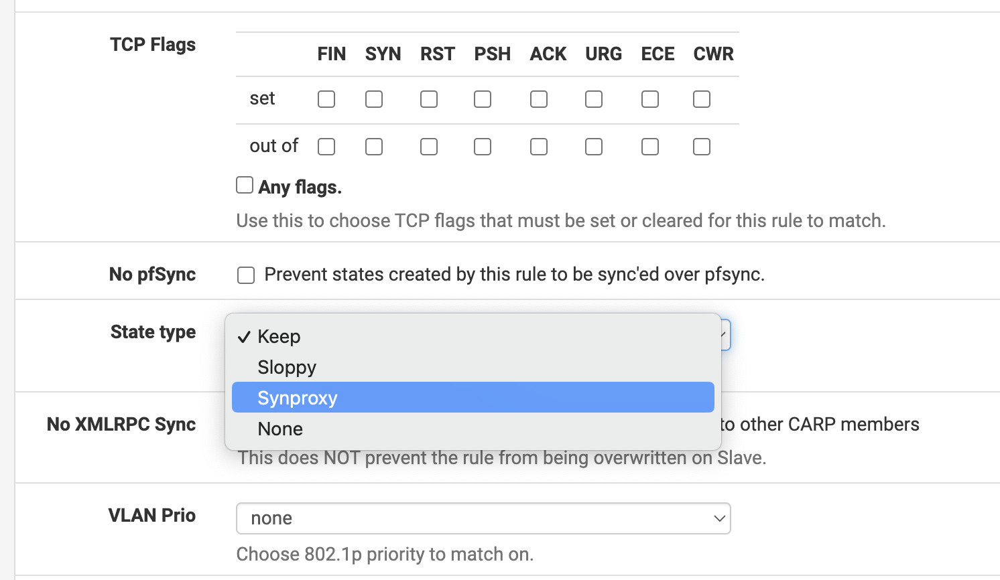
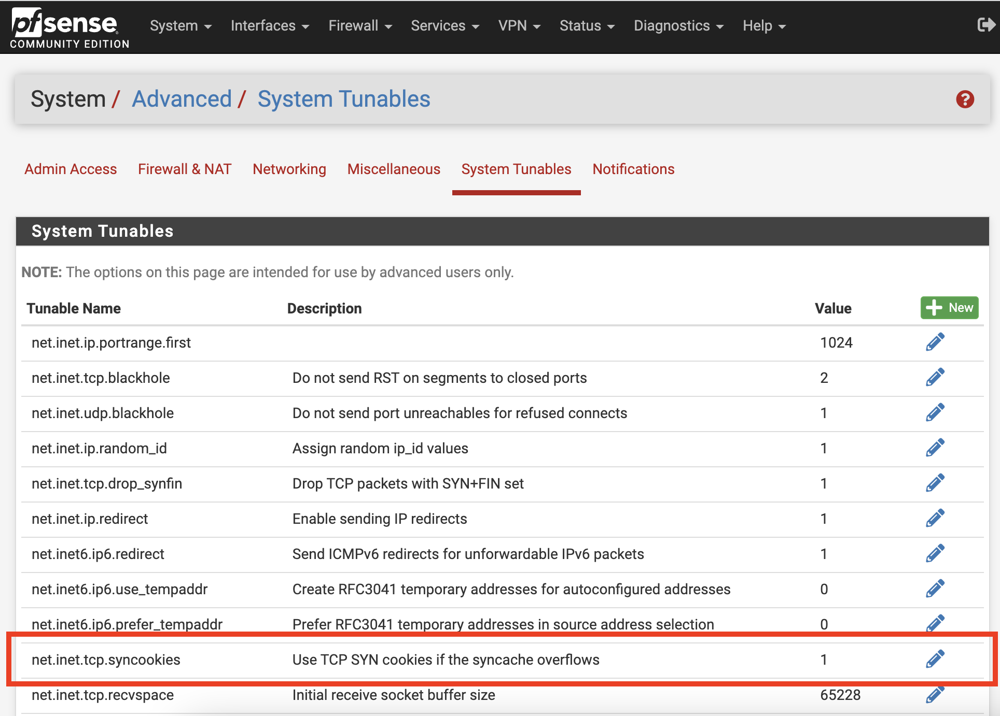
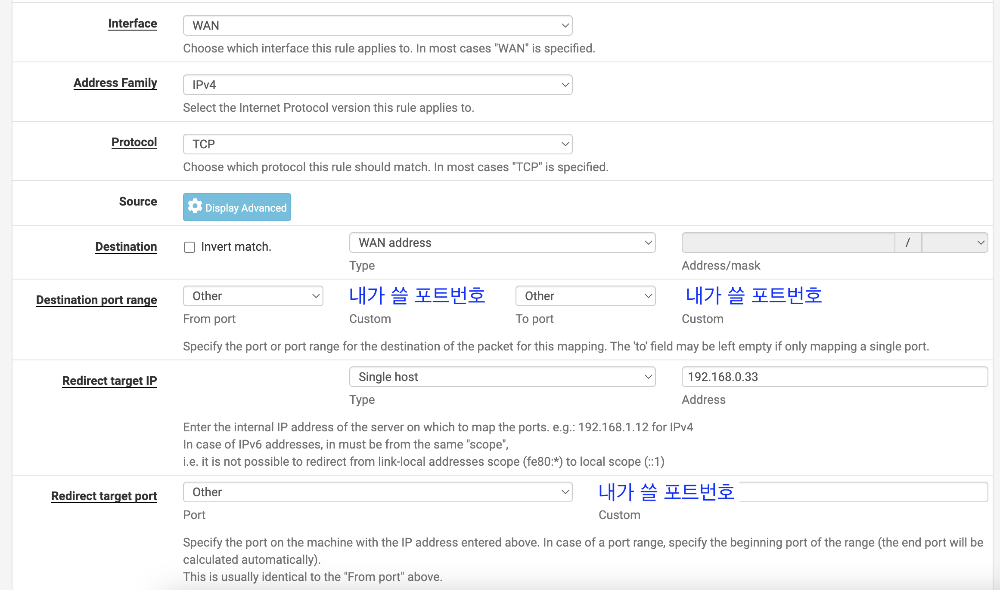
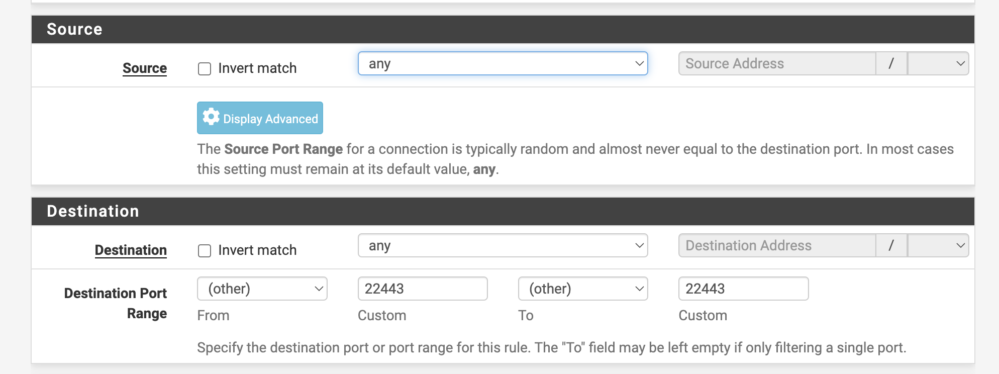
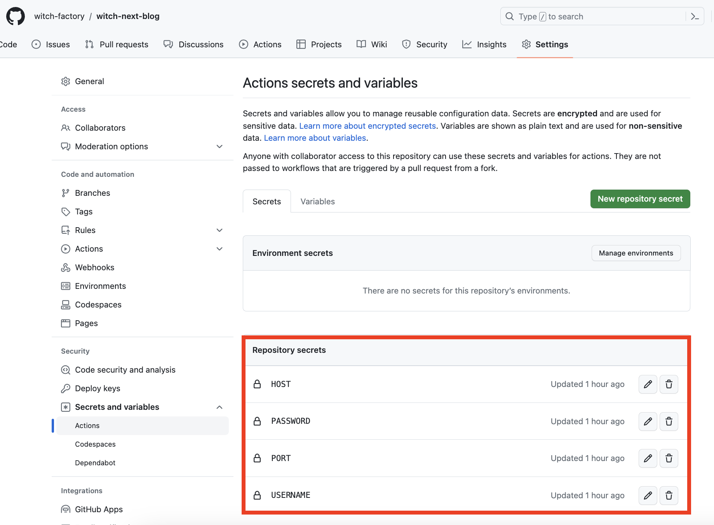
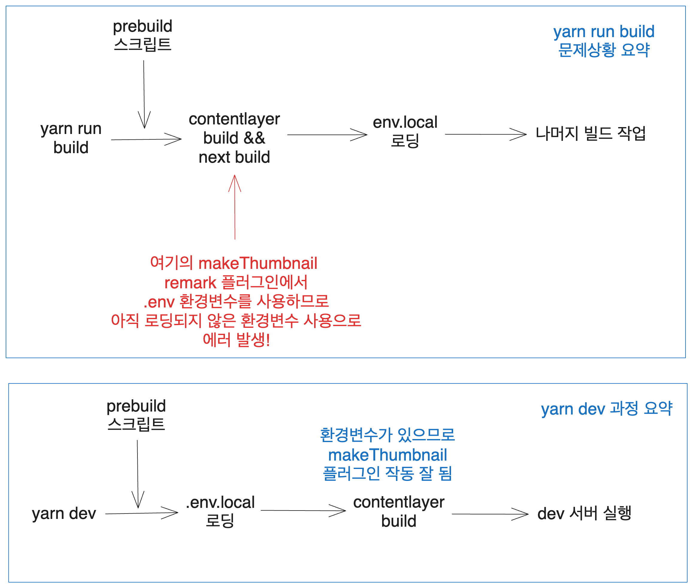

> 서버 구축은 처음이고 저보다 조금 먼저 서버를 구축한 불칸님의 많은 도움을 받아가며 만들어진 글이라 많이 부족할 수 있습니다. 틀리거나 보충해야 할 부분이 있다면 댓글로 알려주시면 감사하겠습니다.

[홈 서버로 블로그 배포하기 - 블로그 올리기](https://witch.work/posts/blog-home-server-2)에서 이어지는 글입니다.

# 1. DDOS 막기

현재 `blog.witch.work`에서는 내 블로그가 돌아가고 있다. 다음과 같은 과정을 거쳐서 말이다.


하지만 여기에 누군가가 DDOS 공격을 하면 내 작은 용량의 서버는 무너질 것이다. 그래서 방화벽을 설정해주기로 했다.

[이 분야에서 국내의 굉장한 네임드 중 한 분인 달소님이 Pfsense방화벽 Dos,Ddos 막기. 라는 글을 이미 작성해 두셔서 거의 그대로 따라했다.](https://blog.dalso.org/home-server/firewall/3358)

## 1.1. 필터링

하나의 소스 IP에서 초당 10회 이상 연결될 시 IP가 블락되도록 설정한다. [land attack](https://m.blog.naver.com/brickbot/220416019291)에서는 소스 ip가 제각각 이기 때문에 별 효력은 없다고 하지만 다른 공격 막는데는 유용하다고 한다.

pfsense의 Firewall > Rules > WAN에서 외부 접속을 담당하는 443포트 rule을 편집하자.(이전 글을 보면, HAProxy에서 외부 접속은 모두 443포트에서 처리하도록 해놓았다)



아래로 내리면 Extra Options가 있는데 거기서 Advanced Options를 설정하자. Display Advanced를 누르면 설정창이 나타난다. `Max. src. conn. Rate`와 `Max. src. conn. Rates` 에서 초당 몇 개의 커넥션이 가능한지 설정할 수 있다. 나는 20으로 설정했다.



## 1.2. SYN Proxy 설정

SYN Proxy는 SYN Flood 공격을 막기 위한 방법이다. SYN Flood 공격은 TCP 3-way handshake 과정에서 SYN 패킷을 계속 보내서 서버의 자원을 고갈시키는 공격이다.

SYN Proxy는 먼저 방화벽이 클라이언트와 3-way handshake를 하고 정상적으로 커넥션을 맺게 되었을 때 커넥션 정보를 서버에 전달하는 방식이다.

이렇게 하면 서버는 정상적인 커넥션에 대한 정보만 받게 되기 때문에 SYN Flood 공격을 막을 수 있다.

이 또한 Firewall > Rules > WAN에서 443포트 rule을 수정하는 것으로 할 수 있다.


아까처럼 Extra Options - Advanced Options를 설정하자. `State Type`을 `SYN Proxy`로 설정하면 된다.



이렇게 하고 Save - Apply Changes를 누르면 설정이 적용된다. SYN Proxy는 TCP 룰에 대해서만 적용된다.(애초에 3-way handshake에 기반한 것이니까) 따라서 룰을 TCP로 바꾸었다.

## 1.3. SYN 쿠키 사용

SYN 패킷에 대한 응답으로 SYN-ACK 패킷에 특별한 쿠키 값을 담아 보내는 것이다. 이 SYN-ACK 패킷에 대한 ACK가 올 경우 쿠키 값을 검증하여 제대로 된 값인 경우 연결을 형성한다.

연결 수립에 필요한 정보들을 Cookie를 통해 보냄으로써 SYN Backlog Queue를 사용하지 않고 따라서 SYN Backlog Queue를 꽉 채우는 SYN Flood 공격을 막을 수 있다.

System > Advanced - System Tunables에서 `net.inet.tcp.syncookies` 값을 1로 설정하면 된다. 나는 기본적으로 되어 있었다.



# 2. 자동 배포

현재 `blog.witch.work`에 배포되어 있는 내 블로그는 git에 내가 뭔가 코드 업데이트를 하고 나면 내가 직접 서버에 접속해서 다음과 같은 커맨드로 업데이트해야 한다.

```bash
git pull origin main
yarn run build
pm2 restart blog
```

이를 자동화하고 싶은데 자료가 정말 없었다. 일단 어떻게 해야 하는지 생각을 해보자.

## 2.1. 구상

이런 자동 배포를 하기 위한 가장 간단한 툴은 내가 알기로 Github action이다. Github action은 Github에서 제공하는 CI/CD 툴이다. 따라서 이걸 사용하자. 어차피 무슨 툴이든 초보인 건 마찬가지니까...

그러면 github에 push 이벤트가 발생했을 때 ssh로 내 proxmox 컨테이너에 접속해서 위의 스크립트를 실행하면 되겠다. 해당 컨테이너 내부에 `deploy.sh`같은 폴더를 만들어 놓아도 좋을 테고 말이다.

## 2.2. ssh 접속하기

ssh 접속을 위해서는 계정을 만들어야 한다. 물론 `/etc/ssh/sshd_config`에서 `PermitRootLogin`을 `yes`로 바꾸면 root로 접속할 수 있지만 보안상 좋지 않다. 따라서 새 계정을 만들자.

```bash
sudo adduser 내_아이디
sudo passwd 내_아이디
-> 비밀번호 입력
```

이렇게 하고 내부망 ip로 접속해 보자. `ssh 내_아이디@내부망ip`로 접속하면 비밀번호를 치고 내 블로그 컨테이너에 들어갈 수 있었다.

이제 외부 ip 접속 허용을 할 것이다. 그런데 그전에 ssh 서버 설정 파일을 만져주자. ssh는 기본적으로 22번 포트에서 접속하는데 이는 너무 흔하니까 다른 포트번호를 사용해 줄 것이다. nano로 설정 파일을 열자.

```bash
sudo nano /etc/ssh/sshd_config
```

위 커맨드로 ssh 설정파일을 열어보면 `#Port 22`라고 되어 있는 부분이 있다. 이 부분을 `Port 내가_쓸_포트번호`로 바꿔주자. 그 다음 변경한 설정을 적용하기 위해 서버 데몬을 재시작하자.

```bash
sudo systemctl restart sshd
```

그럼 이제 `ssh 내_아이디@내부망ip -p 내가_쓸_포트번호`로 접속해야 내 블로그 컨테이너로 갈 수 있다.

외부 ip 접속을 위해서는 포트포워딩을 해줘야 한다. 현재 포트포워딩은 pfsense에서 하고 있으므로 pfsense firewall 부분을 설정해 주자.

Firewall - NAT - Port Forward에서 Add를 눌러 새로운 포트포워딩을 만들어 주자. 말 그대로 외부 IP의 특정 포트를 내부 IP의 특정 포트로 포워딩 해주면 된다.



이렇게 하고 apply 해주면 외부 ip의 특정 포트에 ssh로 접속하면 내 블로그 컨테이너로 연결된다.

그런데 현재 pfsense firewall에서는 해당 포트를 막고 있을 것이다. 따라서 이를 허용해 주어야 한다.

Firewall - Rules - WAN에서 Add를 눌러 새로운 룰을 만들어 주자. 아래와 같이 설정하면 된다. 모든 소스에서 22443 포트로 들어오는 요청을 허용한다.



이제 다음과 같은 커맨드를 통해 내 컨테이너로 접속할 수 있다.

```bash
ssh 내_아이디@내_외부ip -p 내가_포트포워딩해준_포트번호
```

여기서 뭔가 꼬이면 이후에 github action에서 i/o timeout 으로 인한 실패를 겪게 되므로 잘 해두자.

## 2.3. Github Actions

이를 Github Actions로 자동화해보자. Github Actions는 `.github/workflows` 폴더에 `.yml` 파일을 만들어서 사용한다. 나는 `main.yml`이라는 이름으로 만들었다.

[당연히 이미 누가 이를 위한 `ssh-action`이라는 라이브러리를 만들어 놓았다. 따라서 이를 사용한다.](https://github.com/appleboy/ssh-action)

해당 라이브러리에서 제공하는 예시를 보면 다음과 같다. timeout과 script만 약간 고쳤다.

```yml
name: CICD

on:
  push:
    branches: [ main ]
  pull_request:
    branches: [ main ]

jobs:
  build:
    runs-on: ubuntu-latest

    steps:
    - name: executing remote ssh commands using password
      uses: appleboy/ssh-action@v1.0.0
      with:
        host: ${{ secrets.HOST }}
        username: ${{ secrets.USERNAME }}
        password: ${{ secrets.PASSWORD }}
        port: ${{ secrets.PORT }}
        timeout: 60s
        script: |
          whoami
          echo "cicd"
```

`secrets`는 Github에서 제공하는 비밀 정보를 저장하는 공간이다. 이를 통해 Github Actions에서도 비밀 정보를 사용할 수 있다. 따라서 이를 설정해 주자.

github 레포지토리 - Settings - Secrets and variables에서 `New repository secret`버튼으로 새로운 비밀 정보를 추가해 줄 수 있다. 내가 사용한 비밀 정보는 다음과 같다.

```
HOST: 내_외부ip
USERNAME: 내_아이디
PASSWORD: 내_비밀번호
PORT: 내가_포트포워딩해준_포트번호
```



## 2.4. SSH key로 접속 설정

하지만 잠깐! 이렇게 하면 내 비밀번호를 알고 있는 사람은 내 컨테이너에 아주 쉽게 접속할 수 있게 된다. 물론 어차피 github에도 로컬에도 모든 파일이 다 있으니 누가 내 비밀번호를 알아서 컨테이너 자료를 싹 날린다 해도 큰 타격은 없지만 그래도 보안을 강화해보자.

ssh key를 통해서만 ssh로 컨테이너에 접속할 수 있게 하고 github actions에서도 ssh key를 통해 접속하게 하자.

[ssh-actions 라이브러리에서는 이를 위한 가이드도 아주 잘 제공하고 있다. 그러니 이를 따라하자.](https://github.com/appleboy/ssh-action#setting-up-a-ssh-key)

[이에 관련된 티스토리 글도 도움이 된다.](https://bug41.tistory.com/entry/Github-Github-Actions-%EC%82%AC%EC%9A%A9%ED%95%98%EB%8A%94%EB%B2%95-SSH-%EC%97%B0%EA%B2%B0)

먼저 rsa 키를 만드는 커맨드를 실행하자. 이때 라이브러리 가이드를 보면 다음과 같은 문장이 있다. 이는 원격(나 같은 경우엔 proxmox) 환경이 아니라 로컬, 그러니까 나 같은 경우 맥북 환경에서 실행해야 한다는 뜻이다.

```
The best practice is create the SSH Keys on local machine not remote machine.
```

아무튼 이 커맨드를 맥 터미널에서 실행하자.

다음 커맨드에서 내 github 이메일을 입력하는 건 그냥 내가 알아보기 위함이니 안 해도 큰 상관은 없다. 아무튼 다음 커맨드를 실행하면 `~/.ssh/id_rsa`와 `~/.ssh/id_rsa.pub`가 생성된다.

```bash
ssh-keygen -t rsa -b 4096 -C "내_github_이메일"
```

참고로 `-t`는 암호 타입, `-b`는 비트 수, `-C`는 주석(주석이라 하는 게 맞을지 모르겠지만 원문은 comment)이다.

이제 이 중 공개키 내용을 서버의 인증키 목록에 넣어주자.

```bash
cat .ssh/id_rsa.pub | ssh [내_id]@[내_컨테이너_ip] -p [포트번호] 'cat >> .ssh/authorized_keys'
```

이제 github에 내 개인 키를 `secret`에 등록해 줘야 한다. 

위에서 했던 것과 같이 github 레포지토리 - Settings - Secrets and variables에서 `New repository secret`버튼으로 새로운 비밀 정보를 추가해 주자. `KEY`라는 이름으로 등록하자. 

내 개인 키의 내용을 그대로 붙여넣으면 된다. 이는 `pbcopy` 명령어를 이용할 수 있다. 다음 명령어를 맥에서 실행하면 내 개인 키가 클립보드에 복사된다.

```bash
pbcopy < ~/.ssh/id_rsa
```

그다음 `main.yml`을 다음과 같이 수정한다. password 대신 key를 사용하도록 하자.

```yml
name: CICD

on:
  push:
    branches: [ main ]
  pull_request:
    branches: [ main ]

jobs:
  build:
    runs-on: ubuntu-latest

    steps:
    - name: executing remote ssh commands using password
      uses: appleboy/ssh-action@v1.0.0
      with:
        host: ${{ secrets.HOST }}
        username: ${{ secrets.USERNAME }}
        # 이 부분만 수정하면 된다
        key: ${{ secrets.KEY }}
        port: ${{ secrets.PORT }}
        timeout: 60s
        script: |
          whoami
          echo "cicd"
```

### 2.4.1. ssh key 로만 접속 가능하게 설정

아예 password를 통한 접속을 막아 버릴 수도 있다. ssh 데몬 설정파일에 들어가자.

```bash
sudo nano /etc/ssh/sshd_config
```

거기서 훑어보면 다음과 같은 부분이 있다. 기본적으로 주석처리가 되어 있을 것이다. 이는 password로 접속하는 것을 허용할지를 설정하는 부분인데 디폴트 값이 yes이므로 우리는 비밀번호를 통해서 ssh 접속을 할 수 있었던 것이다.

이를 주석처리 해제하고 `no`로 바꿔주자.

```bash
# To disable tunneled clear text passwords, change to no here!
PasswordAuthentication no 
```

그리고 ssh 데몬을 재시작하자.

```bash
sudo systemctl restart sshd
```

이렇게 하고 나면 패스워드를 통해 ssh에 접속하려고 할 시 `Permission denied (publickey).`라는 메시지가 뜨면서 접속이 거부되게 된다. 단 우리가 설정한 github action은 잘 작동한다. KEY를 넣어 줬기 때문이다.

이제 github action 스크립트로 원래 실행하려고 했던 커맨드를 실행해보자.

## 2.5. 쉘스크립트 작성

먼저 내 블로그가 배포되고 있는 컨테이너에 위에서 작성한 스크립트를 넣어주자. 나는 `/home/witch/build.sh`에 넣었다.

```bash
cd witch-next-blog
echo "in my blog page"

git pull origin main
echo "recent job pull done"

yarn run build
echo "yarn build done"

pm2 restart blog
echo "process restart done"
```

`bash build.sh`를 실행하면 위 커맨드가 실행되는 것을 볼 수 있다. 이제 github action의 ssh 접속 후 스크립트에서 이를 실행하면 된다.

```bash
    steps:
    - name: executing remote ssh commands using password
      uses: appleboy/ssh-action@v1.0.0
      with:
        host: ${{ secrets.HOST }}
        username: ${{ secrets.USERNAME }}
        key: ${{ secrets.KEY }}
        port: ${{ secrets.PORT }}
        timeout: 60s
        script: |
          whoami
          echo "cicd"
          # 이 커맨드 추가
          bash build.sh
```

# 3. 트러블슈팅 - 환경 변수 문제

## 3.1. 문제 개요

그런데 이렇게 하고 나서 `bash build.sh`를 실행하면 문제가 생긴다. 사실 원래부터 있던 문제였는데 지금까지 덮어 왔던 것 뿐이다...`contentlayer build`에서 다음과 같은 에러가 발생한다. 마크다운 파일을 제대로 변환할 수 없다는 것이다.

```bash
Error: Found 184 problems in 184 documents.

 └── Encountered unexpected errors while processing of 184 documents. This is possibly a bug in Contentlayer. Please open an issue.

     • "binary-search/index.md": UnexpectedMarkdownError: Must supply api_key
     # api_key를 찾을 수 없다는 위와 같은 에러들...

error Command failed with exit code 1.
```

그럼 지금까지는 어떻게 해결해 왔는가? `yarn dev`를 먼저 하고, contentlayer의 document 생성을 완료한 후 다시 `yarn run build`를 해주면 잘 돌아갔었다. 하지만 github action에서 쉘 파일을 실행하는 방식에서 이 방식을 쓰기 힘들다. 따라서 본격적으로 원인을 추적해 보기로 했다.

## 3.2. 원인 추적

위에서는 contentlayer error일 수도 있다면서 이슈를 올리라고 했는데, 사실 그럴 가능성은 상당히 낮다. 따라서 왜 이 에러가 발생했는지 일단 내 프로그램에서 원인을 찾아보기로 했다.

먼저, 위에서 나온 `api_key`라는 건 어디서 사용되고 있는 걸까? 몇 달 전 [글의 썸네일을 자동으로 생성해서 넣어 주는 remark 플러그인](https://witch.work/posts/blog-remake-9)을 작성했었다. 그리고 [이 썸네일을 cloudinary CDN에 자동으로 업로드하는 최적화를 진행했었다.](https://witch.work/posts/blog-opt-3)

`api_key`는 이 cloudinary 자동 업로드에 쓰이는 부분이었다. `src/utils/cloudinary.ts`에 다음과 같이 설정 객체가 있었다.

```ts
// src/utils/cloudinary.ts
import { v2 as cloudinary } from 'cloudinary';

cloudinary.config({
  cloud_name: process.env.NEXT_PUBLIC_CLOUDINARY_CLOUD_NAME,
  api_key: process.env.CLOUDINARY_API_KEY,
  api_secret: process.env.CLOUDINARY_API_SECRET,
  secure: true,
});

export default cloudinary;
```

그러니까, 빌드 시점에 contentlayer에서는 `.md`파일들을 JSON으로 변환하는데 그때 사용하는 remark plugin 중 내가 직접 만든 파일인 `make-thumbnail.mjs`가 있었고 거기서 `process.env.CLOUDINARY_API_KEY` 환경 변수를 사용한다. 이 환경 변수를 찾지 못해서 에러가 발생한 것이다.

그런데 어떻게 `yarn dev`커맨드에서는 잘 변환했을까? `yarn dev` 커맨드를 쳤을 때 메시지를 한번 보자.

```bash
me@me-ui-MacBookAir nextjs-blog % yarn dev
yarn run v1.22.19
$ yarn run copyimages
$ node ./src/bin/pre-build.mjs
$ next dev
- info Loaded env from /Users/kimsunghyun/Desktop/nextjs-blog/.env.local
- ready started server on [::]:3000, url: http://localhost:3000
- event compiled client and server successfully in 933 ms (20 modules)
- wait compiling...
Contentlayer config change detected. Updating type definitions and data...
- event compiled client and server successfully in 146 ms (20 modules)
- info Loaded env from /Users/kimsunghyun/Desktop/nextjs-blog/.env.local
- info Loaded env from /Users/kimsunghyun/Desktop/nextjs-blog/.env.local
Generated 184 documents in .contentlayer
```

[`nextjs`에서는 알아서 `.env` 계열 파일들을 로드해서 사용할 수 있게 해준다.](https://nextjs.org/docs/app/building-your-application/configuring/environment-variables) 위에서도 `info Loaded env ...`하는 메시지를 통해 이를 확인할 수 있다.

그럼 `yarn dev`를 한 이후 `yarn run build`를 했을 때, 그러니까 빌드가 정상적으로 될 때는 어떨까? 다음과 같은 메시지를 확인할 수 있다.

```bash
me@me-ui-MacBookAir nextjs-blog % yarn run build
yarn run v1.22.19
$ yarn run copyimages
$ node ./src/bin/pre-build.mjs
$ contentlayer build && next build
Generated 184 documents in .contentlayer
- info Loaded env from /Users/kimsunghyun/Desktop/nextjs-blog/.env.local
Generated 184 documents in .contentlayer
- info Creating an optimized production build
- info Compiled successfully
# 이하 생략
```

메시지를 잘 관찰해 보면 `yarn dev`에서는 먼저 `.env.local`을 로딩하고 contentlayer의 문서 변환을 진행하는 것을 알 수 있다. 따라서 `yarn dev`에서는 contentlayer 작업 시점에 `api_key`같은 환경 변수들이 다 있으므로 썸네일 cloudinary 업로드가 잘되고 `yarn run build`에서는 contentlayer 작업 시점에 환경 변수들이 아직 로딩되지 않았으므로 에러가 발생하는 것이다.

> 썸네일 제작 외에 다른 작업에서는 환경 변수를 사용하지 않으므로 `contentlayer.config.js`의 `remarkPlugins`에서 `makeThumbnail`을 제거하면 빌드가 잘 되었다.

`yarn dev`와 `yarn run build`의 차이와 문제 상황을 요약하면 다음과 같다.



따라서 문제 해결은, `contentlayer build`이전에 환경 변수들을 로딩해 주면 된다. 참고로 Vercel 배포에서는 이런 문제가 없었는데 vercel의 빌드 커맨드의 경우 미리 환경 변수들을 로딩해 줘서 이런 문제가 없는 것 같다.

## 3.3. 문제 해결...

nextjs의 자동 환경 변수 로딩을 좀 더 빨리 할 수 있는지를 알아보았지만 그건 시간이 없어서 일단은 `contentlayer build` 이전에 환경 변수들을 로딩해 주는 방식으로 문제를 해결했다.

[유닉스 계열인 MacOS에서는 `export`명령어를 이용해서 환경 변수를 설정할 수 있다.](https://www.daleseo.com/js-node-process-env/) 따라서 `build.sh`에 다음과 같이 추가해 주었다. `환경변수_값`부분은 내가 사용하는 환경 변수들의 값이다. 로컬에 있는 `.env.local`의 값들을 복붙해 주었다.

```bash                         
cd witch-next-blog
echo "in my blog page"

git pull origin main
echo "recent job pull done"

export NEXT_PUBLIC_CLOUDINARY_CLOUD_NAME=환경변수_값
export CLOUDINARY_API_KEY=환경변수_값
export CLOUDINARY_API_SECRET=환경변수_값
export CLOUDINARY_URL=환경변수_값
echo "environment variable setting"

yarn run build
echo "yarn build done"

pm2 restart blog
echo "process restart done"
```

그리고 github action을 위한 파일 `.github/workflows/main.yml`을 다음과 같이 수정했다. `script`부분에 `bash build.sh`를 추가해 주고 타임아웃을 좀 더 넉넉히 주었다.

```yml
name: CICD

on:
  push:
    branches: [ main ]
  pull_request:
    branches: [ main ]

jobs:
  build:
    runs-on: ubuntu-latest

    steps:
    - name: executing remote ssh commands using password
      uses: appleboy/ssh-action@v1.0.0
      with:
        host: ${{ secrets.HOST }}
        username: ${{ secrets.USERNAME }}
        key: ${{ secrets.KEY }}
        port: ${{ secrets.PORT }}
        timeout: 180s
        script: |
          whoami
          echo "cicd"
          bash build.sh
```

이렇게 한 후 main 브랜치에 푸시하자 github action이 잘 작동하고 `yarn run build`와 배포도 잘 작동하는 것을 확인할 수 있었다.

# 참고

Pfsense방화벽 Dos,Ddos 막기 https://blog.dalso.org/home-server/firewall/3358

SYN Proxy https://yunseoks.tistory.com/41

Syn Cookie https://itwiki.kr/w/Syn_Cookie

Ubuntu 22.04 ssh 접속 허용(활성화), 포트 설정, 접속 방법 https://osg.kr/archives/1269

Github Actions, 외부 서버에 SSH로 접속해서 커맨드 실행하기
https://velog.io/@sweetchip/Github-Actions-%EC%99%B8%EB%B6%80-%EC%84%9C%EB%B2%84%EC%97%90-SSH%EB%A1%9C-%EC%A0%91%EC%86%8D%ED%95%B4%EC%84%9C-%EC%BB%A4%EB%A7%A8%EB%93%9C-%EC%8B%A4%ED%96%89%ED%95%98%EA%B8%B0

GitHub Actions 시작하기 https://velog.io/@jeongs/GitHub-Actions-%EC%8B%9C%EC%9E%91%ED%95%98%EA%B8%B0

[Github] Github Actions 사용하는법 , SSH 연결
https://bug41.tistory.com/entry/Github-Github-Actions-%EC%82%AC%EC%9A%A9%ED%95%98%EB%8A%94%EB%B2%95-SSH-%EC%97%B0%EA%B2%B0

Disable password authentication for SSH https://stackoverflow.com/questions/20898384/disable-password-authentication-for-ssh

Node.js에서 환경 변수 다루기 (process.env) https://www.daleseo.com/js-node-process-env/

nextjs - Environment Variables 문서 https://nextjs.org/docs/app/building-your-application/configuring/environment-variables