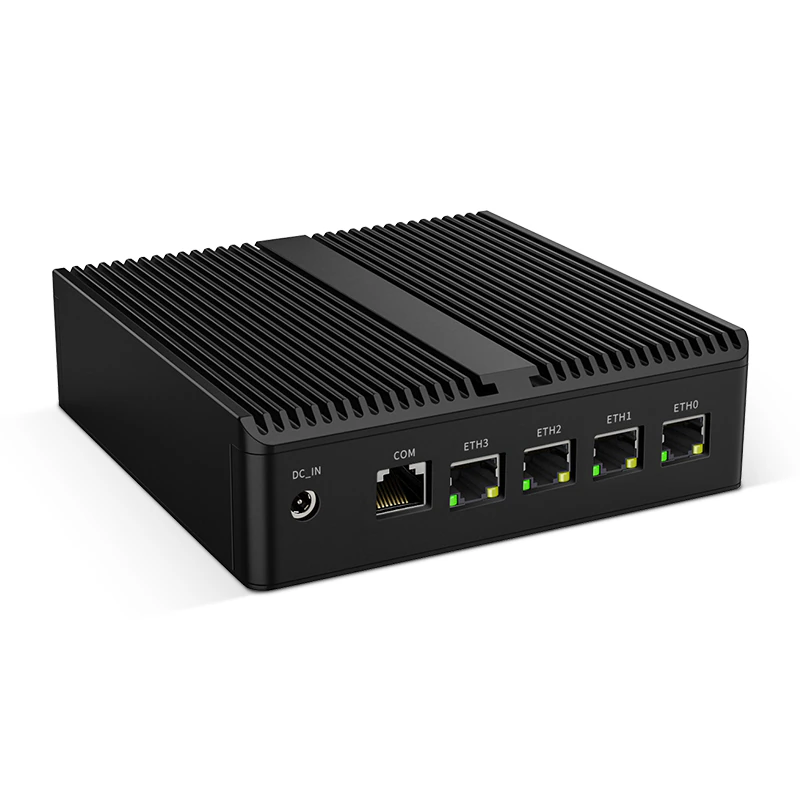
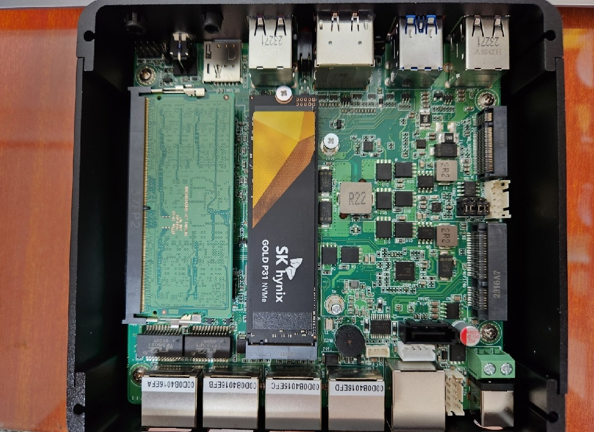
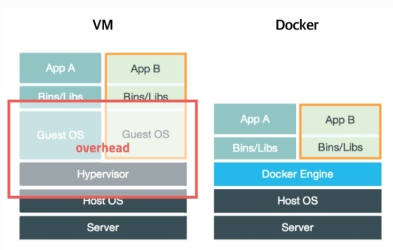
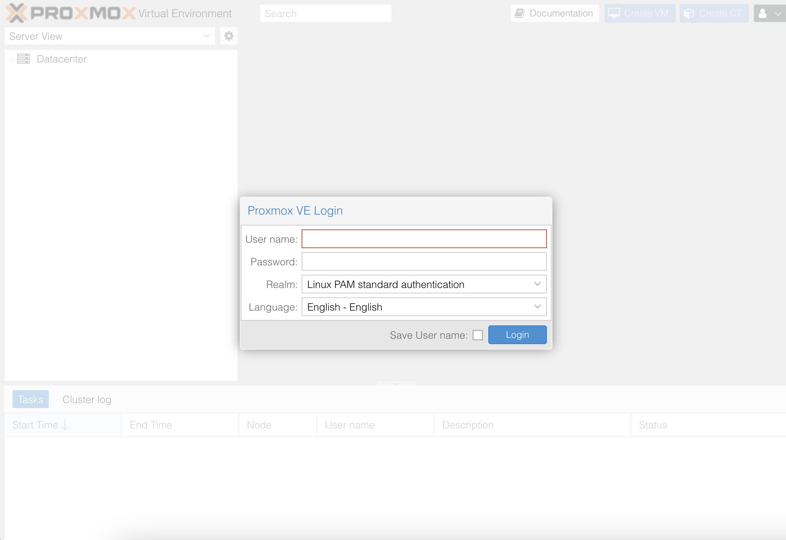
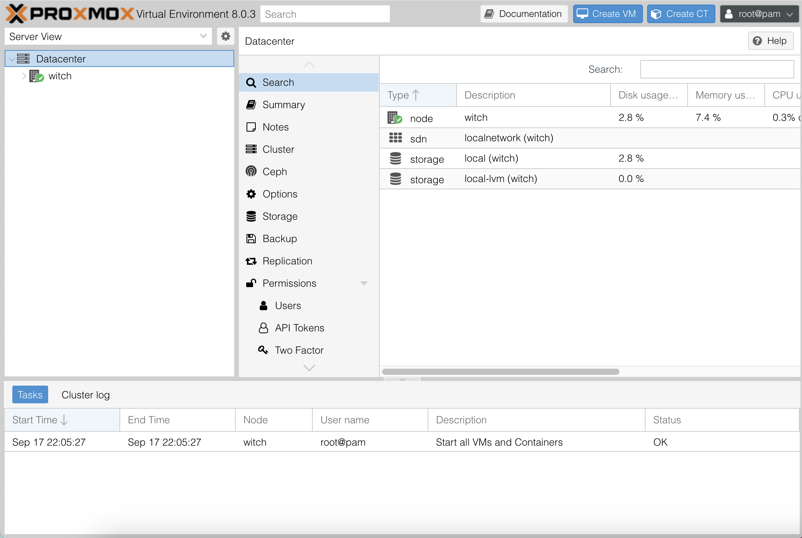
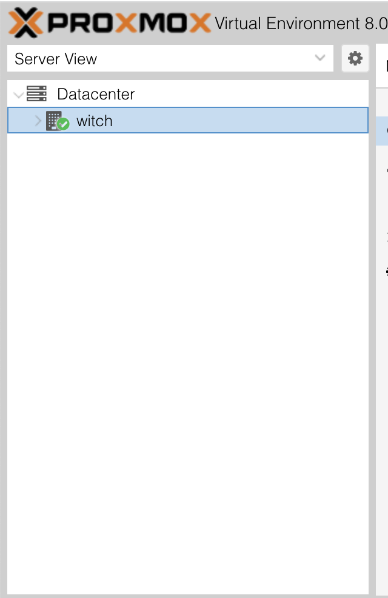
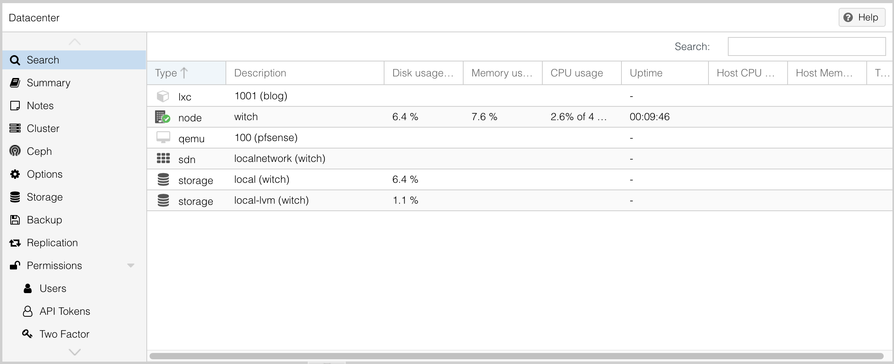
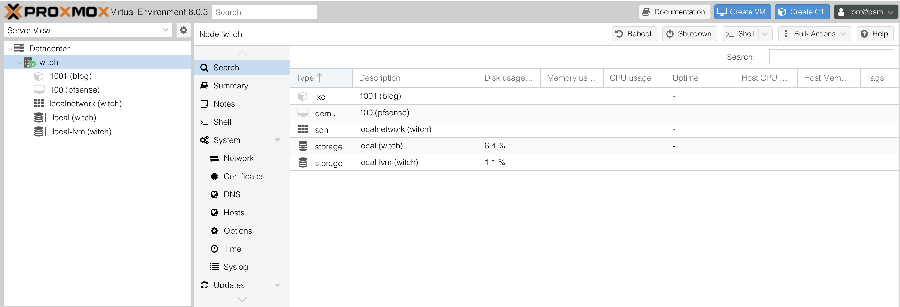

# 이 글은 현재 작성 중입니다.

# 1. 시작

이 블로그는 원래 Vercel로 배포되고 있었다. 그런데 직접 홈서버를 세팅해서 블로그를 배포하고 있는 [불칸](https://vulcan.site/)님과 교류하다 보니 나도 직접 서버를 세팅해서 블로그를 배포해 보고 싶다는 생각을 하게 되었다.

그러다가 마침 괜찮은 가성비 서버를 추천받아서 홈 서버를 세팅해 보았다. 개인 서버에 엄청난 돈과 시간을 쏟아부은 사람이 도와주려고 기다리고 있는데 이런 기회를 놓칠 수는 없다. 그렇게 빈털터리가 되었다. 아무튼 그 과정을 블로그에 작성할 것인데 이를 위해 구매한 물품들은 다음과 같다.

[인텔의 N100 i226-V(알리익스프레스 링크)](https://ko.aliexpress.com/item/1005005892722060.html?spm=a2g0o.order_list.order_list_main.5.1818140fxGKlvQ&gatewayAdapt=glo2kor)를 알리익스프레스에서 약 17만원에 구매하였다.



[SK하이닉스 GOLD P31 NVMe SSD 1TB(쿠팡 링크)](https://www.coupang.com/vp/products/6091702345?vendorItemId=73680480457&sourceType=MyCoupang_my_orders_list_product_title&isAddedCart=)를 약 10만원에 쿠팡에서 구매하였다.

[삼성전자 노트북 DDR5-4800 (16GB)](https://prod.danawa.com/info/?pcode=17666249)를 다나와 최저가비교에서 약 5만원에 구매하였다. 당시 최저가인 곳에서 사서 어디서 샀는지는 잘 기억나지 않는다. 흔한 모델이니까 어디서든 구매하면 될 거라고 생각한다.

어쨌든 중국에서 먼 길을 온 서버가 도착했다. 드라이버로 하판을 떼고 해당 부품들을 장착해 주었다.



또 집의 공유기가 너무 오래된 모델이라 그런지 DHCP 설정을 끌 수 없는 등의 문제가 있었다. 그래서 iptime 유무선 공유기, 정확히는 ipTIME A2003NS-MU을 구매하였다. 이건 동봉된 설명서를 보니 iptime 설치 도우미 앱이 있어서 간단히 설치할 수 있었다.

# 2. proxmox 설치

proxmox와 pfsense 기반으로 서버를 세팅할 것이다. 먼저 proxmox를 설치하자.

## 2.1. proxmox란?

서버는 보통 ubuntu를 기반으로 한다. 따라서 웹 서버만 쓴다면 우분투만 사용해도 된다. 라즈베리 파이에 우분투를 깔아서 돌아가고 있는 간단한 웹 서버들도 꽤 많다. 가령 [윤군님의 블로그](https://blog.yuni.dev/)라거나.

하지만 그렇게 하면 웹 서버를 돌리는 것 외에 아무것도 하지 못하게 된다. 만약 내가 블로그를 돌리면서 마인크래프트나 팩토리오 서버도 열고 싶다면? 우분투만 깔려 있다면 어렵다.

그럴 때 사용할 수 있는 선택지 중 가장 대표적인 건 virtualbox같은 가상 머신을 사용하는 것이다. 호스트 OS에 하이퍼바이저를 올리고 그 위에 여러 개의 게스트 OS를 올리는 식이다. 이렇게 하면 하나의 OS에서 여러 개의 운영체제를 올릴 수 있다.

보통은 컴퓨터가 1대이고 그걸 서버만을 위해서 돌릴 수 없기 때문에, 컴퓨터 하나에서 여러 개의 운영체제를 돌리기 위해서는 가상 머신은 꽤 합리적인 선택이다. 하지만 호스트 OS위에 하이퍼바이저가 올라가고 그 위에 또 게스트 OS가 올라가는 것이기 때문에 당연히 최적화에는 그렇게 좋지 않다.

이런 가상 머신과 흔히 비교되는 게 도커인데 이는 소프트웨어를 컨테이너로 패키징해서 독립된 프로세스에서 실행시키고, 이 프로세스가 호스트OS의 커널 자원을 나눠 쓸 수 있도록 한다.

호스트 OS의 커널 자원을 사용하므로 하이퍼바이저 기반의 가상 머신을 사용하는 것보다 효율적이다. 하지만 결국 커널은 호스트OS 기반이기 때문에 완전히 다른 운영체제 커널을 사용할 수는 없다.



이 proxmox는 그런 부분을 해결해 준다. 근본은 이런 생각이다. 

```
가상화만을 목적으로 한다면, 호스트OS와 가상화를 위한 하이퍼바이저를 같이 돌리면 안 될까?
```

이런 생각을 실현한 게 proxmox이다. proxmox는 베어메탈 형식으로 하드웨어 바로 위에서 구동되며 호스트 OS의 커널을 일정 부분 격리하여 새로운 OS를 위한 공간을 만든다. proxmox를 사용해 보면 실제로 이런 공간을 얼마나 할당할지도 직접 지정할 수 있다.

위의 VM 구조를 나타낸 사진에서 하이퍼바이저 층을 거의 없앤 것이라고 볼 수 있겠다. 그래서 가상 머신을 돌리는데 있어서 더 효율적이고 도커에 비해 진짜 다른 OS의 커널을 이용해 서버를 돌릴 수 있다는 이점이 있다. 또한 proxmox는 웹 UI도 제공하며 이를 통해 가상 머신을 관리할 수 있다.

이 분야의 초보가 들은 대로 간략히 써본 것이라 더 자세한 이야기는 [Proxmox VE: 오픈소스 가상화 OS란 무엇인가](https://it-svr.com/proxmox-ve-opeunsoseu-gasanghwa-osran-mueosinga/)를 참고하면 볼 수 있다. 그리고 [레드햇의 하이퍼바이저 설명 문서](https://www.redhat.com/ko/topics/virtualization/what-is-a-hypervisor)도 볼 만 하다.

## 2.2. USB 굽기

[proxmox 공식 다운로드 페이지](https://www.proxmox.com/en/downloads)에서 iso 파일을 다운로드 받는다. 그러고 나면 설치 USB를 만들어 주어야 한다. 문구점에서 흔하게 파는 Sandisk USB가 있어서 사용했다.

참고로 이 작업을 하기 전에 USB를 포맷해 줘야 한다. [맥 OS에서 USB를 포맷하는 법](https://100sang.net/143)을 따라했다.

그리고 USB를 구우려고 했는데, 나는 맥os라서 iso 파일을 USB로 바로 구울 수 없다. 다행히 이를 간단히 처리해 주는 balenaEtcher라는 프로그램이 있었다. 이를 사용하면 USB를 간단히 proxmox 부팅 USB로 만들 수 있다.

[맥 USB .iso, .img 이미지 부팅 설치 파일 만들기](https://tttap.tistory.com/223)를 참고하여 USB를 만들었다.

## 2.3. proxmox 설치

usb를 만들었으면 서버에 설치하자. USB를 서버에 꽂고 부팅시켜 주면 proxmox 설치 화면이 나온다. 어차피 이렇게 한번 설치하고 실행시키고 나면 모니터를 쓸 일은 거의 없기 때문에, 나는 집에 안 쓰는 모니터를 잠시 연결하여 설치를 진행했다.

설치는 매우 간단하다. [이를 잘 설명해둔 블로그를 보고 그대로 따라하였다.](https://nad4.tistory.com/entry/Proxmox-%EC%84%A4%EC%B9%98-%EB%B0%8F-%EC%B4%88%EA%B8%B0-%ED%95%84%EC%88%98-%EC%84%A4%EC%A0%95)

이렇게 설치하고 나면 proxmox가 설치된다. 이제 proxmox를 사용할 수 있다.

설치가 끝나면 proxmox의 웹 UI에 접속할 수 있다. 참고로 기본 계정명은 `root`이고 비밀번호는 설치할 때 설정한 것이다. 기본 계정명을 몰라서 처음에 고생을 많이 했다.

### 2.3.1. 트러블슈팅

그런데 문제가 발생했다. 분명 `192.168.219.154:8006`으로 들어가면 proxmox 웹 UI가 뜬다고 해서 들어갔는데 들어가지지 않았다.

알고 보니 내가 기존에 쓰던 공유기의 DHCP는 `192.168.219.1` 게이트웨이 기반으로 IP가 할당되었는데 새로 산 iptime 공유기는 `192.168.0.1`게이트웨이에서 IP가 동적 할당되었다.

따라서 이렇게 동적 할당되는 주소를 바꿔 줘야 한다.

```bash
nano etc/network/interfaces
```

그러면 잘 찾아보면 address, gateway라고 되어 있는 부분이 있다. 이를 편집하자.

```bash
auto vmbr0
iface vmbr0 inet static
        address 192.168.219.154/24 -> 192.168.0.3/24 로 수정
        gateway 192.168.219.1 -> 192.168.0.1 로 수정
        bridge-ports enp1s0
        bridge-stp off
        bridge-fd 0
# 이하 생략
```

그리고 다음 명령어를 입력한다.

```bash
service networking restart
reboot
```

그러면 커맨드 그대로 네트워킹이 재시작되고 서버가 리부트된다. 이렇게 해도 서버 화면 상단에 뜨는 ip는 안 바뀔 수 있다. 나도 그랬다. 그러면 상단에 뜨는 ip는 무시하고 `ip a`를 입력해서 나오는 ip(나 같은 경우 `192.168.0.3:8006`이었다)로 접속하면 로그인을 하라는 창이 뜬다.



여기서도 username은 `root`(물론 변경할 수는 있지만 기본 이름이 이렇다), password는 설정한 것을 입력하면 된다. 그러면 `You do not have a valid subscription for this server`라면서 구독이 없다는 메시지가 뜨는데 유료 구독은 필수가 아니므로 무시하고 `OK`를 누른다.



# 3. proxmox 웹 UI 가이드

각 메뉴에 대해 아주 간단히만 적어놓는다.

## 3.1. 맨 왼쪽 메뉴



왼쪽 메뉴를 보면 Datacenter와 그 아래 witch라는 게 있다.

하드웨어와 관련된 부분은 Datacenter에 있고 여기서 모든 노드들을 전체적으로 볼 수 있다. 그 아래 있는 것은 데이터센터에 연관된 노드들이다.

그 아래 보이는 witch는 내가 생성한 노드 이름이다. 만약 노드를 더 생성할 시 그 아래에 모든 노드 이름이 생길 것이다.

## 3.2. Datacenter 메뉴

여기는 하드웨어와 관련된 설정들이 있는 곳이다.



search에서는 node(여기서는 내 서버)와 하드웨어에 관련된 정보들을 볼 수 있다. 서버가 더 있다면 여기서 모든 서버들의 정보를 볼 수 있다.

summary에서는 하드, 메모리 사용량과 같은 정보를 간략히 제공한다.

Notes는 메모 같은 느낌인데 쓸 일 없다고 알고 있다.

cluster, ceph는 클러스터링 같은 걸 할 때 쓴다고 하는데 나는 서버가 하나이기 때문에 쓸 일이 없다. 그리고 ceph 메뉴에 들어가면 ceph가 설치되어 있지 않다고 하며 설치하라고 하는 메시지가 뜨는데 여기서 설치하면 매우 귀찮은 설정들이 (강제로)기다리고 있으므로 사용할 게 아니라면 절대 누르지 말라는 조언이 있었다.

options는 말 그대로 옵션 창. storage는 저장 장치를 관리하는 곳이다. 여기서 보이는 local-lvm은 가상 머신을 의미한다. 하드 용량은 local, local-lvm에서 알아서 잘 조절하니까 그렇게 신경쓰지 않아도 된다.

backup은 백업 관련 설정이다. proxmox는 컨테이너 정보 백업 등 좋은 백업 기능들을 제공하기에 이를 사용하면 좋다. 하루에 한번씩 자동으로 백업을 뜨는 등의 설정도 가능하다고 한다.

replication은 서버가 2대 이상이면 사용 가능한 기능이고 permission은 말 그대로 권한 설정이다.

HA는 high availability의 약자로 고가용성을 의미한다. 서버가 2대 이상일 때 사용 가능하다.

ACME는 ACME SSL 인증서 관련 기능이다.

여기의 Firewall은 외부에서 proxmox 서버로 접속할 때가 아니라 가상 머신들 간의 방화벽 설정을 하는 곳이다.

metric server는 Grafana와 같은 모니터링 툴 같은 걸 쓸 때 사용하는 기능인데 나는 사용할 일이 지금은 없다.

## 3.3. node(witch) 메뉴

왼쪽 메뉴에서 `Datacenter`아래에는 내 서버 노드가 위치하고 있다. 여기서도 몇 가지 설정을 할 수 있다.



여기에서도 search, summary, notes는 Datacenter 메뉴와 같다. summary에서 노드의 정보를 좀더 자세히 볼 수 있다는 정도?

또한 shell에서는 서버 노드 내부의 shell을 다룰 수 있다.

system 메뉴에서는 다양한 설정을 할 수 있는데 Network 메뉴 외에는 디폴트 설정에서 건들 게 별로 없다. 

Updates에서는 패키지 업데이트가 가능하고, Firewall에서는 node 내부 통신에서의 firewall 설정을 할 수 있다.

그리고 여기서도 Ceph, replication은 클러스터링할 게 아니고 서버도 1대라서 사용하지 않는다.

# 4. proxmox 설정

proxmox 설정을 시작한다.


# 참고

맥 OS에서 USB를 포맷하는 법 https://100sang.net/143

맥 USB .iso, .img 이미지 부팅 설치 파일 만들기 https://tttap.tistory.com/223

proxmox란 무엇인가
https://it-svr.com/proxmox-ve-opeunsoseu-gasanghwa-osran-mueosinga/