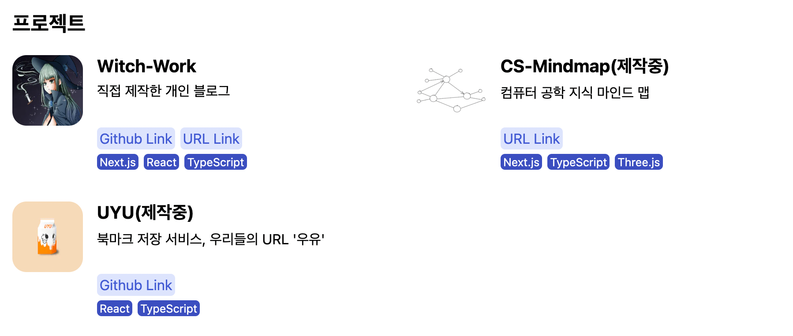
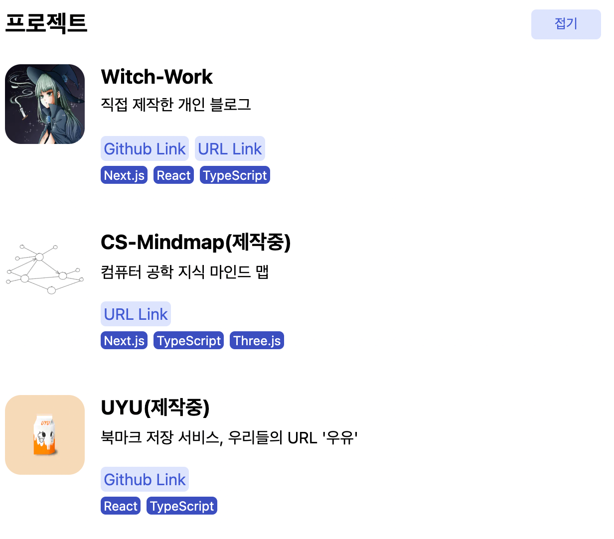
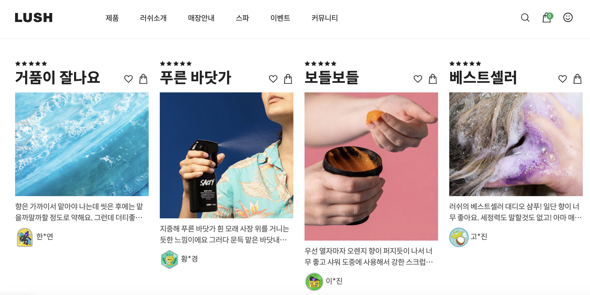
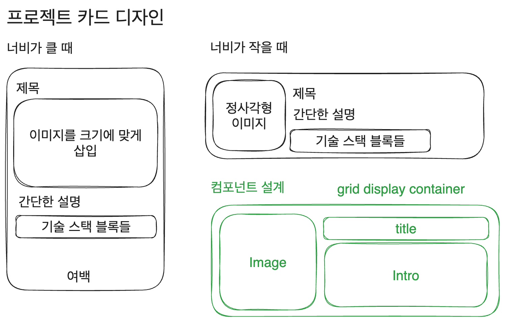

# 블로그 만들기 시리즈

|제목|링크|
|---|---|
|1. 기본 세팅|[https://witch.work/posts/blog-remake-1](https://witch.work/posts/blog-remake-1)|
|2. 메인 페이지의 HTML 설계|[https://witch.work/posts/blog-remake-2](https://witch.work/posts/blog-remake-2)|
|3. 글 상세 페이지의 구조 설계|[https://witch.work/posts/blog-remake-3](https://witch.work/posts/blog-remake-3)|
|4. 이미지를 상대 경로로 쓸 수 있도록 하기|[https://witch.work/posts/blog-remake-1](https://witch.work/posts/blog-remake-4)|
|5. 자잘한 페이지 구성 개선과 배포|[https://witch.work/posts/blog-remake-5](https://witch.work/posts/blog-remake-5)|
|6. 페이지 요소의 배치 설계|[https://witch.work/posts/blog-remake-6](https://witch.work/posts/blog-remake-6)|
|7. 메인 페이지 컴포넌트 디자인|[https://witch.work/posts/blog-remake-7](https://witch.work/posts/blog-remake-7)|
|8. 글 목록/내용 페이지 컴포넌트 디자인|[https://witch.work/posts/blog-remake-8](https://witch.work/posts/blog-remake-8)|
|9. 글 썸네일 자동 생성하기|[https://witch.work/posts/blog-remake-9](https://witch.work/posts/blog-remake-9)|
|10. 폰트, 카드 디자인 등의 디자인 개선|[https://witch.work/posts/blog-remake-10](https://witch.work/posts/blog-remake-10)|
|11. 글에 조회수 달기|[https://witch.work/posts/blog-remake-11](https://witch.work/posts/blog-remake-11)|
|12. 페이지 테마와 글 검색 기능|[https://witch.work/posts/blog-remake-12](https://witch.work/posts/blog-remake-12)|
|13. 테마 아이콘과 썸네일 레이아웃 개선 등|[https://witch.work/posts/blog-remake-13](https://witch.work/posts/blog-remake-13)|
|14. 글 분류를 태그 기반으로 변경|[https://witch.work/posts/blog-remake-14](https://witch.work/posts/blog-remake-14)|
|메인 페이지의 연산 최적화|[https://witch.work/posts/blog-opt-1](https://witch.work/posts/blog-opt-1)|
|글 목록 페이지네이션 만들기|[https://witch.work/posts/blog-opt-2](https://witch.work/posts/blog-opt-2)|
|이미지를 CDN에 올리고 placeholder 만들기|[https://witch.work/posts/blog-opt-3](https://witch.work/posts/blog-opt-3)|
|검색 페이지에 무한 스크롤 구현하기|[https://witch.work/posts/blog-opt-4](https://witch.work/posts/blog-opt-4)|

# 1. 글 내용 중 코드의 폰트 변경

prism에서 쓰는 세팅 일부를 가져왔다. `/src/pages/[category]/[slug]/content.module.css`를 편집.

```css
.content :is(pre,code){
  //font-family:monospace, Pretendard, apple-system, system-ui, BlinkMacSystemFont, "Segoe UI", Roboto, "Helvetica Neue", Arial, sans-serif;
  font-family: 'Fira Code', Menlo, Monaco, Consolas, "Andale Mono", "Ubuntu Mono", "Courier New", monospace;
  direction: ltr;
  text-align: left;
  white-space: pre;
  word-spacing: normal;
  word-break: normal;
  line-height: 1.5;
  -moz-tab-size: 4;
  -o-tab-size: 4;
  tab-size: 4;
  -webkit-hyphens: none;
  -moz-hyphens: none;
  -ms-hyphens: none;
  hyphens: none;
  /* 점 병합에 관한 옵션 */
  font-variant-ligatures: none;
  font-size:1rem;
  overflow:auto;
}
```

# 2. 프로젝트 카드 디자인

현재 프로젝트 카드 디자인과 배열은 다음과 같다. 화면이 넓을 땐 2열로 그리고 좁을 땐 1열로 배열된다.



모바일에서는 다음과 같이 보인다.



여기에는 몇 가지 문제가 있다.

1. 프로젝트 이미지 크기와 텍스트박스의 크기가 맞지 않다.
2. 카드를 누르면 직관적으로 프로젝트 페이지로 넘어가는 게 아니라 링크 버튼이 따로 있다.
3. 단순한 격자로 배열되어 별로 재미가 없다.(물론 모바일에서는 상관없다)

레퍼런스로 쓸 만한 페이지를 여럿 찾아보았다. 그러다가 러쉬의 메인 페이지에서 괜찮아 보이는 배치를 발견했다.


출처 : [러쉬 공식 사이트](https://www.lush.co.kr/)

카드 자체를 링크로 만들었고(뜯어보면 카드 전체가 링크인 건 아니지만 크게 상관은 없다), 적당히 서로 다른 높이의 이미지를 사용하여 시각적인 변형을 주었다. 또한 한 줄로 배치되었다.

이를 한번 따라해보자. 단 화면이 넓을 때만. 화면이 좁을 경우 저런 식으로 가로 한 줄 배치가 가시성을 떨어뜨리는 것 같았다.

## 2.1. 카드를 링크로 만들기

배치 같은 경우 모바일과 PC가 다르게 이루어질 것이므로 두 부분에 공통되는 특성부터 변경하자. 먼저 카드 자체를 링크로 만드는 작업을 하자.

먼저 기존 링크를 없앤다. 그냥 링크 리스트 부분을 없애고 링크블럭+기술스택블럭을 묶은 div를 없애준다.

```tsx
// src/components/projectList/project/intro/index.tsx
function ProjectIntro({project}: {project: projectType}) {
  return (
    <div className={styles.intro}>
      <div>
        <h3 className={styles.title}>{project.title}</h3>
        <p className={styles.description}>{project.description}</p>
      </div>
      <ul className={styles.list}>
        {project.techStack.map((tech) =>
          <li key={tech} className={styles.tech}>{tech}</li>
        )}
      </ul>
    </div>
  );
}
```

그리고 `Project`컴포넌트를 링크로 만들어서 카드 전체를 링크화하자. `project.url`에 들어 있는 첫번째 링크를 쓴다.

```tsx
function Project({project}: {project: projectType}) {
  return (
    <Link className={styles.wrapper} href={project.url[0].link} target='_blank'>
      <article className={styles.container} > 
        <div className={styles.imagebox}>
          <Image
            className={styles.image}
            src={project.image} 
            alt={project.title}
            width={200}
            height={200}
          />
        </div>
        <ProjectIntro project={project} />
      </article>
    </Link>
  );
}
```

## 2.2. 프로젝트 배치 변경

projectList의 배치는 기존에 화면이 넓을 땐 2열로 배치되었다. 이를 그냥 가로 한 줄로 배치되도록 하자. `/src/components/projectList/styles.module.css`에서 미디어 쿼리, 그중에서도 열 수를 지정하는 부분만 편집하면 된다.

```css
// /src/components/projectList/styles.module.css
@media (min-width: 768px) {
  .list{
    display:grid;
    /* 이 부분의 열 수를 2에서 4로 변경 */
    grid-template-columns:repeat(4,1fr);
    grid-auto-rows:1fr;
    row-gap:1rem;
    column-gap:1rem;
  }

  .toggle{
    display:none;
  }
}
```

## 2.3. 프로젝트 소개 레이아웃 변경

그리고 러쉬 공식 페이지를 참고하여 다음과 같은 개별 프로젝트 카드 레이아웃을 생각했다. `project` 컴포넌트 설계도 변경하였다.



일단 project 컴포넌트를 폴더로 분리하자. `src/components/projectList/project` 폴더를 `src/components/`로 이동한다. 그리고 폴더명을 `projectCard`로 변경한 후 내부에 `intro` 폴더 외에 `image`, `title` 폴더를 새로 생성한다. 각각의 내부에도 index.tsx와 styles.module.css를 만드는 것도 하자.

일단 서로 분리된 각 요소들부터 만들고 나서 전체 `projectCard` 레이아웃을 만들자. 가장 쉬운 `title`부터. 그냥 h3 태그 하나만 쓰면 된다.

```tsx
// src/components/projectCard/title/index.tsx
import styles from './styles.module.css';

function Title({title}: {title: string}) {
  return (
    <h3 className={styles.title}>{title}</h3>
  );
}

export default Title;
```

스타일도 그냥 margin만 없애주면 된다.

```css
// src/components/projectCard/title/styles.module.css
.title{
  margin: 0;
}
```

이제는 intro를 편집하자. 기술 스택 블록 디자인 같은 건 딱히 바꿀 것 없다. 구조도 똑같다.

```tsx
function ProjectIntro({project}: {project: projectType}) {
  return (
    <div className={styles.intro}>
      <p className={styles.description}>{project.description}</p>
      <ul className={styles.list}>
        {project.techStack.map((tech) =>
          <li key={tech} className={styles.tech}>{tech}</li>
        )}
      </ul>
    </div>
  );
}
```

그냥 카드 자체가 링크가 되면서 쓰이지 않게 된 `link` 클래스를 삭제해 주고, 화면너비가 좁을 땐 설명 영역과 기술스택 영역이 `space-between`으로 배치되게 하고 넓을 땐 붙어서 배치되도록 한다. 기술 스택 블록 디자인은 눈길을 좀 덜 끌도록 연한 색으로 바꿔주었다.

```css
// src/components/projectCard/intro/styles.module.css
.intro{
  display:flex;
  flex-direction: column;
  justify-content: space-between;
  height:100%;
}

.description{
  margin: 0;
  margin-top:5px;
  width:100%;
}

.list{
  display: flex;
  flex-direction: row;
  flex-wrap: wrap;
  gap: 6px;
  list-style: none;
  padding: 0;
  margin-top:5px;
}

.tech{
  padding: 1.5px 3px;
  border-radius: 5px;
  background-color: var(--indigo0);
  color:var(--indigo6);
  font-size: 0.8rem;
}

@media (min-width:768px){
  .intro{
    justify-content: flex-start;
    height:100%;
  }
}
```

이미지 컴포넌트도 분리하자. 이때 `next/Image`를 사용할 텐데, next에서 제공하는 `Image`태그는 일단 width, height를 지정한 후 다시 CSS 스타일링으로 크기를 바꾸는 것도 지원한다. 이를 이용하자.

컴포넌트 구조는 다음과 같이. 이미지 소스와 alt 텍스트에 쓰일 프로젝트 제목을 받아서 컨테이너에 넣은 단순한 구조다. 그리고 width, height는 어차피 CSS로 지정할 것이므로 `Image`태그에는 300x300으로 고정한다.

```tsx
import Image from 'next/image';

import styles from './styles.module.css';

function ProjectImage({title, image}: {title: string, image: string}) {
  return (
    <div className={styles.container}>
      <Image
        className={styles.image}
        src={image} 
        alt={`${title} 프로젝트 사진`}
        width={300}
        height={300}
      />
    </div>
  );
}

export default ProjectImage;
```

그리고 화면 너비가 작을 땐 이미지를 정사각형으로 보이게 하고 화면 너비가 커지면 `aspect-ratio:auto`를 통해서 이미지의 원래 비율로 보이도록 한다.

```css
// src/components/projectCard/image/styles.module.css
.image{
  margin:0;
  object-fit: fill;
  width:120px;
  height:100%;
  aspect-ratio: 1/1;
}

.container{
  display: block;
  position: relative;
}

@media (min-width: 768px) {
  .container{
    display: block;
    position: relative;
    width:100%;
  }

  .image{
    display: block;
    margin:0;
    object-fit: contain;
    width:100%;
    height:auto;
    aspect-ratio: auto;
  }
}
```

그리고 `projectCard`를 작성하자. 아까 계획했던 레이아웃을 그대로 따라서 작성하면 된다.

```tsx
// src/components/projectCard/index.tsx
function Project({project}: {project: projectType}) {
  return (
    <Link className={styles.wrapper} href={project.url[0].link} target='_blank'>
      <article className={styles.container} >
        <div className={styles.titlebox}>
          <ProjectTitle title={project.title} />
        </div>
        <div className={styles.imagebox}>
          <ProjectImage title={project.title} image={project.image} />
        </div>
        <div className={styles.introbox}>
          <ProjectIntro project={project} />
        </div>
      </article>
    </Link>
  );
}
```

grid display를 이용해서 딱딱 행, 열을 정해주면 된다.

```css
// src/components/projectCard/styles.module.css
.wrapper{
  display:block;
}

.container{
  display: grid;
  grid-template-columns: min-content max-content;
  grid-template-rows: 25px;
  column-gap:1rem;
  box-sizing: border-box;
  /*padding:15px 15px 15px 0;  */
  height:120px;
  max-height:150px;
}

.container:hover{
  background-color: var(--gray1);
  border-radius: 1rem;
  /*padding:10px;*/
  color:var(--indigo6);
}

.titlebox{
  grid-column: 2 / 3;
  grid-row: 1 / 2;
  height:100%;
}

.imagebox{
  grid-column: 1 / 2;
  grid-row: 1 / 3;
}

.introbox{
  grid-column: 2 / 3;
  grid-row: 2 / 3;
}

@media (min-width: 768px) {
  .container{
    flex-direction: column;
    grid-template-columns: 1fr;
    grid-template-rows: 35px min-content;
    min-height:18rem;
  }

  .titlebox{
    grid-column: 1 / 2;
    grid-row: 1 / 2;
    height:100%;
  }

  .imagebox{
    grid-column: 1 / 2;
    grid-row: 2 / 3;
  }

  .introbox{
    grid-column: 1 / 2;
    grid-row: 3 / 4;
  }
}
```

그리고 hover시에 회색 배경이 되는 걸 없애주고, 그림자가 생기면서 이미지가 약간 떠오르는 듯한 효과를 주자. `box-shadow`속성과 margin, padding, transition을 적절히 이용하면 된다.

```css
// src/components/projectCard/styles.module.css
.wrapper{
  display:block;
  width:100%;
  height:100%;
}

.container{
  display: grid;
  grid-template-columns: min-content;
  grid-template-rows: 25px;
  column-gap:1rem;
  /*padding:15px 15px 15px 0;  */
  height:100%;
}

.container:hover{
  color:var(--indigo6);
}

/* 컨테이너 호버 시 이미지 박스 그림자 표현 */
.container:hover .imagebox{
  margin-top: -3px;
  padding-bottom:3px;
  box-shadow: 3px 3px 5px var(--gray6);
  transition: all 0.3s ease-out
}

.titlebox{
  grid-column: 2 / 3;
  grid-row: 1 / 2;
  height:100%;
}

.imagebox{
  grid-column: 1 / 2;
  grid-row: 1 / 3;
  border-radius: 0.5rem;
  height:100%;
}

.introbox{
  grid-column: 2 / 3;
  grid-row: 2 / 3;
}

@media (min-width: 768px) {
  .container{
    flex-direction: column;
    grid-template-columns: 1fr;
    grid-template-rows: min-content min-content;
  }

  .titlebox{
    grid-column: 1 / 2;
    grid-row: 1 / 2;
    height:100%;
  }

  .imagebox{
    grid-column: 1 / 2;
    grid-row: 2 / 3;
  }

  .introbox{
    grid-column: 1 / 2;
    grid-row: 3 / 4;
  }
}
```

그리고 모바일 환경에서 맨 위에 위치한 프로젝트 소개의 사진이 `margin-top:-3px`로 떠오를 때 프로젝트 소개가 접힌 상태에서는 `overflow:hidden` 옵션이 적용되어 사진이 잘리는 문제가 있었다.

이는 container 호버 시 imagebox에 padding도 추가해 주는 것으로 해결.

# 3. 태그 색상

현재 메인페이지에서 글을 약간씩 보여줄 때 태그를 보여주고 있는데 이 태그 블럭의 개별 색상이 너무 진하다 보니 눈을 지나치게 끈다. 이 배경을 좀더 연한 색으로 바꾸고 글자도 어울리는 진한 남색으로 변경.

```css
// src/components/card/intro/styles.module.css
.tag{
  background-color:var(--indigo1);
  color:var(--indigo7);
  border-radius:5px;
  font-size:0.8rem;
  margin:0;
  margin-bottom:5px;
  padding:3px 8px;
}
```

# 4. h3 태그 높이 문제

프로젝트 제목에 h3 태그를 사용하고 있었는데, 한글을 썼을 때와 영어를 썼을 때 h3 태그의 높이가 달라졌다. 1.25rem으로 h3 태그를 썼을 때 한글의 경우 높이가 25.5px였으나 영어로만 썼을 경우 23.5px가 되었다.

따라서 projectCard/title에 쓰이는 h3 태그의 폰트를 Pretendard대신 Roboto를 쓰도록 바꿨다. 이렇게 하니 높이가 24px로 고정되었다.

```css
// src/components/projectCard/title/styles.module.css
.title{
  margin: 0;
  font-family: 'Roboto', sans-serif;
}

@media (min-width: 768px) {
  .title {
    margin-bottom:10px;
  }
}
```

# 참고

러쉬 공식 홈페이지 https://www.lush.co.kr/

이제 `<a>` 태그로 블록 요소를 감쌀 수 있다. 단 내부에 버튼이나 다른 링크 등 상호작용 태그가 없어야 한다. https://stackoverflow.com/questions/1827965/is-putting-a-div-inside-an-anchor-ever-correct/1828032#1828032

https://stackoverflow.com/questions/38367002/make-entire-article-tag-a-link

nextJS Image 태그 https://nextjs.org/docs/app/api-reference/components/image#fill

https://stackoverflow.com/questions/20959600/height-100-on-flexbox-column-child

https://stackoverflow.com/questions/65169431/how-to-set-the-next-image-component-to-100-height