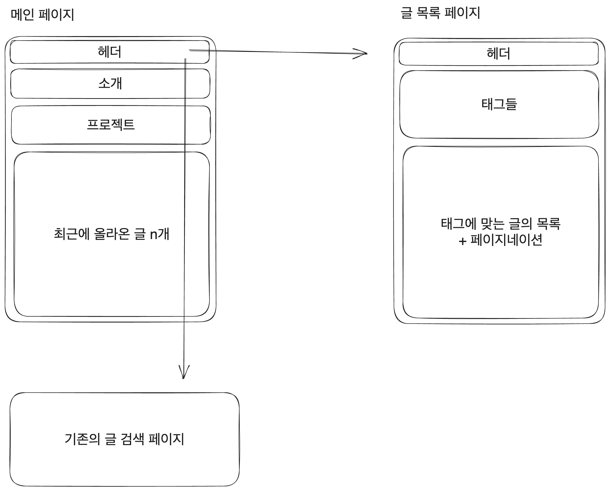
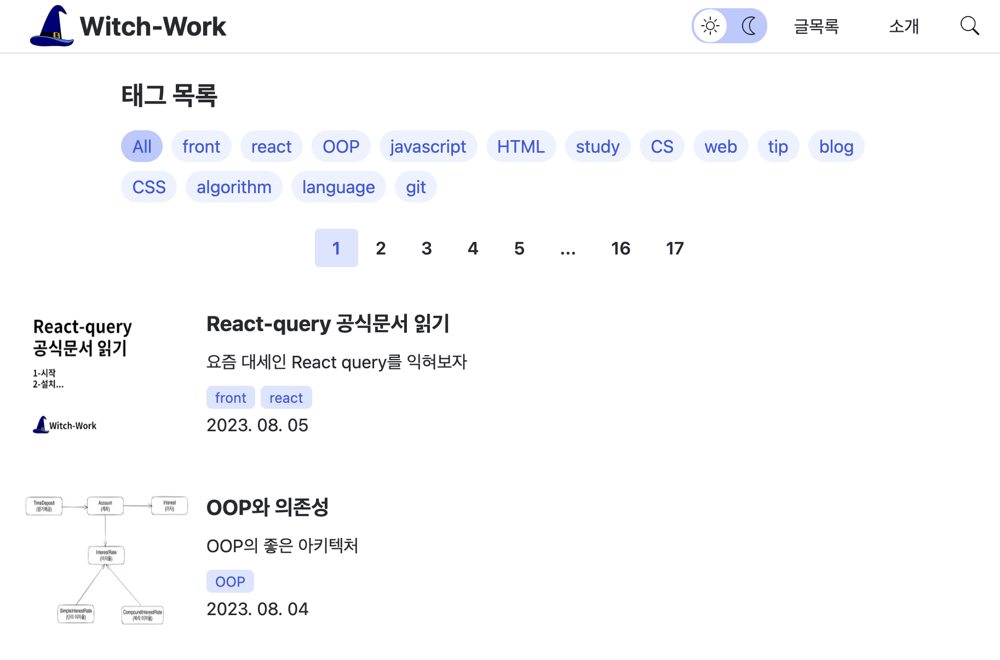

# 1. 왜 태그를 이용해 분류하게 되었는가

지금까지 기록했던 할 일들은 이런 것들이 있었다. 블로그 이미지 최적화, 소개 페이지 삽입, 게시판 제목에 링크달기, 글 썸네일 넣기, 글 목록 페이지네이션, 다크 모드, 글 시간순 정렬, 조회수 달기, TOC 자동 생성, 댓글 기능, 검색 기능, 태그 필터링, SEO 정도.

이 중 태그 필터링 정도를 빼면 모두 완료한 상태이다. 태그 필터링은 검색 기능이 있는 이상 당장 필요하지는 않을 것 같다고 생각해서 미루었었다.

하지만 글이 늘어나면서 내가 기존에 생각했던 CS, 개발, 기타 카테고리만으로는 글을 분류하기가 점점 어려워졌다. 개발 카테고리가 비대했던 건 어느 정도 예상했던 일이지만 이 정도로 커질 줄은 몰랐다.

따라서 좀 더 글을 주제별로 분류한다고 생각되는 태그로 글들을 분류하기로 했다. 기존에도 글에 태그를 달아야 했으므로 모든 글에 이미 태그가 있었고 이를 이용하면 된다.

# 2. 구상

그런데 이 태그를 통한 글의 분류라는 게 막상 하려고 보니까 생각보다 할 게 많은 작업이었다.

단순히 글 목록 페이지에서 글을 태그별로 볼 수 있도록 하는 거였다면 쉬웠겠지만 그 정도가 아니었기 때문이다. 그것에 맞게 사이트 구조와 몇몇 컴포넌트를 바꾸는 작업이 선행되어야 했다.

현재 전체 태그는 약 15개 정도 존재하고, 예전에 붙여 놓았던 잡스러운 태그들을 제거하고 나면 10개 정도 될 것이다. 늘어날 것을 아주 넉넉히 고려해도 두 자릿수 정도에서 놀지 않을까 생각한다.

하지만 지금도 10개를 넘어가는 글의 태그를 헤더에 모두 표시하면서 가시성을 챙기는 건 불가능에 가까운 일이다. 

따라서 현재의 폴더 기반으로 글을 분류하고 보여주고 있는데 이를 태그 기반으로 모두 바꾸는 것을 궁극적인 목적으로 하고 사이트가 어떻게 바뀌어야 할지 구상해 보았다.

이렇게 할 시 내가 태그를 좀 신경써서 써야 하는 것은 여전하지만 원하면 태그를 쉽게 새로 만들기만 하면 된다는 점에서 더 유연해진다고 생각한다.

지금은 메인 페이지에서 폴더별로 글을 분류하고 폴더마다 있는 글들을 시간순으로 정렬해서 보여주고 있다. 이를 현재 글이 들어 있는 폴더를 기반으로 하는 게 아니라 태그를 기반으로 하는 것으로 바꿔야 한다. 전체 구상은 다음과 같이 해보았다.



## 2.1. 폐기된 구상

처음에는 검색 페이지와 태그 필터링 페이지를 합쳐서 하나로 만들까 생각했다. 검색어와 태그를 기반으로 필터링한 포스트만 보여주는 것이다. [gatsby-starter-lavender](https://gatsby-starter-lavender.vercel.app/)에서 이런 필터링을 사용한다.

하지만 이렇게 하지 않은 이유는 다음과 같다.

첫번째로 구현 난이도와 성능에서 차이를 보인다는 것이다. 태그와 검색어를 통한 필터링을 한 페이지에서 구현할 시 필터링된 결과의 페이지네이션을 미리 생성해 놓을 수 없다. 

따라서 페이지번호와 검색어를 쿼리스트링으로 관리하여 해당 쿼리 값을 기반으로 필터링된 결과를 검색 결과로써 보여줘야 한다. `/tag?search=검색어&page=2`와 같이 말이다. 

하지만 이렇게 하면 매번 검색어를 입력할 때마다 다음 과정을 거쳐야 한다.

```
전체 글에서 검색어에 맞는 글 필터링 -> 해당 글을 페이지로 분할해서 나온 결과를 화면에 뿌려주기
```

이는 글 분류와 페이지 번호로 정적으로 생성된 페이지(`/[tag]/[page]`와 같은 URL을 통해서)를 보여주는 것보다 성능이 떨어질 수밖에 없다.

두번째로 검색과 태그를 통한 필터링 그리고 페이지네이션의 조합이 UX에서 별로 좋지 않다고 보인다는 것이다. 내가 현재 구현하고 있는 검색은 사용자의 검색창 입력이 바뀔 때마다 검색 결과를 업데이트해주는 방식이다. 실제로는 완전히 실시간은 아니고 디바운싱 최적화를 적용하지만. 

이렇게 하면 사용자가 검색어를 입력한 후 특별한 행동을 취하지 않아도 알아서 검색 결과를 보여주므로 사용자와의 상호작용이 줄어들어서 좋다.

하지만 이런 실시간 검색을 통한 필터링과 페이지네이션이 그렇게 궁합이 좋지 않다. 예를 들어서 `A`라는 검색어가 타이핑되었을 때 100개의 포스트가 검색되어 10페이지가 생겼고 사용자가 9페이지로 이동했는데(`?search=A&page=9`), 이 상태에서 `B`를 검색어에 추가로 타이핑하니까 검색 결과가 25개밖에 안 된다.

그러면 `AB`를 검색한 결과의 9페이지에서는 뭘 보여줘야 하는가? 검색 결과가 없다고 보여주기? 아니면 검색어를 초기화 해버리기? 혹은 현재 검색결과의 마지막 페이지로 이동? 무엇이든 할 수는 있겠지만 어떤 것을 해도 현재 URL이 바뀌고 페이지 번호도 바뀌어서 사용자가 혼란스러울 것이다.

기존의 검색 페이지처럼 무한 스크롤을 이용해서 검색 결과를 보여준다면 좋겠지만 사용자가 페이지를 제어하고 있다는 느낌을 주는 페이지네이션의 이점을 포기할 수 없었다.

또한 내가 UX디자인에 뭔가 전문성이 있는 것도 아니기 때문에 실시간 검색, 태그 필터링, 페이지네이션의 장점들을 취한 새로운 방식을 만들어내기는 어렵다고 생각했다. 따라서 위의 방식으로 페이지 라우트를 설계하기로 했다.

## 2.2. 페이지 구조

현재는 `/posts/[category]`가 각 글 분류의 목록을 보여주는 페이지이고 `/posts/[category]/[slug]`가 각 글의 상세 페이지이다. 그리고 `/posts/[category]/page/[page]`가 각 글 분류에서 2이상의 페이지 번호를 가진 페이지를 보여주는 페이지이다.

먼저 복수 태그가 허용되는 것을 생각하면 `/posts/[tag]/[slug]`와 같은 URL을 갖도록 하는 것은 좋지 않다. 현재의 URL 작명 방식을 생각해 볼 때 서로 다른 태그를 가진 중복된 폴더명이 있을 가능성은 적으므로 글 상세 페이지의 경우 `/posts/[slug]` 경로를 가지도록 하겠다.

그리고 페이지네이션을 만들 때 `/posts/[category]/page/[page]`와 같은 URL을 갖게 한 것은 중간에 `page`라는 단계가 있으면 좋겠어서가 아니었다.

`posts/[category]/[page]`와 같이 동적 URL을 구성하게 되면 글의 상세 페이지(`posts/[category]/[slug]`)와 같은 형식의 동적 URL을 갖게 되기 때문이었다. 이렇게 2가지의 동적 라우터가 있는 건 권장되지 않는 패턴이기 때문에 어쩔 수 없이 중간에 `page`를 한번 넣은 것이다.

하지만 태그 기반으로 글을 분류하는 페이지 구조에서는 이런 동적 라우트의 중복이 일어나지 않으므로 2페이지 이상의 페이지를 가질 경우 `/posts/tag/[tag]/[page]`와 같은 동적 URL을 갖도록 하겠다. 모든 글을 보여주는 페이지는 `/all`라우트를 따로 만들어서 `/posts/all`과 `/posts/all/[page]`가 될 것이다.

따라서 `src/pages/posts`내부는 다음과 같은 폴더 구조를 가지도록 설계하였다.

```
posts
├── all
│   └── [page]
│   │   └── index.tsx
│   └── index.tsx
├── tag
│   ├── [tag]
│   │   ├── [page]
│   │   │   └── index.tsx
│   │   └── index.tsx
├── [slug]
│   └── index.tsx
└── index.tsx(글 검색 페이지)
```

# 3. 글 추출하기

## 3.1. 전체 글을 페이지로 분류

이전에는 전체 글에 대한 페이지네이션이 없었다. 전체 글을 볼 수 있는 건 검색 페이지뿐이었고 카테고리별 페이지네이션밖에 없었다. 따라서 전체 글을 페이지별로 추출하는 함수를 따로 만들도록 하자. `src/utils/post.ts`를 편집한다.

기존에 있던 페이지별 글 추출 함수를 거의 그대로 이용하면 된다.

```js
// src/utils/post.ts
interface Page{
  currentPage: number;
  postsPerPage: number;
}

export const getPostsByPage = (page: Page) => {
  const { currentPage, postsPerPage } = page;
  const pagenatedPosts=getSortedPosts().slice(
    (currentPage-1)*postsPerPage,
    currentPage*postsPerPage
  );
  return {pagePosts:pagenatedPosts, totalPostNumber: allDocuments.length};
};
```

## 3.2. 태그별 글을 페이지로 분류

각 글의 태그는 `contentlayer/generated`에 들어 있는 `allDocument`의 원소로 있는 각 문서들에 `post.tags` 배열로 존재한다. 따라서 이들을 모두 뽑아내자.

[JS의 Set 객체는 원소의 삽입 순서대로 순회할 수 있으므로](https://developer.mozilla.org/ko/docs/Web/JavaScript/Reference/Global_Objects/Set) 날짜 순대로 정렬된 `getSortedPosts`에서 태그들을 뽑아내면 가장 최근에 글이 쓰여진 태그부터 순서대로 나오게 된다.

글들의 모든 태그를 뽑아내는 함수를 넣기 위해 `src/utils/postTags.ts`를 만들고 함수를 작성한다.

```js
// src/utils/postTags.ts
export const getAllPostTags = (): string[] => {
  const allTags=new Set<string>();
  getSortedPosts().forEach((post: DocumentTypes)=>{
    post.tags.forEach((tag: string)=>{
      allTags.add(tag);
    });
  });
  return Array.from(allTags);
};
```

이번에는 태그를 기반으로 해당 태그를 가진 글을 뽑아내는 함수를 만들자. 기존의 `getCategoryPosts`는 다음과 같이 동작하였다. 딱 필요한 페이지만큼의 글을 불러오기 위한 `PageInfo`정보가 제공되었다.

```js
// src/utils/posts.ts
// 기존에 쓰이던 함수
interface PageInfo{
  category: string;
  currentPage: number;
  postsPerPage: number;
}

export const getCategoryPosts = (info: PageInfo) => {
  const { category, currentPage, postsPerPage } = info;
  const allDocumentsInCategory = getSortedPosts().filter((post: DocumentTypes)=>
    post._raw.flattenedPath.startsWith(category));

  const pagenatedPosts= allDocumentsInCategory.slice(
    (currentPage-1)*postsPerPage, 
    currentPage*postsPerPage
  );

  return {pagePosts:pagenatedPosts, totalPostNumber: allDocumentsInCategory.length};
};
```

이를 기반으로 비슷한 `getPostsByPageAndTag`를 만들자. 이 역시 태그에 해당하는 글들을 페이지로 분류해야 할 것은 마찬가지이므로 요구되는 정보는 똑같다.

```js
// src/utils/post.ts
interface TagPage{
  tag: string;
  currentPage: number;
  postsPerPage: number;
}

export const getPostsByPageAndTag = (tagPage: TagPage) => {
  const { tag, currentPage, postsPerPage } = tagPage;
  const tagPosts=getSortedPosts().filter((post: DocumentTypes)=>post.tags.includes(tag));
  const pagenatedPosts= tagPosts.slice(
    (currentPage-1)*postsPerPage,
    currentPage*postsPerPage
  );
  return {pagePosts:pagenatedPosts, totalPostNumber: tagPosts.length};
};
```

# 4. 페이지 구조 만들기

앞서 만들었던 페이지 폴더 구조가 실제로 작동하도록 해보자. 먼저 모든 글들을 `posts/cs` 와 같이 분류하는 폴더 내부가 아니라 `posts`로 옮긴다. 

## 4.1. 태그별 페이지 구성하기

먼저 태그별로 글을 분류해 놓은 페이지를 구성하자. `src/pages/posts/tag/[tag]/index.tsx`를 편집하자.

모든 태그를 가져오는 `getAllPostTags`를 이용해서 가능한 모든 태그들의 경로를 제공한다.

```tsx
// src/pages/posts/tag/[tag]/index.tsx
export const getStaticPaths: GetStaticPaths=()=>{
  const paths=getAllPostTags().map((tag)=>{
    return {
      params: { tag },
    };
  });
  return {
    paths,
    fallback: false,
  };
};
```

그리고 이렇게 만들어진 path를 기반으로 `getPostsByPageAndTag`를 이용해서 해당 태그를 가진 글들을 가져오는 `getStaticProps`를 만들자. 기존에 있던 해당 함수에서 태그를 기반으로 하는 것을 감안해 변수명과 링크만 좀 바꾸면 된다.

```tsx
// src/pages/posts/tag/[tag]/index.tsx
export const getStaticProps: GetStaticProps = async ({params}) => {
  const {pagePosts, totalPostNumber} = await getPostsByPageAndTag({
    tag:params?.tag as string,
    currentPage:FIRST_PAGE,
    postsPerPage:ITEMS_PER_PAGE
  });

  const pagePostsWithThumbnail=pagePosts.map((post: DocumentTypes) => {
    const { title, description, date, tags, url } = post;
    const metadata={title, description, date, tags, url};
    return 'thumbnail' in post._raw ? 
      ({...metadata, thumbnail: post._raw.thumbnail} as CardProps) :
      metadata;
  });

  return {
    props: {
      tag:params?.tag,
      tagURL:`/posts/tag/${params?.tag}`,
      pagePosts:pagePostsWithThumbnail,
      totalPostNumber,
      currentPage:FIRST_PAGE,
    },
    revalidate: 60 * 60 * 24, // <--- ISR cache: once a day
  };
};
```

페이지 컴포넌트는 이렇게 생성된 `tag`, `tagURL`을 사용하도록 변경한다.

```tsx
// src/pages/posts/tag/[tag]/index.tsx
function PostListPage({
  tag,
  tagURL,
  pagePosts,
  totalPostNumber,
  currentPage,
}: InferGetStaticPropsType<typeof getStaticProps>) {
  /* SEO 정보 */
  const SEOInfo: NextSeoProps={
    title: `${tag} 태그를 가진 글`,
    description: `${tag} 태그를 가진 글들을 모아서 보여주는 페이지`,
    canonical:`${blogConfig.url}${tagURL}`,
    openGraph:{
      title: `${tag} 태그의 글`,
      description: `${tag} 태그를 가진 글들을 모아서 보여주는 페이지`,
      images: [
        {
          url:`${blogConfig.url}${blogConfig.thumbnail}`,
          alt: `${blogConfig.name} 프로필 사진`,
        },
      ],
      url:`${blogConfig.url}${tagURL}`,
    },
  };

  return (
    <>
      <NextSeo {...SEOInfo} />
      <PageContainer>
        <Title title={`tag : ${tag}`} />
        <Pagination
          totalItemNumber={totalPostNumber}
          currentPage={currentPage}
          renderPageLink={(page: number) => `${tagURL}/${page}`}
          perPage={ITEMS_PER_PAGE}
        />
        <PostList postList={pagePosts} />
      </PageContainer>
    </>
  );
}
```

이제 2페이지 이상의 페이지를 담당하는 파일을 편집하자. `src/pages/posts/tag/[tag]/[page]/index.tsx`를 본다. 일단 `getStaticPaths`에서 태그별로 페이지들을 생성하도록 바꿔야 한다. ISR을 이용하는 기존의 코드를 그대로 가져와서 태그를 기반으로 하도록 바꾸기만 했다.

```tsx
// src/pages/posts/tag/[tag]/[page]/index.tsx
export const getStaticPaths: GetStaticPaths = async () => {
  const paths=[];

  const tags=getAllPostTags();

  for (const tag of tags) {
    // Prerender the next 5 pages after the first page, which is handled by the index page.
    // Other pages will be prerendered at runtime.
    for (let i=0;i<5;i++) {
      paths.push(`/posts/tag/${tag}/${i+2}`);
    }
  }

  return {
    paths,
    // Block the request for non-generated pages and cache them in the background
    fallback: 'blocking',
  };
};
```

그리고 `getStaticProps`에서는 이렇게 만들어진 페이지들을 기반으로 해당 페이지에 들어갈 글들을 가져오도록 한다. 기존 코드를 약간만 변경했다. `blogCategoryList`에서 해당 카테고리의 제목과 URL을 찾는 과정이 없어져서 조금은 간단해졌다.

```tsx
// src/pages/posts/tag/[tag]/[page]/index.tsx
export const getStaticProps: GetStaticProps = async ({
  params,
}: GetStaticPropsContext) => {
  const page: number = Number(params?.page) || 1;
  const {pagePosts, totalPostNumber} = await getPostsByPageAndTag({
    tag:params?.tag as string,
    currentPage:page,
    postsPerPage:ITEMS_PER_PAGE
  });

  const pagePostsWithThumbnail=pagePosts.map((post: DocumentTypes) => {
    const { title, description, date, tags, url } = post;
    const metadata={title, description, date, tags, url};
    return 'thumbnail' in post._raw ? 
      ({...metadata, thumbnail: post._raw.thumbnail} as CardProps) :
      metadata;
  });

  if (!pagePostsWithThumbnail.length) {
    return {
      notFound: true,
    };
  }
  
  if (page===1) {
    return {
      redirect: {
        destination: `/posts/tag/${params?.tag}`,
        permanent: false,
      },
    };
  }

  return {
    props: {
      tag:params?.tag,
      tagURL:`/posts/tag/${params?.tag}`,
      pagePosts:pagePostsWithThumbnail,
      totalPostNumber,
      currentPage:page,
    },
    revalidate: 60 * 60 * 24, // <--- ISR cache: once a day
  };
};
```

역시 페이지 컴포넌트는 아까와 같이 `tag`, `tagURL`을 사용하도록 변경한다.

## 4.2. 전체 글 페이지

태그 분류 페이지를 생각해 보면 모든 글을 보여주는 페이지도 있는 게 정상이다. [Jbee님의 블로그](https://jbee.io/)나 [gatsby-starter-lavender](https://gatsby-starter-lavender.vercel.app/)와 같은 여러 블로그 템플릿에서 `All` 태그 분류를 넣어주고 있다.

이를 담당하는 페이지는 동적 라우트 대신 명시적으로 만든 `posts/all`과 `posts/all/[page]`이다. 전체 글은 태그를 통한 분류가 아니기 때문에 `/tag` 가 URL에 붙는 게 적절하지 않다고 생각했다. 동적 라우트 중복을 막기 위해서도 이편이 더 낫다. 단 글을 쓸 때 `all`이라는 URL 경로를 생성하지 않도록 주의해야 한다.

먼저 `src/pages/posts/all/index.tsx`를 만들자. 앞서 만들었던 태그 페이지와 거의 비슷하다. 다음과 같이 `getStaticProps`를 작성하고 컴포넌트를 적당히 만들면 된다.

```tsx
// src/pages/posts/tag/all/index.tsx
export const getStaticProps: GetStaticProps = async () => {
  const currentPage: number = FIRST_PAGE;
  const postsPerPage: number = ITEMS_PER_PAGE;

  const {pagePosts, totalPostNumber}=await getPostsByPage({
    currentPage,
    postsPerPage,
  });

  const pagePostsWithThumbnail=pagePosts.map((post: DocumentTypes) => {
    const { title, description, date, tags, url } = post;
    const metadata={title, description, date, tags, url};
    return 'thumbnail' in post._raw ? 
      ({...metadata, thumbnail: post._raw.thumbnail} as CardProps) :
      metadata;
  });

  return {
    props: {
      tag:'All',
      tagURL:'/posts/tag/all',
      pagePosts:pagePostsWithThumbnail,
      totalPostNumber,
      currentPage:FIRST_PAGE,
    },
    revalidate: 60 * 60 * 24, // <--- ISR cache: once a day
  };
};
```

상세 페이지의 `getStaticProps`는 이렇게. 페이지가 1일 때는 `/posts/tag/all`로 리다이렉트하도록 한 것과 없는 페이지가 not found가 되도록 하는 처리가 추가적으로 들어갔다. 나머지 컴포넌트 구조는 같다.

```tsx
export const getStaticProps: GetStaticProps = async ({
  params,
}: GetStaticPropsContext) => {
  const page: number = Number(params?.page) || 1;

  const currentPage: number = page;
  const postsPerPage: number = ITEMS_PER_PAGE;

  const {pagePosts, totalPostNumber}=await getPostsByPage({
    currentPage,
    postsPerPage,
  });

  const pagePostsWithThumbnail=pagePosts.map((post: DocumentTypes) => {
    const { title, description, date, tags, url } = post;
    const metadata={title, description, date, tags, url};
    return 'thumbnail' in post._raw ? 
      ({...metadata, thumbnail: post._raw.thumbnail} as CardProps) :
      metadata;
  });

  if (!pagePostsWithThumbnail.length) {
    return {
      notFound: true,
    };
  }
  
  if (page===1) {
    return {
      redirect: {
        destination: '/posts/tag/all',
        permanent: false,
      },
    };
  }

  return {
    props: {
      tag:'All',
      tagURL:'/posts/tag/all',
      pagePosts:pagePostsWithThumbnail,
      totalPostNumber,
      currentPage:page,
    },
    revalidate: 60 * 60 * 24, // <--- ISR cache: once a day
  };
};
```

## 4.3. 글 상세 페이지

기존의 `src/pages/posts/[category]/[slug]/index.tsx`를 `src/pages/posts/[slug]/index.tsx`로 만들었다. 이제 이를 기반으로 글 상세 페이지를 만들자.

`getStaticPaths`에서는 모든 글들의 경로를 만들어야 한다. 이제 모든 글들이 `/posts` 폴더 안에 바로 존재하므로 그냥 `post._raw.flattenedPath`를 slug path로 사용하면 된다.

```tsx
// src/pages/posts/[slug]/index.tsx
export const getStaticPaths: GetStaticPaths = () => {
  const paths = getSortedPosts().map((post: DocumentTypes)=>{
    return {
      params: {
        slug: post._raw.flattenedPath
      },
    };
  });
  return {
    paths,
    fallback: false,
  };
};
```

`getStaticProps`는 이를 이용해서 해당 글의 정보를 가져오도록 한다. 기존의 코드를 약간만 바꾸면 된다.

```tsx
export const getStaticProps: GetStaticProps= async ({params})=>{
  const post = getSortedPosts().find(
    (p: DocumentTypes) => {
      return p._raw.flattenedPath === params?.slug;
    }
  )!;

  const URL=`/api/view?slug=${params?.slug}`;
  const fallbackData=await fetchViewCount(params?.slug);
  return {
    props: {
      post,
      fallback:{
        [URL]: fallbackData,
      }
    },
  };
};
```

## 4.4. 메인 페이지

메인 페이지에서는 최근에 올라온 글을 9개만 보여주도록 하자. 3개짜리 글 3줄. 나쁘지 않다.

```tsx
// src/pages/index.tsx
export default function Home({
  categoryPosts
}: InferGetStaticPropsType<typeof getStaticProps>) {

  return (
    <PageContainer>
      <Profile />
      <ProjectList />
      <Category {...categoryPosts} />
    </PageContainer>
  );
}

export const getStaticProps: GetStaticProps = async () => {
  await generateRssFeed();

  const title='최근에 작성한 글';
  const url='/posts';

  const categoryPosts: CategoryProps={
    title,
    url,
    items: getSortedPosts().slice(0, 9).map((post: DocumentTypes)=>{
      return propsProperty(post);
    })
  };

  return { props: { categoryPosts } };
};
```

# 5. 다른 수정사항

## 5.1. 헤더 수정

폴더 기준으로 구분되어 있던 헤더의 구성을 바꾸자. `/posts/all`페이지와 검색 페이지, `/about` 만 남기면 될 것 같다. 원래는 이것들도 아이콘으로 하려고 했는데 굳이 그럴 거 없을 거 같다. 참고로 글 목록 페이지에는 모두 태그를 통해서 다른 태그 분류 페이지로 이동할 수 있는 기능을 넣을 예정이기 때문에 `/posts/all`만 넣어도 상관없다.

현재 헤더는 `navList`를 props로 받아서 해당 메뉴들을 내비게이션 바로 표시해 주는 방식이므로 이를 담당하고 있는 `/blog-category.ts`를 수정하면 된다.

```ts
// blog-category.ts
interface Category{
  title: string;
  url: string;
}

const blogCategoryList: Category[] = [
  {title:'글목록', url:'/posts/all'},
  {title:'소개', url:'/about'},
];

export default blogCategoryList;
```

## 5.2. 태그를 통한 필터링

글을 태그 기반으로 분류하면서 글의 분류가 훨씬 더 늘어났다. 줄이려면 좀 줄이겠지만 그렇게 하더라도 CS, 개발, 기타 뿐이었던 3종류보다는 많을 것이다. 이것은 더 이상 헤더에 모든 글 분류를 나열하기 힘들어졌다는 것이다.

물론 메뉴를 더 계층화하여 분류할 수도 있다. 하지만 그렇게까지 빡빡하게 분류해야 한다면 태그 시스템을 쓰는 의미가 별로 없다고 생각한다. 따라서 위의 헤더 수정 파트에서도 글 목록 페이지에 `/posts/all` 하나만 넣은 이유를 설명하면서 이야기했지만 글 목록 페이지에서 태그를 통해서 다른 글 분류 페이지로 이동할 수 있도록 하겠다.

원래는 메뉴 버튼을 누르면 드롭다운 메뉴가 나오고 그곳에서 태그를 선택하여 해당 태그에 대한 페이지로 가는 방식도 고려했다. 

하지만 그렇게 하면 UI를 생각했을 때 사용자가 글 목록을 보기 위해서 상호작용을 한번 더 해야 하고 접근성 관점에서 생각해 봤을 때도 글 분류에 접근하는 방식이 드롭다운이라면 스크린 리더가 제대로 읽지 못할 거라 생각했다.

따라서 글을 보는 페이지에서 태그별 글 분류 페이지로 이동하는 링크가 보이도록 한다. 완성시 다음과 같은 모습이 된다.



하지만 엄청나게 훌륭한 디자인인 것도 아니고(나는 디자이너가 아니니까...) CSS를 하나하나 설명할 필요는 없을 것 같아서 핵심 로직만 코드로 남긴다.

### 5.2.1. URL 변환 함수

태그는 `getAllPostTag`로 가져와서 전달할 게 뻔하므로, 태그명을 받아서 URL로 변환하는 함수가 필요하다. 태그 분류별로 페이지가 동적 라우터로 생성되었기 때문에, 각 태그에 대한 동적 라우트 경로로 이동할 수 있는 링크 주소를 생성할 수 있어야 하기 때문이다.

따라서 다음과 같이 `src/utils/postTags.ts`에 태그명을 받아서 태그 분류 페이지에 대한 URL 링크로 변환하는 함수를 만든다. `All`의 경우 모든 글을 보여줄 특별한 태그명이며 향해야 할 링크도 다르기 때문에 따로 처리해 준다.

```ts
export const makeTagURL=(tag: string): string=>{
  if (tag==='All') {
    return '/posts/all';
  }
  else {
    return `/posts/tag/${tag}`;
  }
};
```

### 5.2.2. 컴포넌트 제작

그리고 `src/components/tagFilter/index.tsx`에 태그 필터를 위한 컴포넌트를 만들자. 이 컴포넌트는 무엇을 받아야 할까? 이 컴포넌트에서 자체적으로 결정할 수 없는 요소는 무엇인가?

먼저 전체 태그명을 받아야 한다. 사실 이건 이 컴포넌트에서 자체적으로 만들어 줄 수 있지만, 어차피 이는 상수이므로 따로 `src/utils/postTags.ts`에 `All`을 포함한 전체 태그 목록을 넣어 놓고 `TagFilter`컴포넌트에 props로 전달할 것이다.

```ts
export const tagList: string[]=['All', ...getAllPostTags(),];
```

현재 선택된 태그는 URL을 통해 명시될 것이므로 컴포넌트에서는 알 수 없다. 따라서 props로 받아야 한다. 그리고 태그를 클릭하면 해당 태그에 대한 페이지로 이동해야 하는데 그 페이지 URL을 만들어 주는 함수도 props로 받아야 한다. 위에서 `makeTagURL`함수를 이미 제작한 바 있다.

따라서 `TagFilter`컴포넌트는 다음과 같이 만들어질 수 있다.

```tsx
interface Props{
  tags: string[];
  selectedTag: string;
  makeTagURL: (tag: string) => string;
}

function TagFilter(props: Props) {
  const {tags, selectedTag, makeTagURL} = props;

  return (
    <section className={styles.container}>
      <Title title={'태그 목록'} />
      <ul className={styles.tagList}>
        {tags.map((tag) => {
          return (
            <li
              key={tag} 
              className={tag===selectedTag ? styles.selectedTagItem : styles.tagItem}
            >
              <Link
                href={makeTagURL(tag)} 
                className={styles.tagLink}
              >
                {tag}
              </Link>
            </li>
          );
        })}
      </ul>
    </section>
  );
}
```

그리고 다음과 같이 사용할 수 있다. 이를 글 목록 관련 모든 페이지에 추가해 준다.

```tsx
<TagFilter 
  tags={tagList} 
  selectedTag={tag} 
  makeTagURL={makeTagURL} 
/>
```

# 6. 플러그인 교정

폴더 구조가 바뀌었기 때문에 prebuild 시점에서 글의 이미지들을 다른 곳으로 복사해 주는 플러그인을 수정해야 한다. `src/bin/pre-build.mjs`를 다음과 같이 수정한다.

```js
// src/bin/pre-build.mjs
async function getInnerDirectories(dir) {
  const files = await fsPromises.readdir(dir, {withFileTypes:true});
  return files.filter(file=>file.isDirectory());
}

async function getInnerImages(dir) {
  const files=await fsPromises.readdir(dir);
  return files.filter((file) => imageFileExtensions.includes(path.extname(file)));
}

async function copyPostDirImages() {
  // posts 폴더 내의 글들
  const posts=await getInnerDirectories(postDir);

  for (const _post of posts) {
    const post=_post.name;
    const postImages=await getInnerImages(`${postDir}/${post}`);
    if (postImages.length) {
      // 폴더 생성
      await fsPromises.mkdir(`${imageDir}/${post}`, { recursive: true });
      await copyImage(`${postDir}/${post}`, `${imageDir}/${post}`, postImages);
    }
  }
}
```

# 7. 트러블 슈팅

## 7.1. 중복 경로 문제

이렇게 하고 빌드를 해보았다. 바로 다음과 같은 에러가 발생했다.

```bash
SourceFetchDataError {
  error: JsonParseError {
    str: 'undefined\n',
    error: SyntaxError: Unexpected token 'u', "undefined
    " is not valid JSON
        at JSON.parse (<anonymous>)
        at IEffectPartial.effect (file:///Users/kimsunghyun/Desktop/nextjs-blog/node_modules/@contentlayer/utils/src/node/fs.ts:90:20)
        at FiberContext.evaluateNow (file:///Users/kimsunghyun/Desktop/nextjs-blog/node_modules/@effect-ts/system/_src/Fiber/context.ts:1049:50)
        at file:///Users/kimsunghyun/Desktop/nextjs-blog/node_modules/@effect-ts/system/_src/Fiber/context.ts:576:33
        at file:///Users/kimsunghyun/Desktop/nextjs-blog/node_modules/@effect-ts/system/_src/Support/Scheduler/index.ts:15:9,
    _tag: 'fs.JsonParseError',
    [Symbol()]: {
      str: 'undefined\n',
      error: SyntaxError: Unexpected token 'u', "undefined
      " is not valid JSON
          at JSON.parse (<anonymous>)
          at IEffectPartial.effect (file:///Users/kimsunghyun/Desktop/nextjs-blog/node_modules/@contentlayer/utils/src/node/fs.ts:90:20)
          at FiberContext.evaluateNow (file:///Users/kimsunghyun/Desktop/nextjs-blog/node_modules/@effect-ts/system/_src/Fiber/context.ts:1049:50)
          at file:///Users/kimsunghyun/Desktop/nextjs-blog/node_modules/@effect-ts/system/_src/Fiber/context.ts:576:33
          at file:///Users/kimsunghyun/Desktop/nextjs-blog/node_modules/@effect-ts/system/_src/Support/Scheduler/index.ts:15:9
    },
    [Symbol()]: [ 'error', 'str' ]
  },
  alreadyHandled: false,
  _tag: 'SourceFetchDataError',
  toString: [Function (anonymous)],
  toJSON: [Function (anonymous)],
  [Symbol()]: {
    error: JsonParseError {
      str: 'undefined\n',
      error: SyntaxError: Unexpected token 'u', "undefined
      " is not valid JSON
          at JSON.parse (<anonymous>)
          at IEffectPartial.effect (file:///Users/kimsunghyun/Desktop/nextjs-blog/node_modules/@contentlayer/utils/src/node/fs.ts:90:20)
          at FiberContext.evaluateNow (file:///Users/kimsunghyun/Desktop/nextjs-blog/node_modules/@effect-ts/system/_src/Fiber/context.ts:1049:50)
          at file:///Users/kimsunghyun/Desktop/nextjs-blog/node_modules/@effect-ts/system/_src/Fiber/context.ts:576:33
          at file:///Users/kimsunghyun/Desktop/nextjs-blog/node_modules/@effect-ts/system/_src/Support/Scheduler/index.ts:15:9,
      _tag: 'fs.JsonParseError',
      [Symbol()]: [Object],
      [Symbol()]: [Array]
    },
    alreadyHandled: false
  },
  [Symbol()]: [ 'alreadyHandled', 'error' ]
}
```

무엇이 문제일까? 일단 의심되는 건 썸네일을 만들고 cloudinary에 업로드하는 로직이다. 따라서 업로드를 하지 않고 로컬에만 썸네일을 저장하도록 변경하였다. 썸네일을 만들고 저장하는 `src/plugins/make-thumbnail.mjs`의 `makeThumbnail` 함수를 다음과 같이 변경하였다.

만약 `blogConfig.imageStorage`가 `local`이면 cloudinary에 업로드하지 않고 로컬에만 저장하도록 하였다.

```js
export default function makeThumbnail() {
  return async function(tree, file) {
    /* 
    썸네일 생성하는 코드
    */
    if (blogConfig.imageStorage==='local') {return;}
    /*
    썸네일을 cloudinary에 업로드하는 코드
    */
  };
}
```

그렇게 하자 해당 부분에서 발생하던 에러는 사라졌다. 대신 다른 에러가 발생했다.

```bash
[Error: ENOENT: no such file or directory, rename '/Users/kimsunghyun/Desktop/nextjs-blog/.next/export/posts/tag/HTML.html' -> '/Users/kimsunghyun/Desktop/nextjs-blog/.next/server/pages/posts/tag/HTML.html'] {
  errno: -2,
  code: 'ENOENT',
  syscall: 'rename',
  path: '/Users/kimsunghyun/Desktop/nextjs-blog/.next/export/posts/tag/HTML.html',
  dest: '/Users/kimsunghyun/Desktop/nextjs-blog/.next/server/pages/posts/tag/HTML.html'
}
```

[github 이슈를 찾아보니 중복된 라우트가 있어서 생기는 문제라고 했다.](https://github.com/i18next/next-i18next/issues/1852) 그래서 혹시 싶어서 각 태그별 분류 페이지의 2페이지 이상에서 동적 라우트를 생성하는 코드를 `params` 기반으로 손봐 보았다.

```tsx
export const getStaticPaths: GetStaticPaths = async () => {
  const paths=[];

  const tags=getAllPostTags();

  for (const tag of tags) {
    // Prerender the next 5 pages after the first page, which is handled by the index page.
    // Other pages will be prerendered at runtime.
    for (let i=0;i<5;i++) {
      paths.push({
        /* params key를 갖는 객체로 수정 */
        params: {
          tag,
          page: (i+2).toString(),
        }
      });
    }
  }

  return {
    paths,
    // Block the request for non-generated pages and cache them in the background
    fallback: 'blocking',
  };
};
```

그런데 오류 메시지를 잘 보았더니 `HTML.html` 에 대한 오류인 것을 알 수 있었다. 뭔가 HTML이라는 것에 대한 문제가 있나? 해서 보았더니 `HTML`이라는 태그가 있었다. 문제는 소문자로 된 `html`이라는 태그도 있었다는 것이다. 이 둘이 중복 경로를 만드는 게 문제가 되었던 듯 했다.

실제로 `html` 태그를 모두 `HTML`로 고치니 빌드가 잘 되는 것을 볼 수 있었다.

```bash
# 전
---
title: HTML form의 데이터 다루기
date: "2023-08-03T00:00:00Z"
description: "HTML 폼의 데이터를 어떻게 다룰 것인가?"
tags: ["html"]
---

# 후
---
title: HTML form의 데이터 다루기
date: "2023-08-03T00:00:00Z"
description: "HTML 폼의 데이터를 어떻게 다룰 것인가?"
tags: ["HTML"]
---
```

각 글들의 태그를 `Set`을 이용하여 중복을 제거하고 다시 저장할 때는 당연히 `HTML`과 `html`문자열은 다르게 취급되므로 두 태그가 모두 고유한 태그로 간주된다. 따라서 `src/pages/posts/tag/[tag]/index.tsx`에서 태그 분류 페이지를 만들 때도 html과 HTML 태그 문자열에 대한 URL이 모두 만들어지는데 페이지 URL에서는 대소문자 구분이 안되어서 이런 빌드 오류가 발생한 것이다.

## 7.2. 썸네일 업로드 문제

썸네일을 CDN에 업로드하는 데에도 오류가 발생하고 있었다. 하지만 현재 CDN으로 사용하고 있는 cloudinary의 무료 플랜은 업로드에 대해 상당히 빡빡하므로 한번한번 고치기가 쉽지 않았다. 그래서 일단 로컬에 모든 썸네일을 저장해 놓는 걸로 대체한 후 다른 작업들을 먼저 진행하였다. 하지만 이제는 미룰 수 없다. CDN으로 업로드하는 코드를 고쳐야 한다. 

더 이상한 것은 Vercel에서는 이 cloudinary 업로드가 잘 진행되는데 로컬에서는 이게 잘 안되는 것이다. 그래서 환경변수를 한번 출력해 보았더니 역시나, 로컬에서는 환경변수를 제대로 인식하지 못하고 있었다. 분명 `.env.local`에 잘 넣어 줬는데 말이다.

TBD...

# 8. 태그 줄이기

모호한 태그가 너무 많기 때문에 몇 가지 태그들만 추려서 남기도록 하겠다. 지금 분류가 필요할 것 같은 건 이 정도다. 일단 이들만으로 싹 글들을 정리하였다.

- OOP
- Javascript
- HTML
- study
- react
- web
- front
- tip
- CS
- CSS
- algorithm
- language
- git
- blog