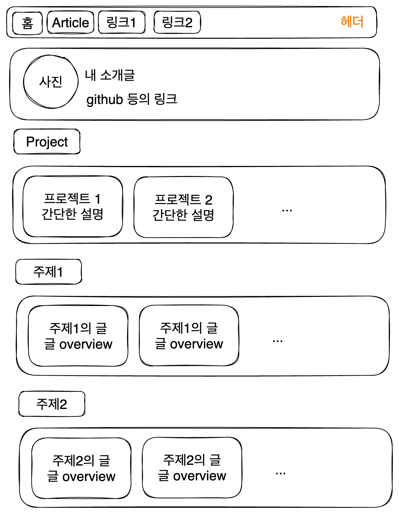
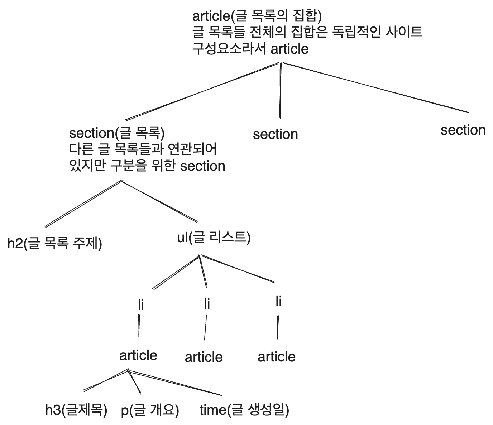
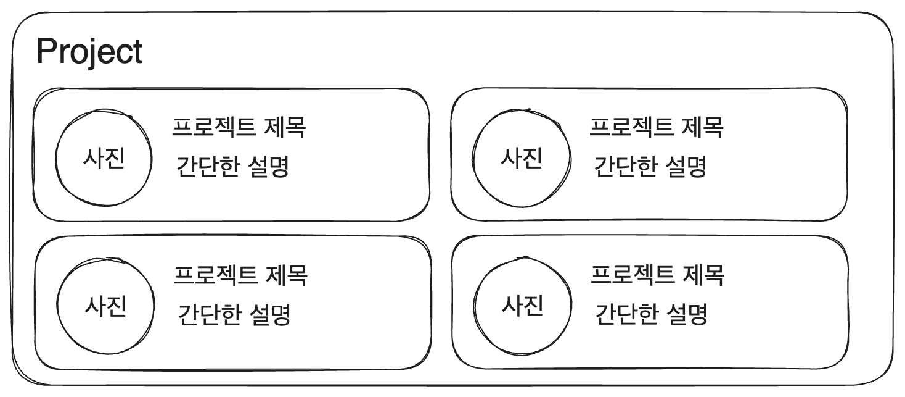

# 블로그 만들기 시리즈

|제목|링크|
|---|---|
|1. 기본 세팅|[https://witch.work/posts/blog-remake-1](https://witch.work/posts/blog-remake-1)|
|2. 메인 페이지의 HTML 설계|[https://witch.work/posts/blog-remake-2](https://witch.work/posts/blog-remake-2)|
|3. 글 상세 페이지의 구조 설계|[https://witch.work/posts/blog-remake-3](https://witch.work/posts/blog-remake-3)|
|4. 이미지를 상대 경로로 쓸 수 있도록 하기|[https://witch.work/posts/blog-remake-1](https://witch.work/posts/blog-remake-4)|
|5. 자잘한 페이지 구성 개선과 배포|[https://witch.work/posts/blog-remake-5](https://witch.work/posts/blog-remake-5)|
|6. 페이지 요소의 배치 설계|[https://witch.work/posts/blog-remake-6](https://witch.work/posts/blog-remake-6)|
|7. 메인 페이지 컴포넌트 디자인|[https://witch.work/posts/blog-remake-7](https://witch.work/posts/blog-remake-7)|
|8. 글 목록/내용 페이지 컴포넌트 디자인|[https://witch.work/posts/blog-remake-8](https://witch.work/posts/blog-remake-8)|
|9. 글 썸네일 자동 생성하기|[https://witch.work/posts/blog-remake-9](https://witch.work/posts/blog-remake-9)|
|10. 폰트, 카드 디자인 등의 디자인 개선|[https://witch.work/posts/blog-remake-10](https://witch.work/posts/blog-remake-10)|
|11. 글에 조회수 달기|[https://witch.work/posts/blog-remake-11](https://witch.work/posts/blog-remake-11)|
|12. 페이지 테마와 글 검색 기능|[https://witch.work/posts/blog-remake-12](https://witch.work/posts/blog-remake-12)|
|13. 테마 아이콘과 썸네일 레이아웃 개선 등|[https://witch.work/posts/blog-remake-13](https://witch.work/posts/blog-remake-13)|
|14. 글 분류를 태그 기반으로 변경|[https://witch.work/posts/blog-remake-14](https://witch.work/posts/blog-remake-14)|
|메인 페이지의 연산 최적화|[https://witch.work/posts/blog-opt-1](https://witch.work/posts/blog-opt-1)|
|글 목록 페이지네이션 만들기|[https://witch.work/posts/blog-opt-2](https://witch.work/posts/blog-opt-2)|
|이미지를 CDN에 올리고 placeholder 만들기|[https://witch.work/posts/blog-opt-3](https://witch.work/posts/blog-opt-3)|
|검색 페이지에 무한 스크롤 구현하기|[https://witch.work/posts/blog-opt-4](https://witch.work/posts/blog-opt-4)|

# 0. 개요

이번에는 블로그 메인 페이지의 기본적인 HTML 구조를 잡아 보자. 다른 페이지들의 레이아웃은 일단 메인 페이지를 통해서 블로그의 기본적인 기능들을 모두 구현한 후 할 것이다.

앞서 생각했던 메인 페이지 레이아웃은 다음과 같다.



위에 있는 레이아웃을 보고 필요한 컴포넌트를 만들어보자. 지금 보기에 필요한 컴포넌트는 헤더, 푸터, 내 소개, 글 목록을 좀 보여주는 컴포넌트, 그리고 프로젝트 목록을 보여줄 컴포넌트 정도인 것 같다.

스타일링은 아직 고려하지 말고 기초공사만 해보자. 컴포넌트를 위해 `src/components` 폴더 생성. 우리의(나의) 목표는 시맨틱하게 잘 짜인 페이지를 만드는 것이다. 여기에 주의하여 컴포넌트를 짰다.

# 1. Header 컴포넌트

`src/components/header` 폴더를 만들고 `index.tsx`를 만들어 준다. 내 블로그 헤더에 들어갈 건 기본적인 내비게이션 바이기 때문에 다음과 같은 구조면 될 것 같다.

```tsx
function Header() {
  return <header>
    <nav>
      <button>홈</button>
      <button>Front</button>
      <button>주제1</button>
    </nav>
  </header>;
}
```

하지만 내비게이션 바에 들어갈 메뉴가 더 많아질 수도 있고, 링크도 더 생길 수 있기 때문에 props를 이용하도록 바꿔보자.

```tsx
import Link from 'next/link';

interface PropsItem{
  title: string;
  url: string;
}

function Header({
  navList
}: {
  navList: PropsItem[];
}) {
  return (
    <header>
      <nav>
        {
          navList.map((item) => {
            return <button key={item.title}>
              <Link href={item.url} aria-label={item.title}>
                {item.title}
              </Link>
            </button>;
          })
        }
      </nav>
    </header>
  );
}

export default Header;
```

이를 index.tsx에 넣고 적절한 `navList` 변수를 생성하여 props로 넘기는 방식으로 한번 잘 되는지 체크해 볼 수 있다. 나머지 컴포넌트들도 마찬가지로 `src/pages/index.tsx`에 넣어서 잘 되는지 확인하는 방식으로 컴포넌트를 짰다.

# 2. Footer 컴포넌트

사실 Footer에는 별로 넣을 게 없다. 내 이름이나 넣자. 그런데 내 이름 같은 건 많이 쓰일 테니 먼저 `blog-config.ts` 파일을 만들어서 내 정보를 좀 넣어 놓도록 하자.

그리고 내가 쓸 프로필 사진은 `/public`에 넣어준다. 아래에 보면 picture 항목에 `/witch.jpeg`이라고 되어 있는데, 이는 내가 넣어 놓은 프로필 사진인 `/public/witch.jpeg`을 의미한다.

```ts
// /blog-config.ts
interface BlogConfigType {
  name: string;
  title: string;
  description: string;
  picture: string;
  url: string;
  social: {
    github: string;
  }
}

const blogConfig: BlogConfigType = {
  name:'김성현(Sung Hyun Kim)',
  title:'Witch-Work',
  description:
    '서강대학교에서 기계공학과 컴퓨터공학을 복수전공하였습니다. ' +
    '흔히 `마녀`라는 닉네임을 씁니다. ' +
    '어떤 대단한 뜻을 품고 사는 사람은 아닙니다. ' +
    '그저 멋진 사람들이 내는 빛을 따라가다 보니 여기까지 왔고, ' +
    '앞으로도 그렇게 살 수 있었으면 좋겠다고 생각하는 사람입니다. ' +
    '이곳에 찾아오신 당신과도 함께할 수 있어 영광입니다.',
  picture:'/witch.jpeg',
  url:'https://witch.work/',
  social: {
    github: 'witch-factory'
  }
};

export default blogConfig;
```

이제 푸터에 내 이름을 넣어보자. 이때 절대 경로를 사용하기 위해 루트의 `tsconfig.json`의 `compilerOptions`에  `"baseUrl": "."`을 추가해 주자. 꼭 해야 하는 건 아니지만 편하니까..

```tsx
// src/components/footer/index.tsx
import blogConfig from 'blog-config';

function Footer() {
  return (
    <footer>
    © {blogConfig.name}, Built with NextJS, 2023
    </footer>
  );
}

export default Footer;
```

# 3. 자기소개 컴포넌트

이제 내 소개를 담을 컴포넌트를 만들어 보자. 사진과 내 소개글, 링크를 담을 것이다. 아까 `blog-config.ts`를 만든 사실상의 주 목적이라고 할 수 있겠다.

`src/components/profile` 폴더를 생성한다. 그리고 `index.tsx`를 만들어 준다. 독립적으로 존재할 수 있는 부분이라고 생각하여 article 태그를 사용하였다.

```tsx
// src/components/profile/index.tsx
import blogConfig from 'blog-config';
import Image from 'next/image';
import Link from 'next/link';

function Profile() {
  return (
    <article>
      <Image src={blogConfig.picture} alt={`${blogConfig.name} 프로필사진`} width={100} height={100} />
      <h2>{blogConfig.name}</h2>
      <p>{blogConfig.description}</p>
      <ul>
        <li>
          <Link href={`https://github.com/${blogConfig.social.github}`} target='_blank'>
            Github
          </Link>
        </li>
      </ul>
    </article>
  );
}

export default Profile;
```

# 4. 글 카테고리 컴포넌트

블로그의 메인 페이지에는 글 주제별로 몇 개의 글을 미리보기 형태로 카드 형식으로 보여주고 싶다. 이렇게 주제별로 몇 개의 글을 보여주는 컴포넌트를 글 카테고리 컴포넌트라고 하겠다.

이 컴포넌트는 어떤 모습이 되어야 할까? 재사용을 위해서 어떤 부분을 props로 받아야 할지 생각해 보자.

어떤 주제의 카테고리인지 정보가 있어야 하기 때문에 먼저 글 주제를 props로 받아야 한다. 그리고 그 주제와 연관해서 렌더링할 글 목록을 받아야 한다. 그럼 글 카테고리에서 보여주는 각 글 미리보기(?)에는 어떤 정보가 담겨 있을까?

추후에 추가될 수도 있겠지만(특히 조회수를 추가하고 싶다)일단 여기서 보여줄 것은 글 제목, 글에 대한 간단한 설명, 글 생성일이 있어야 할 거라고 생각한다. 블로그 글은 md파일에 담길 것이기 때문에 md 파일의 메타데이터에 담길 내용들이기도 하다. 따라서 이런 구조로 HTML을 짜면 될 듯 하다.


메타데이터에는 태그도 있어야 한다고 생각하지만, 이를 굳이 글의 미리보기에서 보여줄 필요는 없다고 생각한다. 그래서 여기에서는 고려하지 않을 것이다. 이후에 props 구조를 설계하면서 type에 추가될 수는 있겠지만.

이에 따라서 ArticleCategory 컴포넌트를 만들어 보자. HTML 구조는 다음과 같이 생각한다.



## 4.1. 글 카드 컴포넌트

일단 글 개요를 보여주는 카드와 같은 컴포넌트를 만들어 보자. 언젠가 이런 카드를 재사용할 일이 있을 거라 생각하고 좀 일반적인 이름으로`components/card/index.tsx`를 만들어 주자.

이 컴포넌트는 article 태그를 사용할 것이다. 블로그 글 목록에서 개별 글(즉 blog entry)을 나타내는 컴포넌트로 article 태그를 사용하는 건 [MDN의 article 문서](https://developer.mozilla.org/en-US/docs/Web/HTML/Element/article)에서 제시하는 것과 정확히 일치하기 때문이다.

props의 url은 해당 카드를 눌렀을 때 어디로 갈지에 대한 링크이다.

```tsx
// src/components/card/index.tsx
import Link from 'next/link';

interface Props{
  title: string;
  description: string;
  date: string;
  url: string;
}

function Card(props: Props) {
  const { title, description, date, url } = props;
  return (
    <article>
      <Link href={url}>
        <h3>{title}</h3>
        <p>{description}</p>
        <time>{date}</time>
      </Link>
    </article>
  );
}

export default Card;
```

## 4.2. 글 카테고리 컴포넌트

위에서 설계한 그대로 글 카테고리 컴포넌트도 만들어 주자. 어차피 카드를 묶어 주는 기능이기 때문에 이것도 언젠가 재사용을 대비하여 일반적인 이름의 category로 만들어 준다.

```tsx
import Card from '../card';

interface CardProps{
  title: string;
  description: string;
  date: string;
  url: string;
}

interface Props{
  title: string;
  items: CardProps[];
}

function Category(props: Props) {
  return (
    <section>
      <h2>{props.title}</h2>
      <ul>
        {
          props.items.map((item, index) => {
            return (
              <li key={index}>
                <Card title={item.title} description={item.description} date={item.date} url={item.url} />
              </li>
            );
          })
        }
      </ul>
    </section>
  );
}

export default Category;
```

# 5. 프로젝트 소개 컴포넌트

나는 내가 한 프로젝트 소개도 블로그에 넣고 싶다. 물론 아직은 별로 넣을 게 없지만 뭐, 채워 나갈 것이다! 아무튼 프로젝트 소개 컴포넌트를 다시 생각해 보면, 이런 모습이 되면 좋겠다고 생각한다.



이를 위해서 일단 Card 컴포넌트가 이미지를 표시할 수 있도록 하고, 이를 적절히 수용하도록 Category 컴포넌트를 만들어 보자.

## 5.1. Card 컴포넌트 개선

넣을 이미지의 URL을 props로 받을 수 있도록 하고 image url이 주어졌을 경우에만 렌더링하도록 하면 된다. 스타일링을 할 때의 고난이 눈에 보이는 것 같지만 일단 구조만 잡도록 하자.

```tsx
import Image from 'next/image';
import Link from 'next/link';

interface Props{
  title: string;
  description: string;
  image?: string;
  date: string;
  url: string;
}

function Card(props: Props) {
  const { title, description, image, date, url } = props;
  return (
    <article>
      <Link href={url}>
        {
          image ? <Image src={image} alt={`${title} 사진`} width={50} height={50} /> : null
        }
        <h3>{title}</h3>
        <p>{description}</p>
        <time>{date}</time>
      </Link>
    </article>
  );
}

export default Card;
```

Props에 image가 있을 수도 있고 없을 수도 있기 때문에 `image?: string`으로 표시하였다. image 여부에 따라 Image 컴포넌트를 렌더링하도록 한 것 외에 다른 변경사항은 없다.

## 5.2. Category 컴포넌트 개선

역시 image를 받을 수 있도록 한 것 외에 변경사항은 없다.

```tsx
import Card from 'src/components/card';

interface CardProps{
  title: string;
  description: string;
  // 추가 부분
  image?: string;
  date: string;
  url: string;
}

interface Props{
  title: string;
  items: CardProps[];
}

function Category(props: Props) {
  return (
    <section>
      <h2>{props.title}</h2>
      <ul>
        {
          props.items.map((item, index) => {
            return (
              <li key={index}>
                <Card 
                  title={item.title} 
                  description={item.description} 
                  // 추가 부분
                  image={item.image}
                  date={item.date} 
                  url={item.url} 
                />
              </li>
            );
          })
        }
      </ul>
    </section>
  );
}

export default Category;
```

# 6. 메타데이터 지정

이제 페이지의 메타데이터, 그러니까 일반적으로는 head 태그(NextJS에서는 Head)를 사용하여 지정하는 것들을 지정해 보려고 한다. 나중에 SEO를 하면서 열심히 메타데이터를 다듬을 예정이기 때문에 간단한 것만 하겠다.

제목과 설명 메타데이터를 `blog-config.ts`에서 따와서 지정하고, favicon을 만들었다. 난 [favicon.ico](https://favicon.io/favicon-generator/)에서 텍스트를 favicon으로 만들어 주길래 그냥 단순하게 `마녀`라고 쓴 favicon을 넣어 보았다.


제목, favicon, 캐노니컬 데이터 등을 넣은 Head 태그는 다음과 같아진다.

```tsx
<Head>
  <title>{blogConfig.title}</title>
  <meta name='description' content={blogConfig.description} />
  <meta name='viewport' content='width=device-width, initial-scale=1' />
  <link rel='apple-touch-icon' sizes='180x180' href='/apple-touch-icon.png' />
  <link rel='icon' type='image/png' sizes='32x32' href='/favicon-32x32.png' />
  <link rel='icon' type='image/png' sizes='16x16' href='/favicon-16x16.png' />
  <link rel='manifest' href='/site.webmanifest' />
  <link rel='canonical' href='https://witch.work/' />
</Head>
```

# 7. HTML 공사결과

메인 페이지는 대강 다음과 같은 구조로 짜일 것이다. 물론 다른 페이지와 공통되는 구조를 밖으로 빼고, 또 CSS 등을 짜면서 더 많은 변경이 있겠지만 이렇게 시맨틱한 구조를 지키기 위해서 최선을 다할 것이다.

```tsx
<main>
  <Header navList={navList}/>
  <Profile />
  <h1>Welcome to My blog</h1>
  {/* 프로젝트 목록은 독립적으로 존재 */}
  <article>
    <Category title={projectList.title} items={projectList.items} />
  </article>
  {/* 글 목록은 독립적인 영역으로 존재 */}
  <article>
    <Category title={postList.title} items={postList.items} />
    <Category title={postList.title} items={postList.items} />
  </article>
  <Footer />
</main>
```

이런 구조를 지키며 CSS를 짜나갈 생각을 하니 벌써부터 머리가 터져나갈 것 같이 신이 난다! 하지만 다행히(?) 아직 할 게 남았다. 블로그에 글을 쓰면 정적으로 페이지가 생성되도록 해야 한다. 즉 프리렌더링을 짜야 한다. 이거부터 하고 스타일링을 하도록 하자.

# 참고

내가 원하는 카드 컴포넌트에는 article이 적절하다. https://stackoverflow.com/questions/43953026/element-for-a-card-card-container-in-html5

검색 달기 https://medium.com/frontendweb/build-the-search-functionality-in-a-static-blog-with-next-js-and-markdown-33ebc5a2214e