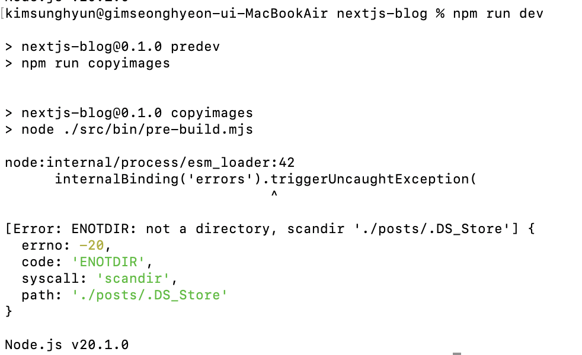
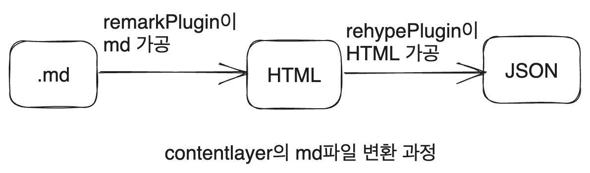

# 블로그 만들기 시리즈

|제목|링크|
|---|---|
|1. 기본 세팅|[https://witch.work/posts/blog-remake-1](https://witch.work/posts/blog-remake-1)|
|2. 메인 페이지의 HTML 설계|[https://witch.work/posts/blog-remake-2](https://witch.work/posts/blog-remake-2)|
|3. 글 상세 페이지의 구조 설계|[https://witch.work/posts/blog-remake-3](https://witch.work/posts/blog-remake-3)|
|4. 이미지를 상대 경로로 쓸 수 있도록 하기|[https://witch.work/posts/blog-remake-1](https://witch.work/posts/blog-remake-4)|
|5. 자잘한 페이지 구성 개선과 배포|[https://witch.work/posts/blog-remake-5](https://witch.work/posts/blog-remake-5)|
|6. 페이지 요소의 배치 설계|[https://witch.work/posts/blog-remake-6](https://witch.work/posts/blog-remake-6)|
|7. 메인 페이지 컴포넌트 디자인|[https://witch.work/posts/blog-remake-7](https://witch.work/posts/blog-remake-7)|
|8. 글 목록/내용 페이지 컴포넌트 디자인|[https://witch.work/posts/blog-remake-8](https://witch.work/posts/blog-remake-8)|
|9. 글 썸네일 자동 생성하기|[https://witch.work/posts/blog-remake-9](https://witch.work/posts/blog-remake-9)|
|10. 폰트, 카드 디자인 등의 디자인 개선|[https://witch.work/posts/blog-remake-10](https://witch.work/posts/blog-remake-10)|
|11. 글에 조회수 달기|[https://witch.work/posts/blog-remake-11](https://witch.work/posts/blog-remake-11)|
|12. 페이지 테마와 글 검색 기능|[https://witch.work/posts/blog-remake-12](https://witch.work/posts/blog-remake-12)|
|13. 테마 아이콘과 썸네일 레이아웃 개선 등|[https://witch.work/posts/blog-remake-13](https://witch.work/posts/blog-remake-13)|
|14. 글 분류를 태그 기반으로 변경|[https://witch.work/posts/blog-remake-14](https://witch.work/posts/blog-remake-14)|
|메인 페이지의 연산 최적화|[https://witch.work/posts/blog-opt-1](https://witch.work/posts/blog-opt-1)|
|글 목록 페이지네이션 만들기|[https://witch.work/posts/blog-opt-2](https://witch.work/posts/blog-opt-2)|
|이미지를 CDN에 올리고 placeholder 만들기|[https://witch.work/posts/blog-opt-3](https://witch.work/posts/blog-opt-3)|
|검색 페이지에 무한 스크롤 구현하기|[https://witch.work/posts/blog-opt-4](https://witch.work/posts/blog-opt-4)|

# 1. 문제 발생

앞서 만들었던 블로그는 글을 올릴 수 있으니 블로그 꼴은 갖췄다고 할 수 있겠지만, 아직 문제가 있다.

지금 블로그의 각 글들은 `/posts/글의 slug/index.md`라는 이름의 폴더에 저장되어 있다. 그런데 이 글에 이미지를 넣고 싶으면 어떻게 해야 할까? 나는 글과 같은 폴더에 글에 들어있는 이미지도 넣어두는 게 좋다고 생각한다. 그게 `` 와 같이 상대 경로로 불러오기 편하니까.

문제는 이렇게 하면 이미지가 로드되지 않는다는 것이다. NextJS는 `/public`에 들어 있는 정적 리소스(이미지 등)만 빌드타임에 사용할 수 있기 때문이다. 따라서 빌드타임에는 `/posts`내부의 이미지가 인식되지 않아서 이미지를 불러올 수 없는 것이다.

하지만 블로그에 글을 쓸 때마다 `/posts`폴더에서 글을 쓰다가 이미지에 필요해지면 `/public`폴더로 이미지를 옮기는 건 너무 한심해 보인다. 또 내가 기존 블로그에 쓴 글들도 바뀐 블로그로 옮겨야 하는데 그 몇십 개 글들의 이미지를 다 옮기고 경로 변경 하는 것도 큰일이다. 따라서 블로그 글과 같은 폴더의 이미지를 사용할 수 있도록 하는 방법을 고민하고 찾았다.

역시 이미 이를 해결해 놓은 [사람의 블로그](https://www.codeconcisely.com/posts/nextjs-relative-image-paths-in-markdown/)가 있었기에 이를 참고하여 내 블로그에 맞게 사용하였다.

여기서 해결한 방법은 다음과 같다.

1. 빌드 시 /posts 폴더의 글을 /public으로 옮기는 스크립트 짜기
2. 상대 경로를 절대 경로로 인식할 수 있도록 하기

# 2. 빌드 시에 이미지를 public으로 옮기기

해결 방법은 pre-build 스크립트를 짜서 빌드 시마다 `/posts` 폴더의 사진들을 `/public`으로 옮기는 것이다. 이를 위해 `fs-extra`라는 라이브러리를 사용했다.

먼저 파일을 다루는 확장 함수 사용을 위해 `fs-extra`를 설치한다. 현재 기준으로 59.5KB이므로 그렇게 부담되는 크기는 아니다.

```
npm i fs-extra
```

그다음 `src/bin/pre-build.mjs`라는 파일을 만든다(어차피 prebuild 스크립트 실행시 경로를 지정해 주면 되기 때문에 경로는 크게 상관은 없다). 

`.mjs`를 쓰는 이유는 모듈과 최상단 await을 쓰기 위해서이다.

그럼 이제 우리가 해야 하는 건?

1. 빌드 시 기존에 `/public`에 있던 블로그 포스트 이미지들 모두 삭제
2. `/posts` 폴더의 모든 글 이미지를 `/public`으로 옮기기

물론 업데이트만 반영할 수도 있겠지만 정적 사이트 생성기에서 굳이 그렇게 할 건 없을 것 같다.

## 2.1. 기존 public 폴더 청소

일단 블로그 글 이미지들을 담기 위해 `/public/images` 폴더 생성. 그리고 `src/bin/pre-build.mjs`에 다음 스크립트를 작성한다.

```js
import fsExtra from 'fs-extra';

// 이미지를 넣을 디렉토리
const imageDir='./public/images/posts';

await fsExtra.emptyDir(imageDir);
```

말 그대로, imageDir을 비우는 스크립트다.

## 2.2. 이미지 복사

서로 다른 블로그 글 간에 제목이 같은 이미지가 있을 수 있으므로, 각각에 대한 폴더를 따로 생성해 줘야 한다.

먼저 sourceDir에 있는 이미지들을 targetDir로 옮기는 함수를 정의한다.

```js
async function copyImage(sourceDir, targetDir, images) {
  for (const image of images) {
    const sourcePath = `${sourceDir}/${image}`;
    const targetPath = `${targetDir}/${image}`;
    await fsPromises.copyFile(sourcePath, targetPath);
  }
}
```

그리고 이제 글들이 담긴 폴더인 postDir을 정의한다,

```js
// 포스트 디렉토리
const postDir='./posts';
```

posts 폴더 내에는 카테고리별로 폴더가 있고 그 카테고리 폴더들에는 글들마다의 폴더가 있다. 그것들을 모두 순회하면서 이미지를 복사해 주자.

```js
const imageFileExtensions=['.png', '.jpg', '.jpeg', '.gif'];

async function copyPostDirImages() {
  // posts 폴더 내의 카테고리들. cs, front...
  let postCategories = (await fsPromises.readdir(postDir));

  for (const category of postCategories) {
    // 카테고리 내의 포스트 폴더들 읽어오기
    const posts = await fsPromises.readdir(`${postDir}/${category}`);

    for (const post of posts) {
      // 글 폴더 내의 파일들
      const postFiles = await fsPromises.readdir(`${postDir}/${category}/${post}`);
      // 이미지 확장자를 가진 것만 골라낸다
      const postImages=postFiles.filter((file) => imageFileExtensions.includes(path.extname(file)));

      if (postImages.length) {
        // 폴더 생성
        await fsPromises.mkdir(`${imageDir}/${category}/${post}`, { recursive: true });
        await copyImage(`${postDir}/${category}/${post}`, `${imageDir}/${category}/${post}`, postImages);
      }
    }
  }
}
```

이제 이걸 await으로 실행하면 되겠는걸?

```js
await fsExtra.emptyDir(imageDir);
await copyPostDirImages();
```

그리고 이 스크립트를 package.json을 통해서 빌드나 dev 모드 실행 이전에 실행하도록 하면 되겠는걸?

```json
{
  //...
  "scripts": {
    /* 우리가 짠 스크립트를 실행하는 copyimages 커맨드를 추가하고
     pre- 접두사를 통해 build와 dev 이전에 실행되도록 한다. */
    "copyimages":"node ./src/bin/pre-build.mjs",
    "prebuild": "npm run copyimages",
    "predev": "npm run copyimages",
    "dev": "next dev",
    "build": "next build",
    "start": "next start",
    "lint": "next lint"
  },
  //...
}
```

자 이제 `npm run dev`!



역시 처음부터 잘되는 일은 없다.

## 2.3. 이미지 복사 문제 해결

에러 메시지를 보면 `./posts/.DS_Store`는 디렉토리가 아닌데 디렉토리 스캔을 하려고 해서 발생하는 에러인 것 같다. `.DS_Store`는 MacOS에서 파일의 인덱싱 최적화를 위해서 자동 생성하는 파일로 알고 있다. 아무튼 알아서 생기는 파일이다.

해당 파일을 그냥 순회에서 무시하는 걸로 해결할 수도 있겠지만, 각 카테고리 폴더나 글 폴더의 리스트를 만들 때 `readdir`만 쓰는 것이 아니라 리스트 중 디렉토리인 것만 골라내도록 하자.

이를 위해서는 fs에서 제공하는 `isDirectory` 함수가 있다. 이렇게 한번 써볼까?

```js
let postCategories = (await fsPromises.readdir(postDir));
// 디렉토리만 따지도록 변경
postCategories=postCategories.filter(category=>category.isDirectory());
```

이렇게 하면 isDirectory가 function이 아니라는 에러가 뜬다. 현재 readdir은 인수로 받은 디렉토리 내의 파일명들을 문자열로만 반환하기 때문이다. `/posts` 폴더를 스캔한다면 [`DS_Store`, `cs`, `front`, `misc`]가 나오는 것이다. 문자열에는 당연히 isDirectory 메서드가 없으니까 에러가 뜬다.

따라서 우리는 readdir을 할 때 파일의 정보까지 알아오도록 해야 한다. 이를 위해서 readdir의 options 인수에 `withFileTypes: true`를 넣어주자. 그러면 readdir이 파일명 뿐만 아니라 파일의 정보까지 들어있는 `fs.Dirent` 객체를 얻어온다.

```js
// posts 폴더 내의 카테고리들. cs, front...
let postCategories = (await fsPromises.readdir(postDir), {withFileTypes:true});
// 디렉토리만 따지도록 변경
postCategories=postCategories.filter(category=>category.isDirectory());
```

이제 주의해야 할 것은 `postCategories`에서 폴더의 이름을 얻어오려면 원소에 바로 접근하는 게 아니라 배열의 원소인 `fs.Dirent`의 name 프로퍼티에 접근해야 한다는 것이다. 따라서 다음과 같이 짠다.

```js
async function copyPostDirImages() {
  // posts 폴더 내의 카테고리들. cs, front...
  let postCategories = (await fsPromises.readdir(postDir, {withFileTypes:true}));
  // 디렉토리만 따지도록 변경
  postCategories=postCategories.filter(category=>category.isDirectory());

  for (const _category of postCategories) {
    // 카테고리 내의 포스트 폴더들 읽어오기
    const category=_category.name;
    let posts = await fsPromises.readdir(`${postDir}/${category}`, {withFileTypes:true});
    // 디렉토리만 따지도록 변경
    posts=posts.filter(post=>post.isDirectory());

    for (const _post of posts) {
      const post=_post.name;
      // 글 폴더 내의 파일들
      const postFiles = await fsPromises.readdir(`${postDir}/${category}/${post}`);
      // 이미지 확장자를 가진 것만 골라낸다
      const postImages=postFiles.filter((file) => imageFileExtensions.includes(path.extname(file)));

      if (postImages.length) {
        // 폴더 생성
        await fsPromises.mkdir(`${imageDir}/${category}/${post}`, { recursive: true });
        await copyImage(`${postDir}/${category}/${post}`, `${imageDir}/${category}/${post}`, postImages);
      }
    }
  }
}
```

반복되는 부분을 적당히 함수로 빼서 정리해 보면 이렇게 된다.

```js
const imageFileExtensions=['.png', '.jpg', '.jpeg', '.gif'];

async function getInnerDirectories(dir) {
  const files = await fsPromises.readdir(dir, {withFileTypes:true});
  return files.filter(file=>file.isDirectory());
}

async function getInnerImages(dir) {
  const files=await fsPromises.readdir(dir);
  return files.filter((file) => imageFileExtensions.includes(path.extname(file)));
}

async function copyPostDirImages() {
  // posts 폴더 내의 카테고리들. cs, front...
  const postCategories = await getInnerDirectories(postDir);

  for (const _category of postCategories) {
    // 카테고리 내의 포스트 폴더들 읽어오기
    const category=_category.name;
    const posts=await getInnerDirectories(`${postDir}/${category}`);

    for (const _post of posts) {
      const post=_post.name;
      const postImages=await getInnerImages(`${postDir}/${category}/${post}`);

      if (postImages.length) {
        // 폴더 생성
        await fsPromises.mkdir(`${imageDir}/${category}/${post}`, { recursive: true });
        await copyImage(`${postDir}/${category}/${post}`, `${imageDir}/${category}/${post}`, postImages);
      }
    }
  }
}
```

# 3. 상대 경로를 절대 경로로 인식할 수 있도록 하기

위의 작업을 완료하였다면, `/posts/cs/os-1`폴더에 글을 쓰고 같은 경로에 이미지를 넣고 빌드하면 `/images/posts/cs/os-1/`라는 경로를 통해서 이미지를 쓸 수 있을 것이다. 만약 위의 `pre-build.mjs`파일의 `imageDir`을 좀 만져줬다면 `/posts/cs/os-1`을 통한 접근도 가능하다.

하지만 블로그에 글 쓰면서 이미지를 넣을 때 저따위의 이미지 절대경로를 설정해 주고 싶은 사람은 거의 없을 것이다. 따라서 이를 상대 경로로 바꿔주는 작업을 해주자. [이곳](https://www.codeconcisely.com/posts/nextjs-relative-image-paths-in-markdown/)을 참고해서 내 블로그에 맞게 수정했다.

## 3.1. 방법 설계

앞서 말했듯이 NextJS는 `/public`에 있는 정적 리소스만 빌드타임에 사용할 수 있다. 그래서 우리는 앞서 `/posts`폴더에 있는 사진들을 빌드 시에 `/public`으로 적절히 옮겨 주었다. 

그럼 마크다운(여기서 마크다운이란 md, mdx 파일을 모두 이른다)에서 이미지를 상대 경로로 불러올 수 있도록 하기 위해서는 어떻게 해야 할까?

마크다운 파일은 현재 contentlayer를 통해 HTML 혹은 코드로 변환되는데 이 과정에서 이미지 출처에 명시된 상대 경로를 절대 경로로 바꿔주는 작업을 추가하면 된다. 

contentlayer에서는 markdown을 다루는 데에 remark 플러그인을 사용할 수 있도록 하므로 remark 플러그인을 사용하자.



또한 우리는 md 문서에서 이미지들을 찾아야 하는데, remark에서는 md파일을 JSON object 형식으로 쓰인 AST로 바꿔 주는 기능을 제공하기에 우리의 목적에 매우 잘 부합한다고 하겠다.

> 마크다운을 HTML로 변환하는 기능만 필요하다면 micromark를 쓰는 게 좋다. remark또한 그걸 할 수 있지만 remark는 그것보다는 AST(Abstract Syntax Tree)를 만들고 그걸 변환하기 위핸 플러그인을 제공하는 데에 초점이 맞춰져 있다. (remark github README에서 발췌)

따라서 우리는 remark 플러그인을 만들어서 contentlayer에 적용하면 된다.

## 3.2. remark 플러그인 만들기

`/src/plugins/change-image-src.mjs`파일 생성. ES 모듈을 쓰기 위해 mjs혹은 ts 파일을 써야 한다. 그러나 ts를 쓰려면 우리는 마크다운 AST의 type을 사용해야 하는데 이런 작업에 그렇게까지 하는 건 낭비라고 생각했다. 따라서 mjs를 쓰기로 했다.

이 파일에선, 최종적으로 글에 들어간 이미지들을 찾아서 src 프로퍼티에 있는 상대 경로들을 몽땅 절대 경로로 바꿔 주는 플러그인을 짜면 된다. 그럼 뭐부터 해야 할까? 플러그인 꼴부터 갖춰야 한다.

그러니 먼저 remark 플러그인의 포맷부터 잡아 보자. remark 플러그인 함수는 tree, file을 인수로 받는 함수를 리턴해야 한다. tree는 mdast이고 file은 contentlayer에서 제공하는 파일 정보를 담고 있는 객체다. 이 file인수를 통해서 우리는 파일의 경로를 알 수 있게 된다.

```js
// src/plugins/change-image-src.mjs
export default function changeImageSrc() {
  return function(tree, file) {
    // tree, file을 가지고 뭔가 해보는 코드
  };
}
```

우리가 md파일을 변환한 AST는 여기서 리턴한 함수를 거칠 것이다. 그럼 이 함수에선 뭘 해야 할까? 트리를 순회하면서 이미지를 찾고 src 프로퍼티를 모두 절대 경로로 바꿔주면 된다.

먼저 순회 같은 경우, remark에서 사용하는 신택스 트리는 [mdast](https://github.com/syntax-tree/mdast)에 정의되어 있다. 이 트리를 통해서 우리는 노드들을 순회할 수 있다. 또한 이런 신택스 트리 포맷은 [Unist(Universal Syntax Tree)](https://github.com/syntax-tree/unist)를 통해서 정의되는데, 이들을 순회하기 위한 유틸리티 라이브러리로 [unist-util-visit](https://github.com/syntax-tree/unist-util-visit)이 나와 있다. 따라서 이를 설치하자.

```
npm install unist-util-visit
```

이 라이브러리의 `visit(tree[, test], visitor[, reverse])`을 이용하면 preorder의 depth-first-search를 하면서 각 노드에 대해 visitor 함수를 실행하여 HTML AST의 각 노드를 편집할 수 있다.

```js
export default function changeImageSrc() {
  return function(tree, file) {
    const filePath=file.data.rawDocumentData.flattenedPath;
    visit(tree, function() {});
  };
}
```

노드들을 순회하면서 이미지들을 어떻게 찾을까? contentlayer에서 HTML로 변환한 md 글들에 들어간 사진을 보면 전부 `p` 태그 내의 `img`태그로 들어가 있다. 이를 감지하면 된다. 먼저 visit 함수의 2번째 인수로 특정 노드의 type을 나타내는 문자열을 넣어 주면 해당 노드에 대해서만 visitor 함수를 실행하게 된다. [mdast](https://github.com/syntax-tree/mdast#paragraph)에 따르면 `p` 태그는 `paragraph`라는 type을 가지고 있다. 따라서 이를 넣어주자.

이렇게 찾은 `p`태그는 visitor 함수의 인수로 들어가게 되는데 거기서 해당 노드의 children 중 img태그를 찾아 url을 바꿔주자.

```js
const imageDirInPublic = 'images/posts';

export default function changeImageSrc() {
  return function(tree, file) {
    const filePath=file.data.rawDocumentData.flattenedPath;
    visit(tree, 'paragraph', function(node) {
      const image=node.children.find(child=>child.type==='image');

      if (image) {
        const fileName=image.url.replace('./', '');
        image.url=`/${imageDirInPublic}/${filePath}/${fileName}`;
      }
    });
  };
}
```

md파일이 변환된 트리가 들어오면->트리를 순회하면서 p태그 내에 있는 img 태그를 찾고->그런 게 있다면 해당 img 태그의 url을 바꿔주는 플러그인이 완성되었다.

### 3.2.1. 이미지 경로 새로 만들기에 대한 설명

```js
if (image) {
  const fileName=image.url.replace('./', '');
  image.url=`/${imageDirInPublic}/${filePath}/${fileName}`;
}
```

이 부분 얘기다.

이미지 경로를 만드는 부분에 대한 설명을 약간 들이면, 우리는 블로그에 있는 사진들을 `./A.png` 같은 상대 경로로 불러올 것이다.(단 모든 상대 경로를 포괄하는 것은 아니고, `../`같은 건 안된다. 그냥 블로그 글과 같은 경로에 있는 사진만 사용한다고 가정하자)

따라서 fileName은 기존 경로에서 `./`만 떼면 된다.

그리고 리턴하는 함수에서 받는 file인수는 contentlayer에서 변환한 것이기 때문에 file.data에는 `.contentlayer/generated`에 있는 변환 파일에 있던 정보들이 비슷하게 들어 있다. 따라서 `/posts`이하의 글 경로들을 받아오기 위해서는 `file.data.rawDocumentData.flattenedPath`를 사용하면 된다. 이게 바로 위에서 사용한 `filePath`이다.

또한 우리가 사용할 이미지들은 빌드 시점에 `/public/images/posts`에 들어 있으며, 변환된 글들은 `/posts`에 있지만 contentlayer에서 md 문서 변환 결과를 만들 때 `/posts`경로 내에 있는 것만 했으므로 `flattenedPath`에는 `/posts`가 없다.

따라서 우리가 file의 `flattenedPath`를 이용해서 이미지를 불러오기 위해서는 `/public`내의 이미지 경로를 알려주는 `imageDirInPublic`도 사용해야 한다. 그렇게 만들어진 게 위의 새로운 이미지 URL이다.

```js
image.url=`/${imageDirInPublic}/${filePath}/${fileName}`;
```

# 4. 실제 적용

이렇게 하고 나서 내 기존 블로그의 글들을 모두 옮긴 후 한번 빌드해 보았다. 문서들을 생성하는 데에 약 15초 정도가 걸린다. 세부적인 벤치마크를 해볼 수도 있겠지만, 지금 내 블로그 글이 140개 정도 있고 이미지를 다 합쳐 70메가쯤 있는데 그걸 빌드하는 데 15초 걸리는 게 그렇게 나쁘지는 않아 보인다. 언젠가 최적화할 일이 있을지도 모르지만.

그리고 빌드한 이후로는 public/images/posts에는 글들의 이미지들이 잘 들어가 있었다. 하지만 이 이미지들은 어차피 `/posts`에 들어 있을 텐데 이것까지 굳이 github에 올릴 이유는 없다. 그러니 해당 폴더를 `.gitignore`에 추가해 주자.

```
# .gitignore
/public/images/posts
/public/images/posts/*
```

그리고 다음 글에서는 대충하고 넘어갔던 작업들을 해보자. 가령 메인 페이지에서 지금은 그냥 임시로 만든 배열의 내용을 렌더링하고 있는데, 이를 제대로 글 목록을 불러와서 표시하게 하는 것과 전체 글 목록 페이지를 만드는 등의 작업들이다.

# 참고

나와 같은 고민을 한 사람이 이미 있었다. 그래서 그 사람이 만든 글을 참고했다. https://www.codeconcisely.com/posts/nextjs-storing-images-next-to-markdown/

remark 플러그인을 만들기 위해 remark github의 설명을 참고했다. https://github.com/remarkjs/remark

https://github.com/syntax-tree/mdast

https://github.com/syntax-tree/unist

https://swizec.com/blog/how-to-build-a-remark-plugin-to-supercharge-your-static-site/