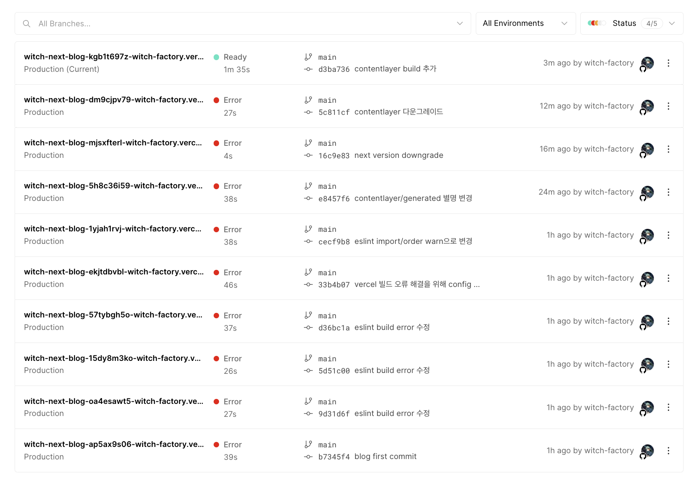

# 블로그 만들기 시리즈

|제목|링크|
|---|---|
|1. 기본 세팅|[https://witch.work/posts/blog-remake-1](https://witch.work/posts/blog-remake-1)|
|2. 메인 페이지의 HTML 설계|[https://witch.work/posts/blog-remake-2](https://witch.work/posts/blog-remake-2)|
|3. 글 상세 페이지의 구조 설계|[https://witch.work/posts/blog-remake-3](https://witch.work/posts/blog-remake-3)|
|4. 이미지를 상대 경로로 쓸 수 있도록 하기|[https://witch.work/posts/blog-remake-1](https://witch.work/posts/blog-remake-4)|
|5. 자잘한 페이지 구성 개선과 배포|[https://witch.work/posts/blog-remake-5](https://witch.work/posts/blog-remake-5)|
|6. 페이지 요소의 배치 설계|[https://witch.work/posts/blog-remake-6](https://witch.work/posts/blog-remake-6)|
|7. 메인 페이지 컴포넌트 디자인|[https://witch.work/posts/blog-remake-7](https://witch.work/posts/blog-remake-7)|
|8. 글 목록/내용 페이지 컴포넌트 디자인|[https://witch.work/posts/blog-remake-8](https://witch.work/posts/blog-remake-8)|
|9. 글 썸네일 자동 생성하기|[https://witch.work/posts/blog-remake-9](https://witch.work/posts/blog-remake-9)|
|10. 폰트, 카드 디자인 등의 디자인 개선|[https://witch.work/posts/blog-remake-10](https://witch.work/posts/blog-remake-10)|
|11. 글에 조회수 달기|[https://witch.work/posts/blog-remake-11](https://witch.work/posts/blog-remake-11)|
|12. 페이지 테마와 글 검색 기능|[https://witch.work/posts/blog-remake-12](https://witch.work/posts/blog-remake-12)|
|13. 테마 아이콘과 썸네일 레이아웃 개선 등|[https://witch.work/posts/blog-remake-13](https://witch.work/posts/blog-remake-13)|
|14. 글 분류를 태그 기반으로 변경|[https://witch.work/posts/blog-remake-14](https://witch.work/posts/blog-remake-14)|
|메인 페이지의 연산 최적화|[https://witch.work/posts/blog-opt-1](https://witch.work/posts/blog-opt-1)|
|글 목록 페이지네이션 만들기|[https://witch.work/posts/blog-opt-2](https://witch.work/posts/blog-opt-2)|
|이미지를 CDN에 올리고 placeholder 만들기|[https://witch.work/posts/blog-opt-3](https://witch.work/posts/blog-opt-3)|
|검색 페이지에 무한 스크롤 구현하기|[https://witch.work/posts/blog-opt-4](https://witch.work/posts/blog-opt-4)|

페이지를 꾸며보기 전에 남은 작업이 무엇이 있는가? 물론 조회수 달기나 댓글 기능, 태그를 통한 글 목록 필터링 등 구현하고 싶은 목록은 하고 많다. 

하지만 당장 블로그 꼴을 갖추는 데에 필요한 자잘한 작업들, 메인 페이지에서 실제 글 목록을 표시해 주도록 하는 것, 헤더 변경, 간단한 자기소개 페이지 등을 만들어 보고 페이지를 한번 vercel로 배포해 보자. 잘 되는지는 봐야지.

# 1. 메인 페이지의 목록

글 목록에 너무 많은 기를 쏟았기에 벌써 메인 페이지를 어떻게 했는지 가물가물하다. 메인 페이지에서는 이런 걸 표시해 주는 게 목적이었다. 내 소개와, 프로젝트와 블로그 글 목록이다.


이를 위한 `Category`와 `Card` 컴포넌트는 만들어 놓았었다. 이것들이 이제 진짜 글 목록을 표시하도록 해주자. 앞서 `allDocument`등을 통해서 글 목록을 가져오는 걸 많이 해봤으니 쉽다.

아직 프로젝트 목록은 없으니 블로그 글 목록만 표시해주자. 구조를 생각해 보면, `blog-config.ts`에 지금 글들의 주제 목록(`/posts`의 하위 폴더들의 이름)이 들어 있으므로, allDocument에서 각각의 주제에 맞는 걸 찾아서 `Category`에 넘겨주면 된다.

또한 메인 페이지의 글 목록에는 주제별로 몇 개씩의 글만 보여줄 것이므로 이렇게 필터링한 글 목록을 또 약간 잘라내야 한다. 따라서 글 목록을 표시하는 영역을 다음과 같이 설정한다.

```tsx
{/* 글 목록은 독립적인 영역으로 존재 */}
<article>
  {blogCategoryList.map((category) => {
    const categoryPostList=allDocuments.filter((post)=>{
      return post._raw.flattenedPath.split('/')[0]===category.title.toLowerCase();
    }).slice(0, 3);
    if (categoryPostList.length===0) {
      return null;
    }
    return <Category key={category.title} title={category.title} items={categoryPostList} />;
  })
  }
</article>
```

# 2. 헤더

헤더에 있는 메뉴들도 이제는 `blog-config.ts`에 있으므로 이걸 가져와서 헤더에 표시해 주도록 하자. `src/pages/index.tsx`에 쓰인 `Header`에 넘기는 props를 `blog-category.ts`로 가져온 걸로 변경하자.

```tsx
// src/pages/index.tsx
import blogCategoryList from 'blog-category';

export default function Home() {
  return (
    <>
      <Head>
        <title>{blogConfig.title}</title>
        <meta name='description' content={blogConfig.description} />
        <meta name='viewport' content='width=device-width, initial-scale=1' />
        <meta name='og:image' content={blogConfig.thumbnail} />
        <meta name='twitter:image' content={blogConfig.thumbnail} />
        <link rel='apple-touch-icon' sizes='180x180' href='/apple-touch-icon.png' />
        <link rel='icon' type='image/png' sizes='32x32' href='/favicon-32x32.png' />
        <link rel='icon' type='image/png' sizes='16x16' href='/favicon-16x16.png' />
        <link rel='manifest' href='/site.webmanifest' />
        <link rel='canonical' href='https://witch.work/' />
      </Head>
      <main>
        {/* 여기의 navList를 blogCategoryList 로 변경 */}
        <Header navList={blogCategoryList}/>
        <Profile />
        {/* 프로젝트 목록은 독립적으로 존재 */}
        <article>
          <Category title={projectList.title} items={projectList.items} />
        </article>
        {/* 글 목록은 독립적인 영역으로 존재 */}
        <article>
          <Category title={postList.title} items={postList.items} />
          <Category title={postList.title} items={postList.items} />
        </article>
        <Footer />
      </main>
    </>
  );
}
```

그리고 헤더에 홈으로 가는 링크, About 페이지로 가는 링크 정도는 있어야 하니까 `blog-category.ts`에 추가해주자. 이렇게 하면 각 카테고리에 해당하는 글 목록을 표시할 때 `home`, `about` 카테고리에 해당하는 글도 표시하려는 시도를 하겠지만, 어차피 그런 카테고리의 글은 없기 때문에 `if (categoryPostList.length===0) {return null;}` 이 부분에서 걸러져서 해당 글 목록은 표시되지 않을 거라 상관없다.

```ts
// blog-category.ts
interface Category{
  title: string;
  url: string;
}

const blogCategoryList: Category[] = [
  {title:'Home', url:'/'},
  {title:'CS', url:'/posts/cs'},
  {title:'Front', url:'/posts/front'},
  {title:'Misc', url:'/posts/misc'},
  {title:'About', url:'/about'},
];

export default blogCategoryList;
```

# 3. 전체 글 목록 페이지

나는 UI/UX 이론을 잘 모르기 때문에 확신할 수는 없지만, 전체 글 목록 페이지도 있는 게 맞다고 보인다. `/posts/cs`, `/posts/front`, `/posts/misc`등의 카테고리 페이지에서는 각 카테고리에 해당하는 글만 보여주고, `/posts`페이지에서는 모든 글을 보여주겠다.

따라서 `/pages/posts/index.tsx`를 만든다. 이 구조가 `/pages/posts/[category]/index.tsx`와 겹치는 부분이 매우 많을 거라는 건 쉽게 예상할 수 있다. 따라서 해당 파일 내용을 일단 복붙하자.

여기서 고쳐야 할 내용은 무엇인가? 동적으로 경로를 생성하는 게 아니므로 `getStaticPaths`는 지워주자.

또 `getStaticProps`에서 굳이 카테고리로 필터링을 할 필요가 없으니 그냥 `allDocuments`를 가져와서 필요한 정보를 끄집어내기만 하자. 또한 category도 이제 글 목록의 제목을 표시하는 역할만 하므로 그냥 "전체 글"로 수정해주자.

나머지는 전부 똑같이 하면 된다. 이를 모두 수행하면 다음과 같아진다.

```tsx
// src/pages/posts/index.tsx
import {
  GetStaticProps,
  InferGetStaticPropsType,
} from 'next';

import Card from '@/components/card';
import { allDocuments } from '@/contentlayer/generated';

interface PostMetaData{
  title: string;
  description: string;
  date: string;
  tags: string[];
  url: string;
}

function AllPostListPage({
  category, postList,
}: InferGetStaticPropsType<typeof getStaticProps>) {
  return (
    <main>
      <h1>{category}</h1>
      <ul>
        {postList.map((post: PostMetaData) => 
          <li key={post.url}>
            <Card {...post} />
          </li>
        )}
      </ul>
    </main>
  );
}

export default AllPostListPage;

export const getStaticProps: GetStaticProps = () => {
  const postList = allDocuments.map((post) => ({
    title: post.title,
    description: post.description,
    date: post.date,
    tags: post.tags,
    url: post.url,
  }));
  return { props: { category:'전체 글', postList } };
};
```

그리고 이런 전체 글 페이지를 표시할 수 있는 링크..는 `blog-category.ts`에 추가해 줄 수도 있겠지만 사실 이렇게 헤더에까지 전체 글 목록을 넣는 게 맞는지 모르겠어서 일단 그대로 둔다.

사용자가 헤더에서 전체 글을 뜻하는 내비게이션 메뉴와 각 카테고리 내비게이션의 차이를 직관적으로 이해하기 힘들 것 같다는 생각이 이유다.

언젠가 쓸 일이 있을지도 모르니 남겨두자.

# 4. 내 소개 페이지

`/about` 페이지를 만들어야 한다. `pages/about/index.tsx`를 만들자. 여기에 소개를 작성하면 된다.

하지만 블로그에 아직 추가할 게 산더미같기 때문에 일단 적당히 내 이력서를 붙여넣었다. 내용이 궁금한 사람이 있다면 [내 이력서 레포](https://github.com/witch-factory/resume)로. 스타도 부탁드립니다...

`styles.module.css`를 작성하고 해당 이력서랑 비슷하게 className을 넣어서 작성했다. 그렇게 중요한 건 아니니 빠르게 넘어가자.

# 5. 배포해 보기

이제 배포를 해보고 다음 글에서는 정말로 스타일링을 해보자. 나중에는 cloudflare에 붙이겠지만, 지금은 배포 환경에서도 정상적으로 동작하는지만 확인하기 위한 것이므로 vercel로 간단히 배포하자.

github에 `witch-next-blog` 레포지토리를 만들고 현재 레포에 연결하자.

```bash
git init
git remote add origin git@github.com:witch-factory/witch-next-blog.git
git add .
git commit -m "init"
git push -u origin master
```

그리고 vercel을 통해 배포한다. 이건 인터넷에 이미 너무 많은 튜토리얼이 있어서 대충 넘어간다.

vercel dashboard에서 Add New-Project를 누르면 자신의 github에 있는 프로젝트를 골라서 배포 가능하다. 방금 만든 `witch-next-blog`를 선택해 배포하고 이라도 닦고 오자.

역시 처음부터 잘될 턱이 없다. 바~로 vercel에서 빌드 에러가 뜬다. 배포를 이래서 해봐야 한다. vercel에서 보여준 빌드 에러 메시지를 읽어보니 다음과 같다.

```bash
./src/pages/index.tsx
6:1  Error: There should be at least one empty line between import groups  import/order
7:1  Error: There should be at least one empty line between import groups  import/order
7:1  Error: `@/contentlayer/generated` import should occur after import of `blog-config`  import/order
./src/pages/posts/[category]/index.tsx
7:1  Error: There should be at least one empty line between import groups  import/order
8:1  Error: There should be at least one empty line between import groups  import/order
9:1  Error: `blog-category` import should occur before import of `@/contentlayer/generated`  import/order
./src/pages/posts/index.tsx
6:1  Error: There should be at least one empty line between import groups  import/order
info  - Need to disable some ESLint rules? Learn more here: https://nextjs.org/docs/basic-features/eslint#disabling-rules
Error: Command "npm run build" exited with 1
BUILD_UTILS_SPAWN_1: Command "npm run build" exited with 1
```

뭔가 eslint의 `import/order` 규칙에서 에러가 발생한 것 같다. 해당 규칙을 고칠 수도 있겠지만, 어차피 개발 환경에서는 잘 돌아가고 자동 수정도 잘 되니까 이 규칙을 에러 대신에 경고 수준으로 낮추자.

```json
// .eslintrc.json
{
  // ...
  "rules":{
    "import/order": [
      // 이게 원래는 "error"였다.
      "warn", 
      // ...
    ]
  }
  // ...
}
```

이제 한번 vercel에 배포해 볼까? 그렇게 해보니 아까의 lint error는 warn으로 바뀌어서 거기까지는 잘 된다. 대신 다른 에러가 뜬다.

```
./src/pages/index.tsx:7:30
Type error: Cannot find module '@/contentlayer/generated' or its corresponding type declarations.
```

그럼 이걸 어떻게 고칠 수 있을까? 일단 저건 `tsconfig.json`에 정의되어 있는 별명인데, 골뱅이가 문제를 일으키는 걸지도 모르니 이걸 바꿔보자.

```json
{
  // ...
  "compilerOptions":{
    // ...
    "paths": {
      "@/*": ["./src/*"],
      "contentlayer/generated": ["./.contentlayer/generated"],
      "contentlayer/generated/*": ["./.contentlayer/generated/*"]
    },
    // ...
  }
  // ...
}
```

그리고 이걸 import하는 측에서도 `@/contentlayer/generated`를 `contentlayer/generated`로 모두 바꿔주었다.

하지만 별명만 바뀌었을 뿐 똑같은 에러가 발생하였다. 아마 `contentlayer/generated`를 사용하는 시점에 아직 해당 폴더가 생성되지 않는 것 같다.

```
Type error: Cannot find module 'contentlayer/generated' or its corresponding type declarations.
```

뭔가 순서가 좀 꼬인 것 같은데, 그럼 contentlayer와의 빌드가 잘 실행되는 사람들과 같은 contentlayer 버전으로 다운그레이드하면 어떨까? package.json에서 `contentlayer`와 `next-contentlayer` 버전을 ^0.3.2에서 ^0.3.0으로 바꿔봤다. 큰 의미가 없다. 다시 버전 롤백.

찾아보니 pnpm 환경에서 나와 비슷한 문제에 대한 [이슈가 이미 올라와 있었다.](https://github.com/contentlayerdev/contentlayer/issues/415) 나는 pnpm을 사용하지는 않지만, 이럴 때는 뭐든 해봐야 한다. 여기서 제시한 해법대로 해보자.

`package.json`의 `build` 스크립트를 `"contentlayer build && next build"`로 바꾸는 것이 위에 제시된 해법이다. contentlayer 빌드와 함께 빌드를 진행하는 커맨드인 듯 하다.

```json
"scripts": {
  "copyimages": "node ./src/bin/pre-build.mjs",
  "prebuild": "npm run copyimages",
  "predev": "npm run copyimages",
  "dev": "next dev",
  "build": "contentlayer build && next build",
  "start": "next start",
  "lint": "next lint"
},
```

아, 이거였다. 이게 문제였다. 이렇게 하니까 드디어 배포가 되었다.



이때 배포한 페이지는 [여기](https://witch-next-blog-kgb1t697z-witch-factory.vercel.app/)에서 볼 수 있다. 조악하긴 하지만 나름 블로그에 필요한 것들은 갖추고 있다.

# 참고

배포 이슈 해결에 쓴 이슈 https://github.com/contentlayerdev/contentlayer/issues/415