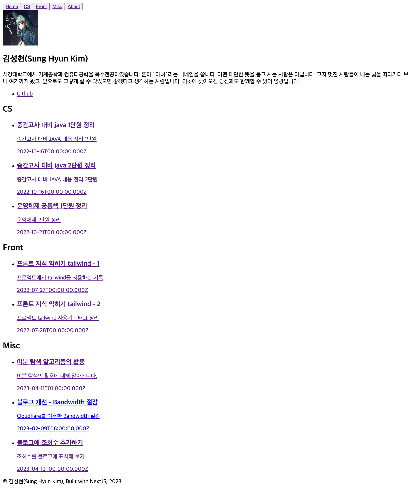
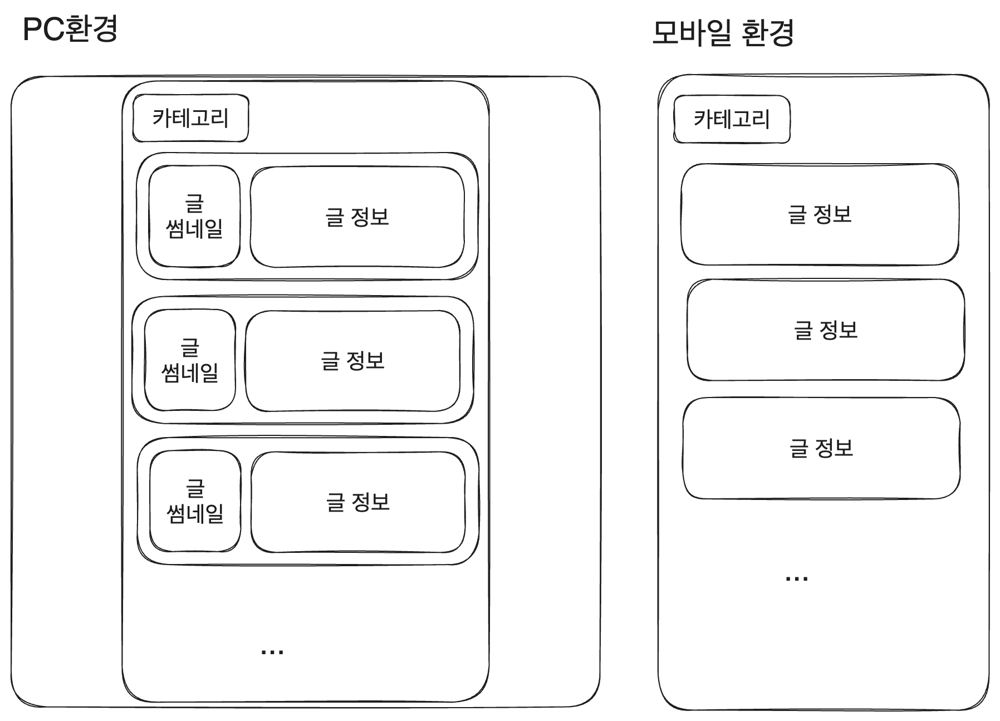
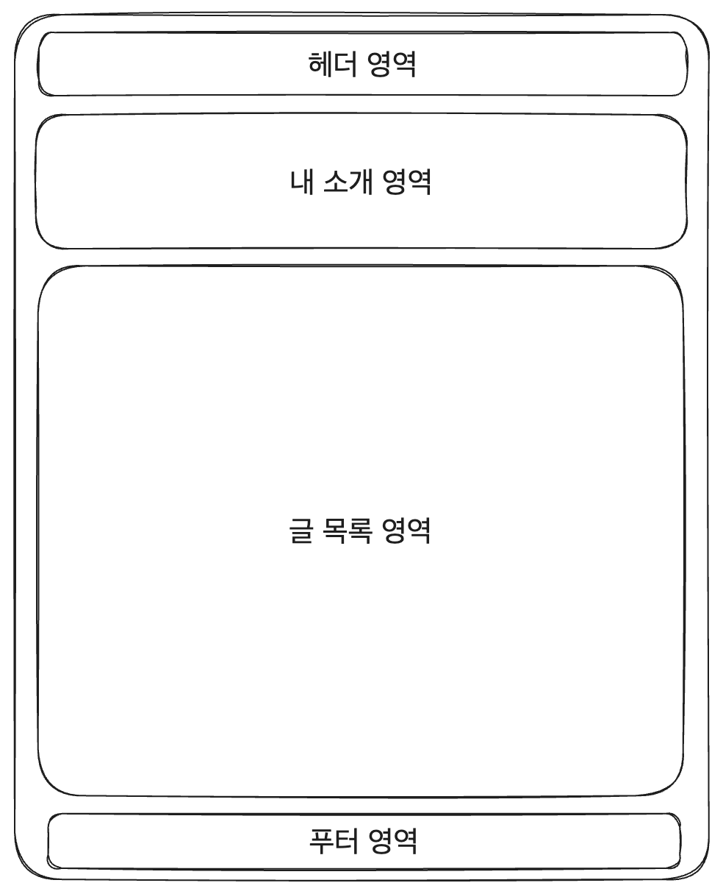
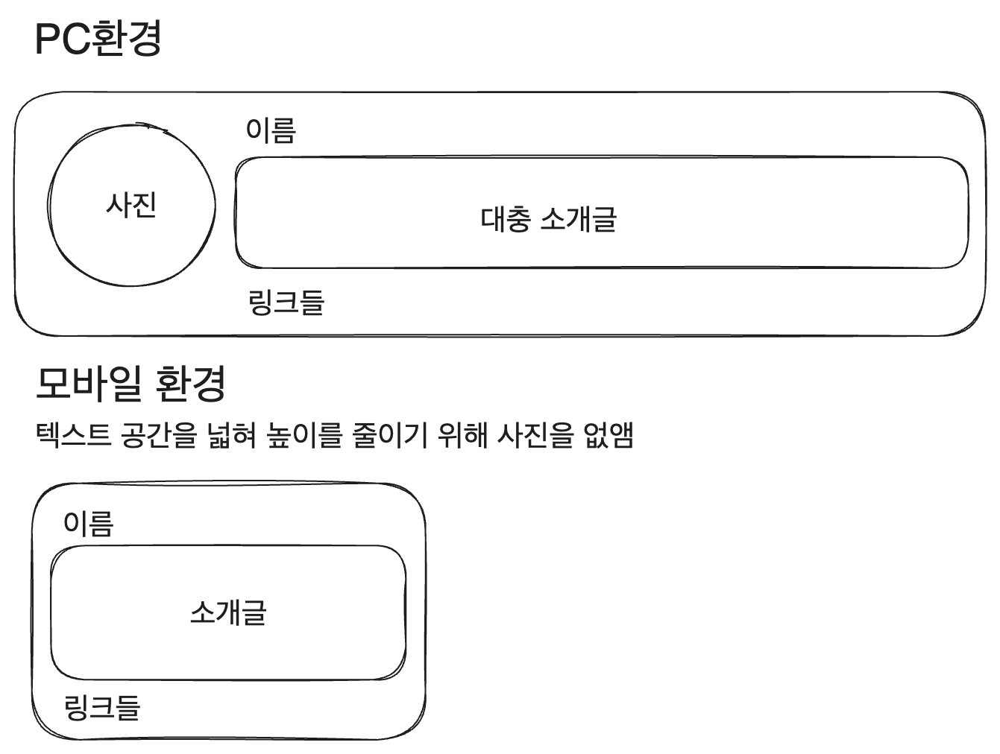

# 블로그 만들기 시리즈

|제목|링크|
|---|---|
|1. 기본 세팅|[https://witch.work/posts/blog-remake-1](https://witch.work/posts/blog-remake-1)|
|2. 메인 페이지의 HTML 설계|[https://witch.work/posts/blog-remake-2](https://witch.work/posts/blog-remake-2)|
|3. 글 상세 페이지의 구조 설계|[https://witch.work/posts/blog-remake-3](https://witch.work/posts/blog-remake-3)|
|4. 이미지를 상대 경로로 쓸 수 있도록 하기|[https://witch.work/posts/blog-remake-4](https://witch.work/posts/blog-remake-4)|
|5. 자잘한 페이지 구성 개선과 배포|[https://witch.work/posts/blog-remake-5](https://witch.work/posts/blog-remake-5)|
|6. 페이지 요소의 배치 설계|[https://witch.work/posts/blog-remake-6](https://witch.work/posts/blog-remake-6)|
|7. 메인 페이지 컴포넌트 디자인|[https://witch.work/posts/blog-remake-7](https://witch.work/posts/blog-remake-7)|
|8. 글 목록/내용 페이지 컴포넌트 디자인|[https://witch.work/posts/blog-remake-8](https://witch.work/posts/blog-remake-8)|
|9. 글 썸네일 자동 생성하기|[https://witch.work/posts/blog-remake-9](https://witch.work/posts/blog-remake-9)|
|10. 폰트, 카드 디자인 등의 디자인 개선|[https://witch.work/posts/blog-remake-10](https://witch.work/posts/blog-remake-10)|
|11. 글에 조회수 달기|[https://witch.work/posts/blog-remake-11](https://witch.work/posts/blog-remake-11)|
|12. 페이지 테마와 글 검색 기능|[https://witch.work/posts/blog-remake-12](https://witch.work/posts/blog-remake-12)|
|13. 테마 아이콘과 썸네일 레이아웃 개선 등|[https://witch.work/posts/blog-remake-13](https://witch.work/posts/blog-remake-13)|
|14. 글 분류를 태그 기반으로 변경|[https://witch.work/posts/blog-remake-14](https://witch.work/posts/blog-remake-14)|
|메인 페이지의 연산 최적화|[https://witch.work/posts/blog-opt-1](https://witch.work/posts/blog-opt-1)|
|글 목록 페이지네이션 만들기|[https://witch.work/posts/blog-opt-2](https://witch.work/posts/blog-opt-2)|
|이미지를 CDN에 올리고 placeholder 만들기|[https://witch.work/posts/blog-opt-3](https://witch.work/posts/blog-opt-3)|
|검색 페이지에 무한 스크롤 구현하기|[https://witch.work/posts/blog-opt-4](https://witch.work/posts/blog-opt-4)|

# 1. 디자인의 시작, 레이아웃



지금 내 블로그는 매우 못생겼다. 색도 하나도 안 입혀져 있고(링크에 입혀진 기본 색상 말고는), CSS도 하나도 없어서 링크들은 쨍한 파란색으로 보이고 난리가 났다.

하지만 가장 문제는 배치가 제멋대로라는 것이다. HTML 시맨틱이야 잘 짜여 있(다고 믿)지만 그냥 위에서 아래로 배열되었을 뿐이다. 레이아웃이 페이지에서 얼마나 중요한지를 생각해 보면 이는 큰 문제다.

내가 참고한 [누구나 쉽게 배우는 웹사이트 디자인의 비밀](https://product.kyobobook.co.kr/detail/S000001033015)에서도 레이아웃을 목차의 첫번째로 꼽고 있다.

또한 10년차 디자이너분의 시리즈 [누구나 디자이너가 될 수 있다](https://brunch.co.kr/@sarayun/22)에서도 디자인의 4대 핵심 요소 중 가장 기본이라고 말하고 있다. 가독성이 정말 안 좋은 페이지를 본 사람이라면 충분히 이해할 수 있는 이야기다.

따라서 이번에는 CSS를 활용해서 페이지의 레이아웃을 한번 수정해 보도록 하자. 메인 페이지부터 시작해 볼까.

모바일 우선 디자인을 적용하였다. 내 블로그를 모바일로 보는 사람도 많을 것이고 또한 일반적으로 컴퓨터가 성능이 더 좋기 때문에 모바일 우선으로 로드하고 나서 컴퓨터 환경에서 미디어 쿼리를 적용하는 게 속도 면에서 더 나을 거라고 생각했기 때문이다.

또한 css 라이브러리를 딱히 사용하지 않는 것이 처음이라 가장 고전적인 BEM 클래스 작명법을 적당히 사용하였다.

# 2. 페이지 헤더와 푸터 공통화

현재 페이지 헤더에는 내비게이션이 있고, 푸터에는 간단한 내 이름이 있다. 현재 이 요소들은 메인 페이지에만 들어 있다. 그런데 각 헤더와 푸터에 들어 있는 정보를 생각해 볼 때 모든 페이지에 공통으로 들어가 있는 게 합리적이다.

따라서 이를 모든 페이지에 공통으로 넣어주도록 하자. `/src/pages/_app.tsx`를 수정해주면 된다.

```tsx
// src/pages/_app.tsx
import '@/styles/globals.css';
import type { AppProps } from 'next/app';

import Footer from '@/components/footer';
import Header from '@/components/header';
import blogCategoryList from 'blog-category';

export default function App({ Component, pageProps }: AppProps) {
  return (
    <>
      <Header navList={blogCategoryList} />
      <Component {...pageProps} />
      <Footer />
    </>
  );
}
```

그리고 `/src/pages/index.tsx`에 있던 헤더와 푸터는 지워준다.

# 3. 콘텐츠 영역 너비

현재 블로그 페이지의 컨텐츠는 width가 100%라 페이지를 꽉 채우고 있다. 화면이 좁은 모바일 환경에서라면 텍스트가 답답하게 배치된 것처럼 보이지 않도록 컨텐츠를 최대한 넓은 너비에 배치해야 하겠다. 그리고 그게 거의 정답이라 생각한다. 안 그래도 768px 미만의 화면 너비일 때는 양쪽에 약간의 패딩을 주겠지만 콘텐츠를 화면에 거의 꽉 채우도록 할 것이다.

하지만 1920px 너비가 많은 데스크톱 환경에서는 이게 너무 넓어 보이고 한 줄에 있는 글자도 너무 많아서 읽기 힘들 것이다. 따라서 콘텐츠의 최대 넓이를 제한해야 한다고 본다. max-width 속성을 이용할 것이다.

## 3.1. 최대 콘텐츠 너비에 관한 고찰

그런데 어느 정도의 너비까지 컨텐츠를 채우도록 해야 할까?

[웹 접근성 가이드](https://www.w3.org/WAI/tutorials/page-structure/styling/#line-length)에서는 텍스트 컨테이너가 80자 너비를 넘으면 안 된다고 한다. `max-width: 70rem`으로 설정하는 방식으로 해보라고 조언도 해주고 있다. 

기본 폰트 사이즈가 16px이므로 약 1120px 정도의 최대 너비를 갖게 하라고 말하는 것이다. 그래서 max-width를 60rem으로도 해보고 70rem으로도 해봤다. 1920px에서 봐도 여백이 생각만큼 엄청 넓어 보이지 않고 괜찮아 보였다.

그 정도로 설정하자 여백은 충분해 보였으나 해당 너비에 텍스트뿐일 때 한 줄당 텍스트가 너무 많아 보였다. 그럼 한 줄에 얼만큼의 글자 수가 적절할까? 

타이포그래피 연구에 의하면 사람들은 온라인 컨텐츠를 읽을 때 더 짧은 줄 길이를 쓰는 것이 더 조직화되고 이해하기 쉽다고 느끼기 때문에 짧은 줄을 더 선호한다고 한다. 그리고 40~55자 정도의 줄 길이가 가장 이상적이라고 한다.

그럼 우리가 추구해야 할 건 다음과 같다.

- 콘텐츠 컨테이너의 너비는 60~70rem으로
- 텍스트는 한 줄당 40~55자(즉 40~55rem)이 되도록 설정

우리가 지금 생각해야 할 건 메인 페이지, 글 목록 페이지, 글 상세보기 페이지이다. 이때 메인 페이지와 글 목록 페이지는 최대 너비가 60~70rem이 되도록 설정할 수 있다. 텍스트는 한 줄에 40~55자만 들어가도록 설정하도록 할 수 있는 장치들이 있기 때문이다.

메인 페이지 같은 경우 다음과 같은 레이아웃을 생각할 수 있겠다.


소개 영역은 내 프로필 사진을 올리는 걸로 텍스트 영역의 너비를 40~55자로 만들 수 있을 것이고 글 프리뷰에 있는 텍스트는 당연히 한참 적은 줄당 글자수를 가질 것이다.

또한 글 목록 페이지는 다음과 같이, 글 프리뷰 카드(?)에 글의 썸네일을 넣어주는 방식으로 카드에 들어가는 텍스트를 한정할 수 있겠다. [토스 기술블로그](https://toss.tech/tech)의 레이아웃을 참고하였다.



하지만 글 상세보기 페이지의 경우 딱히 글 콘텐츠 영역 너비를 줄여줄 어떤 장치가 없기 때문에(물론 TOC를 옆쪽에 넣거나 하는 방식도 가능하겠지만 그건 나중에 생각해보자) 그냥 전체 영역을 50rem으로 하는 것으로 생각했다.

## 3.2. 콘텐츠 영역 컨테이너 설정

일단 메인 페이지에 들어갈 래퍼 클래스는 다음과 같이 `/src/pages/styles.module.css`에 만들면 된다. `max-width`만 제외하고 나머지 래퍼들도 이를 따르면 된다.

```css
// /src/pages/styles.module.css
.pagewrapper{
  margin:0 auto;
  width:100%;
  min-height:100vh;
}

@media (min-width: 768px) {
  .pagewrapper{
    max-width:60rem;
  }
}
```

그리고 `/src/pages/index.tsx`의 main 태그 className으로 `styles.pagewrapper`를 추가한다.(import style은 당연히 선행되어야 한다)

`/src/pages/posts/[category]/styles.module.css`에도 다음과 같이 같은 래퍼 클래스를 만들어준다.

```css
.pagewrapper{
  margin:0 auto;
  width:100%;
  min-height:100vh;
}

@media (min-width: 768px) {
  .pagewrapper{
    max-width:60rem;
  }
}
```

`/src/pages/[category]/index.tsx`의 페이지 컴포넌트의 main 태그에도 해당 래퍼를 추가.

```tsx
function PostListPage({
  category, postList,
}: InferGetStaticPropsType<typeof getStaticProps>) {
  return (
    // 페이지 래퍼 추가
    <main className={styles.pagewrapper}>
      <h1>{category}</h1>
      <ul>
        {postList.map((post: PostMetaData) => 
          <li key={post.url}>
            <Card {...post} />
          </li>
        )}
      </ul>
    </main>
  );
}
```

그리고 글 상세 페이지의 컨테이너를 위한 클래스도 `/src/pages/posts/[category]/styles.module.css`에 추가적으로 정의

```css
.pagewrapper{
  margin:0 auto;
  width:100%;
  min-height:100vh;
}

.articlewrapper{
  margin:0 auto;
  width:100%;
  min-height:100vh;
}

@media (min-width: 768px) {
  .pagewrapper{
    max-width:60rem;
  }

  .articlewrapper{
    max-width:50rem;
  }
}
```

그리고 `/src/pages/posts/[category]/[slug].tsx`의 페이지 컴포넌트의 main 태그에도 해당 래퍼를 추가.

```tsx
function PostPage({
  post
}: InferGetStaticPropsType<typeof getStaticProps>) {

  return (
    // 여기에 추가
    <main className={styles.articlewrapper}>
      <article>
        <h1>{post.title}</h1>
        <time>{post.date}</time>
        <ul>
          {post.tags.map((tag: string)=><li key={tag}>{tag}</li>)}
        </ul>
        {'code' in post.body?
          <MDXComponent code={post.body.code}/>:
          <div dangerouslySetInnerHTML={{ __html: post.body.html }} />
        }
      </article>
    </main>
  );
}
```

이렇게 설정한 후 여러 기업의 기술 블로그들의 페이지 컨테이너 너비를 조사하였다. 대부분이 내가 쓴 것과 같이 max-width를 제한하는 방식을 사용했다. 

토스는 980px(단 width 92%인 내부 컨테이너가 하나 더 있어서 실제 콘텐츠 너비는 더 작았다), 배민은 900px, 구글 978px, 토스트UI 1060px, 라인 790px등 대충 나와 비슷한 수준이었다. 내가 설정한 60rem(960px)가 정답은 아닐지언정 그렇게까지 틀려먹은 수치는 아닌 것으로 보인다.

이제 페이지의 몇몇 컴포넌트 레이아웃을 수정해 보자. 메인 페이지와 글 목록 페이지 등..

참고로, 위에서 간간이 사용한 `min-height:100vh`등의 속성은 예전에는 wrapper div를 넣어서 기본적으로 넣어 주던 속성이다. 하지만 이는 [오래된 버전의 IE에서는 몇몇 태그에 대해 적용되지 않는 CSS가 있었기 때문에 하던 관행이며 지금 시점에 꼭 따를 필요는 없다.](https://stackoverflow.com/questions/27582691/why-is-web-content-wrapped-in-a-wrapper-div)

# 4. 메인 페이지 간략 레이아웃

현재 메인 페이지는 의미적으로 4개의 영역으로 나눠져 있다고 할 수 있다. 다음과 같이 헤더, 내 소개, 글 목록, 푸터가 그 4개의 영역이다.



여기서 헤더와 푸터는 지금 당장 레이아웃이 문제가 되지는 않으므로 내 소개와 글 목록에 대해서만 생각해 보자.

## 4.1. 메인 페이지 내 소개 영역

메인 페이지는 사용자가 내 블로그에 접속했을 때 처음으로 보게 되는 페이지다. 따라서 내 소개가 최상단에 있어야 하는 건 맞지만, 내 블로그 컨텐츠도 적절히 노출되도록 하면 좋겠다. 이는 모바일 환경에서도 마찬가지이므로 공간을 최대한 덜 차지하면서 적절해 보이는 레이아웃이 되도록 하고자 한다.

따라서 다음과 같은 반응형 레이아웃을 생각해 보았다.



이를 어떻게 구현할까? 먼저 이름, 소개글, 링크들의 배열은 어차피 기본적으로 위에서 아래로 배열되어 있으므로 굳이 수정할 필요가 없다. 하지만 이미지와 레이아웃이 섞이지 않도록 이 부분을 div로 한번 묶어주자. 그리고 CSS 모듈 파일을 `src/components/profile`에 만들어 주자. `styles.module.css`정도의 이름이면 되겠다.

이미지는 화면 너비가 클 때, 일반적으로 모바일과 데스크탑을 가르는 기준이 되는 768px를 기준으로 그보다 크면 보여주도록 한다. 이미지가 나온 후 세로로 배열된 나머지 요소들이 와야 하므로 내 소개 박스의 display를 flex로 설정하고 가로로 배열되도록 한다. 이 설정은 화면 너비가 768px보다 클 때만 해주면 된다.

그리고 링크들은 가로로 배열되었으면 한다. 따라서 링크들을 감싸는 ul 컴포넌트에 적용해 줄 flex도 설정해 주자. 여기엔 미디어 쿼리가 필요없다. 그리고 링크에는 bullet point가 필요없으므로 이를 없애주고 링크 간의 어느 정도의 간격을 준다.

이를 CSS 클래스로 구현하면 다음과 같다.

```css
// src/components/profile/profile.module.css
.profile__image{
  display:none;
}

.profile__linklist{
  display:flex;
  flex-direction:row;
  list-style:none;
  padding-left:0;
  gap:0 15px;
}

@media (min-width:768px){
  .profile__image{
    display:block;
  }

  .profile{
    display:flex;
    flex-direction:row;
  }
}
```

그리고 프로필 컴포넌트에선 다음과 같이 클래스를 사용해 준다.

```tsx
// src/components/profile/index.tsx
import styles from './profile.module.css';

function Profile() {
  return (
    <article className={styles.profile}>
      <Image className={styles.profile__image} src={blogConfig.picture} alt={`${blogConfig.name}의 프로필 사진`} width={80} height={80} />
      <div>
        <h2>{blogConfig.name}</h2>
        <p>{blogConfig.description}</p>
        <ul className={styles.profile__linklist}>
          <li>
            <Link href={blogConfig.social.github} target='_blank'>
            Github
            </Link>
          </li>
          <li>
            <Link href={blogConfig.social.BOJ} target='_blank'>
            BOJ
            </Link>
          </li>
        </ul>
      </div>
    </article>
  );
}
```

이렇게 하고 적용해 보면 내 소개 컴포넌트의 사진이 소개글 왼쪽에 보이고, 화면 너비가 작아지면 없어지는 걸 확인할 수 있다. 또 링크도 가로로 잘 배열되어 있다.

## 4.2. 메인 페이지 글 목록 영역

메인 페이지상의 글 목록의 배치에 대해 생각나는 요구 사항은 다음과 같다.

1. 모바일에서 텍스트가 답답하게 보이지 않아야 한다. PC 환경에서도 마찬가지.
2. 처음 페이지가 떴을 때 메인 페이지에서 최대한 많은 글을 보여줄 수 있어야 한다.

여기에 부합하기 위해서는, 1번 요구사항을 더 우선적으로 생각했을 때 다음과 같은 요소 배치를 생각해 보았다. 모바일에서 답답해 보이지 않기 위해서는 글 프리뷰 카드 하나가 너비를 전부 차지해야 한다고 생각했다.


이번에도 `src/components/category/styles.module.css` 생성. 그냥 화면이 일정 너비 이상이 되면 가로로 배열되도록 하기만 하면 된다. 그 외엔 bullet point를 없애주고 가로 배열시 간격을 주는 정도만 해주자.

```css
.category__cardlist{
  list-style:none;
}

@media (min-width:768px){
  .category__cardlist{
    display: flex;
    flex-direction:row;
    gap:20px;
  }
}
```

그리고 `src/components/category/index.tsx`의 ul태그에 `styles.category__cardlist`를 적용해 주기만 하면 된다.

여기까지 하면 배치가 이렇게 바뀐다. 아직도 엄청나게 못생겼지만 아까보다 훨씬 나아 보이는 것 같다.


# 참고

https://brunch.co.kr/@sarayun/22

https://merrily-code.tistory.com/154

https://socialtriggers.com/perfect-content-width/