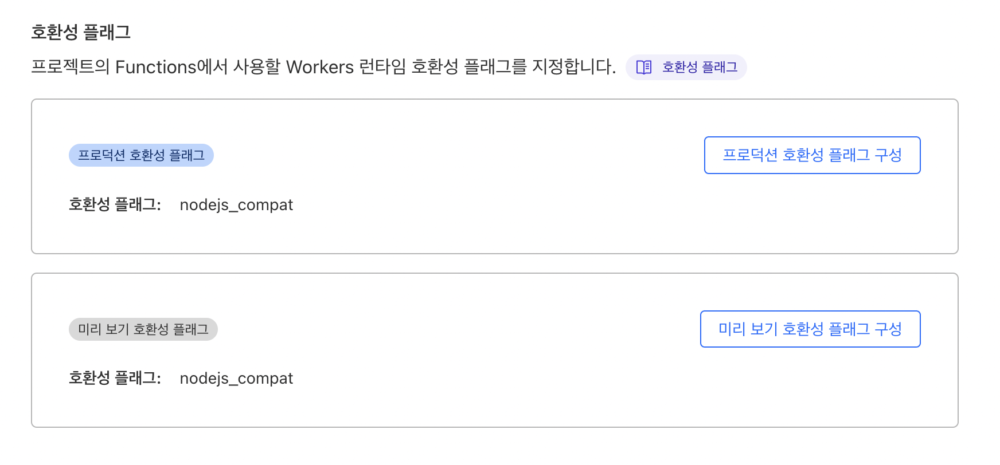
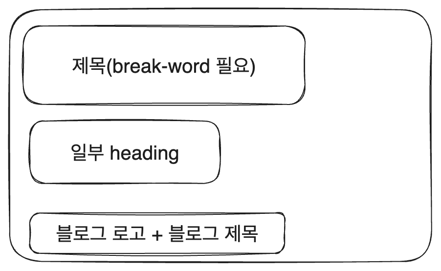
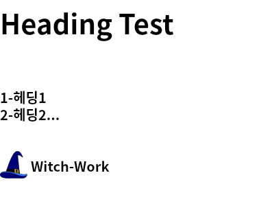

# 블로그 만들기 시리즈

|제목|링크|
|---|---|
|1. 기본 세팅|[https://witch.work/posts/blog-remake-1](https://witch.work/posts/blog-remake-1)|
|2. 메인 페이지의 HTML 설계|[https://witch.work/posts/blog-remake-2](https://witch.work/posts/blog-remake-2)|
|3. 글 상세 페이지의 구조 설계|[https://witch.work/posts/blog-remake-3](https://witch.work/posts/blog-remake-3)|
|4. 이미지를 상대 경로로 쓸 수 있도록 하기|[https://witch.work/posts/blog-remake-1](https://witch.work/posts/blog-remake-4)|
|5. 자잘한 페이지 구성 개선과 배포|[https://witch.work/posts/blog-remake-5](https://witch.work/posts/blog-remake-5)|
|6. 페이지 요소의 배치 설계|[https://witch.work/posts/blog-remake-6](https://witch.work/posts/blog-remake-6)|
|7. 메인 페이지 컴포넌트 디자인|[https://witch.work/posts/blog-remake-7](https://witch.work/posts/blog-remake-7)|
|8. 글 목록/내용 페이지 컴포넌트 디자인|[https://witch.work/posts/blog-remake-8](https://witch.work/posts/blog-remake-8)|
|9. 글 썸네일 자동 생성하기|[https://witch.work/posts/blog-remake-9](https://witch.work/posts/blog-remake-9)|
|10. 폰트, 카드 디자인 등의 디자인 개선|[https://witch.work/posts/blog-remake-10](https://witch.work/posts/blog-remake-10)|
|11. 글에 조회수 달기|[https://witch.work/posts/blog-remake-11](https://witch.work/posts/blog-remake-11)|
|12. 페이지 테마와 글 검색 기능|[https://witch.work/posts/blog-remake-12](https://witch.work/posts/blog-remake-12)|
|13. 테마 아이콘과 썸네일 레이아웃 개선 등|[https://witch.work/posts/blog-remake-13](https://witch.work/posts/blog-remake-13)|
|14. 글 분류를 태그 기반으로 변경|[https://witch.work/posts/blog-remake-14](https://witch.work/posts/blog-remake-14)|
|메인 페이지의 연산 최적화|[https://witch.work/posts/blog-opt-1](https://witch.work/posts/blog-opt-1)|
|글 목록 페이지네이션 만들기|[https://witch.work/posts/blog-opt-2](https://witch.work/posts/blog-opt-2)|
|이미지를 CDN에 올리고 placeholder 만들기|[https://witch.work/posts/blog-opt-3](https://witch.work/posts/blog-opt-3)|
|검색 페이지에 무한 스크롤 구현하기|[https://witch.work/posts/blog-opt-4](https://witch.work/posts/blog-opt-4)|

드디어 다시 Card 컴포넌트에 들어갈 글 썸네일을 만들어 주는 작업으로 돌아왔다. 다른 페이지들을 대강이나마 꾸며주는 데에 글 하나가 쓰였다. 특히 TOC를 만들어 주는 데에 많은 시간이 걸렸다.

# 1. 설계

이 글에서 하기로 생각하는 건 하나뿐이다. 글의 썸네일을 만드는 것이다.

글 목록에서 보이는 `Card` 컴포넌트는 현재 글의 프리뷰 같은 느낌으로 작동하므로 여기에 글의 썸네일을 넣을 수도 있을 것이고, 또한 open graph 이미지에도 넣을 수 있을 것이다. 이는 글의 이해에도 도움을 주고 링크 미리보기도 생성해 주며 글 목록 페이지의 카드 내의 텍스트 한 줄의 너비도 줄여서 사용자의 집중도를 높일 수 있을 것이다.

이때 썸네일을 넣으면 글 목록의 카드 내의 텍스트 한 줄 너비가 줄어든다고 한 이유는 다음과 같은 레이아웃을 생각하고 있기 때문이다.


하지만 이를 위해 해야 하는 일이 많다. 과연 썸네일에는 어떤 이미지가 들어가야 할까?

만약 글 내에 쓰인 이미지가 있다면, 그게 썸네일이 되는 게 마땅하다고 생각한다. 물론 그게 꼭 글의 내용을 간략하게 정리하는 이미지일 거라고 생각하지는 않지만 일단 그렇게 해보자. 나중에 이상하면 바꾸면 되니까.

더 큰 문제는 글에 쓰인 이미지가 없을 때이다. 이때는 무엇이 썸네일이 되어야 할까? 글의 제목 혹은 글의 요약이라고도 할 수 있는 TOC(Table Of Content)의 일부가 되어야 하지 않을까 한다. 이런 썸네일을 동적으로 만들어보자.

일단 이전에 `Card`컴포넌트에서 이미지를 넣을 수 있도록 타입을 정해 놓긴 했다. 따라서 이미지를 가져올 방법을 생각해 보자. `src/pages/posts/[category]/index.tsx`에서 `Card` 컴포넌트에 어떻게든 썸네일 이미지를 넘겨주기만 하면 된다.

# 2. 구상

먼저 생각을 해보았다. md 파일 내용은 html 형식을 한 문자열로 변환되어 저장되어 있으니 여기서 정규식으로 img 태그의 src를 파싱해서 그걸 썸네일로 만들 수 있겠다. 실제로 이 방법으로 시도하였고 어느 정도 성공을 거두었다.

그런데 mdx 파일은? mdx 파일은 코드로 변환되기 때문에 쓰인 이미지를 찾기가 난감했다. 라이브러리 같은 게 있기는 했지만 그렇게 내키지 않았다.

그런데 우리는 이미 md파일이건 mdx파일이건 내부의 요소 계층 구조를 다룰 수 있는 방법을 알고 있다. 바로 remark 플러그인에서 하는 것이다.

따라서 다음과 같은 방식을 생각했다.

1. remark 플러그인에서 AST상의 이미지 요소를 찾고, src를 파싱한다.
2. 이미지가 없을 경우 제목과 heading 요소를 이용해서 어떻게든 썸네일을 만든다.

# 3. 글에 이미지가 있을 경우

일단 플러그인을 만들자. `src/plugins`에 `make-thumbnail.mjs`를 만들자.

마크다운으로 만들어진 AST 중 이미지 태그를 순회하면서 이미지 URL들을 모두 파싱한 후 그 첫번째 URL을 thumbnail로 넘겨주는 것이다. 만약 글에 이미지가 없다면 그대로 넘어간다.

```js
// src/plugins/make-thumbnail.mjs
import {visit} from 'unist-util-visit';

// 모든 이미지 뽑아내기
function extractImgSrc(tree) {
  const images=[];
  visit(tree, 'image', (node)=>{
    images.push(node.url);
  });
  return images;
}

export default function makeThumbnail() {
  return function(tree, file) {
    const images=extractImgSrc(tree);
    if (images.length>0) {
      file.data.rawDocumentData.thumbnail=images[0];
    }
  };
}
```

이제 이 플러그인을 `contentlayer.config.js`에서 remark plugin으로 추가해 준다.

```js
// contentlayer.config.js
export default makeSource({
  contentDirPath: 'posts',
  documentTypes: [MDXPost, Post],
  markdown: {
    // 여기에 플러그인으로 추가
    remarkPlugins: [remarkGfm, changeImageSrc, headingTree, makeThumbnail],
    rehypePlugins: [[rehypePrettyCode, rehypePrettyCodeOptions]],
  },
  mdx: {
    remarkPlugins: [remarkGfm, changeImageSrc, headingTree, makeThumbnail],
    rehypePlugins: [[rehypePrettyCode, rehypePrettyCodeOptions], highlight],
  },
});
```

이렇게 하면 JSON으로 변환된 파일에 thumbnail 항목이 추가된 것을 확인할 수 있다. 단 이미지가 들어가 있는 글에 한해서 해당 이미지의 경로가 들어가 있다. 이미지가 있는 글의 경우 `make-thumbnail.mjs`에서 썸네일을 만들어 주면 되겠다.

# 4. 글에 이미지가 없을 경우

이 경우 이미지를 동적으로 만들어줘야 한다. 이런 용도로 최근에 vercel에서 나온 라이브러리 `@vercel/og`가 있다. open graph만을 위해 나온 거긴 하지만 이를 한번 써보자.

```bash
npm i @vercel/og
```

[공식 문서](https://vercel.com/docs/concepts/functions/edge-functions/og-image-generation#usage)를 참고해서 해보았다. 먼저 `src/pages/api/thumbnail.tsx`를 만들고 다음과 같이 작성한다.

```tsx
import { ImageResponse } from '@vercel/og';
import { NextRequest } from 'next/server';

export const config = {
  runtime: 'edge',
};
 
export default function handler (request: NextRequest) {
  try {
    const { nextUrl: { search } } = request;
    const urlSearchParams = new URLSearchParams(search);
    const params = Object.fromEntries(urlSearchParams.entries());
    const title=params.title;

    return new ImageResponse(
      (
        <div
          style={{
            fontSize: 128,
            background: 'white',
            width: '100%',
            height: '100%',
            display: 'flex',
            textAlign: 'center',
            alignItems: 'center',
            justifyContent: 'center',
          }}
        >
          {title}
        </div>

      ),
      {
        width: 1200,
        height: 600,
      },
    );
  }
  catch (error) {
    console.error(error);
    return new Response('Failed to generate thumbnail', { status: 500 });
  }
}
```

이러면 `블로그주소/api/thumnail`에 쿼리스트링으로 title을 전달한 URL로 접속하면 title이 크게 쓰인 사진 같은 게 보이게 된다. 이를 썸네일 소스로 사용하면 되겠다.

하지만 이게 내가 블로그 배포에 쓸 Cloudflare Pages에서도 잘 될까? 해보니 역시나. 엄청난 고난들이 있었다.

# 5. Cloudflare 배포

나는 블로그를 Cloudflare에서 배포할 예정이다. 하지만 `@vercel/og`는 vercel에서 만든 라이브러리인데, vercel에서 배포할 때만 돌아가는 게 아닐까? 그래서 Cloudflare에서 배포하고 실험해 보기로 했다.

당연히 NextJS는 Vercel에서 만든 것이므로 그쪽에 가장 최적화가 잘 되어 있고, 따라서 Cloudflare에서 배포할 때는 `@vercel/og` 말고도 문제가 좀 있었다.

그나마 다행히도 [Cloudflare에서도 작년 말부터 nextJS 배포 정식 지원](https://blog.cloudflare.com/next-on-pages/)을 시작했지만, 당연히 제작자인 Vercel에서 배포하는 것만큼 좋지는 않았다.

아무튼 다음은 [Cloudflare Nextjs 배포 문서](https://developers.cloudflare.com/pages/framework-guides/deploy-a-nextjs-site/)을 참고해서 Nextjs를 Cloudflare에서 배포하면서 문제를 해결한 과정이다.

먼저 nextJS 배포를 위한 cloudflare 패키지 설치

```bash
npm install --save-dev @cloudflare/next-on-pages
```

그리고 Workers & Pages 메뉴에서 페이지를 만들고 github 레포를 연결한다. 이 과정은 [조졸두님의 글](https://jojoldu.tistory.com/657)에 잘 설명되어 있다.

하지만 나는 api 라우트를 사용할 것이므로 프레임워크 프리셋에서 그냥 Next.js를 선택한다. `Next.js(Static HTML Export)`가 아니다!

그리고 [내가 이전에 쓴 글](https://witch.work/blog-move-to-cloudflare/#11-%EC%98%A4%EB%A5%98-%ED%95%B4%EA%B2%B0)을 참고하여 Cloudflare의 빌드에 쓰일 노드 버전을 `17.9.1`로 올렸다. 

공식 문서에서도 NextJS가 Node.js 16 버전 이상을 요구하므로 이렇게 Node 버전을 올리라고 설명하고 있다.

그다음에 배포를 해보면 실패한다. 에러 메시지를 읽어보면 `nodejs_compat`호환성 플래그가 문제라고 한다.

Workers 및 페이지 -> 내 프로젝트 방문 -> 설정 -> 함수 -> 호환성 플래그 에서 프로덕션 호환성 플래그와 미리보기 호환성 플래그에 `nodejs_compat`을 설정한다.



이번에는 이미지가 제대로 뜨지 않는다. [NextJS의 이미지를 Cloudflare에서 제대로 지원하지 않는다고 한다](https://github.com/cloudflare/next-on-pages/issues/94)따라서 next의 이미지 최적화를 끄자. `next.config.js`에서 `images.unoptimized`를 `true`로 설정한다.

```js
// next.config.js
const nextConfig = {
  images:{
    /* 이 부분 추가 */
    unoptimized:true,
  },
  compress:true,
  reactStrictMode: true,
  swcMinify:false,
};
```

이번에는 타입 에러가 뜬다. 내가 `getSortedPosts()`함수를 써서 가져온 데이터에서 필터링을 하는 부분이 있는데 여기에 쓰인 필터 함수의 인수가 정의가 안 되어 있다는 에러였다.

```tsx
/* 여기 쓰인 필터 함수의 post에 타입 정의가 안되어 있다 */
const categoryPostList=getSortedPosts().filter((post)=>{
  return post._raw.flattenedPath.split('/')[0]===category.url.split('/').pop();
}).slice(0, 3);
```

따라서 `contentlayer/generated`에 정의된 `DocumentTypes` 타입을 찾아와서 정의해주었다.

```tsx
const categoryPostList=getSortedPosts().filter((post: DocumentTypes)=>{
  return post._raw.flattenedPath.split('/')[0]===category.url.split('/').pop();
}).slice(0, 3);
```

이외에도 `getSortedPosts()`와 관련된 부분들에 다 타입을 붙여줬다. Cloudflare 배포를 한번씩 하면서 배포(5분쯤 걸림)-버그확인-고치기 를 반복하는 지루한 작업이었다.

그런데 이제는 `@vercel/og`가 동작하지 않는다. Cloudflare에선 안된다...

# 6. Cloudflare에서 썸네일 만들기

Cloudflare에서도 open graph 2023년 4월 정도부터 이미지 생성을 지원한다. 이건 Cloudflare worker에서 동작한다는 차이점뿐 API 명세 등은 같다. 버전 0.1.0밖에 안 되는 따끈한 버전이다.

[공식 문서](https://developers.cloudflare.com/pages/platform/functions/plugins/vercel-og/)를 참고하여 Cloudflare버전의 `@vercel/og`를 사용해보자.

```bash
npm install @cloudflare/pages-plugin-vercel-og
```

하지만 이걸 써보려고 하루종일 시도했으나 잘 되지 않았다. 사실 vercel에서 `@vercel/og`를 쓸 때도, 대부분의 사진은 잘 생성되었지만 가끔씩 사진이 생성되지 않는 경우가 있었다. 이유는 잘 모르겠지만 한글 인코딩 과정에서 뭔가 문제가 생기지 않았을까 추측한다. [og-image-korean](https://morethanmin.com/posts/how-to-generate-dynamic-og-image)이라는 것도 있는 모양이지만 어차피 vercel에서만 될 것 같았다.

## 6.1. canvas로 이미지 생성해보기

그래서 어차피 우리가 썸네일 생성에 쓸 것은 그냥 텍스트(제목 등)와 정적 이미지만 들어간 사진이므로 canvas를 써서 직접 생성해 보기로 했다.

원래 쓰던 `@vercel/og` 플러그인 삭제. 그리고 canvas 설치

```bash
npm uninstall @cloudflare/pages-plugin-vercel-og
npm install canvas
```

바로 엄청난 에러의 향연이 펼쳐졌다. canvas를 못 깔겠단다.

```bash
npm ERR! code 1
npm ERR! path /Users/kimsunghyun/Desktop/nextjs-blog/node_modules/canvas
npm ERR! command failed
npm ERR! command sh -c node-pre-gyp install --fallback-to-build --update-binary
npm ERR! Failed to execute '/opt/homebrew/Cellar/node/20.1.0/bin/node /opt/homebrew/lib/node_modules/npm/node_modules/node-gyp/bin/node-gyp.js configure --fallback-to-build --update-binary --module=/Users/kimsunghyun/Desktop/nextjs-blog/node_modules/canvas/build/Release/canvas.node --module_name=canvas --module_path=/Users/kimsunghyun/Desktop/nextjs-blog/node_modules/canvas/build/Release --napi_version=8 --node_abi_napi=napi --napi_build_version=0 --node_napi_label=node-v115' (1)
npm ERR! node-pre-gyp info it worked if it ends with ok
npm ERR! node-pre-gyp info using node-pre-gyp@1.0.10
npm ERR! node-pre-gyp info using node@20.1.0 | darwin | arm64
npm ERR! node-pre-gyp http GET https://github.com/Automattic/node-canvas/releases/download/v2.11.2/canvas-v2.11.2-node-v115-darwin-unknown-arm64.tar.gz
npm ERR! node-pre-gyp ERR! install response status 404 Not Found on https://github.com/Automattic/node-canvas/releases/download/v2.11.2/canvas-v2.11.2-node-v115-darwin-unknown-arm64.tar.gz 
npm ERR! node-pre-gyp WARN Pre-built binaries not installable for canvas@2.11.2 and node@20.1.0 (node-v115 ABI, unknown) (falling back to source compile with node-gyp) 
npm ERR! node
이하 생략
```

node-pre-gyp가 문제인 것 같다. 그래서 [그걸 안 쓰는 canvasAPI](https://github.com/Brooooooklyn/canvas)를 찾아서 써보았다. 심지어 더 빠르다고 한다. Rust를 써서 컴파일되며 시스템 디펜던시도 없다고 한다.

```bash
npm install @napi-rs/canvas
```

이를 이용해서 `make-thumbnail.mjs`를 다음과 같이 수정해보자. 만약 글에 이미지가 없을 경우, 간단하게 제목을 썸네일로 만들어주는 실험을 해보았다. 제목을 뽑아내는 건 여기서 쓰는 file 객체의 형식을 `console.log`로 열심히 찍어 보면서 직접 만들었다. 

파일의 원래 내용이 `file.value`에 저장되어 있었고 이를 개행 기준으로 split해주면 2번째 요소가 `title: 제목어쩌고저쩌고`였다.

```js
export default function makeThumbnail() {
  return function(tree, file) {
    //console.log(file);
    const images=extractImgSrc(tree);
    if (images.length>0) {
      file.data.rawDocumentData.thumbnail=images[0];
    }
    else {
      const title=file.value.split('\n')[1];

      const canvas = createCanvas(300, 320);
      const ctx = canvas.getContext('2d');
      ctx.fillText(title, 50, 150);
      const b = canvas.toBuffer('image/png');

      file.data.rawDocumentData.thumbnail=`data:image/png;base64,${b.toString('base64')}`;
    }
  };
}
```

이렇게 하니까 글에 이미지가 없을 경우 `file.data.rawDocumentData.thumbnail`에 이미지 자체는 잘 만들어졌다. 그런데 한글이 깨진다. 찾아보니 폰트를 직접 받아서 지정해 줘야 한다. 따라서 구글 폰트에서 제공하는 무료 폰트를 사용하기로 했다.

TMI지만 이렇게 한글이 깨지는 등, 폰트에서 지원하지 않는 글자가 있을 때 글자가 깨져서 나오는 네모난 모양을 tofu라고 부르는데(아마 두부처럼 네모나서 그렇지 않을까) 이러한 tofu가 없다는 의미로 위 폰트에 Noto 라는 이름이 붙었다고 한다.

```
이러한 글꼴에 비용이 있나요?
아니요, 모든 Google Fonts는 오픈소스이며 무료로 제공됩니다.
- Google Fonts FAQ 중
```

그래서 [NotoSansKR](https://fonts.google.com/noto/specimen/Noto+Sans+KR)의 otf 파일을 다운받아서 `/font`에 넣고 다음과 같이 폰트를 직접 지정해 주었다.

```js
import {join} from 'path';
import path from 'path';

import { createCanvas, GlobalFonts } from '@napi-rs/canvas';
import {visit} from 'unist-util-visit';

const __dirname = path.resolve();
GlobalFonts.registerFromPath(join(__dirname, 'fonts', 'NotoSansKR-Light.otf'), 'NotoSansKR');

// 모든 이미지 뽑아내기
function extractImgSrc(tree) {/* 생략 */}

export default function makeThumbnail() {
  return function(tree, file) {
    //console.log(file);
    const images=extractImgSrc(tree);
    if (images.length>0) {
      file.data.rawDocumentData.thumbnail=images[0];
    }
    else {
      const title=file.value.split('\n')[1];

      const canvas = createCanvas(300, 300);
      const ctx = canvas.getContext('2d');
      /* 폰트 지정 */
      ctx.font = '35px NotoSansKR';
      ctx.fillText(title, 0, 100);
      const b = canvas.toBuffer('image/png');

      file.data.rawDocumentData.thumbnail=`data:image/png;base64,${b.toString('base64')}`;
    }
  };
}
```

이렇게 하니까 썸네일이 잘 나온다. 이제 이를 좀더 다듬어보자. 

## 6.2. 썸네일 이미지 구성

일단 글씨에 들어가는 `title:`부터 떼버리고, 레이아웃도 어떻게 할지 생각해 보았다. 일단 제목은 어떻게든 들어가야 하고. 부연 설명도 heading 2개 정도를 떼어서 넣어주면 좋겠다. 그리고 내 블로그의 제목도 넣고자 한다.

이런 레이아웃을 어떻게든 만들면 되지 않을까?



이를 기반으로 `createThumbnailFromText`함수를 구성해 보자. 먼저 400x300 정도로 캔버스를 생성하자. 이후에 이미지 처리를 위한 비동기 로직이 쓰일 것이므로 async 함수로 만들어준다.

```js
async function createThumbnailFromText(title, headings, filePath) {
  const width=400;
  const height=300;

  const canvas = createCanvas(width, height);
  const ctx = canvas.getContext('2d');
}
```

필요한 함수들을 하나하나 생성해 보자. 먼저 캔버스를 흰색으로 칠해 주는 `initCanvas` 함수를 만들자. 그냥 흰색 직사각형으로 캔버스를 칠해주는 함수다. 그 후 스타일 색상을 바꿔주는 것만 잊지 않으면 된다.

```js
function initCanvas(ctx, width, height) {
  ctx.fillStyle = '#fff';
  ctx.fillRect(0, 0, width, height);
  ctx.fillStyle = '#000';
}
```

이제는 제목을 일정 글자수마다 끊어 주는 함수를 만들고 그렇게 끊긴 제목 부분들을 하나씩 그려주는 함수 `drawTitle`

```js
// maxWidth가 넘으면 개행 문자를 삽입해서 break-word를 수행해 주는 함수
const stringWrap = (s, maxWidth) => s.replace(
  new RegExp(`(?![^\\n]{1,${maxWidth}}$)([^\\n]{1,${maxWidth}})\\s`, 'g'), '$1\n'
);

function drawTitle(ctx, title) {
  // 15글자가 넘으면 자동 break-word
  title=stringWrap(title, 15);
  title=title.split('\n');
  // 한줄씩 캔버스에 그림
  ctx.font = '40px NotoSansKR';
  for (let i=0; i<title.length; i++) {
    ctx.fillText(title[i], 0, 50+50*i);
  }
}
```

그리고 headingTree를 받아서 그중 depth 1짜리(즉 h1에 쓰인) 소제목들을 최대 2개까지 뽑아서 캔버스에 그려 주는 `drawHeadings`함수도 작성한다. 내가 주로 쓰는 소제목 양식에 맞춰 적당히 포매팅도 했다. 소제목들은 굳이 break-word를 쓰진 않았다.

```js
function drawHeadings(ctx, headingTree) {
  const thumbnailHeadings=headingTree.slice(0, 2);
  const headingTexts=[];
  for (let h of thumbnailHeadings) {
    const headingText=h.data.hProperties.title.replaceAll('. ', '-');
    headingTexts.push(headingText);
  }
  headingTexts[headingTexts.length-1]+='...';
  ctx.font = '20px NotoSansKR';
  for (let i=0; i<headingTexts.length; i++) {
    ctx.fillText(headingTexts[i], 0, 150+25*i);
  }
}
```

그리고 내 블로그의 favicon으로도 쓰이고 있는 마녀 모자 사진을 가져와서 캔버스에 그려주는 `drawBlogSymbol`함수도 만들어 준다. 이때 마녀 모자 사진은 40x40으로 캔버스에 그려준다. 그리고 이미지 로딩이 끝나고 나서 이미지를 사용해야 하므로 await을 사용했다.

```js
async function drawBlogSymbol(ctx, blogName) {
  const hatImage = await fs.readFile(join(__dirname, 'public', 'witch-hat.svg'));
  const image=new Image();
  image.src=hatImage;

  image.width=40;
  image.height=40;

  ctx.drawImage(image, 0, 220);

  ctx.font = '20px NotoSansKR';
  ctx.fillText(blogName, 45, 250);
}
```

그리고 이렇게 만든 함수들을 모두 사용해서 그린 캔버스를 png로 인코딩해서 파일로 만든 후 경로를 리턴하는 함수 `createThumbnailFromText`를 완성하자.

```js
async function createThumbnailFromText(title, headings, filePath) {
  const width=400;
  const height=300;

  const canvas = createCanvas(width, height);
  const ctx = canvas.getContext('2d');

  initCanvas(ctx, width, height);

  drawTitle(ctx, title);

  drawHeadings(ctx, headings);

  await drawBlogSymbol(ctx, 'Witch-Work');

  const fileName=`${filePath.replaceAll('/', '-').replaceAll('.','-')}-thumbnail.png`;

  const pngData=await canvas.encode('png');
  await fs.writeFile(join(__dirname, 'public', 'thumbnails', fileName), pngData);
  const resultPath=`/thumbnails/${fileName}`;

  return resultPath;
}
```

이렇게 해주면 내 프로젝트 폴더의 `/public/thumbnails`에 썸네일이 잘 만들어진다. 단 `/public/thumbnails`폴더까지는 직접 생성해 줘야 한다. 그렇지 않으면 `fs.writeFile`에서 에러가 나더라.

예를 들어 이런 썸네일이 자동으로 생성되게 된다.



contentlayer에서 무슨 변경 flag 처리라도 하는 건지, 이렇게 하면 알아서 정보가 변경된 글에 대해서만 썸네일이 새로 생성된다.

# 7. 썸네일 넣어 주기

그럼 이제 양식을 잘 맞춰서 글을 썼다고 할 때, 모든 글의 변환 데이터에 `thumbnail` 속성이 들어가 있을 것이다. 사실 양식이 좀 안 맞아도 어쨌든 들어가 있긴 할 거라 생각한다. null이나 undefined라도...

이걸 이제 글 목록 페이지의 Card 컴포넌트에 넣고, 글 상세 페이지의 `og:image`에도 넣어주자. `Card`컴포넌트에는 이미 이미지를 넣을 수 있는 기능이 있으므로 이를 props로 넘겨주기만 하면 된다. 따라서 `src/pages/posts/[category]/index.tsx`의 `getStaticProps`를 다음과 같이 수정한다.

`post._raw` 의 타입이 엄격하게 정해져 있는 편이었어서 이를 회피하느라 좀 코드가 길어졌는데, `post._raw` 내에 `thumbnail`이 있을 때만 그걸 넘겨주는 식으로 했다.

```tsx
// src/pages/posts/[category]/index.tsx
export const getStaticProps: GetStaticProps = ({params}) => {
  const allDocumentsInCategory = getSortedPosts().filter((post: DocumentTypes)=>
    post._raw.flattenedPath.startsWith(params?.category as string
    ));
  
  const {title:category, url:categoryURL}=blogCategoryList.find((c: {title: string, url: string})=>
    c.url.split('/').pop()===params?.category) as {title: string, url: string};

  const postList = allDocumentsInCategory.map((post: DocumentTypes) => {
    const { title, description, date, tags, url } = post;
    const metadata={title, description, date, tags, url};
    return 'thumbnail' in post._raw ? 
      ({...metadata, image: post._raw.thumbnail} as PostMetaData) :
      metadata;
  });

  return { props: { category, categoryURL,postList } };
};
```

그리고 `PostListPage` 컴포넌트에서는 다음과 같이 post별 데이터를 그냥 `Card`에 넘겨주도록 한다.

```tsx
// src/pages/posts/[category]/index.tsx
function PostListPage({
  category, categoryURL, postList,
}: InferGetStaticPropsType<typeof getStaticProps>) {

  /* SEO 정보 부분 생략 */

  return (
    <main className={styles.page}>
      <NextSeo {...SEOInfo} />
      <div className={styles.container}>
        <h1 className={styles.title}>{`${category} 주제의 글`}</h1>
        <ul className={styles.list}>
          {postList.map((post: PostMetaData) =>{
            return (
              <li key={post.url}>
              {/* 이렇게 그냥 모든 정보를 넘겨준다 */}
                <Card {...post} />
              </li>
            );
          }

          )}
        </ul>
      </div>
    </main>
  );
}
```

이제 글 목록 페이지에서 썸네일이 잘 보이는 걸 확인할 수 있다. 이제 `src/pages/posts/[category]/[slug]/index.tsx`에서 open graph 이미지도 넣어주자. 이건 `getStaticProps`에서 post를 통째로 넘겨주기 때문에 `post._raw.thumbnail`을 `SEOconfig`에 넣어 주기만 하면 된다.

```tsx
/* src/pages/posts/[category]/[slug]/index.tsx
파일에서 쓰는 SEOinfo 객체.
이걸 <NextSeo {...SEOInfo} /> 형태로 넘긴다. */
const SEOInfo: NextSeoProps={
  title: post.title,
  description: post.description,
  canonical:`${SEOConfig.canonical}${post.url}`,
  openGraph:{
    title: post.title,
    description: post.description,
    images: [
      {
        url:`${blogConfig.url}${post._raw.thumbnail}`,
        alt: `${blogConfig.name} 프로필 사진`,
      },
    ],
    url:`${SEOConfig.canonical}${post.url}`,
  }
};
```

# 8. 카드 내부 요소 배치

그런데 지금 보니 카드에서 썸네일 사진과 글 인트로가 딱 붙어 있다. 

```tsx
// src/components/Card/index.tsx
function Card(props: Props) {
  const { title, description, image, date, tags, url } = props;
  return (
    <Link className={styles.link} href={url}>
      <article className={styles.container}>
        {image ?
          <div className={styles.imagebox}>
            <Image className={styles.image} src={image} alt={`${image} 사진`} width={200} height={200} />
          </div>
          :
          null
        }
        <Intro title={title} description={description} date={date} tags={tags} />
      </article>
    </Link>
  );
}
```

그리고 `src/components/Card/styles.module.css`를 다음과 같이 수정한다. 높이를 기준으로 사진 크기를 조절할 수 있다면 좋았겠지만 그럴 방법을 모르겠어서, 어차피 다 비슷한 레이아웃으로 쓰일 거라 width, height를 딱 정해 주었다.

```css
// src/components/Card/styles.module.css
.container{
  /*border: 1px solid var(--gray5);*/
  border-radius: 1rem;
  box-sizing: border-box;
  height: 100%;
  display:flex;
  flex-direction:row;
}

.link{
  display:block;
  height:100%;
  padding:1rem;
  padding-left:0;
  text-decoration:none;
  color:var(--black);
}

.link:hover{
  padding-left:1rem;
  border-radius: 1rem;
  color:var(--indigo6);
  background-color:var(--gray1);
}

.image{
  display:block;
  width:150px;
  height:120px;
  object-fit:fill;
  margin:0;
  margin-right:1rem;
}
```

이렇게 하니까 사진 크기가 무조건 고정된다. 높이 기준으로 어떻게든 해보려 했지만, 이미지 요소의 조상 요소들 중에 computed height가 없어서 쉽지 않았기에 그냥 고정해 버렸다.

# 참고

동적 썸네일 만들기 https://dev.to/xaconi_94/how-to-create-dynamic-nextjs-post-thumbnails-like-dev-to-3ika

https://articles.wesionary.team/customize-social-media-preview-of-your-nextjs-website-links-82f6bce035b

https://morethanmin.com/posts/how-to-generate-dynamic-og-image

https://vercel.com/docs/concepts/functions/edge-functions/og-image-generation#usage

img 태그 src 파싱 https://stackoverflow.com/questions/14939296/extract-image-src-from-a-string

https://developer.mozilla.org/ko/docs/Web/JavaScript/Reference/Global_Objects/String/match

https://stackoverflow.com/questions/10585029/parse-an-html-string-with-js

NextRequest에서 쿼리스트링 얻기
https://stackoverflow.com/questions/70272983/how-do-i-get-query-string-params-in-nextjs-middleware

간단히 쿼리스트링 만들기 https://stackoverflow.com/questions/316781/how-to-build-query-string-with-javascript

nextjs를 cloudflare로 배포하기 https://jojoldu.tistory.com/657

https://developers.cloudflare.com/pages/framework-guides/deploy-a-nextjs-site/

og 이미지 생성기 https://vercel.com/docs/concepts/functions/edge-functions/og-image-generation#usage

https://konstantinmuenster.medium.com/generating-dynamic-og-images-for-your-blog-with-vercel-og-1b5f940f6fb3

https://community.cloudflare.com/t/cant-access-api-endpoints-created-by-next-js-on-cloudflare-pages/494813

cloudflare에서 vercel/og 쓰기
https://developers.cloudflare.com/pages/platform/functions/plugins/vercel-og/

https://stackoverflow.com/questions/73913732/nextjs-app-wont-export-due-to-image-optimization

https://www.cloudflare.com/ko-kr/learning/serverless/what-is-serverless/

page function 만들기 https://developers.cloudflare.com/pages/platform/functions/get-started/

로컬에서 cloudflare pages 환경으로 테스트하기 https://github.com/cloudflare/next-on-pages

https://blog.cloudflare.com/next-on-pages/

다른 canvas https://github.com/Brooooooklyn/canvas

notosans KR https://fonts.google.com/noto/specimen/Noto+Sans+KR

node canvas로 이미지 생성 https://blog.logrocket.com/creating-saving-images-node-canvas/

mac에서 사용중인 port kill https://88240.tistory.com/475

ES 모듈에서 `__dirname` 사용 https://node-js.tistory.com/entry/Nodejs-dirname-is-not-defined-%EC%97%90%EB%9F%AC

일정 글자마다 개행 삽입하기 https://stackoverflow.com/questions/14484787/wrap-text-in-javascript

https://morethanmin.com/posts/how-to-generate-dynamic-og-image