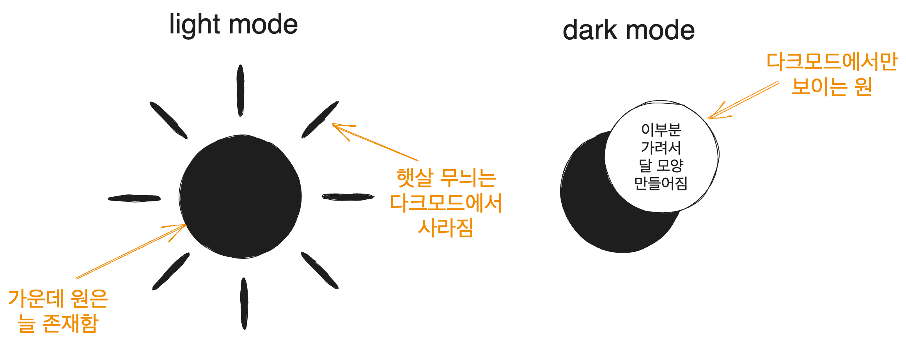
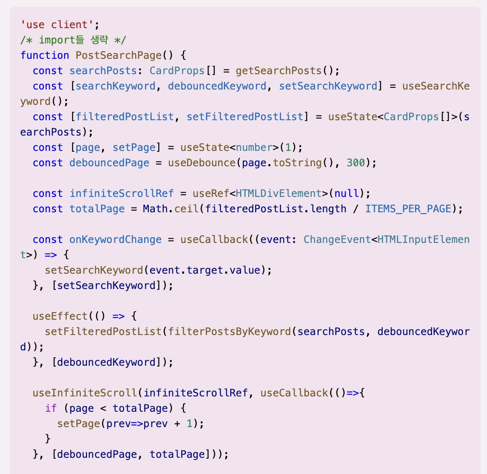
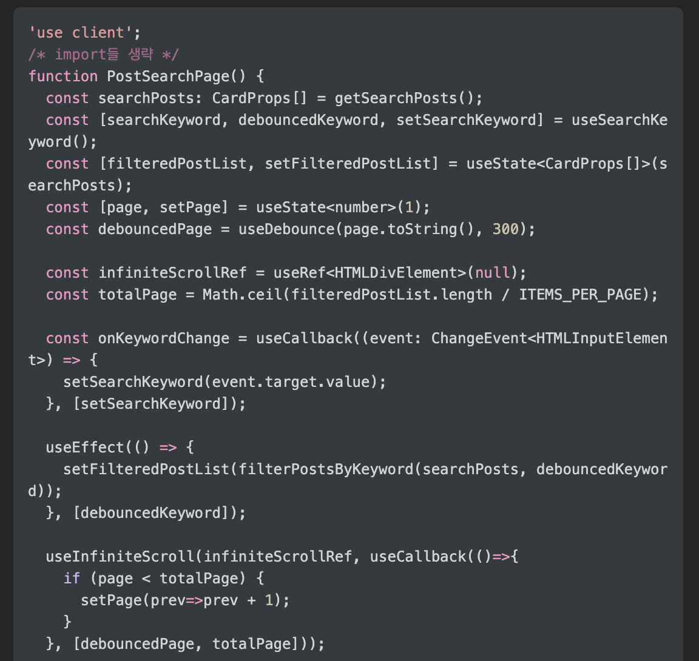

[next-themes를 nextjs 13에서 사용하는 방법을 설명하는 유튜브 영상](https://www.youtube.com/watch?v=RTAJ-enfums)과 [next-themes 문서](https://github.com/pacocoursey/next-themes) 그리고 [web.dev의 접근성 좋은 Theme switch 컴포넌트 만들기 글](https://web.dev/building-a-theme-switch-component/)을 참고하였다.

# 1. 기초 작업

## 1.1. Providers 컴포넌트

현재 블로그에서는 `next-themes`를 사용해서 테마를 관리하고 있다. 하지만 nextjs13으로 넘어오면서 Context API 때문에 코드를 약간 변경해 줘야 한다. 이를 먼저 해보자.

`next-themes`에서는 Context API를 사용한다. 하지만 nextjs 13의 기본 컴포넌트 형식인 서버 컴포넌트에서는 이를 사용할 수 없다. 따라서 클라이언트에서 관리되는 컴포넌트로 변경해 주어야 한다.

`src/app/Provider.tsx`를 만들고 다음과 같이 내용을 작성한다. 이후에 만들 테마들까지 함께 작성해 주었다. 여기서 최대로 중요한 점은 `use client`를 적용하는 것이다.

```tsx
'use client';

import { ThemeProvider } from 'next-themes';

export function Providers({ children }: { children: React.ReactNode }) {
  return (
    <ThemeProvider
      defaultTheme='system'
      enableSystem={true}
      value={{ dark: 'dark', light: 'light', pink: 'pink', darkPink: 'darkPink' }}
      themes={['dark', 'light', 'pink', 'darkPink']}
    >
      {children}
    </ThemeProvider>
  );
};
```

다른 Provider 속성이 필요할 경우 이 컴포넌트에 추가적으로 작성해 줘도 좋다.

그리고 이를 `src/app/layout.tsx` 즉 root layout에 적용해 주자.

```tsx
export default async function RootLayout({
  // Layouts must accept a children prop.
  // This will be populated with nested layouts or pages
  children,
}: {
  children: React.ReactNode
}) {
  return (
    <html lang='en' suppressHydrationWarning>
      <body>
        <Providers>
          <Header navList={blogCategoryList} />
          {children}
          <Footer />
          <GoogleAnalytics />
        </Providers> 
      </body>
    </html>
  );
}
```

## 1.2. 색상 정의하기

`src/styles/theme.css`에 테마 색상들을 적용하자. 블로그에 쓰이는 용도를 기반으로 색상 변수들의 이름을 정의하였다. `[data-theme:"dark"]` 셀렉터를 이용해서 다크모드의 변수들을 정의해 줄 수 있었다.

```css
:root {
  --white:#fff;
  --black:#000;

  --bgColor: #ffffff;
  --textColor: #28292D;

  --contentBgColor: #f1f3f5;
  --contentBgHover: #e9ecef;
  --headerBorderColor: #dee2e6;
  --borderColor: #adb5bd;
  --shadowColor:#868e96;
  --infoTextColor:#495057;

  --codeBlockBgColor:#edf2ff;
  --codeBlockTextColor:#364fc7;
  --accentBgColor:#dbe4ff;
  --accentBgHover:#bac8ff;
  --accentTextColor:#3b5bdb;
  --lightAccentTextColor:#4c6ef5;
  --linkColor:#4263eb;
}

[data-theme='dark'] {
  --bgColor: #212529;
  --textColor: #ececec;

  --contentBgColor: #343a40;
  --contentBgHover: #343a40;
  --headerBorderColor:#495057;
  --borderColor: #868e96;
  --shadowColor:#868e96;
  --infoTextColor:#ced4da;

  --codeBlockBgColor:#343a40;
  --codeBlockTextColor:#edf2ff;
  --accentBgColor:#002395;
  --accentBgHover:#2b4aaf;
  --accentTextColor:#edf2ff;
  --lightAccentTextColor:#748ffc;
  --linkColor:#91a7ff;
}
```

그럼 테마를 사용할 수 있게 되었으니 테마를 사용하기 위한 버튼을 만들어보자.

마침 [web.dev의 테마 스위치 컴포넌트 만들기 글](https://web.dev/building-a-theme-switch-component/)이 있어서 이를 거의 따라하였다. 더 자세한 설명은 해당 글을 참고하자.

# 2. 버튼 구조 잡기

## 2.1. 마크업

테마 변경을 하는 컴포넌트는 의미상 `<button>`이 적절하다. 접근성을 고려하여 `aria-label`과 `aria-live`를 추가하고, `title`은 툴팁을 위해 추가한다.

```tsx
function ThemeSwitch() {
  return (
    <button 
      className={styles.toggle} 
      title='Toggle Light & Dark' 
      aria-label='auto'
      aria-live='polite'
    >
      토글
    </button>
  );
}
```

## 2.2. 아이콘 만들기

아이콘을 위해서는 svg 컴포넌트를 사용할 것이다. 이런 식으로 만들고자 한다.



이를 위해서 지금 작업중인 `components/molecules/themeSwitch`폴더에서 `icon.tsx`를 만들고 `SunAndMoonIcon`컴포넌트를 만들자.

위와 같이 하려면 먼저 중앙에 원을 만들고 주변에 햇살을 표시하는 선들을 그린다. 선들은 그룹핑을 위한 `<g>`로 묶는다. 그리고 다크 모드의 달 모양을 만들기 위해 원의 일부를 가리는 것은 `<mask>`로 처리한다. 이렇게 만든  `SunAndMoonIcon`컴포넌트는 다음과 같이 생겼다.

`<svg>`에 `aria-hidden`속성이 적용되어 있는데 이는 스크린 리더가 이를 무시하게 한다. 아이콘은 그냥 시각적인 장식이니까 그렇다. 그리고 `<g>`의 `stroke`속성은 선 색깔이다.

```tsx
import styles from './theme.module.css';

function SunAndMoonIcon() {
  return (
    <svg className={styles.sunAndMoon} aria-hidden='true' width='24' height='24' viewBox='0 0 24 24'>
      <circle className={styles.sun} cx='12' cy='12' r='6' mask='url(#moonMask)' fill='currentColor'/>
      <g className={styles.sunBeams} stroke='currentColor'>
        <line x1='12' y1='1' x2='12' y2='3' />
        <line x1='12' y1='21' x2='12' y2='23' />
        <line x1='4.22' y1='4.22' x2='5.64' y2='5.64' />
        <line x1='18.36' y1='18.36' x2='19.78' y2='19.78' />
        <line x1='1' y1='12' x2='3' y2='12' />
        <line x1='21' y1='12' x2='23' y2='12' />
        <line x1='4.22' y1='19.78' x2='5.64' y2='18.36' />
        <line x1='18.36' y1='5.64' x2='19.78' y2='4.22' />
      </g>
      <mask className={styles.moon} id='moonMask'>
        <rect x='0' y='0' width='100%' height='100%' fill='white' />
        <circle cx='24' cy='10' r='6' fill='black' />
      </mask>
    </svg>
  );
}
```

## 2.3. 간단한 동작

이를 시험하기 위해 버튼을 클릭하면 테마가 바뀌는 동작을 넣어보자.

`ThemeSwitch`컴포넌트를 다음과 같이 수정한다. 이러면 버튼을 클릭할 시 테마가 바뀌는 것을 볼 수 있다(아이콘은 아직 바뀌지 않는다).

```tsx
'use client';

import { useTheme } from 'next-themes';

import { getThemeName } from '@/utils/theme';

import SunAndMoonIcon from './icon';
import styles from './theme.module.css';

function ThemeSwitch() {
  const { theme, setTheme } = useTheme();

  const isDark = getThemeName(theme) === 'dark';
  const toggleTheme = () => setTheme(isDark ? 'light' : 'dark');

  return (
    <button 
      className={styles.themeToggle} 
      title='Toggle Light & Dark'
      aria-label='auto'
      aria-live='polite'
      onClick={toggleTheme}
    >
      <SunAndMoonIcon />
    </button>
  );
}

export default ThemeSwitch;
```

참고로 `getThemeName`은 그냥 테마 이름을 반환하는 간단한 함수이다.

```ts
export type ThemeType = 'light' | 'dark';

export const getThemeName = (theme: string | undefined): ThemeType => {
  if (theme === 'dark' || theme === 'light') {
    return theme;
  }
  return 'light';
};
```

## 2.4. CSS

해당 가이드를 따라서 아이콘의 CSS를 조작해보자. `theme.module.css`를 수정하면 된다.

먼저 버튼의 클래스인 `.themeToggle`을 설정하자. 버튼의 기본 스타일을 없애고 적절히 디자인한다. 또한 `outline-offset`을 통해 어느 정도의 간격을 준다.

이때 터치스크린을 사용하는 유저에게는 사이즈 `2rem`이 충분하지 못할 수 있기 때문에 `@media (hover: none)`을 통해 터치스크린에서는 사이즈를 더 크게 만들어 준다.

또 색을 위한 변수를 설정하는데 `reset.css`에서 정의해 둔 CSS 변수를 사용한다. `reset.css`의 색상 변수는 현재 테마에 따라 자동으로 색상이 바뀌도록 되어 있으므로 이렇게 하면 테마에 따라 아이콘의 색을 따로 설정해 줄 필요가 없어진다.

```css
.themeToggle{
  --size: 2rem;
  --icon-fill: var(--infoTextColor);
  --icon-fill-hover: var(--textColor);

  background: none;
  border: none;
  padding: 0;

  inline-size: var(--size);
  block-size: var(--size);
  aspect-ratio: 1;
  border-radius: 50%;

  cursor: pointer;
  /* 더 빠른 터치 반응 경험을 제공하도록 해준다 */
  touch-action: manipulation;
  -webkit-tap-highlight-color: transparent;
  outline-offset: 5px;
}

@media (hover: none){
  .themeToggle{
    --size: 48px;
  }
}
```

버튼 내부의 svg 컴포넌트의 크기를 조정하고 `stroke-linecap`으로 선의 양쪽 끝 모양을 둥글게 만들어준다.

```css
.themeToggle > svg{
  inline-size: 100%;
  block-size: 100%;
  stroke-linecap: round;
}
```

그리고 다음과 같이 색상과 선 굵기처럼 자잘한 부분들을 설정하고 애니메이션을 위한 `transform`속성들을 설정한다.

```css
/* 애니메이션 동작의 중심 설정 */
.sunAndMoon > :is(.moon, .sun, .sunBeams){
  transform-origin: center center;
}

.sunAndMoon > :is(.moon, .sun){
  fill: var(--icon-fill);
}

.themeToggle:is(:hover, :focus-visible) > .sunAndMoon > :is(.moon, .sun){
  fill: var(--icon-fill-hover);
}

.sunAndMoon > .sunBeams{
  stroke: var(--icon-fill);
  stroke-width: 2px;
}

.themeToggle:is(:hover, :focus-visible) .sunAndMoon > .sunBeams{
  stroke: var(--icon-fill-hover);
}

/* 다크 모드 스타일링 */
[data-theme="dark"] .sunAndMoon > .sun{
  transform: scale(1.75);
}

[data-theme="dark"] .sunAndMoon > .sunBeams{
  opacity: 0;
}

[data-theme="dark"] .sunAndMoon > .moon > circle{
  transform: translateX(-7px);
}

@supports (cx: 1){
  [data-theme="dark"] .sunAndMoon > .moon > circle{
    transform: translateX(0);
    cx:17;
  }
}
```

이렇게 하면 버튼 클릭 시 테마는 물론 아이콘까지 변경되게 된다.

## 2.5. 애니메이션

자연스러운 아이콘 전환을 위한 애니메이션도 삽입해 보자. 그런데 애니메이션은 저사양 기기에 큰 부하를 걸 수 있고 시각적인 피로 등으로 인해 애니메이션을 보고 싶어하지 않는 설정을 한 사용자도 있을 수 있다.

이런 이유로 애니메이션에는 `prefers-reduced-motion`미디어 쿼리를 사용한다. 해당 쿼리에 관해서는 [애니메이션 동작을 컨트롤하는, prefers-reduced-motion](https://mong-blog.tistory.com/entry/CSS-%EC%95%A0%EB%8B%88%EB%A9%94%EC%9D%B4%EC%85%98-%EB%8F%99%EC%9E%91%EC%9D%84-%EC%BB%A8%ED%8A%B8%EB%A1%A4%ED%95%98%EB%8A%94-prefers-reduced-motion)글을 참고하자.

이런 이유로 애니메이션은 `prefers-reduced-motion: no-preference` 미디어 쿼리 내부에 존재하도록 한다. 애니메이션 진행은 [크롬 개발자 도구의 애니메이션 패널](https://developer.chrome.com/docs/devtools/css/animations/)에서 볼 수도 있다. 진행 그래프까지도 보여준다.

어쨌건 postCSS로 작성되어 있는 원 글의 CSS를 풀어서 작성해 보면 다음과 같이 나온다. `@nest`대용으로 `:has`를 쓸 수도 있겠지만 아직은 지원되지 않는 브라우저가 꽤 있기 때문에 쓰지 않았다.

```css
/* 애니메이션 동작의 중심 설정 */
.sunAndMoon > :is(.moon, .sun, .sunBeams){
  transform-origin: center center;
}

.sunAndMoon > :is(.moon, .sun){
  fill: var(--icon-fill);
}

.themeToggle:is(:hover, :focus-visible) > .sunAndMoon > :is(.moon, .sun){
  fill: var(--icon-fill-hover);
}

.sunAndMoon > .sunBeams{
  stroke: var(--icon-fill);
  stroke-width: 2px;
}

.themeToggle:is(:hover, :focus-visible) .sunAndMoon > .sunBeams{
  stroke: var(--icon-fill-hover);
}

/* 다크 모드 스타일링 */
[data-theme="dark"] .sunAndMoon > .sun{
  transform: scale(1.75);
}

[data-theme="dark"] .sunAndMoon > .sunBeams{
  opacity: 0;
}

[data-theme="dark"] .sunAndMoon > .moon > circle{
  transform: translateX(-7px);
}

@supports (cx: 1){
  [data-theme="dark"] .sunAndMoon > .moon > circle{
    transform: translateX(0);
    cx:17;
  }
}

@media (prefers-reduced-motion: no-preference){
  .sunAndMoon > .sun{
    transition: transform .5s var(--ease-elastic-3);
  }

  .sunAndMoon > .sunBeams{
    transition: 
        transform .5s var(--ease-elastic-4),
        opacity .5s var(--ease-3)
      ;
  }

  /* 달 아이콘을 위한 애니메이션 */
  .sunAndMoon .moon > circle{
    transition: transform .25s var(--ease-out-5);
  }

  @supports (cx: 1){
    .sunAndMoon .moon > circle{
      transition: cx .25s var(--ease-out-5);
    }
  }

  [data-theme='dark'] .sunAndMoon > .sun{
    transform:scale(1.75);
    transition-timing-function: var(--ease-3);
    transition-duration: .25s;
  }

  /* 애니메이션의 역동성을 위해 해로 전환될 때 약간의 회전을 부여한다 */
  [data-theme='dark'] .sunAndMoon > .sunBeams{
    transform: rotateZ(-25deg);
    transition-duration: .15s;
  }

  [data-theme='dark'] .sunAndMoon > .moon > circle{
    transition-delay: .25s;
    transition-duration: .5s;
  }
}
```

버튼 클릭 시 자연스럽게 아이콘이 전환되는 애니메이션까지 보이게 되었다.

# 3. 새로운 테마 만들기

## 3.1. 테마 색상 만들기

나는 vscode에서 [Light Pink Theme](https://marketplace.visualstudio.com/items?itemName=mgwg.light-pink-theme)을 사용하고 있고 이 테마를 매우 좋아한다. 따라서 라이트 테마와 다크 테마에 더해 핑크 테마도 만들어 주도록 하자. 앞서 `Provider`컴포넌트를 만들 때 pink, darkPink 테마에 대한 부분도 미리 만들어 놓았다.

위에서 보았던 `ThemeProvider`의 `value`와 `themes` props를 보면 알 수 있다.

```tsx
export function Providers({ children }: { children: React.ReactNode }) {
  return (
    <ThemeProvider
      defaultTheme='system'
      enableSystem={true}
      value={{ dark: 'dark', light: 'light', pink: 'pink', darkPink: 'darkPink' }}
      themes={['dark', 'light', 'pink', 'darkPink']}
    >
      {children}
    </ThemeProvider>
  );
};
```

이미 거의 모든 요소들의 색상을 CSS 변수명 기반으로 작성해 놓았으므로 테마들의 색을 `src/styles/theme.css`에 작성해 놓으면 자동으로 적용된다.

해당 색상들은 그냥 pink 테마의 경우 [vscode의 Light Pink Theme](https://marketplace.visualstudio.com/items?itemName=mgwg.light-pink-theme)와 [open color](https://yeun.github.io/open-color/)를 참고하였다.

또한 darkPink 테마의 경우 [kuromi Color Palette](https://www.color-hex.com/color-palette/95814)와 [Kuromi colours Color Palette](https://www.color-hex.com/color-palette/1022257)에서 몇 가지의 색상을 따왔고, 해당 컬러 팔레트에서 분홍과 보라 계통이 생각보다 잘 어울린다는 것을 보아 역시 [open color](https://yeun.github.io/open-color/)에서도 몇 가지 색을 가져왔다.

그렇게 정의한 색상 변수들은 다음과 같다.

```css
[data-theme='pink'] {
  --bgColor: #f5f0f3;
  --textColor: #632c3b;

  --contentBgColor: #f5e3ef;
  --contentBgHover:#f5e3ef;
  --headerBorderColor:#ffdeeb;
  --borderColor: #af4670;
  --shadowColor:#868e96;
  --infoTextColor:#d6336c;
  
  --codeBlockBgColor:#ffdeeb;
  --codeBlockTextColor:#a61e4d;
  --accentBgColor:#ffdeeb;
  --accentBgHover:#fcc2d7;
  --accentTextColor:#c2255c;
  --lightAccentTextColor:#f06595;
  --linkColor:#d6336c;
}

[data-theme='darkPink'] {
  --bgColor: #252526;
  --textColor: #f695c6;

  --contentBgColor: #343a40;
  --contentBgHover: #343a40;
  --headerBorderColor:#565656;

  --borderColor: #FFD6CD;
  --shadowColor:#868e96;
  --infoTextColor:#c097cf;

  --codeBlockBgColor:#845ef7;
  --codeBlockTextColor:#f3f0ff;
  --accentBgColor:#845ef7;
  --accentBgHover:#5f3dc4;
  --accentTextColor:#e5dbff;
  --lightAccentTextColor:#9775fa;
  --linkColor:#b197fc;
}
```

## 3.2. 새로운 테마 전환 동작 설계

지금 적용할 수 있는 테마는 light, dark의 2종류이다. 그런데 여기 pink와 darkPink를 적용하기 위한 버튼을 하나 더 만들 것이다. 그 동작은 다음과 같이 생각할 수 있다.

현재 있는 해/달 버튼의 경우 현재 상태를 나타내며 누를 시 다른 테마로 이동한다. light 상태이면 dark로, dark 상태이면 light로 간다. 즉 다음과 같이 동작하게 될 것이다.

|현재 테마|해/달 버튼 클릭시|
|---|---|
|light|dark|
|dark|light|

그러면 핑크 테마 전환 버튼은 어떻게 동작해야 할까? 핑크 테마의 존재가 그렇게 익숙하지 않은 것을 생각했을 때 현재 테마에 기반한 테마로 전환해 주는 것이 적절하다고 본다. 따라서 다음과 같은 동작을 생각해볼 수 있다.

또한 핑크 테마에 있는 상태에서 핑크 토글 버튼을 또 누르면 pink <-> darkPink 테마의 전환이 이루어지는 게 적절할 것 같다. 여기까지를 표로 나타내면 다음과 같다.

|현재 테마|해/달 버튼 클릭|핑크 버튼 클릭|
|---|---|---|
|light|dark|pink|
|dark|light|darkPink|
|pink|?|darkPink|
|darkPink|?|pink|

그런데 핑크 테마에서 해/달 버튼을 다시 누르면 무슨 일이 일어나야 하는가? light/dark 테마에서 핑크 버튼을 클릭했을 때 일어났던 일을 생각해볼 때 반대의 경우도 기대할 수 있을 거라고 생각했다. light pink 테마에서 해 버튼을 눌렀는데 갑자기 dark 테마로 가는 것을 기대하지는 않을 거라고 보았다. 따라서 다음과 같이 테마 토글 버튼들이 동작하도록 설계해 보았다.

|현재 테마|해/달 버튼 클릭|핑크 버튼 클릭|
|---|---|---|
|light|dark|pink|
|dark|light|darkPink|
|pink|light|darkPink|
|darkPink|dark|pink|

## 3.3. 기존 버튼을 컴포넌트로 분리

슬슬 버튼들을 그냥 컴포넌트로 분리해 주는 게 나을 것 같다. 따라서 `themeSwitch`폴더 내에 `lightDarkToggle`과 `pinkToggle` 폴더를 만들고 각각에 `index.tsx`와 `styles.module.css`를 만들어준다. `LightDarkToggle`컴포넌트는 다음과 같이 만들어진다.

그리고 `lightDarkToggle/styles.module.css`에는 위에서 정의한 CSS 중 해/달 버튼에 해당되는 부분을 복사해서 넣어주자.

```tsx
// src/components/molecules/themeSwitch/lightDarkToggle/index.tsx
import styles from './styles.module.css';

function LightDarkToggle({ toggleClick }: {toggleClick: () => void}) {
  {/* aria-hidden은 스크린 리더가 이를 무시하게 한다. 아이콘은 그냥 시각적인 장식이니까
  그리고 stroke는 선 색깔이다 */}
  return (
    <button 
      className={styles.themeToggle} 
      title='Toggle Light & Dark' 
      aria-label='auto'
      aria-live='polite'
      onClick={toggleClick}
    >
      <svg className={styles.sunAndMoon} aria-hidden='true' width='24' height='24' viewBox='0 0 24 24'>
        <circle className={styles.sun} cx='12' cy='12' r='6' mask='url(#moonMask)' fill='currentColor'/>
        <g className={styles.sunBeams} stroke='currentColor'>
          <line x1='12' y1='1' x2='12' y2='3' />
          <line x1='12' y1='21' x2='12' y2='23' />
          <line x1='4.22' y1='4.22' x2='5.64' y2='5.64' />
          <line x1='18.36' y1='18.36' x2='19.78' y2='19.78' />
          <line x1='1' y1='12' x2='3' y2='12' />
          <line x1='21' y1='12' x2='23' y2='12' />
          <line x1='4.22' y1='19.78' x2='5.64' y2='18.36' />
          <line x1='18.36' y1='5.64' x2='19.78' y2='4.22' />
        </g>
        <mask className={styles.moon} id='moonMask'>
          <rect x='0' y='0' width='100%' height='100%' fill='white' />
          <circle cx='24' cy='10' r='6' fill='black' />
        </mask>
      </svg>
    </button>

  );
}

export default LightDarkToggle;
```

## 3.4. 핑크 버튼 마크업

핑크 버튼도 다음과 같이 만들어줄 수 있다. 위에서와 비슷하게 마크업을 잡고 적당한 svg 아이콘을 넣어주면 된다. 나는 light/dark 토글 버튼이 해/달로 된 것에 착안해서 [별 svg 아이콘](https://www.svgrepo.com/svg/529943/star-fall-minimalistic)을 찾아서 넣어주었다.

```tsx
import styles from './styles.module.css';

function PinkToggle({ toggleClick }: {toggleClick: () => void}) {
  return (
    <button
      className={styles.pinkThemeToggle} 
      title='Toggle Pink & Dark Pink' 
      aria-label='auto'
      aria-live='polite'
      onClick={toggleClick}
    >
      <svg aria-hidden='true' width='30' height='30' viewBox='0 0 24 24' className={styles.star} fill='none'>
        <g className={styles.starBody} stroke='currentColor'>
          <path d='M8.32181 14.4933C7.3798 15.9862 6.90879 16.7327 7.22969 17.3433C7.55059 17.9538 8.45088 18.0241 10.2514 18.1647L10.7173 18.201C11.2289 18.241 11.4848 18.261 11.7084 18.3785C11.9321 18.4961 12.0983 18.6979 12.4306 19.1015L12.7331 19.469C13.9026 20.8895 14.4873 21.5997 15.1543 21.5084C15.8213 21.417 16.1289 20.5846 16.7439 18.9198L16.9031 18.4891C17.0778 18.0161 17.1652 17.7795 17.3369 17.6078C17.5086 17.4362 17.7451 17.3488 18.2182 17.174L18.6489 17.0149C20.3137 16.3998 21.1461 16.0923 21.2374 15.4253C21.3288 14.7583 20.6185 14.1735 19.1981 13.0041M17.8938 10.5224C17.7532 8.72179 17.6829 7.8215 17.0723 7.5006C16.4618 7.1797 15.7153 7.65071 14.2224 8.59272L13.8361 8.83643C13.4119 9.10412 13.1998 9.23797 12.9554 9.27143C12.7111 9.30488 12.4622 9.23416 11.9644 9.09271L11.5113 8.96394C9.75959 8.46619 8.88375 8.21732 8.41508 8.68599C7.94641 9.15467 8.19528 10.0305 8.69303 11.7822' />
          <path d='M13.5 6.5L13 6M9.5 2.5L11.5 4.5' />
          <path d='M6.5 6.5L4 4'/>
          <path d='M6 12L4.5 10.5M2 8L2.5 8.5' />
        </g>
      </svg>
    </button>
  );
}

export default PinkToggle;
```

## 3.5. 테마 토글 버튼 동작

핑크 테마 버튼을 스타일링하기 전에 먼저 위에서 설계했던 동작을 구현하자. `themeSwitch/index.tsx`에서 적당한 `toggleClick`함수들을 정의해 주고 위에서 만든 컴포넌트들에 props로 넘겨주면 된다. `isDarkOrPink`변수를 만들어서 조정했다.

```tsx
function ThemeSwitch() {
  const { theme, setTheme } = useTheme();

  const isDarkOrPink = getThemeName(theme) === 'dark' || getThemeName(theme) === 'pink';
  const toggleTheme = () => setTheme(isDarkOrPink ? 'light' : 'dark');
  const togglePinkTheme = () => setTheme(isDarkOrPink ? 'darkPink' : 'pink');

  return (
    <div className={styles.container}>
      <LightDarkToggle toggleClick={toggleTheme} />
      <PinkToggle toggleClick={togglePinkTheme} />
    </div>
  );
}
```

## 3.6. 핑크 테마 버튼 디자인

CSS는 다음과 같이 디자인했다. `.pinkThemeToggle`은 `LightDarkToggle`을 디자인할 때와 비슷하고 적절한 색을 찾아 준 정도다. 그리고 버튼 호버 시 마치 별이 떨어지는 것과 같은 애니메이션을 주도록 했다.

```css
.pinkThemeToggle{
  --size: 36px;
  --pink2: #fcc2d7;
  --pink5: #f06595;
  --pink7: #d6336c;

  --darkPinkBgColor:#f695c6;
  --darkPinkIconColor:#845ef7;

  /* 테스트를 위한 모바일 화면 숨기기 임시 주석처리
  display: none; */
  background: var(--pink2);

  border: none;
  padding: 0;

  inline-size: var(--size);
  block-size: var(--size);

  aspect-ratio: 1;
  border-radius: 50%;

  cursor: pointer;
  /* 더 빠른 터치 반응 경험을 제공하도록 해준다 */
  touch-action: manipulation;
  -webkit-tap-highlight-color: transparent;
  outline-offset: 5px;
  
  overflow:hidden;
}

@media (min-width: 768px){
  .pinkThemeToggle{
    display:block;
  }
}

.pinkThemeToggle > .star{
  padding-top:3px;
  padding-left:1px;
}

.pinkThemeToggle > .star > .starBody{
  stroke: var(--pink5);

  stroke-width: 1.5px;
  stroke-linecap: round;
}

[data-theme='dark'] .pinkThemeToggle{
  background:var(--darkPinkBgColor);
}

[data-theme='dark'] .pinkThemeToggle > .star > .starBody{
  stroke: var(--darkPinkIconColor);
}

[data-theme='darkPink'] .pinkThemeToggle{
  background:var(--darkPinkBgColor);
}

[data-theme='darkPink'] .pinkThemeToggle > .star > .starBody{
  stroke: var(--darkPinkIconColor);
}

@keyframes starFall{
  from{
    transform:translate(-1.5rem, -1.5rem);
  }
  to{
    transform:translate(1.5rem, 1.5rem);
  }
}

@media (prefers-reduced-motion: no-preference){
  .pinkThemeToggle:hover > .star{
    animation:starFall 1s ease-in-out infinite;
  }
}
```

`[data-theme='dark']`와 `[data-theme='darkPink']`는 `:is` 유사 클래스를 사용하거나 좀더 오래된 방식으로는 `[data-theme^='dark']`(dark로 시작하는 data-theme 속성을 모두 선택) 선택자를 사용해서 더 짧게 둘 다 선택할 수 있다.

# 4. 동작 만들기

원문인 [building a theme switch component](https://web.dev/building-a-theme-switch-component/#javascript)에는 JS를 이용해서 페이지 로드 시 flickering 없이 테마가 바로 적용되도록 JS를 작성하는 부분이 있다.

하지만 `next-themes`에서 이를 알아서 해주기 때문에 여기서 할 필요는 없다. 만약 필요한 사람이 이 글을 본다면, 원문 링크를 참고하자.

# 5. 추가 수정 작업

(2023-09-22 작성)

## 5.1. 테마 토글 버튼 디자인 수정

버튼에 hover하면 애니메이션이 나오는 게 괜찮은 것 같아서 애니메이션을 넣었었다. `LightDarkToggle`의 경우 호버시 약간 회전하는 효과를, `PinkToggle`의 경우 별이 떨어지는 효과를 넣었다.

그런데 모바일에서는 한번 클릭시 다른 곳을 클릭할 때까지 호버 상태가 유지되기 때문에 이상해 보인다. 따라서 이를 PC에서만 보이도록 수정하자.

호버가 가능하고 정확한 포인터를 쓰는 경우, 그러니까 `@media (hover: hover)` 그리고 `@media (pointer: fine)` 미디어 쿼리를 적용하면 된다. 애니메이션이 쓰인 곳에 다음과 같이 nested media query를 적용하자.

```css
@media (prefers-reduced-motion: no-preference){
  @media (hover: hover) and (pointer: fine){
    .pinkThemeToggle:hover > .star{
      animation:starFall 1s ease-in-out infinite;
    }
  }
}
```

`LightDarkToggle`의 CSS에도 똑같이 적용해 주면 된다.

```css
@media (prefers-reduced-motion: no-preference){
  @media (hover: hover) and (pointer: fine){
    .sunAndMoon:hover > .sunBeams{
      animation:rotate 1s ease-in-out infinite;
    }
  
    [data-theme^='dark'] .sunAndMoon:hover :is(.sun, .moon){
      animation:rotate-moon 1s ease-in-out infinite;
    }
  }
}
```

## 5.2. 코드 테마 수정

이 블로그는 마크다운 기반으로 글을 작성할 수 있다. 그리고 마크다운을 블로그 글에 필요한 정보들로 변환해 주는 작업은 contentlayer라는 라이브러리가 담당한다. 그러면 코드 블록은 어떻게 하이라이팅될까?

이는 [rehype-pretty-code](https://rehype-pretty-code.netlify.app/)라는 라이브러리가 해주고 있다. `contentlayer.config.js`파일을 보면 이를 사용하고 있는 걸 확인도 가능하다. 이 설정파일을 좀 만지면 코드 블록의 테마를 바꿀 수 있다. 일단 핑크 테마는 light-plus 테마가 좋아보인다.

일단 다음과 같이 설정해 주자. 내 `contentlayer.config.js`의 일부이다.

```js
const rehypePrettyCodeOptions = {
  theme: {
    light: 'github-light',
    pink: 'light-plus',
    dark: 'github-dark',
  },
};

export default makeSource({
  contentDirPath: 'posts',
  documentTypes: [MDXPost, Post],
  markdown: {
    remarkPlugins: [remarkGfm, remarkMath, changeImageSrc, headingTree, makeThumbnail],
    rehypePlugins: [[rehypePrettyCode, rehypePrettyCodeOptions], rehypeKatex, highlight],
  },
  mdx: {
    remarkPlugins: [remarkGfm, remarkMath, changeImageSrc, headingTree, makeThumbnail],
    rehypePlugins: [[rehypePrettyCode, rehypePrettyCodeOptions], rehypeKatex, highlight],
  },
});
```

darkPink 같은 경우 [shiki에서 미리 제공하는 테마들](https://unpkg.com/browse/shiki@0.14.2/themes/)을 거의 다 찾아보았지만 딱히 어울려 보이는 게 없었다. 따라서 [light pink theme의 dark pink 테마 설정 파일](https://github.com/mgwg/light-pink-theme/blob/master/themes/Dark%20Pink-color-theme.json)을 가져다 쓰기로 했다.

해당 json 파일을 가져와서 적당히 포매팅하고 `public/themes/dark-pink-themes.json`에 저장해 놓았다. 그리고 `contentlayer.config.js`의 `rehypePrettyCodeOptions`에 다음과 같이 추가해 주었다. 해당 파일을 가져와서 `JSON.parse`를 해주면 된다.

```js
const rehypePrettyCodeOptions = {
  theme: {
    light: 'github-light',
    pink: 'light-plus',
    dark: 'github-dark',
    darkPink:JSON.parse(
      readFileSync('./public/themes/dark-pink-theme.json')
    ),
  },
};
```

### 5.2.1. 테마 색상 부족 문제

그런데 문제가 하나 생겼다. dark pink theme의 color json을 가져와서 적용했는데 몇몇 부분에서 색이 너무 밋밋하게 나오고 있었다. 예를 들어 현재 pink theme(코드 테마는 [light-plus](https://unpkg.com/shiki@0.14.2/themes/light-plus.json))에서 [NextJS metadata 오류 해결](http://localhost:3000/posts/nextjs-13-trouble-1)글에 있는 내 코드 하나를 보면 이렇게 나오고 있다.



같은 코드를 dark pink theme으로 바꾸면 다음과 같이 나온다.



가장 밋밋하게 나온 코드를 찍은 것이기 때문에 더 낫게 나온 부분들도 있다. 하지만 상대적으로 밋밋하다는 것은 여전하다. 그리고 [vscode의 light pink theme](https://marketplace.visualstudio.com/items?itemName=mgwg.light-pink-theme)에 있는 dark pink 테마는 원래 좀 색이 밋밋하기는 하지만 그것보다도 더 적용되는 색이 적다! 뭔가 제대로 적용되지 못하고 있는 것 같다.

따라서 잘 적용되고 있는 [shiki의 light-plus 테마 설정 파일](https://unpkg.com/shiki@0.14.2/themes/light-plus.json)을 가져와서 비교해 보기로 했다. light-plus 테마 파일이 약 200줄 더 긴 걸 보면 뭔가 더 있기는 있는 것 같다.

둘 다 json 파일이므로 [JSON 파일의 차이를 찾아 주는 사이트](https://www.jsondiff.com/)를 사용하였다.

거기서 가르쳐주는 차이들을 light plus 테마들로 고치자. 예를 들어서 `$schema` 프로퍼티를 추가하는 것과 같이. 그러면 `editorIndentGuide.background`는 deprecated 되었고 `editorIndentGuide.background1`를 사용하라는 등 몇 가지 warning을 띄워준다.

하지만 대부분의 것들은 노가다였다. `tokenColors`에 정의되어 있는 색상들을 하나하나 찾아 주는 그런 일...

예를 들어서 이런 방식으로 진행되었다. light plus 테마 설정 파일의 `tokenColors`배열에는 다음과 같은 프로퍼티가 있고 dark pink 테마 설정 파일에는 없다.

```json
{
    "name": "Function declarations",
    "scope": [
      "entity.name.function",
      "support.function",
      "support.constant.handlebars",
      "source.powershell variable.other.member",
      "entity.name.operator.custom-literal"
    ],
    "settings": {
        "foreground": "#795E26"
    }
},
```

그럼 이 `#795E26`이라는 색상은 어디에 쓰이고 있는가? `semanticTokenColors.customLiteral`이 바로 이 색상이다. 그리고 이 속성은 dark pink 테마 설정 파일에도 `#d4d4d4`로 정의되어 있다. 그러면 dark pink 테마 설정 파일에는 다음과 같이 추가해 주면 되는 것이다.

```json
{
    "name": "Function declarations",
    "scope": [
      "entity.name.function",
      "support.function",
      "support.constant.handlebars",
      "source.powershell variable.other.member",
      "entity.name.operator.custom-literal"
    ],
    "settings": {
        "foreground": "#d4d4d4"
    }
},
```


# 참고

Building a theme switch component https://web.dev/building-a-theme-switch-component/

Dark Theme in NextJs 13 – Using React Context in Server Components https://www.youtube.com/watch?v=RTAJ-enfums

next themes github https://github.com/pacocoursey/next-themes

svg의 viewbox 속성 https://tecoble.techcourse.co.kr/post/2021-10-24-svg-viewBox/

prefers-reduced-motion https://mong-blog.tistory.com/entry/CSS-%EC%95%A0%EB%8B%88%EB%A9%94%EC%9D%B4%EC%85%98-%EB%8F%99%EC%9E%91%EC%9D%84-%EC%BB%A8%ED%8A%B8%EB%A1%A4%ED%95%98%EB%8A%94-prefers-reduced-motion

search icon https://www.svgrepo.com/svg/532555/search

star fall icon https://www.svgrepo.com/svg/529943/star-fall-minimalistic

rehype pretty code docs https://rehype-pretty-code.netlify.app/

pointer media query https://developer.mozilla.org/en-US/docs/Web/CSS/@media/pointer