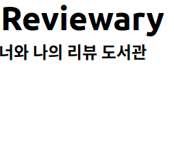
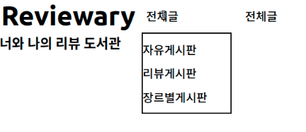

# 1. styled-components 설치

css를 그대로 쓰는 대신 styled-components 라이브러리를 사용할 것이므로 이를 client 폴더 내부에 설치해 준다.

```
npm install styled-components
```

그리고 잘 되는지 확인해 보기 위해 styled-components  공식 문서에 있는 Button 코드를 가져와서 한번 메인 페이지에 넣어 보았다.

```tsx
import React from 'react';
import styled from 'styled-components';

const MyButton = styled.button`
  background: transparent;
  border-radius: 3px;
  border: 2px solid palevioletred;
  color: palevioletred;
  margin: 0 1em;
  padding: 0.25em 1em;
`;

function MainPage() {
  return (
    <MyButton>예시버튼</MyButton>
  );
}

export default MainPage;
```

예시 버튼이 잘 표시되는 것을 알 수 있다. 이제 본격적으로 메인 페이지의 요소들을 만들어 보자.

# 2. 사이트 로고

사이트 로고에 들어갈 문구는 프로젝트 팀원인 하늘(https://github.com/hamuneulbo) 님의 아이디어대로 만들었다. `Reviewary - 너와 나의 리뷰 도서관` 이라는 문구를 로고에 적기로 하였다. 지금은 아직 페이지의 형태만 간단하게 잡는 단계이므로 적당히 만들었다.

```tsx
const HeaderMainLogo = styled.h1`
  font-size:3rem;
  margin: 3px;
`;

const HeaderSubLogo = styled.h2`
  font-size:1.5rem;
  margin:0;
`;

function HeaderLogo() {
  return (
    <>
      <HeaderMainLogo>Reviewary</HeaderMainLogo>
      <HeaderSubLogo>너와 나의 리뷰 도서관</HeaderSubLogo>
    </>
  );
}
```

그렇게 멋지지는 않지만, 적당히 큰 글씨로 쓰여진 로고같은 게 사이트에 들어갔다.



이렇게 로고를 만들고 난 뒤에는, 로고는 대부분의 페이지에서 재사용될 것으로 예상되므로 로고 컴포넌트를 src/common/HeaderLogo.js 로 분리해 주었다.

# 3. 컨테이너 만들기

앞으로 자주 쓰일 듯한 간단한 컨테이너들을 만들었다. 빠르게 만들기 위해서 아주 단순하게, display : flex를 이용해서 내부 요소들을 가로로 정렬할 것인지, 세로로 정렬할 것인지만 정해주는 컨테이너를 만들었다. 요소 정렬과 같은 기능들은 추후 추가하려고 한다.

```tsx
/* src/common/HorizontalContainer.js */
import styled from 'styled-components';

const HorizontalContainer = styled.div`
  display: flex;
  flex-direction: row;
`;

export default HorizontalContainer;

```

```tsx
/* src/common/VerticalContainer.js */
import styled from 'styled-components';

const VerticalContainer = styled.div`
  display: flex;
  flex-direction: column;
`;

export default VerticalContainer;
```

그래서 이를 이용해 먼저, 로고에 쓰인 `HeaderMainLogo` 와 `HeaderSubLogo` 를 세로로 정렬되어 있도록 바꾸었다.

```tsx
/* src/common.HeaderLogo.js 일부 */
function HeaderLogo() {
  return (
    <VerticalContainer>
      <HeaderMainLogo>Reviewary</HeaderMainLogo>
      <HeaderSubLogo>너와 나의 리뷰 도서관</HeaderSubLogo>
    </VerticalContainer>
  );
}
```

# 4. 메뉴

흔한 드롭다운 메뉴를 만들기로 했다. 드롭다운 메뉴를 만들면서 참고한 문서는 아래의 참고 문서들에 적어 놓았다. 참고 문서의 `드롭다운 메뉴 2` 에 있는 문서를 참고하여 비슷한 방식으로 드롭다운 메뉴의 헤더를 표현하는 `DropDownMenuHeader` 컴포넌트를 구현하였다.

```tsx
const DropDownMenuHeader = styled.div`
  font-weight: 500;
  font-size: 1.3rem;
  background: #ffffff;
  height:1.8rem;
  width:9rem;
`;
```

그리고 드롭다운 메뉴 활성화 시 보이게 될 서브메뉴들을 담는 컨테이너인 `DropDownMenuContainer` 를 만든다. 

```tsx
const DropDownMenuContainer = styled.div`
  color:#000000;
  width:10rem;
  margin: 0 auto;
`;
```

드롭다운 메뉴 리스트를 담는 `ul` 요소인 `DropDownMenuList` 를 만든다. 이 안에는 `DropDownListItem` 들이 들어가서 드롭다운 메뉴를 구성하게 될 것이다.

```tsx
const DropDownMenuList = styled.ul`
  padding: 0;
  margin: 0;
  background: #ffffff;
  border:2px solid #000000;
  box-sizing: border-box;
  color:#000000;
  font-size: 1.3rem;
  font-weight: 500;
  &:first-child{
    padding-top: 0.8rem;
  }
`;

const DropDownListItem = styled.li`
  list-style: none;
  margin-bottom: 0.8rem;
`;
```

그리고 이 모든 것을 묶는 `DropDownMenu` 컴포넌트를 만든다. 이때 드롭다운 메뉴에서 특정 메뉴를 선택할 경우가 있을 수 있는데, 이때 어떤 메뉴가 선택되었는지를 알려주는 selectedMenu state를 만들어 주고 onClick 이벤트를 이용하여 특정 드롭다운 메뉴 항목을 클릭했을 때 그 메뉴가 선택 상태가 되도록 했다.

이러한 동작은 드롭다운 메뉴의 어떤 항목을 클릭했을 때 특정 게시판으로 이동하거나 특정 페이지로 이동하는 등의 동작으로 추후에 대체될 것이다.

드롭다운 메뉴는 여러 개를 만들 것이므로, 드롭다운 메뉴의 헤더 이름과 항목 이름은 각각 문자열과 배열로 받을 수 있게 하였다. 배열 map 함수의 key로는 각 항목을 그대로 준 것을 볼 수 있는데(`key={item}`) 이는 보통 게시판 이름은 겹치지 않게 작명하기 때문에 게시판 이름을 key로 써도 무방하기 때문이다. 만약 서로 이름이 겹치는 항목들을 드롭다운 메뉴에 넣어야 하는 경우가 온다면 드롭다운 메뉴 항목들을 넣는 배열(여기서는 dropDownItemList)의 원소들을 객체로 만든 후 각 객체에 `id` 를 따로 만들어서 넣어주는 게 좋을 것이다. 

```tsx
function DropDownMenu({ menuName, dropDownItemList }) {
  const [selectedMenu, setSelectedMenu] = useState(null);

  const onOptionSelected = (value) => () => {
    setSelectedMenu(value);
  };

  return (
    <VerticalContainer>
      <DropDownMenuHeader>{menuName}</DropDownMenuHeader>
      <DropDownMenuContainer>
        <DropDownMenuList>
          {dropDownItemList.map((item) => (
            <DropDownListItem
              onClick={onOptionSelected(item)}
              key={item}
            >
              {item}
            </DropDownListItem>
          ))}
        </DropDownMenuList>
      </DropDownMenuContainer>
    </VerticalContainer>
  );
}
```

이제는 드롭다운 메뉴가 동작하게 만들어 보자. 참고 문서에서는 드롭다운 메뉴의 헤더를 클릭할 시에 메뉴 항목들이 내려와서 표시되도록 했다. 하지만 일반적으로 우리가 사용하는 사이트들에서는 드롭다운 메뉴를 클릭해서 동작시키는 경우보다는 드롭다운 메뉴 헤더에 마우스를 올리면(`hover`) 드롭다운 메뉴 항목들이 표시되는 게 일반적이다.

따라서 이를 css를 이용해서 구현해 보자. 생각보다 그렇게 어렵지 않다. 먼저 지금 상태에서는 `DropDownMenuContainer`에 들어있는, 드롭다운 메뉴의 서브메뉴들이 언제나 페이지에 표시되고 있을 것이다. 이를 평소 상태에는 안 보이고 마우스를 올려야 보이도록 설정해 주자. 이제 `DropDownMenuContainer`는 그 위에 마우스가 올려져 있는 한 언제나 표시될 것이다.

```tsx
const DropDownMenuContainer = styled.div`
  display: none;
  color:#000000;
  width:10rem;
  margin: 0 auto;
  &:hover {
    display: block;
  }
`;
```

그런데 평소에 `DropDownMenuContainer` 는 페이지에 렌더링되지 않는 상태이다. 어떤 조치를 취해주지 않으면 이 컨테이너 요소에 마우스를 올리는 것은 불가능하다. 일반적인 드롭다운 메뉴의 방식대로, 드롭다운 메뉴의 제목이 표시된 헤더에 마우스를 올리면 `DropDownMenuContainer`가 렌더링되도록 하자. 이때 `DropDownMenuHeader` 의 형제인`DropDownMenuContainer` 들만 보이게 해야 하므로 `+` 셀렉터를 적절히 이용하였다. 이렇게 셀렉터를 이용해서 다른 요소를 선택하는 법은 이창희(https://xo.dev/)님이 알려주셨다. 분명 CSS를 배울 때 이런 셀렉터가 있다는 것을 지나치듯 본 것 같은데, CSS를 조만간 복습해야겠다고 느꼈다.

```tsx
const DropDownMenuHeader = styled.div`
  margin: 0;
  padding: 1rem;
  font-weight: 500;
  font-size: 1.3rem;
  background: #ffffff;
  height:1.8rem;
  width:9rem;
  &:hover + ${DropDownMenuContainer}{
    display:block;
  }
`;
```

이때 헤더와 메뉴 요소 사이 간격이 있으면, 헤더에서 메뉴로 hover가 이어질 수 없는 현상이 발생한다.(그 간격을 지나가는 동안 마우스 커서가 메뉴 요소를 벗어나 버리므로)그렇게 되면 드롭다운 메뉴의 항목을 선택할 수 없게 된다. 따라서 드롭다운 메뉴 요소들 간의 margin을 모두 0으로 설정한다. 만약 시각적으로 간격을 표시해야 되는 일이 있으면 padding을 사용한다. (margin은 요소 외부의 간격을, padding은 요소 내부의 간격을 설정한다)

이제 드롭다운 메뉴에 적절한 이름 문자열과 항목 배열을 props로 전달하면 드롭다운 메뉴가 잘 렌더링되고 작동한다.



이제 `DropDownMenu` 도 `src/common` 폴더에 `DropDownMenu.js` 파일을 만들어서 분리해 준다.

# 5. 캐로셀 구현하기

이미지를 옆으로 넘기면서 정보를 확인하는 메뉴의 이름을 잘 몰라서 처음에는 '슬라이더 메뉴' 등으로 검색했었다. 그러던 중 이런 메뉴를 캐로셀이라고 하는 것을 알았다. 지금 만들고 있는 사이트에는 이런 캐로셀이 있는 게 좋다고 생각되어 이것을 메인 페이지에 구현하기로 했다.

일단 캐로셀 슬라이드에 띄울 이미지들을 적당히 픽사베이(https://pixabay.com/) 에서 다운받았다. 여러 사이즈의 이미지를 받아보았다. 책 표지 이미지도 서점 홈페이지에서 받았다. 책 표지는 일반적인 사진과 달리 세로가 길고 이런 이미지는 책이 아니면 흔치 않기 때문에...

# 6. 참고

styled-components 공식문서 https://styled-components.com/

드롭다운 메뉴 만들기 https://programming-oddments.tistory.com/177

드롭다운 메뉴 2 https://andela.com/insights/react-js-tutorial-on-creating-a-custom-select-dropdown/

css flex https://studiomeal.com/archives/197

css selecter https://poiemaweb.com/css3-selector

다양한 방법으로 캐로셀 구현하기 https://programming119.tistory.com/211

react hook으로 캐로셀 구현하기 https://velog.io/@peppermint100/JSReact-Hooks%EB%A1%9C-Carousel-Slider-%EB%A7%8C%EB%93%A4%EA%B8%B0

화살표 형태의 버튼 만들기 https://www.w3schools.com/howto/howto_css_arrows.asp
