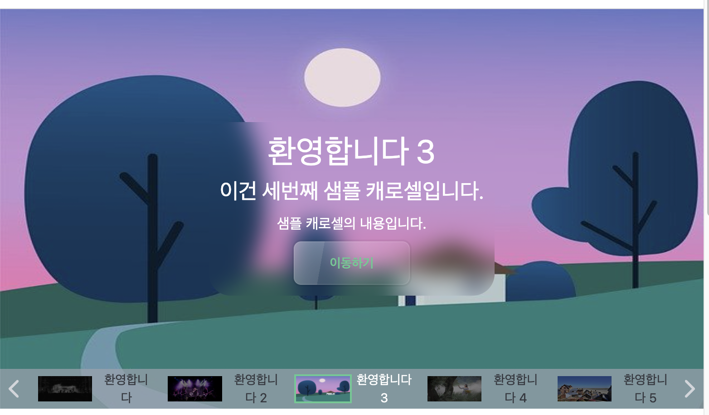
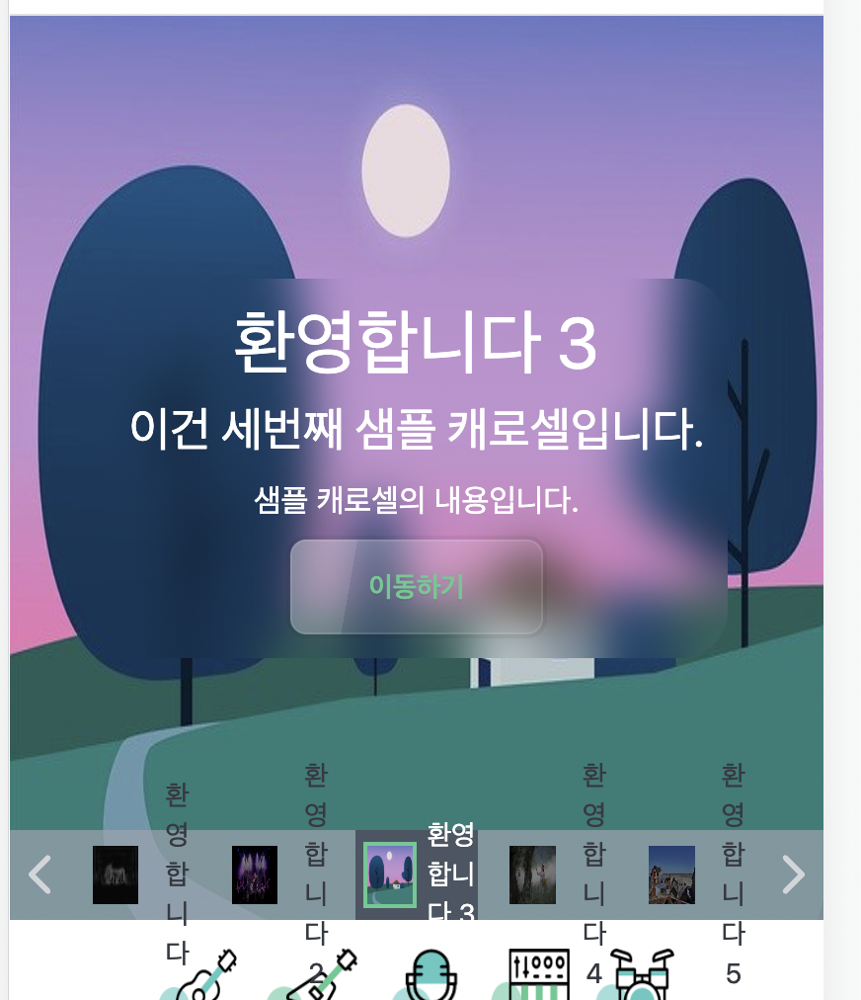

# 1. 화살표 버튼을 네비게이션 바로

지금의 캐로셀에서는 캐로셀을 앞뒤 페이지로 이동시킬 수 있는 화살표 버튼이 있는데 이걸 네비게이션 바로 옮기도록 하겠다. 캐로셀의 이동은 아래의 네비게이션 바에서 모두 책임지는 게 나을 것 같다는 판단이다.

그런데 이미 캐로셀 네비게이션 컴포넌트에서는 각 네비게이션 아이템을 클릭할 때 그 아이템에 해당하는 페이지로 이동하는 기능을 담당하고 있다. 즉 캐로셀의 페이지를 조절하는 기능을 이미 가지고 있다는 것이다. `carouselIndex`와 `setCarouselIndex`를 props로 받는 것으로 확인할 수 있다.

즉 props 등을 바꿔 줄 필요는 없다. 원래 있던 `prevClick`함수와 `nextClick`함수 그리고 그 함수를 클릭 이벤트에 따라 발동시키던 버튼을 캐로셀 네비게이션 컴포넌트로 옮겨 주기만 하면 된다.

이를 수정한 `CarouselNavigation`컴포넌트는 다음과 같아진다.

```tsx
function CarouselNavigation({
  items,
  carouselIndex,
  setCarouselIndex,
}: {
  items: CarouselItemType[];
  // 현재 캐로셀이 보여주고 있는 인덱스
  carouselIndex: CarouselIndexType;
  setCarouselIndex: React.Dispatch<React.SetStateAction<CarouselIndexType>>;
}) {
  //버튼의 상태를 결정하는 함수
  const determineCarouselItemState = (itemIndex: number) => {
    if (itemIndex === carouselIndex.currentIndex) {
      return "active";
    } else if (
      /* 
    캐로셀의 초반부나 후반부 페이지가 활성화되어있을 경우 
    활성화 요소를 가운데에 배치하지 못하더라도 5개를 일단 채운다 
    */
      carouselIndex.currentIndex === 0 ||
      carouselIndex.currentIndex === 1
    ) {
      return itemIndex < 5 ? "pending" : "inactive";
    } else if (
      carouselIndex.currentIndex === items.length - 1 ||
      carouselIndex.currentIndex === items.length - 2
    ) {
      return itemIndex >= items.length - 5 ? "pending" : "inactive";
    } else {
      return carouselIndex.currentIndex - 2 <= itemIndex &&
        itemIndex <= carouselIndex.currentIndex + 2
        ? "pending"
        : "inactive";
    }
  };

  // 특정 인덱스의 페이지로 이동하는 함수
  const onCarouselNavigationItemClick = (itemIndex: number) => {
    setCarouselIndex((prev) => {
      if (prev.currentIndex === itemIndex) {
        return prev;
      } else {
        return {
          previousIndex: prev.currentIndex,
          currentIndex: itemIndex,
        };
      }
    });
    //console.log(carouselIndex);
  };

  const handlePrevClick = () => {
    setCarouselIndex((prev) => ({
      previousIndex: prev.currentIndex,
      currentIndex: (prev.currentIndex - 1 + items.length) % items.length,
    }));
  };

  const handleNextClick = () => {
    setCarouselIndex((prev) => ({
      previousIndex: prev.currentIndex,
      currentIndex: (prev.currentIndex + 1) % items.length,
    }));
  };

  return (
    <dl className="flex flex-row w-full h-10">
      <button onClick={handlePrevClick} className="z-10 h-full">
        <IoIosArrowBack className="text-gray-500" size={30} />
      </button>
      {items.map((item, index) => (
        <CarouselNavigationItem
          key={index}
          item={item}
          itemState={determineCarouselItemState(index)}
          onItemClick={() => {
            onCarouselNavigationItemClick(index);
          }}
        />
      ))}
      <button onClick={handleNextClick} className="z-10 h-full">
        <IoIosArrowForward className="text-gray-500" size={30} />
      </button>
    </dl>
  );
}
```

이참에 `determineCarouselItemState` 함수도 컴포넌트 외부로 빼버리자. 다음과 같이 함수를 수정하고 컴포넌트 외부로 뺀 후 `CarouselNavigationItem`컴포넌트에서 사용될 때 인수를 적절히 바꿔주면 된다.

```tsx
//버튼의 상태를 결정하는 함수
function determineCarouselItemState(
  itemIndex: number,
  carouselCurrentIndex: number,
  carouselTotalLength: number
) {
  if (itemIndex === carouselCurrentIndex) {
    return "active";
  } else if (carouselCurrentIndex === 0 || carouselCurrentIndex === 1) {
    return itemIndex < 5 ? "pending" : "inactive";
  } else if (
    carouselCurrentIndex === carouselTotalLength - 1 ||
    carouselCurrentIndex === carouselTotalLength - 2
  ) {
    return itemIndex >= carouselTotalLength - 5 ? "pending" : "inactive";
  } else {
    return carouselCurrentIndex - 2 <= itemIndex &&
      itemIndex <= carouselCurrentIndex + 2
      ? "pending"
      : "inactive";
  }
}
```

그리고 캐로셀 컴포넌트에선 `prevClick`함수와 `nextClick`함수 그리고 그 함수를 클릭 이벤트에 따라 발동시키던 화살표 버튼을 삭제해 준다. 이제 캐로셀을 렌더링해 보면 다음과 같이 화살표 버튼이 네비게이션 바에 들어가 있으며 페이지 전환 기능도 잘 동작하는 것을 볼 수 있다.


# 2. 캐로셀 네비게이션 디자인 리뉴얼

## 2.1 네비게이션 바 디자인

지금 네비게이션 바는 매우 못생겼다. 따라서 이를 최대한 리뉴얼해보고자 한다. 역시 메이플스토리 메인 페이지의 캐로셀 디자인을 참고하였다.

먼저 네비게이션 바를 캐로셀 내부에 포함시킨다. 현재 캐로셀 페이지 컴포넌트들은 absolute position으로 관리되고 있기 때문에 레이아웃 내에서 명목상으론 공간을 차지하지 않고 따라서 네비게이션 바만 배치한다고 생각하면 된다.

고로 캐로셀을 감싸는 div element 내에 `CarouselNavigation`컴포넌트를 넣고 하단부에 배치하기 위해 `items-center`클래스를 추가한다. 그러면 캐로셀 컴포넌트의 구조는 다음과 같아진다.

```tsx
<section>
  <div
    className="relative flex flex-row items-end justify-between w-full h-[60vh]"
    onTouchStart={handleTouchStart}
    onTouchMove={handleTouchMove}
  >
    {/* 이 CarouselItem들은 absolute position이기 때문에 레이아웃에서 공간을 차지하지 않는다 */}
    {items.map((item, index) => (
      <CarouselItem
        key={item.id}
        item={item}
        itemState={determineCarouselItemState(index)}
      />
    ))}
    <CarouselNavigation
      items={items}
      carouselIndex={carouselIndex}
      setCarouselIndex={setCarouselIndex}
    />
  </div>
</section>
```

이제 캐로셀 네비게이션 바의 색을 좀 바꾸고 투명도를 넣어서 캐로셀에 표시되고 있는 이미지가 약간은 네비게이션 바 너머로 비치게 하자. 그럼으로써 네비게이션 바가 캐로셀에 포함되어 있다는 것을 좀더 확실히 보여주도록 하자. 거기에 따라 화살표의 색도 바꾸어주고, 네비게이션 바의 높이도 캐로셀의 높이와 상대적이 되도록 설정한다. 그리고 z-index를 설정하여 캐로셀의 이미지들이 네비게이션 바를 가리지 않도록 한다.

따라서 `dl` 태그에는 `h-[10%] bg-gray-400/70 z-20`클래스를 주었과 화살표 버튼의 색은 `text-gray-300` 클래스로 설정했다. 완성된 네비게이션 바 컴포넌트는 다음과 같다.

```tsx
function CarouselNavigation({
  items,
  carouselIndex,
  setCarouselIndex,
}: {
  items: CarouselItemType[];
  // 현재 캐로셀이 보여주고 있는 인덱스
  carouselIndex: CarouselIndexType;
  setCarouselIndex: React.Dispatch<React.SetStateAction<CarouselIndexType>>;
}) {
  // 특정 인덱스의 페이지로 이동하는 함수
  const onCarouselNavigationItemClick = (itemIndex: number) => {
    setCarouselIndex((prev) => {
      if (prev.currentIndex === itemIndex) {
        return prev;
      } else {
        return {
          previousIndex: prev.currentIndex,
          currentIndex: itemIndex,
        };
      }
    });
  };

  const handlePrevClick = () => {
    setCarouselIndex((prev) => ({
      previousIndex: prev.currentIndex,
      currentIndex: (prev.currentIndex - 1 + items.length) % items.length,
    }));
  };

  const handleNextClick = () => {
    setCarouselIndex((prev) => ({
      previousIndex: prev.currentIndex,
      currentIndex: (prev.currentIndex + 1) % items.length,
    }));
  };

  return (
    <dl className="flex flex-row w-full h-[10%] bg-gray-400/70 z-20">
      <button onClick={handlePrevClick} className="z-10 h-full">
        <IoIosArrowBack className="text-gray-300" size={30} />
      </button>
      {items.map((item, index) => (
        <CarouselNavigationItem
          key={index}
          item={item}
          itemState={determineCarouselItemState(
            index,
            carouselIndex.currentIndex,
            items.length
          )}
          onItemClick={() => {
            onCarouselNavigationItemClick(index);
          }}
        />
      ))}
      <button onClick={handleNextClick} className="z-10 h-full">
        <IoIosArrowForward className="text-gray-300" size={30} />
      </button>
    </dl>
  );
}
```

## 2.2 CarouselNavigationItem 디자인

이제 네비게이션의 각 아이템을 디자인한다. 먼저 네비게이션 아이템들의 멋없는 테두리를 모두 없앤 후 네비게이션 바에 적절한 간격을 두고 위치하도록 했다. 또한 활성화된 아이템의 경우 이미지를 더 밝게 보여주고 이미지에 초록색 테두리를 치는 등으로 강조해 주었다. 텍스트 색도 다르게 했다.

이를 적용한 `CarouselNavigationItem` 컴포넌트는 다음과 같다.

```tsx
function CarouselNavigationItem({
  item,
  itemState,
  onItemClick,
}: {
  item: CarouselItemType;
  itemState: string;
  onItemClick: () => void;
}) {
  // active는 현재 캐로셀에서 보이고 있는 아이템에 해당하는 버튼의 상태
  // pending은 화면에는 보이지만 활성화되어 있지 않은 버튼의 상태
  const carouselItemConfig: { [key: string]: string } = {
    active: "text-base-100 hover:bg-gray-600",
    pending:
      "brightness-50 text-gray-500 hover:brightness-100 hover:bg-gray-400",
    inactive: "hidden",
  };

  return (
    <button
      onClick={onItemClick}
      className={`flex-1 flex flex-row mx-1 items-center transition-all duration-700 ${carouselItemConfig[itemState]}`}
    >
      <dt
        className={`flex-1 w-full h-full ${
          itemState === "active" ? "py-1.5 px-1" : "p-2"
        }`}
      >
        
      </dt>
      <dd className="flex-1 text-sm">{item.title}</dd>
    </button>
  );
}
```

이제 아까보단 좀 나은 캐로셀 네비게이션의 모습을 볼 수 있다.



## 2.3 모바일 화면의 뷰 수정

하지만 아직 네비게이션 바에 문제가 하나 있다. 화면의 크기에 따라 뷰가 너무 차이난다는 것이다. 가령 큰 화면에선 좀 더 못생긴 네비게이션이 나온다.

그래도 큰 화면에서 생기는 문제는 넘어가줄 만 하다. 가장 큰 문제는 모바일 화면이다. 모바일 화면에서는 네비게이션 바가 너무 작아서 아이템들을 제대로 볼 수 없다.



이는 그렇게 세련되지는 않았지만 간단한 방식으로 해결해 주었다. 모바일 화면에서는 네비게이션 바에서 각 페이지의 이미지를 보여주지 않도록 하는 것이다. 이는 tailwind에서 반응형 디자인을 아주 쉽게 할 수 있도록 제공해 주기 때문에 더 쉽게 해결할 수 있었다.

`CarouselNavigationItem`에서 이미지를 포함하고 있는 dt태그를 기본적으로 hidden(display:none과 같다)클래스로 설정해 주고 화면 너비가 768px 이상이 될 때만 보이도록 설정해 주었다. 코드는 다음과 같지만 dt 태그 외에는 변경사항이 없으므로 그것만 보면 된다.

```tsx
function CarouselNavigationItem({
  item,
  itemState,
  onItemClick,
}: {
  item: CarouselItemType;
  itemState: string;
  onItemClick: () => void;
}) {
  // active는 현재 캐로셀에서 보이고 있는 아이템에 해당하는 버튼의 상태
  // pending은 화면에는 보이지만 활성화되어 있지 않은 버튼의 상태
  const carouselItemConfig: { [key: string]: string } = {
    active: "text-base-100 hover:bg-gray-600",
    pending:
      "brightness-50 text-gray-500 hover:brightness-100 hover:bg-gray-400",
    inactive: "hidden",
  };

  return (
    <button
      onClick={onItemClick}
      className={`flex-1 flex flex-row mx-1 items-center transition-all duration-700 ${carouselItemConfig[itemState]}`}
    >
      <dt
        className={`hidden md:block flex-1 w-full h-full ${
          itemState === "active" ? "py-1.5 px-1" : "p-2"
        }`}
      >
        
      </dt>
      <dd className="flex-1 text-sm">{item.title}</dd>
    </button>
  );
}
```

이렇게 하면 모바일 화면에서는 아래와 같이 네비게이션 바에서 이미지가 보이지 않게 된다. 좀 볼품없어지기는 했지만 아까처럼 텍스트가 네비게이션 바를 넘어가서 늘어지는 것보다는 낫다.


# 3. 네비게이션 바에 페이지 번호 표시

이는 캐로셀 네비게이션에서 캐로셀의 현재 인덱스와 전체 items를 props로 받기 때문에 디자인만 하면 간단하게 구현할 수 있다. 위치를 잡는 건 absolute position으로 처리하고 나머지 디자인은 네비게이션 바 아이템과 같은 색, 그리고 적절한 크기로 구현하면 된다.

다음과 같은 버튼을 `CarouselNavigation` 컴포넌트의 dl 태그 안에 추가한다.

```tsx
<button className="absolute bottom-[15%] btn btn-xs bg-gray-400/70 hover:bg-gray-400 w-28 h-7 z-30 border-none rounded-none rounded-t-lg text-lg tracking-[0.3rem]">
  {carouselIndex.currentIndex + 1} / {items.length}
</button>
```

그러면 다음과 같이 페이지 번호가 표시된다.


# 4. 일정 시간마다 자동 넘김

setInterval함수를 사용하면 간단히 할 수 있다. carousel 컴포넌트의 useEffect에서 인터벌을 설정하여, 일정 시간마다 캐로셀이 다음 인덱스로 넘어가도록 설정한다.

다음 코드를 `Carousel` 컴포넌트에 추가하면 된다. 그러면 3초마다 캐로셀 화면이 전환된다.

```tsx
useEffect(() => {
  const carouselTimer = setInterval(() => {
    setCarouselIndex((prev) => ({
      previousIndex: prev.currentIndex,
      currentIndex: (prev.currentIndex + 1) % items.length,
    }));
  }, 3000);

  return () => {
    clearInterval(carouselTimer);
  };
}, []);
```

# 참고

setInterval 사용 https://ko.javascript.info/settimeout-setinterval

완벽한 캐로셀 만들기 1부 https://code.tutsplus.com/ko/tutorials/create-the-perfect-carousel-part-1--cms-29481
