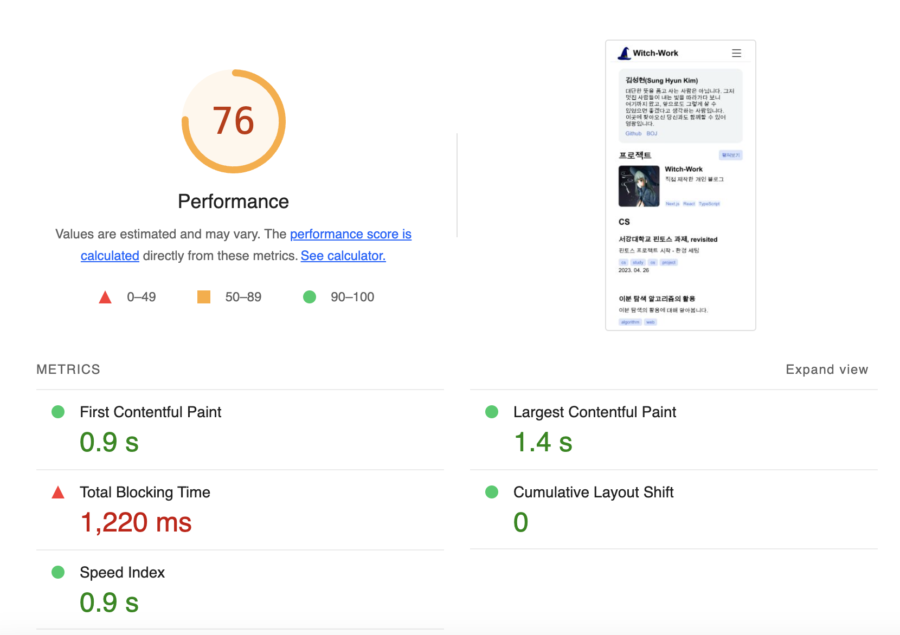
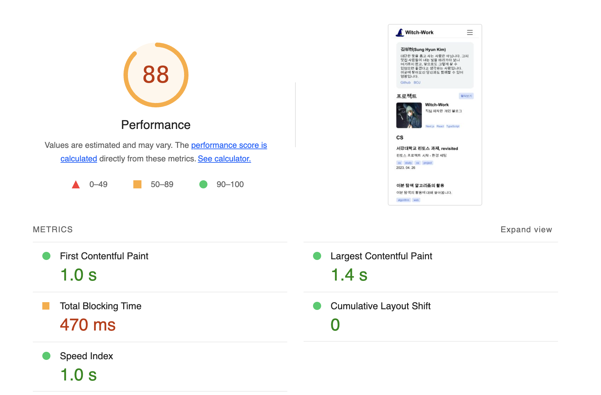
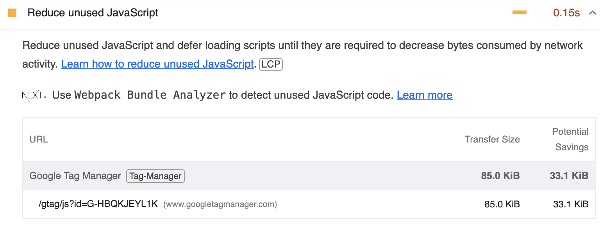
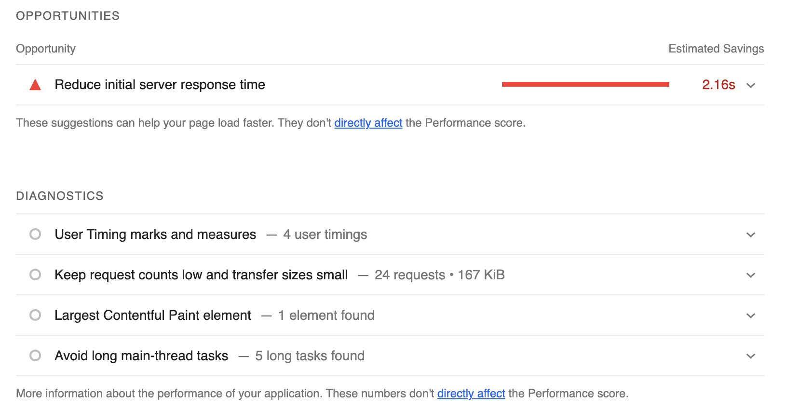

# 0. 개요

블로그의 많은 기능이 완성되었다. 하지만 배포한 페이지에 들어가 보면 여전히 페이지가 꽤 느린 것을 알 수 있다. 따라서 이를 최적화하여 누가 봐도 빠른 페이지를 만들어 보는 작업을 시작하려 한다.

예전에 카카오톡에서 빠른 속도를 위해 서버 기술 혁신을 하는 프로젝트에 붙였던 이름인 [겁나 빠른 황소 프로젝트](https://www.kakaocorp.com/page/detail/9350)의 이름을 따서 이 작업을 `겁나 빠른 마녀`로 명명하였다.

# 1. Lighthouse 검사

먼저 웹 페이지의 품질을 검사하는 구글의 유명한 오픈소스 Lighthouse로 내 페이지를 진단해 보았다. [크롬 익스텐션](https://chrome.google.com/webstore/detail/lighthouse/blipmdconlkpinefehnmjammfjpmpbjk)을 설치하고 나서 간단하게 진단 보고서를 얻을 수 있었다.



대충 접근성과 SEO는 괜찮고(최고다 next-seo!), 성능은 별로이며 Best Practice도 미흡하다. PWA도 아직 멀었다고 한다. 특히 성능과 같은 경우 나머지 요소는 다 괜찮은데 Total blocking time(사용자가 페이지와 상호작용할 수 있기까지 걸리는 시간)이 1220ms로 처참하다. [TBT가 200ms 아래로 내려와야 좋은 점수를 받을 수 있는데](https://developer.chrome.com/docs/lighthouse/performance/lighthouse-total-blocking-time/?utm_source=lighthouse&utm_medium=lr#how-lighthouse-determines-your-tbt-score) 그 6배 이상 걸리는 것이다.

따라서 성능 최적화를 열심히 하자. 생각나는 대로 최적화한 기록을 순서대로 쓴다. 어떻게 최적화하는지 몰라서 하나하나 찾아가며 했기 때문에 순서는 좀 뒤죽박죽이다.

# 2. getStaticProps로 연산 이동

메인 페이지를 보면 지금 `Home` 컴포넌트 내에서 계속 `getSortedPosts`를 호출하고 있다. 이 부분은 빌드 이후에 특별히 바뀌는 부분이 아니므로 `getStaticProps`로 이동시키자. 이렇게 하면 빌드 시에만 호출되기 때문에 빌드 시간이 좀 늘어날 수도 있겠지만, 빌드된 페이지는 빠르게 로딩될 것이다.

또한 저장된 글들의 정보 중 글 목록 렌더링에 필요한 정보들만 넘기도록 하자.

일단 `src/pages/index.tsx`의 `Home`컴포넌트에서 `getSortedPosts`를 호출하는 부분을 지우고, `src/pages/index.tsx`의 `getStaticProps`를 다음과 같이 수정한다.

```tsx
/* getStaticProps에서 쓰이는 타입 */
interface CardProps{
  title: string;
  description: string;
  image?: string;
  date: string;
  tags: string[];
  url: string;
}
/* 필요한 요소들만 객체에서 뽑아내는 함수 */
function propsProperty(post: DocumentTypes) {
  const { title, description, date, tags, url } = post;
  return { title, description, date, tags, url };
}

export const getStaticProps: GetStaticProps = () => {
  const categoryPostMap: {[key: string]: CardProps[]}={};

  blogCategoryList.forEach((category)=>{
    categoryPostMap[category.url]=getSortedPosts()
      .filter((post: DocumentTypes)=>{
        return post._raw.flattenedPath.split('/')[0]===category.url.split('/').pop();
      })
      .slice(0, 3)
      .map((post: DocumentTypes)=>{
        return propsProperty(post);
      });
  });

  return { props: { categoryPostMap } };
};
```

이렇게 하면 `{"카테고리 URL":[카테고리에 속한 글 목록 상위 3개]}`가 담긴 객체가 페이지 컴포넌트의 props로 넘어간다. 이를 이용해서 아까와 똑같이 글 목록을 보여주자.

```tsx
export default function Home({
  categoryPostMap
}: InferGetStaticPropsType<typeof getStaticProps>) {
  return (
    <main className={styles.pagewrapper}>
      <div className={styles.container}>
        <Profile />
        {/* 프로젝트 목록을 만들기 */}
        <ProjectList />
        <article>
          {/* 카테고리별 글 목록을 만들기 */}
          {blogCategoryList.map((category) => {
            const categoryPostList=categoryPostMap[category.url];

            return categoryPostList.length?
              <Category 
                key={category.title} 
                title={category.title} 
                url={category.url} 
                items={categoryPostList}
              />:null;
          })}
        </article>
      </div>
    </main>
  );
}
```

이렇게 하고 나니 lighthouse 지표가 매우 좋아졌다. 470ms면 거의 반으로 줄어든 것이다! 빌드 시점에 연산을 미리 해두고, 필요한 정보를 넘기는 게 얼마나 중요한지 알 수 있다.



# 3. 이미지 최적화 - next/image

지금 내 블로그의 가장 큰 문제는 앞서 보았든 로딩이 너무 느리다는 것이다. NextJS에서는 여러 이미지 최적화를 지원하기에 이것부터 해보자.

일단 Nextjs의 이미지 최적화를 켠다. `next.config.js`에서 아까 Cloudflare 때문에 꺼놨던 image 최적화를 켜주자. 적어도 메인 페이지에서는 next/image의 `Image` 컴포넌트만 사용하고 있기 때문에 이게 모두 적용될 것이다.

```ts
const { withContentlayer } = require('next-contentlayer');

/** @type {import('next').NextConfig} */
const nextConfig = {
  images:{
    unoptimized:false,
  },
  reactStrictMode: false,
  swcMinify:false,
};

module.exports = (withContentlayer(nextConfig));
```

# 4. 이미지 최적화 - image size

lighthouse의 제안을 보면 이미지 사이즈를 잘 설정하라고 하며 `next/image` 튜토리얼의 [sizes 항목](https://nextjs.org/docs/pages/api-reference/components/image#sizes)으로 링크를 걸어 준다.

`Image` 태그의 sizes 프로퍼티는 렌더링 시 srcset에서 어떤 이미지를 다운로드할지를 결정하며, 또한 `next/image`에서 어떤 source set을 자동 생성할지를 결정한다.

sizes를 설정해 주지 않으면 기본 크기를 쓰거나 고정 크기 이미지를 자동으로 생성하는데, 만약 이미지가 실제로 들어갈 크기보다 상당히 큰 크기의 이미지를 생성하게 되어 성능에 안 좋은 영향을 미치게 될 수 있다. 이를 방지하기 위해 sizes를 설정해 주자.

메인 페이지의 이미지는 프로젝트 소개에 쓰이는 게 전부인데, 이는 `src/components/projectCard/image/index.tsx`에 정의되어 있다. 여기에 있는 Image 컴포넌트에 sizes를 지정해주자.

```tsx
// src/components/projectCard/image/index.tsx
function ProjectImage({title, image}: {title: string, image: string}) {
  return (
    <div className={styles.container}>
      <Image
        className={styles.image}
        src={image} 
        alt={`${title} 프로젝트 사진`}
        width={300}
        height={300}
        {/* sizes가 추가되었다. */}
        sizes='(max-width: 768px) 150px, 300px'
      />
    </div>
  );
}
```

이렇게 하니까 TBT가 300ms 초반대 정도로 내려왔고, 200ms대를 찍기도 했다. 그리고 생각해 보니 메인 페이지에는 이미지가 하나 더 있다. 바로 내 소개 컴포넌트에 있는 프로필 사진이다. 여기에도 sizes를 지정해주자.

```tsx
// src/components/profile/index.tsx
function Profile() {
  return (
    <article className={styles.profile}>
      <Image 
        className={styles.image} 
        src={blogConfig.picture} 
        alt={`${blogConfig.name}의 프로필 사진`} 
        width={100}
        height={100}
        sizes='100px'
      />
      <Intro />
    </article>
  );
}
```

그리고 `next.config.js` 파일에서 `images.imageSizes`와 `images.deviceSizes`를 지정하여 [이미지의 srcset을 지정할 수 있다.](https://nextjs.org/docs/pages/api-reference/components/image#devicesizes)이를 이용해서 이미지의 srcset이 지나치게 많아지지 않도록 하자.

이렇게 하면 이미지에 대한 초기 요청이 들어왔을 때 이미지를 생성하는 시간이 줄어드는 효과가 있다고 한다. [참고](https://fe-developers.kakaoent.com/2022/220714-next-image/) 따라서 srcset이 4개만 생기도록 다음과 같이 `next.config.js`를 편집하였다.

```ts
const { withContentlayer } = require('next-contentlayer');

/** @type {import('next').NextConfig} */
const nextConfig = {
  images:{
    unoptimized:false,
    imageSizes: [64, 384],
    deviceSizes: [768, 1920],
  },
  reactStrictMode: false,
  swcMinify:false,
};

module.exports = (withContentlayer(nextConfig));
```

더 정진하여 200ms 아래로 내려보자.

# 5. 안 쓰이는 JS 삭제

Lighthouse에서는 `Reduce unused JavaScript`도 제안한다. 제안 전문은 이렇다.

```
Reduce unused JavaScript and defer loading scripts until they are required to decrease bytes consumed by network activity. 
```

대충 사용하지 않는 JS 코드는 좀 삭제하거나 필요할 때까지 로딩을 미루라는 말이다. 무슨 JS 코드가 말썽인지 볼까?



누가 봐도 google tag manager가 문제인 것 같다. 따라서 이를 제공하는 컴포넌트인 `GoogleAnalytics.tsx`를 편집하자. script의 로딩 전략을 `lazyOnload`로 바꾸면 된다. [이렇게 해도 ga는 잘 작동한다.](https://blog.jarrodwatts.com/track-user-behaviour-on-your-website-with-google-analytics-and-nextjs)

```tsx
const GoogleAnalytics = () => {
  if (blogConfig.googleAnalyticsId == null) {
    return null;
  }
  return (
    <>
      <Script
        src={`https://www.googletagmanager.com/gtag/js?id=${blogConfig.googleAnalyticsId}`}
        strategy='lazyOnload'
      />
      <Script id='google-analytics' strategy='lazyOnload'>
        {`
          window.dataLayer = window.dataLayer || [];
          function gtag(){window.dataLayer.push(arguments);}
          gtag('js', new Date());

          gtag('config', '${blogConfig.googleAnalyticsId}');
        `}
      </Script>
    </>
  );
};
```

별로 시간이 크게 줄어들지는 않는 것 같다. [그리고 구글 태그매니저는 원래 네트워크 요청을 하므로 실행 시간에 약간 영향을 줄 수밖에 없다.](https://stackoverflow.com/questions/69449732/reduce-unused-javascript-from-gtm-script)

[다만 여기를 보니 익스텐션도 lighthouse 측정에 영향을 주는 것 같다. 시크릿 창에서 해보니 점수가 꽤 높다.](https://all-dev-kang.tistory.com/entry/Next-%EC%9B%B9%ED%8E%98%EC%9D%B4%EC%A7%80%EC%9D%98-%EC%84%B1%EB%8A%A5-%EA%B0%9C%EC%84%A0%EC%9D%84-%ED%95%B4%EB%B3%B4%EC%9E%90-1-featlighthouse)

# 6. 폰트, 서버리스 최적화

그리고 혹시나 해서 canvas를 이용해 썸네일을 만들 때 쓰는 폰트도 더 가벼운 걸 썼다. [경량화된 노토 산스 한글 웹폰트](http://theeluwin.github.io/NotoSansKR-Hestia/)에서 Bold 체를 사용하였다. 기존에 쓰던 `.otf` 파일은 거의 5MB였는데 이건 300KB도 안 된다.

그리고 [기본 서버리스 리전](https://vercel.com/docs/concepts/functions/serverless-functions/regions#select-a-default-serverless-region)을 바꾼다. 인천 리전이 있길래 그곳으로 했다. 이렇게 하면 supabase의 한국 리전과도 가까우니까 api 라우트가 더 빨라질 거라고 기대된다. (기본 리전은 미국 어딘가였다)

어디가 어디에 영향을 주었는지 완벽히 알아내기는 힘들지만, 이쯤 하니까 대충 200ms대에 TBT가 안정화되었다. 100ms대를 찍기도 했다. 물론 이런 게 원래 그렇듯이 시간이 가끔 널뛰어서 500ms를 찍기도 하고 그랬지만, 그래도 꽤 빨라졌다.


더 줄일 수도 있겠지만 메인 페이지는 충분히 빨라진 것 같고, 또 메인 페이지 외에 글 상세 페이지나 글 목록 페이지 등 불러올 이미지가 많은 곳에서는 여전히 페이지가 느리며 아직 해야 할 것도 많으므로 이 정도만 해두자. Best Practice도 어느 정도는 고쳐야 하고...

# 7. Reduce initial server response time

많은 실험이 있었는데, 위와 같이 처음의 서버 응답 시간을 줄이라는 이야기가 많이 나왔다. 이게 나오지 않을 때는 퍼포먼스가 크게 좋아졌지만 이 메시지를 꽤 자주 보게 되었다.



이건 사실 LCP에 영향을 미치게 되는데, 사용자에게 보이는 부분에도 확실히 영향을 미친다? 왜냐? 페이지가 페인트되는 부분이니까...이 부분에 대한 최적화는 한 3번째 글에서 진행할 듯 하다.

먼저 글목록/글상세페이지에서 할 수 있는 걸 해보자.

# 참고

Lighthouse 사용 https://velog.io/@dell_mond/Lighthouse-%EC%82%AC%EC%9A%A9%EB%B2%95

Lighthouse의 결과 지표들 https://medium.com/jung-han/%EB%9D%BC%EC%9D%B4%ED%8A%B8%ED%95%98%EC%9A%B0%EC%8A%A4-%EC%84%B1%EB%8A%A5-%EC%A7%80%ED%91%9C-%EC%82%B4%ED%8E%B4%EB%B3%B4%EA%B8%B0-83df3dc96fb9

네이버의 SEO 문서 https://searchadvisor.naver.com/guide/seo-basic-intro

Next 이미지 최적화하기 https://fe-developers.kakaoent.com/2022/220714-next-image/

Nextjs Script 태그 https://nextjs.org/docs/app/api-reference/components/script#strategy

lazyOnload로 로딩해도 gtag는 잘 작동한다. https://blog.jarrodwatts.com/track-user-behaviour-on-your-website-with-google-analytics-and-nextjs

https://all-dev-kang.tistory.com/entry/Next-%EC%9B%B9%ED%8E%98%EC%9D%B4%EC%A7%80%EC%9D%98-%EC%84%B1%EB%8A%A5-%EA%B0%9C%EC%84%A0%EC%9D%84-%ED%95%B4%EB%B3%B4%EC%9E%90-1-featlighthouse

http://theeluwin.github.io/NotoSansKR-Hestia/

https://www.oooooroblog.com/posts/62-optimize-images

https://velog.io/@ooooorobo/Lighthouse%EB%A1%9C-Next.js-%ED%94%84%EB%A1%9C%EC%A0%9D%ED%8A%B8-%EC%84%B1%EB%8A%A5-%EA%B0%9C%EC%84%A0%ED%95%98%EA%B8%B0#%EB%9D%BC%EC%9D%B4%ED%8A%B8%ED%95%98%EC%9A%B0%EC%8A%A4%EA%B0%80-%EB%8F%8C%EC%A7%80-%EC%95%8A%EC%9D%84-%EB%95%8C