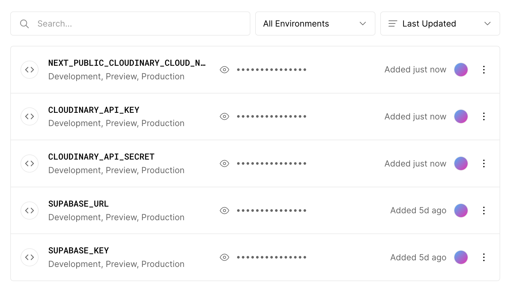
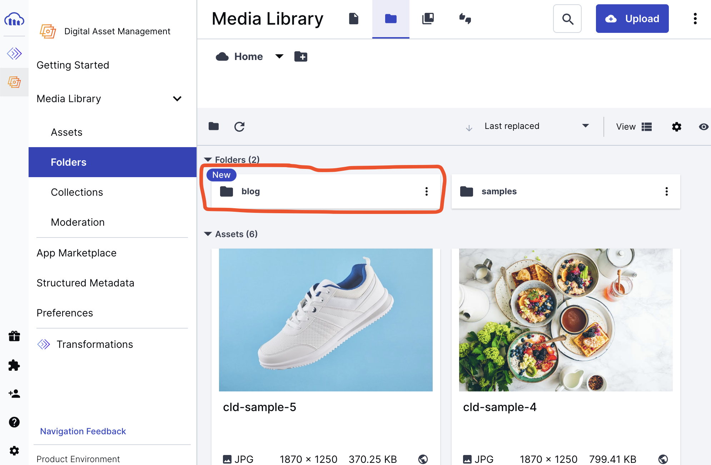

# 1. 이미지 최적화

이미지를 전반적으로 최적화하는 글이다.
일단 글 목록 페이지에 대한 lighthouse의 제안과 진단을 볼까? 음...점수는 처참하지만 천릿길도 한 걸음부터니까, 할 수 있는 걸 하자.


아까처럼 이미지에 적당한 크기를 주라고 한다. Card 컴포넌트에서 Image 태그에 sizes를 지정하자.

```jsx
function Card(props: Props) {
/* 생략 */
  <Image 
    className={styles.image} 
    src={image} 
    alt={`${image} 사진`} 
    width={200} 
    height={200}
    sizes='100px'
  />
/* 생략 */
}
```

그리고 이미지의 `minimumCacheTTL` 도 30일로 설정한다. `next.config.js`에서 설정할 수 있다.

```js
const nextConfig = {
  images:{
    unoptimized:false,
    imageSizes: [64, 384],
    deviceSizes: [768, 1920],
    domains: ['res.cloudinary.com'],
    minimumCacheTTL: 60*60*24*30,
  },
  reactStrictMode: false,
  swcMinify:true,
};
```

개발자 도구 Network 탭을 켜고 이미지가 있는 블로그 페이지를 열어서 받은 이미지의 응답 헤더를 까보면 `Cache-Control:public, max-age=0, must-revalidate`이라는 항목이 있다. 

`minimumCacheTTL`을 설정하면 이 `Cache-Control`헤더의 `max-age`가 설정한 값으로 바뀐다. 나 같은 경우 2592000으로 바뀌었다.

캐시를 의도적으로 삭제하기는 힘들기 때문에 낮게 유지하는 게 좋다고 하지만, 블로그에 쓰이는 이미지야 24시간에 한 번 캐시 갱신이면 충분하다고 생각한다. 이미지 업데이트 같은 걸 할 일이 있다고 한다면 24시간에 한 번 적용이면 충분하지.

# 2. Cloudinary 사용해보기

마침 매우 도움이 되는 글을 찾았다. [매우 많은 이미지를 서빙하는 갤러리를 NextJS로 만드는 글](https://vercel.com/blog/building-a-fast-animated-image-gallery-with-next-js)이 Vercel에서 공식으로 올라와 있었다!

이 블로그에서는 cloudinary를 이용해서 이미지를 서빙했다고 한다. 한번 이걸 써보자.

먼저 [cloudinary](https://cloudinary.com/)에 가입하자. 나는 구글로 가입했다. 그러면 마이페이지에 다음과 같은 화면이 나온다.


여기의 좌측 메뉴에서 Media Library로 들어가면 Asset을 올릴 수 있다. 구글 드라이브와 거의 똑같은 UI라서 드래그 앤 드롭으로 이미지 등을 올리면 된다.

예를 들어서 나는 samples 폴더에 내 프로필 사진을 올렸었는데 그러면 다음과 같은 URL을 얻을 수 있다. 사진에 마우스 커서를 올리면 URL을 복사할 수 있는 버튼이 있더라. [URL의 구조는 공식 문서를 참고했다.](https://cloudinary.com/documentation/transformation_reference)

```
https://res.cloudinary.com/<cloud_name>/<asset_type>/<delivery_type>/<transformations>/<version>/<public_id_full_path>.<extension>

https://res.cloudinary.com/내 cloud name/asset 타입(image등)/어떻게 전송되었는지/버전/폴더명/witch_xjp39k.jpg
```

이런 걸 API를 이용해서 불러오려면 먼저 `.env.local`에 API 키를 설정하자. 이 키들은 Setting의 Access Keys 메뉴에서 가져올 수 있다.

```
NEXT_PUBLIC_CLOUDINARY_CLOUD_NAME=replace
CLOUDINARY_API_KEY=replace
CLOUDINARY_API_SECRET=replace
```

`next.config.js`에 다음과 같이 설정을 추가하여 `res.cloudinary.com`에서 이미지를 가져올 수 있게 허용한다.

```js
/* nextConfig만 편집 */
const nextConfig = {
  images:{
    unoptimized:false,
    imageSizes: [64, 384],
    deviceSizes: [768, 1920],
    /* 도메인에 cloudinary 추가 */
    domains: ['res.cloudinary.com'],
  },
  reactStrictMode: false,
  swcMinify:true,
};
```

이제 이미지 URL을 이용해서 다음과 같이 이미지를 가져와볼 수 있다.

```jsx
<Image
  src={`https://res.cloudinary.com/${process.env.NEXT_PUBLIC_CLOUDINARY_CLOUD_NAME}/image/upload/v1686541466/samples/witch_xjp39k.jpg`}
  alt='프로필 사진'
  width={300}
  height={300}
/>
```

이를 Vercel에서도 쓸 수 있게 위의 환경변수들을 Vercel에서도 추가한다. 현재 환경 변수들은 다음과 같은 것들이 있다.



# 3. 이미지 서빙 시스템 설계

기존에는 모든 이미지를 다 웹사이트 빌드 시에 같이 넣어 주었다. 그런데 이제는 cloudinary를 사용할 것이다. 하지만 그럼 기존에 쓰던 이미지 저장 방식은 아예 버려야 할까?

그럴 수도 있겠지만 이미지 저장 방식을 바꿀 때 새로운 방식밖에 쓸 수 없도록 바꾸는 게 좋지는 않다고 생각한다. cloudinary를 무제한으로 쓸 수 있는 것도 아니기에 언젠가 기존의 저장 방식으로 돌아와야 할 수도 있다. 그리고 또다른 클라우드 저장소를 사용하게 될 수도 있다.

이런 걱정을 하는 이유는 물론 돈이다. 나는 프리티어나 아주 저렴한 요금제밖에 쓸 수 없는데 cloudinary의 유료정책은 꽤 비싸니까...


따라서 `blog-config.ts`의 `blogConfig`에 이미지를 어디에 저장할지도 택할 수 있게 하자. 기본값은 `local`이다. 

`blogConfig.imageStorage` 값이 `local`이면 `public/images`에 저장하고, `cloudinary`면 cloudinary에 저장하도록 하고 이미지 URL은 2가지로 저장하여 사용자가 설정하는 `blogConfig.imageStorage`에 따라서 불러오도록 하자.

```ts
interface BlogConfigType {
  name: string;
  title: string;
  description: string;
  picture: string;
  url: string;
  social: {
    Github: string;
    BOJ: string;
  };
  comment: {
      type: 'giscus';
      repo: string;
      repoId: string;
      category: string;
      categoryId: string;
      lang?: 'ko' | 'en'; // defaults to 'en'
      lazy?: boolean;
    };
    /* 이미지 저장소를 선택할 수 있도록 타입 지정 */
  imageStorage: 'local' | 'cloudinary'; // defaults to 'local'
  thumbnail: string;
  googleAnalyticsId?: string; // gtag id
}
```

# 4. 메인 페이지 이미지 최적화

메인 페이지에 있는 이미지는 내 프로필의 것을 뺀다면 고작 4개뿐이다. 프로젝트들의 이미지들이다. 그리고 이는 동적으로 생성되는 게 아니기 때문에 바꾸기도 쉽다. Cloudinary에 업로드한 후 각 이미지를 쓰는 태그의 src를 바꿔주면 된다.

먼저 `blog-project.ts`에서 프로젝트의 저장 시 image URL 타입을 local, cloudinary 두 URL 모두가 담길 수 있도록 변경하자.

```ts
// blog-project.ts
export interface projectType {
  title: string;
  description: string;
  image: {
    local: string;
    cloudinary: string;
  };
  url: {
    title: string;
    link: string;
  }[];
  techStack: string[];
}
```

그리고 cloudinary media library에서 `/blog` 폴더를 생성한다.



이렇게 생성한 폴더에 프로젝트 사진들(`/public/project`에 있던 그 이미지들)을 업로드한다. 그러면 URL이 생기는데 이를 `projectList`의 프로젝트 이미지에 넣어주자.

전체 URL을 넣어 놓으면 cloudinary cloud name이 노출되어서 문제가 있지 않을까 생각했는데 [cloudinary 공식 사이트의 글](https://cloudinary.com/documentation/how_to_integrate_cloudinary)을 보니 cloud name과 API key는 노출되어도 상관없다고 한다.

API secret만 노출되지 않도록 잘 숨기면 된다고 한다. 따라서 `blog-project.ts`에서는 cloudinary URL을 다음과 같이 저장하자.

```ts
const projectList: projectType[] = [
  {
    title: 'Witch-Work',
    description: '직접 제작한 개인 블로그',
    image:{
      local:'/witch.jpeg',
      cloudinary:'https://res.cloudinary.com/desigzbvj/image/upload/v1686565864/blog/witch_t17vcr.jpg'
    },
    /* URL, techStack 속성 생략 */
  },
  /* 나머지 프로젝트 객체 생략 */
];
```

프로젝트를 보여주는 `ProjectCard` 컴포넌트에서는 `blogConfig.imageStorage`에 따라서 다른 이미지 URL을 사용하도록 하자.

```tsx
// src/components/projectCard/index.tsx
function ProjectCard({project}: {project: projectType}) {
  return (
    <Link className={styles.wrapper} href={project.url[0].link} target='_blank'>
      <article className={styles.container} >
        <div className={styles.titlebox}>
          <ProjectTitle title={project.title} />
        </div>
        <div className={styles.imagebox}>
          <ProjectImage title={project.title} image={project.image[blogConfig.imageStorage]} />
        </div>
        <div className={styles.introbox}>
          <ProjectIntro project={project} />
        </div>
      </article>
    </Link>
  );
}
```

# 5. 글 썸네일 이미지 최적화

현재 글 썸네일 같은 경우 `src/plugins/make-thumbnail.mjs`에서 생성하여 변환 파일의 `data._raw.thumbnail`에 파일 경로를 넣어주고 있다. 따라서 기존의 파일 경로를 `thumbnail.local`로 바꾸고 `thumbnail.cloudinary`를 추가하자.

그러기 위해서는 썸네일 생성과 함께 이미지 업로드가 먼저 되어야 한다. `make-thumbnail.mjs`의 기존 코드에서 이미지 생성까지는 이미 잘 하고 있으므로 cloudinary에 업로드하는 코드만 추가하면 된다. `makeThumbnail`함수를 수정하자.

`thumbnail.local`에 저장되어 있는 이미지를 cloudinary에 업로드하고 `thumbnail.cloudinary`에 URL을 저장하자. upload API 문서의 응답을 보면 응답의 `secure_url`에 이미지 URL이 담겨있다는 걸 알 수 있다. 이걸 썸네일 URL로 지정하자. 그냥 url도 있지만 그건 `http` 주소라서 그걸 쓰면 보안 경고가 뜰 것이다.

```js
export default function makeThumbnail() {
  return async function(tree, file) {
    const images=extractImgSrc(tree);
    if (images.length>0) {
      file.data.rawDocumentData.thumbnail={
        local: images[0],
      };
    }
    else {
      const title=file.value.split('\n')[1].replace('title: ', '');
      const {headingTree, sourceFilePath}=file.data.rawDocumentData;
      const b=await createThumbnailFromText(title, headingTree, sourceFilePath);
      file.data.rawDocumentData.thumbnail={
        local: b,
      };
    }
    /* 이 시점엔 썸네일이 하나씩은 있다 */
    const results=await cloudinary.v2.uploader
      .upload(
        join(__dirname, 'public', file.data.rawDocumentData.thumbnail.local),{
          folder: 'blog/thumbnails',
          use_filename: true,
        }
      );
    file.data.rawDocumentData.thumbnail.cloudinary=results.secure_url;
  };
}
```

그리고 이렇게 받아온 thumbnail 중 `blog-config.ts`에서 지정하고 있는 `imageStorage`를 사용하도록 하기 위해 `Card`컴포넌트를 수정한다. `CardProps` 함수도 수정하고 비슷한 타입을 쓰는 모든 부분을 수정한다. 

```tsx
// src/components/card/index.tsx
export interface CardProps{
  title: string;
  description: string;
  thumbnail?: {
    local: string;
    cloudinary: string;
  }
  date: string;
  tags: string[];
  url: string;
}

function Card(props: CardProps) {
  const { title, description, thumbnail, date, tags, url } = props;
  return (
    <Link className={styles.link} href={url}>
      <article className={styles.container}>
        {thumbnail ?
          <div>
            <Image 
              className={styles.image} 
              src={thumbnail[blogConfig.imageStorage]} 
              alt={`${title} 사진`} 
              width={200} 
              height={200}
              sizes='100px'
            />
          </div>
          :
          null
        }
        <Intro title={title} description={description} date={date} tags={tags} />
      </article>
    </Link>
  );
}
```

이렇게 thumbnail의 주소를 `blogConfig.imageStorage`에 따라서 다르게 가져오도록 수정해야 했던 코드의 다른 부분들은 [당시의 커밋 내역](https://github.com/witch-factory/witch-next-blog/commit/192c4a7adc8604b6a15ccfd7f1f309a149b2893b)에서 확인할 수 있다.

# 6. 이미지 중복 제거, 최적화

그런데 문제가 있다. `run dev`를 할 때마다 혹은 빌드할 때마다 `makeThumbnail`이 계속 실행되어서 이미지가 계속 올라간다는 것이다.

이는 업로드 시 public ID를 주고, overwrite(같은 ID가 있을 때 덮어쓸지)를 false로 지정하면 된다.

`makeThumbnail`의 `upload` API 호출 부분을 다음과 같이 수정하자.

```js
export default function makeThumbnail() {
  return async function(tree, file) {
    const images=extractImgSrc(tree);
    if (images.length>0) {
      file.data.rawDocumentData.thumbnail={
        local: images[0],
      };
    }
    else {
      const title=file.value.split('\n')[1].replace('title: ', '');
      const {headingTree, sourceFilePath}=file.data.rawDocumentData;
      const b=await createThumbnailFromText(title, headingTree, sourceFilePath);
      file.data.rawDocumentData.thumbnail={
        local: b,
      };
    }
    /* 이 시점엔 썸네일이 하나씩은 있다 */
    const results=await cloudinary.v2.uploader
      .upload(
        join(__dirname, 'public', file.data.rawDocumentData.thumbnail.local),{
          public_id: file.data.rawDocumentData.thumbnail.local.replace('/','').replaceAll('/', '-').replaceAll('.','-'),
          folder: 'blog/thumbnails',
          overwrite:false,
        }
      );
    file.data.rawDocumentData.thumbnail.cloudinary=
      `https://res.cloudinary.com/${process.env.NEXT_PUBLIC_CLOUDINARY_CLOUD_NAME}/image/upload/c_scale,w_300,f_auto/${results.public_id}`;
  };
}
```

위를 보면 이미지를 300px로 줄여서 가져오고, 자동으로 파일 양식을 최적화도 하도록 하는 것을 볼 수 있다. URL의 `c_scale,w_300,f_auto`이 부분이 그 역할을 수행한다.

같은 작업을 프로젝트 이미지에도 해준다. 다음과 같은 형식으로 `blog-project.ts`의 배열을 수정하자.

```ts
// blog-project.ts
const projectList: projectType[] = [
  {
    title: 'Witch-Work',
    description: '직접 제작한 개인 블로그',
    image:{
      local:'/witch.jpeg',
      /* 중간에 c_scale,w_400,f_auto이 들어간 걸 확인할 수 있다. 이 양식은 공식 변환 API 문서를 참고했다. */
      cloudinary:'https://res.cloudinary.com/desigzbvj/image/upload/c_scale,w_400,f_auto/v1686565864/blog/witch_t17vcr.jpg'
    },
    url: [
      {
        title: 'URL',
        link:'https://witch.work/'
      },
      {
        title: 'Github',
        link:'https://github.com/witch-factory/witch-next-blog'
      },
    ],
    techStack: ['Next.js', 'React', 'TypeScript']
  },
]
```

# 7. blur 이미지 제공

사진을 보내오는 서버가 아무리 빨라도 사실 용량이 작은 사진을 쓰는 것만큼 빨라질 수는 없다. 따라서 이미지 로딩 시점에 사용할 사진을 준비하자.

cloudinary URL을 받아서 해당 이미지의 blur 이미지를 만들어주는 함수를 만들자. 이 함수는 `src/utils/generateBlurPlaceholder.ts`에 추가하자.

그전에 `imagemin`이라는 라이브러리를 설치하자. 이 라이브러리는 이미지를 최적화해주는 라이브러리다. `imagemin-jpegtran`도. 그리고 여기에 필요한 타입 라이브러리도 설치한다.

```bash
npm install imagemin imagemin-jpegtran
npm install --save @types/imagemin
npm install --save @types/imagemin-jpegtran
```

cloudinary URL의 이미지를 16px짜리 jpg로 받아서 `imagemin` 라이브러리를 이용해 축소한 후 base64로 인코딩하여 반환한다.

```js
// src/utils/generateBlurPlaceholder.ts
import imagemin from 'imagemin';
import imageminJpegtran from 'imagemin-jpegtran';

export default async function getBase64ImageUrl(imageUrl: string) {
  const response= await fetch(imageUrl.replace('w_300,f_auto', 'w_16,f_jpg'));
  const buffer= await response.arrayBuffer();
  const minified = await imagemin.buffer(Buffer.from(buffer), {
    plugins: [imageminJpegtran()],
  });
  const blurURL = `data:image/jpeg;base64,${Buffer.from(minified).toString('base64')}`;
  return blurURL;
}
```

그리고 `makeThumbnail` 함수에서 위 함수를 이용해 썸네일의 blurURL을 생성해준다.

```js
// src/plugins/make-thumbnail.mjs
export default function makeThumbnail() {
  return async function(tree, file) {

    /* canvas를 이용한 썸네일 생성, cloudinary 업로드하는 부분은 생략*/

    file.data.rawDocumentData.thumbnail.cloudinary=
      `https://res.cloudinary.com/${process.env.NEXT_PUBLIC_CLOUDINARY_CLOUD_NAME}/image/upload/c_scale,w_300,f_auto/${results.public_id}`;

    /* blurURL을 만드는 이 부분이 추가되었다 */
    file.data.rawDocumentData.thumbnail.blurURL=await getBase64ImageUrl(file.data.rawDocumentData.thumbnail.cloudinary);
  };
}
```

썸네일을 보여주는 `Card` 컴포넌트에서도 이 blur placeholder를 사용하도록 해준다.

```tsx
export interface CardProps{
  title: string;
  description: string;
  thumbnail?: {
    local: string;
    cloudinary: string;
    blurURL?: string;
  }
  date: string;
  tags: string[];
  url: string;
}

function Card(props: CardProps) {
  const { title, description, thumbnail, date, tags, url } = props;
  return (
    <Link className={styles.link} href={url}>
      <article className={styles.container}>
        {thumbnail ?
          <div>
            <Image 
              className={styles.image} 
              style={{ transform: 'translate3d(0, 0, 0)' }}
              src={thumbnail[blogConfig.imageStorage]} 
              alt={`${title} 사진`} 
              width={200} 
              height={200}
              sizes='200px'
              placeholder={'blurURL' in thumbnail ? 'blur' : 'empty'}
              blurDataURL={thumbnail.blurURL}
            />
          </div>
          :
          null
        }
        <Intro title={title} description={description} date={date} tags={tags} />
      </article>
    </Link>
  );
}
```

이미지를 불러올 때 블러 처리된 이미지가 잠시 보이는 것을 확인할 수 있을 것이다.

그리고 `Image` 컴포넌트에 `style={{ transform: 'translate3d(0, 0, 0)' }}` 속성이 추가된 것을 볼 수 있다. 이건 요소를 옮기는 CSS인데 `(0,0,0)` 벡터만큼 평행이동한다는 뜻이므로 사실 아무 위치 변화가 없다. 

이런 의미없어 보이는 CSS를 쓴 이유는 이렇게 하면 일부 기기에서 해당 요소 렌더링 시 GPU를 사용하도록 해주기 때문이다. 특히 사파리에서 GPU 렌더링은 유용하다.

내 블로그에는 큰 필요가 없었지만 다른 트릭들도 [nextjs 이미지 갤러리 구축기](https://vercel.com/blog/building-a-fast-animated-image-gallery-with-next-js)에 여럿 소개되어 있다.

# 참고

nextJS로 엄청 빠른 사진 갤러리 만드는 글 https://vercel.com/blog/building-a-fast-animated-image-gallery-with-next-js

NextJS의 이미지 최적화 문서 https://nextjs.org/docs/pages/building-your-application/optimizing/images

이미지 업로드 API 공식문서 https://cloudinary.com/documentation/image_upload_api_reference#upload

각종 이미지 최적화 기법이 담긴 글 https://junheedot.tistory.com/entry/Next-Image-load-super-slow

위의 이미지 최적화에서 쓴 minimumCacheTTL에 관한 문서 https://nextjs.org/docs/pages/api-reference/components/image#minimumcachettl

loglocket의 nextjs 이미지 최적화에 관한 글 https://blog.logrocket.com/next-js-automatic-image-optimization-next-image/

webp 자동 변환하여 갖고오기 https://cloudinary.com/guides/front-end-development/webp-format-technology-pros-cons-and-alternatives

cloudinary 이미지 변환 공식 문서 https://cloudinary.com/documentation/transformation_reference

이미지 중복 피하기 https://support.cloudinary.com/hc/en-us/community/posts/5126315761682-Best-way-to-avoid-duplicated-files-

cloudinary에서 중복 체크 api도 제공하긴 한다. https://cloudinary.com/blog/how_to_automatically_identify_similar_images_using_phash

nextjs 이미지 로더 https://nextjs.org/docs/app/api-reference/next-config-js/images#example-loader-configuration