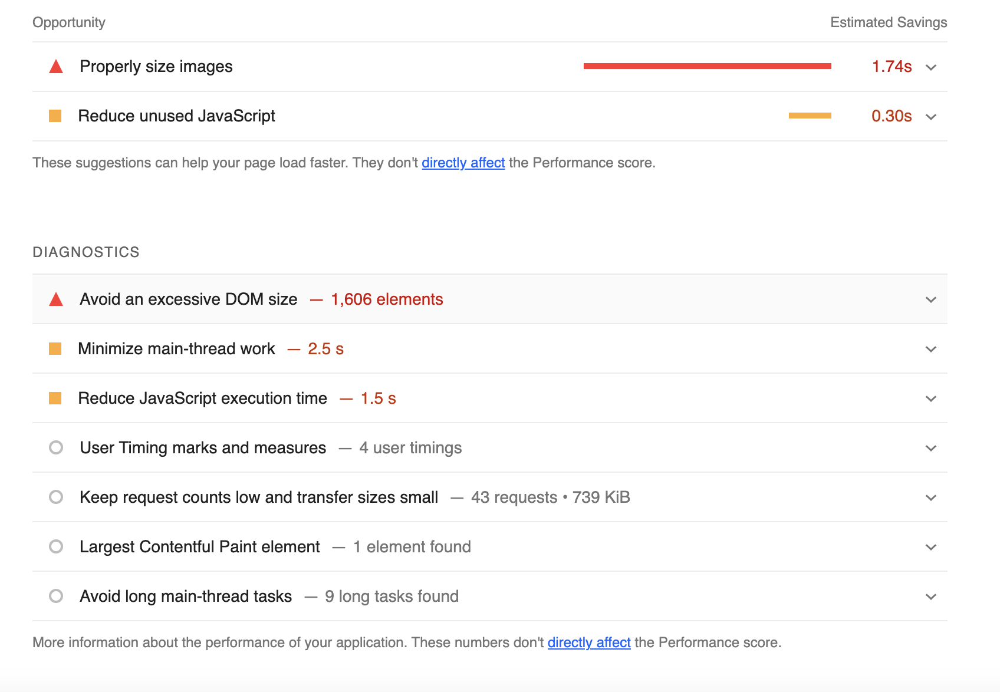

# 1. 이미지 최적화

이미지를 전반적으로 최적화하는 글이다.
일단 글 목록 페이지에 대한 lighthouse의 제안과 진단을 볼까? 음...점수는 처참하지만 천릿길도 한 걸음부터니까, 할 수 있는 걸 하자.



아까처럼 이미지에 적당한 크기를 주라고 한다. Card 컴포넌트에서 Image 태그에 sizes를 지정하자.

```jsx
function Card(props: Props) {
/* 생략 */
  <Image 
    className={styles.image} 
    src={image} 
    alt={`${image} 사진`} 
    width={200} 
    height={200}
    sizes='100px'
  />
/* 생략 */
}
```

# 2. Cloudinary 사용해보기

마침 매우 도움이 되는 글을 찾았다. [매우 많은 이미지를 서빙하는 갤러리를 NextJS로 만드는 글](https://vercel.com/blog/building-a-fast-animated-image-gallery-with-next-js)이 Vercel에서 공식으로 올라와 있었다!

이 블로그에서는 cloudinary를 이용해서 이미지를 서빙했다고 한다. 한번 이걸 써보자.

먼저 [cloudinary](https://cloudinary.com/)에 가입하자. 나는 구글로 가입했다. 그러면 마이페이지에 다음과 같은 화면이 나온다.


여기의 좌측 메뉴에서 Media Library로 들어가면 Asset을 올릴 수 있다. 구글 드라이브와 거의 똑같은 UI라서 드래그 앤 드롭으로 이미지 등을 올리면 된다.

예를 들어서 나는 samples 폴더에 내 프로필 사진을 올렸었는데 그러면 다음과 같은 URL을 얻을 수 있다. 사진에 마우스 커서를 올리면 URL을 복사할 수 있는 버튼이 있더라. [URL의 구조는 공식 문서를 참고했다.](https://cloudinary.com/documentation/transformation_reference)

```
https://res.cloudinary.com/<cloud_name>/<asset_type>/<delivery_type>/<transformations>/<version>/<public_id_full_path>.<extension>

https://res.cloudinary.com/내 cloud name/asset 타입(image등)/어떻게 전송되었는지/버전/폴더명/witch_xjp39k.jpg
```

이런 걸 API를 이용해서 불러오려면 먼저 `.env.local`에 API 키를 설정하자. 이 키들은 Setting의 Access Keys 메뉴에서 가져올 수 있다.

```
NEXT_PUBLIC_CLOUDINARY_CLOUD_NAME=replace
CLOUDINARY_API_KEY=replace
CLOUDINARY_API_SECRET=replace
```

`next.config.js`에 다음과 같이 설정을 추가하여 `res.cloudinary.com`에서 이미지를 가져올 수 있게 허용한다.

```js
/* nextConfig만 편집 */
const nextConfig = {
  images:{
    unoptimized:false,
    imageSizes: [64, 384],
    deviceSizes: [768, 1920],
    /* 도메인에 cloudinary 추가 */
    domains: ['res.cloudinary.com'],
  },
  reactStrictMode: false,
  swcMinify:true,
};
```

이제 이미지 URL을 이용해서 다음과 같이 이미지를 가져와볼 수 있다.

```jsx
<Image
  src={`https://res.cloudinary.com/${process.env.NEXT_PUBLIC_CLOUDINARY_CLOUD_NAME}/image/upload/v1686541466/samples/witch_xjp39k.jpg`}
  alt='프로필 사진'
  width={300}
  height={300}
/>
```

이를 Vercel에서도 쓸 수 있게 위의 환경변수들을 Vercel에서도 추가한다. 현재 환경 변수들은 다음과 같은 것들이 있다.


# 참고

https://vercel.com/blog/building-a-fast-animated-image-gallery-with-next-js

https://nextjs.org/docs/pages/building-your-application/optimizing/images