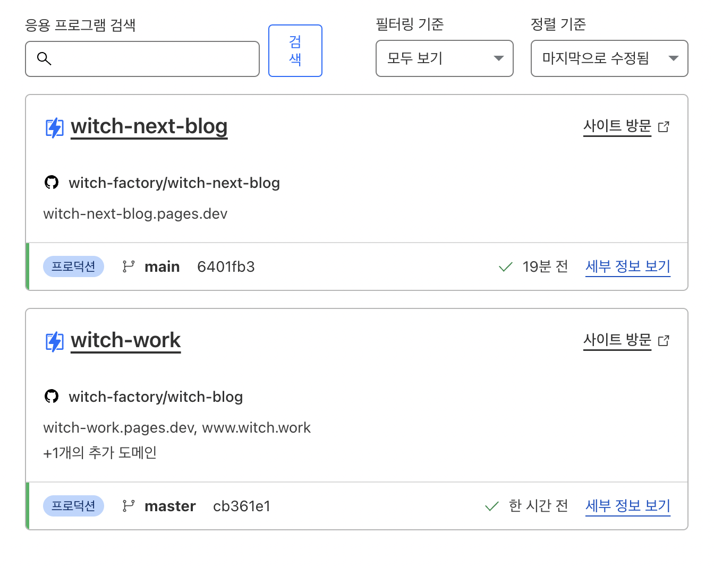
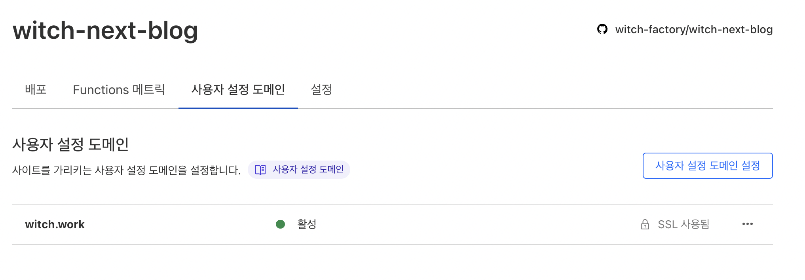
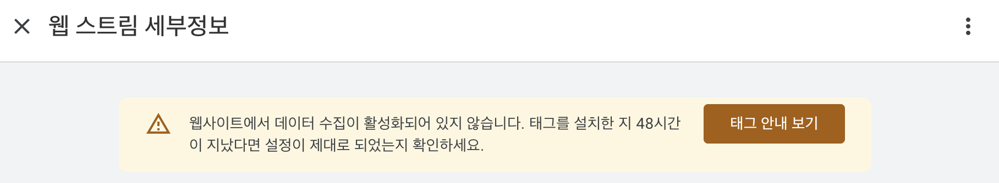
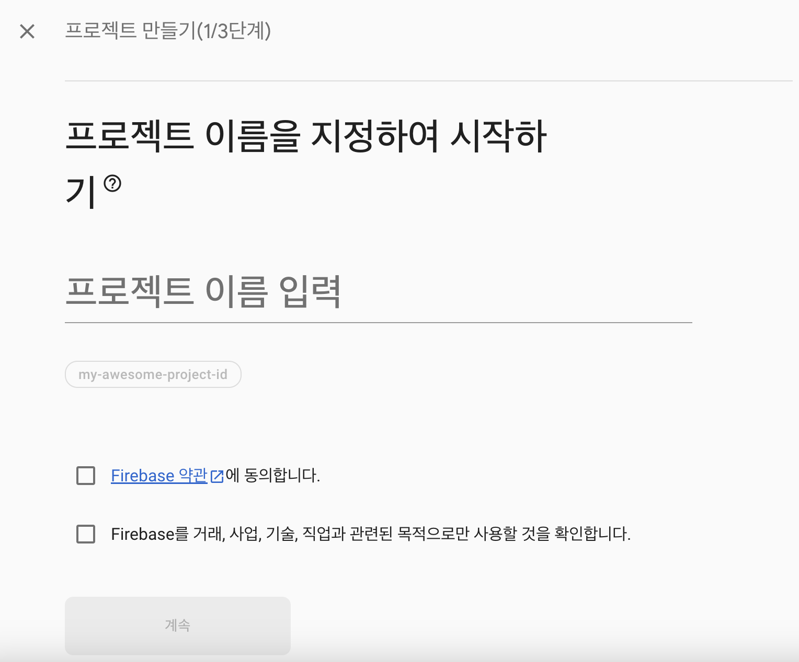
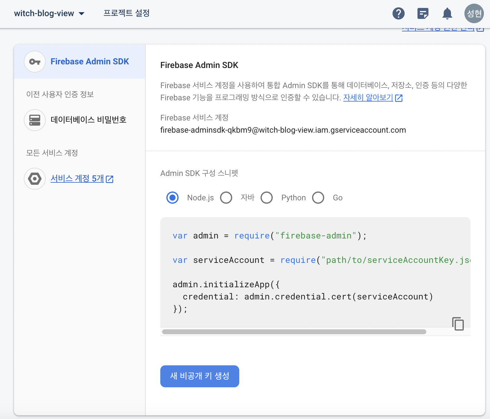
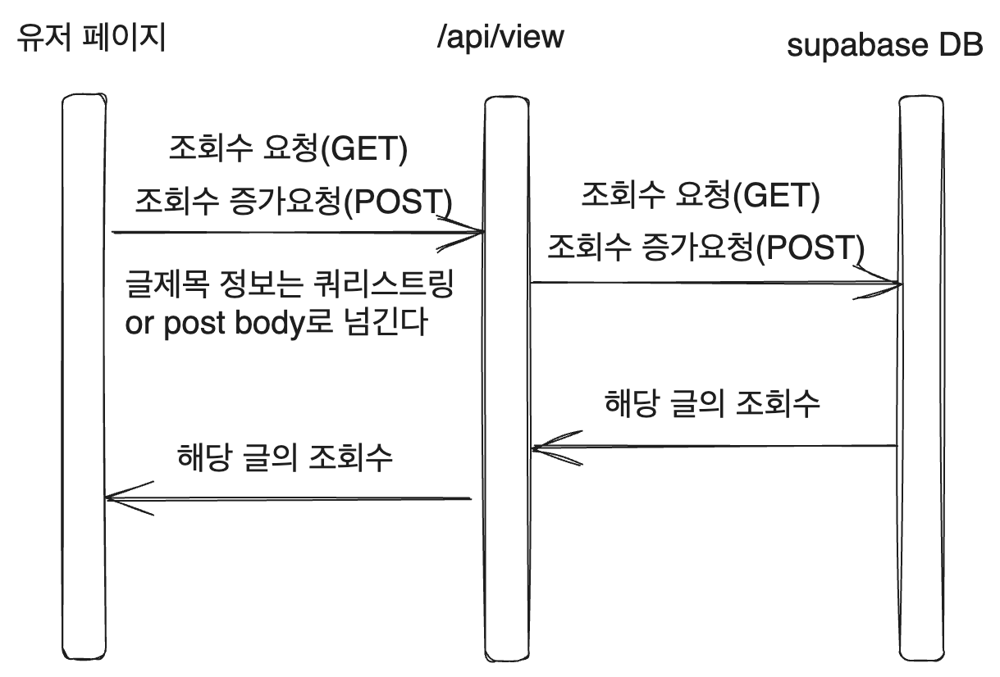
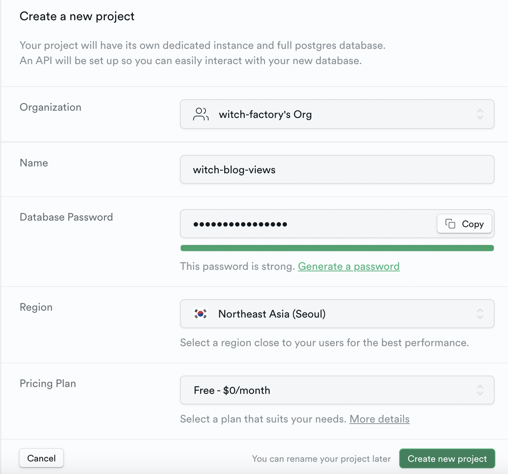
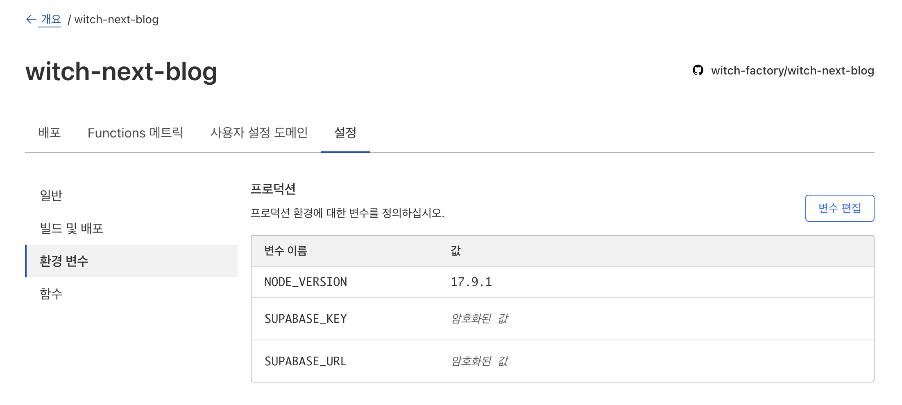

이 글은 내 새로운 블로그에 조회수를 다는 과정이다. 정보 전달을 위해 [이전 블로그에 조회수를 달다가 만 과정](https://witch.work/blog-adding-view-count/)에서 몇 가지를 복붙했다.

사실 vercel에서 했더라면 훨씬 더 편하게 모든 걸 했을 텐데, cloudflare에서 하려다 보니 너무나 힘든 시간들이었다.

수많은 삽질과 실패가 있었는데, 만약 NextJS앱을 Cloudflare Pages로 배포하면서 조회수를 달고자 하는 사람이 있다면 `5번 항목`으로 바로 가면 된다.

# 1. 글 옮기기

일단 글들을 전부 새 블로그로도 옮겼다. 옮기고 나니 빌드에 더 오랜 시간이 걸렸다..

# 2. busuanzi

busuanzi라는 중국 서비스가 있는데 이를 이용하면 페이지와 블로그 조회수를 제일 쉽게 추가할 수 있다. 이 부분은 [예전에 내가 쓴 글](https://witch.work/blog-adding-view-count/)에서 복붙했다.

[fienestar님의 가이드](https://fienestar.github.io/blog/2020/05/24/busuanzi%EB%A5%BC-%EC%9D%B4%EC%9A%A9%ED%95%98%EC%97%AC-%EC%A0%95%EC%A0%81%EC%9D%B8-%ED%8E%98%EC%9D%B4%EC%A7%80%EC%97%90-%EC%8A%A4%ED%83%80%EC%9D%BC-%EB%B3%80%EA%B2%BD%EC%9D%B4-%EA%B0%80%EB%8A%A5%ED%95%9C-%EC%A1%B0%ED%9A%8C%EC%88%98-%EC%B6%94%EA%B0%80%ED%95%98%EA%B8%B0/)를 따라하면 된다. 단 내 블로그에 맞게 하기 위한 몇 가지 수정이 필요하다.

먼저 다음 코드를 사이트의 head 혹은 body에 추가해야 한다.

```html
<script async src = "//busuanzi.ibruce.info/busuanzi/2.3/busuanzi.pure.mini.js"></script>
```

내 블로그에는 `Seo`라는 컴포넌트가 있고 이는 블로그의 모든 페이지에 삽입된다. 그리고 이 `Seo` 컴포넌트는 react-helmet의 Helmet 컴포넌트로 이루어져 있는데 이 Helmet 컴포넌트는 head 태그에 들어가는 내용을 관리한다. (추가 : 아마 nextjs에선 Head 컴포넌트에 추가해 줘야 할 듯 싶다)

따라서 Helmet 컴포넌트 사이에 저 코드를 추가해 주면 된다.

```tsx
<Helmet
// SEO를 위한 메타 정보들이 들어가 있다.
// 여기서는 중요하지 않으므로 생략
>
  <script async src = '//busuanzi.ibruce.info/busuanzi/2.3/busuanzi.pure.mini.js'></script>
</Helmet>
```

## 2.1. 사이트 조회수와 방문자 수

사이트 조회수와 방문자 수는 다음 코드를 통해 추가할 수 있다. span에 붙은 id가 중요하다.

```html
<section style={{height:'20px'}}>
  조회수 <span id = 'busuanzi_value_site_pv' ></span> 회 <br />
  방문자 <span id = 'busuanzi_value_site_uv' ></span> 명
</section>
```

위 코드를 블로그의 페이지에 추가하면 된다. 내 블로그의 경우 메인 페이지를 나타내는 BlogIndex 컴포넌트에서 내 프로필 바로 아래에 추가했다.

이 조회수 표시를 위한 삽질을 하면서 블로그를 재구성해야겠다는 생각을 많이 했기 때문에 지금 굳이 스타일링을 하지는 않았다.

## 2.2. 페이지 조회수

단일 페이지의 조회수는 다음 코드로 추가한다.

```html
<span id="busuanzi_value_page_pv"></span>
```

이를 글 제목 아래에 적당히 추가하였다.

다른 삽질의 기록들은 아래에 적어두었다. 후에 블로그를 갈아엎을 때 이 지식을 쓰게 되길 바란다.

그리고 생각보다 빨리, 2달 만에 이 글을 다시 쓰게 되었다. 이번엔 nextjs이기 때문에 다시 쓴다.

# 3. google analytics - 등록

## 3.1. 계정 생성

구글 애널리틱스 계정을 새로 생성하자.


그리고 웹사이트 속성도 설정한다.


비즈니스 정보도 적당히 설정한 후 약관 등에 동의하고 계정 생성을 마친다.

## 3.2. 블로그 이전하기

그리고 이제 내 블로그도 꼴이 좀 갖춰졌으니 내가 가지고 있는 `witch.work` 도메인이 새로 만든 블로그로 연결되도록 하자.

지금은 내가 gatsby로 만들었던 블로그 페이지에 연결되어 있다.

다음과 같이 cloudflare pages 메뉴에 들어간다.



그리고 기존에 쓰던 프로젝트에 들어간 후 `사용자 설정 도메인`메뉴에서 `witch.work` 도메인을 삭제한다.

`witch-next-blog`에서 사용자 설정 도메인에 `witch.work`추가.



## 3.3. 데이터 스트림과 태그 추가

그 다음 데이터 스트림 메뉴에 들어가서 페이지의 데이터 스트림을 추가해 주자.


어..그런데 다음과 같은 경고가 뜬다. 데이터 수집이 활성화되지 않았다고 한다.



## 3.4. 추적 코드 설정

데이터 수집 활성화를 위해선 앞에서 획득한 측정 ID를 등록해 줘야 한다. GA 추적 코드를 설정하자. 여기서는 프론트의 왕 [이창희](https://xo.dev/)에게 그리고 [김민지님의 블로그](https://mnxmnz.github.io/nextjs/google-analytics/)에서 도움을 받았다.

`blog-config.ts`에 구글 애널리틱스 ID를 추가해 주자. 다음과 같이 작성해 준다. GA 추적 코드는 구글 애널리틱스에 들어가면 알 수 있는 `G-`로 시작하는 그 코드다.

딱히 이게 git에 올라간다고 해서 보안상 문제가 있는 건 아니라서 이 파일에 작성해 줘도 상관없다.

```ts
// blog-config.ts
const blogConfig: BlogConfigType = {
  name:'김성현(Sung Hyun Kim)',
  title:'Witch-Work',
  description:
    '대단한 뜻을 품고 사는 사람은 아닙니다. ' +
    '그저 멋진 사람들이 내는 빛을 따라가다 보니 여기까지 왔고, ' +
    '앞으로도 그렇게 살 수 있었으면 좋겠다고 생각하는 사람입니다. ' +
    '이곳에 찾아오신 당신과도 함께할 수 있어 영광입니다.',
  picture:'/witch.jpeg',
  url:'https://witch-next-blog.vercel.app',
  social: {
    Github: 'https://github.com/witch-factory',
    BOJ: 'https://www.acmicpc.net/user/city'
  },
  thumbnail: '/witch.jpeg',
  /* 이 부분에 있는 걸 자신의 GA 추적 코드로 */
  googleAnalyticsId:'G-XXXXXXXXXX'
};
```

그리고 이걸 이용해 ga 추적을 하는 스크립트 컴포넌트를 만들어 준다. [ambienxo](https://github.com/blurfx/ambienxo)에서 적당히 가져온다.

ga 추적 코드를 삽입해 주는 스크립트 코드를 `next/script`로 래핑한 것에 불과하다. `src/componenets/GoogleAnalytics.tsx`를 만들고 다음과 같이 작성해 준다.

```tsx
// src/componenets/GoogleAnalytics.tsx
import Script from 'next/script';

import blogConfig from '../../blog-config';

const GoogleAnalytics = () => {
  if (blogConfig.googleAnalyticsId == null) {
    return null;
  }
  return (
    <>
      <Script
        src={`https://www.googletagmanager.com/gtag/js?id=${blogConfig.googleAnalyticsId}`}
        strategy='afterInteractive'
      />
      <Script id='google-analytics' strategy='afterInteractive'>
        {`
          window.dataLayer = window.dataLayer || [];
          function gtag(){window.dataLayer.push(arguments);}
          gtag('js', new Date());

          gtag('config', '${blogConfig.googleAnalyticsId}');
        `}
      </Script>
    </>
  );
};

export default GoogleAnalytics;
```

그리고 `_app.tsx`에 이 컴포넌트를 추가해 준다. 모든 페이지에 적용되어야 하므로 `_app.tsx`이 괜찮은 선택이다.

```tsx
// _app.tsx
export default function App({ Component, pageProps }: AppProps) {
  return (
    <>
      <Head>
        <meta name='viewport' content='width=device-width, initial-scale=1' />
        <link rel='manifest' href='/site.webmanifest' />
      </Head>
      <DefaultSeo {...SEOConfig} />
      <Header navList={blogCategoryList} />
      <Component {...pageProps} />
      <Footer />
      {/* 여기에 추가 */}
      <GoogleAnalytics />
    </>
  );
}
```

이걸 이용해서 조회수를 달고 싶은 사람들은 [이 글](https://arturocampos.dev/blog/nextjs-with-google-analytics)을 참고해 보자. 나는 Cloudflare환경 때문에 실패했지만..

# 4. firebaseDB 사용해서 조회수 측정 시도

[NextJS와 파이어베이스로 실시간 블로그 조회수 측정하기](https://leerob.io/blog/real-time-post-views)를 하는 글, 그리고 [비슷한 다른 글](https://www.pankajtanwar.in/blog/how-i-built-a-real-time-blog-view-counter-with-nextjs-and-firebase)을 참고해서 DB를 사용해서도 조회수를 측정하려고 해보았다.

특히, 구글 애널리틱스를 조회수에 사용할 경우 애드블럭 등의 이유로 약 [10% 정도의 조회수가 누락된다고 한다.](https://leerob.io/blog/real-time-post-views) 특히 기술 관련 블로그일 경우 더 그렇다고 한다. 아마 기술적인 내용을 읽는 사람들은 대부분 애드블럭을 써서 그런 듯 하다.

## 4.1. firebase 프로젝트 생성

firebase에 로그인하고 콘솔로 이동한다. 나는 구글 계정으로 로그인했다. 그리고 상단 메뉴에 '콘솔로 이동'을 눌러 콘솔로 이동한다.

그러면 프로젝트를 만들 수 있는 화면이 나오는데 당연히 프로젝트를 만들러 이동하자.



난 `witch-blog-views`라는 프로젝트를 만들었다. 그리고 구글 애널리틱스를 달 수도 있는데 나는 이전에 만들어 둔 계정이 있어서 그냥 달았다.

## 4.2. DB 생성

프로젝트가 만들어지면 DB를 생성하자. 좌측 메뉴의 빌드 카테고리에서 `Realtime Database`를 선택한다. 


그리고 나오는 페이지에서 `데이터베이스 만들기`를 누른다. 대충 미국에 있는 DB 선택 후 테스트 모드로 시작.

그리고 좌측 상단 메뉴의 '프로젝트 개요'의 옆에 있는 톱니바퀴를 누르면 프로젝트 설정 페이지로 이동 가능하다. 그리고 `서비스 계정` 탭으로 이동한다.

거기서 `새 비공개 키 생성` 버튼을 누르고 나오는 json 파일을 잘 보관해 두자.



## 4.3. DB 연결

이제 DB를 연결한다. firebase-admin 설치

```bash
npm i firebase-admin
```

그리고 `.env.local` 파일을 생성하고 이를 `.gitignore`에 추가한 후 다음과 같이 작성.

```env
NEXT_PUBLIC_FIREBASE_PROJECT_ID=replace-me
FIREBASE_CLIENT_EMAIL=replace-me
FIREBASE_PRIVATE_KEY="replace-me"
```

이는 아까 다운받은 json 파일에서 비슷한 이름의 키워드를 찾아서 값을 붙여넣으면 된다. `PRIVATE_KEY` 값에는 `"`를 붙여줘야 한다.

그다음 `src/lib/firebase.js`를 만들고 다음과 같이 작성한다. 앱을 초기화하고 연결을 만드는 코드다.

```js
import * as admin from 'firebase-admin';
 
if (!admin.apps.length) {
  admin.initializeApp({
    credential: admin.credential.cert({
      projectId: process.env.NEXT_PUBLIC_FIREBASE_PROJECT_ID,
      clientEmail: process.env.FIREBASE_CLIENT_EMAIL,
      privateKey: process.env.FIREBASE_PRIVATE_KEY.replace(/\\n/g, '\n'),
    }),
  });
}
 
const db = admin.firestore();
 
export { db };
```

이제 DB와의 연결을 만들었으니 특정 HTTP 요청마다 DB에 접근해서 view를 늘려 주는 함수를 API 라우트에 만들어 줘야 한다. [여기](https://www.pankajtanwar.in/blog/how-i-built-a-real-time-blog-view-counter-with-nextjs-and-firebase)에서 가져왔다. `api/views/[slug].js`를 만들고 다음과 같이 작성한다.

```js
import db from '@/lib/firebase'

export default async (req, res) => {
  // increment the views
  if (req.method === 'POST') {
    const ref = db.ref('views').child(req.query.slug)
    const { snapshot } = await ref.transaction((currentViews) => {
      if (currentViews === null) {
        return 1
      }
      return currentViews + 1
    })

    return res.status(200).json({
      total: snapshot.val(),
    })
  }

  // fetch the views
  if (req.method === 'GET') {
    const snapshot = await db.ref('views').child(req.query.slug).once('value')
    const views = snapshot.val()

    return res.status(200).json({ total: views })
  }
}
```

이렇게 하고 `npm run dev`로 개발 모드 실행 후 `http://localhost:3000/api/views/this-is-blog-slug`와 같이 `/api/views/글제목`주소로 post 요청을 보낼 시 firebase realtime DB에서 view가 늘어나는 것을 확인할 수 있다. 나는 post 요청에 postman을 사용했는데 다른 걸 사용해도 상관없다.

## 4.4. Cloudflare 환경 문제

위처럼 하고 cloudflare 빌드를 해보자. 참고로 로컬 환경에서도 cloudflare에서 하는 것처럼 돌려볼 수 있는데 커맨드는 다음과 같다.

```bash
npx @cloudflare/next-on-pages
# 다른 터미널에서 다음 커맨드를 실행하면 로컬호스트에서 빌드된 결과가 실행된다.
npx wrangler pages dev .vercel/output/static --compatibility-flag=nodejs_compat
```

아무튼 이렇게 빌드해 보면 바로 에러가 뜬다. 

```bash
The following functions were not configured to run with the Edge Runtime:
⚡️ 		- api/views/[slug].func
```

이 뒤에도 쭉 에러가 뜨는데 대충 런타임을 엣지로 설정하라는 소리다. 왜냐? [NextJS의 SSR은 기본적으로 Nodejs 런타임을 사용하는 데 Cloudflare Page에서는 이를 지원하지 않기 때문이다.](https://developers.cloudflare.com/pages/framework-guides/deploy-a-nextjs-site/#2-configure-the-application-to-use-the-edge-runtime)

그래서 다음 문장을 `api/views/[slug].js`에 추가해 준다.

```js
export const runtime = 'edge';
```

이렇게 하니 이제는 이런 에러가 뜬다.

```bash
Dynamic Code Evaluation (e. g. 'eval', 'new Function', 'WebAssembly.compile') not allowed in Edge Runtime
```

대충 엣지 런타임에서는 지원 안 되는 뭔가를 쓰고 있다는 것 같다. [관련된 github 이슈](https://github.com/firebase/firebase-admin-node/issues/2069)도 있었는데, `firebase-admin`은 full Nodejs 런타임을 요구하며 이것은 Cloudflare worker에서 현재 지원하지 않는다는 말이 있었다.

이를 해결하기 위한 [패키지가 이미 나와 있지만](https://github.com/awinogrodzki/next-firebase-auth-edge)너무 하기 힘들어서 포기했다.

만약 이걸 이용해서 조회수를 달고 싶은 사람이 있다면 [참고 글](https://www.pankajtanwar.in/blog/how-i-built-a-real-time-blog-view-counter-with-nextjs-and-firebase)을 따라해서 SWR로 데이터를 페칭하여 조회수를 보여주는 컴포넌트를 만들어 주면 된다. 하지만 이번에도 이렇게 Cloudflare가 발목을 잡아서, 새로운 시도를 한다.

# 5. supabase로 조회수 측정하기

firebase를 대체하는 오픈소스인 supabase를 사용해 보기로 했다. 이는 Edge function도 지원한다고 한다.

## 5.1. 조회수 카운터 설계

상당히 많은 길을 돌아왔는데, 조회수 카운터에 뭐가 필요할지를 생각해 보자. DB를 이용해서 페이지의 조회수를 측정한다고 할 때, 조회수 카운터의 기능은 다음과 같다.

1. 페이지가 로드될 때 서버리스 DB에서 페이지의 조회수를 불러와서 보여준다.
2. 페이지가 로드될 때 페이지에 해당하는 조회수 카운터를 DB에서 1 늘린다.

이 과정은 글 제목마다 따로 해줘야 한다. 따라서 DB의 각 엔티티는 글 제목(사실 글 제목은 한글로 작성되어 있으므로, 편의상 글이 담긴 폴더명이 될 것이다)과 해당 글의 조회수를 담고 있으며 제목은 PK로 작동하도록 하는 게 좋겠다.

그리고 DB와의 통신은 Nextjs에서 제공하는 api 라우트를 사용할 것이고 api 라우트 정보를 받아오기 위해서는 SWR 라이브러리를 쓸 것이다. [SWR을 Next.js와 함께 사용하는 방법](https://swr.vercel.app/ko/docs/with-nextjs)을 참고하면 될 것 같다.

api 라우트에서는 DB에서 정보를 받아올 것이다.



이대로 한번 구성해 보자. DB는 사실 직접 편집이 가능하기 때문에(supabase DB는 웹에서 쉽게 편집하는 것도 가능하다)  내가 쓴 특정 글 조회수를 직접 10억으로 설정한다든지 할 수도 있기에 정확한 측정과는 거리가 멀다고 할 수도 있다. 하지만 어차피 그걸 변조할 수 있는 것도 나뿐이고 측정하고 있다는 사실 자체가 중요하기에 이 정도면 충분하다고 생각한다.

# 5.2. supabase 프로젝트 생성

supabase 프로젝트부터 생성하자. [supabase](https://supabase.com/)페이지에 접속해서 github으로 로그인한 후 새 프로젝트를 생성한다. [공식 문서](https://supabase.com/docs/guides/getting-started/quickstarts/nextjs)에서 nextJS에서 쓰는 과정을 친절히 설명해 준다.

[프로젝트 페이지](https://app.supabase.com/projects)에서 새 프로젝트를 생성한다. [가격정책](https://supabase.com/pricing)을 보니 대충 파이어베이스보다 무료 정책이 좋아 보인다. 이것도 vercel에 비해 cloudflare Page 배포가 혜자인 것과 비슷한 느낌이... 아무튼 정보를 입력하고 프로젝트를 생성한다. 리전은 한국 리전이 있길래 그걸로 했다.



이제 테이블을 만들자. [SQL 에디터](https://app.supabase.com/project/_/sql)에서 프로젝트를 선택하고 Create table을 누른 후 다음과 같이 SQL을 입력해 `views` 테이블을 생성한다. 글 제목을 뜻하는 slug를 PK로 설정하였고 정수형 view_count와 조회수 생성 시점을 뜻하는 timestamp를 넣어주었다.

view_count에 쓰인 int4는 supabase의 4바이트 정수형이다. int2를 쓰면 32,767까지 저장되는 2바이트 정수형이 된다. 다만 나는 언젠가 내 글들이 2^15번은 넘게 조회되길 바라는 마음으로 int4를 썼다. 설마 21억번 넘게 조회되는 블로그가 되진 않겠지?

```sql
create table views (
  slug text primary key,
  created_at timestamp with time zone default timezone('utc'::text, now()) not null,
  view_count int4
);
```

그리고 다음과 같은 SQL문을 실행시켜서 조회수를 1 늘리는 함수를 추가한다. 요즘은 SQL에서 함수도 넣을 수 있다.

```sql
create function increment (slug_text text)
returns void as
$$
update views
set view_count = view_count + 1
where slug = slug_text;
$$
language sql volatile;
```

그리고 브라우저에서 supabase를 조작할 수 있게 하는 supabase/js 설치.

```bash
npm install @supabase/supabase-js
```

`.env.local`에는 다음과 같은 내용을 작성하자. `replace-me`의 자리에는 나의 프로젝트URL과 anonkey를 넣어준다. 프로젝트명과 anonkey는 [여기](https://app.supabase.com/project/_/settings/api)에서 확인할 수 있다. 

```env
SUPABASE_URL=replace-me
SUPABASE_KEY=replace-me
```

그다음 `src/lib/supabaseClient.js`를 만들고 다음과 같이 작성한다.

```js
import { createClient } from '@supabase/supabase-js'

export const supabase = createClient(
  process.env.SUPABASE_URL,
  process.env.SUPABASE_KEY
);
```

그리고 이를 `cloudflare Pages`에서도 환경 변수로 추가해 준다. Workers 및 Pages 메뉴에서 내가 만든 프로젝트를 선택하고 `설정-환경 변수` 메뉴에서 위에서 설정한 `SUPABASE_URL` 과 `SUPABASE_KEY`를 추가해 준다.



## 5.3. 조회수 가져오기

조회수를 가져오는 api 라우트를 만들어 보자. `api/views/[slug].js`를 만든다든지 하면 좋겠지만 Cloudflare Page 배포 환경에선 그런 거 없다.

Cloudflare Pages에서는 서버 컴포넌트들에 대해서 edge runtime밖에 지원하지 않는데 [이렇게 되면 모든 api 라우트는 페이지가 아니라 API 엔드포인트로 취급되게 되기 때문이다.](https://nextjs.org/docs/pages/building-your-application/routing/api-routes#edge-api-routes) 그러므로 동적 api 라우트는 안된다. 어쨌든 api 라우트에서 데이터를 받아 와야 하는 건 맞으니까 한번 방법을 찾아보자.

Cloudflare 배포환경으로 빌드해보는 다음 커맨드로 차근차근 시험하며 하나씩 해본다.

```bash
# cloudflare Pages 빌드환경으로 실험하는 커맨드
npx @cloudflare/next-on-pages
npx wrangler pages dev .vercel/output/static --compatibility-flag=nodejs_compat
```

`src/lib/supabaseClient.js`에 정의된 supabase 객체를 이용해서 조회수를 가져오는 함수를 만들어주자. 공식 문서를 보면서 겨우 만들었다. 이렇게 하면 `views` 테이블에서 `view_count`컬럼만 가져오고 그중에서 `slug` 컬럼 값이 함수 인수로 받은 `slug`와 같은 row만 가져오며 `single`함수를 이용해서 리턴값을 객체 배열 대신 단일 객체로 가져오도록 한다. 

`slug`가 PK이므로 애초에 `.eq('slug', slug)`절에서부터 리턴되는 row는 없거나 하나뿐이게 되고 `single`의 사용은 적절하다.

```js
// src/lib/supabaseClient.js
export async function getViewCount(slug) {
  const {data, error}=await supabase.from('views').select('view_count').eq('slug', slug).single();
  return data;
}
```

그런데 앞서 언급했다시피 edge runtime에는 동적 api 라우트를 쓸 수 없다. 그러면 slug를 어떻게 넘길까? get 요청이기 때문에, 쿼리스트링으로 넘기도록 하자. slug는 별로 보안상 중요한 정보가 아니기 때문에 이렇게 넘겨도 괜찮을 것이다.

그러면 `api/view/index.ts`를 만들고 다음과 같이 작성한다.

```ts
// edge 런타임에 작동
export const runtime = 'edge';

import type { NextRequest } from 'next/server';

import { getViewCount } from '../../../lib/supabaseClient';

export default async function handler(
  req: NextRequest,
) {
  /* 쿼리스트링에서 slug를 뽑아낸다.
  따라서 쿼리스트링은 ?slug=my-post-slug와 같이 작성되어야 한다. */
  const { searchParams } = new URL(req.url);
  const slug = searchParams.get('slug');
  /* 쿼리스트링에 slug가 없을 시 */
  if (!slug) {
    return new Response(
      'invalid slug in query string',
      {
        status: 400,
        headers: {
          'content-type': 'application/json',
        },
      }
    );
  }
  /* 쿼리스트링의 slug를 기반으로 view_count가 들어 있는 객체를 가져온다.
  리턴값은 만약 slug에 해당하는 row가 있을 경우 {view_count : 조회수(숫자)} 와 같다. */
  const data = await getViewCount(slug);

  return new Response(
    data?.view_count || 0,
    {
      status: 200,
      headers: {
        'content-type': 'application/json',
      },
    }
  );
}
```

이 함수를 어떻게 실험하냐고? 나는 `/about` 라우트에서 실험했다. 대충 이런 컴포넌트를 만들어 가면서...

```tsx
function View({slug}: {slug: string}) {
  const {data}=useSWR(`/api/view?slug=${slug}`);
  return <div>{`조회수 ${JSON.stringify(data)}회`}</div>;
}
```

그냥 만들어 가는 중간 과정이므로 자세한 설명은 생략하겠다. 적당히 안 쓰는 라우트 하나에서 실험해 가며 만드는 것이다. useSWR과 nextjs를 함께 쓰는 방법은 [여기](https://swr.vercel.app/ko/docs/with-nextjs)에서 참고.

## 5.4. 조회수 가져오기 - 에러 상황 해결

그런데 만약 어떤 글의 조회수가 아직 없는 상태에서 새로운 사용자가 접속해서 DB에 조회수를 요청한다면? 그러면 DB에 slug에 해당하는 row가 없으므로 문제가 생길 것이다. 실제로 에러가 발생하며 이 경우 data는 null이 반환된다. 이를 해결해 줘야 한다.

따라서 특정 함수를 만들어서, `getViewCount`를 시도하고 error가 row가 없어서 발생하는 경우에는 해당 slug에 대한 조회수 row를 넣어 주는 것으로 하자.


data, error를 동시에 반환하도록 하고 error가 row가 없어서 발생하는 경우에는 해당 slug에 대한 조회수 row를 넣어 주는 것으로 하자. 에러 형식은 실험한 결과 다음과 비슷한 형식으로 반환된다.

```
{
  code: 'PGRST116',
  details: 'Results contain 0 rows, application/vnd.pgrst.object+json requires 1 row',
  hint: null,
  message: 'JSON object requested, multiple (or no) rows returned'
}
```

따라서 `error.detail`에 `"0 rows"` 가 포함되어 있는 경우를 해당 slug에 조회수가 아직 없는 것으로 간주하고 나머지 상황들도 적절히 처리해 주는 `fetchViewCount` 함수를 만들자.

일단 `getViewCount`를 다음과 같이 수정한다. data, error를 둘 다 반환한다.

```ts
// src/lib/supabaseClient.js
async function getViewCount(slug) {
  const {data, error}=await supabase
    .from('views')
    .select('view_count')
    .eq('slug', slug)
    .single();

  return {data, error};
}
```

그리고 인수 slug를 받아서 해당 slug에 대해 1의 조회수 정보를 만들어 주는 `registerViewCount`함수를 만든다.

```ts
// src/lib/supabaseClient.js
export async function registerViewCount(slug) {
  await supabase
    .from('views')
    .insert({slug, view_count:1});
}
```

이것들을 모두 이용한 `fetchViewCount` 함수를 작성한다.

```ts
// src/lib/supabaseClient.js
// slug를 받아서 해당 slug row의 view_count 반환
export async function fetchViewCount(slug) {
  const {data, error}=await getViewCount(slug);
  
  // 만약 slug와 같은 제목을 가진 row가 없다면 추가한 후 다시 getViewCount
  if (error) {
    if (error.details.includes('0 rows')) {
      /* 새로운 row 삽입 */
      await registerViewCount(slug);
      const {data:newData, error:newError}=await getViewCount(slug);
      if (newError) {
        /* 그래도 에러 발생 */
        return {data:null, error:newError};
      }
      else {
        return {data:newData, error:null};
      }
    }
    else {
      /* 0 row가 아닌 에러 발생 */
      return {data:null, error};
    }
  }
  return {data, error};
}
```

이걸 `api/view/index.ts`에 적용해 준다.

```ts
// api/view/index.ts
import { fetchViewCount } from '../../../lib/supabaseClient';

export default async function handler(
  req: NextRequest,
) {
  const { searchParams } = new URL(req.url);
  const slug = searchParams.get('slug');
  if (!slug) {
    return new Response(
      'invalid slug in query string',
      {
        status: 400,
        headers: {
          'content-type': 'application/json',
        },
      }
    );
  }
  // fetchViewCount로 변경
  const {data, error} = await fetchViewCount(slug);

  if (error) {
    return new Response(
      null,
      {
        status: 500,
        headers: {
          'content-type': 'application/json',
        },
      }
    );
  }

  return new Response(
    data?.view_count || 0,
    {
      status: 200,
      headers: {
        'content-type': 'application/json',
      },
    }
  );
}
```

이제 `src/pages/posts/[category]/[slug]/index.tsx`에서 조회수를 가져오는 컴포넌트를 만들어 보자. 이 컴포넌트는 `useSWR`을 이용해서 만들 것이다.

`api/view`에 적당히 쿼리스트링을 넣어서 fetch하면 된다.

```tsx
// src/pages/posts/[category]/[slug]/index.tsx
function ViewCounter({slug}: {slug: string}) {
  const {data}=useSWR(`/api/view?slug=${slug}`);
  return <div>{`조회수 ${data}회`}</div>;
}
```

그리고 모든 SWR 훅에 초기값으로 프리페칭될 데이터를 넘겨주기 위해 SWRConfig의 fallback 옵션을 사용한다. `getStaticProps`를 다음과 같이 변경한다.

```tsx
// src/pages/posts/[category]/[slug]/index.tsx
export const getStaticProps: GetStaticProps= async ({params})=>{
  const post = getSortedPosts().find(
    (p: DocumentTypes) => {
      const temp=p._raw.flattenedPath.split('/');
      return temp[0] === params?.category && temp[1] === params?.slug;
    }
  )!;

  const {data}=await fetchViewCount(params?.slug);
  const fallback={
    [`/api/view?slug=${params?.slug}`]: data?.view_count,
  };

  return {
    props: {
      post,
      fallback
    },
  };
};
```

`ViewCounter`컴포넌트에서 쓸 fallback이므로 해당 컴포넌트가 쓰일 때 `SWRConfig`를 감싸 주면 된다.

```tsx
const slug=post._raw.flattenedPath.split('/')[1];
// 생략
<SWRConfig value={{fallback}}>
  <ViewCounter slug={slug} />
</SWRConfig>
```

이렇게 되면 `ViewCounter`에서 쓰이는 SWR 훅은 초기값으로 `await fetchViewCount(params?.slug);`의 결과에서 뽑아낸 view_count를 쓰게 된다. 그리고 useSWR훅이 요청을 보내는 api 라우트에서도 data로 view_count를 보낸다. 따라서 언제나 `ViewCounter`에서는 useSWR의 리턴값으로 조회수(숫자)를 받게 되고 이를 이용해서 조회수를 보여주게 된다.

## 5.5. 조회수 집계

위처럼 하면 어느 글에 들어가든 무조건 조회수 1이 뜨게 된다. 하지만 아직 할 게 남았다. 사용자의 게시글 조회에 따라 조회수를 늘려 줘야 한다. 이는 `ViewCounter`의 useEffect에서 처리하자. `ViewCounter` 컴포넌트를 분리하는 것부터 시작하자.

`src/components/viewCounter/index.tsx`를 만들고 다음과 같이 작성한다. 아까의 `ViewCounter`컴포넌트를 그대로 가져왔다.

```tsx
import useSWR from 'swr';

function ViewCounter({slug}: {slug: string}) {
  const {data:view_count}=useSWR(`/api/view?slug=${slug}`);
  return <div>{`조회수 ${view_count}회`}</div>;
}

export default ViewCounter;
```

slug에 대해 조회수를 1 늘려주는 함수를 `src/lib/supabaseClient.js`에 추가한다. 아까전에 만들었던 increment SQL 함수를 이용하면 된다. 이때 Postgres 함수를 이용하는 방법은 [`supabase.rpc`를 이용하면 된다.](https://supabase.com/docs/reference/javascript/rpc)

```ts
export async function updateViewCount(slug) {
  await supabase.rpc('increment', {slug_text:slug});
}
```

이를 api 라우트에서도 추가하여 `api/view/index.ts`를 다음과 같이 수정한다. 만약 요청의 method가 post일 경우 `updateViewCount`를 실행하는 것이다.

```ts
export default async function handler(
  req: NextRequest,
) {
  /* 생략 */
  const {data, error} = await fetchViewCount(slug);
  /* post 요청일 때 조회수 카운트 1 증가시키기 */
  if (req.method === 'POST') {
    await updateViewCount(slug);
  }

  /* 생략 */
}
```

`ViewCounter`는 다음과 같이 수정하여 컴포넌트가 렌더링되는 시점에 `/api/views?쿼리스트링`으로 post 요청을 보내도록 하여 조회수를 늘려 준다. 페이지가 렌더링될 때 `ViewCounter`가 렌더링되면서 useEffect에 의해 조회수 증가 요청을 서버로 보내게 되는 원리이다.

```tsx
import { useEffect } from 'react';
import useSWR from 'swr';

function ViewCounter({slug}: {slug: string}) {
  const {data:view_count}=useSWR(`/api/view?slug=${slug}`);

  useEffect(() => {
    fetch(`/api/view?slug=${slug}`, {
      method: 'POST',
    });
  }, [slug]);

  return <div>{`조회수 ${view_count}회`}</div>;
}

export default ViewCounter;
```

이렇게 하면 조회수가 늘어나지만 왠지 조회수가 2씩 늘어나는 문제가 있었다. 잘 보니 react strict mode가 활성화되어 있었다. 이게 활성화되어 있으면 각 컴포넌트가 2번씩 렌더링되게 되는데, 우리는 updateViewCount를 `ViewCounter`렌더링 시점에 실행시켰으므로 조회수도 2번 늘어나게 되는 것이다.

`next.config.js`에서 react strict mode를 비활성화하자. 사실 [Cloudflare Pages의 Nextjs 빌드에서는 react strict mode를 아직 지원하지 않으므로](https://github.com/cloudflare/next-on-pages/blob/main/docs/supported.md) 당장은 상관없지만 그냥 해주자.

```js
const { withContentlayer } = require('next-contentlayer');

/** @type {import('next').NextConfig} */
const nextConfig = {
  images:{
    unoptimized:true,
  },
  reactStrictMode: false,
  swcMinify:false,
};

module.exports = (withContentlayer(nextConfig));
```

# 참고

https://curryyou.tistory.com/508

https://mnxmnz.github.io/nextjs/google-analytics/

https://ha-young.github.io/2020/gatsby/Add-Google-Analytics/

`_document.js` https://nextjs.org/docs/pages/building-your-application/routing/custom-document

`_app.js` https://nextjs.org/docs/pages/building-your-application/routing/custom-app

https://dev.to/ahmedmohmd/difference-between-appjs-and-documentjs-files-in-nextjs-3ah2

GA로 조회수 붙이기 https://arturocampos.dev/blog/nextjs-with-google-analytics

https://nextjs.org/docs/messages/next-script-for-ga

https://mariestarck.com/add-google-analytics-to-your-next-js-application-in-5-easy-steps/

https://leerob.io/blog/real-time-post-views

https://bepyan.github.io/blog/nextjs-blog/5-google-analytics

https://andresrodriguez.dev/blog/count-blog-post-views-with-firebase

https://nextjs.org/docs/pages/building-your-application/routing/api-routes

supabase로 조회수 측정
https://dev.to/100lvlmaster/adding-view-count-to-your-nextjs-blog-55lj

SWR과 nextjs 같이 쓰기
https://swr.vercel.app/ko/docs/with-nextjs

supabase 공식문서의 함수들 https://supabase.com/docs/reference/javascript/introduction

supabase에서는 에러가 throw되는 대신 그냥 리턴된다. https://supabase.com/blog/improved-dx