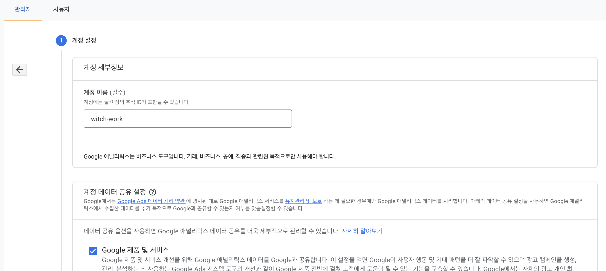
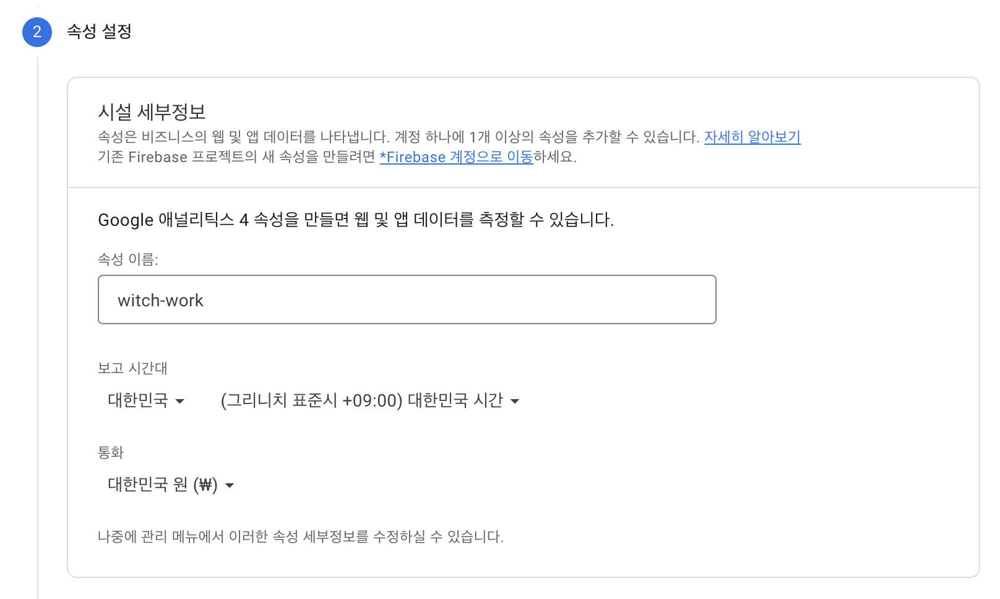

이 글은 내 새로운 블로그에 조회수를 다는 과정이다. 정보 전달을 위해 [이전 블로그에 조회수를 달다가 만 과정](https://witch.work/blog-adding-view-count/)에서 몇 가지를 복붙했다.

# 1. 글 옮기기

일단 글들을 전부 새 블로그로도 옮기자.

# 2. busuanzi

busuanzi라는 중국 서비스가 있는데 이를 이용하면 페이지와 블로그 조회수를 제일 쉽게 추가할 수 있다. 이 부분은 [예전에 내가 쓴 글](https://witch.work/blog-adding-view-count/)에서 복붙했다.

[fienestar님의 가이드](https://fienestar.github.io/blog/2020/05/24/busuanzi%EB%A5%BC-%EC%9D%B4%EC%9A%A9%ED%95%98%EC%97%AC-%EC%A0%95%EC%A0%81%EC%9D%B8-%ED%8E%98%EC%9D%B4%EC%A7%80%EC%97%90-%EC%8A%A4%ED%83%80%EC%9D%BC-%EB%B3%80%EA%B2%BD%EC%9D%B4-%EA%B0%80%EB%8A%A5%ED%95%9C-%EC%A1%B0%ED%9A%8C%EC%88%98-%EC%B6%94%EA%B0%80%ED%95%98%EA%B8%B0/)를 따라하면 된다. 단 내 블로그에 맞게 하기 위한 몇 가지 수정이 필요하다.

먼저 다음 코드를 사이트의 head 혹은 body에 추가해야 한다.

```html
<script async src = "//busuanzi.ibruce.info/busuanzi/2.3/busuanzi.pure.mini.js"></script>
```

내 블로그에는 `Seo`라는 컴포넌트가 있고 이는 블로그의 모든 페이지에 삽입된다. 그리고 이 `Seo` 컴포넌트는 react-helmet의 Helmet 컴포넌트로 이루어져 있는데 이 Helmet 컴포넌트는 head 태그에 들어가는 내용을 관리한다. (추가 : 아마 nextjs에선 Head 컴포넌트에 추가해 줘야 할 듯 싶다)

따라서 Helmet 컴포넌트 사이에 저 코드를 추가해 주면 된다.

```tsx
<Helmet
// SEO를 위한 메타 정보들이 들어가 있다.
// 여기서는 중요하지 않으므로 생략
>
  <script async src = '//busuanzi.ibruce.info/busuanzi/2.3/busuanzi.pure.mini.js'></script>
</Helmet>
```

## 2.1. 사이트 조회수와 방문자 수

사이트 조회수와 방문자 수는 다음 코드를 통해 추가할 수 있다. span에 붙은 id가 중요하다.

```html
<section style={{height:'20px'}}>
  조회수 <span id = 'busuanzi_value_site_pv' ></span> 회 <br />
  방문자 <span id = 'busuanzi_value_site_uv' ></span> 명
</section>
```

위 코드를 블로그의 페이지에 추가하면 된다. 내 블로그의 경우 메인 페이지를 나타내는 BlogIndex 컴포넌트에서 내 프로필 바로 아래에 추가했다.

이 조회수 표시를 위한 삽질을 하면서 블로그를 재구성해야겠다는 생각을 많이 했기 때문에 지금 굳이 스타일링을 하지는 않았다.

## 2.2. 페이지 조회수

단일 페이지의 조회수는 다음 코드로 추가한다.

```html
<span id="busuanzi_value_page_pv"></span>
```

이를 글 제목 아래에 적당히 추가하였다.

다른 삽질의 기록들은 아래에 적어두었다. 후에 블로그를 갈아엎을 때 이 지식을 쓰게 되길 바란다.

그리고 생각보다 빨리, 2달 만에 이 글을 다시 쓰게 되었다. 이번엔 nextjs이기 때문에 다시 쓴다.

# 3. google analytics로 조회수 달기

## 3.1. 계정 생성

구글 애널리틱스 계정을 새로 생성하자.



그리고 웹사이트 속성도 설정한다.



비즈니스 정보도 적당히 설정한 후 약관 등에 동의하고 계정 생성을 마친다.

## 3.2. 블로그 이전하기

그리고 이제 내 블로그도 꼴이 좀 갖춰졌으니 내가 가지고 있는 `witch.work` 도메인이 새로 만든 블로그로 연결되도록 하자.

지금은 내가 gatsby로 만들었던 블로그 페이지에 연결되어 있다.

다음과 같이 cloudflare pages 메뉴에 들어간다.


그리고 기존에 쓰던 프로젝트에 들어간 후 `사용자 설정 도메인`메뉴에서 `witch.work` 도메인을 삭제한다.

`witch-next-blog`에서 사용자 설정 도메인에 `witch.work`추가.

[next-blog-custom-domain](./next-blog-custom-domain.png)

## 3.2. 데이터 스트림과 태그 추가

그 다음 데이터 스트림 메뉴에 들어가서 페이지의 데이터 스트림을 추가해 주자.


어..그런데 다음과 같은 경고가 뜬다. 데이터 수집이 활성화되지 않았다고 한다.


# 참고

https://curryyou.tistory.com/508

https://mnxmnz.github.io/nextjs/google-analytics/

https://ha-young.github.io/2020/gatsby/Add-Google-Analytics/